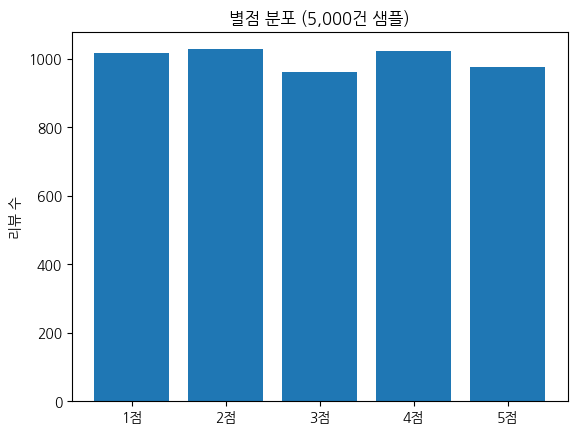

> ▶ **[Google Colab에서 이 장 실습 열기](https://colab.research.google.com/github/yoon-gu/neuqes-101/blob/master/01_tfidf/01_tfidf.ipynb)** — 브라우저에서 바로 실행해 볼 수 있습니다.

## 환경 준비

```python
!pip install -q datasets scikit-learn pandas matplotlib
```

```python
import numpy as np
import pandas as pd
import matplotlib.pyplot as plt
from datasets import load_dataset
from sklearn.feature_extraction.text import CountVectorizer, TfidfVectorizer

# matplotlib 한글 폰트 (Colab — NanumGothic). plot 의 한국어가 □ 로 깨지지 않게.
import matplotlib.font_manager as fm, subprocess, os
_fp = "/usr/share/fonts/truetype/nanum/NanumGothic.ttf"
if not os.path.exists(_fp):
    subprocess.run("apt-get -qq -y install fonts-nanum", shell=True)
fm.fontManager.addfont(_fp)
plt.rcParams["font.family"] = "NanumGothic"
plt.rcParams["axes.unicode_minus"] = False
```

`yelp_review_full`은 Yelp 식당 리뷰 65만 건에 1-5점 별점이 달린 데이터셋입니다 (라벨은 0-4로 저장됨). 학습 흐름을 가볍게 유지하기 위해 **5,000건만 무작위 샘플링** 합니다.

```python
dataset = load_dataset("Yelp/yelp_review_full")
print(dataset)
```

**▶ 실행 결과**

```text
DatasetDict({
    train: Dataset({
        features: ['label', 'text'],
        num_rows: 650000
    })
    test: Dataset({
        features: ['label', 'text'],
        num_rows: 50000
    })
})
```

**결과 해석**

train 65만 건 / test 5만 건이고, 각 예시는 `label`(0-4 정수)과 `text`(리뷰 원문) 두 칼럼뿐입니다. 이 중 train 에서 5,000건만 뽑아 씁니다.

```python
SAMPLE_SIZE = 5000
ds = dataset["train"].shuffle(seed=42).select(range(SAMPLE_SIZE))
df = ds.to_pandas()
```

**위 코드 읽기** `shuffle(seed=42).select(range(SAMPLE_SIZE))` 가 핵심입니다 — 65만 건을 무작위로 섞은 뒤 앞에서 5,000건만 잘라, 별점이 한쪽으로 쏠리지 않게 고르게 샘플링합니다. `seed=42` 로 섞기 때문에 누가 돌려도 같은 5,000건이 나와 재현성이 보장됩니다. 이어서 `to_pandas()` 로 Arrow 데이터셋을 다루기 익숙한 `DataFrame` 으로 바꿉니다.

```python
print(f"Sample count: {len(df)}")
df.head(3)
```

**▶ 실행 결과**

```text
Sample count: 5000
   label                                               text
0      4  I stalk this truck.  I've been to industrial p...
1      2  who really knows if this is good pho or not, i...
2      4  I LOVE Bloom Salon... all of their stylist are...
```

**결과 해석**

`label` 0-4 는 각각 별점 1-5점에 대응합니다(0 = 1점). 첫 세 건만 봐도 4점·2점·4점으로 별점이 섞여 있어, 무작위 샘플링이 제대로 됐음을 짐작할 수 있습니다.

별점이 다섯 등급에 고르게 퍼져 있는지 막대그래프로 확인합니다. 한쪽으로 쏠려 있으면 이후 분류·회귀에서 다수 클래스에 끌려가므로, 분포를 먼저 보는 습관이 중요합니다.

```python
counts = df["label"].value_counts().sort_index()
labels = [f"{i+1}점" for i in counts.index]
plt.bar(labels, counts.values)
plt.title("별점 분포 (5,000건 샘플)")
plt.ylabel("리뷰 수")
plt.show()
print(counts)
```

**위 코드 읽기** `value_counts().sort_index()` 로 별점별 개수를 세고, `[f"{i+1}점" for i in counts.index]` 로 저장값 0-4 인덱스를 사람이 읽는 `1점`-`5점` 라벨로 바꿔 막대그래프 x축에 붙입니다.

**▶ 실행 결과**



```text
label
0    1017
1    1027
2     960
3    1021
4     975
Name: count, dtype: int64
```

**결과 해석**

다섯 등급이 모두 960-1,027건으로 거의 균등합니다. 한쪽으로 쏠리지 않아, 이후 챕터에서 이 데이터를 분류·회귀에 쓸 때 클래스 불균형을 따로 걱정하지 않아도 됩니다.

리뷰가 보통 몇 단어 길이인지도 미리 봐 둡니다. 길이 분포는 이후 챕터에서 입력을 몇 토큰까지 자를지(`max_length`) 정하는 근거가 됩니다.

```python
df["len_words"] = df["text"].str.split().str.len()
df[["len_words"]].describe()
```

**위 코드 읽기** `str.split().str.len()` 은 각 리뷰를 공백으로 쪼개 단어 수를 센 새 칼럼 `len_words` 를 만들고, `describe()` 로 그 분포의 요약 통계를 출력합니다.

**▶ 실행 결과**

```text
         len_words
count  5000.000000
mean    133.811400
std     119.787704
min       1.000000
25%      53.000000
50%     100.000000
75%     177.000000
max     977.000000
```

**결과 해석**

중앙값이 100단어, 평균 134단어인데 최대 977단어까지 긴 꼬리가 있습니다. 리뷰 절반은 100단어 이하라 짧은 편이지만 일부는 매우 길어서, 이후 BERT 챕터에서 `max_length=128` 로 자르면 대부분은 온전히 담기고 일부 긴 리뷰만 잘리게 됩니다.
