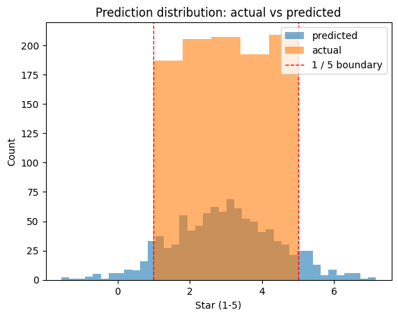

> ▶ **[Google Colab에서 이 장 실습 열기](https://colab.research.google.com/github/yoon-gu/neuqes-101/blob/master/02_sklearn_regression/02_sklearn_regression.ipynb)** — 브라우저에서 바로 실행해 볼 수 있습니다.

## 환경 준비

```python
!pip install -q datasets scikit-learn pandas matplotlib
```

```python
import numpy as np
import pandas as pd
import matplotlib.pyplot as plt
from datasets import load_dataset
from sklearn.feature_extraction.text import TfidfVectorizer
from sklearn.linear_model import LinearRegression
from sklearn.model_selection import train_test_split
from sklearn.metrics import mean_squared_error, mean_absolute_error, r2_score

plt.rcParams["axes.unicode_minus"] = False

dataset = load_dataset("Yelp/yelp_review_full")
SAMPLE_SIZE = 5000
ds = dataset["train"].shuffle(seed=42).select(range(SAMPLE_SIZE))
df = ds.to_pandas()
print(f"Sample count: {len(df)}")
```

**▶ 실행 결과**

```text
Sample count: 5000
```

```python
# 별점은 0-4로 저장돼 있으니 1-5로 변환
df["star"] = df["label"] + 1

# train / test split
X_text_train, X_text_test, y_train, y_test = train_test_split(
    df["text"], df["star"].astype(float),
    test_size=0.2, random_state=42,
)

# TF-IDF (Ch 1과 같은 설정)
tfidf = TfidfVectorizer(max_features=10000)
X_train = tfidf.fit_transform(X_text_train)
X_test = tfidf.transform(X_text_test)

print(f"X_train: {X_train.shape}, y_train: {y_train.shape}")
print(f"X_test:  {X_test.shape}, y_test:  {y_test.shape}")
```

**▶ 실행 결과**

```text
X_train: (4000, 10000), y_train: (4000,)
X_test:  (1000, 10000), y_test:  (1000,)
```

`LinearRegression`은 가중치 벡터 $w$와 편향 $b$를 학습해 다음을 출력합니다.

$$\hat y = w^\top x + b$$

활성화 함수 없음, 출력 범위 제한 없음. 정답 $y$와의 MSE를 최소화하도록 $w, b$를 푸는 게 학습의 전부입니다 (sklearn은 정규방정식으로 한 번에 풉니다).

```python
model = LinearRegression()
model.fit(X_train, y_train)

y_pred_train = model.predict(X_train)
y_pred_test = model.predict(X_test)

print(f"Train MSE: {mean_squared_error(y_train, y_pred_train):.4f}")
print(f"Test  MSE: {mean_squared_error(y_test,  y_pred_test):.4f}")
print(f"Test  MAE: {mean_absolute_error(y_test, y_pred_test):.4f}")
print(f"Test  R²:  {r2_score(y_test, y_pred_test):.4f}")
```

**▶ 실행 결과**

```text
Train MSE: 0.0000
Test  MSE: 1.5522
Test  MAE: 0.9929
Test  R²:  0.2161
```

**결과 해석**

Train MSE가 0인데 Test MSE는 1.55입니다 — 특징이 10,000개인데 학습 표본은 4,000개뿐이라 훈련 데이터를 통째로 외워 버린 과적합 신호입니다. Test R²도 0.22에 그쳐, 단어를 독립적으로 더하는 선형 모델이 별점 변동의 22%만 설명한다는 뜻입니다. 문맥을 읽는 모델이 왜 필요한지를 수치로 예고하는 셈입니다.

```python
# 예측값이 1-5 범위를 얼마나 벗어나는지 확인
print(f"Pred range: [{y_pred_test.min():.2f}, {y_pred_test.max():.2f}]")
print(f"True range: [{y_test.min():.0f}, {y_test.max():.0f}]")

plt.hist(y_pred_test, bins=40, alpha=0.6, label="predicted")
plt.hist(y_test, bins=5, alpha=0.6, label="actual")
plt.axvline(1, color="red", linestyle="--", linewidth=1, label="1 / 5 boundary")
plt.axvline(5, color="red", linestyle="--", linewidth=1)
plt.xlabel("Star (1-5)")
plt.ylabel("Count")
plt.legend()
plt.title("Prediction distribution: actual vs predicted")
plt.show()
```

**▶ 실행 결과**

```text
Pred range: [-1.27, 7.45]
True range: [1, 5]
```


