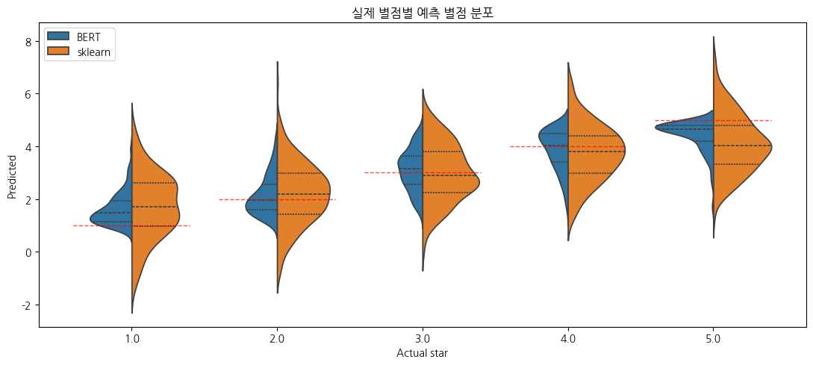
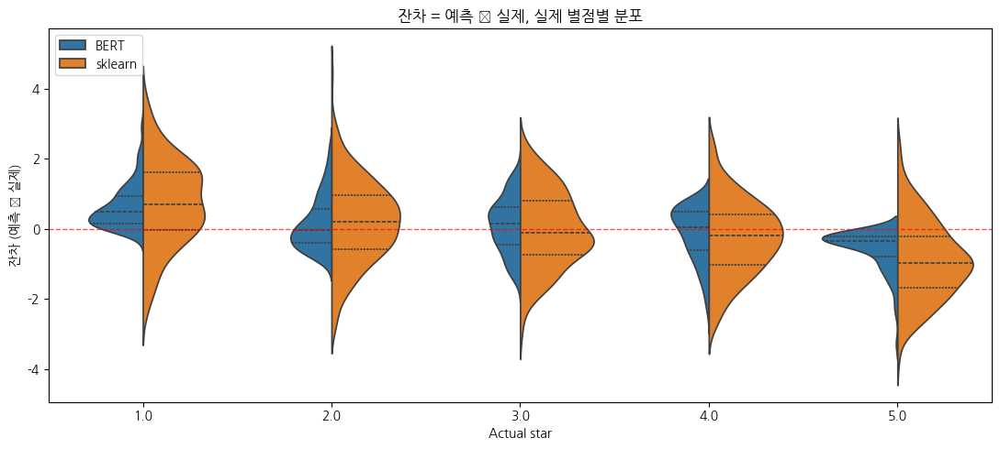

## 평가 — sklearn(Ch 2)과 직접 비교

학습된 BERT의 평가 지표를 같은 데이터에 sklearn `LinearRegression`(Ch 2 방식)으로 학습한 결과와 비교합니다. BERT가 더 정확하면 *문맥 정보가 단어 독립 가정을 깬다* 는 가설이 검증됩니다.

```python
# BERT 최종 평가 (eval_dataset 기준)
bert_metrics = trainer.evaluate()
print("BERT evaluation:")
for k, v in bert_metrics.items():
    if k.startswith("eval_") and isinstance(v, float):
        print(f"  {k:>20}: {v:.4f}")
```

**▶ 실행 결과**

```text
Training Loss  Validation Loss  Epoch  Mse       Mae       R2
0.576040       0.653909         2      0.653909  0.617953  0.664411
BERT evaluation:
             eval_loss: 0.6539
              eval_mse: 0.6539
              eval_mae: 0.6180
               eval_r2: 0.6644
```

**결과 해석**

`eval_loss` 와 `eval_mse` 가 0.6539로 같습니다 — 회귀 loss가 곧 MSE이기 때문입니다. MAE 0.618은 평균적으로 별점을 약 0.6점 틀린다는 뜻이고, R² 0.664는 별점 분산의 약 66%를 설명한다는 의미입니다.

같은 데이터를 Ch 2 방식(TF-IDF + `LinearRegression`)으로도 학습해 BERT와 직접 견줍니다.

```python
# 같은 4,000건으로 sklearn LinearRegression 학습 (Ch 2 방식)
from sklearn.feature_extraction.text import TfidfVectorizer
from sklearn.linear_model import LinearRegression

# 토큰화 전 원문 회수
train_texts = train_ds["text"]
train_labels = np.array([float(l) + 1.0 for l in train_ds["label"]])
eval_texts = eval_ds["text"]
eval_labels = np.array([float(l) + 1.0 for l in eval_ds["label"]])

tfidf = TfidfVectorizer(max_features=10000)
X_tr = tfidf.fit_transform(train_texts)
X_ev = tfidf.transform(eval_texts)

linreg = LinearRegression().fit(X_tr, train_labels)
sk_pred = linreg.predict(X_ev)

print("sklearn LinearRegression evaluation:")
print(f"  mse: {mean_squared_error(eval_labels, sk_pred):.4f}")
print(f"  mae: {mean_absolute_error(eval_labels, sk_pred):.4f}")
print(f"  r2:  {r2_score(eval_labels, sk_pred):.4f}")
```

**▶ 실행 결과**

```text
sklearn LinearRegression evaluation:
  mse: 1.5597
  mae: 1.0086
  r2:  0.1996
```

```python
# 한 표로 비교
rows = [
    {"model": "sklearn LinearRegression",
     "mse": mean_squared_error(eval_labels, sk_pred),
     "mae": mean_absolute_error(eval_labels, sk_pred),
     "r2":  r2_score(eval_labels, sk_pred)},
    {"model": "DistilBERT fine-tuned",
     "mse": bert_metrics["eval_mse"],
     "mae": bert_metrics["eval_mae"],
     "r2":  bert_metrics["eval_r2"]},
]
pd.DataFrame(rows).round(4)
```

**▶ 실행 결과**

```text
                      model     mse     mae      r2
0  sklearn LinearRegression  1.5597  1.0086  0.1996
1     DistilBERT fine-tuned  0.6539  0.6180  0.6644
```

**결과 해석**

세 지표 모두 BERT가 크게 앞섭니다 — MSE 1.56 → 0.65, MAE 1.01 → 0.62, R² 0.20 → 0.66. 문맥을 attention으로 읽는 BERT가 단어 빈도만 보는 TF-IDF 회귀보다 별점을 훨씬 정확히 맞춘다는 가설이 이 수치로 확인됩니다.

**해석 가이드** (실제 숫자는 random seed에 따라 조금씩 다릅니다):

- BERT의 MSE가 sklearn보다 작다면, *문맥을 활용한 회귀가 단어 독립 회귀보다 정확하다* 는 직관이 확인됩니다.
- BERT의 R²가 더 높다면 평균 예측이 데이터 분산을 더 잘 설명합니다.
- 차이가 크지 않다면? Yelp 별점은 단어 빈도(긍정 단어 vs 부정 단어)만으로도 꽤 잡히는 task라 그런 경우가 있습니다. *문맥 활용 효과* 가 크게 드러나는 task는 Ch 14 auxiliary나 Ch 15 한국어 NSMC 쪽이 더 명확할 수 있습니다.

시각화에 쓸 예측값을 모읍니다. `Trainer.predict` 로 BERT 예측을 받아 sklearn 예측과 한 long-form DataFrame으로 합칩니다.

```python
# BERT 예측값 직접 받기 (별도 evaluate 호출이지만 빠름)
preds_output = trainer.predict(eval_tok)
bert_pred = preds_output.predictions.flatten()

# seaborn 비교용 long-form DataFrame
df_compare = pd.DataFrame({
    "Actual star": np.concatenate([eval_labels, eval_labels]),
    "Predicted":   np.concatenate([bert_pred,   sk_pred]),
    "Model":       ["BERT"] * len(eval_labels) + ["sklearn"] * len(eval_labels),
})
df_compare["Residual"] = df_compare["Predicted"] - df_compare["Actual star"]
```

### 시각 1 — 예측 분포 per actual class

각 actual class에 대해 BERT와 sklearn이 *어떤 값을 출력했는지* 의 분포를 split violin으로 좌우에 둡니다. 빨간 점선이 ideal (정답 = 예측). 분포 중심이 그 선 근처에 모이고 좌우 폭이 좁을수록 정확합니다.

실제 별점별로 두 모델이 어떤 값을 출력했는지 split violin으로 좌우에 둡니다. 빨간 점선이 이상적인 정답선(정답 = 예측)입니다.

```python
fig, ax = plt.subplots(figsize=(11, 5))
sns.violinplot(
    data=df_compare, x="Actual star", y="Predicted", hue="Model",
    split=True, inner="quart", ax=ax,
)
for i, x_val in enumerate([1, 2, 3, 4, 5]):
    ax.plot([i - 0.4, i + 0.4], [x_val, x_val], "r--", linewidth=1, alpha=0.7)
ax.set_title("실제 별점별 예측 별점 분포")
ax.legend(loc="upper left")
plt.tight_layout()
plt.show()
```

**▶ 실행 결과**



**무엇이 보이나**

- BERT 쪽 violin이 더 가늘고 빨간 점선 근처에 모이면 같은 actual class 안에서 예측 일관성이 높다는 뜻.
- 두 끝(1점, 5점)에서 분포 중심이 안쪽으로 살짝 치우치는 모양이 자주 보입니다 — 모델이 *중앙 쪽으로 회귀(regression to the mean)* 하는 경향.
- sklearn 쪽 violin이 더 두텁고 길게 늘어진다면 outlier 예측이 많다는 신호.

이 그래프는 "모델이 무엇을 출력하나"의 *raw 분포* 를 봅니다. 다음 그래프는 *오차 자체* 에 집중합니다.

### 시각 2 — 잔차(Residual = Predicted − Actual) 분포 per actual class

`Predicted − Actual` 을 y축에 두고 0 기준선을 긋습니다. 잔차가 0 근처에 좁게 모일수록 정확하고, 양/음 한 쪽으로 치우치면 *bias* 가 있다는 뜻.

이번엔 잔차(예측 − 실제)를 y축에 둡니다. 0 기준선에 좁게 모일수록 정확하고, 한쪽으로 치우치면 bias가 있다는 뜻입니다.

```python
fig, ax = plt.subplots(figsize=(11, 5))
sns.violinplot(
    data=df_compare, x="Actual star", y="Residual", hue="Model",
    split=True, inner="quart", ax=ax,
)
ax.axhline(0, color="red", linestyle="--", linewidth=1, alpha=0.7)
ax.set_title("잔차 = 예측 − 실제, 실제 별점별 분포")
ax.set_ylabel("잔차 (예측 − 실제)")
ax.legend(loc="upper left")
plt.tight_layout()
plt.show()
```

**▶ 실행 결과**



**무엇이 보이나**

- 잔차의 *중심* 이 0 위/아래 어디에 있는지가 *bias의 방향*. 1점 class에서 잔차 중심이 +쪽이면 모델이 "1점인데 1점보다 높게" 예측하는 경향이 있다는 뜻.
- 잔차의 *폭* 이 그 class에서의 일반적 오차 크기. BERT가 sklearn보다 좁다면 더 정확.
- 두 끝 class(1점, 5점)에서 잔차 중심이 *반대 방향* (1점은 +, 5점은 −)으로 치우치는 패턴이 자주 보입니다 — 위에서 본 *regression to the mean* 의 잔차 시각화 형태.
- 0 기준선에서 멀리 늘어진 꼬리는 큰 오차를 내는 outlier 샘플들. 어느 모델이 꼬리가 더 두꺼운지 비교.

**두 시각을 함께 보는 이유**: 시각 1은 *모델이 무엇을 출력하나* (raw 분포), 시각 2는 *얼마나 틀렸나* (오차 분포). 같은 데이터의 다른 시점이라 한쪽만 봐서는 놓치는 패턴이 있습니다. 정량 지표(MSE/MAE/R²) 표와 이 두 시각을 함께 읽으면 회귀 평가가 입체적이 됩니다.
