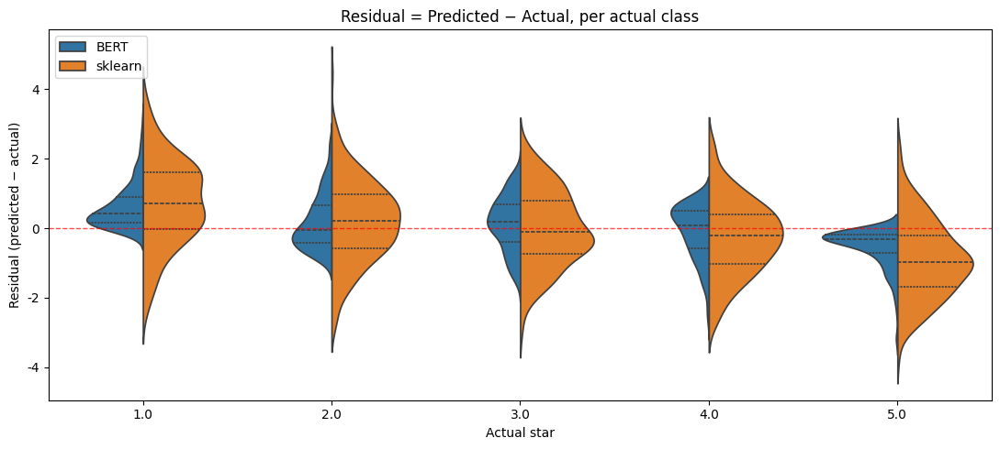

> ▶ **[Google Colab에서 이 장 실습 열기](https://colab.research.google.com/github/yoon-gu/neuqes-101/blob/master/09_bert_regression/09_bert_regression.ipynb)** — 브라우저에서 바로 실행해 볼 수 있습니다.

## 환경 준비

```python
!pip install -q transformers datasets
```

```python
import warnings
warnings.filterwarnings("ignore")

import numpy as np
import pandas as pd
import matplotlib.pyplot as plt
import seaborn as sns
import torch
from datasets import load_dataset
from transformers import (
    AutoTokenizer, AutoModelForSequenceClassification,
    Trainer, TrainingArguments,
)
from sklearn.metrics import mean_squared_error, mean_absolute_error, r2_score

plt.rcParams["axes.unicode_minus"] = False

print(f"PyTorch:        {torch.__version__}")
print(f"CUDA available: {torch.cuda.is_available()}")
if torch.cuda.is_available():
    print(f"GPU:             {torch.cuda.get_device_name(0)}")
else:
    print("Warning: CPU runtime — training will be very slow. Switch to T4 recommended.")
```

**▶ 실행 결과**

```text
PyTorch:        2.11.0+cu128
CUDA available: True
GPU:             Tesla T4
```

```python
!nvidia-smi
```

**▶ 실행 결과**

```text
Wed Jun 17 21:30:31 2026       
+-----------------------------------------------------------------------------------------+
| NVIDIA-SMI 580.82.07              Driver Version: 580.82.07      CUDA Version: 13.0     |
+-----------------------------------------+------------------------+----------------------+
| GPU  Name                 Persistence-M | Bus-Id          Disp.A | Volatile Uncorr. ECC |
| Fan  Temp   Perf          Pwr:Usage/Cap |           Memory-Usage | GPU-Util  Compute M. |
|                                         |                        |               MIG M. |
|=========================================+========================+======================|
|   0  Tesla T4                       Off |   00000000:00:04.0 Off |                    0 |
| N/A   39C    P8             10W /   70W |       3MiB /  15360MiB |      0%      Default |
|                                         |                        |                  N/A |
+-----------------------------------------+------------------------+----------------------+

+-----------------------------------------------------------------------------------------+
| Processes:                                                                              |
|  GPU   GI   CI              PID   Type   Process name                        GPU Memory |
|        ID   ID                                                               Usage      |
|=========================================================================================|
|  No running processes found                                                             |
+-----------------------------------------------------------------------------------------+
```

DistilBERT 토크나이저를 불러오고 Yelp 리뷰에서 train 4,000건·eval 1,000건만 뽑아, 별점(0-4)을 1-5 float 라벨로 바꿔 토큰화합니다.

```python
tokenizer = AutoTokenizer.from_pretrained("distilbert-base-uncased")

ds = load_dataset("Yelp/yelp_review_full")

# train 4,000 + eval 1,000 — T4 30분 안에 학습 끝나도록 작게
train_ds = ds["train"].shuffle(seed=42).select(range(4000))
eval_ds  = ds["test"].shuffle(seed=42).select(range(1000))

def tokenize_fn(batch):
    out = tokenizer(batch["text"], truncation=True, max_length=128)
    # label(0-4) → 별점(1-5) float 으로 변환. Trainer는 'labels' 컬럼을 사용
    out["labels"] = [float(lbl) + 1.0 for lbl in batch["label"]]
    return out

train_tok = train_ds.map(tokenize_fn, batched=True).remove_columns(["text", "label"])
eval_tok  = eval_ds.map(tokenize_fn,  batched=True).remove_columns(["text", "label"])

print(train_tok)
print(f"\nFirst sample label: {train_tok[0]['labels']}  (float)")
```

**▶ 실행 결과**

```text
Dataset({
    features: ['input_ids', 'token_type_ids', 'attention_mask', 'labels'],
    num_rows: 4000
})

First sample label: 5.0  (float)
```

출력 차원 1짜리 회귀 헤드를 단 DistilBERT 분류 모델을 만들고 파라미터 수와 헤드 구조, problem_type을 확인합니다.

```python
model = AutoModelForSequenceClassification.from_pretrained(
    "distilbert-base-uncased",
    num_labels=1,
    problem_type="regression",
)
print(f"Parameters:    {sum(p.numel() for p in model.parameters()):,}")
print(f"Classifier:    {model.classifier}")
print(f"problem_type:  {model.config.problem_type}")
```

**▶ 실행 결과**

```text
[transformers] DistilBertForSequenceClassification LOAD REPORT from: distilbert-base-uncased
Key                     | Status     | 
------------------------+------------+-
vocab_transform.bias    | UNEXPECTED | 
vocab_layer_norm.bias   | UNEXPECTED | 
vocab_projector.bias    | UNEXPECTED | 
vocab_layer_norm.weight | UNEXPECTED | 
vocab_transform.weight  | UNEXPECTED | 
classifier.weight       | MISSING    | 
pre_classifier.weight   | MISSING    | 
pre_classifier.bias     | MISSING    | 
classifier.bias         | MISSING    | 

Notes:
- UNEXPECTED:	can be ignored when loading from different task/architecture; not ok if you expect identical arch.
- MISSING:	those params were newly initialized because missing from the checkpoint. Consider training on your downstream task.
Parameters:    66,954,241
Classifier:    Linear(in_features=768, out_features=1, bias=True)
problem_type:  regression
```

**결과 해석**

num_labels=1 + problem_type="regression"을 주니 분류 헤드가 768→1 Linear 한 줄이 되고 Trainer가 자동으로 MSELoss를 씁니다. Ch 2의 선형 회귀 위에 DistilBERT 본체가 특징 추출기로 얹힌 구조입니다.

전체·학습 가능·동결 파라미터 수를 세는 헬퍼를 정의하고 현재 모델은 모든 층이 학습 대상임을 확인합니다.

```python
def param_summary(m):
    total     = sum(p.numel() for p in m.parameters())
    trainable = sum(p.numel() for p in m.parameters() if p.requires_grad)
    frozen    = total - trainable
    return total, trainable, frozen

total, trainable, frozen = param_summary(model)
print(f"Total parameters:     {total:>13,}  ({total/1e6:.1f} M)")
print(f"Trainable parameters: {trainable:>13,}  ({trainable/1e6:.1f} M, {trainable/total:.1%})")
print(f"Frozen parameters:    {frozen:>13,}  ({frozen/1e6:.1f} M, {frozen/total:.1%})")
print(f"\nDefault — all layers are trainable")
```

**▶ 실행 결과**

```text
Total parameters:        66,954,241  (67.0 M)
Trainable parameters:    66,954,241  (67.0 M, 100.0%)
Frozen parameters:                0  (0.0 M, 0.0%)

Default — all layers are trainable
```

시연용으로 모델을 하나 더 만들어 BERT 본체를 동결했을 때 학습 대상이 분류 헤드만 남는 것을 보여주고, 다 쓴 모델은 메모리에서 비웁니다.

```python
# 시연용 — 같은 모델을 한 번 더 만들고 BERT 본체를 동결
demo_model = AutoModelForSequenceClassification.from_pretrained(
    "distilbert-base-uncased", num_labels=1, problem_type="regression",
)

# distilbert 본체의 모든 파라미터에 requires_grad=False 설정
for p in demo_model.distilbert.parameters():
    p.requires_grad = False

# 분류 헤드는 학습 대상으로 그대로 둠 (default가 True)

t, tr, fr = param_summary(demo_model)
print(f"After freezing BERT body:")
print(f"  Total:       {t:>13,}")
print(f"  Trainable:   {tr:>13,}  ({tr/t:.1%})  ← classification head only")
print(f"  Frozen:      {fr:>13,}  ({fr/t:.1%})  ← BERT body")
print(f"\nOnly {tr:,} classification head parameters update — fast, low memory.")
print(f"Tradeoff: BERT body cannot adapt to the task — usually train the body too if data is sufficient.")
print(f"\n(This demo model is not used for the actual training — del demo_model frees memory.)")

import gc
del demo_model
gc.collect()
if torch.cuda.is_available():
    torch.cuda.empty_cache()
```

**▶ 실행 결과**

```text
[transformers] DistilBertForSequenceClassification LOAD REPORT from: distilbert-base-uncased
Key                     | Status     | 
------------------------+------------+-
vocab_transform.bias    | UNEXPECTED | 
vocab_layer_norm.bias   | UNEXPECTED | 
vocab_projector.bias    | UNEXPECTED | 
vocab_layer_norm.weight | UNEXPECTED | 
vocab_transform.weight  | UNEXPECTED | 
classifier.weight       | MISSING    | 
pre_classifier.weight   | MISSING    | 
pre_classifier.bias     | MISSING    | 
classifier.bias         | MISSING    | 

Notes:
- UNEXPECTED:	can be ignored when loading from different task/architecture; not ok if you expect identical arch.
- MISSING:	those params were newly initialized because missing from the checkpoint. Consider training on your downstream task.
After freezing BERT body:
  Total:          66,954,241
  Trainable:         591,361  (0.9%)  ← classification head only
  Frozen:         66,362,880  (99.1%)  ← BERT body

Only 591,361 classification head parameters update — fast, low memory.
Tradeoff: BERT body cannot adapt to the task — usually train the body too if data is sufficient.

(This demo model is not used for the actual training — del demo_model frees memory.)
```

```python
!nvidia-smi
```

**▶ 실행 결과**

```text
Wed Jun 17 21:31:10 2026       
+-----------------------------------------------------------------------------------------+
| NVIDIA-SMI 580.82.07              Driver Version: 580.82.07      CUDA Version: 13.0     |
+-----------------------------------------+------------------------+----------------------+
| GPU  Name                 Persistence-M | Bus-Id          Disp.A | Volatile Uncorr. ECC |
| Fan  Temp   Perf          Pwr:Usage/Cap |           Memory-Usage | GPU-Util  Compute M. |
|                                         |                        |               MIG M. |
|=========================================+========================+======================|
|   0  Tesla T4                       Off |   00000000:00:04.0 Off |                    0 |
| N/A   41C    P8             13W /   70W |       3MiB /  15360MiB |      0%      Default |
|                                         |                        |                  N/A |
+-----------------------------------------+------------------------+----------------------+

+-----------------------------------------------------------------------------------------+
| Processes:                                                                              |
|  GPU   GI   CI              PID   Type   Process name                        GPU Memory |
|        ID   ID                                                               Usage      |
|=========================================================================================|
|  No running processes found                                                             |
+-----------------------------------------------------------------------------------------+
```

T4에서 30분 안에 끝나도록 에폭·배치 크기·learning rate·fp16 등 학습 인자를 정합니다.

```python
training_args = TrainingArguments(
    output_dir="./ch09_output",
    num_train_epochs=2,                 # 2 에폭이면 T4에서 5-8분
    per_device_train_batch_size=16,     # T4 16GB에 안전
    per_device_eval_batch_size=32,
    learning_rate=2e-5,                 # BERT 파인튜닝 표준
    fp16=True,                          # T4 GPU 효율 (bf16은 T4 미지원)
    eval_strategy="epoch",              # 에폭마다 평가
    logging_steps=50,                   # 50 step마다 loss 출력
    save_strategy="no",                 # 체크포인트 저장 안 함 (디스크·VRAM 절약)
    report_to="none",                   # wandb 등 외부 로깅 비활성
    seed=42,
)

print(f"Total training steps: {len(train_tok) // training_args.per_device_train_batch_size * training_args.num_train_epochs}")
```

**▶ 실행 결과**

```text
Total training steps: 500
```

평가 때 MSE·MAE·R²를 계산하도록 compute_metrics 함수를 정의합니다.

```python
# 평가 지표를 직접 정의 — sklearn 헬퍼 그대로 활용
def compute_metrics(eval_pred):
    preds, labels = eval_pred
    preds = preds.flatten()
    return {
        "mse": float(mean_squared_error(labels, preds)),
        "mae": float(mean_absolute_error(labels, preds)),
        "r2":  float(r2_score(labels, preds)),
    }
```

모델·인자·데이터셋·지표를 묶어 Trainer를 만들고 실제 파인튜닝을 실행합니다.

```python
trainer = Trainer(
    model=model,
    args=training_args,
    train_dataset=train_tok,
    eval_dataset=eval_tok,
    processing_class=tokenizer,         # ← 이 한 줄이 DataCollatorWithPadding 을 자동 생성
                                        # (transformers 4.46+ 의 새 인자명. 그 이전엔 tokenizer=tokenizer)
    compute_metrics=compute_metrics,
)

train_result = trainer.train()
print(f"\nTraining done — mean train loss: {train_result.training_loss:.4f}")
```

**▶ 실행 결과**

```text
<IPython.core.display.HTML object>
Training done — mean train loss: 1.0480
```

```python
!nvidia-smi
```

**▶ 실행 결과**

```text
Wed Jun 17 21:31:42 2026       
+-----------------------------------------------------------------------------------------+
| NVIDIA-SMI 580.82.07              Driver Version: 580.82.07      CUDA Version: 13.0     |
+-----------------------------------------+------------------------+----------------------+
| GPU  Name                 Persistence-M | Bus-Id          Disp.A | Volatile Uncorr. ECC |
| Fan  Temp   Perf          Pwr:Usage/Cap |           Memory-Usage | GPU-Util  Compute M. |
|                                         |                        |               MIG M. |
|=========================================+========================+======================|
|   0  Tesla T4                       Off |   00000000:00:04.0 Off |                    0 |
| N/A   62C    P0             72W /   70W |    1573MiB /  15360MiB |     71%      Default |
|                                         |                        |                  N/A |
+-----------------------------------------+------------------------+----------------------+

+-----------------------------------------------------------------------------------------+
| Processes:                                                                              |
|  GPU   GI   CI              PID   Type   Process name                        GPU Memory |
|        ID   ID                                                               Usage      |
|=========================================================================================|
|    0   N/A  N/A            9753      C   /usr/bin/python3                       1570MiB |
+-----------------------------------------------------------------------------------------+
```

학습된 모델을 eval 셋으로 평가해 MSE·MAE·R² 최종 지표를 출력합니다.

```python
# BERT 최종 평가 (eval_dataset 기준)
bert_metrics = trainer.evaluate()
print("BERT evaluation:")
for k, v in bert_metrics.items():
    if k.startswith("eval_") and isinstance(v, float):
        print(f"  {k:>20}: {v:.4f}")
```

**▶ 실행 결과**

```text
<IPython.core.display.HTML object>
<IPython.core.display.HTML object>
BERT evaluation:
             eval_loss: 0.6467
              eval_mse: 0.6467
              eval_mae: 0.6115
               eval_r2: 0.6681
```

**결과 해석**

2 에폭 파인튜닝 뒤 eval MSE 0.65, R² 0.67입니다. 별점을 평균 ±0.61(MAE) 안에서 맞힌다는 뜻이고, eval_loss와 eval_mse가 같은 값인 데서 회귀 손실이 곧 MSE임을 확인할 수 있습니다.

비교 기준으로 같은 4,000건에 TF-IDF + sklearn LinearRegression을 학습해 같은 지표로 평가합니다.

```python
# 같은 4,000건으로 sklearn LinearRegression 학습 (Ch 2 방식)
from sklearn.feature_extraction.text import TfidfVectorizer
from sklearn.linear_model import LinearRegression

# 토큰화 전 원문 회수
train_texts = train_ds["text"]
train_labels = np.array([float(l) + 1.0 for l in train_ds["label"]])
eval_texts = eval_ds["text"]
eval_labels = np.array([float(l) + 1.0 for l in eval_ds["label"]])

tfidf = TfidfVectorizer(max_features=10000)
X_tr = tfidf.fit_transform(train_texts)
X_ev = tfidf.transform(eval_texts)

linreg = LinearRegression().fit(X_tr, train_labels)
sk_pred = linreg.predict(X_ev)

print("sklearn LinearRegression evaluation:")
print(f"  mse: {mean_squared_error(eval_labels, sk_pred):.4f}")
print(f"  mae: {mean_absolute_error(eval_labels, sk_pred):.4f}")
print(f"  r2:  {r2_score(eval_labels, sk_pred):.4f}")
```

**▶ 실행 결과**

```text
sklearn LinearRegression evaluation:
  mse: 1.5597
  mae: 1.0086
  r2:  0.1996
```

sklearn과 DistilBERT의 MSE·MAE·R²를 한 DataFrame으로 나란히 비교합니다.

```python
# 한 표로 비교
rows = [
    {"model": "sklearn LinearRegression",
     "mse": mean_squared_error(eval_labels, sk_pred),
     "mae": mean_absolute_error(eval_labels, sk_pred),
     "r2":  r2_score(eval_labels, sk_pred)},
    {"model": "DistilBERT fine-tuned",
     "mse": bert_metrics["eval_mse"],
     "mae": bert_metrics["eval_mae"],
     "r2":  bert_metrics["eval_r2"]},
]
pd.DataFrame(rows).round(4)
```

**▶ 실행 결과**

```text
                      model     mse     mae      r2
0  sklearn LinearRegression  1.5597  1.0086  0.1996
1     DistilBERT fine-tuned  0.6467  0.6115  0.6681
```

**결과 해석**

같은 4,000건·같은 별점 회귀인데 DistilBERT의 R²(0.67)가 sklearn TF-IDF(0.20)의 세 배가 넘고 MSE는 절반 이하입니다. 단어 빈도만 세는 선형 모델과 달리 문맥을 읽는 사전학습 표현이 회귀에서도 큰 차이를 만든다는 걸 보여줍니다.

BERT 예측값을 받아 sklearn 예측과 함께 실제 별점·예측·잔차를 담은 long-form DataFrame으로 정리합니다.

```python
# BERT 예측값 직접 받기 (별도 evaluate 호출이지만 빠름)
preds_output = trainer.predict(eval_tok)
bert_pred = preds_output.predictions.flatten()

# seaborn 비교용 long-form DataFrame
df_compare = pd.DataFrame({
    "Actual star": np.concatenate([eval_labels, eval_labels]),
    "Predicted":   np.concatenate([bert_pred,   sk_pred]),
    "Model":       ["BERT"] * len(eval_labels) + ["sklearn"] * len(eval_labels),
})
df_compare["Residual"] = df_compare["Predicted"] - df_compare["Actual star"]
```

**▶ 실행 결과**

```text
<IPython.core.display.HTML object>
```

실제 별점별 예측 분포를 두 모델로 나눠 split 바이올린 플롯으로 그리고 기준선을 함께 표시합니다.

```python
fig, ax = plt.subplots(figsize=(11, 5))
sns.violinplot(
    data=df_compare, x="Actual star", y="Predicted", hue="Model",
    split=True, inner="quart", ax=ax,
)
for i, x_val in enumerate([1, 2, 3, 4, 5]):
    ax.plot([i - 0.4, i + 0.4], [x_val, x_val], "r--", linewidth=1, alpha=0.7)
ax.set_title("Predicted star distribution per actual class")
ax.legend(loc="upper left")
plt.tight_layout()
plt.show()
```

**▶ 실행 결과**


**결과 해석**

BERT(왼쪽 반)는 실제 별점이 오를수록 예측 분포도 따라 올라가 빨간 기준선에 가깝게 붙지만, sklearn(오른쪽 반)은 가운데로 뭉쳐 1점·5점 극단을 잘 못 맞힙니다.

이번에는 잔차(예측 − 실제)의 분포를 실제 별점별로 바이올린 플롯으로 그려 두 모델의 편향을 비교합니다.

```python
fig, ax = plt.subplots(figsize=(11, 5))
sns.violinplot(
    data=df_compare, x="Actual star", y="Residual", hue="Model",
    split=True, inner="quart", ax=ax,
)
ax.axhline(0, color="red", linestyle="--", linewidth=1, alpha=0.7)
ax.set_title("Residual = Predicted − Actual, per actual class")
ax.set_ylabel("Residual (predicted − actual)")
ax.legend(loc="upper left")
plt.tight_layout()
plt.show()
```

**▶ 실행 결과**



**결과 해석**

잔차(예측−실제)가 BERT는 0 선 근처에 좁게 모이는데 sklearn은 1점에서 양(+)으로, 5점에서 음(−)으로 크게 치우칩니다. 선형 모델이 극단 별점을 평균 쪽으로 끌어당기는 회귀 특유의 편향이 그대로 보입니다.
