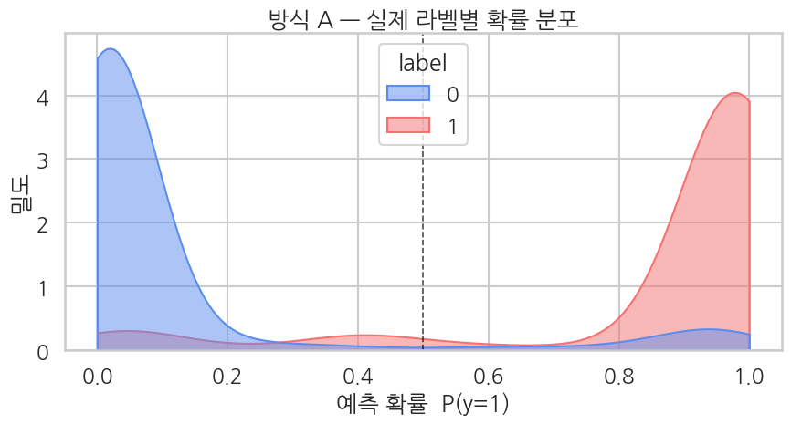
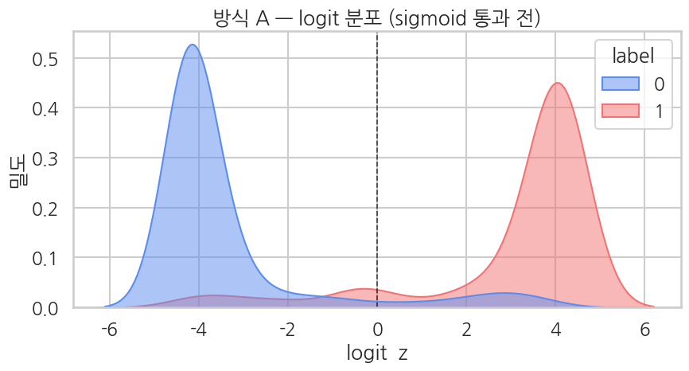

## 평가 — sigmoid 확률 분포 직접 확인

`Trainer.predict()` 로 logit을 받아 sigmoid를 통과시킨 확률 분포를 살펴봅니다.

```python
# 평가 metric
eval_metrics = trainer.evaluate()
print("BERT method A evaluation:")
for k, v in eval_metrics.items():
    if k.startswith("eval_") and isinstance(v, float):
        print(f"  {k:>20}: {v:.4f}")
```

**▶ 실행 결과**

```text
<IPython.core.display.HTML object>
<IPython.core.display.HTML object>
BERT method A evaluation:
             eval_loss: 0.2759
         eval_accuracy: 0.8980
        eval_precision: 0.8981
           eval_recall: 0.8787
               eval_f1: 0.8883
              eval_auc: 0.9680
```

**결과 해석**

평가 정확도 약 89.8%, F1 0.888, AUC 0.968로 방식 A가 binary 분류를 잘 학습했습니다. AUC가 0.97에 가깝다는 건 임계값을 어디에 두든 두 클래스가 확률적으로 잘 분리된다는 뜻입니다. Ch 11에서 학습할 방식 B(softmax+CE)와 비교할 기준선이 됩니다.

`Trainer.predict()` 로 평가셋의 raw logit을 받아 sigmoid로 확률을 만들고, 처음 5개 샘플의 logit·확률·예측을 정답과 나란히 봅니다.

```python
# logit → 확률
preds_output = trainer.predict(eval_tok)
logits = preds_output.predictions.flatten()
probs  = 1.0 / (1.0 + np.exp(-logits))
labels = preds_output.label_ids.flatten().astype(int)

print(f"Logit range: [{logits.min():.2f}, {logits.max():.2f}]")
print(f"Prob range:  [{probs.min():.4f}, {probs.max():.4f}]")
print(f"Positive prediction rate (prob >= 0.5): {(probs >= 0.5).mean():.1%}")
print(f"\nFirst 5 samples:")
print(pd.DataFrame({
    "label": labels[:5],
    "logit": logits[:5].round(2),
    "prob":  probs[:5].round(4),
    "pred":  (probs[:5] >= 0.5).astype(int),
}).to_string(index=False))
```

**▶ 실행 결과**

```text
<IPython.core.display.HTML object>
Logit range: [-4.41, 4.26]
Prob range:  [0.0120, 0.9861]
Positive prediction rate (prob >= 0.5): 45.1%

First 5 samples:
 label  logit   prob  pred
     1   3.70 0.9758     1
     0  -3.38 0.0331     0
     1   4.18 0.9849     1
     1   3.87 0.9796     1
     1   4.21 0.9854     1
```

**결과 해석**

logit이 약 -4.4 ~ +4.3 범위로 뻗어, sigmoid 통과 후 확률은 0.01 ~ 0.99 양 끝에 압착됩니다. 처음 5개 모두 정답과 예측이 일치하며 확률도 0.03 또는 0.97처럼 자신감 있게 한쪽으로 쏠려 있습니다 — sigmoid가 큰 logit을 0/1로 포화시키는 성질이 그대로 드러납니다.

### 4-1. 메인 그림 — *확률 공간* 에서 라벨별 분포 (`seaborn.kdeplot`)

`seaborn.kdeplot` 으로 *부드러운* 분포를 그립니다. histogram이 막대로 끊기는 반면 KDE는 연속 곡선이라 두 분포가 어디서 만나는지(=오분류 영역)가 한눈에 들어옵니다.

이 그림에서 봐야 할 세 가지:

- **양 끝 봉우리**: 학습이 잘 되면 라벨 0의 확률은 0 근처에, 라벨 1의 확률은 1 근처에 몰립니다 — sigmoid가 큰 음수 logit을 0에, 큰 양수 logit을 1에 *압착* 시키기 때문 ($\sigma(z) = 1/(1+e^{-z})$ 의 양 극단 포화).
- **0.5 근처의 교차 영역**: 두 곡선이 만나는 부분이 모델이 헷갈려하는 샘플들. 면적이 작을수록 분리가 잘 된 것.
- **반대쪽 꼬리**: 라벨 0인데 확률 1쪽에, 라벨 1인데 확률 0쪽에 잡히는 작은 봉우리는 *오분류*. 이 두 꼬리가 학습 손실(BCE)이 가장 크게 잡히는 영역.

```python
# 메인: 확률 공간 KDE — seaborn으로 부드러운 분포 + 라벨별 hue
sns.set_theme(style="whitegrid", context="talk", font="NanumGothic", rc={"axes.unicode_minus": False})

df = pd.DataFrame({"prob": probs, "logit": logits, "label": labels})
PAL = {0: "#5B8DEF", 1: "#F47272"}  # 파랑=negative, 빨강=positive

fig, ax = plt.subplots(figsize=(9, 5))
sns.kdeplot(
    data=df, x="prob", hue="label",
    fill=True, common_norm=False, alpha=0.5,
    palette=PAL, clip=(0, 1), ax=ax,
)
ax.axvline(0.5, color="black", lw=1.2, ls="--", alpha=0.7)
ax.set_title("방식 A — 실제 라벨별 확률 분포")
ax.set_xlabel("예측 확률  P(y=1)")
ax.set_ylabel("밀도")
plt.tight_layout()
plt.show()
```

**▶ 실행 결과**



**설명 — 왜 양 끝이 솟아 있나?** sigmoid는 logit이 ±5만 넘어가도 거의 0 또는 1로 수렴합니다 ($\sigma(5) \approx 0.993$, $\sigma(-5) \approx 0.007$). BERT가 학습 후 어느 정도 자신감을 갖게 되면 logit이 ±5-10 범위로 뻗어 나가고, 결과적으로 확률 공간에서는 **양 끝에 압착된 U자 분포**가 나옵니다. 가운데(0.3-0.7)는 모델이 *판단을 망설이는* 샘플 — 진짜 어려운 케이스이거나 라벨 노이즈일 가능성이 큽니다.

**`common_norm=False` 의 의미**: 라벨별로 *각자* 적분이 1이 되도록 정규화. 이렇게 해야 라벨 0 샘플 수와 라벨 1 샘플 수가 다를 때도 *분포의 모양* 만 비교됩니다 (개수 차이는 빠짐).

### 4-2. 보조 그림 — *logit 공간* 에서 같은 분포 (`BCE가 실제로 동작하는 자리`)

방금 본 확률 공간 그림은 사용자 눈에 보이는 결과지만, **`BCEWithLogitsLoss` 가 실제로 손실을 계산하는 자리** 는 *logit 공간* 입니다 ($z$, sigmoid를 통과하기 *전*). 같은 데이터를 logit 축에서 다시 그려보면 사뭇 다른 풍경이 펼쳐집니다.

확률 공간(4-1)에서는 분포가 0과 1 양 끝에 *압착*되어 안쪽 모양을 알 수 없었는데, logit 공간에서는 **두 개의 정규분포-비슷한 봉우리**가 결정 경계 $z = 0$ 양옆에 깔끔하게 분리됩니다. 이게 BERT가 학습한 *진짜 표상*에 더 가깝습니다.

```python
# 보조: logit 공간 KDE — sigmoid를 통과하기 전 모습
fig, ax = plt.subplots(figsize=(9, 5))
sns.kdeplot(
    data=df, x="logit", hue="label",
    fill=True, common_norm=False, alpha=0.5,
    palette=PAL, ax=ax,
)
ax.axvline(0.0, color="black", lw=1.2, ls="--", alpha=0.7,
           label="결정 경계 z=0")
ax.set_title("방식 A — logit 분포 (sigmoid 통과 전)")
ax.set_xlabel("logit  z")
ax.set_ylabel("밀도")
plt.tight_layout()
plt.show()
```

**▶ 실행 결과**



**두 그림을 함께 보는 법 — sigmoid가 한 일**

- 확률 공간(4-1)의 *양 끝 압착* 은 logit 공간(4-2)의 *바깥쪽 꼬리* 에서 옵니다. logit이 +6 이든 +10 이든 sigmoid 통과 후엔 모두 0.99 이상이라 구분이 안 됨 — 정보가 *압축* 되는 것.
- 결정 경계는 두 그림 모두 *같은 자리*: 확률에서 0.5, logit에서 0. 단지 좌표축이 다를 뿐.
- 두 봉우리의 **거리** 는 logit 공간에서만 의미가 있습니다. 거리가 멀수록 모델이 두 클래스를 자신 있게 구분하는 것. 확률 공간에서는 이 거리가 양 끝 압착 때문에 안 보입니다.

**왜 `BCEWithLogitsLoss` 인가** — BCE를 *확률* 위에서 계산하면 ($p = \sigma(z)$), $\log p$ 와 $\log(1-p)$ 가 양 극단에서 0에 매우 가까운 수가 되어 로그 안의 수치가 폭주합니다 (`log(0)` 발산). 반면 logit 위에서 직접 계산하면 ($\text{BCE}(z, y) = \max(z, 0) - z y + \log(1 + e^{-|z|})$) 로그-합-지수(log-sum-exp) 트릭으로 **수치적으로 안정**. 그래서 우리는 모델 출력 logit을 sigmoid 통과 *없이* 그대로 `BCEWithLogitsLoss` 에 넣습니다.

```python
# 상세 분류 리포트
print(classification_report(
    labels, (probs >= 0.5).astype(int),
    target_names=["negative", "positive"],
    digits=4,
))
```

**▶ 실행 결과**

```text
              precision    recall  f1-score   support

    negative     0.8980    0.9145    0.9062       433
    positive     0.8981    0.8787    0.8883       371

    accuracy                         0.8980       804
   macro avg     0.8980    0.8966    0.8972       804
weighted avg     0.8980    0.8980    0.8979       804
```

## 결과 저장 — Ch 11에서 비교용

다음 챕터 Ch 11에서 같은 데이터에 *방식 B* (softmax+CE)로 학습한 뒤 *이번 방식 A* 의 결과와 비교합니다. 평가 지표와 확률 예측을 디스크에 저장해 두면 비교가 깔끔해집니다.

```python
import json, os

os.makedirs("./shared_binary_results", exist_ok=True)

# numpy 배열을 그대로 저장
np.save("./shared_binary_results/method_a_probs.npy", probs)
np.save("./shared_binary_results/method_a_labels.npy", labels)

# metric 요약
method_a_summary = {
    "method": "A (sigmoid + BCE, num_labels=1)",
    "metrics": {
        k.replace("eval_", ""): v
        for k, v in eval_metrics.items()
        if k.startswith("eval_") and isinstance(v, float)
    },
}
with open("./shared_binary_results/method_a_summary.json", "w") as f:
    json.dump(method_a_summary, f, indent=2)

print("Saved: ./shared_binary_results/")
for f in sorted(os.listdir("./shared_binary_results")):
    size_kb = os.path.getsize(f"./shared_binary_results/{f}") / 1024
    print(f"  {f}  ({size_kb:.1f} KB)")
```

**▶ 실행 결과**

```text
Saved: ./shared_binary_results/
  method_a_labels.npy  (6.4 KB)
  method_a_probs.npy  (3.3 KB)
  method_a_summary.json  (0.3 KB)
```

**참고**: Colab은 세션이 끝나면 `./shared_binary_results/` 가 사라집니다. *Drive에 보존* 하려면 다음과 같이 마운트.

```python
from google.colab import drive
drive.mount("/content/drive")
import shutil
shutil.copytree("./shared_binary_results", "/content/drive/MyDrive/neuqes-101/shared_binary_results")
```

Ch 11 노트북은 같은 세션에서 이어 돌리거나, 같은 데이터·seed·모델로 다시 학습해서 결과를 만든 뒤 비교합니다.
