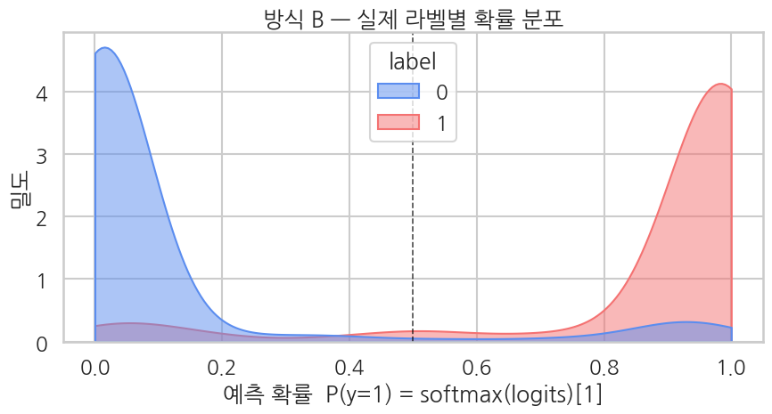
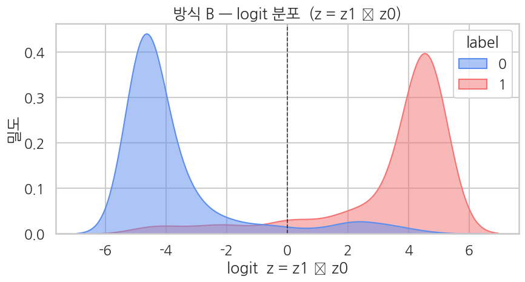

## 평가 — softmax 확률 분포

Ch 10과 같은 패턴 — Ch 10에서는 sigmoid로 1차원 logit을 확률로 바꿨다면, 여기서는 *2차원 logit에 softmax* 를 적용해 클래스 1의 확률을 뽑습니다.

```python
# 평가 metric
eval_metrics = trainer.evaluate()
print("BERT method B evaluation:")
for k, v in eval_metrics.items():
    if k.startswith("eval_") and isinstance(v, float):
        print(f"  {k:>20}: {v:.4f}")
```

**▶ 실행 결과**

```text
<IPython.core.display.HTML object>
<IPython.core.display.HTML object>
BERT method B evaluation:
             eval_loss: 0.2656
         eval_accuracy: 0.9104
        eval_precision: 0.9030
           eval_recall: 0.9030
               eval_f1: 0.9030
              eval_auc: 0.9689
```

**결과 해석**

방식 B는 accuracy 0.9104, F1 0.9030, AUC 0.9689로 안정적으로 수렴합니다. 뒤에서 다시 학습하는 방식 A(accuracy 0.9055)와 거의 같은 자리에 떨어지는데, 바로 이 일치가 이 챕터의 핵심입니다.

방식 A와 비교하려면 2차원 logit을 1차원으로 환산해야 합니다. 여기서 핵심은 `logits = logits2[:, 1] - logits2[:, 0]`, 즉 $z = z_1 - z_0$ — 이렇게 두면 $\sigma(z) = \mathrm{softmax}(z_0, z_1)[1] = p_1$ 이 되어 방식 A의 1차원 logit과 정확히 같은 의미를 가집니다.

```python
# logits → softmax → 클래스 1 확률 + 1차원 logit z = z1 - z0
preds_output = trainer.predict(eval_tok)
logits2 = preds_output.predictions          # (B, 2)
labels  = preds_output.label_ids.astype(int)

# 안정 softmax
exp = np.exp(logits2 - logits2.max(axis=1, keepdims=True))
probs_full = exp / exp.sum(axis=1, keepdims=True)
probs = probs_full[:, 1]                    # (B,) 클래스 1 확률

# 방식 A와 동등성 비교를 위해 1차원 logit 만들기: z = z1 - z0
logits = logits2[:, 1] - logits2[:, 0]      # (B,)

print(f"logits2 (raw)  shape: {logits2.shape}")
print(f"logit z = z1-z0 range: [{logits.min():.2f}, {logits.max():.2f}]")
print(f"Prob range:            [{probs.min():.4f}, {probs.max():.4f}]")
print(f"Positive prediction rate (prob >= 0.5): {(probs >= 0.5).mean():.1%}")
print(f"\nFirst 5 samples:")
print(pd.DataFrame({
    "label":   labels[:5],
    "z0":      logits2[:5, 0].round(2),
    "z1":      logits2[:5, 1].round(2),
    "z=z1-z0": logits[:5].round(2),
    "prob_B":  probs[:5].round(4),
    "pred":    probs_full[:5].argmax(axis=1),
}).to_string(index=False))
```

**▶ 실행 결과**

```text
<IPython.core.display.HTML object>
logits2 (raw)  shape: (804, 2)
logit z = z1-z0 range: [-5.10, 4.88]
Prob range:            [0.0061, 0.9925]
Positive prediction rate (prob >= 0.5): 46.1%

First 5 samples:
 label    z0    z1  z=z1-z0  prob_B  pred
     1 -1.81  2.26     4.08  0.9833     1
     0  1.47 -1.55    -3.02  0.0466     0
     1 -2.05  2.60     4.65  0.9905     1
     1 -1.69  2.29     3.99  0.9818     1
     1 -2.13  2.64     4.77  0.9916     1
```

**결과 해석**

확률이 [0.0061, 0.9925]로 양 끝까지 벌어져 모델이 확신을 갖고 분류하고 있음을 보여줍니다. 첫 5개 샘플에서 `z=z1-z0`의 부호가 그대로 예측 클래스를 가르고(양수 → pred 1, 음수 → pred 0), 모두 정답 라벨과 일치합니다.

### 4-1. 메인 그림 — *확률 공간* 분포 (Ch 10과 같은 KDE)

Ch 10에서 봤던 것과 같은 형태의 KDE. 이번엔 확률이 *softmax 출력 1번째 원소* ($p_1$)이라는 점만 다릅니다. 그림 자체는 거의 같은 모양이어야 합니다 — 두 방식이 동등하다는 직관의 첫 번째 증거.

```python
sns.set_theme(style="whitegrid", context="talk", font="NanumGothic", rc={"axes.unicode_minus": False})

df = pd.DataFrame({"prob": probs, "logit": logits, "label": labels})
PAL = {0: "#5B8DEF", 1: "#F47272"}

fig, ax = plt.subplots(figsize=(9, 5))
sns.kdeplot(
    data=df, x="prob", hue="label",
    fill=True, common_norm=False, alpha=0.5,
    palette=PAL, clip=(0, 1), ax=ax,
)
ax.axvline(0.5, color="black", lw=1.2, ls="--", alpha=0.7)
ax.set_title("방식 B — 실제 라벨별 확률 분포")
ax.set_xlabel("예측 확률  P(y=1) = softmax(logits)[1]")
ax.set_ylabel("밀도")
plt.tight_layout()
plt.show()
```

**▶ 실행 결과**



### 4-2. 보조 그림 — $z = z_1 - z_0$ 의 logit 공간 분포

방식 B는 logit이 2차원 $(z_0, z_1)$ 이라 단순한 logit 공간 그림이 안 그려집니다. 그래서 **방식 A와 같은 1차원 logit 좌표로 환산** ($z = z_1 - z_0$) 해서 그립니다 — 이러면 결정 경계는 $z=0$, 의미는 $\sigma(z)=p_1$ 로 방식 A와 정확히 같아집니다.

```python
fig, ax = plt.subplots(figsize=(9, 5))
sns.kdeplot(
    data=df, x="logit", hue="label",
    fill=True, common_norm=False, alpha=0.5,
    palette=PAL, ax=ax,
)
ax.axvline(0.0, color="black", lw=1.2, ls="--", alpha=0.7)
ax.set_title("방식 B — logit 분포  (z = z1 − z0)")
ax.set_xlabel("logit  z = z1 − z0")
ax.set_ylabel("밀도")
plt.tight_layout()
plt.show()
```

**▶ 실행 결과**



**여기까지 정리** — 4-1과 4-2의 그림은 Ch 10의 것과 *모양* 이 거의 같아야 합니다. 봉우리 높이나 위치가 미세하게 다를 순 있어도, 양 끝 압착 / 가운데 헷갈림 영역 / 결정 경계 자리 같은 *큰 그림* 은 동일. 이게 두 방식 동등성의 *시각적* 증거.

```python
# 상세 분류 리포트
print(classification_report(
    labels, probs_full.argmax(axis=1),
    target_names=["negative", "positive"],
    digits=4,
))
```

**▶ 실행 결과**

```text
              precision    recall  f1-score   support

    negative     0.9169    0.9169    0.9169       433
    positive     0.9030    0.9030    0.9030       371

    accuracy                         0.9104       804
   macro avg     0.9099    0.9099    0.9099       804
weighted avg     0.9104    0.9104    0.9104       804
```
