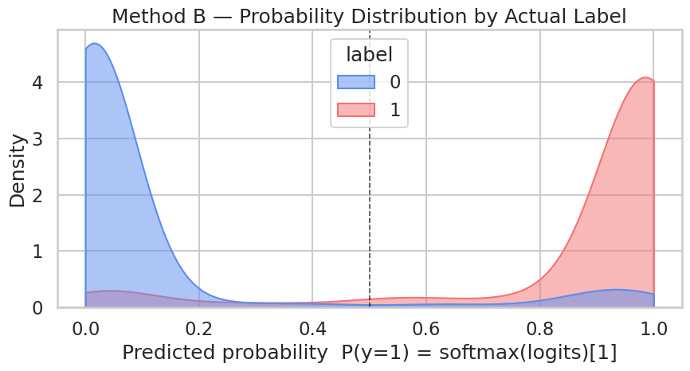

## 환경 준비

```python
!pip install -q transformers datasets
```

```python
import warnings
warnings.filterwarnings("ignore")

import numpy as np
import pandas as pd
import matplotlib.pyplot as plt
import seaborn as sns
import torch
from datasets import load_dataset
from transformers import (
    AutoTokenizer, AutoModelForSequenceClassification,
    Trainer, TrainingArguments,
)
from sklearn.metrics import (
    accuracy_score, precision_recall_fscore_support,
    classification_report, roc_auc_score,
)

plt.rcParams["axes.unicode_minus"] = False

print(f"PyTorch:        {torch.__version__}")
print(f"CUDA available: {torch.cuda.is_available()}")
if torch.cuda.is_available():
    print(f"GPU:             {torch.cuda.get_device_name(0)}")
else:
    print("Warning: CPU runtime — training will be very slow. Switch to T4 recommended.")
```

**▶ 실행 결과**

```text
PyTorch:        2.11.0+cu128
CUDA available: True
GPU:             Tesla T4
```

```python
!nvidia-smi
```

**▶ 실행 결과**

```text
Wed Jun 17 21:34:39 2026       
+-----------------------------------------------------------------------------------------+
| NVIDIA-SMI 580.82.07              Driver Version: 580.82.07      CUDA Version: 13.0     |
+-----------------------------------------+------------------------+----------------------+
| GPU  Name                 Persistence-M | Bus-Id          Disp.A | Volatile Uncorr. ECC |
| Fan  Temp   Perf          Pwr:Usage/Cap |           Memory-Usage | GPU-Util  Compute M. |
|                                         |                        |               MIG M. |
|=========================================+========================+======================|
|   0  Tesla T4                       Off |   00000000:00:04.0 Off |                    0 |
| N/A   41C    P8             11W /   70W |       3MiB /  15360MiB |      0%      Default |
|                                         |                        |                  N/A |
+-----------------------------------------+------------------------+----------------------+

+-----------------------------------------------------------------------------------------+
| Processes:                                                                              |
|  GPU   GI   CI              PID   Type   Process name                        GPU Memory |
|        ID   ID                                                               Usage      |
|=========================================================================================|
|  No running processes found                                                             |
+-----------------------------------------------------------------------------------------+
```

```python
tokenizer = AutoTokenizer.from_pretrained("distilbert-base-uncased")

ds = load_dataset("Yelp/yelp_review_full")
train_full = ds["train"].shuffle(seed=42).select(range(5000))
eval_full  = ds["test"].shuffle(seed=42).select(range(1000))

# 별점 3 제외 + 이진화
def add_binary(batch):
    bins = []
    for lbl in batch["label"]:
        star = lbl + 1
        bins.append(1 if star >= 4 else 0)   # ← Ch 10과 다른 점: int (스칼라)
    batch["binary"] = bins
    return batch

train_bin = train_full.filter(lambda x: (x["label"] + 1) != 3).map(add_binary, batched=True)
eval_bin  = eval_full.filter(lambda x:  (x["label"] + 1) != 3).map(add_binary, batched=True)

print(f"train (after excluding 3-star): {len(train_bin)}")
print(f"eval  (after excluding 3-star): {len(eval_bin)}")
print(f"train positive rate: {sum(train_bin['binary']) / len(train_bin):.1%}")
```

**▶ 실행 결과**

```text
train (after excluding 3-star): 4040
eval  (after excluding 3-star): 804
train positive rate: 49.4%
```

```python
def tokenize_fn(batch):
    out = tokenizer(batch["text"], truncation=True, max_length=128)
    out["labels"] = [int(b) for b in batch["binary"]]   # ← int 스칼라 (Ch 10은 [float(b)])
    return out

train_tok = train_bin.map(tokenize_fn, batched=True).remove_columns(["text", "label", "binary"])
eval_tok  = eval_bin.map(tokenize_fn,  batched=True).remove_columns(["text", "label", "binary"])

print(train_tok)
print(f"\nFirst sample label: {train_tok[0]['labels']}  (int scalar)")
```

**▶ 실행 결과**

```text
Dataset({
    features: ['input_ids', 'token_type_ids', 'attention_mask', 'labels'],
    num_rows: 4040
})

First sample label: 1  (int scalar)
```

```python
model = AutoModelForSequenceClassification.from_pretrained(
    "distilbert-base-uncased",
    num_labels=2,
    problem_type="single_label_classification",   # ← CrossEntropyLoss 자동 매핑 (BERT 분류 표준)
    id2label={0: "negative", 1: "positive"},
    label2id={"negative": 0, "positive": 1},
)

def param_summary(m):
    total     = sum(p.numel() for p in m.parameters())
    trainable = sum(p.numel() for p in m.parameters() if p.requires_grad)
    return total, trainable

total, trainable = param_summary(model)
print(f"Parameters:           {total:>13,}  ({total/1e6:.1f} M)")
print(f"Trainable parameters: {trainable:>13,}  ({trainable/total:.1%})")
print(f"Classifier:           {model.classifier}")
print(f"problem_type:         {model.config.problem_type}")
print(f"id2label:             {model.config.id2label}")
```

**▶ 실행 결과**

```text
[transformers] DistilBertForSequenceClassification LOAD REPORT from: distilbert-base-uncased
Key                     | Status     | 
------------------------+------------+-
vocab_layer_norm.weight | UNEXPECTED | 
vocab_layer_norm.bias   | UNEXPECTED | 
vocab_transform.weight  | UNEXPECTED | 
vocab_projector.bias    | UNEXPECTED | 
vocab_transform.bias    | UNEXPECTED | 
pre_classifier.bias     | MISSING    | 
pre_classifier.weight   | MISSING    | 
classifier.bias         | MISSING    | 
classifier.weight       | MISSING    | 

Notes:
- UNEXPECTED:	can be ignored when loading from different task/architecture; not ok if you expect identical arch.
- MISSING:	those params were newly initialized because missing from the checkpoint. Consider training on your downstream task.
Parameters:              66,955,010  (67.0 M)
Trainable parameters:    66,955,010  (100.0%)
Classifier:           Linear(in_features=768, out_features=2, bias=True)
problem_type:         single_label_classification
id2label:             {0: 'negative', 1: 'positive'}
```

```python
!nvidia-smi
```

**▶ 실행 결과**

```text
Wed Jun 17 21:35:05 2026       
+-----------------------------------------------------------------------------------------+
| NVIDIA-SMI 580.82.07              Driver Version: 580.82.07      CUDA Version: 13.0     |
+-----------------------------------------+------------------------+----------------------+
| GPU  Name                 Persistence-M | Bus-Id          Disp.A | Volatile Uncorr. ECC |
| Fan  Temp   Perf          Pwr:Usage/Cap |           Memory-Usage | GPU-Util  Compute M. |
|                                         |                        |               MIG M. |
|=========================================+========================+======================|
|   0  Tesla T4                       Off |   00000000:00:04.0 Off |                    0 |
| N/A   42C    P8             14W /   70W |       3MiB /  15360MiB |      0%      Default |
|                                         |                        |                  N/A |
+-----------------------------------------+------------------------+----------------------+

+-----------------------------------------------------------------------------------------+
| Processes:                                                                              |
|  GPU   GI   CI              PID   Type   Process name                        GPU Memory |
|        ID   ID                                                               Usage      |
|=========================================================================================|
|  No running processes found                                                             |
+-----------------------------------------------------------------------------------------+
```

```python
def compute_metrics(eval_pred):
    logits, labels = eval_pred
    # logits.shape = (B, 2)  → softmax → 클래스 1 확률
    exp = np.exp(logits - logits.max(axis=1, keepdims=True))   # 안정화
    probs_full = exp / exp.sum(axis=1, keepdims=True)          # (B, 2)
    probs = probs_full[:, 1]                                   # (B,) 클래스 1 확률
    preds = probs_full.argmax(axis=1)                          # 0/1 예측

    p, r, f1, _ = precision_recall_fscore_support(labels, preds, average="binary", zero_division=0)
    return {
        "accuracy":  float(accuracy_score(labels, preds)),
        "precision": float(p),
        "recall":    float(r),
        "f1":        float(f1),
        "auc":       float(roc_auc_score(labels, probs)),
    }
```

```python
training_args = TrainingArguments(
    output_dir="./ch11_output",
    num_train_epochs=2,
    per_device_train_batch_size=16,
    per_device_eval_batch_size=32,
    learning_rate=2e-5,
    fp16=True,
    eval_strategy="epoch",
    logging_steps=50,
    save_strategy="no",
    report_to="none",
    seed=42,
)

trainer = Trainer(
    model=model,
    args=training_args,
    train_dataset=train_tok,
    eval_dataset=eval_tok,
    processing_class=tokenizer,
    compute_metrics=compute_metrics,
)

train_result = trainer.train()
print(f"\nTraining done — mean train loss: {train_result.training_loss:.4f}")
```

**▶ 실행 결과**

```text
<IPython.core.display.HTML object>
Training done — mean train loss: 0.2599
```

**결과 해석**

평균 train loss가 0.26 수준으로 안정적으로 내려갔습니다. 같은 데이터를 sigmoid+BCE로 학습한 Ch 10과 거의 같은 손실 규모로, 출력 차원만 2로 바뀌었을 뿐 학습 자체는 동일하게 진행됨을 보여줍니다.

```python
!nvidia-smi
```

**▶ 실행 결과**

```text
Wed Jun 17 21:35:37 2026       
+-----------------------------------------------------------------------------------------+
| NVIDIA-SMI 580.82.07              Driver Version: 580.82.07      CUDA Version: 13.0     |
+-----------------------------------------+------------------------+----------------------+
| GPU  Name                 Persistence-M | Bus-Id          Disp.A | Volatile Uncorr. ECC |
| Fan  Temp   Perf          Pwr:Usage/Cap |           Memory-Usage | GPU-Util  Compute M. |
|                                         |                        |               MIG M. |
|=========================================+========================+======================|
|   0  Tesla T4                       Off |   00000000:00:04.0 Off |                    0 |
| N/A   59C    P0             58W /   70W |    1579MiB /  15360MiB |     78%      Default |
|                                         |                        |                  N/A |
+-----------------------------------------+------------------------+----------------------+

+-----------------------------------------------------------------------------------------+
| Processes:                                                                              |
|  GPU   GI   CI              PID   Type   Process name                        GPU Memory |
|        ID   ID                                                               Usage      |
|=========================================================================================|
|    0   N/A  N/A            8263      C   /usr/bin/python3                       1576MiB |
+-----------------------------------------------------------------------------------------+
```

```python
# 평가 metric
eval_metrics = trainer.evaluate()
print("BERT method B evaluation:")
for k, v in eval_metrics.items():
    if k.startswith("eval_") and isinstance(v, float):
        print(f"  {k:>20}: {v:.4f}")
```

**▶ 실행 결과**

```text
<IPython.core.display.HTML object>
<IPython.core.display.HTML object>
BERT method B evaluation:
             eval_loss: 0.2716
         eval_accuracy: 0.9104
        eval_precision: 0.9008
           eval_recall: 0.9057
               eval_f1: 0.9032
              eval_auc: 0.9671
```

**결과 해석**

방식 B는 정확도 91.0%, AUC 0.967로 견고한 성능을 보입니다. 이진 데이터를 2차원 출력 + softmax + CrossEntropyLoss로 다뤘는데도, 1차원 sigmoid 방식과 다를 바 없는 수준의 결과가 나옵니다.

```python
# logits → softmax → 클래스 1 확률 + 1차원 logit z = z1 - z0
preds_output = trainer.predict(eval_tok)
logits2 = preds_output.predictions          # (B, 2)
labels  = preds_output.label_ids.astype(int)

# 안정 softmax
exp = np.exp(logits2 - logits2.max(axis=1, keepdims=True))
probs_full = exp / exp.sum(axis=1, keepdims=True)
probs = probs_full[:, 1]                    # (B,) 클래스 1 확률

# 방식 A와 동등성 비교를 위해 1차원 logit 만들기: z = z1 - z0
logits = logits2[:, 1] - logits2[:, 0]      # (B,)

print(f"logits2 (raw)  shape: {logits2.shape}")
print(f"logit z = z1-z0 range: [{logits.min():.2f}, {logits.max():.2f}]")
print(f"Prob range:            [{probs.min():.4f}, {probs.max():.4f}]")
print(f"Positive prediction rate (prob >= 0.5): {(probs >= 0.5).mean():.1%}")
print(f"\nFirst 5 samples:")
print(pd.DataFrame({
    "label":   labels[:5],
    "z0":      logits2[:5, 0].round(2),
    "z1":      logits2[:5, 1].round(2),
    "z=z1-z0": logits[:5].round(2),
    "prob_B":  probs[:5].round(4),
    "pred":    probs_full[:5].argmax(axis=1),
}).to_string(index=False))
```

**▶ 실행 결과**

```text
<IPython.core.display.HTML object>
logits2 (raw)  shape: (804, 2)
logit z = z1-z0 range: [-4.98, 5.04]
Prob range:            [0.0068, 0.9936]
Positive prediction rate (prob >= 0.5): 46.4%

First 5 samples:
 label    z0    z1  z=z1-z0  prob_B  pred
     1 -1.88  2.50     4.38  0.9876     1
     0  1.69 -1.64    -3.33  0.0345     0
     1 -2.10  2.69     4.79  0.9918     1
     1 -1.84  2.49     4.33  0.9870     1
     1 -2.12  2.82     4.94  0.9929     1
```

**결과 해석**

두 logit의 차이 z = z1 − z0가 클수록 prob_B가 1에 가까워집니다. 예컨대 z = 4.38이면 prob_B = 0.9876, z = −3.33이면 prob_B = 0.0345로, softmax(z0, z1)의 클래스 1 확률이 정확히 sigmoid(z1 − z0)와 같다는 동등성이 숫자로 확인됩니다.

```python
sns.set_theme(style="whitegrid", context="talk")

df = pd.DataFrame({"prob": probs, "logit": logits, "label": labels})
PAL = {0: "#5B8DEF", 1: "#F47272"}

fig, ax = plt.subplots(figsize=(9, 5))
sns.kdeplot(
    data=df, x="prob", hue="label",
    fill=True, common_norm=False, alpha=0.5,
    palette=PAL, clip=(0, 1), ax=ax,
)
ax.axvline(0.5, color="black", lw=1.2, ls="--", alpha=0.7)
ax.set_title("Method B — Probability Distribution by Actual Label")
ax.set_xlabel("Predicted probability  P(y=1) = softmax(logits)[1]")
ax.set_ylabel("Density")
plt.tight_layout()
plt.show()
```

**▶ 실행 결과**



**결과 해석**

실제 label별 확률 분포가 0과 1 양극단으로 깔끔하게 갈라집니다. 0.5 경계를 기준으로 두 색이 거의 겹치지 않아, 모델이 두 클래스를 확신 있게 구분하고 있음을 보여줍니다.

```python
fig, ax = plt.subplots(figsize=(9, 5))
sns.kdeplot(
    data=df, x="logit", hue="label",
    fill=True, common_norm=False, alpha=0.5,
    palette=PAL, ax=ax,
)
ax.axvline(0.0, color="black", lw=1.2, ls="--", alpha=0.7)
ax.set_title("Method B — Logit Distribution  (z = z1 − z0)")
ax.set_xlabel("Logit  z = z1 − z0")
ax.set_ylabel("Density")
plt.tight_layout()
plt.show()
```

**▶ 실행 결과**


**결과 해석**

확률 대신 z = z1 − z0 축에서 보면 두 클래스가 0을 경계로 양쪽으로 분리됩니다. 이 1차원 logit이 바로 방식 A의 단일 출력에 대응하며, sigmoid를 씌우면 앞의 확률 분포와 같은 그림이 됩니다.

```python
# 상세 분류 리포트
print(classification_report(
    labels, probs_full.argmax(axis=1),
    target_names=["negative", "positive"],
    digits=4,
))
```

**▶ 실행 결과**

```text
              precision    recall  f1-score   support

    negative     0.9188    0.9145    0.9167       433
    positive     0.9008    0.9057    0.9032       371

    accuracy                         0.9104       804
   macro avg     0.9098    0.9101    0.9099       804
weighted avg     0.9105    0.9104    0.9105       804
```

**결과 해석**

negative와 positive 모두 precision/recall이 0.90 이상으로 고르게 잘 나옵니다. 클래스가 거의 균형(positive 약 49%)이라 macro와 weighted 평균이 거의 같은 값을 보입니다.

```python
# 방식 A용 라벨 변환 — int 0/1 → 길이 1 multi-hot float [0.0]/[1.0]
def to_method_a_labels(batch):
    batch["labels"] = [[float(l)] for l in batch["labels"]]
    return batch

# 텍스트·attention_mask는 그대로, labels만 바꿔서 새 데이터셋
train_tok_A = train_tok.map(to_method_a_labels, batched=True)
eval_tok_A  = eval_tok.map(to_method_a_labels,  batched=True)

print(f"Method A first sample label: {train_tok_A[0]['labels']}  (length-1 float vector)")
print(f"Method B first sample label: {train_tok[0]['labels']}    (int scalar)")
```

**▶ 실행 결과**

```text
Method A first sample label: [1.0]  (length-1 float vector)
Method B first sample label: 1    (int scalar)
```

```python
# 방식 A 모델 — Ch 10과 동일 셋업
model_A = AutoModelForSequenceClassification.from_pretrained(
    "distilbert-base-uncased",
    num_labels=1,
    problem_type="multi_label_classification",
)

def compute_metrics_A(eval_pred):
    logits, lbl = eval_pred
    logits = logits.flatten()
    lbl    = lbl.flatten().astype(int)
    p_hat  = 1.0 / (1.0 + np.exp(-logits))
    preds  = (p_hat >= 0.5).astype(int)
    p, r, f1, _ = precision_recall_fscore_support(lbl, preds, average="binary", zero_division=0)
    return {
        "accuracy":  float(accuracy_score(lbl, preds)),
        "precision": float(p),
        "recall":    float(r),
        "f1":        float(f1),
        "auc":       float(roc_auc_score(lbl, p_hat)),
    }

print(f"Method A classifier:    {model_A.classifier}")
print(f"Method A problem_type:  {model_A.config.problem_type}")
```

**▶ 실행 결과**

```text
[transformers] DistilBertForSequenceClassification LOAD REPORT from: distilbert-base-uncased
Key                     | Status     | 
------------------------+------------+-
vocab_layer_norm.weight | UNEXPECTED | 
vocab_layer_norm.bias   | UNEXPECTED | 
vocab_transform.weight  | UNEXPECTED | 
vocab_projector.bias    | UNEXPECTED | 
vocab_transform.bias    | UNEXPECTED | 
pre_classifier.bias     | MISSING    | 
pre_classifier.weight   | MISSING    | 
classifier.bias         | MISSING    | 
classifier.weight       | MISSING    | 

Notes:
- UNEXPECTED:	can be ignored when loading from different task/architecture; not ok if you expect identical arch.
- MISSING:	those params were newly initialized because missing from the checkpoint. Consider training on your downstream task.
Method A classifier:    Linear(in_features=768, out_features=1, bias=True)
Method A problem_type:  multi_label_classification
```

```python
# 방식 A 학습 — Ch 10과 동일한 hyperparams (방식 B와도 동일)
training_args_A = TrainingArguments(
    output_dir="./ch11_method_a_output",
    num_train_epochs=2,
    per_device_train_batch_size=16,
    per_device_eval_batch_size=32,
    learning_rate=2e-5,
    fp16=True,
    eval_strategy="epoch",
    logging_steps=50,
    save_strategy="no",
    report_to="none",
    seed=42,
)

trainer_A = Trainer(
    model=model_A,
    args=training_args_A,
    train_dataset=train_tok_A,
    eval_dataset=eval_tok_A,
    processing_class=tokenizer,
    compute_metrics=compute_metrics_A,
)

train_result_A = trainer_A.train()
print(f"\nMethod A training done — train loss: {train_result_A.training_loss:.4f}")
```

**▶ 실행 결과**

```text
<IPython.core.display.HTML object>
Method A training done — train loss: 0.2588
```

**결과 해석**

방식 A의 train loss 0.2588은 방식 B의 0.2599와 사실상 같습니다. 라벨 형식(길이-1 float 벡터 대 int 스칼라)과 출력 차원만 다를 뿐, 같은 데이터에서 같은 손실 규모로 수렴함을 다시 확인할 수 있습니다.

```python
# 방식 A 예측 추출
preds_A_out = trainer_A.predict(eval_tok_A)
logits_A    = preds_A_out.predictions.flatten()
probs_A     = 1.0 / (1.0 + np.exp(-logits_A))
labels_A    = preds_A_out.label_ids.flatten().astype(int)

# eval_tok과 eval_tok_A는 라벨 형식만 다르고 샘플 순서는 동일 → 라벨 일치해야 함
assert (labels_A == labels).all(), "Sample order mismatch — check eval_tok / eval_tok_A derivation"

eval_metrics_A = trainer_A.evaluate()
print("Method A evaluation:")
for k, v in eval_metrics_A.items():
    if k.startswith("eval_") and isinstance(v, float):
        print(f"  {k:>20}: {v:.4f}")
```

**▶ 실행 결과**

```text
<IPython.core.display.HTML object>
<IPython.core.display.HTML object>
<IPython.core.display.HTML object>
Method A evaluation:
             eval_loss: 0.2811
         eval_accuracy: 0.9055
        eval_precision: 0.9041
           eval_recall: 0.8895
               eval_f1: 0.8967
              eval_auc: 0.9663
```

**결과 해석**

방식 A의 평가 지표(정확도 0.9055, AUC 0.9663)가 방식 B(0.9104, 0.9671)와 소수점 둘째 자리 수준에서 일치합니다. 같은 데이터를 sigmoid+BCE와 softmax+CE 어느 쪽으로 학습해도 성능이 사실상 동일하다는 점이 드러납니다.

```python
metrics_A = {k.replace("eval_", ""): v for k, v in eval_metrics_A.items()
             if k.startswith("eval_") and isinstance(v, float)}
metrics_B = {k.replace("eval_", ""): v for k, v in eval_metrics.items()
             if k.startswith("eval_") and isinstance(v, float)}

common = [k for k in metrics_A if k in metrics_B]
cmp = pd.DataFrame({
    "metric":                  common,
    "method A (sigmoid+BCE)":  [metrics_A[k] for k in common],
    "method B (softmax+CE)":   [metrics_B[k] for k in common],
})
cmp["|A-B|"] = (cmp["method A (sigmoid+BCE)"] - cmp["method B (softmax+CE)"]).abs()
print(cmp.round(4).to_string(index=False))
```

**▶ 실행 결과**

```text
   metric  method A (sigmoid+BCE)  method B (softmax+CE)  |A-B|
     loss                  0.2811                 0.2716 0.0094
 accuracy                  0.9055                 0.9104 0.0050
precision                  0.9041                 0.9008 0.0033
   recall                  0.8895                 0.9057 0.0162
       f1                  0.8967                 0.9032 0.0065
      auc                  0.9663                 0.9671 0.0009
```

**결과 해석**

모든 지표에서 두 방식의 차이가 0.02 이하이며, AUC 차이는 0.0009에 불과합니다. 방식 A와 방식 B가 같은 문제를 푸는 동일한 해법의 두 표현임을 한 표로 요약해 줍니다.

```python
df_cmp = pd.DataFrame({
    "prob_A": probs_A,
    "prob_B": probs,
    "label":  labels.astype(int),
})

fig, ax = plt.subplots(figsize=(7, 7))
sns.scatterplot(
    data=df_cmp, x="prob_A", y="prob_B", hue="label",
    palette={0: "#5B8DEF", 1: "#F47272"}, alpha=0.55, s=35, ax=ax,
)
ax.plot([0, 1], [0, 1], color="black", lw=1.3, ls="--", alpha=0.7,
        label="y = x (perfect equivalence)")
ax.set_xlim(-0.02, 1.02); ax.set_ylim(-0.02, 1.02)
ax.set_xlabel("Method A — P(y=1) = sigmoid(z_A)")
ax.set_ylabel("Method B — P(y=1) = softmax(z_0, z_1)[1]")
ax.set_title("Method A vs Method B — per-sample probability agreement")
ax.legend(loc="upper left")
plt.tight_layout()
plt.show()

corr = float(np.corrcoef(probs_A, probs)[0, 1])
mae  = float(np.abs(probs_A - probs).mean())
print(f"Pearson corr:        {corr:.4f}  (1.0 = perfect equivalence)")
print(f"Mean abs diff |A-B|: {mae:.4f}")
```

**▶ 실행 결과**


```text
Pearson corr:        0.9904  (1.0 = perfect equivalence)
Mean abs diff |A-B|: 0.0220
```

**결과 해석**

샘플별 확률을 점으로 찍으면 대부분 y = x 대각선에 몰려 있고, Pearson 상관 0.9904, 평균 절대차 0.022로 두 방식의 예측 확률이 거의 한 점 한 점 일치합니다. 학습 무작위성에서 오는 미세한 흔들림을 빼면 사실상 같은 확률을 내보냅니다.

```python
pred_A = (probs_A >= 0.5).astype(int)
pred_B = (probs   >= 0.5).astype(int)

agree         = (pred_A == pred_B).mean()
both_correct  = ((pred_A == labels) & (pred_B == labels)).mean()
only_A_right  = ((pred_A == labels) & (pred_B != labels)).mean()
only_B_right  = ((pred_A != labels) & (pred_B == labels)).mean()
both_wrong    = ((pred_A != labels) & (pred_B != labels)).mean()

print(f"Agreement rate (A vs B predictions): {agree:.1%}")
print()
print(f"Prediction quadrants:")
print(f"  both correct:           {both_correct:.1%}")
print(f"  only A correct (B wrong): {only_A_right:.1%}")
print(f"  only B correct (A wrong): {only_B_right:.1%}")
print(f"  both wrong:             {both_wrong:.1%}")
```

**▶ 실행 결과**

```text
Agreement rate (A vs B predictions): 98.3%

Prediction quadrants:
  both correct:           89.9%
  only A correct (B wrong): 0.6%
  only B correct (A wrong): 1.1%
  both wrong:             8.3%
```

**결과 해석**

두 방식의 예측이 98.3%에서 일치하고, 한쪽만 맞은 경우는 1.7%에 그칩니다. 결국 sigmoid+BCE와 softmax+CE는 같은 데이터에서 거의 같은 결정을 내리며, 이진 분류에서 둘이 동등한 선택지임을 마무리로 확인해 줍니다.
