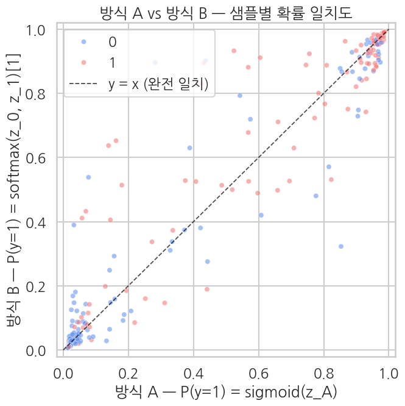

## 클라이맥스 — 방식 A 를 *이 노트북 안에서* 다시 학습해 비교

이전 챕터(Ch 10)의 결과 파일에 의존하지 않도록, 같은 데이터·같은 hyperparams·같은 seed로 방식 A를 *바로 여기서* 한 번 더 학습합니다. 변하는 것은 **모델 셋업과 라벨 형식뿐** (Ch 10에서 본 그대로):

| 셋업 | 방식 B (§3-4에서 학습) | 방식 A (지금 inline 재학습) |
|---|---|---|
| `num_labels` | 2 | **1** |
| `problem_type` | `single_label_classification` | **`multi_label_classification`** |
| 라벨 형식 | int 스칼라 (`0` / `1`) | **길이 1 multi-hot float (`[0.0]` / `[1.0]`)** |
| 학습 hyperparams | (epoch=2, lr=2e-5, seed=42 …) | **그대로** |

T4 기준 추가 ~8분. 학습이 끝나면 같은 eval 셋의 $p_A^{(i)}$ 와 §4에서 구한 $p_B^{(i)}$ 를 1,000개 점으로 비교할 수 있게 됩니다.

이제 같은 노트북 안에서 방식 A를 다시 학습해 직접 비교합니다. 텍스트·attention_mask는 그대로 두고 라벨만 방식 A 형식(길이 1 multi-hot float `[0.0]`/`[1.0]`)으로 바꿉니다 — 샘플 순서가 동일해야 나중에 점 대 점 비교가 성립합니다.

```python
# 방식 A용 라벨 변환 — int 0/1 → 길이 1 multi-hot float [0.0]/[1.0]
def to_method_a_labels(batch):
    batch["labels"] = [[float(l)] for l in batch["labels"]]
    return batch

# 텍스트·attention_mask는 그대로, labels만 바꿔서 새 데이터셋
train_tok_A = train_tok.map(to_method_a_labels, batched=True)
eval_tok_A  = eval_tok.map(to_method_a_labels,  batched=True)

print(f"Method A first sample label: {train_tok_A[0]['labels']}  (length-1 float vector)")
print(f"Method B first sample label: {train_tok[0]['labels']}    (int scalar)")
```

**▶ 실행 결과**

```text
Method A first sample label: [1.0]  (length-1 float vector)
Method B first sample label: 1    (int scalar)
```

```python
# 방식 A 모델 — Ch 10과 동일 셋업
model_A = AutoModelForSequenceClassification.from_pretrained(
    "distilbert-base-uncased",
    num_labels=1,
    problem_type="multi_label_classification",
)

def compute_metrics_A(eval_pred):
    logits, lbl = eval_pred
    logits = logits.flatten()
    lbl    = lbl.flatten().astype(int)
    p_hat  = 1.0 / (1.0 + np.exp(-logits))
    preds  = (p_hat >= 0.5).astype(int)
    p, r, f1, _ = precision_recall_fscore_support(lbl, preds, average="binary", zero_division=0)
    return {
        "accuracy":  float(accuracy_score(lbl, preds)),
        "precision": float(p),
        "recall":    float(r),
        "f1":        float(f1),
        "auc":       float(roc_auc_score(lbl, p_hat)),
    }

print(f"Method A classifier:    {model_A.classifier}")
print(f"Method A problem_type:  {model_A.config.problem_type}")
```

**▶ 실행 결과**

```text
[transformers] DistilBertForSequenceClassification LOAD REPORT from: distilbert-base-uncased
Key                     | Status     | 
------------------------+------------+-
vocab_projector.bias    | UNEXPECTED | 
vocab_transform.weight  | UNEXPECTED | 
vocab_transform.bias    | UNEXPECTED | 
vocab_layer_norm.bias   | UNEXPECTED | 
vocab_layer_norm.weight | UNEXPECTED | 
classifier.bias         | MISSING    | 
pre_classifier.bias     | MISSING    | 
pre_classifier.weight   | MISSING    | 
classifier.weight       | MISSING    | 

Notes:
- UNEXPECTED:	can be ignored when loading from different task/architecture; not ok if you expect identical arch.
- MISSING:	those params were newly initialized because missing from the checkpoint. Consider training on your downstream task.
Method A classifier:    Linear(in_features=768, out_features=1, bias=True)
Method A problem_type:  multi_label_classification
```

```python
# 방식 A 학습 — Ch 10과 동일한 hyperparams (방식 B와도 동일)
training_args_A = TrainingArguments(
    output_dir="./ch11_method_a_output",
    num_train_epochs=2,
    per_device_train_batch_size=16,
    per_device_eval_batch_size=32,
    learning_rate=2e-5,
    fp16=True,
    eval_strategy="epoch",
    logging_steps=50,
    save_strategy="no",
    report_to="none",
    seed=42,
)

trainer_A = Trainer(
    model=model_A,
    args=training_args_A,
    train_dataset=train_tok_A,
    eval_dataset=eval_tok_A,
    processing_class=tokenizer,
    compute_metrics=compute_metrics_A,
)

train_result_A = trainer_A.train()
print(f"\nMethod A training done — train loss: {train_result_A.training_loss:.4f}")
```

**▶ 실행 결과**

```text
Epoch  Training Loss  Validation Loss  Accuracy  Precision  Recall    F1        Auc
1      0.245630       0.248752         0.906716  0.893617   0.905660  0.899598  0.968371
2      0.162265       0.281090         0.905473  0.904110   0.889488  0.896739  0.966261
Method A training done — train loss: 0.2588
```

```python
# 방식 A 예측 추출
preds_A_out = trainer_A.predict(eval_tok_A)
logits_A    = preds_A_out.predictions.flatten()
probs_A     = 1.0 / (1.0 + np.exp(-logits_A))
labels_A    = preds_A_out.label_ids.flatten().astype(int)

# eval_tok과 eval_tok_A는 라벨 형식만 다르고 샘플 순서는 동일 → 라벨 일치해야 함
assert (labels_A == labels).all(), "Sample order mismatch — check eval_tok / eval_tok_A derivation"

eval_metrics_A = trainer_A.evaluate()
print("Method A evaluation:")
for k, v in eval_metrics_A.items():
    if k.startswith("eval_") and isinstance(v, float):
        print(f"  {k:>20}: {v:.4f}")
```

**▶ 실행 결과**

```text
Training Loss  Validation Loss  Epoch  Accuracy  Precision  Recall    F1        Auc
0.162265       0.281090         2      0.905473  0.904110   0.889488  0.896739  0.966261
Method A evaluation:
             eval_loss: 0.2811
         eval_accuracy: 0.9055
        eval_precision: 0.9041
           eval_recall: 0.8895
               eval_f1: 0.8967
              eval_auc: 0.9663
```

### 5-1. 두 방식의 metric 표 비교

같은 데이터에 같은 모델 본체로 학습했고 hyperparams도 같으니, accuracy/F1/AUC 같은 평가 지표가 *거의 같은* 값이어야 합니다. 차이가 있다면 random init과 dropout 같은 *학습 경로* 차이에서 옵니다.

```python
metrics_A = {k.replace("eval_", ""): v for k, v in eval_metrics_A.items()
             if k.startswith("eval_") and isinstance(v, float)}
metrics_B = {k.replace("eval_", ""): v for k, v in eval_metrics.items()
             if k.startswith("eval_") and isinstance(v, float)}

common = [k for k in metrics_A if k in metrics_B]
cmp = pd.DataFrame({
    "metric":                  common,
    "method A (sigmoid+BCE)":  [metrics_A[k] for k in common],
    "method B (softmax+CE)":   [metrics_B[k] for k in common],
})
cmp["|A-B|"] = (cmp["method A (sigmoid+BCE)"] - cmp["method B (softmax+CE)"]).abs()
print(cmp.round(4).to_string(index=False))
```

**▶ 실행 결과**

```text
   metric  method A (sigmoid+BCE)  method B (softmax+CE)  |A-B|
     loss                  0.2811                 0.2656 0.0155
 accuracy                  0.9055                 0.9104 0.0050
precision                  0.9041                 0.9030 0.0011
   recall                  0.8895                 0.9030 0.0135
       f1                  0.8967                 0.9030 0.0062
      auc                  0.9663                 0.9689 0.0026
```

**결과 해석**

모든 지표에서 두 방식의 차이가 0.02 미만입니다 (accuracy 0.0050, AUC 0.0026, precision 0.0011). 같은 데이터·같은 hyperparams로 학습했으니 남는 차이는 random init·dropout 같은 학습 경로 노이즈일 뿐 — 식으로 본 동등성이 BERT에서도 그대로 성립함을 수치로 확인합니다.

### 5-2. 샘플 단위 확률 비교 — scatter plot

x축 = 방식 A의 $p_A$, y축 = 방식 B의 $p_B$. 점 색은 정답 라벨.

**완전히 동등하면 모든 점이 $y = x$ 직선 위**. 실제로는 random init·dropout·optimizer 비결정성 때문에 약간 흩어지지만, 직선에서 크게 벗어나면 안 됩니다.

```python
df_cmp = pd.DataFrame({
    "prob_A": probs_A,
    "prob_B": probs,
    "label":  labels.astype(int),
})

fig, ax = plt.subplots(figsize=(7, 7))
sns.scatterplot(
    data=df_cmp, x="prob_A", y="prob_B", hue="label",
    palette={0: "#5B8DEF", 1: "#F47272"}, alpha=0.55, s=35, ax=ax,
)
ax.plot([0, 1], [0, 1], color="black", lw=1.3, ls="--", alpha=0.7,
        label="y = x (완전 일치)")
ax.set_xlim(-0.02, 1.02); ax.set_ylim(-0.02, 1.02)
ax.set_xlabel("방식 A — P(y=1) = sigmoid(z_A)")
ax.set_ylabel("방식 B — P(y=1) = softmax(z_0, z_1)[1]")
ax.set_title("방식 A vs 방식 B — 샘플별 확률 일치도")
ax.legend(loc="upper left")
plt.tight_layout()
plt.show()

corr = float(np.corrcoef(probs_A, probs)[0, 1])
mae  = float(np.abs(probs_A - probs).mean())
print(f"Pearson corr:        {corr:.4f}  (1.0 = perfect equivalence)")
print(f"Mean abs diff |A-B|: {mae:.4f}")
```

**▶ 실행 결과**



```text
Pearson corr:        0.9883  (1.0 = perfect equivalence)
Mean abs diff |A-B|: 0.0239
```

**결과 해석**

샘플별 확률의 Pearson 상관이 0.9883, 평균 절대 차가 0.0239로 두 방식이 사실상 같은 함수를 학습했음을 보여줍니다. scatter의 점들이 $y=x$ 직선 주변에 흩어지되 체계적 치우침이 없으니, 차이는 학습 경로 노이즈일 뿐입니다.

**해석**

- **상관계수가 0.99 이상**, **평균 절대 차가 0.05 이하** 면 두 방식이 사실상 같은 함수를 학습했다고 봐도 됩니다.
- 만약 점들이 *체계적으로* 직선 한쪽으로 치우친다면 → 한 방식이 다른 방식보다 일관되게 더 자신 있게 / 더 보수적으로 예측하고 있다는 뜻. seed를 여러 개 시도해 평균내면 보통 사라집니다.
- 점들이 직선 *주변에 무작위로* 흩어져 있으면 → 단순 학습 경로 차이. 학습량을 늘리거나 더 큰 데이터에서 학습하면 줄어듭니다.

### 5-3. 예측 일치율 (threshold 0.5)

확률을 0/1 예측으로 떨어뜨린 뒤 두 방식의 예측이 얼마나 일치하는지 봅니다. 일치율이 95% 이상이면 *실질적으로* 같은 분류기로 봐도 됩니다.

```python
pred_A = (probs_A >= 0.5).astype(int)
pred_B = (probs   >= 0.5).astype(int)

agree         = (pred_A == pred_B).mean()
both_correct  = ((pred_A == labels) & (pred_B == labels)).mean()
only_A_right  = ((pred_A == labels) & (pred_B != labels)).mean()
only_B_right  = ((pred_A != labels) & (pred_B == labels)).mean()
both_wrong    = ((pred_A != labels) & (pred_B != labels)).mean()

print(f"Agreement rate (A vs B predictions): {agree:.1%}")
print()
print(f"Prediction quadrants:")
print(f"  both correct:           {both_correct:.1%}")
print(f"  only A correct (B wrong): {only_A_right:.1%}")
print(f"  only B correct (A wrong): {only_B_right:.1%}")
print(f"  both wrong:             {both_wrong:.1%}")
```

**▶ 실행 결과**

```text
Agreement rate (A vs B predictions): 97.8%

Prediction quadrants:
  both correct:           89.7%
  only A correct (B wrong): 0.9%
  only B correct (A wrong): 1.4%
  both wrong:             8.1%
```

**결과 해석**

threshold 0.5에서 두 방식의 예측이 97.8% 일치하고, 의견이 갈리는 경우는 합쳐서 2.3%(only A 0.9% + only B 1.4%)에 불과합니다. 실질적으로 같은 분류기로 봐도 무방하다는 결론입니다.

**여기까지 보고 결론** — 식으로 본 동등성 ($\sigma(z) = \mathrm{softmax}(z_0, z_1)[1]$ when $z = z_1 - z_0$)이 BERT에서도 그대로 성립합니다. 차이가 있어 봐야 random init / dropout 같은 *학습 경로 차이* 정도. 두 방식은 **수식이 다른 같은 모델**, 라이브러리·코드 컨벤션이 강요하는 표현 차이일 뿐입니다.

> **현장 가이드**: 새 BERT 분류 task를 시작할 때는 *방식 B (softmax+CE)* 가 표준 — `num_labels=K`, `problem_type="single_label_classification"` 만 두면 끝. 방식 A는 *binary 라벨이 multi-label 형식으로 들어오는 시나리오* (예: 이진 라벨이 여러 헤드 중 하나로 끼어 있는 경우)에서만 의식적으로 사용합니다.
