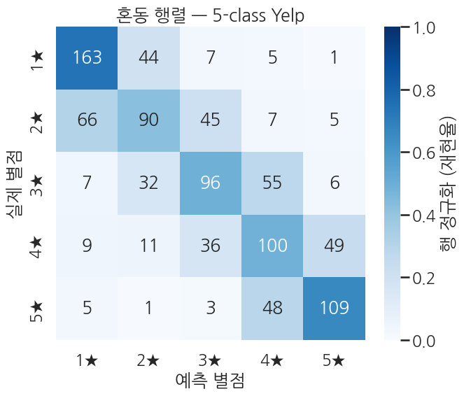
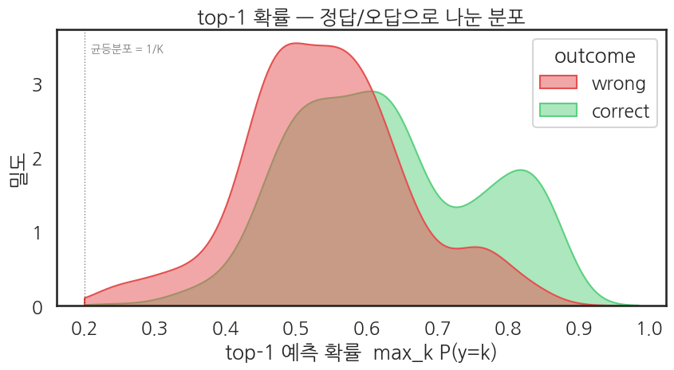

## 평가 — softmax 확률 분포와 혼동 패턴

Ch 11 패턴 그대로 — `Trainer.predict()` 로 logits를 받아 softmax → argmax. K=5에선 *클래스마다* 정밀도·재현율이 다를 수 있어서 *macro* 평균과 *클래스별* 분해를 같이 봅니다.

```python
# 평가 metric
eval_metrics = trainer.evaluate()
print("BERT 5-class evaluation:")
for k, v in eval_metrics.items():
    if k.startswith("eval_") and isinstance(v, float):
        print(f"  {k:>22}: {v:.4f}")
```

**▶ 실행 결과**

```text
Training Loss  Validation Loss  Epoch  Accuracy  Macro Precision  Macro Recall  Macro F1  Auc Ovr
0.921884       1.000020         2      0.558000  0.555456         0.559534      0.556056  0.865652
BERT 5-class evaluation:
               eval_loss: 1.0000
           eval_accuracy: 0.5580
    eval_macro_precision: 0.5555
       eval_macro_recall: 0.5595
           eval_macro_f1: 0.5561
            eval_auc_ovr: 0.8657
```

```python
# logits → softmax → argmax
preds_output = trainer.predict(eval_tok)
logits  = preds_output.predictions               # (B, 5)
labels  = preds_output.label_ids.astype(int)     # (B,)

exp = np.exp(logits - logits.max(axis=1, keepdims=True))
probs_full = exp / exp.sum(axis=1, keepdims=True)  # (B, 5)
preds = probs_full.argmax(axis=1)                  # (B,)

# top-1 확률 (모델이 선택한 클래스의 확률)
top1_prob = probs_full.max(axis=1)
correct = (preds == labels)

print(f"logits shape: {logits.shape}")
print(f"top-1 prob range: [{top1_prob.min():.4f}, {top1_prob.max():.4f}]")
print(f"top-1 prob mean: correct={top1_prob[correct].mean():.4f}, wrong={top1_prob[~correct].mean():.4f}")
print(f"\nFirst 5 samples:")
print(pd.DataFrame({
    "label (star-1)": labels[:5],
    "pred (star-1)":  preds[:5],
    "top-1 prob":     top1_prob[:5].round(4),
    "correct?":       correct[:5],
}).to_string(index=False))
```

**▶ 실행 결과**

```text
logits shape: (1000, 5)
top-1 prob range: [0.2245, 0.8730]
top-1 prob mean: correct=0.6279, wrong=0.5414

First 5 samples:
 label (star-1)  pred (star-1)  top-1 prob  correct?
              2              4      0.4724     False
              4              3      0.4351     False
              1              0      0.7647     False
              4              4      0.4687      True
              3              3      0.5864      True
```

### 4-1. 메인 그림 — 혼동 행렬 (`seaborn.heatmap`)

5클래스 분류의 *어디에서 혼동이 일어나는지* 한눈에 보는 가장 강력한 도구입니다. 행은 정답 별점, 열은 예측 별점, 셀의 숫자는 해당 (정답, 예측) 조합의 샘플 수.

**봐야 할 패턴**

- **대각선** (정답=예측): 색이 진할수록 그 클래스가 잘 맞은 것.
- **인접 클래스 혼동** (`(2★, 3★)`, `(4★, 5★)` 등): 별점은 *순서가 있는* 라벨이라 인접 별점끼리 헷갈리는 건 자연스럽습니다.
- **먼 클래스 혼동** (`(1★, 5★)`): 이건 진짜 오류. 데이터에 라벨 노이즈가 있거나 모델 학습이 부족한 신호.

```python
sns.set_theme(style="white", context="talk", font="NanumGothic", rc={"axes.unicode_minus": False})

cm = confusion_matrix(labels, preds, labels=list(range(5)))
# 정답 라벨별 정규화 — 각 행 합이 1이 되어 *재현율* 을 직접 읽을 수 있음
cm_norm = cm / cm.sum(axis=1, keepdims=True)

fig, ax = plt.subplots(figsize=(7, 6))
sns.heatmap(
    cm_norm, annot=cm, fmt="d",                       # 색은 비율, 숫자는 raw count
    cmap="Blues", vmin=0, vmax=1,
    xticklabels=[STAR_LABELS[k] for k in range(5)],
    yticklabels=[STAR_LABELS[k] for k in range(5)],
    cbar_kws={"label": "행 정규화 (재현율)"}, ax=ax,
)
ax.set_xlabel("예측 별점")
ax.set_ylabel("실제 별점")
ax.set_title("혼동 행렬 — 5-class Yelp")
plt.tight_layout()
plt.show()
```

**▶ 실행 결과**



**해석 가이드**

- 색의 진하기는 *행 정규화* (정답 클래스 안에서의 비율) — 대각선 셀의 색이 그 클래스의 *재현율* 입니다.
- 숫자는 *원본 카운트* 라 클래스별 표본 크기도 같이 보입니다 — 어떤 클래스에 모델 평가 표본이 적으면 통계적 노이즈가 큼을 인지.
- `1★ → 2★` 또는 `4★ → 5★` 같은 *±1 이웃 오류* 가 가장 흔할 것 — 별점 회귀에 가까운 task의 자연스러운 양상. 별점 *3★* 이 가장 어려울 가능성이 큰데, 이는 사람도 1★/2★보다 헷갈리는 *중간* 평가이기 때문.

### 4-2. 보조 그림 — top-1 확률의 분포 (정답/오답 갈림)

K=5에서는 *어느 한 클래스에 압도적인 자신감* 이 있는 경우와 *2-3 클래스 사이에서 갈피를 못 잡는* 경우가 나뉩니다. 정답·오답을 구분해 그리면 모델 자신감이 *얼마나 calibration 됐는지* 가 드러납니다.

```python
df_top = pd.DataFrame({
    "top1_prob": top1_prob,
    "outcome":   np.where(correct, "correct", "wrong"),
})

fig, ax = plt.subplots(figsize=(9, 5))
sns.kdeplot(
    data=df_top, x="top1_prob", hue="outcome",
    fill=True, common_norm=False, alpha=0.5,
    palette={"correct": "#5BD17F", "wrong": "#E55050"},
    clip=(1/5, 1.0), ax=ax,
)
ax.axvline(1/5, color="black", lw=1.0, ls=":", alpha=0.5)
ax.text(1/5, ax.get_ylim()[1]*0.95, "  균등분포 = 1/K", va="top", fontsize=10, alpha=0.6)
ax.set_title("top-1 확률 — 정답/오답으로 나눈 분포")
ax.set_xlabel("top-1 예측 확률  max_k P(y=k)")
ax.set_ylabel("밀도")
plt.tight_layout()
plt.show()
```

**▶ 실행 결과**



**해석**

- **잘 학습된 모델**은 *correct 곡선이 1.0 가까이* 몰리고 *wrong 곡선은 더 낮은 영역* (0.4-0.7)에 퍼져 있습니다. 모델이 틀릴 때는 *덜 자신 있게* 틀려야 calibration이 좋다는 뜻.
- **두 곡선이 1.0 근처에서 함께 압착** 되어 있으면 → 모델이 *틀린 답에도 매우 자신* 있는 *over-confident* 상태. 별점 ±1 이웃 오류가 많을수록 이 현상이 도드라짐.
- **correct 곡선이 0.5-0.8 근처에 머무르면** → 모델이 *정답을 알면서도 망설이는* 상태. 학습이 부족하거나 task가 본질적으로 모호한 경우.

```python
# 클래스별 분류 리포트 (precision/recall/F1 클래스 단위)
print(classification_report(
    labels, preds,
    target_names=[STAR_LABELS[k] for k in range(5)],
    digits=4, zero_division=0,
))
```

**▶ 실행 결과**

```text
              precision    recall  f1-score   support

          1★     0.6520    0.7409    0.6936       220
          2★     0.5056    0.4225    0.4604       213
          3★     0.5134    0.4898    0.5013       196
          4★     0.4651    0.4878    0.4762       205
          5★     0.6412    0.6566    0.6488       166

    accuracy                         0.5580      1000
   macro avg     0.5555    0.5595    0.5561      1000
weighted avg     0.5535    0.5580    0.5542      1000
```
