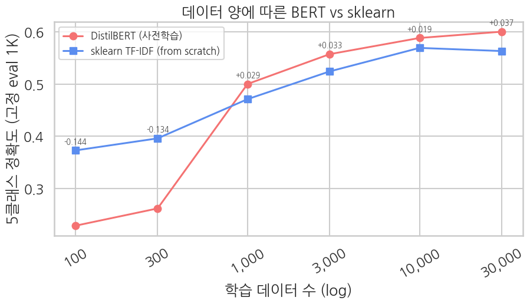

## 12-3. 부록 — 데이터 스케일링 곡선

> ▶ **[Google Colab에서 데이터 스케일링 부록 열기](https://colab.research.google.com/github/yoon-gu/neuqes-101/blob/master/12_bert_multiclass/12_bert_multiclass_data_scaling.ipynb)** — Ch 12 본편의 “BERT가 sklearn보다 근소하게만 앞선다”는 결과를 학습 데이터 규모 축에서 재검증합니다.

## 질문

Ch 12 본편에서는 같은 Yelp 5클래스 분류에서 DistilBERT가 `sklearn` TF-IDF + LogReg보다 앞섰지만, 격차는 크지 않았습니다. 이 부록의 질문은 단순합니다.

**“데이터가 더 많아지면 BERT가 확실히 벌리는가, 아니면 5클래스 별점 task 자체가 어려운가?”**

이를 보기 위해 학습 데이터 수를 100, 300, 1,000, 3,000, 10,000, 30,000으로 늘리며 같은 고정 평가셋 1,000개에서 정확도를 비교합니다.

## 실험 조건

| 항목 | 설정 |
|---|---|
| 데이터 | Yelp full review, 별점 1-5 그대로 |
| 평가셋 | 고정 1,000개 |
| 학습 크기 | 100, 300, 1K, 3K, 10K, 30K |
| BERT | `distilbert-base-uncased`, 2 epoch |
| sklearn | `TfidfVectorizer` + `LogisticRegression` |
| 비교 지표 | 5클래스 accuracy |

## 결과

| 학습 수 | sklearn | BERT | BERT - sklearn |
|---:|---:|---:|---:|
| 100 | 0.373 | 0.229 | -0.144 |
| 300 | 0.396 | 0.262 | -0.134 |
| 1,000 | 0.471 | 0.500 | +0.029 |
| 3,000 | 0.524 | 0.557 | +0.033 |
| 10,000 | 0.569 | 0.588 | +0.019 |
| 30,000 | 0.563 | 0.600 | +0.037 |

## 결과 해석

1. **작은 데이터에서는 sklearn이 압승합니다.** 100-300개 구간에서는 BERT가 6,700만 파라미터를 task에 맞게 적응시키기 어렵습니다. 이 구간의 BERT는 거의 random baseline에 가깝고, TF-IDF는 적은 데이터에서도 강한 단어 빈도 신호를 바로 씁니다.
2. **교차점은 대략 N=1,000입니다.** 1,000개부터 BERT가 sklearn을 앞서기 시작합니다. 사전학습 표현이 task에 적응할 최소 데이터가 필요하다는 뜻입니다.
3. **30K까지 늘려도 격차는 약 +0.04입니다.** 본편의 “근소 우위”는 버그가 아니라 정상적인 결과입니다. 데이터 양의 문제도 있지만, 별점 5클래스는 인접 별점 경계가 모호한 순서형 task라 이진 분류처럼 극적인 격차가 나기 어렵습니다.

## 본편과의 연결

Ch 12 본편의 비교는 5,000개 학습셋에서 나온 한 점입니다. 이 부록의 곡선은 그 한 점을 데이터 규모 축 위에 놓고 해석하게 해 줍니다. 결론은 “BERT가 약하다”가 아니라, **큰 모델도 충분한 데이터가 있어야 이기고, 5클래스 별점 분류는 데이터가 커져도 본질적으로 어려운 task**라는 것입니다.

