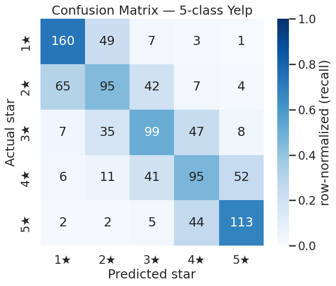
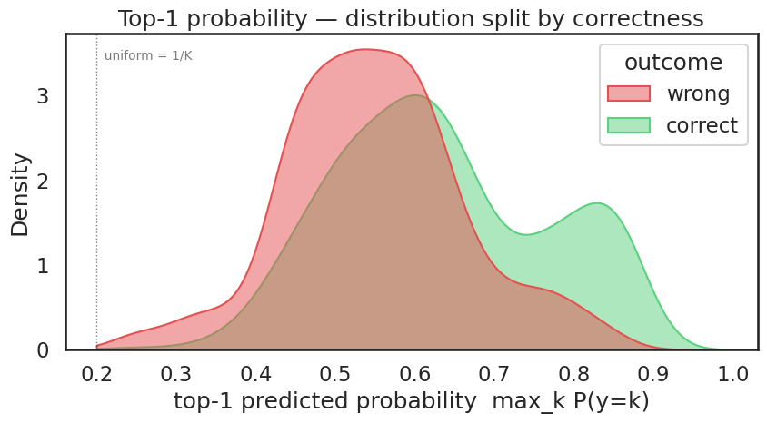
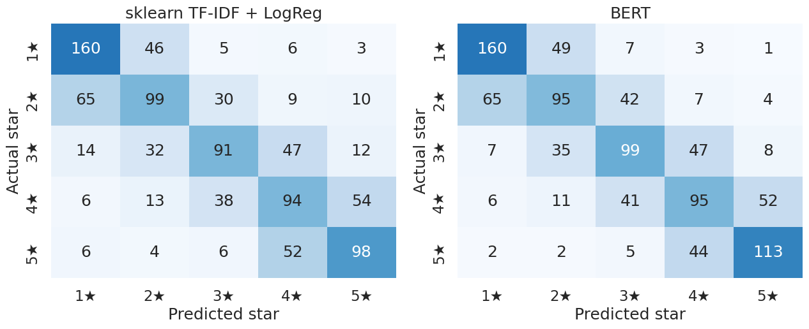

## 환경 준비

```python
!pip install -q transformers datasets
```

```python
import warnings
warnings.filterwarnings("ignore")

import numpy as np
import pandas as pd
import matplotlib.pyplot as plt
import seaborn as sns
import torch
from datasets import load_dataset
from transformers import (
    AutoTokenizer, AutoModelForSequenceClassification,
    Trainer, TrainingArguments,
)
from sklearn.metrics import (
    accuracy_score, precision_recall_fscore_support,
    classification_report, roc_auc_score, confusion_matrix,
)
# Ch 5 sklearn baseline 비교용
from sklearn.feature_extraction.text import TfidfVectorizer
from sklearn.linear_model import LogisticRegression

plt.rcParams["axes.unicode_minus"] = False

print(f"PyTorch:        {torch.__version__}")
print(f"CUDA available: {torch.cuda.is_available()}")
if torch.cuda.is_available():
    print(f"GPU:             {torch.cuda.get_device_name(0)}")
else:
    print("Warning: CPU runtime — training will be very slow. Switch to T4 recommended.")
```

**▶ 실행 결과**

```text
PyTorch:        2.11.0+cu128
CUDA available: True
GPU:             Tesla T4
```

```python
!nvidia-smi
```

**▶ 실행 결과**

```text
Wed Jun 17 21:37:09 2026       
+-----------------------------------------------------------------------------------------+
| NVIDIA-SMI 580.82.07              Driver Version: 580.82.07      CUDA Version: 13.0     |
+-----------------------------------------+------------------------+----------------------+
| GPU  Name                 Persistence-M | Bus-Id          Disp.A | Volatile Uncorr. ECC |
| Fan  Temp   Perf          Pwr:Usage/Cap |           Memory-Usage | GPU-Util  Compute M. |
|                                         |                        |               MIG M. |
|=========================================+========================+======================|
|   0  Tesla T4                       Off |   00000000:00:04.0 Off |                    0 |
| N/A   52C    P8             11W /   70W |       3MiB /  15360MiB |      0%      Default |
|                                         |                        |                  N/A |
+-----------------------------------------+------------------------+----------------------+

+-----------------------------------------------------------------------------------------+
| Processes:                                                                              |
|  GPU   GI   CI              PID   Type   Process name                        GPU Memory |
|        ID   ID                                                               Usage      |
|=========================================================================================|
|  No running processes found                                                             |
+-----------------------------------------------------------------------------------------+
```

```python
tokenizer = AutoTokenizer.from_pretrained("distilbert-base-uncased")

ds = load_dataset("Yelp/yelp_review_full")
train_full = ds["train"].shuffle(seed=42).select(range(5000))
eval_full  = ds["test"].shuffle(seed=42).select(range(1000))

print(f"train: {len(train_full)} samples")
print(f"eval:  {len(eval_full)} samples")
print(f"\nClass distribution (train):")
for k in range(5):
    n = sum(1 for x in train_full["label"] if x == k)
    print(f"  star {k + 1} (label {k}): {n} ({n / len(train_full):.1%})")

# 첫 샘플 미리보기
print(f"\nFirst sample:")
print(f"  label: {train_full[0]['label']}  (star {train_full[0]['label'] + 1})")
print(f"  text:  {train_full[0]['text'][:200]}...")
```

**▶ 실행 결과**

```text
train: 5000 samples
eval:  1000 samples

Class distribution (train):
  star 1 (label 0): 1017 (20.3%)
  star 2 (label 1): 1027 (20.5%)
  star 3 (label 2): 960 (19.2%)
  star 4 (label 3): 1021 (20.4%)
  star 5 (label 4): 975 (19.5%)

First sample:
  label: 4  (star 5)
  text:  I stalk this truck.  I've been to industrial parks where I pretend to be a tech worker standing in line, strip mall parking lots, a …(뒤 72자 생략)
```

```python
def tokenize_fn(batch):
    out = tokenizer(batch["text"], truncation=True, max_length=128)
    out["labels"] = [int(l) for l in batch["label"]]   # 0-4 int (Yelp의 라벨 그대로)
    return out

train_tok = train_full.map(tokenize_fn, batched=True).remove_columns(["text", "label"])
eval_tok  = eval_full.map(tokenize_fn,  batched=True).remove_columns(["text", "label"])

print(train_tok)
print(f"\nFirst sample label: {train_tok[0]['labels']}  (int scalar in 0-4)")
```

**▶ 실행 결과**

```text
Dataset({
    features: ['input_ids', 'token_type_ids', 'attention_mask', 'labels'],
    num_rows: 5000
})

First sample label: 4  (int scalar in 0-4)
```

```python
STAR_LABELS = {0: "1★", 1: "2★", 2: "3★", 3: "4★", 4: "5★"}

model = AutoModelForSequenceClassification.from_pretrained(
    "distilbert-base-uncased",
    num_labels=5,
    problem_type="single_label_classification",
    id2label=STAR_LABELS,
    label2id={v: k for k, v in STAR_LABELS.items()},
)

def param_summary(m):
    total     = sum(p.numel() for p in m.parameters())
    trainable = sum(p.numel() for p in m.parameters() if p.requires_grad)
    return total, trainable

total, trainable = param_summary(model)
print(f"Parameters:           {total:>13,}  ({total/1e6:.1f} M)")
print(f"Trainable parameters: {trainable:>13,}  ({trainable/total:.1%})")
print(f"Classifier:           {model.classifier}")
print(f"problem_type:         {model.config.problem_type}")
print(f"id2label:             {model.config.id2label}")
```

**▶ 실행 결과**

```text
[transformers] DistilBertForSequenceClassification LOAD REPORT from: distilbert-base-uncased
Key                     | Status     | 
------------------------+------------+-
vocab_projector.bias    | UNEXPECTED | 
vocab_layer_norm.bias   | UNEXPECTED | 
vocab_transform.weight  | UNEXPECTED | 
vocab_layer_norm.weight | UNEXPECTED | 
vocab_transform.bias    | UNEXPECTED | 
classifier.weight       | MISSING    | 
pre_classifier.bias     | MISSING    | 
classifier.bias         | MISSING    | 
pre_classifier.weight   | MISSING    | 

Notes:
- UNEXPECTED:	can be ignored when loading from different task/architecture; not ok if you expect identical arch.
- MISSING:	those params were newly initialized because missing from the checkpoint. Consider training on your downstream task.
Parameters:              66,957,317  (67.0 M)
Trainable parameters:    66,957,317  (100.0%)
Classifier:           Linear(in_features=768, out_features=5, bias=True)
problem_type:         single_label_classification
id2label:             {0: '1★', 1: '2★', 2: '3★', 3: '4★', 4: '5★'}
```

```python
!nvidia-smi
```

**▶ 실행 결과**

```text
Wed Jun 17 21:37:42 2026       
+-----------------------------------------------------------------------------------------+
| NVIDIA-SMI 580.82.07              Driver Version: 580.82.07      CUDA Version: 13.0     |
+-----------------------------------------+------------------------+----------------------+
| GPU  Name                 Persistence-M | Bus-Id          Disp.A | Volatile Uncorr. ECC |
| Fan  Temp   Perf          Pwr:Usage/Cap |           Memory-Usage | GPU-Util  Compute M. |
|                                         |                        |               MIG M. |
|=========================================+========================+======================|
|   0  Tesla T4                       Off |   00000000:00:04.0 Off |                    0 |
| N/A   51C    P8             10W /   70W |       3MiB /  15360MiB |      0%      Default |
|                                         |                        |                  N/A |
+-----------------------------------------+------------------------+----------------------+

+-----------------------------------------------------------------------------------------+
| Processes:                                                                              |
|  GPU   GI   CI              PID   Type   Process name                        GPU Memory |
|        ID   ID                                                               Usage      |
|=========================================================================================|
|  No running processes found                                                             |
+-----------------------------------------------------------------------------------------+
```

```python
def compute_metrics(eval_pred):
    logits, labels = eval_pred
    # 안정 softmax (K=5)
    exp = np.exp(logits - logits.max(axis=1, keepdims=True))
    probs_full = exp / exp.sum(axis=1, keepdims=True)   # (B, 5)
    preds = probs_full.argmax(axis=1)                   # (B,)

    p, r, f1, _ = precision_recall_fscore_support(labels, preds, average="macro", zero_division=0)
    out = {
        "accuracy":        float(accuracy_score(labels, preds)),
        "macro_precision": float(p),
        "macro_recall":    float(r),
        "macro_f1":        float(f1),
    }
    # multi-class AUC: One-vs-Rest, 모든 라벨이 적어도 한 개 등장해야 계산 가능
    try:
        out["auc_ovr"] = float(roc_auc_score(labels, probs_full, multi_class="ovr"))
    except ValueError:
        out["auc_ovr"] = float("nan")
    return out
```

```python
training_args = TrainingArguments(
    output_dir="./ch12_output",
    num_train_epochs=2,
    per_device_train_batch_size=16,
    per_device_eval_batch_size=32,
    learning_rate=2e-5,
    fp16=True,
    eval_strategy="epoch",
    logging_steps=50,
    save_strategy="no",
    report_to="none",
    seed=42,
)

trainer = Trainer(
    model=model,
    args=training_args,
    train_dataset=train_tok,
    eval_dataset=eval_tok,
    processing_class=tokenizer,
    compute_metrics=compute_metrics,
)

train_result = trainer.train()
print(f"\nTraining done — mean train loss: {train_result.training_loss:.4f}")
print(f"random baseline loss (K=5): {np.log(5):.4f}")
```

**▶ 실행 결과**

```text
<IPython.core.display.HTML object>
Training done — mean train loss: 1.0706
random baseline loss (K=5): 1.6094
```

**결과 해석**

평균 학습 loss 1.0706은 5클래스 무작위 추측의 기준선 $\ln 5 \approx 1.6094$보다 확연히 낮아, 모델이 별점 패턴을 실제로 학습했음을 보여 줍니다.

```python
!nvidia-smi
```

**▶ 실행 결과**

```text
Wed Jun 17 21:38:21 2026       
+-----------------------------------------------------------------------------------------+
| NVIDIA-SMI 580.82.07              Driver Version: 580.82.07      CUDA Version: 13.0     |
+-----------------------------------------+------------------------+----------------------+
| GPU  Name                 Persistence-M | Bus-Id          Disp.A | Volatile Uncorr. ECC |
| Fan  Temp   Perf          Pwr:Usage/Cap |           Memory-Usage | GPU-Util  Compute M. |
|                                         |                        |               MIG M. |
|=========================================+========================+======================|
|   0  Tesla T4                       Off |   00000000:00:04.0 Off |                    0 |
| N/A   68C    P0             37W /   70W |    1577MiB /  15360MiB |     73%      Default |
|                                         |                        |                  N/A |
+-----------------------------------------+------------------------+----------------------+

+-----------------------------------------------------------------------------------------+
| Processes:                                                                              |
|  GPU   GI   CI              PID   Type   Process name                        GPU Memory |
|        ID   ID                                                               Usage      |
|=========================================================================================|
|    0   N/A  N/A             921      C   /usr/bin/python3                       1574MiB |
+-----------------------------------------------------------------------------------------+
```

```python
# 평가 metric
eval_metrics = trainer.evaluate()
print("BERT 5-class evaluation:")
for k, v in eval_metrics.items():
    if k.startswith("eval_") and isinstance(v, float):
        print(f"  {k:>22}: {v:.4f}")
```

**▶ 실행 결과**

```text
<IPython.core.display.HTML object>
<IPython.core.display.HTML object>
BERT 5-class evaluation:
               eval_loss: 1.0001
           eval_accuracy: 0.5620
    eval_macro_precision: 0.5583
       eval_macro_recall: 0.5645
           eval_macro_f1: 0.5607
            eval_auc_ovr: 0.8652
```

**결과 해석**

정확도 0.5620은 5클래스 무작위 기준선 0.2(=1/5)의 2.8배 수준이며, OvR AUC 0.8652는 정답 클래스에 더 높은 확률을 부여하는 순위 매김 능력이 정확도보다 한층 우수함을 보여 줍니다.

```python
# logits → softmax → argmax
preds_output = trainer.predict(eval_tok)
logits  = preds_output.predictions               # (B, 5)
labels  = preds_output.label_ids.astype(int)     # (B,)

exp = np.exp(logits - logits.max(axis=1, keepdims=True))
probs_full = exp / exp.sum(axis=1, keepdims=True)  # (B, 5)
preds = probs_full.argmax(axis=1)                  # (B,)

# top-1 확률 (모델이 선택한 클래스의 확률)
top1_prob = probs_full.max(axis=1)
correct = (preds == labels)

print(f"logits shape: {logits.shape}")
print(f"top-1 prob range: [{top1_prob.min():.4f}, {top1_prob.max():.4f}]")
print(f"top-1 prob mean: correct={top1_prob[correct].mean():.4f}, wrong={top1_prob[~correct].mean():.4f}")
print(f"\nFirst 5 samples:")
print(pd.DataFrame({
    "label (star-1)": labels[:5],
    "pred (star-1)":  preds[:5],
    "top-1 prob":     top1_prob[:5].round(4),
    "correct?":       correct[:5],
}).to_string(index=False))
```

**▶ 실행 결과**

```text
<IPython.core.display.HTML object>
logits shape: (1000, 5)
top-1 prob range: [0.2334, 0.8789]
top-1 prob mean: correct=0.6330, wrong=0.5493

First 5 samples:
 label (star-1)  pred (star-1)  top-1 prob  correct?
              2              4      0.5291     False
              4              3      0.4671     False
              1              0      0.7869     False
              4              4      0.5081      True
              3              3      0.6116      True
```

**결과 해석**

맞힌 예측의 top-1 확률 평균(0.6330)이 틀린 예측(0.5493)보다 높아, 모델의 확신도가 정답 여부와 어느 정도 비례합니다. 다만 틀린 사례도 평균 0.55로 꽤 확신하고 있어 중간 별점에서는 오답에도 자신감이 남아 있음을 알 수 있습니다.

```python
sns.set_theme(style="white", context="talk")

cm = confusion_matrix(labels, preds, labels=list(range(5)))
# 정답 라벨별 정규화 — 각 행 합이 1이 되어 *재현율* 을 직접 읽을 수 있음
cm_norm = cm / cm.sum(axis=1, keepdims=True)

fig, ax = plt.subplots(figsize=(7, 6))
sns.heatmap(
    cm_norm, annot=cm, fmt="d",                       # 색은 비율, 숫자는 raw count
    cmap="Blues", vmin=0, vmax=1,
    xticklabels=[STAR_LABELS[k] for k in range(5)],
    yticklabels=[STAR_LABELS[k] for k in range(5)],
    cbar_kws={"label": "row-normalized (recall)"}, ax=ax,
)
ax.set_xlabel("Predicted star")
ax.set_ylabel("Actual star")
ax.set_title("Confusion Matrix — 5-class Yelp")
plt.tight_layout()
plt.show()
```

**▶ 실행 결과**



**결과 해석**

혼동행렬의 오분류가 대각선 바로 옆 칸(인접 별점)에 몰려 있어, 별점이 순서형(ordinal) 척도라는 성질이 그대로 드러납니다. 양 끝(1★·5★)은 재현율이 높지만 가운데 별점일수록 인접 클래스와 헷갈리는 경향이 보입니다.

```python
df_top = pd.DataFrame({
    "top1_prob": top1_prob,
    "outcome":   np.where(correct, "correct", "wrong"),
})

fig, ax = plt.subplots(figsize=(9, 5))
sns.kdeplot(
    data=df_top, x="top1_prob", hue="outcome",
    fill=True, common_norm=False, alpha=0.5,
    palette={"correct": "#5BD17F", "wrong": "#E55050"},
    clip=(1/5, 1.0), ax=ax,
)
ax.axvline(1/5, color="black", lw=1.0, ls=":", alpha=0.5)
ax.text(1/5, ax.get_ylim()[1]*0.95, "  uniform = 1/K", va="top", fontsize=10, alpha=0.6)
ax.set_title("Top-1 probability — distribution split by correctness")
ax.set_xlabel("top-1 predicted probability  max_k P(y=k)")
ax.set_ylabel("Density")
plt.tight_layout()
plt.show()
```

**▶ 실행 결과**



**결과 해석**

맞힌 예측(초록)의 분포가 틀린 예측(빨강)보다 오른쪽(높은 확률)으로 치우쳐 있어, top-1 확률을 신뢰도 지표로 어느 정도 활용할 수 있음을 시각적으로 확인할 수 있습니다. 두 분포가 균등 확률선 1/K 부근에서 상당히 겹쳐 5클래스 분류의 본질적인 모호함도 함께 드러납니다.

```python
# 클래스별 분류 리포트 (precision/recall/F1 클래스 단위)
print(classification_report(
    labels, preds,
    target_names=[STAR_LABELS[k] for k in range(5)],
    digits=4, zero_division=0,
))
```

**▶ 실행 결과**

```text
              precision    recall  f1-score   support

          1★     0.6667    0.7273    0.6957       220
          2★     0.4948    0.4460    0.4691       213
          3★     0.5103    0.5051    0.5077       196
          4★     0.4847    0.4634    0.4738       205
          5★     0.6348    0.6807    0.6570       166

    accuracy                         0.5620      1000
   macro avg     0.5583    0.5645    0.5607      1000
weighted avg     0.5568    0.5620    0.5587      1000
```

**결과 해석**

양 끝 별점(1★ F1 0.6957, 5★ F1 0.6570)이 가운데 별점(2★-4★ F1 0.47-0.51)보다 뚜렷이 잘 분류됩니다. 가운데 별점은 인접 별점과 어휘·감정 표현이 겹쳐 구분이 어렵다는 점이 클래스별 점수에 그대로 나타납니다.

```python
# Ch 5 셋업 재현 — TF-IDF + multinomial LogReg
texts_train  = list(train_full["text"])
labels_train = list(train_full["label"])
texts_eval   = list(eval_full["text"])
labels_eval  = list(eval_full["label"])

vec = TfidfVectorizer(max_features=20000, ngram_range=(1, 2))
X_train = vec.fit_transform(texts_train)
X_eval  = vec.transform(texts_eval)

clf = LogisticRegression(max_iter=2000, n_jobs=-1)   # 최신 sklearn은 multinomial이 default for multi-class
clf.fit(X_train, labels_train)

probs_sk = clf.predict_proba(X_eval)                 # (B, 5)
preds_sk = probs_sk.argmax(axis=1)                   # (B,)

acc_sk = float(accuracy_score(labels_eval, preds_sk))
ps, rs, f1s, _ = precision_recall_fscore_support(labels_eval, preds_sk, average="macro", zero_division=0)
auc_sk = float(roc_auc_score(labels_eval, probs_sk, multi_class="ovr"))

print(f"sklearn TF-IDF + LogReg:")
print(f"  vocabulary size:    {len(vec.vocabulary_):,}")
print(f"  trained parameters: {clf.coef_.size + clf.intercept_.size:,}  (~{clf.coef_.size/1e3:.0f} K)")
print(f"  accuracy:           {acc_sk:.4f}")
print(f"  macro F1:           {f1s:.4f}")
print(f"  AUC (OvR):          {auc_sk:.4f}")
```

**▶ 실행 결과**

```text
sklearn TF-IDF + LogReg:
  vocabulary size:    20,000
  trained parameters: 100,005  (~100 K)
  accuracy:           0.5420
  macro F1:           0.5380
  AUC (OvR):          0.8420
```

**결과 해석**

TF-IDF + LogReg 기준선만으로도 정확도 0.5420, AUC 0.8420으로 무작위 추측을 크게 웃돕니다. 같은 5,000 샘플에서 단순 선형 모델이 이미 견고한 출발점을 제공한다는 점이 BERT 성능을 평가하는 비교 기준이 됩니다.

```python
metrics_bert = {
    k.replace("eval_", ""): v for k, v in eval_metrics.items()
    if k.startswith("eval_") and isinstance(v, float)
}
metrics_sk = {
    "accuracy":        acc_sk,
    "macro_precision": float(ps),
    "macro_recall":    float(rs),
    "macro_f1":        float(f1s),
    "auc_ovr":         auc_sk,
}

common = [k for k in metrics_bert if k in metrics_sk]
cmp = pd.DataFrame({
    "metric":             common,
    "sklearn (TF-IDF)":   [metrics_sk[k]   for k in common],
    "BERT":               [metrics_bert[k] for k in common],
})
cmp["BERT - sklearn"] = cmp["BERT"] - cmp["sklearn (TF-IDF)"]
print(cmp.round(4).to_string(index=False))
```

**▶ 실행 결과**

```text
         metric  sklearn (TF-IDF)   BERT  BERT - sklearn
       accuracy            0.5420 0.5620          0.0200
macro_precision            0.5377 0.5583          0.0205
   macro_recall            0.5410 0.5645          0.0235
       macro_f1            0.5380 0.5607          0.0227
        auc_ovr            0.8420 0.8652          0.0232
```

**결과 해석**

BERT가 모든 지표에서 sklearn을 앞서지만 그 차이는 정확도 +0.02, AUC +0.023 정도로 크지 않습니다. 670배 많은 파라미터(67M 대 100K)를 쓰고도 5,000 샘플 규모에서는 격차가 작아, 데이터가 적을 때 사전학습 모델의 이점이 제한적일 수 있음을 시사합니다.

```python
cm_bert = confusion_matrix(labels, preds, labels=list(range(5)))
cm_sk   = confusion_matrix(labels_eval, preds_sk, labels=list(range(5)))

cm_bert_n = cm_bert / cm_bert.sum(axis=1, keepdims=True)
cm_sk_n   = cm_sk   / cm_sk.sum(axis=1, keepdims=True)

fig, axes = plt.subplots(1, 2, figsize=(13, 5.5))
for ax, cm_n, cm_raw, title in [
    (axes[0], cm_sk_n,   cm_sk,   "sklearn TF-IDF + LogReg"),
    (axes[1], cm_bert_n, cm_bert, "BERT"),
]:
    sns.heatmap(
        cm_n, annot=cm_raw, fmt="d", cmap="Blues", vmin=0, vmax=1,
        xticklabels=[STAR_LABELS[k] for k in range(5)],
        yticklabels=[STAR_LABELS[k] for k in range(5)],
        cbar=False, ax=ax,
    )
    ax.set_title(title)
    ax.set_xlabel("Predicted star")
    ax.set_ylabel("Actual star")
plt.tight_layout()
plt.show()
```

**▶ 실행 결과**



**결과 해석**

두 모델 모두 오분류가 대각선 인접 칸에 몰리는 동일한 순서형 패턴을 보여, 가운데 별점에서 헷갈리는 현상은 모델 종류가 아니라 태스크 자체의 성질임을 알 수 있습니다. BERT 쪽 대각선이 약간 더 진해 전반적으로 조금 더 정확함을 시각적으로 확인할 수 있습니다.
