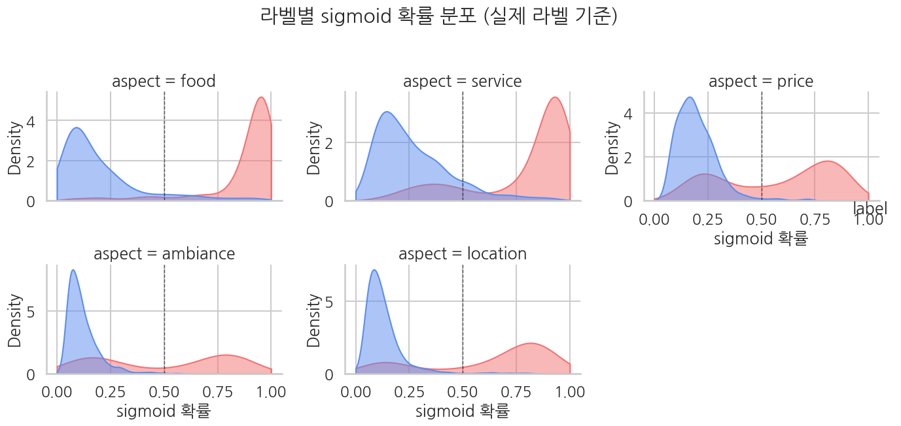
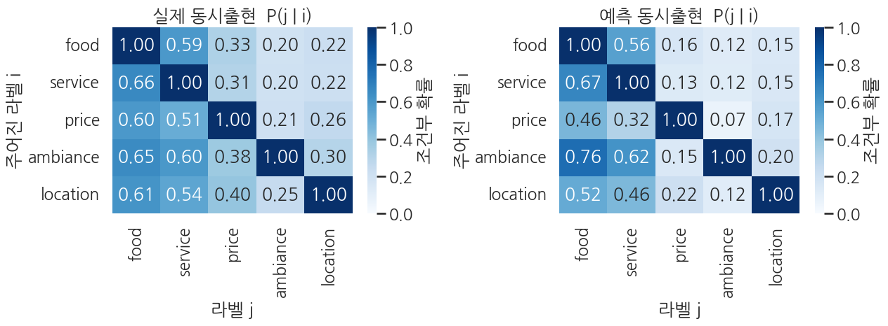

## 평가 — 라벨별 sigmoid 확률 + 활성 패턴

Ch 10의 sigmoid+BCE 평가 패턴을 *5번 반복* 한 셈입니다 — 각 라벨에 대해 독립적으로 확률 분포·정확도·F1을 계산.

```python
# 평가 metric
eval_metrics = trainer.evaluate()
print("BERT multi-label evaluation:")
for k, v in eval_metrics.items():
    if k.startswith("eval_") and isinstance(v, float):
        print(f"  {k:>22}: {v:.4f}")
```

**▶ 실행 결과**

```text
Training Loss  Validation Loss  Epoch  Hamming Loss  Micro F1  Micro Precision  Micro Recall  Macro F1  Macro Precision  Macro Recall  Macro Auc  Runtime   Samples Per Second  Steps Per Second
0.286978       0.293115         2      0.102000      0.839925  0.914559         0.776553      0.802303  0.932820         0.720649      0.917939   1.099000  909.899000          29.117000
BERT multi-label evaluation:
               eval_loss: 0.2931
       eval_hamming_loss: 0.1020
           eval_micro_f1: 0.8399
    eval_micro_precision: 0.9146
       eval_micro_recall: 0.7766
           eval_macro_f1: 0.8023
    eval_macro_precision: 0.9328
       eval_macro_recall: 0.7206
          eval_macro_auc: 0.9179
            eval_runtime: 1.0990
  eval_samples_per_second: 909.8990
   eval_steps_per_second: 29.1170
```

**결과 해석**

micro F1 0.84, macro F1 0.80으로 micro가 조금 더 높습니다 — 흔한 food·service가 점수를 끌어올리고 드문 라벨이 macro를 깎는 전형적 패턴이지만, 격차가 0.04 수준이라 라벨 간 편차가 심하지는 않습니다. precision(0.91)이 recall(0.78)보다 높아 모델이 *확신할 때만 활성* 하는 보수적 경향을 보입니다.

```python
# logits → per-label sigmoid → multi-hot 예측
preds_output = trainer.predict(eval_tok)
logits = preds_output.predictions                   # (N, 5)
labels = preds_output.label_ids.astype(int)         # (N, 5) multi-hot
probs  = 1.0 / (1.0 + np.exp(-logits))              # (N, 5) per-label prob
preds  = (probs >= 0.5).astype(int)                 # (N, 5) multi-hot prediction

print(f"logits shape: {logits.shape}")
print(f"prob ranges per label:")
for k, a in enumerate(ASPECTS):
    print(f"  {a:>9}: [{probs[:, k].min():.4f}, {probs[:, k].max():.4f}]  "
          f"true rate={labels[:, k].mean():.1%}, pred rate={preds[:, k].mean():.1%}")
```

**▶ 실행 결과**

```text
logits shape: (1000, 5)
prob ranges per label:
       food: [0.0327, 0.9897]  true rate=55.2%, pred rate=55.6%
    service: [0.0526, 0.9815]  true rate=49.7%, pred rate=46.6%
      price: [0.0667, 0.9140]  true rate=30.4%, pred rate=19.6%
   ambiance: [0.0281, 0.8961]  true rate=16.8%, pred rate=8.9%
   location: [0.0312, 0.9280]  true rate=20.2%, pred rate=15.6%
```

**결과 해석**

food는 true rate와 pred rate가 55%대로 거의 일치하고 service도 3%p 차이라 잘 맞습니다. 반면 드문 라벨일수록 예측 활성률이 낮아 price는 정답의 2/3, ambiance는 절반 수준만 활성합니다. 다섯 라벨 모두 최대 확률이 0.89를 넘으므로 확률을 못 올려서가 아니라, 0.5 임계값 아래에 머무는 샘플이 많아 생기는 차이입니다.

```python
# Per-label classification report
print(classification_report(
    labels, preds,
    target_names=ASPECTS,
    digits=4, zero_division=0,
))
```

**▶ 실행 결과**

```text
              precision    recall  f1-score   support

        food     0.9209    0.9275    0.9242       552
     service     0.8734    0.8189    0.8453       497
       price     0.9388    0.6053    0.7360       304
    ambiance     0.9888    0.5238    0.6848       168
    location     0.9423    0.7277    0.8212       202

   micro avg     0.9146    0.7766    0.8399      1723
   macro avg     0.9328    0.7206    0.8023      1723
weighted avg     0.9195    0.7766    0.8328      1723
 samples avg     0.7618    0.6878    0.7048      1723
```

**결과 해석**

모든 라벨이 precision 0.87 이상으로 *틀린 활성은 거의 하지 않습니다*. 격차는 recall에서 벌어집니다 — food가 0.93인 반면 ambiance는 0.52로 정답의 절반만 잡고, price(0.61)·location(0.73)도 precision보다 크게 낮습니다. 드문 라벨에서 recall이 떨어지는 것이 0.5 임계값의 보수성에서 비롯됨을 보여줍니다(FAQ Q1).

### 샘플 단위 해석 — 모델 출력을 읽어내는 법

평가 metric (F1·hamming·AUC) 은 *전체 평균* 이라 모델이 *한 리뷰를 보고 어떻게 판단했는지* 직관이 안 옵니다. 본격 시각화로 가기 전에, 5차원 출력을 *문장 단위* 로 어떻게 해석하는지 두 샘플로 짚어 보겠습니다.

```python
# 평가 셋에서 항목 활성이 가장 *많은* 샘플 1개 + 가장 *적은* 샘플 1개 골라 읽어보기
n_active = labels.sum(axis=1)
idx_many = int(np.argmax(n_active))   # 정답 항목이 가장 많은 샘플
idx_few  = int(np.argmin(n_active))   # 정답 항목이 가장 적은 샘플

# eval_full 에서 원문 텍스트 가져오기 (eval_tok 와 같은 순서)
texts = list(eval_full["text"])

for label_kind, idx in [("many active labels", idx_many), ("few active labels", idx_few)]:
    print("=" * 78)
    print(f"sample #{idx}  ({label_kind})")
    print("=" * 78)
    print(f"text (truncated): {texts[idx][:320]}{'...' if len(texts[idx]) > 320 else ''}")
    print()
    print(f"{'aspect':>10}  {'true':>6}  {'prob':>8}  {'pred (>=0.5)':>14}  match")
    for k, a in enumerate(ASPECTS):
        t = int(labels[idx, k])
        p = float(probs[idx, k])
        pr = int(preds[idx, k])
        ok = "✓" if t == pr else "✗"
        print(f"  {a:>9}  {t:>6}  {p:>8.4f}  {pr:>14}    {ok}")

    # 사람이 읽는 한 줄 해석
    pred_active = [a for k, a in enumerate(ASPECTS) if preds[idx, k]]
    true_active = [a for k, a in enumerate(ASPECTS) if labels[idx, k]]
    print()
    print(f"  predicted: {pred_active}")
    print(f"  true:      {true_active}")
    print()
```

**▶ 실행 결과**

```text
==============================================================================
sample #29  (many active labels)
==============================================================================
text (truncated): It's hard to complain about this place given the price I got it for! \n**Warning** This is a long review, there is a lot t …(뒤 201자 생략)

    aspect    true      prob    pred (>=0.5)  match
       food       1    0.2942               0    ✗
    service       1    0.3481               0    ✗
      price       1    0.8292               1    ✓
   ambiance       1    0.3188               0    ✗
   location       1    0.6720               1    ✓

  predicted: ['price', 'location']
  true:      ['food', 'service', 'price', 'ambiance', 'location']

==============================================================================
sample #4  (few active labels)
==============================================================================
text (truncated): I don't quite get this place or why Asians love it, but it is very good :)

    aspect    true      prob    pred (>=0.5)  match
       food       0    0.0876               0    ✓
    service       0    0.1027               0    ✓
      price       0    0.0957               0    ✓
   ambiance       0    0.0563               0    ✓
   location       0    0.0551               0    ✓

  predicted: []
  true:      []
```

**결과 해석**

5개 항목이 전부 정답인 샘플 #29에서 모델은 price·location만 맞히고 food·service·ambiance는 prob 0.3 안팎으로 눌러 놓쳤습니다 — recall이 낮은 보수적 경향이 한 샘플에서 그대로 드러납니다. 반대로 활성 라벨이 하나도 없는 샘플 #4는 다섯 확률이 모두 0.11 이하라 전부 0을 깔끔하게 맞혔습니다.

**읽는 법 — 표를 한 줄씩**

1. **`true` 컬럼** — 키워드 합성으로 만든 *정답 multi-hot*. 1 이면 "이 리뷰 본문에 그 항목 키워드가 등장했다".
2. **`prob` 컬럼** — 모델이 출력한 *각 항목 sigmoid 확률* (독립). 합이 1 일 필요 없음 — multi-label 의 본질.
3. **`pred` 컬럼** — `prob ≥ 0.5` 이면 1, 아니면 0. *임계값 0.5* 는 사후 후처리 — 라벨별로 다른 값을 줄 수도 있음 (FAQ Q1).
4. **사람이 읽는 한 줄**: `predicted: [...]` 와 `true: [...]` 가 *얼마나 겹치는지* — 두 리스트가 같으면 완벽한 hit, 한 항목 차이면 *near miss*, 전혀 다르면 모델이 헛다리.

**이 표가 한 리뷰에 대해 보여주는 것**:

- 모델이 *어떤 항목에 자신* 있는지 (prob 0.9 이상)
- 어떤 항목에서 *망설이는지* (prob 0.4-0.6 부근 — threshold 살짝 옮기면 결과가 뒤집히는 자리)
- 키워드 합성 라벨의 한계가 드러나는 순간 — 예: 본문에 "10 minutes wait" 처럼 service 를 *키워드 없이* 묘사한 경우 정답은 `service=0` 인데 모델이 prob 0.7 로 활성할 수 있음. 이건 *모델 오답이 아니라 합성 라벨의 누락* 으로 봐야 함.

**전체 metric 의 micro/macro F1 해석**: 위 표 같은 *샘플별 (true vs pred) 비교* 를 평가 셋 1,000건에 대해 *집계* 한 게 §4 상단 metric. micro 는 모든 (샘플 × 라벨) 위치를 동등하게 세고, macro 는 항목 5개의 F1 을 평균. 활성률이 낮은 항목 (location 등) 의 정확도가 *전체* 에 묻히는 걸 막으려면 macro 를 봅니다.

### 4-1. 메인 그림 — 라벨별 sigmoid 확률 KDE (5 패널)

Ch 10에서 봤던 *확률 공간 KDE* 를 5개 라벨에 대해 *각각* 그립니다. 라벨이 *독립* 이라는 multi-label의 본질이 시각적으로 드러나는 그림입니다 — 라벨마다 학습 난이도와 분리도가 *다를 수* 있습니다.

```python
sns.set_theme(style="whitegrid", context="talk", font="NanumGothic", rc={"axes.unicode_minus": False})

# Long-form DataFrame 만들기
records = []
for k, a in enumerate(ASPECTS):
    for i in range(len(probs)):
        records.append({"aspect": a, "prob": probs[i, k], "label": int(labels[i, k])})
df_long = pd.DataFrame(records)

g = sns.FacetGrid(
    df_long, col="aspect", col_wrap=3, height=3.2, aspect=1.4,
    sharex=True, sharey=False,
)
g.map_dataframe(
    sns.kdeplot, x="prob", hue="label",
    fill=True, common_norm=False, alpha=0.5,
    palette={0: "#5B8DEF", 1: "#F47272"}, clip=(0, 1),
)
for ax in g.axes.flat:
    ax.axvline(0.5, color="black", lw=1.0, ls="--", alpha=0.6)
    ax.set_xlabel("sigmoid 확률")
g.add_legend(title="label")
g.fig.suptitle("라벨별 sigmoid 확률 분포 (실제 라벨 기준)", y=1.03)
plt.tight_layout()
plt.show()
```

**▶ 실행 결과**



**해석**

- **잘 학습된 라벨** (예: food): label=0 곡선은 0 근처, label=1 곡선은 1 근처에 있고 둘이 거의 만나지 않음. *분리가 깨끗*.
- **활성률이 낮은 라벨** (예: location): label=1 샘플이 적어 곡선이 노이즈가 큼. 그래도 분리는 보여야 함.
- **두 곡선이 0.5 근처에서 크게 겹치면** → 그 라벨은 모델이 잘 못 분리. 키워드 매칭이 *얕아서* 진짜 신호를 못 잡았거나, 학습 데이터가 부족한 상태.

### 4-2. 보조 그림 — 라벨 간 공동 활성 패턴

Multi-label 의 핵심 질문 중 하나: *어떤 라벨 쌍이 같이 등장하는가?* 모델이 라벨 *간 상관* 을 학습 데이터에서 흡수했는지 확인합니다.

`true co-occurrence` (실제 데이터의 라벨 동시 등장 빈도)와 `predicted co-occurrence` (모델 예측의 동시 등장 빈도)를 나란히 그려 두 행렬이 비슷하면 모델이 라벨 구조를 잘 잡고 있는 것.

```python
def cooccurrence_matrix(Y):
    # Y: (N, K) multi-hot. Returns (K, K) where M[i,j] = P(label_j=1 | label_i=1).
    Y = Y.astype(float)
    K_ = Y.shape[1]
    M = np.zeros((K_, K_))
    for i in range(K_):
        row_i = Y[:, i]
        n_i = row_i.sum()
        if n_i == 0:
            continue
        for j in range(K_):
            M[i, j] = (row_i * Y[:, j]).sum() / n_i
    return M

cooc_true = cooccurrence_matrix(labels)
cooc_pred = cooccurrence_matrix(preds)

fig, axes = plt.subplots(1, 2, figsize=(13, 5))
for ax, M, title in [
    (axes[0], cooc_true, "실제 동시출현  P(j | i)"),
    (axes[1], cooc_pred, "예측 동시출현  P(j | i)"),
]:
    sns.heatmap(
        M, annot=True, fmt=".2f", cmap="Blues", vmin=0, vmax=1,
        xticklabels=ASPECTS, yticklabels=ASPECTS,
        cbar_kws={"label": "조건부 확률"}, ax=ax,
    )
    ax.set_title(title)
    ax.set_xlabel("라벨 j")
    ax.set_ylabel("주어진 라벨 i")
plt.tight_layout()
plt.show()
```

**▶ 실행 결과**



**해석**

- **대각선 = 1.0** — 자기 자신과는 항상 같이 등장 (정의상).
- **off-diagonal cell M[i, j]** = "라벨 i가 활성된 샘플 중 라벨 j 도 활성된 비율". 비대칭 행렬.
- food와 service가 같이 자주 등장하면 두 모델 모두 0.5+ 값. *true* 와 *predicted* 가 거의 비슷한 패턴이면 모델이 라벨 구조를 잘 학습했다는 뜻.
- **predicted cell이 true cell 보다 일관되게 높으면** → 모델이 라벨을 *너무 많이* 활성하는 경향 (over-prediction). threshold를 0.5보다 높게 (예: 0.6) 두면 calibration 개선.
