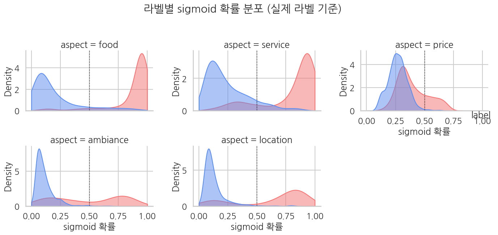
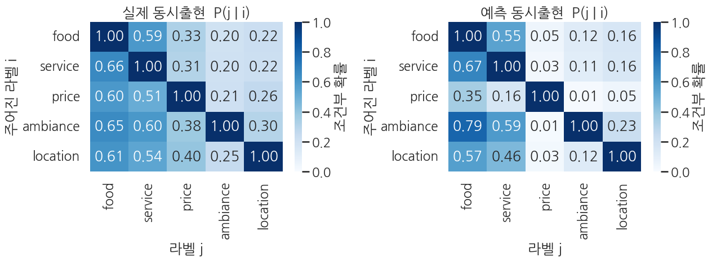
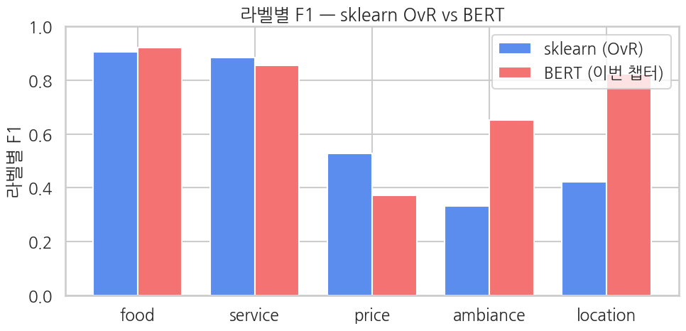

> ▶ **[Google Colab에서 이 장 실습 열기](https://colab.research.google.com/github/yoon-gu/neuqes-101/blob/master/13_bert_multilabel/13_bert_multilabel.ipynb)** — 브라우저에서 바로 실행해 볼 수 있습니다.

## 환경 준비

```python
!pip install -q transformers datasets
```

```python
import warnings
warnings.filterwarnings("ignore")

import re
import numpy as np
import pandas as pd
import matplotlib.pyplot as plt
import seaborn as sns
import torch
from datasets import Dataset, load_dataset
from transformers import (
    AutoTokenizer, AutoModelForSequenceClassification,
    Trainer, TrainingArguments,
)
from sklearn.metrics import (
    precision_recall_fscore_support, classification_report,
    roc_auc_score, hamming_loss,
)
# Ch 6 sklearn baseline 비교용
from sklearn.feature_extraction.text import TfidfVectorizer
from sklearn.linear_model import LogisticRegression
from sklearn.multiclass import OneVsRestClassifier

# matplotlib 한글 폰트 (Colab — NanumGothic). plot 의 한국어가 □ 로 깨지지 않게.
import matplotlib.pyplot as plt, matplotlib.font_manager as fm, subprocess, os
_fp = "/usr/share/fonts/truetype/nanum/NanumGothic.ttf"
if not os.path.exists(_fp):
    subprocess.run("apt-get -qq -y install fonts-nanum", shell=True)
fm.fontManager.addfont(_fp)
plt.rcParams["font.family"] = "NanumGothic"
plt.rcParams["axes.unicode_minus"] = False

print(f"PyTorch:        {torch.__version__}")
print(f"CUDA available: {torch.cuda.is_available()}")
if torch.cuda.is_available():
    print(f"GPU:             {torch.cuda.get_device_name(0)}")
else:
    print("Warning: CPU runtime — training will be very slow. Switch to T4 recommended.")
```

**▶ 실행 결과**

```text
PyTorch:        2.11.0+cu128
CUDA available: True
GPU:             Tesla T4
```

```python
!nvidia-smi
```

**▶ 실행 결과**

```text
Mon Jun 22 03:49:55 2026       
+-----------------------------------------------------------------------------------------+
| NVIDIA-SMI 580.82.07              Driver Version: 580.82.07      CUDA Version: 13.0     |
+-----------------------------------------+------------------------+----------------------+
| GPU  Name                 Persistence-M | Bus-Id          Disp.A | Volatile Uncorr. ECC |
| Fan  Temp   Perf          Pwr:Usage/Cap |           Memory-Usage | GPU-Util  Compute M. |
|                                         |                        |               MIG M. |
|=========================================+========================+======================|
|   0  Tesla T4                       Off |   00000000:00:04.0 Off |                    0 |
| N/A   46C    P8             11W /   70W |       3MiB /  15360MiB |      0%      Default |
|                                         |                        |                  N/A |
+-----------------------------------------+------------------------+----------------------+

+-----------------------------------------------------------------------------------------+
| Processes:                                                                              |
|  GPU   GI   CI              PID   Type   Process name                        GPU Memory |
|        ID   ID                                                               Usage      |
|=========================================================================================|
|  No running processes found                                                             |
+-----------------------------------------------------------------------------------------+
```

```python
ASPECT_KEYWORDS = {
    "food": ["food", "meal", "dish", "taste", "delicious", "flavor", "menu",
             "cuisine", "tasty", "yummy", "spicy", "sweet", "salty", "fresh"],
    "service": ["service", "staff", "waiter", "waitress", "server", "friendly",
                "rude", "attentive", "host", "helpful", "polite", "manager"],
    "price": ["price", "cheap", "expensive", "value", "worth", "cost",
              "money", "afford", "overpriced", "pricey", "deal", "bargain"],
    "ambiance": ["atmosphere", "ambiance", "decor", "music", "vibe", "cozy",
                 "noisy", "quiet", "lighting", "interior", "comfortable", "loud"],
    "location": ["location", "parking", "area", "neighborhood", "access",
                 "downtown", "convenient", "spot"],
}
ASPECTS = list(ASPECT_KEYWORDS.keys())
K = len(ASPECTS)


def extract_aspects(text: str) -> list[float]:
    text_lower = text.lower()
    return [
        float(any(re.search(rf"\b{re.escape(kw)}\b", text_lower) for kw in keywords))
        for keywords in ASPECT_KEYWORDS.values()
    ]

print(f"K (number of aspects): {K}")
print(f"aspects: {ASPECTS}")
```

**▶ 실행 결과**

```text
K (number of aspects): 5
aspects: ['food', 'service', 'price', 'ambiance', 'location']
```

```python
tokenizer = AutoTokenizer.from_pretrained("distilbert-base-uncased")

ds = load_dataset("Yelp/yelp_review_full")
train_full = ds["train"].shuffle(seed=42).select(range(5000))
eval_full  = ds["test"].shuffle(seed=42).select(range(1000))

# 항목 라벨 합성 — 각 텍스트에 multi-hot 5차원 벡터 부착
def attach_aspects(batch):
    batch["aspects"] = [extract_aspects(t) for t in batch["text"]]
    return batch

train_full = train_full.map(attach_aspects, batched=True)
eval_full  = eval_full.map(attach_aspects,  batched=True)

print(f"train: {len(train_full)}, eval: {len(eval_full)}")
print(f"\nFirst sample:")
print(f"  text: {train_full[0]['text'][:150]}...")
print(f"  aspects (multi-hot): {train_full[0]['aspects']}")
print(f"  active aspects: {[a for a, v in zip(ASPECTS, train_full[0]['aspects']) if v > 0]}")
```

**▶ 실행 결과**

```text
train: 5000, eval: 1000

First sample:
  text: I stalk this truck.  I've been to industrial parks where I pretend to be a tech worker standing in line, strip mall parking lots, an …(뒤 21자 생략)
  aspects (multi-hot): [0.0, 1.0, 0.0, 0.0, 1.0]
  active aspects: ['service', 'location']
```

```python
# 항목별 활성률
Y_train = np.array(train_full["aspects"])
Y_eval  = np.array(eval_full["aspects"])

print("Per-aspect activation rate (train):")
for k, aspect in enumerate(ASPECTS):
    rate = Y_train[:, k].mean()
    print(f"  {aspect:>9}: {rate:.1%}  ({int(Y_train[:, k].sum())} / {len(Y_train)})")

n_active = Y_train.sum(axis=1)
print(f"\nMean active labels per sample: {n_active.mean():.2f}")
print(f"Active label distribution (train):")
for n in range(K + 1):
    cnt = (n_active == n).sum()
    print(f"  {n} labels active: {cnt} samples ({cnt/len(Y_train):.1%})")
```

**▶ 실행 결과**

```text
Per-aspect activation rate (train):
       food: 55.6%  (2778 / 5000)
    service: 49.6%  (2480 / 5000)
      price: 29.4%  (1472 / 5000)
   ambiance: 18.1%  (905 / 5000)
   location: 21.9%  (1095 / 5000)

Mean active labels per sample: 1.75
Active label distribution (train):
  0 labels active: 741 samples (14.8%)
  1 labels active: 1464 samples (29.3%)
  2 labels active: 1506 samples (30.1%)
  3 labels active: 957 samples (19.1%)
  4 labels active: 277 samples (5.5%)
  5 labels active: 55 samples (1.1%)
```

```python
def tokenize_fn(batch):
    out = tokenizer(batch["text"], truncation=True, max_length=128)
    # multi-hot 5차원 float 벡터 (BCEWithLogitsLoss가 받는 형식)
    out["labels"] = [list(map(float, a)) for a in batch["aspects"]]
    return out

train_tok = train_full.map(tokenize_fn, batched=True).remove_columns(["text", "label", "aspects"])
eval_tok  = eval_full.map(tokenize_fn,  batched=True).remove_columns(["text", "label", "aspects"])

print(train_tok)
print(f"\nFirst sample label: {train_tok[0]['labels']}  (length-5 multi-hot float vector)")
```

**▶ 실행 결과**

```text
Dataset({
    features: ['input_ids', 'token_type_ids', 'attention_mask', 'labels'],
    num_rows: 5000
})

First sample label: [0.0, 1.0, 0.0, 0.0, 1.0]  (length-5 multi-hot float vector)
```

```python
model = AutoModelForSequenceClassification.from_pretrained(
    "distilbert-base-uncased",
    num_labels=K,
    problem_type="multi_label_classification",   # ← BCEWithLogitsLoss per-label 자동 매핑
    id2label={i: a for i, a in enumerate(ASPECTS)},
    label2id={a: i for i, a in enumerate(ASPECTS)},
)

def param_summary(m):
    total     = sum(p.numel() for p in m.parameters())
    trainable = sum(p.numel() for p in m.parameters() if p.requires_grad)
    return total, trainable

total, trainable = param_summary(model)
print(f"Parameters:           {total:>13,}  ({total/1e6:.1f} M)")
print(f"Trainable parameters: {trainable:>13,}  ({trainable/total:.1%})")
print(f"Classifier:           {model.classifier}")
print(f"problem_type:         {model.config.problem_type}")
print(f"id2label:             {model.config.id2label}")
```

**▶ 실행 결과**

```text
[transformers] DistilBertForSequenceClassification LOAD REPORT from: distilbert-base-uncased
Key                     | Status     | 
------------------------+------------+-
vocab_projector.bias    | UNEXPECTED | 
vocab_transform.bias    | UNEXPECTED | 
vocab_layer_norm.weight | UNEXPECTED | 
vocab_layer_norm.bias   | UNEXPECTED | 
vocab_transform.weight  | UNEXPECTED | 
classifier.weight       | MISSING    | 
classifier.bias         | MISSING    | 
pre_classifier.bias     | MISSING    | 
pre_classifier.weight   | MISSING    | 

Notes:
- UNEXPECTED:	can be ignored when loading from different task/architecture; not ok if you expect identical arch.
- MISSING:	those params were newly initialized because missing from the checkpoint. Consider training on your downstream task.
Parameters:              66,957,317  (67.0 M)
Trainable parameters:    66,957,317  (100.0%)
Classifier:           Linear(in_features=768, out_features=5, bias=True)
problem_type:         multi_label_classification
id2label:             {0: 'food', 1: 'service', 2: 'price', 3: 'ambiance', 4: 'location'}
```

```python
!nvidia-smi
```

**▶ 실행 결과**

```text
Mon Jun 22 03:50:22 2026       
+-----------------------------------------------------------------------------------------+
| NVIDIA-SMI 580.82.07              Driver Version: 580.82.07      CUDA Version: 13.0     |
+-----------------------------------------+------------------------+----------------------+
| GPU  Name                 Persistence-M | Bus-Id          Disp.A | Volatile Uncorr. ECC |
| Fan  Temp   Perf          Pwr:Usage/Cap |           Memory-Usage | GPU-Util  Compute M. |
|                                         |                        |               MIG M. |
|=========================================+========================+======================|
|   0  Tesla T4                       Off |   00000000:00:04.0 Off |                    0 |
| N/A   47C    P8             14W /   70W |       3MiB /  15360MiB |      0%      Default |
|                                         |                        |                  N/A |
+-----------------------------------------+------------------------+----------------------+

+-----------------------------------------------------------------------------------------+
| Processes:                                                                              |
|  GPU   GI   CI              PID   Type   Process name                        GPU Memory |
|        ID   ID                                                               Usage      |
|=========================================================================================|
|  No running processes found                                                             |
+-----------------------------------------------------------------------------------------+
```

```python
def compute_metrics(eval_pred):
    logits, labels = eval_pred                      # logits: (N, K), labels: (N, K) float
    probs = 1.0 / (1.0 + np.exp(-logits))           # per-label sigmoid
    preds = (probs >= 0.5).astype(int)              # threshold 0.5

    out = {}
    # Hamming loss — 전체 라벨 위치 중 틀린 비율 (낮을수록 좋음)
    out["hamming_loss"] = float(hamming_loss(labels, preds))

    # Micro F1 — 전체 라벨을 한꺼번에 (TP/FP/FN 합산 후 F1)
    p_mi, r_mi, f1_mi, _ = precision_recall_fscore_support(
        labels, preds, average="micro", zero_division=0,
    )
    out["micro_f1"] = float(f1_mi)
    out["micro_precision"] = float(p_mi)
    out["micro_recall"]    = float(r_mi)

    # Macro F1 — 라벨별 F1을 평균 (각 라벨에 동일 가중치)
    p_ma, r_ma, f1_ma, _ = precision_recall_fscore_support(
        labels, preds, average="macro", zero_division=0,
    )
    out["macro_f1"] = float(f1_ma)
    out["macro_precision"] = float(p_ma)
    out["macro_recall"]    = float(r_ma)

    # Per-label AUC (One-vs-Rest 자체)
    try:
        out["macro_auc"] = float(roc_auc_score(labels, probs, average="macro"))
    except ValueError:
        out["macro_auc"] = float("nan")
    return out
```

```python
training_args = TrainingArguments(
    output_dir="./ch13_output",
    num_train_epochs=2,
    per_device_train_batch_size=16,
    per_device_eval_batch_size=32,
    learning_rate=2e-5,
    fp16=True,
    eval_strategy="epoch",
    logging_steps=50,
    save_strategy="no",
    report_to="none",
    seed=42,
)

trainer = Trainer(
    model=model,
    args=training_args,
    train_dataset=train_tok,
    eval_dataset=eval_tok,
    processing_class=tokenizer,
    compute_metrics=compute_metrics,
)

train_result = trainer.train()
print(f"\nTraining done — mean train loss: {train_result.training_loss:.4f}")
```

**▶ 실행 결과**

```text
<IPython.core.display.HTML object>
Training done — mean train loss: 0.4126
```

```python
!nvidia-smi
```

**▶ 실행 결과**

```text
Mon Jun 22 03:51:02 2026       
+-----------------------------------------------------------------------------------------+
| NVIDIA-SMI 580.82.07              Driver Version: 580.82.07      CUDA Version: 13.0     |
+-----------------------------------------+------------------------+----------------------+
| GPU  Name                 Persistence-M | Bus-Id          Disp.A | Volatile Uncorr. ECC |
| Fan  Temp   Perf          Pwr:Usage/Cap |           Memory-Usage | GPU-Util  Compute M. |
|                                         |                        |               MIG M. |
|=========================================+========================+======================|
|   0  Tesla T4                       Off |   00000000:00:04.0 Off |                    0 |
| N/A   63C    P0             34W /   70W |    1577MiB /  15360MiB |     72%      Default |
|                                         |                        |                  N/A |
+-----------------------------------------+------------------------+----------------------+

+-----------------------------------------------------------------------------------------+
| Processes:                                                                              |
|  GPU   GI   CI              PID   Type   Process name                        GPU Memory |
|        ID   ID                                                               Usage      |
|=========================================================================================|
|    0   N/A  N/A            1283      C   /usr/bin/python3                       1574MiB |
+-----------------------------------------------------------------------------------------+
```

```python
# 평가 metric
eval_metrics = trainer.evaluate()
print("BERT multi-label evaluation:")
for k, v in eval_metrics.items():
    if k.startswith("eval_") and isinstance(v, float):
        print(f"  {k:>22}: {v:.4f}")
```

**▶ 실행 결과**

```text
<IPython.core.display.HTML object>
<IPython.core.display.HTML object>
BERT multi-label evaluation:
               eval_loss: 0.3204
       eval_hamming_loss: 0.1246
           eval_micro_f1: 0.7977
    eval_micro_precision: 0.9056
       eval_micro_recall: 0.7127
           eval_macro_f1: 0.7239
    eval_macro_precision: 0.9155
       eval_macro_recall: 0.6447
          eval_macro_auc: 0.8994
            eval_runtime: 0.9157
  eval_samples_per_second: 1092.1120
   eval_steps_per_second: 34.9480
```

```python
# logits → per-label sigmoid → multi-hot 예측
preds_output = trainer.predict(eval_tok)
logits = preds_output.predictions                   # (N, 5)
labels = preds_output.label_ids.astype(int)         # (N, 5) multi-hot
probs  = 1.0 / (1.0 + np.exp(-logits))              # (N, 5) per-label prob
preds  = (probs >= 0.5).astype(int)                 # (N, 5) multi-hot prediction

print(f"logits shape: {logits.shape}")
print(f"prob ranges per label:")
for k, a in enumerate(ASPECTS):
    print(f"  {a:>9}: [{probs[:, k].min():.4f}, {probs[:, k].max():.4f}]  "
          f"true rate={labels[:, k].mean():.1%}, pred rate={preds[:, k].mean():.1%}")
```

**▶ 실행 결과**

```text
<IPython.core.display.HTML object>
logits shape: (1000, 5)
prob ranges per label:
       food: [0.0280, 0.9871]  true rate=55.2%, pred rate=56.5%
    service: [0.0412, 0.9794]  true rate=49.7%, pred rate=46.5%
      price: [0.0873, 0.7026]  true rate=30.4%, pred rate=7.9%
   ambiance: [0.0253, 0.8920]  true rate=16.8%, pred rate=8.7%
   location: [0.0310, 0.9285]  true rate=20.2%, pred rate=16.0%
```

```python
# Per-label classification report
print(classification_report(
    labels, preds,
    target_names=ASPECTS,
    digits=4, zero_division=0,
))
```

**▶ 실행 결과**

```text
              precision    recall  f1-score   support

        food     0.9097    0.9312    0.9203       552
     service     0.8839    0.8270    0.8545       497
       price     0.8987    0.2336    0.3708       304
    ambiance     0.9540    0.4940    0.6510       168
    location     0.9313    0.7376    0.8232       202

   micro avg     0.9056    0.7127    0.7977      1723
   macro avg     0.9155    0.6447    0.7239      1723
weighted avg     0.9072    0.7127    0.7667      1723
 samples avg     0.7343    0.6316    0.6586      1723
```

```python
# 평가 셋에서 항목 활성이 가장 *많은* 샘플 1개 + 가장 *적은* 샘플 1개 골라 읽어보기
n_active = labels.sum(axis=1)
idx_many = int(np.argmax(n_active))   # 정답 항목이 가장 많은 샘플
idx_few  = int(np.argmin(n_active))   # 정답 항목이 가장 적은 샘플

# eval_full 에서 원문 텍스트 가져오기 (eval_tok 와 같은 순서)
texts = list(eval_full["text"])

for label_kind, idx in [("many active labels", idx_many), ("few active labels", idx_few)]:
    print("=" * 78)
    print(f"sample #{idx}  ({label_kind})")
    print("=" * 78)
    print(f"text (truncated): {texts[idx][:320]}{'...' if len(texts[idx]) > 320 else ''}")
    print()
    print(f"{'aspect':>10}  {'true':>6}  {'prob':>8}  {'pred (>=0.5)':>14}  match")
    for k, a in enumerate(ASPECTS):
        t = int(labels[idx, k])
        p = float(probs[idx, k])
        pr = int(preds[idx, k])
        ok = "✓" if t == pr else "✗"
        print(f"  {a:>9}  {t:>6}  {p:>8.4f}  {pr:>14}    {ok}")

    # 사람이 읽는 한 줄 해석
    pred_active = [a for k, a in enumerate(ASPECTS) if preds[idx, k]]
    true_active = [a for k, a in enumerate(ASPECTS) if labels[idx, k]]
    print()
    print(f"  predicted: {pred_active}")
    print(f"  true:      {true_active}")
    print()
```

**▶ 실행 결과**

```text
==============================================================================
sample #29  (many active labels)
==============================================================================
text (truncated): It's hard to complain about this place given the price I got it for! \n**Warning** This is a long review, there is a lot t …(뒤 201자 생략)

    aspect    true      prob    pred (>=0.5)  match
       food       1    0.2910               0    ✗
    service       1    0.3436               0    ✗
      price       1    0.5005               1    ✓
   ambiance       1    0.3828               0    ✗
   location       1    0.8549               1    ✓

  predicted: ['price', 'location']
  true:      ['food', 'service', 'price', 'ambiance', 'location']

==============================================================================
sample #4  (few active labels)
==============================================================================
text (truncated): I don't quite get this place or why Asians love it, but it is very good :)

    aspect    true      prob    pred (>=0.5)  match
       food       0    0.0792               0    ✓
    service       0    0.0725               0    ✓
      price       0    0.1344               0    ✓
   ambiance       0    0.0440               0    ✓
   location       0    0.0682               0    ✓

  predicted: []
  true:      []
```

```python
sns.set_theme(style="whitegrid", context="talk", font="NanumGothic", rc={"axes.unicode_minus": False})

# Long-form DataFrame 만들기
records = []
for k, a in enumerate(ASPECTS):
    for i in range(len(probs)):
        records.append({"aspect": a, "prob": probs[i, k], "label": int(labels[i, k])})
df_long = pd.DataFrame(records)

g = sns.FacetGrid(
    df_long, col="aspect", col_wrap=3, height=3.2, aspect=1.4,
    sharex=True, sharey=False,
)
g.map_dataframe(
    sns.kdeplot, x="prob", hue="label",
    fill=True, common_norm=False, alpha=0.5,
    palette={0: "#5B8DEF", 1: "#F47272"}, clip=(0, 1),
)
for ax in g.axes.flat:
    ax.axvline(0.5, color="black", lw=1.0, ls="--", alpha=0.6)
    ax.set_xlabel("sigmoid 확률")
g.add_legend(title="label")
g.fig.suptitle("라벨별 sigmoid 확률 분포 (실제 라벨 기준)", y=1.03)
plt.tight_layout()
plt.show()
```

**▶ 실행 결과**



```python
def cooccurrence_matrix(Y):
    # Y: (N, K) multi-hot. Returns (K, K) where M[i,j] = P(label_j=1 | label_i=1).
    Y = Y.astype(float)
    K_ = Y.shape[1]
    M = np.zeros((K_, K_))
    for i in range(K_):
        row_i = Y[:, i]
        n_i = row_i.sum()
        if n_i == 0:
            continue
        for j in range(K_):
            M[i, j] = (row_i * Y[:, j]).sum() / n_i
    return M

cooc_true = cooccurrence_matrix(labels)
cooc_pred = cooccurrence_matrix(preds)

fig, axes = plt.subplots(1, 2, figsize=(13, 5))
for ax, M, title in [
    (axes[0], cooc_true, "실제 동시출현  P(j | i)"),
    (axes[1], cooc_pred, "예측 동시출현  P(j | i)"),
]:
    sns.heatmap(
        M, annot=True, fmt=".2f", cmap="Blues", vmin=0, vmax=1,
        xticklabels=ASPECTS, yticklabels=ASPECTS,
        cbar_kws={"label": "조건부 확률"}, ax=ax,
    )
    ax.set_title(title)
    ax.set_xlabel("라벨 j")
    ax.set_ylabel("주어진 라벨 i")
plt.tight_layout()
plt.show()
```

**▶ 실행 결과**



```python
# Ch 6 셋업 재현 — TF-IDF + OneVsRestClassifier(LogisticRegression)
texts_train = list(train_full["text"])
texts_eval  = list(eval_full["text"])
Y_train_bin = np.array(train_full["aspects"]).astype(int)
Y_eval_bin  = np.array(eval_full["aspects"]).astype(int)

vec = TfidfVectorizer(max_features=20000, ngram_range=(1, 2))
X_train = vec.fit_transform(texts_train)
X_eval  = vec.transform(texts_eval)

clf = OneVsRestClassifier(LogisticRegression(max_iter=2000, n_jobs=-1))
clf.fit(X_train, Y_train_bin)

probs_sk = clf.predict_proba(X_eval)        # (N, 5)
preds_sk = (probs_sk >= 0.5).astype(int)    # (N, 5)

p_mi_sk, r_mi_sk, f1_mi_sk, _ = precision_recall_fscore_support(
    Y_eval_bin, preds_sk, average="micro", zero_division=0,
)
p_ma_sk, r_ma_sk, f1_ma_sk, _ = precision_recall_fscore_support(
    Y_eval_bin, preds_sk, average="macro", zero_division=0,
)
auc_sk = float(roc_auc_score(Y_eval_bin, probs_sk, average="macro"))

print(f"sklearn TF-IDF + OvR LogReg:")
print(f"  vocabulary size:    {len(vec.vocabulary_):,}")
print(f"  micro F1:           {f1_mi_sk:.4f}")
print(f"  macro F1:           {f1_ma_sk:.4f}")
print(f"  macro AUC:          {auc_sk:.4f}")
print(f"  hamming loss:       {hamming_loss(Y_eval_bin, preds_sk):.4f}")
```

**▶ 실행 결과**

```text
sklearn TF-IDF + OvR LogReg:
  vocabulary size:    20,000
  micro F1:           0.7634
  macro F1:           0.6141
  macro AUC:          0.9387
  hamming loss:       0.1426
```

```python
metrics_bert = {
    k.replace("eval_", ""): v for k, v in eval_metrics.items()
    if k.startswith("eval_") and isinstance(v, float)
}
metrics_sk = {
    "hamming_loss":    float(hamming_loss(Y_eval_bin, preds_sk)),
    "micro_f1":        float(f1_mi_sk),
    "micro_precision": float(p_mi_sk),
    "micro_recall":    float(r_mi_sk),
    "macro_f1":        float(f1_ma_sk),
    "macro_precision": float(p_ma_sk),
    "macro_recall":    float(r_ma_sk),
    "macro_auc":       auc_sk,
}

common = [k for k in metrics_bert if k in metrics_sk]
cmp = pd.DataFrame({
    "metric":             common,
    "sklearn (OvR)":      [metrics_sk[k]   for k in common],
    "BERT (this chapter)":[metrics_bert[k] for k in common],
})
cmp["BERT - sklearn"] = cmp["BERT (this chapter)"] - cmp["sklearn (OvR)"]
print(cmp.round(4).to_string(index=False))
```

**▶ 실행 결과**

```text
         metric  sklearn (OvR)  BERT (this chapter)  BERT - sklearn
   hamming_loss         0.1426               0.1246         -0.0180
       micro_f1         0.7634               0.7977          0.0343
micro_precision         0.8915               0.9056          0.0141
   micro_recall         0.6674               0.7127          0.0453
       macro_f1         0.6141               0.7239          0.1099
macro_precision         0.9036               0.9155          0.0119
   macro_recall         0.5307               0.6447          0.1140
      macro_auc         0.9387               0.8994         -0.0393
```

```python
def per_label_f1(Y_true, Y_pred):
    f1s = []
    for k in range(K):
        _, _, f1, _ = precision_recall_fscore_support(
            Y_true[:, k], Y_pred[:, k], average="binary", zero_division=0,
        )
        f1s.append(float(f1))
    return f1s

f1_bert = per_label_f1(labels, preds)
f1_sk   = per_label_f1(Y_eval_bin, preds_sk)

label_cmp = pd.DataFrame({
    "aspect":     ASPECTS,
    "sklearn F1": f1_sk,
    "BERT F1":    f1_bert,
})
label_cmp["BERT - sklearn"] = label_cmp["BERT F1"] - label_cmp["sklearn F1"]
print(label_cmp.round(4).to_string(index=False))

# 막대 그래프
fig, ax = plt.subplots(figsize=(10, 5))
x_pos = np.arange(K)
width = 0.38
ax.bar(x_pos - width/2, f1_sk,   width, label="sklearn (OvR)",     color="#5B8DEF")
ax.bar(x_pos + width/2, f1_bert, width, label="BERT (이번 챕터)", color="#F47272")
ax.set_xticks(x_pos)
ax.set_xticklabels(ASPECTS)
ax.set_ylim(0, 1)
ax.set_ylabel("라벨별 F1")
ax.set_title("라벨별 F1 — sklearn OvR vs BERT")
ax.legend()
plt.tight_layout()
plt.show()
```

**▶ 실행 결과**

```text
  aspect  sklearn F1  BERT F1  BERT - sklearn
    food      0.9057   0.9203          0.0146
 service      0.8833   0.8545         -0.0288
   price      0.5271   0.3708         -0.1563
ambiance      0.3333   0.6510          0.3176
location      0.4211   0.8232          0.4022
```


