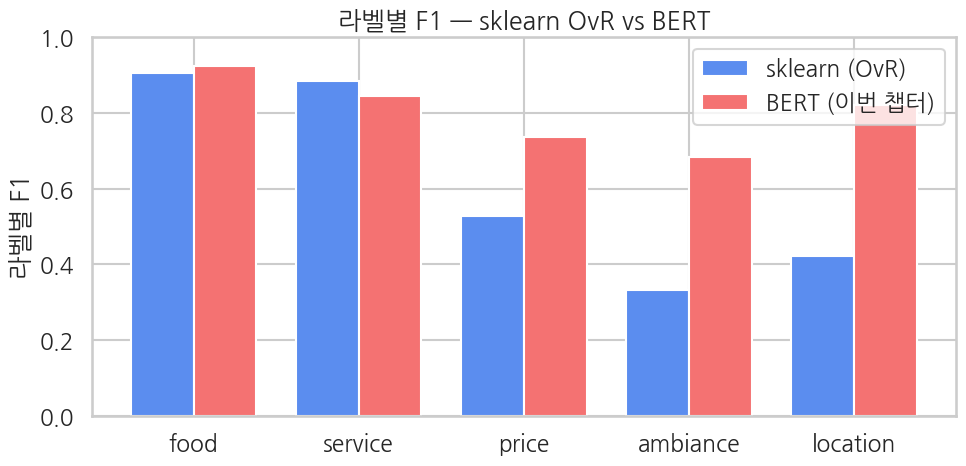

## 클라이맥스 — sklearn `OneVsRestClassifier(LogisticRegression)` 와 비교

Ch 6와 *같은 계열* 의 모델(TF-IDF + 라벨마다 독립 LogisticRegression)을 *이 노트북 안에서* 다시 학습해 라벨별로 BERT와 비교합니다. **multi-label에서도 BERT의 67M이 sklearn 대비 어디서 이기는가?**

> ⚠️ **Ch 6의 숫자를 재현하는 게 아닙니다.** 설정이 다릅니다.
>
> | | Ch 6 | 여기 (Ch 13 §5) |
> |---|---|---|
> | vectorizer | `max_features=10000`, unigram | `max_features=20000`, **bigram 포함** |
> | 평가 셋 | 5,000을 80/20으로 나눈 test 1,000 | BERT와 같은 `ds["test"]` 1,000 |
>
> **일부러 더 강한 baseline을 씁니다.** 목적이 Ch 6 재현이 아니라 *BERT와 똑같은 split에서의 공정한 대조군* 이기 때문입니다. 이 챕터에서는 특히 중요한데 — 이렇게 강하게 잡아도 **macro AUC는 sklearn이 이깁니다**(§5-1). 키워드로 합성한 라벨에서 TF-IDF가 만만치 않다는 이 챕터의 결론이 바로 그 대조군에서 나옵니다.

```python
# Ch 6와 같은 계열 — TF-IDF + OneVsRestClassifier(LogisticRegression)
# (Ch 6 재현이 아님: Ch 6는 10K unigram, 여기는 20K + bigram — BERT와 같은 split의 강한 대조군)
texts_train = list(train_full["text"])
texts_eval  = list(eval_full["text"])
Y_train_bin = np.array(train_full["aspects"]).astype(int)
Y_eval_bin  = np.array(eval_full["aspects"]).astype(int)

vec = TfidfVectorizer(max_features=20000, ngram_range=(1, 2))
X_train = vec.fit_transform(texts_train)
X_eval  = vec.transform(texts_eval)

clf = OneVsRestClassifier(LogisticRegression(max_iter=2000, n_jobs=-1))
clf.fit(X_train, Y_train_bin)

probs_sk = clf.predict_proba(X_eval)        # (N, 5)
preds_sk = (probs_sk >= 0.5).astype(int)    # (N, 5)

p_mi_sk, r_mi_sk, f1_mi_sk, _ = precision_recall_fscore_support(
    Y_eval_bin, preds_sk, average="micro", zero_division=0,
)
p_ma_sk, r_ma_sk, f1_ma_sk, _ = precision_recall_fscore_support(
    Y_eval_bin, preds_sk, average="macro", zero_division=0,
)
auc_sk = float(roc_auc_score(Y_eval_bin, probs_sk, average="macro"))

print(f"sklearn TF-IDF + OvR LogReg:")
print(f"  vocabulary size:    {len(vec.vocabulary_):,}")
print(f"  micro F1:           {f1_mi_sk:.4f}")
print(f"  macro F1:           {f1_ma_sk:.4f}")
print(f"  macro AUC:          {auc_sk:.4f}")
print(f"  hamming loss:       {hamming_loss(Y_eval_bin, preds_sk):.4f}")
```

**▶ 실행 결과**

```text
sklearn TF-IDF + OvR LogReg:
  vocabulary size:    20,000
  micro F1:           0.7634
  macro F1:           0.6141
  macro AUC:          0.9387
  hamming loss:       0.1426
```

### 5-1. 두 모델의 metric 비교

```python
metrics_bert = {
    k.replace("eval_", ""): v for k, v in eval_metrics.items()
    if k.startswith("eval_") and isinstance(v, float)
}
metrics_sk = {
    "hamming_loss":    float(hamming_loss(Y_eval_bin, preds_sk)),
    "micro_f1":        float(f1_mi_sk),
    "micro_precision": float(p_mi_sk),
    "micro_recall":    float(r_mi_sk),
    "macro_f1":        float(f1_ma_sk),
    "macro_precision": float(p_ma_sk),
    "macro_recall":    float(r_ma_sk),
    "macro_auc":       auc_sk,
}

common = [k for k in metrics_bert if k in metrics_sk]
cmp = pd.DataFrame({
    "metric":             common,
    "sklearn (OvR)":      [metrics_sk[k]   for k in common],
    "BERT (this chapter)":[metrics_bert[k] for k in common],
})
cmp["BERT - sklearn"] = cmp["BERT (this chapter)"] - cmp["sklearn (OvR)"]
print(cmp.round(4).to_string(index=False))
```

**▶ 실행 결과**

```text
         metric  sklearn (OvR)  BERT (this chapter)  BERT - sklearn
   hamming_loss         0.1426               0.1020         -0.0406
       micro_f1         0.7634               0.8399          0.0766
micro_precision         0.8915               0.9146          0.0231
   micro_recall         0.6674               0.7766          0.1091
       macro_f1         0.6141               0.8023          0.1882
macro_precision         0.9036               0.9328          0.0292
   macro_recall         0.5307               0.7206          0.1900
      macro_auc         0.9387               0.9179         -0.0207
```

### 5-2. 라벨별 F1 비교 — 어디서 BERT가 이기나

```python
def per_label_f1(Y_true, Y_pred):
    f1s = []
    for k in range(K):
        _, _, f1, _ = precision_recall_fscore_support(
            Y_true[:, k], Y_pred[:, k], average="binary", zero_division=0,
        )
        f1s.append(float(f1))
    return f1s

f1_bert = per_label_f1(labels, preds)
f1_sk   = per_label_f1(Y_eval_bin, preds_sk)

label_cmp = pd.DataFrame({
    "aspect":     ASPECTS,
    "sklearn F1": f1_sk,
    "BERT F1":    f1_bert,
})
label_cmp["BERT - sklearn"] = label_cmp["BERT F1"] - label_cmp["sklearn F1"]
print(label_cmp.round(4).to_string(index=False))

# 막대 그래프
fig, ax = plt.subplots(figsize=(10, 5))
x_pos = np.arange(K)
width = 0.38
ax.bar(x_pos - width/2, f1_sk,   width, label="sklearn (OvR)",     color="#5B8DEF")
ax.bar(x_pos + width/2, f1_bert, width, label="BERT (이번 챕터)", color="#F47272")
ax.set_xticks(x_pos)
ax.set_xticklabels(ASPECTS)
ax.set_ylim(0, 1)
ax.set_ylabel("라벨별 F1")
ax.set_title("라벨별 F1 — sklearn OvR vs BERT")
ax.legend()
plt.tight_layout()
plt.show()
```

**▶ 실행 결과**

```text
  aspect  sklearn F1  BERT F1  BERT - sklearn
    food      0.9057   0.9242          0.0185
 service      0.8833   0.8453         -0.0380
   price      0.5271   0.7360          0.2089
ambiance      0.3333   0.6848          0.3515
location      0.4211   0.8212          0.4002
```



**해석**

- 키워드 매칭으로 합성한 라벨은 *키워드 단어가 본질 신호* 라 sklearn TF-IDF가 의외로 강합니다 — 라벨 정의 자체가 단어 빈도와 일치하기 때문.
- BERT가 *큰 폭으로* 이기는 라벨이 있다면 → 그 라벨의 *합성 룰이 키워드만으로 안 잡히는 신호* 를 BERT가 추가로 학습한 것 (예: ambiance에서 "lighting was perfect" 같은 묘사).
- BERT가 *지는 라벨* 도 있을 수 있음 — 키워드가 *결정적* 인 라벨에서 sklearn은 *완벽* 한 매칭, BERT는 *근사* 라 약간의 noise가 들어감.

**합성 라벨의 본질적 한계** — 이 비교는 *키워드 매칭으로 만든 라벨* 위에서의 비교. 실제 사람-annotated multi-label 데이터에선 BERT 격차가 훨씬 큼 (단어 빈도로 안 잡히는 미묘한 항목 인식이 BERT의 강점).
