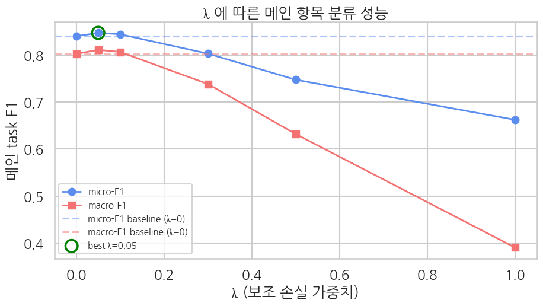

## 부록 — λ 스윕으로 sweet spot 찾기

> ▶ **[Google Colab에서 λ 스윕 부록 열기](https://colab.research.google.com/github/yoon-gu/neuqes-101/blob/master/14_auxiliary_loss/14_auxiliary_loss_lambda_sweep.ipynb)** — Ch 14 본편의 `lambda_aux=0.05` 선택 근거를 직접 재현합니다.

Ch 14 본편은 보조 손실을 무조건 크게 더하는 장이 아닙니다. 같은 데이터·모델·Trainer에서 **λ만 바꾼 공정 비교**를 통해, 보조 손실이 메인 항목 분류를 돕는 구간과 무너뜨리는 구간을 분리합니다.

비교 조건은 다음과 같습니다.

| 항목 | 설정 |
|---|---|
| 데이터 | Yelp 5,000 train / 1,000 eval |
| 모델 | `distilbert-base-uncased` + 항목 분류 헤드 + 별점 보조 회귀 헤드 |
| 메인 task | 5개 항목 multi-label 분류 |
| 보조 task | 별점 회귀, `label / 4` 로 0-1 스케일 |
| 비교 축 | `λ ∈ {0, 0.05, 0.1, 0.3, 0.5, 1.0}` |
| 공정성 | 매 run `seed=42`, 같은 초기화·같은 데이터 순서 |

## 스윕 결과

| λ | micro-F1 | macro-F1 | 보조 R² | 메인 Δ(vs baseline) |
|---|---:|---:|---:|---:|
| 0.0 | 0.8399 | 0.8023 | — | 기준 |
| **0.05** | **0.8469** | **0.8109** | +0.43 | **+0.007 / +0.009** |
| 0.1 | 0.8440 | 0.8064 | +0.49 | +0.004 / +0.004 |
| 0.3 | 0.8028 | 0.7382 | +0.57 | -0.037 / -0.064 |
| 0.5 | 0.7473 | 0.6319 | +0.60 | -0.093 / -0.170 |
| 1.0 | 0.6622 | 0.3906 | +0.65 | -0.178 / -0.412 |

곡선의 핵심은 두 가지입니다.

1. **λ=0.05가 sweet spot** 입니다. λ=0 baseline 대비 micro-F1은 0.8399 → 0.8469, macro-F1은 0.8023 → 0.8109로 올라갑니다. 별점이라는 연속 신호가 공유 BERT 본체를 약하게 정규화해 메인 항목 분류를 돕는 구간입니다.
2. **λ를 키우면 보조 task 자체는 좋아지지만 메인은 무너집니다.** 보조 R²는 0.43에서 0.65까지 오르지만, λ=1.0에서는 micro-F1 0.6622, macro-F1 0.3906까지 떨어집니다. 별점 회귀가 공유 본체의 학습 방향을 과하게 잡아당긴 결과입니다.

따라서 본편의 결론은 “보조 손실은 위험하다”가 아니라 **보조 손실은 작은 λ부터 검증해야 한다** 입니다. BCE per-label과 MSE처럼 손실 종류와 스케일이 다르면, λ=1은 균형점이 아니라 과적용점이 될 수 있습니다.

## 본편과의 연결

Ch 14 본편은 이 스윕 결과를 반영해 `lambda_aux=0.05`를 사용합니다. `lambda_aux=1.0`은 본편 학습값이 아니라, 보조 손실을 과하게 주었을 때 메인 task가 어떻게 collapse되는지 보여주는 비교점입니다.
