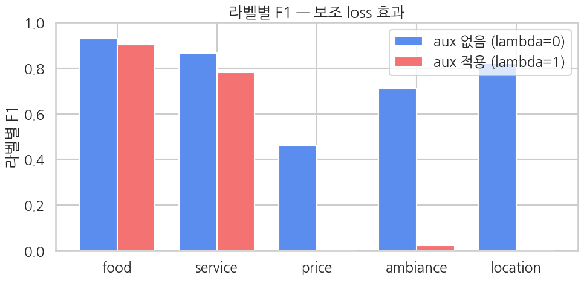
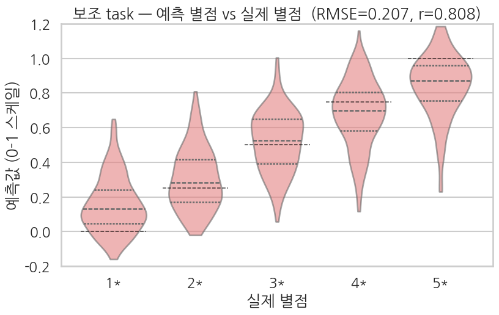

> ▶ **[Google Colab에서 이 장 실습 열기](https://colab.research.google.com/github/yoon-gu/neuqes-101/blob/master/14_auxiliary_loss/14_auxiliary_loss.ipynb)** — 브라우저에서 바로 실행해 볼 수 있습니다.

## 환경 준비

```python
!pip install -q transformers datasets
```

```python
import warnings
warnings.filterwarnings("ignore")

import re
import numpy as np
import pandas as pd
import matplotlib.pyplot as plt
import seaborn as sns
import torch
import torch.nn as nn
import torch.nn.functional as F
from datasets import load_dataset
from transformers import (
    AutoTokenizer, AutoModelForSequenceClassification,
    Trainer, TrainingArguments,
    DataCollatorWithPadding,
)
from sklearn.metrics import (
    precision_recall_fscore_support, classification_report,
    roc_auc_score, hamming_loss, mean_squared_error, r2_score,
)

# matplotlib 한글 폰트 (Colab — NanumGothic). plot 의 한국어가 □ 로 깨지지 않게.
import matplotlib.pyplot as plt, matplotlib.font_manager as fm, subprocess, os
_fp = "/usr/share/fonts/truetype/nanum/NanumGothic.ttf"
if not os.path.exists(_fp):
    subprocess.run("apt-get -qq -y install fonts-nanum", shell=True)
fm.fontManager.addfont(_fp)
plt.rcParams["font.family"] = "NanumGothic"
plt.rcParams["axes.unicode_minus"] = False

print(f"PyTorch:        {torch.__version__}")
print(f"CUDA available: {torch.cuda.is_available()}")
if torch.cuda.is_available():
    print(f"GPU:             {torch.cuda.get_device_name(0)}")
else:
    print("Warning: CPU runtime — training will be very slow. Switch to T4 recommended.")
```

**▶ 실행 결과**

```text
PyTorch:        2.11.0+cu128
CUDA available: True
GPU:             Tesla T4
```

```python
!nvidia-smi
```

**▶ 실행 결과**

```text
Mon Jun 22 03:52:59 2026       
+-----------------------------------------------------------------------------------------+
| NVIDIA-SMI 580.82.07              Driver Version: 580.82.07      CUDA Version: 13.0     |
+-----------------------------------------+------------------------+----------------------+
| GPU  Name                 Persistence-M | Bus-Id          Disp.A | Volatile Uncorr. ECC |
| Fan  Temp   Perf          Pwr:Usage/Cap |           Memory-Usage | GPU-Util  Compute M. |
|                                         |                        |               MIG M. |
|=========================================+========================+======================|
|   0  Tesla T4                       Off |   00000000:00:04.0 Off |                    0 |
| N/A   42C    P8              9W /   70W |       3MiB /  15360MiB |      0%      Default |
|                                         |                        |                  N/A |
+-----------------------------------------+------------------------+----------------------+

+-----------------------------------------------------------------------------------------+
| Processes:                                                                              |
|  GPU   GI   CI              PID   Type   Process name                        GPU Memory |
|        ID   ID                                                               Usage      |
|=========================================================================================|
|  No running processes found                                                             |
+-----------------------------------------------------------------------------------------+
```

```python
ASPECT_KEYWORDS = {
    "food": ["food", "meal", "dish", "taste", "delicious", "flavor", "menu",
             "cuisine", "tasty", "yummy", "spicy", "sweet", "salty", "fresh"],
    "service": ["service", "staff", "waiter", "waitress", "server", "friendly",
                "rude", "attentive", "host", "helpful", "polite", "manager"],
    "price": ["price", "cheap", "expensive", "value", "worth", "cost",
              "money", "afford", "overpriced", "pricey", "deal", "bargain"],
    "ambiance": ["atmosphere", "ambiance", "decor", "music", "vibe", "cozy",
                 "noisy", "quiet", "lighting", "interior", "comfortable", "loud"],
    "location": ["location", "parking", "area", "neighborhood", "access",
                 "downtown", "convenient", "spot"],
}
ASPECTS = list(ASPECT_KEYWORDS.keys())
K = len(ASPECTS)


def extract_aspects(text: str) -> list[float]:
    text_lower = text.lower()
    return [
        float(any(re.search(rf"\b{re.escape(kw)}\b", text_lower) for kw in keywords))
        for keywords in ASPECT_KEYWORDS.values()
    ]


print(f"K (aspects): {K}, aspects: {ASPECTS}")
```

**▶ 실행 결과**

```text
K (aspects): 5, aspects: ['food', 'service', 'price', 'ambiance', 'location']
```

```python
tokenizer = AutoTokenizer.from_pretrained("distilbert-base-uncased")

ds = load_dataset("Yelp/yelp_review_full")
train_full = ds["train"].shuffle(seed=42).select(range(5000))
eval_full  = ds["test"].shuffle(seed=42).select(range(1000))


def attach_aspects_and_aux(batch):
    batch["aspects"] = [extract_aspects(t) for t in batch["text"]]
    # label: 0-4 (Yelp 기본) → aux float [0, 1]
    batch["aux_score"] = [float(l) / 4.0 for l in batch["label"]]
    return batch


train_full = train_full.map(attach_aspects_and_aux, batched=True)
eval_full  = eval_full.map(attach_aspects_and_aux,  batched=True)

print(f"train: {len(train_full)}, eval: {len(eval_full)}")
print(f"\nFirst sample:")
print(f"  text: {train_full[0]['text'][:120]}...")
print(f"  aspects (multi-hot): {train_full[0]['aspects']}")
print(f"  aux_score (star/4): {train_full[0]['aux_score']:.2f}  (star = {train_full[0]['label'] + 1})")
```

**▶ 실행 결과**

```text
train: 5000, eval: 1000

First sample:
  text: I stalk this truck.  I've been to industrial parks where I pretend to be a tech worker standing in line, strip mall park...
  aspects (multi-hot): [0.0, 1.0, 0.0, 0.0, 1.0]
  aux_score (star/4): 1.00  (star = 5)
```

```python
# 보조 라벨 분포 (별점 0-1 스케일)
import numpy as np
aux_train = np.array(train_full["aux_score"])
print(f"aux score range: [{aux_train.min():.2f}, {aux_train.max():.2f}]")
print(f"aux score mean: {aux_train.mean():.3f}, std: {aux_train.std():.3f}")
print(f"\nAux score distribution (train):")
for v in [0.0, 0.25, 0.5, 0.75, 1.0]:
    cnt = (np.isclose(aux_train, v)).sum()
    star = int(v * 4) + 1
    print(f"  {v:.2f}  (star {star}): {cnt} samples ({cnt/len(aux_train):.1%})")
```

**▶ 실행 결과**

```text
aux score range: [0.00, 1.00]
aux score mean: 0.495, std: 0.354

Aux score distribution (train):
  0.00  (star 1): 1017 samples (20.3%)
  0.25  (star 2): 1027 samples (20.5%)
  0.50  (star 3): 960 samples (19.2%)
  0.75  (star 4): 1021 samples (20.4%)
  1.00  (star 5): 975 samples (19.5%)
```

```python
def tokenize_fn(batch):
    out = tokenizer(batch["text"], truncation=True, max_length=128)
    out["labels"]     = [list(map(float, a)) for a in batch["aspects"]]   # multi-hot 5차원
    out["aux_labels"] = [float(s) for s in batch["aux_score"]]            # float scalar
    return out


train_tok = train_full.map(tokenize_fn, batched=True).remove_columns(
    ["text", "label", "aspects", "aux_score"]
)
eval_tok  = eval_full.map(tokenize_fn,  batched=True).remove_columns(
    ["text", "label", "aspects", "aux_score"]
)

print(train_tok)
print(f"\nFirst sample labels: {train_tok[0]['labels']}")
print(f"First sample aux_labels: {train_tok[0]['aux_labels']:.2f}")
```

**▶ 실행 결과**

```text
Dataset({
    features: ['input_ids', 'token_type_ids', 'attention_mask', 'labels', 'aux_labels'],
    num_rows: 5000
})

First sample labels: [0.0, 1.0, 0.0, 0.0, 1.0]
First sample aux_labels: 1.00
```

```python
class AuxCollator:
    def __init__(self, tokenizer):
        self.base = DataCollatorWithPadding(tokenizer)

    def __call__(self, features):
        # 1. aux_labels 분리
        aux = torch.tensor([f.pop("aux_labels") for f in features], dtype=torch.float)
        # 2. 나머지(input_ids/attention_mask/labels)는 표준 padding
        batch = self.base(features)
        # 3. labels 가 multi-hot float 이므로 dtype 보정
        batch["labels"] = batch["labels"].float()
        # 4. aux 추가
        batch["aux_labels"] = aux
        return batch


collator = AuxCollator(tokenizer)
# 동작 확인 — 첫 4개 샘플로 batch 만들어 shape 보기
sample_features = [dict(train_tok[i]) for i in range(4)]
batch = collator(sample_features)
print("Batch keys:", list(batch.keys()))
for k, v in batch.items():
    print(f"  {k}: shape={tuple(v.shape)}, dtype={v.dtype}")
```

**▶ 실행 결과**

```text
Batch keys: ['input_ids', 'token_type_ids', 'attention_mask', 'labels', 'aux_labels']
  input_ids: shape=(4, 128), dtype=torch.int64
  token_type_ids: shape=(4, 128), dtype=torch.int64
  attention_mask: shape=(4, 128), dtype=torch.int64
  labels: shape=(4, 5), dtype=torch.float32
  aux_labels: shape=(4,), dtype=torch.float32
```

```python
def make_model():
    m = AutoModelForSequenceClassification.from_pretrained(
        "distilbert-base-uncased",
        num_labels=K,
        problem_type="multi_label_classification",
        id2label={i: a for i, a in enumerate(ASPECTS)},
        label2id={a: i for i, a in enumerate(ASPECTS)},
    )
    # 보조 헤드: CLS hidden (768-dim) → scalar
    H = m.config.dim   # distilbert hidden size
    m.aux_head = nn.Linear(H, 1)
    # 보조 헤드 가중치도 같은 device로 옮겨야 함 (model.to() 가 알아서 처리)
    return m


model = make_model()

def param_summary(m):
    total     = sum(p.numel() for p in m.parameters())
    trainable = sum(p.numel() for p in m.parameters() if p.requires_grad)
    aux_only  = sum(p.numel() for n, p in m.named_parameters() if n.startswith("aux_head"))
    return total, trainable, aux_only


total, trainable, aux_only = param_summary(model)
print(f"Parameters:           {total:>13,}  ({total/1e6:.1f} M)")
print(f"Trainable parameters: {trainable:>13,}  ({trainable/total:.1%})")
print(f"Aux head parameters:  {aux_only:>13,}  ({aux_only/total:.4%})")
print(f"Main classifier:      {model.classifier}")
print(f"Aux head:             {model.aux_head}")
```

**▶ 실행 결과**

```text
[transformers] DistilBertForSequenceClassification LOAD REPORT from: distilbert-base-uncased
Key                     | Status     | 
------------------------+------------+-
vocab_transform.weight  | UNEXPECTED | 
vocab_projector.bias    | UNEXPECTED | 
vocab_layer_norm.weight | UNEXPECTED | 
vocab_transform.bias    | UNEXPECTED | 
vocab_layer_norm.bias   | UNEXPECTED | 
classifier.bias         | MISSING    | 
pre_classifier.bias     | MISSING    | 
pre_classifier.weight   | MISSING    | 
classifier.weight       | MISSING    | 

Notes:
- UNEXPECTED:	can be ignored when loading from different task/architecture; not ok if you expect identical arch.
- MISSING:	those params were newly initialized because missing from the checkpoint. Consider training on your downstream task.
Parameters:              66,958,086  (67.0 M)
Trainable parameters:    66,958,086  (100.0%)
Aux head parameters:            769  (0.0011%)
Main classifier:      Linear(in_features=768, out_features=5, bias=True)
Aux head:             Linear(in_features=768, out_features=1, bias=True)
```

```python
from transformers.modeling_outputs import SequenceClassifierOutput


class AuxTrainer(Trainer):
    def __init__(self, *args, lambda_aux: float = 1.0, **kwargs):
        super().__init__(*args, **kwargs)
        self.lambda_aux = lambda_aux

    def compute_loss(self, model, inputs, return_outputs=False, num_items_in_batch=None):
        aux_labels = inputs.pop("aux_labels")
        # output_hidden_states=True 로 BERT 마지막 layer hidden 까지 받기
        outputs = model(**inputs, output_hidden_states=True)
        main_loss = outputs.loss   # BCE per-label (자동 매핑)

        # 마지막 layer CLS hidden → aux_head → scalar
        cls = outputs.hidden_states[-1][:, 0, :]   # (B, 768)
        aux_logits = model.aux_head(cls).squeeze(-1)   # (B,)
        aux_loss = F.mse_loss(aux_logits, aux_labels.float())

        loss = main_loss + self.lambda_aux * aux_loss

        if return_outputs:
            # 평가 단계에서 Trainer 가 outputs.hidden_states/attentions 를 prediction 로 모아
            # tuple 로 반환하거나 메모리 폭주를 일으키는 걸 방지 — logits 만 가진 깔끔한
            # SequenceClassifierOutput 으로 교체해서 돌려줌.
            clean = SequenceClassifierOutput(loss=loss, logits=outputs.logits)
            return (loss, clean)
        return loss


print("AuxTrainer 정의 완료 — Trainer 의 compute_loss 만 교체.")
```

**▶ 실행 결과**

```text
AuxTrainer 정의 완료 — Trainer 의 compute_loss 만 교체.
```

```python
def compute_metrics_main(eval_pred):
    # 메인 task 평가 — Ch 13과 동일
    logits, labels = eval_pred
    # 방어적 처리: Trainer 가 hidden_states 까지 collected 하면 logits 가 tuple 이 됨.
    # AuxTrainer.compute_loss 가 clean output 으로 막지만 안전장치로 한 번 더.
    if isinstance(logits, tuple):
        logits = logits[0]
    probs = 1.0 / (1.0 + np.exp(-logits))
    preds = (probs >= 0.5).astype(int)

    out = {"hamming_loss": float(hamming_loss(labels, preds))}
    p_mi, r_mi, f1_mi, _ = precision_recall_fscore_support(
        labels, preds, average="micro", zero_division=0,
    )
    out["micro_f1"] = float(f1_mi)
    out["micro_precision"] = float(p_mi)
    out["micro_recall"]    = float(r_mi)
    p_ma, r_ma, f1_ma, _ = precision_recall_fscore_support(
        labels, preds, average="macro", zero_division=0,
    )
    out["macro_f1"] = float(f1_ma)
    out["macro_precision"] = float(p_ma)
    out["macro_recall"]    = float(r_ma)
    try:
        out["macro_auc"] = float(roc_auc_score(labels, probs, average="macro"))
    except ValueError:
        out["macro_auc"] = float("nan")
    return out
```

```python
LAMBDA_AUX = 1.0

training_args = TrainingArguments(
    output_dir="./ch14_aux_output",
    num_train_epochs=2,
    per_device_train_batch_size=16,
    per_device_eval_batch_size=32,
    learning_rate=2e-5,
    fp16=True,
    eval_strategy="epoch",
    logging_steps=50,
    save_strategy="no",
    report_to="none",
    seed=42,
    remove_unused_columns=False,   # ← aux_labels 가 model.forward 시그니처에 없어 자동 제거되는 걸 방지
)

trainer_aux = AuxTrainer(
    model=model,
    args=training_args,
    train_dataset=train_tok,
    eval_dataset=eval_tok,
    data_collator=collator,
    processing_class=tokenizer,
    compute_metrics=compute_metrics_main,
    lambda_aux=LAMBDA_AUX,
)

train_result_aux = trainer_aux.train()
print(f"\nWith-aux training done — mean train loss: {train_result_aux.training_loss:.4f}")
```

**▶ 실행 결과**

```text
<IPython.core.display.HTML object>
With-aux training done — mean train loss: 0.5629
```

```python
!nvidia-smi
```

**▶ 실행 결과**

```text
Mon Jun 22 03:54:17 2026       
+-----------------------------------------------------------------------------------------+
| NVIDIA-SMI 580.82.07              Driver Version: 580.82.07      CUDA Version: 13.0     |
+-----------------------------------------+------------------------+----------------------+
| GPU  Name                 Persistence-M | Bus-Id          Disp.A | Volatile Uncorr. ECC |
| Fan  Temp   Perf          Pwr:Usage/Cap |           Memory-Usage | GPU-Util  Compute M. |
|                                         |                        |               MIG M. |
|=========================================+========================+======================|
|   0  Tesla T4                       Off |   00000000:00:04.0 Off |                    0 |
| N/A   61C    P0             56W /   70W |    1619MiB /  15360MiB |     64%      Default |
|                                         |                        |                  N/A |
+-----------------------------------------+------------------------+----------------------+

+-----------------------------------------------------------------------------------------+
| Processes:                                                                              |
|  GPU   GI   CI              PID   Type   Process name                        GPU Memory |
|        ID   ID                                                               Usage      |
|=========================================================================================|
|    0   N/A  N/A            1031      C   /usr/bin/python3                       1616MiB |
+-----------------------------------------------------------------------------------------+
```

```python
# 메인 metric
eval_metrics_aux = trainer_aux.evaluate()
print("With-aux (λ=1) — main task metrics:")
for k, v in eval_metrics_aux.items():
    if k.startswith("eval_") and isinstance(v, float):
        print(f"  {k:>22}: {v:.4f}")
```

**▶ 실행 결과**

```text
<IPython.core.display.HTML object>
<IPython.core.display.HTML object>
With-aux (λ=1) — main task metrics:
               eval_loss: 0.4861
       eval_hamming_loss: 0.2014
           eval_micro_f1: 0.6438
    eval_micro_precision: 0.8243
       eval_micro_recall: 0.5281
           eval_macro_f1: 0.3414
    eval_macro_precision: 0.5288
       eval_macro_recall: 0.3475
          eval_macro_auc: 0.8073
            eval_runtime: 0.9810
  eval_samples_per_second: 1019.4010
   eval_steps_per_second: 32.6210
```

```python
# 보조 metric — eval 전체에 대해 수동 forward (작아서 빠름)
@torch.no_grad()
def aux_predictions(trainer, dataset, batch_size=64):
    trainer.model.eval()
    device = trainer.model.device
    aux_preds, aux_true = [], []
    for i in range(0, len(dataset), batch_size):
        batch_features = [dict(dataset[j]) for j in range(i, min(i + batch_size, len(dataset)))]
        batch = trainer.data_collator(batch_features)
        batch_on_device = {k: v.to(device) for k, v in batch.items()}
        aux_lbl = batch_on_device.pop("aux_labels").cpu().numpy()
        out = trainer.model(**{k: v for k, v in batch_on_device.items() if k != "labels"},
                            output_hidden_states=True)
        cls = out.hidden_states[-1][:, 0, :]
        aux_logits = trainer.model.aux_head(cls).squeeze(-1).cpu().numpy()
        aux_preds.extend(aux_logits.tolist())
        aux_true.extend(aux_lbl.tolist())
    return np.array(aux_preds), np.array(aux_true)


aux_preds_aux, aux_true = aux_predictions(trainer_aux, eval_tok)
rmse_aux = float(np.sqrt(mean_squared_error(aux_true, aux_preds_aux)))
r2_aux   = float(r2_score(aux_true, aux_preds_aux))
pear_aux = float(np.corrcoef(aux_true, aux_preds_aux)[0, 1])

print("\nWith-aux (λ=1) — aux task metrics (star regression, 0-1 scale):")
print(f"  RMSE:    {rmse_aux:.4f}")
print(f"  R^2:     {r2_aux:.4f}")
print(f"  Pearson: {pear_aux:.4f}")
```

**▶ 실행 결과**

```text
With-aux (λ=1) — aux task metrics (star regression, 0-1 scale):
  RMSE:    0.2067
  R^2:     0.6493
  Pearson: 0.8084
```

```python
# 메인 task per-sample 예측 (다음 비교 단계에서 사용)
preds_output_aux = trainer_aux.predict(eval_tok)
logits_aux = preds_output_aux.predictions
if isinstance(logits_aux, tuple):
    logits_aux = logits_aux[0]
labels_eval = preds_output_aux.label_ids.astype(int)
probs_aux = 1.0 / (1.0 + np.exp(-logits_aux))
preds_main_aux = (probs_aux >= 0.5).astype(int)

print(f"Main logits shape: {logits_aux.shape}")
print(f"Eval samples:      {len(labels_eval)}")
```

**▶ 실행 결과**

```text
<IPython.core.display.HTML object>
Main logits shape: (1000, 5)
Eval samples:      1000
```

```python
# 새 모델 인스턴스 — λ=0 학습용
model_no_aux = make_model()

training_args_no_aux = TrainingArguments(
    output_dir="./ch14_baseline_output",
    num_train_epochs=2,
    per_device_train_batch_size=16,
    per_device_eval_batch_size=32,
    learning_rate=2e-5,
    fp16=True,
    eval_strategy="epoch",
    logging_steps=50,
    save_strategy="no",
    report_to="none",
    seed=42,
    remove_unused_columns=False,
)

trainer_no_aux = AuxTrainer(
    model=model_no_aux,
    args=training_args_no_aux,
    train_dataset=train_tok,
    eval_dataset=eval_tok,
    data_collator=collator,
    processing_class=tokenizer,
    compute_metrics=compute_metrics_main,
    lambda_aux=0.0,    # ← 보조 loss 무시
)

train_result_no_aux = trainer_no_aux.train()
print(f"\nNo-aux (λ=0) baseline training done — mean train loss: {train_result_no_aux.training_loss:.4f}")
```

**▶ 실행 결과**

```text
[transformers] DistilBertForSequenceClassification LOAD REPORT from: distilbert-base-uncased
Key                     | Status     | 
------------------------+------------+-
vocab_transform.weight  | UNEXPECTED | 
vocab_projector.bias    | UNEXPECTED | 
vocab_layer_norm.weight | UNEXPECTED | 
vocab_transform.bias    | UNEXPECTED | 
vocab_layer_norm.bias   | UNEXPECTED | 
classifier.bias         | MISSING    | 
pre_classifier.bias     | MISSING    | 
pre_classifier.weight   | MISSING    | 
classifier.weight       | MISSING    | 

Notes:
- UNEXPECTED:	can be ignored when loading from different task/architecture; not ok if you expect identical arch.
- MISSING:	those params were newly initialized because missing from the checkpoint. Consider training on your downstream task.
<IPython.core.display.HTML object>
No-aux (λ=0) baseline training done — mean train loss: 0.4075
```

```python
# baseline 메인 metric
eval_metrics_no_aux = trainer_no_aux.evaluate()
print("No-aux (λ=0) baseline — main task metrics:")
for k, v in eval_metrics_no_aux.items():
    if k.startswith("eval_") and isinstance(v, float):
        print(f"  {k:>22}: {v:.4f}")

# baseline 메인 per-sample 예측
preds_output_no_aux = trainer_no_aux.predict(eval_tok)
logits_no_aux = preds_output_no_aux.predictions
if isinstance(logits_no_aux, tuple):
    logits_no_aux = logits_no_aux[0]
probs_no_aux = 1.0 / (1.0 + np.exp(-logits_no_aux))
preds_main_no_aux = (probs_no_aux >= 0.5).astype(int)
```

**▶ 실행 결과**

```text
<IPython.core.display.HTML object>
<IPython.core.display.HTML object>
No-aux (λ=0) baseline — main task metrics:
               eval_loss: 0.3091
       eval_hamming_loss: 0.1138
           eval_micro_f1: 0.8163
    eval_micro_precision: 0.9199
       eval_micro_recall: 0.7336
           eval_macro_f1: 0.7577
    eval_macro_precision: 0.9205
       eval_macro_recall: 0.6737
          eval_macro_auc: 0.9081
            eval_runtime: 1.2089
  eval_samples_per_second: 827.1860
   eval_steps_per_second: 26.4700
<IPython.core.display.HTML object>
```

```python
m_aux    = {k.replace("eval_", ""): v for k, v in eval_metrics_aux.items()
            if k.startswith("eval_") and isinstance(v, float)}
m_no_aux = {k.replace("eval_", ""): v for k, v in eval_metrics_no_aux.items()
            if k.startswith("eval_") and isinstance(v, float)}

common = [k for k in m_aux if k in m_no_aux]
cmp = pd.DataFrame({
    "metric":             common,
    "no aux (lambda=0)":  [m_no_aux[k] for k in common],
    "with aux (lambda=1)":[m_aux[k]    for k in common],
})
cmp["delta (aux - no_aux)"] = cmp["with aux (lambda=1)"] - cmp["no aux (lambda=0)"]
print(cmp.round(4).to_string(index=False))
```

**▶ 실행 결과**

```text
            metric  no aux (lambda=0)  with aux (lambda=1)  delta (aux - no_aux)
              loss             0.3091               0.4861                0.1770
      hamming_loss             0.1138               0.2014                0.0876
          micro_f1             0.8163               0.6438               -0.1725
   micro_precision             0.9199               0.8243               -0.0957
      micro_recall             0.7336               0.5281               -0.2055
          macro_f1             0.7577               0.3414               -0.4163
   macro_precision             0.9205               0.5288               -0.3918
      macro_recall             0.6737               0.3475               -0.3262
         macro_auc             0.9081               0.8073               -0.1008
           runtime             1.2089               0.9810               -0.2279
samples_per_second           827.1860            1019.4010              192.2150
  steps_per_second            26.4700              32.6210                6.1510
```

```python
def per_label_f1(Y_true, Y_pred):
    f1s = []
    for k in range(K):
        _, _, f1, _ = precision_recall_fscore_support(
            Y_true[:, k], Y_pred[:, k], average="binary", zero_division=0,
        )
        f1s.append(float(f1))
    return f1s


f1_no_aux = per_label_f1(labels_eval, preds_main_no_aux)
f1_aux    = per_label_f1(labels_eval, preds_main_aux)

label_cmp = pd.DataFrame({
    "aspect":              ASPECTS,
    "no aux F1":           f1_no_aux,
    "with aux F1":         f1_aux,
    "delta (aux - no_aux)": np.array(f1_aux) - np.array(f1_no_aux),
})
print(label_cmp.round(4).to_string(index=False))

# 막대 그래프
sns.set_theme(style="whitegrid", context="talk", font="NanumGothic", rc={"axes.unicode_minus": False})
fig, ax = plt.subplots(figsize=(10, 5))
x_pos = np.arange(K)
width = 0.38
ax.bar(x_pos - width/2, f1_no_aux, width, label="aux 없음 (lambda=0)",  color="#5B8DEF")
ax.bar(x_pos + width/2, f1_aux,    width, label="aux 적용 (lambda=1)",color="#F47272")
ax.set_xticks(x_pos)
ax.set_xticklabels(ASPECTS)
ax.set_ylim(0, 1)
ax.set_ylabel("라벨별 F1")
ax.set_title("라벨별 F1 — 보조 loss 효과")
ax.legend()
plt.tight_layout()
plt.show()
```

**▶ 실행 결과**

```text
  aspect  no aux F1  with aux F1  delta (aux - no_aux)
    food     0.9306       0.9018               -0.0288
 service     0.8653       0.7818               -0.0835
   price     0.4612       0.0000               -0.4612
ambiance     0.7111       0.0235               -0.6876
location     0.8202       0.0000               -0.8202
```



```python
# True star 별로 예측값 분포를 violin 으로 — 정답이 5개 정수 라벨에서만 나오므로
# scatter 보다 분포가 훨씬 깔끔하게 보임
true_star = np.round(np.array(aux_true) * 4).astype(int) + 1   # 0-1 스케일을 1-5 별점으로
star_label = [f"{s}*" for s in true_star]
df_aux = pd.DataFrame({"실제 별점": star_label, "예측값 (0-1 스케일)": aux_preds_aux})
order = ["1*", "2*", "3*", "4*", "5*"]

fig, ax = plt.subplots(figsize=(8.5, 5.5))
sns.violinplot(
    data=df_aux, x="실제 별점", y="예측값 (0-1 스케일)",
    order=order, inner="quart", cut=0,
    color="#F47272", alpha=0.6, ax=ax,
)
# 정답이 있는 위치를 점선 가이드로 표시 (1* -> 0.0, 5* -> 1.0)
for i, target in enumerate([0.0, 0.25, 0.5, 0.75, 1.0]):
    ax.hlines(target, i - 0.4, i + 0.4, color="black", lw=1.1, ls="--", alpha=0.7)
ax.set_ylim(-0.2, 1.2)
ax.set_title(f"보조 task — 예측 별점 vs 실제 별점  (RMSE={rmse_aux:.3f}, r={pear_aux:.3f})")
plt.tight_layout()
plt.show()
```

**▶ 실행 결과**


