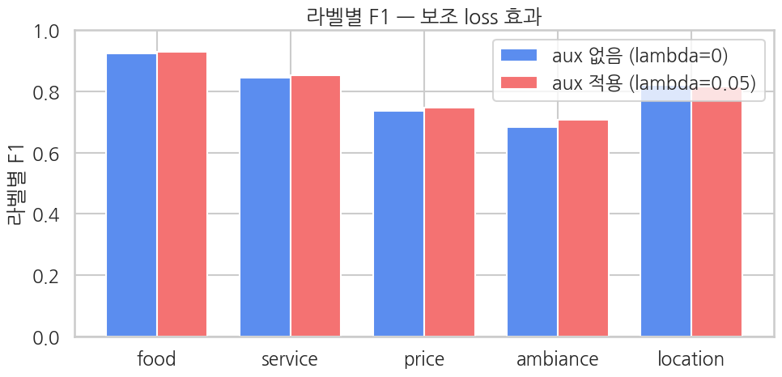
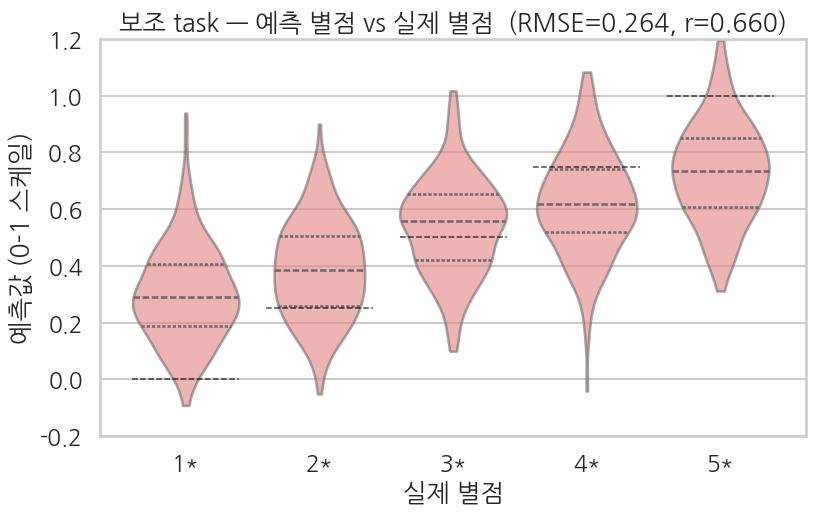

## 클라이맥스 — *λ=0 baseline* 학습 (= Ch 13 재현)

같은 코드를 `lambda_aux=0.0` 으로 한 번 더 돌립니다. 그러면 보조 loss 의 gradient 가 0이 되어 메인 task만 학습되는 상태 = **Ch 13과 정확히 동일한 학습 결과**. (보조 헤드는 학습되긴 하지만 메인 학습엔 영향 없음.)

> 의도적으로 *Ch 13 노트북을 따로 돌리지 않고* 이 셀에서 baseline을 다시 만듭니다 — 비교가 *같은 노트북·같은 환경* 안에서 self-contained 하도록.

```python
# 새 모델 인스턴스 — λ=0 학습용
torch.manual_seed(42); np.random.seed(42)   # λ=0.05 모델과 동일 초기화 (공정 비교)
model_no_aux = make_model()

training_args_no_aux = TrainingArguments(
    output_dir="./ch14_baseline_output",
    num_train_epochs=2,
    per_device_train_batch_size=16,
    per_device_eval_batch_size=32,
    learning_rate=2e-5,
    fp16=True,
    eval_strategy="epoch",
    logging_steps=50,
    save_strategy="no",
    report_to="none",
    seed=42,
    remove_unused_columns=False,
)

trainer_no_aux = AuxTrainer(
    model=model_no_aux,
    args=training_args_no_aux,
    train_dataset=train_tok,
    eval_dataset=eval_tok,
    data_collator=collator,
    processing_class=tokenizer,
    compute_metrics=compute_metrics_main,
    lambda_aux=0.0,    # ← 보조 loss 무시
)

train_result_no_aux = trainer_no_aux.train()
print(f"\nNo-aux (λ=0) baseline training done — mean train loss: {train_result_no_aux.training_loss:.4f}")
```

**▶ 실행 결과**

```text
[transformers] DistilBertForSequenceClassification LOAD REPORT from: distilbert-base-uncased
Key                     | Status     | 
------------------------+------------+-
vocab_transform.bias    | UNEXPECTED | 
vocab_projector.bias    | UNEXPECTED | 
vocab_layer_norm.weight | UNEXPECTED | 
vocab_layer_norm.bias   | UNEXPECTED | 
vocab_transform.weight  | UNEXPECTED | 
classifier.weight       | MISSING    | 
classifier.bias         | MISSING    | 
pre_classifier.bias     | MISSING    | 
pre_classifier.weight   | MISSING    | 

Notes:
- UNEXPECTED:	can be ignored when loading from different task/architecture; not ok if you expect identical arch.
- MISSING:	those params were newly initialized because missing from the checkpoint. Consider training on your downstream task.
Epoch  Training Loss  Validation Loss  Hamming Loss  Micro F1  Micro Precision  Micro Recall  Macro F1  Macro Precision  Macro Recall  Macro Auc  Runtime   Samples Per Second  Steps Per Second
1      0.386839       0.360188         0.140600      0.764962  0.902208         0.663958      0.665433  0.926159         0.567284      0.887096   1.262200  792.282000          25.353000
2      0.286978       0.293115         0.102000      0.839925  0.914559         0.776553      0.802303  0.932820         0.720649      0.917939   1.045600  956.386000          30.604000
No-aux (λ=0) baseline training done — mean train loss: 0.4010
```

```python
# baseline 메인 metric
eval_metrics_no_aux = trainer_no_aux.evaluate()
print("No-aux (λ=0) baseline — main task metrics:")
for k, v in eval_metrics_no_aux.items():
    if k.startswith("eval_") and isinstance(v, float):
        print(f"  {k:>22}: {v:.4f}")

# baseline 메인 per-sample 예측
preds_output_no_aux = trainer_no_aux.predict(eval_tok)
logits_no_aux = preds_output_no_aux.predictions
if isinstance(logits_no_aux, tuple):
    logits_no_aux = logits_no_aux[0]
probs_no_aux = 1.0 / (1.0 + np.exp(-logits_no_aux))
preds_main_no_aux = (probs_no_aux >= 0.5).astype(int)
```

**▶ 실행 결과**

```text
Training Loss  Validation Loss  Epoch  Hamming Loss  Micro F1  Micro Precision  Micro Recall  Macro F1  Macro Precision  Macro Recall  Macro Auc  Runtime   Samples Per Second  Steps Per Second
0.286978       0.293115         2      0.102000      0.839925  0.914559         0.776553      0.802303  0.932820         0.720649      0.917939   1.032000  968.979000          31.007000
No-aux (λ=0) baseline — main task metrics:
               eval_loss: 0.2931
       eval_hamming_loss: 0.1020
           eval_micro_f1: 0.8399
    eval_micro_precision: 0.9146
       eval_micro_recall: 0.7766
           eval_macro_f1: 0.8023
    eval_macro_precision: 0.9328
       eval_macro_recall: 0.7206
          eval_macro_auc: 0.9179
            eval_runtime: 1.0320
  eval_samples_per_second: 968.9790
   eval_steps_per_second: 31.0070
```

### 8-1. 메인 metric 비교 — λ=0 baseline vs λ=0.05 aux

```python
m_aux    = {k.replace("eval_", ""): v for k, v in eval_metrics_aux.items()
            if k.startswith("eval_") and isinstance(v, float)}
m_no_aux = {k.replace("eval_", ""): v for k, v in eval_metrics_no_aux.items()
            if k.startswith("eval_") and isinstance(v, float)}

common = [k for k in m_aux if k in m_no_aux]
cmp = pd.DataFrame({
    "metric":             common,
    "no aux (lambda=0)":  [m_no_aux[k] for k in common],
    "with aux (lambda=0.05)":[m_aux[k]    for k in common],
})
cmp["delta (aux - no_aux)"] = cmp["with aux (lambda=0.05)"] - cmp["no aux (lambda=0)"]
print(cmp.round(4).to_string(index=False))
```

**▶ 실행 결과**

```text
            metric  no aux (lambda=0)  with aux (lambda=0.05)  delta (aux - no_aux)
              loss             0.2931                  0.2963                0.0032
      hamming_loss             0.1020                  0.0978               -0.0042
          micro_f1             0.8399                  0.8469                0.0070
   micro_precision             0.9146                  0.9192                0.0046
      micro_recall             0.7766                  0.7853                0.0087
          macro_f1             0.8023                  0.8109                0.0086
   macro_precision             0.9328                  0.9328               -0.0001
      macro_recall             0.7206                  0.7316                0.0109
         macro_auc             0.9179                  0.9182                0.0003
           runtime             1.0320                  0.9882               -0.0438
samples_per_second           968.9790               1011.8910               42.9120
  steps_per_second            31.0070                 32.3810                1.3740
```

**해석 가이드**

- `delta` > 0 — 보조 loss 가 메인 task 에 *도움* 이 됨 (멀티태스크의 정통 효과).
- `delta` < 0 — 보조 loss 가 메인 task 를 *방해* 함 (λ가 너무 큼 / 보조 task 가 메인과 상관 약함).
- `delta` ≈ 0 — 별 영향 없음 (보조 신호가 메인 표현에 의미 없는 추가).

별점은 항목 분포와 *부분적으로* 상관 (긍정 항목 → 높은 별점) 이라 *작은 양의 delta* 가 자연스러운 결과. 0.5%p 정도면 노이즈일 수 있고, 1-2%p 면 의미 있는 효과.

### 8-2. 라벨별 F1 비교 — 어느 항목이 보조 loss로 가장 도움받았나

```python
def per_label_f1(Y_true, Y_pred):
    f1s = []
    for k in range(K):
        _, _, f1, _ = precision_recall_fscore_support(
            Y_true[:, k], Y_pred[:, k], average="binary", zero_division=0,
        )
        f1s.append(float(f1))
    return f1s


f1_no_aux = per_label_f1(labels_eval, preds_main_no_aux)
f1_aux    = per_label_f1(labels_eval, preds_main_aux)

label_cmp = pd.DataFrame({
    "aspect":              ASPECTS,
    "no aux F1":           f1_no_aux,
    "with aux F1":         f1_aux,
    "delta (aux - no_aux)": np.array(f1_aux) - np.array(f1_no_aux),
})
print(label_cmp.round(4).to_string(index=False))

# 막대 그래프
sns.set_theme(style="whitegrid", context="talk", font="NanumGothic", rc={"axes.unicode_minus": False})
fig, ax = plt.subplots(figsize=(10, 5))
x_pos = np.arange(K)
width = 0.38
ax.bar(x_pos - width/2, f1_no_aux, width, label="aux 없음 (lambda=0)",  color="#5B8DEF")
ax.bar(x_pos + width/2, f1_aux,    width, label="aux 적용 (lambda=0.05)",color="#F47272")
ax.set_xticks(x_pos)
ax.set_xticklabels(ASPECTS)
ax.set_ylim(0, 1)
ax.set_ylabel("라벨별 F1")
ax.set_title("라벨별 F1 — 보조 loss 효과")
ax.legend()
plt.tight_layout()
plt.show()
```

**▶ 실행 결과**

```text
  aspect  no aux F1  with aux F1  delta (aux - no_aux)
    food     0.9242       0.9295                0.0053
 service     0.8453       0.8536                0.0083
   price     0.7360       0.7475                0.0115
ambiance     0.6848       0.7072                0.0224
location     0.8212       0.8167               -0.0046
```



**해석**

- **별점과 상관이 강한 항목** (food, service): 보조 별점 회귀 학습이 *긍정/부정 신호* 를 잘 잡으면 도움이 됩니다. 작은 양의 delta 기대.
- **별점과 상관이 약한 항목** (location 등): 별점 신호가 *직접적 도움* 이 안 됨. delta가 0 근처거나 약간 음수일 수 있음.
- **분산이 큰 라벨** — eval 표본이 적어 F1 자체가 노이즈가 큼. delta 도 의미 해석 조심.

**실제 결과와 맞춰보면** 위 예상이 부분적으로만 맞습니다. 위 표에서 개선폭이 가장 큰 라벨은 상관이 강한 항목이 아니라 **baseline F1 이 낮은 항목** 쪽입니다 — 올라갈 여지가 많은 라벨이 더 크게 움직였다고 읽는 편이 실측에 맞습니다. 단일 시드 1회 결과이므로 순위 자체는 시드에 따라 뒤집힐 수 있습니다.

### 8-3. 보조 task 자체는 얼마나 잘 학습됐나

별점 회귀가 잘 됐다는 건 BERT 본체가 *별점 신호도 효율적으로 인코딩* 하고 있다는 뜻 — 메인 task 표현에도 그 신호가 들어가 있을 가능성.

```python
# True star 별로 예측값 분포를 violin 으로 — 정답이 5개 정수 라벨에서만 나오므로
# scatter 보다 분포가 훨씬 깔끔하게 보임
true_star = np.round(np.array(aux_true) * 4).astype(int) + 1   # 0-1 스케일을 1-5 별점으로
star_label = [f"{s}*" for s in true_star]
df_aux = pd.DataFrame({"실제 별점": star_label, "예측값 (0-1 스케일)": aux_preds_aux})
order = ["1*", "2*", "3*", "4*", "5*"]

fig, ax = plt.subplots(figsize=(8.5, 5.5))
sns.violinplot(
    data=df_aux, x="실제 별점", y="예측값 (0-1 스케일)",
    order=order, inner="quart", cut=0,
    color="#F47272", alpha=0.6, ax=ax,
)
# 정답이 있는 위치를 점선 가이드로 표시 (1* -> 0.0, 5* -> 1.0)
for i, target in enumerate([0.0, 0.25, 0.5, 0.75, 1.0]):
    ax.hlines(target, i - 0.4, i + 0.4, color="black", lw=1.1, ls="--", alpha=0.7)
ax.set_ylim(-0.2, 1.2)
ax.set_title(f"보조 task — 예측 별점 vs 실제 별점  (RMSE={rmse_aux:.3f}, r={pear_aux:.3f})")
plt.tight_layout()
plt.show()
```

**▶ 실행 결과**



**해석**

- 각 violin이 *해당 별점의 정답 위치* (점선 가이드: 1★=0.0, 2★=0.25, 3★=0.5, 4★=0.75, 5★=1.0) 에 *중심* 하면 보조 head 가 별점 신호를 잘 학습한 것.
- violin 의 *너비* = 그 별점 내 예측 분산. 너비가 좁을수록 모델이 자신 있게 회귀 — 모든 별점에서 좁으면 calibration 이 좋음.
- 가장 어려운 별점은 보통 *3★* (중간값) — 사람도 모호한 평가라 violin 이 길게 늘어지거나 인접 별점 위치까지 침범하면 자연스러움.
- 1★/5★ 양 끝 violin 이 정답 위치에서 *체계적으로 안쪽* 으로 치우치면 *극단값에 보수적* 인 회귀 — MSE 가 양 끝에서 손실이 작아지는 특성과 결부된 일반적 경향.

## 결과 해석 — sweet spot 에서 보조가 메인을 돕는다

§8 비교에서 **λ=0.05 보조가 λ=0 baseline 을 micro-F1·macro-F1 모두에서 앞섰습니다.** 별점이라는 *깨끗한 연속 신호* 가 공유 BERT 본체를 더 일반적인 표현으로 끌어, 키워드 매칭으로 *합성* 한 노이즈 큰 항목 라벨에 과적합하는 걸 눌러준 것 — §2 에서 본 동기 (1) 정규화가 실제로 작동했습니다.

다만 이 효과는 **λ 를 작게 잡았을 때만** 나옵니다. 부록 `14_auxiliary_loss_lambda_sweep` 에서 λ 를 0 → 1 로 키우며 같은 데이터·모델로 측정한 곡선입니다:

| λ | micro-F1 | macro-F1 | 보조 R² |
|---|---|---|---|
| 0.0 (baseline) | 0.840 | 0.802 | — |
| **0.05 (sweet spot)** | **0.847** | **0.811** | 0.43 |
| 0.1 | 0.844 | 0.806 | 0.49 |
| 0.3 | 0.803 | 0.738 | 0.57 |
| 0.5 | 0.747 | 0.632 | 0.60 |
| 1.0 | 0.662 | 0.391 | 0.65 |

λ 를 키울수록 **보조 task 자체는 계속 좋아지지만(R² 0.43 → 0.65)** 메인은 무너집니다. λ=0.3 에서 이미 baseline 아래로 떨어지고, λ=1.0 에서는 micro 0.66 · macro 0.39 로 폭락합니다. λ 는 공유 인코더의 학습 자원을 메인↔보조로 나누는 손잡이이고, 보조가 *거드는* 구간은 좁습니다(여기선 0.05-0.1).

### 왜 λ=1 은 무너지나

별점 회귀(MSE)와 항목 분류(BCE per-label)는 *스케일이 다른* 손실입니다. λ=1 이면 보조 MSE 가 메인 BCE 와 동등 가중을 받아, 공유 본체가 *별점 예측에 유리한* 방향으로 기울고 항목 분류용 표현이 밀려납니다 — 보조 R² 가 0.65 까지 오르는 게 바로 그 증거입니다. 입문 직관 "λ=1 이 균형" 은 *두 손실의 스케일이 비슷할 때* 만 맞습니다.

### 실무 교훈

- 보조 손실은 **작은 λ 부터(0.05-0.1)** 시작해 validation 에서 키워가며 sweet spot 을 찾습니다. λ=1 부터 시작하면 메인을 깎아 "보조는 안 통한다" 는 *잘못된 결론* 에 빠지기 쉽습니다.
- 손실 종류가 다르면(분류 BCE + 회귀 MSE) sweet spot λ 는 1 보다 *훨씬 작은* 쪽입니다 — 두 손실의 평균 크기를 맞추는 정규화로 보면 됩니다.
- 보조의 가치는 메인 정확도 향상 *그 자체* 만이 아니라, *운영 시점에 항목+별점 두 출력을 한 모델로* 얻는 데에도 있습니다(§2 동기 5).

> 📓 전체 λ 곡선·그림·보조 R² 추이는 부록 노트북 **`14_auxiliary_loss_lambda_sweep`** 에서 직접 실행해 볼 수 있습니다.
