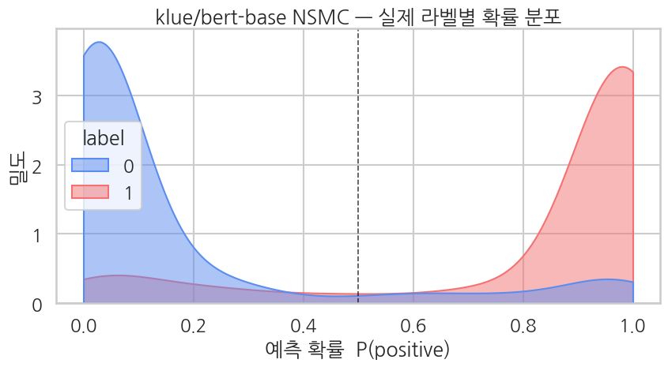
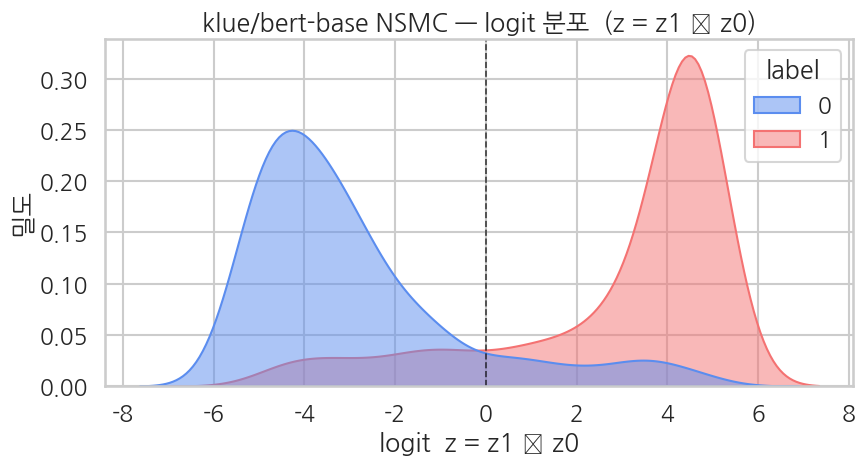

## 평가 — softmax 확률 분포

Ch 11 의 평가 패턴 그대로 — 2차원 logit 에서 softmax → 클래스 1 확률 추출, 1차원 logit z = z_1 - z_0 도 같이 만들어 시각화 호환.

학습된 모델을 eval 1,000건에 대해 평가해 위에서 정의한 지표들을 출력합니다.

```python
eval_metrics = trainer.evaluate()
print("klue/bert-base NSMC binary — evaluation:")
for k, v in eval_metrics.items():
    if k.startswith("eval_") and isinstance(v, float):
        print(f"  {k:>20}: {v:.4f}")
```

**▶ 실행 결과**

```text
Training Loss  Validation Loss  Epoch  Accuracy  Precision  Recall    F1        Auc
0.203112       0.391946         2      0.862000  0.873706   0.845691  0.859470  0.928750
klue/bert-base NSMC binary — evaluation:
             eval_loss: 0.3919
         eval_accuracy: 0.8620
        eval_precision: 0.8737
           eval_recall: 0.8457
               eval_f1: 0.8595
              eval_auc: 0.9287
```

**결과 해석**

accuracy 약 86%, F1 약 0.86 으로 NSMC 5K 샘플 + 2 에폭의 전형적 성능 구간(85-88%)에 듭니다. AUC 가 0.93 에 가까워 모델이 긍정/부정을 확률로 잘 분리하고 있음을 보여줍니다. precision 과 recall 이 비슷한 수준이라 한쪽으로 치우친 판정도 아닙니다. 90%+ 가 목표라면 학습 데이터를 30K 이상으로 늘려야 합니다.

전체 eval 예측을 받아 2차원 raw logit 에서 softmax 확률과, 시각화에 쓸 1차원 logit $z = z_1 - z_0$ 를 만듭니다. 방식 B(2차원 softmax)를 방식 A(1차원 logit) 형태로 환산해 Ch 10·11 과 같은 그림을 그릴 수 있게 하는 단계입니다.

```python
preds_output = trainer.predict(eval_tok)
logits2 = preds_output.predictions
labels  = preds_output.label_ids.astype(int)

exp = np.exp(logits2 - logits2.max(axis=1, keepdims=True))
probs_full = exp / exp.sum(axis=1, keepdims=True)
probs = probs_full[:, 1]
logits = logits2[:, 1] - logits2[:, 0]

print(f"logits2 (raw)  shape: {logits2.shape}")
print(f"logit z = z1-z0 range: [{logits.min():.2f}, {logits.max():.2f}]")
print(f"prob range:           [{probs.min():.4f}, {probs.max():.4f}]")
print(f"positive prediction rate (prob >= 0.5): {(probs >= 0.5).mean():.1%}")
```

**▶ 실행 결과**

```text
logits2 (raw)  shape: (1000, 2)
logit z = z1-z0 range: [-5.61, 5.12]
prob range:           [0.0036, 0.9940]
positive prediction rate (prob >= 0.5): 48.3%
```

**결과 해석**

확률이 0.00 대에서 0.99 대까지 양극단으로 넓게 퍼져 있어 모델이 많은 샘플에 자신 있는 판단을 내립니다. positive 예측 비율이 실제 eval 양성 비율(49.9%)과 1%p 안쪽으로 가까워, 임계값 0.5 기준 예측이 한쪽으로 치우치지 않았습니다.

클래스별 precision/recall/F1 을 한눈에 보는 분류 리포트입니다. negative·positive 가 균형 잡힌 데이터라 두 클래스 지표가 비슷하게 나오는지 확인합니다.

```python
# 분류 리포트
print(classification_report(
    labels, probs_full.argmax(axis=1),
    target_names=["negative", "positive"],
    digits=4,
))
```

**▶ 실행 결과**

```text
              precision    recall  f1-score   support

    negative     0.8511    0.8782    0.8644       501
    positive     0.8737    0.8457    0.8595       499

    accuracy                         0.8620      1000
   macro avg     0.8624    0.8620    0.8620      1000
weighted avg     0.8624    0.8620    0.8620      1000
```

### 6-1. 메인 그림 — 확률 공간 KDE (Ch 11 와 동일 패턴)

실제 라벨별로 예측 확률 $P(\text{positive})$ 의 분포를 KDE 로 겹쳐 그립니다. 두 곡선이 0.5 경계선 좌우로 잘 분리될수록 모델이 한국어 감성을 또렷하게 학습한 것입니다.

```python
sns.set_theme(style="whitegrid", context="talk", font="NanumGothic", rc={"axes.unicode_minus": False})
PAL = {0: "#5B8DEF", 1: "#F47272"}
df_eval = pd.DataFrame({"prob": probs, "logit": logits, "label": labels})

fig, ax = plt.subplots(figsize=(9, 5))
sns.kdeplot(
    data=df_eval, x="prob", hue="label",
    fill=True, common_norm=False, alpha=0.5,
    palette=PAL, clip=(0, 1), ax=ax,
)
ax.axvline(0.5, color="black", lw=1.2, ls="--", alpha=0.7)
ax.set_title("klue/bert-base NSMC — 실제 라벨별 확률 분포")
ax.set_xlabel("예측 확률  P(positive)")
ax.set_ylabel("밀도")
plt.tight_layout()
plt.show()
```

**▶ 실행 결과**



### 6-2. 보조 그림 — logit 공간 KDE (z = z_1 - z_0)

같은 분포를 확률 대신 logit $z = z_1 - z_0$ 공간에서 다시 그립니다. 확률은 0~1 로 눌려 양극단이 뭉치지만, logit 공간에선 자신 있는 예측들이 0 양옆으로 멀리 퍼져 분리도가 더 잘 보입니다.

```python
fig, ax = plt.subplots(figsize=(9, 5))
sns.kdeplot(
    data=df_eval, x="logit", hue="label",
    fill=True, common_norm=False, alpha=0.5,
    palette=PAL, ax=ax,
)
ax.axvline(0.0, color="black", lw=1.2, ls="--", alpha=0.7)
ax.set_title("klue/bert-base NSMC — logit 분포  (z = z1 − z0)")
ax.set_xlabel("logit  z = z1 − z0")
ax.set_ylabel("밀도")
plt.tight_layout()
plt.show()
```

**▶ 실행 결과**



**해석**

- 두 KDE 가 잘 분리되면 모델이 한국어 감성을 학습한 것. NSMC 는 짧은 한 줄 리뷰라 정보가 적어 영어 Yelp 보다 *조금 더 어려운* 데이터.
- 보통 NSMC 5K 샘플 + 2 에폭이면 accuracy 85-88% 정도. 90%+ 가 목표면 학습 데이터를 30K 이상으로 늘려야 함.

### 6-3. 샘플 단위 해석 — 실제 한국어 리뷰가 어떻게 분류되나

평가 데이터에서 *모델이 가장 자신 있는* 샘플과 *가장 망설이는* 샘플을 골라 직접 읽어봅니다. 짧은 한국어 리뷰가 모델 입장에서 어떻게 보이는지 감을 잡습니다.

모델이 *가장 자신 있는* positive·negative 샘플과 *가장 망설이는*(prob ≈ 0.5) 샘플을 각각 골라 실제 한국어 리뷰를 직접 읽어봅니다. 짧은 리뷰가 모델 눈에 어떻게 보이는지 감을 잡는 단계입니다.

```python
# 가장 자신있게 positive (probs 최대), 가장 자신있게 negative (probs 최소),
# 가장 망설이는 (|probs - 0.5| 최소) 3가지 샘플
texts = list(df_eval.assign(text=eval_ds["text"])["text"]) if "text" in eval_ds.column_names else list(eval_ds["text"])

# eval_tok 와 eval_ds 의 순서가 같으므로 인덱스 직접 사용
idx_top_pos    = int(np.argmax(probs))
idx_top_neg    = int(np.argmin(probs))
idx_uncertain  = int(np.argmin(np.abs(probs - 0.5)))

samples = [
    ("most confident positive", idx_top_pos),
    ("most confident negative", idx_top_neg),
    ("most uncertain (prob ≈ 0.5)", idx_uncertain),
]

for label_str, idx in samples:
    print("=" * 78)
    print(f"sample #{idx}  ({label_str})")
    print("=" * 78)
    print(f"text:        {texts[idx]}")
    print(f"true label:  {labels[idx]}  ({'positive' if labels[idx] == 1 else 'negative'})")
    print(f"prob(pos):   {probs[idx]:.4f}")
    print(f"logit z:     {logits[idx]:+.2f}")
    pred_label = int(probs[idx] >= 0.5)
    pred_str = "positive" if pred_label == 1 else "negative"
    match = "✓" if pred_label == labels[idx] else "✗"
    print(f"prediction:  {pred_label} ({pred_str})    match: {match}")
    print()
```

**▶ 실행 결과**

```text
==============================================================================
sample #575  (most confident positive)
==============================================================================
text:        제가 본 최고의 액션영화 다섯손가락에 들어가요~ 액션영화하면 이 영화가 제일먼저 생각나는듯최고의영화!!
true label:  1  (positive)
prob(pos):   0.9940
logit z:     +5.12
prediction:  1 (positive)    match: ✓

==============================================================================
sample #617  (most confident negative)
==============================================================================
text:        하아.. 엄정화 박서준은 좋아하지만 일단 대본이 너무 별로임;; 유치하고 지루함.. 진짜 1, 2화보는데 하루종일 봤음 계속 딴거 하다 보느라.. 그리고 너무 몰입도 안되고 ㅠㅠ
true label:  0  (negative)
prob(pos):   0.0036
logit z:     -5.61
prediction:  0 (negative)    match: ✓

==============================================================================
sample #993  (most uncertain (prob ≈ 0.5))
==============================================================================
text:        옛날 1,2,3탄이 잼 있었다.
true label:  0  (negative)
prob(pos):   0.5007
logit z:     +0.00
prediction:  1 (positive)    match: ✗
```

**결과 해석**

가장 자신 있는 두 샘플은 `"제가 본 최고의 액션영화…최고의영화!!"`, `"대본이 너무 별로임;; 유치하고 지루함"` 처럼 감성이 노골적인 표현이라 모델이 양극단에 거의 확신합니다. 부정 쪽 샘플은 `"엄정화 박서준은 좋아하지만"` 이라는 칭찬이 섞여 있는데도 확신했는데, 역접 뒤의 평가를 리뷰의 결론으로 읽었다는 뜻입니다. 반면 망설인 샘플 `"옛날 1,2,3탄이 잼 있었다."` 는 확률이 0.5 에 거의 붙은 채 오답을 냈습니다 — 표면에 `"잼 있었다"` 라는 *긍정 단어* 가 있지만 *과거형으로 옛 작품을 칭찬해 현재 작품을 낮추는* 구조라, 단어만으로는 잡히지 않는 케이스임을 보여줍니다.

**관찰 포인트**

- *가장 자신있는* 샘플들은 보통 *명확한 감성 표현* 이 들어 있음 (`"인생 영화"`, `"시간 아까움"` 같은). 모델이 그런 시그널 단어 + 문맥을 잘 잡았다는 신호.
- *망설이는 샘플 (prob ≈ 0.5)* 은 *모호하거나 짧거나 반어* 인 경우. NSMC 에는 `"음..."`, `"글쎄요"` 같은 한 두 글자 리뷰도 있어 모델 입장에선 정보 부족.
- 자신 있는 *오답* (틀렸는데 prob 가 0.9+) 이면 *반어법* (`"이게 영화냐 ㅎㅎ"` 형태) 이거나 라벨 노이즈. NSMC 에 라벨 오류가 ~3-5% 있다고 알려져 있음.
