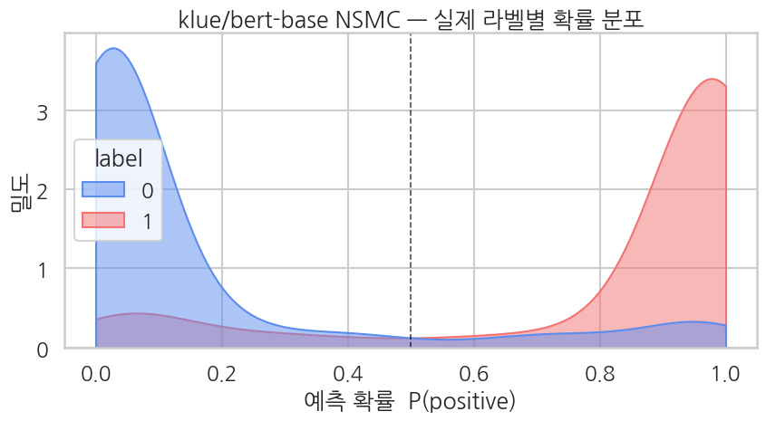
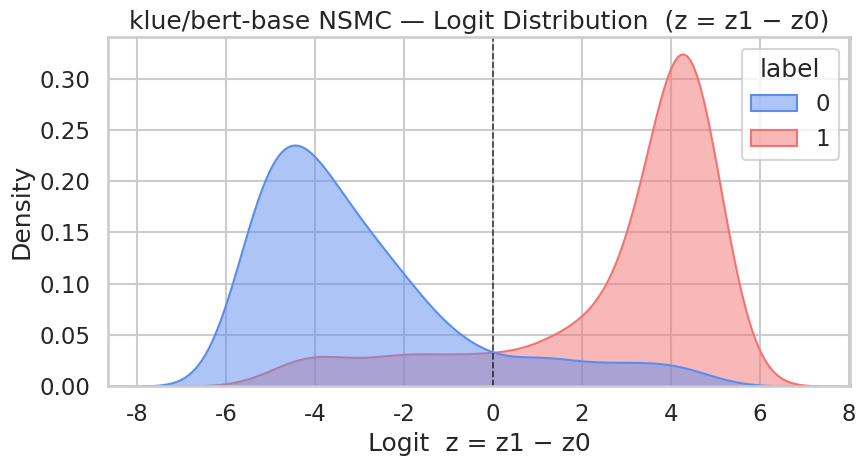

> ▶ **[Google Colab에서 이 장 실습 열기](https://colab.research.google.com/github/yoon-gu/neuqes-101/blob/master/15_ko_binary/15_ko_binary.ipynb)** — 브라우저에서 바로 실행해 볼 수 있습니다.

## 환경 준비

```python
!pip install -q transformers datasets
```

```python
import warnings
warnings.filterwarnings("ignore")

import io
import urllib.request
import numpy as np
import pandas as pd
import matplotlib.pyplot as plt
import seaborn as sns
import torch
from datasets import Dataset
from transformers import (
    AutoTokenizer, AutoModelForSequenceClassification,
    Trainer, TrainingArguments,
)
from sklearn.metrics import (
    accuracy_score, precision_recall_fscore_support,
    classification_report, roc_auc_score,
)

plt.rcParams["axes.unicode_minus"] = False

print(f"PyTorch:        {torch.__version__}")
print(f"CUDA available: {torch.cuda.is_available()}")
if torch.cuda.is_available():
    print(f"GPU:             {torch.cuda.get_device_name(0)}")
else:
    print("Warning: CPU runtime — training will be very slow. Switch to T4 recommended.")
```

**▶ 실행 결과**

```text
PyTorch:        2.11.0+cu128
CUDA available: True
GPU:             Tesla T4
```

```python
!nvidia-smi
```

**▶ 실행 결과**

```text
Wed Jun 17 21:44:50 2026       
+-----------------------------------------------------------------------------------------+
| NVIDIA-SMI 580.82.07              Driver Version: 580.82.07      CUDA Version: 13.0     |
+-----------------------------------------+------------------------+----------------------+
| GPU  Name                 Persistence-M | Bus-Id          Disp.A | Volatile Uncorr. ECC |
| Fan  Temp   Perf          Pwr:Usage/Cap |           Memory-Usage | GPU-Util  Compute M. |
|                                         |                        |               MIG M. |
|=========================================+========================+======================|
|   0  Tesla T4                       Off |   00000000:00:04.0 Off |                    0 |
| N/A   32C    P8             11W /   70W |       3MiB /  15360MiB |      0%      Default |
|                                         |                        |                  N/A |
+-----------------------------------------+------------------------+----------------------+

+-----------------------------------------------------------------------------------------+
| Processes:                                                                              |
|  GPU   GI   CI              PID   Type   Process name                        GPU Memory |
|        ID   ID                                                               Usage      |
|=========================================================================================|
|  No running processes found                                                             |
+-----------------------------------------------------------------------------------------+
```

```python
tokenizer_ko = AutoTokenizer.from_pretrained("klue/bert-base")
tokenizer_en = AutoTokenizer.from_pretrained("distilbert-base-uncased")

samples = [
    "이 영화 정말 재미있었어요",
    "별로였어요. 시간 낭비",
    "오랜만에 본 명작이네요!",
]

for sent in samples:
    print(f"text: {sent}")
    tok_ko = tokenizer_ko.tokenize(sent)
    tok_en = tokenizer_en.tokenize(sent)
    print(f"  klue/bert-base ({len(tok_ko):>2} tokens): {tok_ko}")
    print(f"  distilbert-en  ({len(tok_en):>2} tokens): {tok_en}")
    print()

print(f"klue/bert-base vocab size:        {tokenizer_ko.vocab_size:,}")
print(f"distilbert-base-uncased vocab:    {tokenizer_en.vocab_size:,}")
```

**▶ 실행 결과**

```text
text: 이 영화 정말 재미있었어요
  klue/bert-base ( 6 tokens): ['이', '영화', '정말', '재미있', '##었', '##어요']
  distilbert-en  (14 tokens): ['ᄋ', '##ᅵ', 'ᄋ', '##ᅧ', '##ᆼ', '##ᄒ', '##ᅪ', 'ᄌ', '##ᅥ', '##ᆼ', '##ᄆ', '##ᅡ', '##ᆯ', '[UNK]']

text: 별로였어요. 시간 낭비
  klue/bert-base ( 6 tokens): ['별로', '##였', '##어요', '.', '시간', '낭비']
  distilbert-en  (12 tokens): ['[UNK]', '.', 'ᄉ', '##ᅵ', '##ᄀ', '##ᅡ', '##ᆫ', 'ᄂ', '##ᅡ', '##ᆼ', '##ᄇ', '##ᅵ']

text: 오랜만에 본 명작이네요!
  klue/bert-base ( 8 tokens): ['오랜만', '##에', '본', '명작', '##이', '##네', '##요', '!']
  distilbert-en  (26 tokens): ['ᄋ', '##ᅩ', '##ᄅ', '##ᅢ', '##ᆫ', '##ᄆ', '##ᅡ', '##ᆫ', '##ᄋ', '##ᅦ', 'ᄇ', '##ᅩ', '##ᆫ', 'ᄆ', '##ᅧ', '##ᆼ', '##ᄌ', '##ᅡ', '##ᆨ', '##ᄋ', '##ᅵ', '##ᄂ', '##ᅦ', '##ᄋ', '##ᅭ', '!']

klue/bert-base vocab size:        32,000
distilbert-base-uncased vocab:    30,522
```

**결과 해석**

한국어로 학습된 `klue/bert-base`는 "재미있" + "##었" + "##어요"처럼 의미 단위에 가깝게 6-8개 토큰으로 끊지만, 영어 위주의 `distilbert-en`은 한글 음절을 자모 단위로 분해해 같은 문장을 14-26개 토큰으로 파편화하고 `[UNK]`까지 흘립니다. 한국어에서는 그 언어로 학습된 토크나이저를 쓰는 것이 토큰 효율과 표현력 모두에서 결정적임을 보여 줍니다.

```python
TRAIN_URL = "https://raw.githubusercontent.com/e9t/nsmc/master/ratings_train.txt"
TEST_URL  = "https://raw.githubusercontent.com/e9t/nsmc/master/ratings_test.txt"

print("downloading NSMC train/test from GitHub...")
df_train_full = pd.read_csv(TRAIN_URL, sep="\t").dropna(subset=["document"])
df_test_full  = pd.read_csv(TEST_URL,  sep="\t").dropna(subset=["document"])
print(f"  train: {len(df_train_full):,} rows")
print(f"  test:  {len(df_test_full):,} rows")
print(f"  label distribution (train): {df_train_full['label'].value_counts().to_dict()}")
print(f"\nfirst 3 rows of train:")
for _, row in df_train_full.head(3).iterrows():
    print(f"  label={row['label']}  text={row['document'][:80]}")
```

**▶ 실행 결과**

```text
downloading NSMC train/test from GitHub...
  train: 149,995 rows
  test:  49,997 rows
  label distribution (train): {0: 75170, 1: 74825}

first 3 rows of train:
  label=0  text=아 더빙.. 진짜 짜증나네요 목소리
  label=1  text=흠...포스터보고 초딩영화줄....오버연기조차 가볍지 않구나
  label=0  text=너무재밓었다그래서보는것을추천한다
```

**결과 해석**

NSMC는 부정(0) 75,170건과 긍정(1) 74,825건으로 거의 1:1로 균형 잡힌 영화 리뷰 데이터라, 정확도 지표를 그대로 신뢰할 수 있습니다.

```python
# 5K train / 1K eval 로 subsample (T4 30분 룰)
SEED = 42
df_train = df_train_full.sample(n=5000, random_state=SEED).reset_index(drop=True)
df_eval  = df_test_full.sample(n=1000,  random_state=SEED).reset_index(drop=True)

print(f"sampled train: {len(df_train)}")
print(f"sampled eval:  {len(df_eval)}")
print(f"train positive rate: {df_train['label'].mean():.1%}")
print(f"eval  positive rate: {df_eval['label'].mean():.1%}")

# datasets.Dataset 형태로 변환
train_ds = Dataset.from_pandas(df_train[["document", "label"]])
eval_ds  = Dataset.from_pandas(df_eval[["document", "label"]])

# 컬럼 이름을 transformers 표준에 맞게 통일
train_ds = train_ds.rename_column("document", "text")
eval_ds  = eval_ds.rename_column("document", "text")
print()
print(train_ds)
```

**▶ 실행 결과**

```text
sampled train: 5000
sampled eval:  1000
train positive rate: 49.2%
eval  positive rate: 49.9%

Dataset({
    features: ['text', 'label'],
    num_rows: 5000
})
```

```python
tokenizer = tokenizer_ko   # klue/bert-base (위에서 로드)

def tokenize_fn(batch):
    out = tokenizer(batch["text"], truncation=True, max_length=128)
    out["labels"] = [int(l) for l in batch["label"]]
    return out

train_tok = train_ds.map(tokenize_fn, batched=True).remove_columns(["text", "label"])
eval_tok  = eval_ds.map(tokenize_fn,  batched=True).remove_columns(["text", "label"])

print(train_tok)
print(f"\nFirst sample label: {train_tok[0]['labels']}  (int scalar 0=neg / 1=pos)")
# 토큰화된 첫 샘플의 길이
lens = [len(s) for s in train_tok["input_ids"]]
print(f"\nToken length stats — mean: {np.mean(lens):.1f}, median: {np.median(lens):.0f}, max: {max(lens)}")
```

**▶ 실행 결과**

```text
Dataset({
    features: ['input_ids', 'token_type_ids', 'attention_mask', 'labels'],
    num_rows: 5000
})

First sample label: 1  (int scalar 0=neg / 1=pos)

Token length stats — mean: 21.9, median: 17, max: 117
```

**결과 해석**

토큰 길이가 평균 21.9개, 중앙값 17개로 짧고 최대도 117개라 `max_length=128`에서 사실상 잘리는 리뷰가 거의 없어, 영화평이라는 짧은 텍스트 특성과 설정이 잘 맞습니다.

```python
model = AutoModelForSequenceClassification.from_pretrained(
    "klue/bert-base",
    num_labels=2,
    problem_type="single_label_classification",
    id2label={0: "negative", 1: "positive"},
    label2id={"negative": 0, "positive": 1},
)

def param_summary(m):
    total     = sum(p.numel() for p in m.parameters())
    trainable = sum(p.numel() for p in m.parameters() if p.requires_grad)
    return total, trainable

total, trainable = param_summary(model)
print(f"Parameters:           {total:>13,}  ({total/1e6:.1f} M)")
print(f"Trainable parameters: {trainable:>13,}  ({trainable/total:.1%})")
print(f"Classifier:           {model.classifier}")
print(f"problem_type:         {model.config.problem_type}")
print(f"hidden size H:        {model.config.hidden_size}")
print(f"vocab size V:         {model.config.vocab_size:,}")
```

**▶ 실행 결과**

```text
[transformers] BertForSequenceClassification LOAD REPORT from: klue/bert-base
Key                                        | Status     | 
-------------------------------------------+------------+-
cls.predictions.transform.dense.weight     | UNEXPECTED | 
cls.predictions.transform.dense.bias       | UNEXPECTED | 
cls.seq_relationship.bias                  | UNEXPECTED | 
cls.predictions.transform.LayerNorm.bias   | UNEXPECTED | 
cls.predictions.bias                       | UNEXPECTED | 
cls.seq_relationship.weight                | UNEXPECTED | 
cls.predictions.transform.LayerNorm.weight | UNEXPECTED | 
classifier.weight                          | MISSING    | 
classifier.bias                            | MISSING    | 

Notes:
- UNEXPECTED:	can be ignored when loading from different task/architecture; not ok if you expect identical arch.
- MISSING:	those params were newly initialized because missing from the checkpoint. Consider training on your downstream task.
Parameters:             110,618,882  (110.6 M)
Trainable parameters:   110,618,882  (100.0%)
Classifier:           Linear(in_features=768, out_features=2, bias=True)
problem_type:         single_label_classification
hidden size H:        768
vocab size V:         32,000
```

```python
!nvidia-smi
```

**▶ 실행 결과**

```text
Wed Jun 17 21:45:11 2026       
+-----------------------------------------------------------------------------------------+
| NVIDIA-SMI 580.82.07              Driver Version: 580.82.07      CUDA Version: 13.0     |
+-----------------------------------------+------------------------+----------------------+
| GPU  Name                 Persistence-M | Bus-Id          Disp.A | Volatile Uncorr. ECC |
| Fan  Temp   Perf          Pwr:Usage/Cap |           Memory-Usage | GPU-Util  Compute M. |
|                                         |                        |               MIG M. |
|=========================================+========================+======================|
|   0  Tesla T4                       Off |   00000000:00:04.0 Off |                    0 |
| N/A   33C    P8             12W /   70W |       3MiB /  15360MiB |      0%      Default |
|                                         |                        |                  N/A |
+-----------------------------------------+------------------------+----------------------+

+-----------------------------------------------------------------------------------------+
| Processes:                                                                              |
|  GPU   GI   CI              PID   Type   Process name                        GPU Memory |
|        ID   ID                                                               Usage      |
|=========================================================================================|
|  No running processes found                                                             |
+-----------------------------------------------------------------------------------------+
```

```python
def compute_metrics(eval_pred):
    logits, labels = eval_pred
    # logits.shape = (B, 2)  → softmax → 클래스 1 확률
    exp = np.exp(logits - logits.max(axis=1, keepdims=True))
    probs_full = exp / exp.sum(axis=1, keepdims=True)
    probs = probs_full[:, 1]
    preds = probs_full.argmax(axis=1)

    p, r, f1, _ = precision_recall_fscore_support(labels, preds, average="binary", zero_division=0)
    return {
        "accuracy":  float(accuracy_score(labels, preds)),
        "precision": float(p),
        "recall":    float(r),
        "f1":        float(f1),
        "auc":       float(roc_auc_score(labels, probs)),
    }
```

```python
training_args = TrainingArguments(
    output_dir="./ch15_output",
    num_train_epochs=2,
    per_device_train_batch_size=16,
    per_device_eval_batch_size=32,
    learning_rate=2e-5,
    fp16=True,
    eval_strategy="epoch",
    logging_steps=50,
    save_strategy="no",
    report_to="none",
    seed=SEED,
)

trainer = Trainer(
    model=model,
    args=training_args,
    train_dataset=train_tok,
    eval_dataset=eval_tok,
    processing_class=tokenizer,
    compute_metrics=compute_metrics,
)

train_result = trainer.train()
print(f"\nTraining done — mean train loss: {train_result.training_loss:.4f}")
```

**▶ 실행 결과**

```text
<IPython.core.display.HTML object>
Training done — mean train loss: 0.3008
```

**결과 해석**

2 에폭 학습 후 평균 train loss가 0.30까지 내려가, 한국어 데이터에서도 BERT 이진 분류가 안정적으로 수렴함을 보여 줍니다.

```python
!nvidia-smi
```

**▶ 실행 결과**

```text
Wed Jun 17 21:46:00 2026       
+-----------------------------------------------------------------------------------------+
| NVIDIA-SMI 580.82.07              Driver Version: 580.82.07      CUDA Version: 13.0     |
+-----------------------------------------+------------------------+----------------------+
| GPU  Name                 Persistence-M | Bus-Id          Disp.A | Volatile Uncorr. ECC |
| Fan  Temp   Perf          Pwr:Usage/Cap |           Memory-Usage | GPU-Util  Compute M. |
|                                         |                        |               MIG M. |
|=========================================+========================+======================|
|   0  Tesla T4                       Off |   00000000:00:04.0 Off |                    0 |
| N/A   54C    P0             32W /   70W |    2627MiB /  15360MiB |     79%      Default |
|                                         |                        |                  N/A |
+-----------------------------------------+------------------------+----------------------+

+-----------------------------------------------------------------------------------------+
| Processes:                                                                              |
|  GPU   GI   CI              PID   Type   Process name                        GPU Memory |
|        ID   ID                                                               Usage      |
|=========================================================================================|
|    0   N/A  N/A            8636      C   /usr/bin/python3                       2624MiB |
+-----------------------------------------------------------------------------------------+
```

```python
eval_metrics = trainer.evaluate()
print("klue/bert-base NSMC binary — evaluation:")
for k, v in eval_metrics.items():
    if k.startswith("eval_") and isinstance(v, float):
        print(f"  {k:>20}: {v:.4f}")
```

**▶ 실행 결과**

```text
<IPython.core.display.HTML object>
<IPython.core.display.HTML object>
klue/bert-base NSMC binary — evaluation:
             eval_loss: 0.3995
         eval_accuracy: 0.8640
        eval_precision: 0.8773
           eval_recall: 0.8457
               eval_f1: 0.8612
              eval_auc: 0.9248
```

**결과 해석**

5,000건만 학습했는데도 정확도 0.864, F1 0.861, AUC 0.925로, 영어 DistilBERT 챕터에 견줄 만한 성능을 한국어에서도 그대로 재현합니다. precision 0.877과 recall 0.846이 균형 있게 높아 한쪽으로 치우치지 않은 분류기임을 알 수 있습니다.

```python
preds_output = trainer.predict(eval_tok)
logits2 = preds_output.predictions
labels  = preds_output.label_ids.astype(int)

exp = np.exp(logits2 - logits2.max(axis=1, keepdims=True))
probs_full = exp / exp.sum(axis=1, keepdims=True)
probs = probs_full[:, 1]
logits = logits2[:, 1] - logits2[:, 0]

print(f"logits2 (raw)  shape: {logits2.shape}")
print(f"logit z = z1-z0 range: [{logits.min():.2f}, {logits.max():.2f}]")
print(f"prob range:           [{probs.min():.4f}, {probs.max():.4f}]")
print(f"positive prediction rate (prob >= 0.5): {(probs >= 0.5).mean():.1%}")
```

**▶ 실행 결과**

```text
<IPython.core.display.HTML object>
logits2 (raw)  shape: (1000, 2)
logit z = z1-z0 range: [-5.83, 5.09]
prob range:           [0.0029, 0.9939]
positive prediction rate (prob >= 0.5): 48.1%
```

**결과 해석**

확률이 0.003부터 0.994까지 양극단으로 넓게 퍼지고 logit z도 -5.83-+5.09 범위를 채워, 모델이 어중간하게 0.5 근처에 머무르지 않고 확신을 갖고 판단함을 보여 줍니다. 양성 예측 비율 48.1%는 실제 양성 비율 49.9%와 가까워 임계값 0.5가 적절합니다.

```python
# 분류 리포트
print(classification_report(
    labels, probs_full.argmax(axis=1),
    target_names=["negative", "positive"],
    digits=4,
))
```

**▶ 실행 결과**

```text
              precision    recall  f1-score   support

    negative     0.8516    0.8822    0.8667       501
    positive     0.8773    0.8457    0.8612       499

    accuracy                         0.8640      1000
   macro avg     0.8645    0.8640    0.8639      1000
weighted avg     0.8645    0.8640    0.8640      1000
```

**결과 해석**

부정과 긍정 두 클래스의 F1이 0.867과 0.861로 거의 같아, 어느 한쪽 감성에 편향되지 않고 양쪽을 고르게 잘 맞춥니다.

```python
sns.set_theme(style="whitegrid", context="talk")
PAL = {0: "#5B8DEF", 1: "#F47272"}
df_eval = pd.DataFrame({"prob": probs, "logit": logits, "label": labels})

fig, ax = plt.subplots(figsize=(9, 5))
sns.kdeplot(
    data=df_eval, x="prob", hue="label",
    fill=True, common_norm=False, alpha=0.5,
    palette=PAL, clip=(0, 1), ax=ax,
)
ax.axvline(0.5, color="black", lw=1.2, ls="--", alpha=0.7)
ax.set_title("klue/bert-base NSMC — Probability Distribution by Actual Label")
ax.set_xlabel("Predicted probability  P(positive)")
ax.set_ylabel("Density")
plt.tight_layout()
plt.show()
```

**▶ 실행 결과**



**결과 해석**

실제 부정 리뷰는 확률 0 근처에, 긍정 리뷰는 1 근처에 봉우리가 쏠려 두 분포가 임계선 0.5를 기준으로 깔끔하게 갈라집니다. 0.5 부근에 겹치는 꼬리가 곧 모델이 망설이는 소수의 경계 사례입니다.

```python
fig, ax = plt.subplots(figsize=(9, 5))
sns.kdeplot(
    data=df_eval, x="logit", hue="label",
    fill=True, common_norm=False, alpha=0.5,
    palette=PAL, ax=ax,
)
ax.axvline(0.0, color="black", lw=1.2, ls="--", alpha=0.7)
ax.set_title("klue/bert-base NSMC — Logit Distribution  (z = z1 − z0)")
ax.set_xlabel("Logit  z = z1 − z0")
ax.set_ylabel("Density")
plt.tight_layout()
plt.show()
```

**▶ 실행 결과**



**결과 해석**

logit z = z1 - z0로 펼친 분포는 확률 그림을 양옆으로 늘여 놓은 모습으로, 0을 기준으로 음수 쪽에 부정, 양수 쪽에 긍정이 분리됩니다. sigmoid가 z를 0-1 확률로 눌러 담기 전의 원본 신호가 이미 두 클래스를 잘 가르고 있음을 보여 줍니다.

```python
# 가장 자신있게 positive (probs 최대), 가장 자신있게 negative (probs 최소),
# 가장 망설이는 (|probs - 0.5| 최소) 3가지 샘플
texts = list(df_eval.assign(text=eval_ds["text"])["text"]) if "text" in eval_ds.column_names else list(eval_ds["text"])

# eval_tok 와 eval_ds 의 순서가 같으므로 인덱스 직접 사용
idx_top_pos    = int(np.argmax(probs))
idx_top_neg    = int(np.argmin(probs))
idx_uncertain  = int(np.argmin(np.abs(probs - 0.5)))

samples = [
    ("most confident positive", idx_top_pos),
    ("most confident negative", idx_top_neg),
    ("most uncertain (prob ≈ 0.5)", idx_uncertain),
]

for label_str, idx in samples:
    print("=" * 78)
    print(f"sample #{idx}  ({label_str})")
    print("=" * 78)
    print(f"text:        {texts[idx]}")
    print(f"true label:  {labels[idx]}  ({'positive' if labels[idx] == 1 else 'negative'})")
    print(f"prob(pos):   {probs[idx]:.4f}")
    print(f"logit z:     {logits[idx]:+.2f}")
    pred_label = int(probs[idx] >= 0.5)
    pred_str = "positive" if pred_label == 1 else "negative"
    match = "✓" if pred_label == labels[idx] else "✗"
    print(f"prediction:  {pred_label} ({pred_str})    match: {match}")
    print()
```

**▶ 실행 결과**

```text
==============================================================================
sample #580  (most confident positive)
==============================================================================
text:        아 최고.. 지금 수능 끝나고 보고 있어요ㅠㅠ 현실적인 30대의 사랑이야기~
true label:  1  (positive)
prob(pos):   0.9939
logit z:     +5.09
prediction:  1 (positive)    match: ✓

==============================================================================
sample #368  (most confident negative)
==============================================================================
text:        장난하는것도 아니고...정말 별로다..예전의 주온을 전혀 못 따라가는 졸작
true label:  0  (negative)
prob(pos):   0.0029
logit z:     -5.83
prediction:  0 (negative)    match: ✓

==============================================================================
sample #970  (most uncertain (prob ≈ 0.5))
==============================================================================
text:        이게 30년전 영화라니 최곱니다
true label:  1  (positive)
prob(pos):   0.5027
logit z:     +0.01
prediction:  1 (positive)    match: ✓
```

**결과 해석**

확신이 높은 두 사례("최고", "졸작")는 감성어가 또렷해 확률이 0.99와 0.003으로 양극단을 찍는 반면, 가장 망설인 "이게 30년전 영화라니 최곱니다"는 칭찬과 의외성이 뒤섞여 확률이 0.5027로 경계에 걸칩니다. 모델의 자신감이 곧 문장의 감성 명료도를 반영함을 잘 보여 줍니다.
