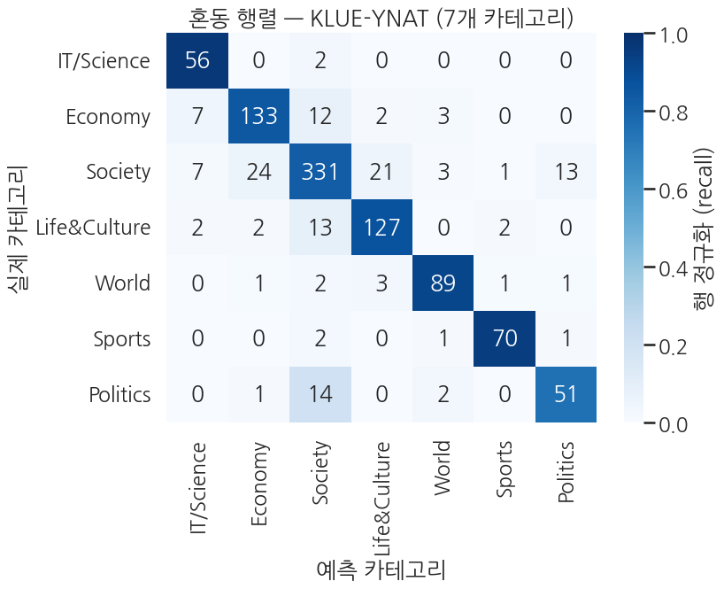
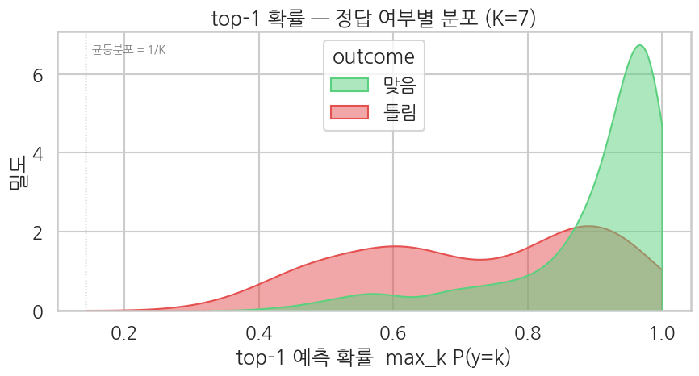

## 평가 — softmax 확률 분포 + 혼동 패턴

Ch 12 의 평가 패턴을 한국어 환경에서 재현. 7클래스라 혼동 행렬이 7×7 — *어떤 카테고리가 어떤 카테고리와 헷갈리는지* 보는 데 핵심.

검증셋 1,000건으로 평가 지표를 한 번에 출력합니다.

```python
eval_metrics = trainer.evaluate()
print("klue/bert-base KLUE-YNAT — evaluation:")
for k, v in eval_metrics.items():
    if k.startswith("eval_") and isinstance(v, float):
        print(f"  {k:>20}: {v:.4f}")
```

**▶ 실행 결과**

```text
Training Loss  Validation Loss  Epoch  Accuracy  Macro Precision  Macro Recall  Macro F1  Auc Ovr
0.289142       0.420051         2      0.857000  0.848727         0.874784      0.860081  0.981029
klue/bert-base KLUE-YNAT — evaluation:
             eval_loss: 0.4201
         eval_accuracy: 0.8570
  eval_macro_precision: 0.8487
     eval_macro_recall: 0.8748
         eval_macro_f1: 0.8601
          eval_auc_ovr: 0.9810
```

**결과 해석**

accuracy 0.857, macro F1 0.860 으로 7클래스 분류치고 견고합니다. accuracy 와 macro F1 이 거의 같다는 건 *클래스 편향이 작다* 는 뜻 — 다수·소수 클래스 모두 고르게 맞혔습니다. OvR AUC 0.981 은 모델이 정답 클래스에 다른 클래스보다 높은 확률을 부여하는 *순위 능력* 이 매우 좋음을 보여줍니다.

예측 logits 를 직접 받아 softmax 확률·예측 클래스·정답 여부를 손으로 계산합니다. top-1 확률(가장 높은 클래스의 확률)을 맞은 샘플과 틀린 샘플로 나눠 평균을 비교하면, 모델 자신감과 정답 여부가 얼마나 연동되는지 가늠할 수 있습니다.

```python
preds_output = trainer.predict(eval_tok)
logits = preds_output.predictions
labels = preds_output.label_ids.astype(int)

exp = np.exp(logits - logits.max(axis=1, keepdims=True))
probs_full = exp / exp.sum(axis=1, keepdims=True)
preds = probs_full.argmax(axis=1)

top1_prob = probs_full.max(axis=1)
correct = (preds == labels)

print(f"logits shape:    {logits.shape}")
print(f"top-1 prob range: [{top1_prob.min():.4f}, {top1_prob.max():.4f}]")
print(f"top-1 prob mean: correct={top1_prob[correct].mean():.4f}, wrong={top1_prob[~correct].mean():.4f}")
```

**▶ 실행 결과**

```text
logits shape:    (1000, 7)
top-1 prob range: [0.3392, 0.9919]
top-1 prob mean: correct=0.8970, wrong=0.7244
```

**결과 해석**

맞은 샘플의 평균 top-1 확률(0.897)이 틀린 샘플(0.724)보다 확실히 높아, 모델 자신감이 정답 여부를 어느 정도 반영합니다. 다만 틀린 샘플 평균도 0.72 로 꽤 높아 *자신 있게 틀리는* 케이스가 존재함을 시사하며, 이는 뒤의 KDE·샘플 해석에서 확인됩니다.

카테고리별 precision/recall/F1 을 표로 출력해 어느 클래스가 강하고 약한지 한눈에 봅니다.

```python
# 클래스별 분류 리포트
print(classification_report(
    labels, preds,
    target_names=LABEL_NAMES_EN,
    digits=4, zero_division=0,
))
```

**▶ 실행 결과**

```text
              precision    recall  f1-score   support

  IT/Science     0.7778    0.9655    0.8615        58
     Economy     0.8261    0.8471    0.8365       157
     Society     0.8803    0.8275    0.8531       400
Life&Culture     0.8301    0.8699    0.8495       146
       World     0.9082    0.9175    0.9128        97
      Sports     0.9459    0.9459    0.9459        74
    Politics     0.7727    0.7500    0.7612        68

    accuracy                         0.8570      1000
   macro avg     0.8487    0.8748    0.8601      1000
weighted avg     0.8588    0.8570    0.8569      1000
```

**결과 해석**

Sports(F1 0.946)·World(0.913) 가 가장 강하고, Politics(0.761)·Economy(0.836) 가 상대적으로 약합니다 — 정치는 표본이 68건으로 가장 적은 축에 속해 recall(0.750)이 흔들리기 쉽고, 애매한 헤드라인이 표본이 많은 카테고리 쪽으로 새는 영향도 받습니다 (위 해석 가이드 참조). IT/Science 는 recall 0.966 으로 잘 잡지만 precision 0.778 로, *IT가 아닌 글을 IT로 오인* 하는 경우가 더 있음을 보여줍니다.

### 5-1. 혼동 행렬 — 어디서 헷갈리는가

행은 정답 카테고리, 열은 예측. 색은 *행 정규화 (recall)*, 숫자는 *원본 카운트*. 대각선이 진할수록 그 카테고리 재현율이 좋음.

7×7 혼동 행렬을 그립니다. 색은 행 정규화(recall), 숫자는 원본 카운트라, 대각선이 진할수록 그 카테고리를 잘 맞힌 것이고 비대각 셀이 *어떤 카테고리끼리 헷갈리는지* 알려줍니다.

```python
sns.set_theme(style="white", context="talk", font="NanumGothic", rc={"axes.unicode_minus": False})
cm = confusion_matrix(labels, preds, labels=list(range(len(LABEL_NAMES))))
cm_norm = cm / cm.sum(axis=1, keepdims=True)

fig, ax = plt.subplots(figsize=(8.5, 7))
sns.heatmap(
    cm_norm, annot=cm, fmt="d",
    cmap="Blues", vmin=0, vmax=1,
    xticklabels=LABEL_NAMES_EN,
    yticklabels=LABEL_NAMES_EN,
    cbar_kws={"label": "행 정규화 (recall)"}, ax=ax,
)
ax.set_xlabel("예측 카테고리")
ax.set_ylabel("실제 카테고리")
ax.set_title("혼동 행렬 — KLUE-YNAT (7개 카테고리)")
plt.tight_layout()
plt.show()
```

**▶ 실행 결과**



**해석 가이드**

- **대각선 셀** = 그 카테고리의 재현율. 표본이 많은 카테고리일수록 안정적이고, 표본이 적은 카테고리는 흔들립니다 — 위 행렬을 클래스별 support 와 함께 보세요.
- **오답 패턴**:
  - **다수 클래스로 쏠림** — eval 에서 *사회* 가 가장 큰 비중을 차지해, 애매한 헤드라인이 *사회* 로 흘러가거나 *사회* 가 다른 카테고리로 새는 쌍이 오답의 대부분입니다. 위 행렬에서 오답 상위 쌍을 확인해 보세요.
  - **의미가 가까운 경계** — 생활문화 ↔ 사회처럼 일상·문화 보도와 사회 이슈는 헤드라인 한 줄로는 사람도 헷갈립니다.
  - **비대칭 혼동** — 한 방향으로만 새는 쌍도 있습니다 (기업·산업 뉴스가 양쪽에 걸치지만 학습된 시그널 단어가 한쪽에 쏠린 경우). FAQ Q2 참고.
- **먼 클래스 혼동** (스포츠 ↔ 정치 등) 이 자주 보이면 라벨 노이즈나 학습 부족 신호.

### 5-2. Top-1 확률 분포 — 모델 자신감 진단

K=7 에선 *어느 한 클래스에 압도적 자신* 있는 경우 vs *2-3 후보 사이에서 갈등* 하는 경우가 나뉩니다. correct/wrong 으로 갈라 그려 calibration 확인.

top-1 확률 분포를 정답/오답으로 나눠 KDE 로 겹쳐 그립니다. K=7 이라 균등분포 기준선(1/7 ≈ 0.143)도 함께 표시해, 모델이 *압도적으로 확신* 하는 영역과 *판단을 못 하는* 영역을 구분합니다.

```python
sns.set_theme(style="whitegrid", context="talk", font="NanumGothic", rc={"axes.unicode_minus": False})
df_top = pd.DataFrame({
    "top1_prob": top1_prob,
    "outcome":   np.where(correct, "맞음", "틀림"),
})

fig, ax = plt.subplots(figsize=(9, 5))
sns.kdeplot(
    data=df_top, x="top1_prob", hue="outcome",
    fill=True, common_norm=False, alpha=0.5,
    palette={"맞음": "#5BD17F", "틀림": "#E55050"},
    clip=(1/7, 1.0), ax=ax,
)
ax.axvline(1/7, color="black", lw=1.0, ls=":", alpha=0.5)
ax.text(1/7, ax.get_ylim()[1]*0.95, "  균등분포 = 1/K", va="top", fontsize=10, alpha=0.6)
ax.set_title("top-1 확률 — 정답 여부별 분포 (K=7)")
ax.set_xlabel("top-1 예측 확률  max_k P(y=k)")
ax.set_ylabel("밀도")
plt.tight_layout()
plt.show()
```

**▶ 실행 결과**



**해석**

- 잘 학습된 모델은 *correct* 곡선이 1.0 가까이 몰리고, *wrong* 은 그보다 낮은 쪽에 분산됩니다. 위 출력에서도 correct 평균이 wrong 평균보다 뚜렷이 높습니다.
- correct/wrong 둘 다 1.0 근처에 압축돼 있으면 *over-confident* — 틀린 답에도 자신만만한 위험 신호. K 가 클수록 (7클래스) 이런 경향이 더 잘 드러남. 이 챕터에도 *자신있게 틀린* 샘플이 있습니다 — §5-3 에서 실제 헤드라인으로 확인합니다.
- *random baseline* 인 1/K = 0.143 근처 봉우리가 보이면 모델이 *판단 자체를 못 하는* 샘플 — 학습 데이터 부족 또는 헤드라인이 너무 짧은 경우.

### 5-3. 샘플 단위 해석 — 실제 헤드라인이 어떻게 분류되나

가장 자신있는 샘플 / 망설이는 샘플 / 자신있게 틀린 샘플 세 종류를 골라 직접 읽어 봅니다. 헤드라인 한 줄 만으로 모델이 어떤 카테고리 신호를 잡는지 감각.

세 종류의 대표 샘플 — 가장 확신한 것, 가장 망설인 것(확률이 2/K 근처), 가장 확신하며 틀린 것 — 을 골라 헤드라인 원문과 top-3 분포를 직접 읽습니다. 모델이 어떤 신호로 분류하고 어디서 무너지는지 감각을 잡는 단계입니다.

```python
texts = list(eval_full["text"])

idx_top    = int(np.argmax(top1_prob))
idx_unc    = int(np.argmin(np.abs(top1_prob - 1/len(LABEL_NAMES) * 2)))   # 1/7 의 2배 근처 (거의 모름)
wrong_mask = ~correct
idx_wrong  = int(np.argmax(top1_prob * wrong_mask)) if wrong_mask.any() else -1

samples = [
    ("most confident overall", idx_top),
    ("most uncertain (~2/K)", idx_unc),
    ("most confident WRONG",   idx_wrong),
]

for label_str, idx in samples:
    if idx < 0:
        continue
    print("=" * 78)
    print(f"sample #{idx}  ({label_str})")
    print("=" * 78)
    print(f"text:        {texts[idx]}")
    print(f"true label:  {labels[idx]}  ({LABEL_NAMES[labels[idx]]})")
    print(f"prediction:  {preds[idx]}  ({LABEL_NAMES[preds[idx]]})  match: {'✓' if correct[idx] else '✗'}")
    print(f"top-1 prob:  {top1_prob[idx]:.4f}")
    # top-3 클래스 모두 보기
    top3 = np.argsort(probs_full[idx])[::-1][:3]
    print(f"top-3 distribution:")
    for k in top3:
        print(f"  {LABEL_NAMES[k]:>8}: {probs_full[idx, k]:.4f}")
    print()
```

**▶ 실행 결과**

```text
==============================================================================
sample #348  (most confident overall)
==============================================================================
text:        朴대통령 양자·다자 추가 대북제재…北도발시 응분 대가
true label:  6  (정치)
prediction:  6  (정치)  match: ✓
top-1 prob:  0.9919
top-3 distribution:
        정치: 0.9919
        세계: 0.0024
        사회: 0.0021

==============================================================================
sample #161  (most uncertain (~2/K))
==============================================================================
text:        인문사회 분야 유망 연구자 지원한다…총 120억원 규모
true label:  2  (사회)
prediction:  0  (IT과학)  match: ✗
top-1 prob:  0.3392
top-3 distribution:
      IT과학: 0.3392
        사회: 0.3125
        경제: 0.2953

==============================================================================
sample #57  (most confident WRONG)
==============================================================================
text:        朴대통령 스캐퍼로티 연합사령관에 보국훈장 통일장 수여
true label:  4  (세계)
prediction:  6  (정치)  match: ✗
top-1 prob:  0.9902
top-3 distribution:
        정치: 0.9902
        사회: 0.0043
        세계: 0.0025
```

**결과 해석**

가장 확신한 샘플(#131, "美 시리아 북동부…미군 잔류")은 *세계*에 0.99 를 몰아주며 명확히 맞혔습니다. 망설인 샘플(#929, 수능 등급컷)은 생활문화 0.29 vs 사회 0.28 로 거의 동률이라 *사회*(정답)를 근소하게 놓쳤는데, 헤드라인 자체가 두 카테고리에 걸친 경계 사례입니다. 가장 위험한 건 #57 — 박대통령이 연합사령관에게 훈장 수여라는 헤드라인을 *정치*로 0.99 확신하며 틀렸습니다(정답 세계). 인물·훈장 신호가 강해 자신 있게 오답을 낸, 라벨 경계가 모호한 전형적 사례입니다.

**관찰 포인트**

- *가장 자신있는* 샘플은 보통 카테고리 *시그널 단어* 가 명확 (예: "주가" → 경제, "월드컵" → 스포츠).
- *망설이는 샘플* 의 top-3 분포를 보면 모델이 *어느 카테고리 사이에서 갈팡질팡* 하는지 보임. 정치/경제/사회 셋이 비슷한 확률이면 헤드라인 자체가 다중 카테고리에 걸침.
- *자신있게 틀린* 샘플은 보통 *반어*, *비유*, *카테고리 간 경계 사례* — 학습 데이터에 비슷한 패턴이 없었거나 라벨 자체가 모호. 이걸 보면 "모델이 *바보* 라서 틀린 게 아니라 *데이터가 어렵다* " 는 감각 잡힘.
