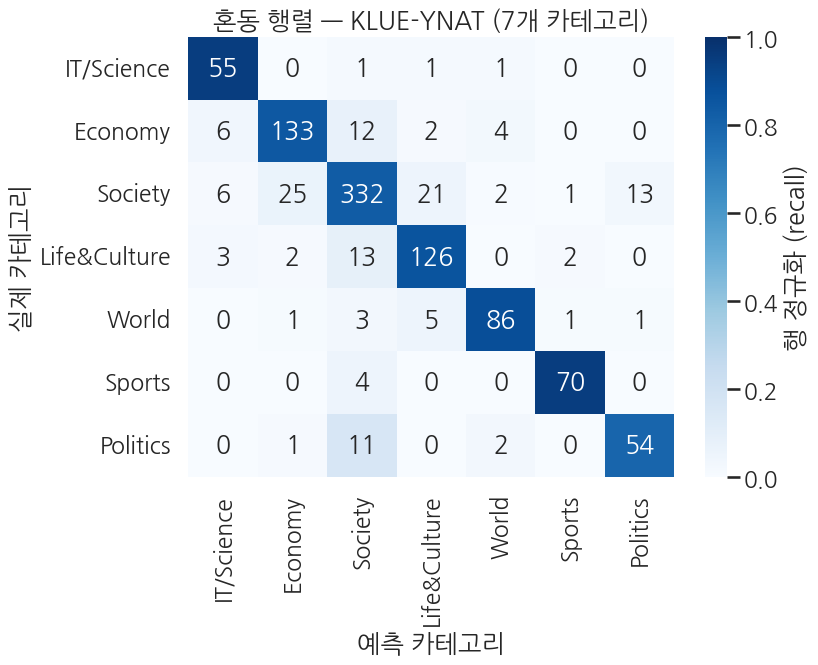
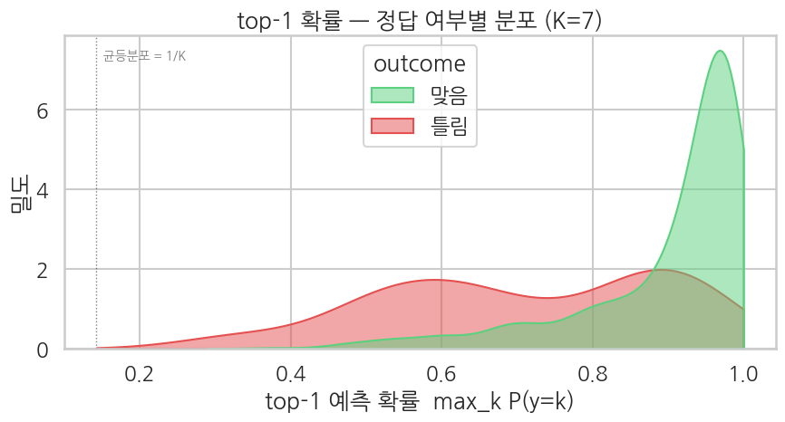

> ▶ **[Google Colab에서 이 장 실습 열기](https://colab.research.google.com/github/yoon-gu/neuqes-101/blob/master/16_ko_multiclass/16_ko_multiclass.ipynb)** — 브라우저에서 바로 실행해 볼 수 있습니다.

## 환경 준비

```python
!pip install -q transformers datasets
```

```python
import warnings
warnings.filterwarnings("ignore")

import numpy as np
import pandas as pd
import matplotlib.pyplot as plt
import seaborn as sns
import torch
from datasets import load_dataset
from transformers import (
    AutoTokenizer, AutoModelForSequenceClassification,
    Trainer, TrainingArguments,
)
from sklearn.metrics import (
    accuracy_score, precision_recall_fscore_support,
    classification_report, roc_auc_score, confusion_matrix,
)

plt.rcParams["axes.unicode_minus"] = False

print(f"PyTorch:        {torch.__version__}")
print(f"CUDA available: {torch.cuda.is_available()}")
if torch.cuda.is_available():
    print(f"GPU:             {torch.cuda.get_device_name(0)}")
else:
    print("Warning: CPU runtime — training will be very slow. Switch to T4 recommended.")
```

**▶ 실행 결과**

```text
PyTorch:        2.11.0+cu128
CUDA available: True
GPU:             Tesla T4
```

```python
!nvidia-smi
```

**▶ 실행 결과**

```text
Wed Jun 17 21:47:31 2026       
+-----------------------------------------------------------------------------------------+
| NVIDIA-SMI 580.82.07              Driver Version: 580.82.07      CUDA Version: 13.0     |
+-----------------------------------------+------------------------+----------------------+
| GPU  Name                 Persistence-M | Bus-Id          Disp.A | Volatile Uncorr. ECC |
| Fan  Temp   Perf          Pwr:Usage/Cap |           Memory-Usage | GPU-Util  Compute M. |
|                                         |                        |               MIG M. |
|=========================================+========================+======================|
|   0  Tesla T4                       Off |   00000000:00:04.0 Off |                    0 |
| N/A   45C    P8             11W /   70W |       3MiB /  15360MiB |      0%      Default |
|                                         |                        |                  N/A |
+-----------------------------------------+------------------------+----------------------+

+-----------------------------------------------------------------------------------------+
| Processes:                                                                              |
|  GPU   GI   CI              PID   Type   Process name                        GPU Memory |
|        ID   ID                                                               Usage      |
|=========================================================================================|
|  No running processes found                                                             |
+-----------------------------------------------------------------------------------------+
```

```python
ds = load_dataset("klue/klue", "ynat")
print(f"splits: {list(ds.keys())}")
print(f"sizes: {[(k, len(v)) for k, v in ds.items()]}")
print(f"label names: {ds['train'].features['label'].names}")

# 클래스 분포
import collections
cnt = collections.Counter(ds["train"]["label"])
LABEL_NAMES = ds["train"].features["label"].names   # KLUE-YNAT 원본 (한국어)
# 출력·플롯은 영문으로 (matplotlib 한글 폰트 깨짐·조판 문제 방지)
_KO2EN = {"IT과학": "IT/Science", "경제": "Economy", "사회": "Society",
          "생활문화": "Life&Culture", "세계": "World", "스포츠": "Sports", "정치": "Politics"}
LABEL_NAMES_EN = [_KO2EN.get(n, n) for n in LABEL_NAMES]

print(f"\nClass distribution (train):")
for k in range(len(LABEL_NAMES_EN)):
    n = cnt[k]
    print(f"  {LABEL_NAMES_EN[k]:>13}  (label {k}): {n:>5}  ({n / len(ds['train']):.1%})")

print(f"\nfirst 3 samples:")
for ex in ds["train"].select(range(3)):
    print(f"  label={ex['label']} ({LABEL_NAMES_EN[ex['label']]:>13})  title={ex['title']!r}")
```

**▶ 실행 결과**

```text
splits: ['train', 'validation']
sizes: [('train', 45678), ('validation', 9107)]
label names: ['IT과학', '경제', '사회', '생활문화', '세계', '스포츠', '정치']
Class distribution (train):
     IT/Science  (label 0):  5235  (11.5%)
        Economy  (label 1):  6118  (13.4%)
        Society  (label 2):  5133  (11.2%)
   Life&Culture  (label 3):  5751  (12.6%)
          World  (label 4):  8320  (18.2%)
         Sports  (label 5):  7742  (16.9%)
       Politics  (label 6):  7379  (16.2%)

first 3 samples:
  label=3 ( Life&Culture)  title='유튜브 내달 2일까지 크리에이터 지원 공간 운영'
  label=3 ( Life&Culture)  title='어버이날 맑다가 흐려져…남부지방 옅은 황사'
  label=2 (      Society)  title='내년부터 국가RD 평가 때 논문건수는 반영 않는다'
```

**결과 해석**

KLUE-YNAT 뉴스 제목을 7개 카테고리로 나누는 multi-class 과제이며, World(18.2%)와 IT/Science(11.5%) 사이의 분포 차이가 크지 않아 클래스 불균형은 완만한 편입니다. 영어 multi-class(Ch 12)와 같은 구조를 한국어 데이터로 다시 푸는 자리입니다.

```python
# T4 30분 룰: 5K train / 1K eval (KLUE 의 validation split 에서 sample)
SEED = 42
train_full = ds["train"].shuffle(seed=SEED).select(range(5000))
eval_full  = ds["validation"].shuffle(seed=SEED).select(range(1000))

# title 컬럼명을 transformers 표준 'text' 로 통일
train_full = train_full.rename_column("title", "text")
eval_full  = eval_full.rename_column("title", "text")

print(f"sampled train: {len(train_full)}")
print(f"sampled eval:  {len(eval_full)}")

# 토큰 길이 분포 미리 보기
tokenizer = AutoTokenizer.from_pretrained("klue/bert-base")
sample_lens = [len(tokenizer.encode(t)) for t in train_full["text"][:200]]
print(f"\nToken length (sample 200): mean={np.mean(sample_lens):.1f}, median={np.median(sample_lens):.0f}, max={max(sample_lens)}")
```

**▶ 실행 결과**

```text
sampled train: 5000
sampled eval:  1000
Token length (sample 200): mean=15.8, median=16, max=27
```

**결과 해석**

뉴스 제목이 짧아 토큰 길이 중앙값이 16, 최대 27에 그치므로 `max_length=128`은 사실상 모든 문장을 자르지 않고 담아냅니다. klue/bert-base의 한국어 WordPiece가 짧은 제목도 효율적으로 쪼개고 있습니다.

```python
def tokenize_fn(batch):
    out = tokenizer(batch["text"], truncation=True, max_length=128)
    out["labels"] = [int(l) for l in batch["label"]]
    return out

train_tok = train_full.map(tokenize_fn, batched=True).remove_columns(
    [c for c in train_full.column_names if c not in ("input_ids", "attention_mask", "token_type_ids", "labels")]
)
eval_tok  = eval_full.map(tokenize_fn,  batched=True).remove_columns(
    [c for c in eval_full.column_names if c not in ("input_ids", "attention_mask", "token_type_ids", "labels")]
)

print(train_tok)
print(f"\nFirst sample label: {train_tok[0]['labels']}  (int 0-6)")
```

**▶ 실행 결과**

```text
Dataset({
    features: ['input_ids', 'token_type_ids', 'attention_mask', 'labels'],
    num_rows: 5000
})

First sample label: 3  (int 0-6)
```

```python
model = AutoModelForSequenceClassification.from_pretrained(
    "klue/bert-base",
    num_labels=len(LABEL_NAMES),
    problem_type="single_label_classification",
    id2label={i: name for i, name in enumerate(LABEL_NAMES_EN)},
    label2id={name: i for i, name in enumerate(LABEL_NAMES_EN)},
)

def param_summary(m):
    total     = sum(p.numel() for p in m.parameters())
    trainable = sum(p.numel() for p in m.parameters() if p.requires_grad)
    return total, trainable

total, trainable = param_summary(model)
print(f"Parameters:           {total:>13,}  ({total/1e6:.1f} M)")
print(f"Trainable parameters: {trainable:>13,}  ({trainable/total:.1%})")
print(f"Classifier:           {model.classifier}")
print(f"id2label:             {model.config.id2label}")
```

**▶ 실행 결과**

```text
[transformers] BertForSequenceClassification LOAD REPORT from: klue/bert-base
Key                                        | Status     | 
-------------------------------------------+------------+-
cls.predictions.transform.LayerNorm.weight | UNEXPECTED | 
cls.predictions.transform.dense.bias       | UNEXPECTED | 
cls.predictions.transform.LayerNorm.bias   | UNEXPECTED | 
cls.predictions.transform.dense.weight     | UNEXPECTED | 
cls.predictions.bias                       | UNEXPECTED | 
cls.seq_relationship.weight                | UNEXPECTED | 
cls.seq_relationship.bias                  | UNEXPECTED | 
classifier.weight                          | MISSING    | 
classifier.bias                            | MISSING    | 

Notes:
- UNEXPECTED:	can be ignored when loading from different task/architecture; not ok if you expect identical arch.
- MISSING:	those params were newly initialized because missing from the checkpoint. Consider training on your downstream task.
Parameters:             110,622,727  (110.6 M)
Trainable parameters:   110,622,727  (100.0%)
Classifier:           Linear(in_features=768, out_features=7, bias=True)
id2label:             {0: 'IT/Science', 1: 'Economy', 2: 'Society', 3: 'Life&Culture', 4: 'World', 5: 'Sports', 6: 'Politics'}
```

```python
!nvidia-smi
```

**▶ 실행 결과**

```text
Wed Jun 17 21:47:56 2026       
+-----------------------------------------------------------------------------------------+
| NVIDIA-SMI 580.82.07              Driver Version: 580.82.07      CUDA Version: 13.0     |
+-----------------------------------------+------------------------+----------------------+
| GPU  Name                 Persistence-M | Bus-Id          Disp.A | Volatile Uncorr. ECC |
| Fan  Temp   Perf          Pwr:Usage/Cap |           Memory-Usage | GPU-Util  Compute M. |
|                                         |                        |               MIG M. |
|=========================================+========================+======================|
|   0  Tesla T4                       Off |   00000000:00:04.0 Off |                    0 |
| N/A   44C    P8             15W /   70W |       3MiB /  15360MiB |      0%      Default |
|                                         |                        |                  N/A |
+-----------------------------------------+------------------------+----------------------+

+-----------------------------------------------------------------------------------------+
| Processes:                                                                              |
|  GPU   GI   CI              PID   Type   Process name                        GPU Memory |
|        ID   ID                                                               Usage      |
|=========================================================================================|
|  No running processes found                                                             |
+-----------------------------------------------------------------------------------------+
```

```python
def compute_metrics(eval_pred):
    logits, labels = eval_pred
    # 안정 softmax (K=7)
    exp = np.exp(logits - logits.max(axis=1, keepdims=True))
    probs_full = exp / exp.sum(axis=1, keepdims=True)
    preds = probs_full.argmax(axis=1)

    p, r, f1, _ = precision_recall_fscore_support(labels, preds, average="macro", zero_division=0)
    out = {
        "accuracy":        float(accuracy_score(labels, preds)),
        "macro_precision": float(p),
        "macro_recall":    float(r),
        "macro_f1":        float(f1),
    }
    # multi-class AUC: One-vs-Rest
    try:
        out["auc_ovr"] = float(roc_auc_score(labels, probs_full, multi_class="ovr"))
    except ValueError:
        out["auc_ovr"] = float("nan")
    return out
```

```python
training_args = TrainingArguments(
    output_dir="./ch16_output",
    num_train_epochs=2,
    per_device_train_batch_size=16,
    per_device_eval_batch_size=32,
    learning_rate=2e-5,
    fp16=True,
    eval_strategy="epoch",
    logging_steps=50,
    save_strategy="no",
    report_to="none",
    seed=SEED,
)

trainer = Trainer(
    model=model,
    args=training_args,
    train_dataset=train_tok,
    eval_dataset=eval_tok,
    processing_class=tokenizer,
    compute_metrics=compute_metrics,
)

train_result = trainer.train()
print(f"\nTraining done — mean train loss: {train_result.training_loss:.4f}")
print(f"random baseline loss (K=7): {np.log(7):.4f}")
```

**▶ 실행 결과**

```text
<IPython.core.display.HTML object>
Training done — mean train loss: 0.4690
random baseline loss (K=7): 1.9459
```

**결과 해석**

학습 후 평균 train loss 0.4690은 7개 클래스를 찍어 맞히는 무작위 기준선 loss($\ln 7 \approx 1.9459$)보다 한참 낮아, 모델이 카테고리 신호를 확실히 잡았음을 보여줍니다.

```python
!nvidia-smi
```

**▶ 실행 결과**

```text
Wed Jun 17 21:48:38 2026       
+-----------------------------------------------------------------------------------------+
| NVIDIA-SMI 580.82.07              Driver Version: 580.82.07      CUDA Version: 13.0     |
+-----------------------------------------+------------------------+----------------------+
| GPU  Name                 Persistence-M | Bus-Id          Disp.A | Volatile Uncorr. ECC |
| Fan  Temp   Perf          Pwr:Usage/Cap |           Memory-Usage | GPU-Util  Compute M. |
|                                         |                        |               MIG M. |
|=========================================+========================+======================|
|   0  Tesla T4                       Off |   00000000:00:04.0 Off |                    0 |
| N/A   61C    P0             38W /   70W |    2195MiB /  15360MiB |     61%      Default |
|                                         |                        |                  N/A |
+-----------------------------------------+------------------------+----------------------+

+-----------------------------------------------------------------------------------------+
| Processes:                                                                              |
|  GPU   GI   CI              PID   Type   Process name                        GPU Memory |
|        ID   ID                                                               Usage      |
|=========================================================================================|
|    0   N/A  N/A            1401      C   /usr/bin/python3                       2192MiB |
+-----------------------------------------------------------------------------------------+
```

```python
eval_metrics = trainer.evaluate()
print("klue/bert-base KLUE-YNAT — evaluation:")
for k, v in eval_metrics.items():
    if k.startswith("eval_") and isinstance(v, float):
        print(f"  {k:>20}: {v:.4f}")
```

**▶ 실행 결과**

```text
<IPython.core.display.HTML object>
<IPython.core.display.HTML object>
klue/bert-base KLUE-YNAT — evaluation:
             eval_loss: 0.4221
         eval_accuracy: 0.8550
  eval_macro_precision: 0.8492
     eval_macro_recall: 0.8705
         eval_macro_f1: 0.8584
          eval_auc_ovr: 0.9821
```

**결과 해석**

검증 정확도 85.5%, macro F1 0.8584로 7개 클래스 전반에 고르게 잘 맞히며, One-vs-Rest AUC 0.9821은 클래스별 확률 순위까지 거의 완벽하게 분리해냄을 뜻합니다.

```python
preds_output = trainer.predict(eval_tok)
logits = preds_output.predictions
labels = preds_output.label_ids.astype(int)

exp = np.exp(logits - logits.max(axis=1, keepdims=True))
probs_full = exp / exp.sum(axis=1, keepdims=True)
preds = probs_full.argmax(axis=1)

top1_prob = probs_full.max(axis=1)
correct = (preds == labels)

print(f"logits shape:    {logits.shape}")
print(f"top-1 prob range: [{top1_prob.min():.4f}, {top1_prob.max():.4f}]")
print(f"top-1 prob mean: correct={top1_prob[correct].mean():.4f}, wrong={top1_prob[~correct].mean():.4f}")
```

**▶ 실행 결과**

```text
<IPython.core.display.HTML object>
logits shape:    (1000, 7)
top-1 prob range: [0.3380, 0.9917]
top-1 prob mean: correct=0.9051, wrong=0.7234
```

**결과 해석**

맞힌 예측의 평균 top-1 확률(0.9051)이 틀린 예측(0.7234)보다 뚜렷이 높아, 모델의 확신도가 정답 여부를 어느 정도 가늠하는 신호가 됩니다. 다만 틀린 경우의 평균이 0.72에 이르는 것으로 보아 자신 있게 틀리는 사례도 섞여 있습니다.

```python
# 클래스별 분류 리포트
print(classification_report(
    labels, preds,
    target_names=LABEL_NAMES_EN,
    digits=4, zero_division=0,
))
```

**▶ 실행 결과**

```text
              precision    recall  f1-score   support

  IT/Science     0.7857    0.9483    0.8594        58
     Economy     0.7929    0.8535    0.8221       157
     Society     0.8880    0.8325    0.8594       400
Life&Culture     0.8212    0.8493    0.8350       146
       World     0.9062    0.8969    0.9016        97
      Sports     0.9444    0.9189    0.9315        74
    Politics     0.8060    0.7941    0.8000        68

    accuracy                         0.8550      1000
   macro avg     0.8492    0.8705    0.8584      1000
weighted avg     0.8578    0.8550    0.8553      1000
```

**결과 해석**

Sports(F1 0.9315)와 World(0.9016)처럼 어휘가 뚜렷한 카테고리는 점수가 가장 높고, Politics(0.8000)와 Economy(0.8221)가 상대적으로 약한데 이는 정치·경제·사회 뉴스가 표현을 공유해 서로 헷갈리기 때문입니다.

```python
sns.set_theme(style="white", context="talk")
cm = confusion_matrix(labels, preds, labels=list(range(len(LABEL_NAMES))))
cm_norm = cm / cm.sum(axis=1, keepdims=True)

fig, ax = plt.subplots(figsize=(8.5, 7))
sns.heatmap(
    cm_norm, annot=cm, fmt="d",
    cmap="Blues", vmin=0, vmax=1,
    xticklabels=LABEL_NAMES_EN,
    yticklabels=LABEL_NAMES_EN,
    cbar_kws={"label": "row-normalized (recall)"}, ax=ax,
)
ax.set_xlabel("Predicted category")
ax.set_ylabel("Actual category")
ax.set_title("Confusion Matrix — KLUE-YNAT (7 categories)")
plt.tight_layout()
plt.show()
```

**▶ 실행 결과**



**결과 해석**

대각선이 진하게 채워져 대부분의 예측이 정답 카테고리에 모였고, 가장 큰 오분류는 Society로 새어 나가는 흐름입니다. Economy(31건), Politics(11건), Life&Culture(17건)가 모두 Society로 흡수되는데, 사회 뉴스가 다른 주제의 어휘를 폭넓게 포함하는 한국어 뉴스 특성을 보여줍니다.

```python
sns.set_theme(style="whitegrid", context="talk")
df_top = pd.DataFrame({
    "top1_prob": top1_prob,
    "outcome":   np.where(correct, "correct", "wrong"),
})

fig, ax = plt.subplots(figsize=(9, 5))
sns.kdeplot(
    data=df_top, x="top1_prob", hue="outcome",
    fill=True, common_norm=False, alpha=0.5,
    palette={"correct": "#5BD17F", "wrong": "#E55050"},
    clip=(1/7, 1.0), ax=ax,
)
ax.axvline(1/7, color="black", lw=1.0, ls=":", alpha=0.5)
ax.text(1/7, ax.get_ylim()[1]*0.95, "  uniform = 1/K", va="top", fontsize=10, alpha=0.6)
ax.set_title("Top-1 probability — distribution split by correctness (K=7)")
ax.set_xlabel("top-1 predicted probability  max_k P(y=k)")
ax.set_ylabel("Density")
plt.tight_layout()
plt.show()
```

**▶ 실행 결과**



**결과 해석**

맞힌 예측(초록)은 top-1 확률이 1.0 근처에 뾰족하게 몰린 반면, 틀린 예측(빨강)은 0.4-0.9에 넓게 퍼져 확신이 약한 구간에 오답이 집중됩니다. 두 분포가 0.85 이상에서 겹치는 부분이 자신 있게 틀린 사례에 해당합니다.

```python
texts = list(eval_full["text"])

idx_top    = int(np.argmax(top1_prob))
idx_unc    = int(np.argmin(np.abs(top1_prob - 1/len(LABEL_NAMES) * 2)))   # 1/7 의 2배 근처 (거의 모름)
wrong_mask = ~correct
idx_wrong  = int(np.argmax(top1_prob * wrong_mask)) if wrong_mask.any() else -1

samples = [
    ("most confident overall", idx_top),
    ("most uncertain (~2/K)", idx_unc),
    ("most confident WRONG",   idx_wrong),
]

for label_str, idx in samples:
    if idx < 0:
        continue
    print("=" * 78)
    print(f"sample #{idx}  ({label_str})")
    print("=" * 78)
    print(f"text:        {texts[idx]}")
    print(f"true label:  {labels[idx]}  ({LABEL_NAMES[labels[idx]]})")
    print(f"prediction:  {preds[idx]}  ({LABEL_NAMES[preds[idx]]})  match: {'✓' if correct[idx] else '✗'}")
    print(f"top-1 prob:  {top1_prob[idx]:.4f}")
    # top-3 클래스 모두 보기
    top3 = np.argsort(probs_full[idx])[::-1][:3]
    print(f"top-3 distribution:")
    for k in top3:
        print(f"  {LABEL_NAMES[k]:>8}: {probs_full[idx, k]:.4f}")
    print()
```

**▶ 실행 결과**

```text
==============================================================================
sample #550  (most confident overall)
==============================================================================
text:        홍준표 北 핵실험장 폐쇄쇼…민주 레드라인 넘어종합
true label:  6  (정치)
prediction:  6  (정치)  match: ✓
top-1 prob:  0.9917
top-3 distribution:
        정치: 0.9917
        사회: 0.0027
        세계: 0.0018

==============================================================================
sample #851  (most uncertain (~2/K))
==============================================================================
text:        르노삼성자동차 QM3 비비드 매니아 이벤트 진행
true label:  2  (사회)
prediction:  1  (경제)  match: ✗
top-1 prob:  0.3380
top-3 distribution:
        경제: 0.3380
      IT과학: 0.3238
      생활문화: 0.1564

==============================================================================
sample #57  (most confident WRONG)
==============================================================================
text:        朴대통령 스캐퍼로티 연합사령관에 보국훈장 통일장 수여
true label:  4  (세계)
prediction:  6  (정치)  match: ✗
top-1 prob:  0.9880
top-3 distribution:
        정치: 0.9880
        사회: 0.0049
        세계: 0.0025
```

**결과 해석**

가장 확신한 예측은 0.9917로 정치 뉴스를 정확히 맞혔고, 가장 헷갈린 예측은 르노삼성 이벤트 제목을 두고 경제(0.3380)와 IT과학(0.3238)이 팽팽해 정답(사회)을 놓쳤습니다. 마지막 사례는 대통령·연합사령관 표현 때문에 세계 뉴스를 0.988의 확신으로 정치라 단정한, 자신 있게 틀린 전형입니다.
