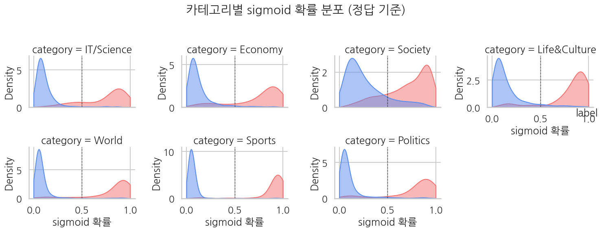
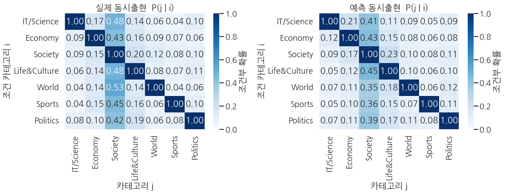

> ▶ **[Google Colab에서 이 장 실습 열기](https://colab.research.google.com/github/yoon-gu/neuqes-101/blob/master/17_ko_multilabel/17_ko_multilabel.ipynb)** — 브라우저에서 바로 실행해 볼 수 있습니다.

## 환경 준비

```python
!pip install -q transformers datasets
```

```python
import warnings
warnings.filterwarnings("ignore")

import numpy as np
import pandas as pd
import matplotlib.pyplot as plt
import seaborn as sns
import torch
from datasets import Dataset, load_dataset
from transformers import (
    AutoTokenizer, AutoModelForSequenceClassification,
    Trainer, TrainingArguments,
)
from sklearn.metrics import (
    precision_recall_fscore_support, classification_report,
    roc_auc_score, hamming_loss,
)

# matplotlib 한글 폰트 (Colab — NanumGothic). plot 의 한국어가 □ 로 깨지지 않게.
import matplotlib.pyplot as plt, matplotlib.font_manager as fm, subprocess, os
_fp = "/usr/share/fonts/truetype/nanum/NanumGothic.ttf"
if not os.path.exists(_fp):
    subprocess.run("apt-get -qq -y install fonts-nanum", shell=True)
fm.fontManager.addfont(_fp)
plt.rcParams["font.family"] = "NanumGothic"
plt.rcParams["axes.unicode_minus"] = False

# device 자동감지 — Colab(T4) 은 CUDA, 로컬 Mac 은 MPS, 그 외 CPU
if torch.cuda.is_available():
    DEVICE = "cuda"
elif getattr(torch.backends, "mps", None) is not None and torch.backends.mps.is_available():
    DEVICE = "mps"
else:
    DEVICE = "cpu"

print(f"PyTorch:        {torch.__version__}")
print(f"CUDA available: {torch.cuda.is_available()}")
print(f"Device:         {DEVICE}")
if DEVICE == "cuda":
    print(f"GPU:             {torch.cuda.get_device_name(0)}")
elif DEVICE == "cpu":
    print("Warning: CPU runtime — training will be very slow. Switch to T4 recommended.")
```

**▶ 실행 결과**

```text
PyTorch:        2.11.0+cu128
CUDA available: True
Device:         cuda
GPU:             Tesla T4
```

```python
!nvidia-smi
```

**▶ 실행 결과**

```text
Mon Jun 22 04:00:43 2026       
+-----------------------------------------------------------------------------------------+
| NVIDIA-SMI 580.82.07              Driver Version: 580.82.07      CUDA Version: 13.0     |
+-----------------------------------------+------------------------+----------------------+
| GPU  Name                 Persistence-M | Bus-Id          Disp.A | Volatile Uncorr. ECC |
| Fan  Temp   Perf          Pwr:Usage/Cap |           Memory-Usage | GPU-Util  Compute M. |
|                                         |                        |               MIG M. |
|=========================================+========================+======================|
|   0  Tesla T4                       Off |   00000000:00:04.0 Off |                    0 |
| N/A   39C    P8             10W /   70W |       3MiB /  15360MiB |      0%      Default |
|                                         |                        |                  N/A |
+-----------------------------------------+------------------------+----------------------+

+-----------------------------------------------------------------------------------------+
| Processes:                                                                              |
|  GPU   GI   CI              PID   Type   Process name                        GPU Memory |
|        ID   ID                                                               Usage      |
|=========================================================================================|
|  No running processes found                                                             |
+-----------------------------------------------------------------------------------------+
```

KLUE-YNAT 를 내려받아 7개 카테고리 이름을 확인합니다. 출력·플롯이 한글 폰트 문제로 깨지지 않도록 카테고리명을 영문으로 매핑해 두고, `title` 컬럼을 `transformers` 표준인 `text` 로 바꿉니다.

```python
ds = load_dataset("klue/klue", "ynat")
print(f"splits: {list(ds.keys())}")
print(f"sizes: {[(k, len(v)) for k, v in ds.items()]}")

LABEL_NAMES = ds["train"].features["label"].names   # KLUE-YNAT 원본 (한국어)
# 출력·플롯은 영문으로 (matplotlib 한글 폰트 깨짐·조판 문제 방지)
_KO2EN = {"IT과학": "IT/Science", "경제": "Economy", "사회": "Society", "생활문화": "Life&Culture", "세계": "World", "스포츠": "Sports", "정치": "Politics"}
LABEL_NAMES_EN = [_KO2EN.get(n, n) for n in LABEL_NAMES]
K = len(LABEL_NAMES)
print(f"label names ({K}): {LABEL_NAMES}")

# title 컬럼명을 'text' 로 통일 (transformers 표준)
ds = ds.rename_column("title", "text")
print(f"\nfirst 2 raw samples:")
for ex in ds["train"].select(range(2)):
    print(f"  label={ex['label']} ({LABEL_NAMES_EN[ex['label']]:>8})  text={ex['text']!r}")
```

**▶ 실행 결과**

```text
splits: ['train', 'validation']
sizes: [('train', 45678), ('validation', 9107)]
label names (7): ['IT과학', '경제', '사회', '생활문화', '세계', '스포츠', '정치']

first 2 raw samples:
  label=3 (Life&Culture)  text='유튜브 내달 2일까지 크리에이터 지원 공간 운영'
  label=3 (Life&Culture)  text='어버이날 맑다가 흐려져…남부지방 옅은 황사'
```

single-label 데이터에서 두 샘플씩 짝지어 multi-label 을 합성합니다. 텍스트는 `[SEP]` 로 잇고, 두 카테고리 위치를 1 로 채운 multi-hot 벡터를 라벨로 만듭니다. seed 를 고정해 train/eval 합성이 재현 가능합니다.

```python
SEED = 42
N_TRAIN = 5000
N_EVAL  = 1000


def make_multilabel(source_split, n_samples, seed):
    '''single-label split 에서 두 샘플씩 결합해 multi-label 데이터셋 합성.

    - 2*n_samples 개 인덱스를 섞어 앞/뒤 절반을 짝으로 묶음
    - 텍스트는 " [SEP] " 로 이어붙임
    - multi-hot 라벨은 두 카테고리 위치를 1 로 (같은 카테고리면 1개만)
    '''
    rng = np.random.default_rng(seed)
    n_src = len(source_split)
    # 짝지을 인덱스 2*n_samples 개 (중복 허용 — 소스가 부족할 때 대비)
    # numpy.int64 로 datasets 컬럼을 인덱싱하면 TypeError → python int 로 캐스팅
    idx = rng.integers(0, n_src, size=2 * n_samples).tolist()
    idx_a, idx_b = idx[:n_samples], idx[n_samples:]

    # 컬럼을 미리 파이썬 list 로 (반복 인덱싱이 빠르고 타입 안전)
    src_text = list(source_split["text"])
    src_label = list(source_split["label"])

    texts, multi_hots, active_counts = [], [], []
    for a, b in zip(idx_a, idx_b):
        ca, cb = int(src_label[a]), int(src_label[b])
        combined = f"{src_text[a]} [SEP] {src_text[b]}"
        mh = [0.0] * K
        mh[ca] = 1.0
        mh[cb] = 1.0   # ca == cb 면 같은 위치 → 활성 1개
        texts.append(combined)
        multi_hots.append(mh)
        active_counts.append(int(sum(mh)))
    return Dataset.from_dict({
        "text": texts,
        "multi_hot": multi_hots,
        "n_active": active_counts,
    })


train_full = make_multilabel(ds["train"], N_TRAIN, seed=SEED)
eval_full  = make_multilabel(ds["validation"], N_EVAL, seed=SEED + 1)

print(f"synthetic train: {len(train_full)}")
print(f"synthetic eval:  {len(eval_full)}")
print(f"\nFirst synthetic sample:")
print(f"  text:      {train_full[0]['text']}")
print(f"  multi_hot: {train_full[0]['multi_hot']}")
active0 = [LABEL_NAMES_EN[k] for k in range(K) if train_full[0]['multi_hot'][k] > 0]
print(f"  active categories: {active0}")
```

**▶ 실행 결과**

```text
synthetic train: 5000
synthetic eval:  1000

First synthetic sample:
  text:      신간 언어와 탱크를 응시하며·자본주의 리얼리즘 [SEP] 우리은행 주택금융공사와 도시재생 발굴·지원 업무협약
  multi_hot: [0.0, 1.0, 0.0, 1.0, 0.0, 0.0, 0.0]
  active categories: ['Economy', 'Life&Culture']
```

합성 데이터가 어떤 분포인지 확인합니다. 카테고리별 활성률과 샘플당 활성 라벨 개수를 집계해, 두 헤드라인 결합이 의도대로 됐는지 점검합니다.

```python
# 카테고리별 활성률 + 활성 라벨 개수 분포
Y_train = np.array(train_full["multi_hot"])

print("Per-category activation rate (train):")
for k in range(K):
    rate = Y_train[:, k].mean()
    print(f"  {LABEL_NAMES_EN[k]:>9} (label {k}): {rate:.1%}  ({int(Y_train[:, k].sum())} / {len(Y_train)})")

n_active = Y_train.sum(axis=1)
print(f"\nMean active labels per sample: {n_active.mean():.2f}  (expected ~1.86: two draws, occasional collision)")
print(f"Active label distribution (train):")
for n in range(K + 1):
    cnt = int((n_active == n).sum())
    if cnt:
        print(f"  {n} labels active: {cnt} samples ({cnt/len(Y_train):.1%})")
```

**▶ 실행 결과**

```text
Per-category activation rate (train):
  IT/Science (label 0): 22.0%  (1100 / 5000)
    Economy (label 1): 25.2%  (1260 / 5000)
    Society (label 2): 21.8%  (1089 / 5000)
  Life&Culture (label 3): 23.3%  (1165 / 5000)
      World (label 4): 32.8%  (1638 / 5000)
     Sports (label 5): 31.0%  (1549 / 5000)
   Politics (label 6): 29.3%  (1467 / 5000)

Mean active labels per sample: 1.85  (expected ~1.86: two draws, occasional collision)
Active label distribution (train):
  1 labels active: 732 samples (14.6%)
  2 labels active: 4268 samples (85.4%)
```

**결과 해석**

샘플당 평균 활성 라벨이 1.85 개로, 두 헤드라인을 뽑을 때 14.6% 는 우연히 같은 카테고리끼리 만나 라벨이 1개로 합쳐졌습니다 (나머지 85.4% 가 2개 활성). 카테고리별 활성률은 22~33% 범위로, KLUE-YNAT 원본 분포를 따라 World·Sports·Politics 가 다소 많지만 극단적 불균형은 아닙니다 — 이 덕분에 뒤에서 micro 와 macro F1 이 비슷하게 나옵니다.

`klue/bert-base` 토크나이저로 결합 헤드라인을 토큰화합니다. 핵심은 마지막 줄 — multi-hot 벡터를 길이 7 의 **float** 리스트로 만들어 `labels` 에 넣는 부분입니다. 이 float 형식이 `BCEWithLogitsLoss` 가 받는 라벨 형태입니다.

```python
tokenizer = AutoTokenizer.from_pretrained("klue/bert-base")

# 결합 헤드라인 토큰 길이 미리 보기
sample_lens = [len(tokenizer.encode(t)) for t in train_full["text"][:200]]
print(f"Token length (combined, sample 200): "
      f"mean={np.mean(sample_lens):.1f}, median={np.median(sample_lens):.0f}, max={max(sample_lens)}")


def tokenize_fn(batch):
    out = tokenizer(batch["text"], truncation=True, max_length=128)
    # multi-hot 7차원 float 벡터 (BCEWithLogitsLoss 가 받는 형식)
    out["labels"] = [list(map(float, mh)) for mh in batch["multi_hot"]]
    return out

keep = ("input_ids", "attention_mask", "token_type_ids", "labels")
train_tok = train_full.map(tokenize_fn, batched=True).remove_columns(
    [c for c in train_full.column_names if c not in keep]
)
eval_tok = eval_full.map(tokenize_fn, batched=True).remove_columns(
    [c for c in eval_full.column_names if c not in keep]
)

print(train_tok)
print(f"\nFirst sample label: {train_tok[0]['labels']}  (length-7 multi-hot float vector)")
```

**▶ 실행 결과**

```text
Token length (combined, sample 200): mean=30.0, median=30, max=41
Dataset({
    features: ['input_ids', 'token_type_ids', 'attention_mask', 'labels'],
    num_rows: 5000
})

First sample label: [0.0, 1.0, 0.0, 1.0, 0.0, 0.0, 0.0]  (length-7 multi-hot float vector)
```

모델을 로드할 때 `num_labels=7` 은 Ch 16 과 그대로지만 `problem_type="multi_label_classification"` 한 줄을 더해 loss 자동 매핑을 BCE per-label 로 전환합니다. 분류 헤드 `Linear(768, 7)` 와 파라미터 수는 Ch 16 과 완전히 동일합니다.

```python
model = AutoModelForSequenceClassification.from_pretrained(
    "klue/bert-base",
    num_labels=K,
    problem_type="multi_label_classification",   # ← BCEWithLogitsLoss per-label 자동 매핑
    id2label={i: name for i, name in enumerate(LABEL_NAMES_EN)},
    label2id={name: i for i, name in enumerate(LABEL_NAMES_EN)},
)

def param_summary(m):
    total     = sum(p.numel() for p in m.parameters())
    trainable = sum(p.numel() for p in m.parameters() if p.requires_grad)
    return total, trainable

total, trainable = param_summary(model)
print(f"Parameters:           {total:>13,}  ({total/1e6:.1f} M)")
print(f"Trainable parameters: {trainable:>13,}  ({trainable/total:.1%})")
print(f"Classifier:           {model.classifier}")
print(f"problem_type:         {model.config.problem_type}")
print(f"id2label:             {model.config.id2label}")
```

**▶ 실행 결과**

```text
[transformers] BertForSequenceClassification LOAD REPORT from: klue/bert-base
Key                                        | Status     | 
-------------------------------------------+------------+-
cls.predictions.transform.dense.bias       | UNEXPECTED | 
cls.predictions.transform.LayerNorm.weight | UNEXPECTED | 
cls.seq_relationship.weight                | UNEXPECTED | 
cls.predictions.bias                       | UNEXPECTED | 
cls.seq_relationship.bias                  | UNEXPECTED | 
cls.predictions.transform.LayerNorm.bias   | UNEXPECTED | 
cls.predictions.transform.dense.weight     | UNEXPECTED | 
classifier.bias                            | MISSING    | 
classifier.weight                          | MISSING    | 

Notes:
- UNEXPECTED:	can be ignored when loading from different task/architecture; not ok if you expect identical arch.
- MISSING:	those params were newly initialized because missing from the checkpoint. Consider training on your downstream task.
Parameters:             110,622,727  (110.6 M)
Trainable parameters:   110,622,727  (100.0%)
Classifier:           Linear(in_features=768, out_features=7, bias=True)
problem_type:         multi_label_classification
id2label:             {0: 'IT/Science', 1: 'Economy', 2: 'Society', 3: 'Life&Culture', 4: 'World', 5: 'Sports', 6: 'Politics'}
```

```python
!nvidia-smi
```

**▶ 실행 결과**

```text
Mon Jun 22 04:01:09 2026       
+-----------------------------------------------------------------------------------------+
| NVIDIA-SMI 580.82.07              Driver Version: 580.82.07      CUDA Version: 13.0     |
+-----------------------------------------+------------------------+----------------------+
| GPU  Name                 Persistence-M | Bus-Id          Disp.A | Volatile Uncorr. ECC |
| Fan  Temp   Perf          Pwr:Usage/Cap |           Memory-Usage | GPU-Util  Compute M. |
|                                         |                        |               MIG M. |
|=========================================+========================+======================|
|   0  Tesla T4                       Off |   00000000:00:04.0 Off |                    0 |
| N/A   38C    P8              9W /   70W |       3MiB /  15360MiB |      0%      Default |
|                                         |                        |                  N/A |
+-----------------------------------------+------------------------+----------------------+

+-----------------------------------------------------------------------------------------+
| Processes:                                                                              |
|  GPU   GI   CI              PID   Type   Process name                        GPU Memory |
|        ID   ID                                                               Usage      |
|=========================================================================================|
|  No running processes found                                                             |
+-----------------------------------------------------------------------------------------+
```

multi-label 평가 함수입니다. logit 에 라벨별 sigmoid 를 적용하고 0.5 임계값으로 multi-hot 예측을 만든 뒤, hamming loss 와 micro/macro F1, macro AUC 를 계산합니다. micro 는 라벨을 합산하고 macro 는 라벨별 점수를 평균한다는 점이 핵심입니다.

```python
def compute_metrics(eval_pred):
    logits, labels = eval_pred                      # logits: (N, K), labels: (N, K) float
    probs = 1.0 / (1.0 + np.exp(-logits))           # per-label sigmoid
    preds = (probs >= 0.5).astype(int)              # threshold 0.5

    out = {}
    # Hamming loss — 전체 라벨 위치 중 틀린 비율 (낮을수록 좋음)
    out["hamming_loss"] = float(hamming_loss(labels, preds))

    # Micro F1 — 전체 라벨을 한꺼번에 (TP/FP/FN 합산 후 F1)
    p_mi, r_mi, f1_mi, _ = precision_recall_fscore_support(
        labels, preds, average="micro", zero_division=0,
    )
    out["micro_f1"] = float(f1_mi)
    out["micro_precision"] = float(p_mi)
    out["micro_recall"]    = float(r_mi)

    # Macro F1 — 라벨별 F1 을 평균 (각 라벨에 동일 가중치)
    p_ma, r_ma, f1_ma, _ = precision_recall_fscore_support(
        labels, preds, average="macro", zero_division=0,
    )
    out["macro_f1"] = float(f1_ma)
    out["macro_precision"] = float(p_ma)
    out["macro_recall"]    = float(r_ma)

    # Per-label AUC 의 macro 평균
    try:
        out["macro_auc"] = float(roc_auc_score(labels, probs, average="macro"))
    except ValueError:
        out["macro_auc"] = float("nan")
    return out
```

Ch 16 과 동일한 hyperparams (learning rate, batch size, epoch, seed) 로 `Trainer` 를 구성해 학습합니다. T4 에서 `fp16=True` 로 약 10분 안에 끝납니다.

```python
training_args = TrainingArguments(
    output_dir="./ch17_output",
    num_train_epochs=2,
    per_device_train_batch_size=16,
    per_device_eval_batch_size=32,
    learning_rate=2e-5,
    fp16=True,
    eval_strategy="epoch",
    logging_steps=50,
    save_strategy="no",
    report_to="none",
    seed=SEED,
)

trainer = Trainer(
    model=model,
    args=training_args,
    train_dataset=train_tok,
    eval_dataset=eval_tok,
    processing_class=tokenizer,
    compute_metrics=compute_metrics,
)

train_result = trainer.train()
print(f"\nTraining done — mean train loss: {train_result.training_loss:.4f}")
```

**▶ 실행 결과**

```text
<IPython.core.display.HTML object>
Training done — mean train loss: 0.2660
```

```python
!nvidia-smi
```

**▶ 실행 결과**

```text
Mon Jun 22 04:01:52 2026       
+-----------------------------------------------------------------------------------------+
| NVIDIA-SMI 580.82.07              Driver Version: 580.82.07      CUDA Version: 13.0     |
+-----------------------------------------+------------------------+----------------------+
| GPU  Name                 Persistence-M | Bus-Id          Disp.A | Volatile Uncorr. ECC |
| Fan  Temp   Perf          Pwr:Usage/Cap |           Memory-Usage | GPU-Util  Compute M. |
|                                         |                        |               MIG M. |
|=========================================+========================+======================|
|   0  Tesla T4                       Off |   00000000:00:04.0 Off |                    0 |
| N/A   63C    P0             70W /   70W |    2209MiB /  15360MiB |     75%      Default |
|                                         |                        |                  N/A |
+-----------------------------------------+------------------------+----------------------+

+-----------------------------------------------------------------------------------------+
| Processes:                                                                              |
|  GPU   GI   CI              PID   Type   Process name                        GPU Memory |
|        ID   ID                                                               Usage      |
|=========================================================================================|
|    0   N/A  N/A             692      C   /usr/bin/python3                       2206MiB |
+-----------------------------------------------------------------------------------------+
```

학습된 모델을 eval set 으로 평가해 multi-label 지표를 한꺼번에 확인합니다.

```python
eval_metrics = trainer.evaluate()
print("klue/bert-base KLUE-YNAT multi-label — evaluation:")
for k, v in eval_metrics.items():
    if k.startswith("eval_") and isinstance(v, float):
        print(f"  {k:>22}: {v:.4f}")
```

**▶ 실행 결과**

```text
<IPython.core.display.HTML object>
<IPython.core.display.HTML object>
klue/bert-base KLUE-YNAT multi-label — evaluation:
               eval_loss: 0.2166
       eval_hamming_loss: 0.0741
           eval_micro_f1: 0.8500
    eval_micro_precision: 0.8638
       eval_micro_recall: 0.8367
           eval_macro_f1: 0.8487
    eval_macro_precision: 0.8445
       eval_macro_recall: 0.8556
          eval_macro_auc: 0.9623
            eval_runtime: 0.6885
  eval_samples_per_second: 1452.5010
   eval_steps_per_second: 46.4800
```

**결과 해석**

micro F1 0.8500 과 macro F1 0.8487 이 거의 같습니다 — 카테고리별 활성률이 크게 치우치지 않아 다수·소수 카테고리 사이 격차가 작다는 뜻입니다. macro AUC 0.9623 은 임계값과 무관한 순위 분리력으로, 라벨별 sigmoid 가 양성·음성을 잘 갈라놓고 있음을 보여줍니다. hamming loss 0.0741 은 전체 라벨 위치 중 약 7%만 틀렸다는 의미입니다.

eval set 전체에 대해 예측을 뽑아 카테고리별 sigmoid 확률 범위와 실제·예측 활성률을 비교합니다. 이후 시각화·해부에서 쓸 `probs`, `preds`, `labels` 를 여기서 준비합니다.

```python
# logits → per-label sigmoid → multi-hot 예측
preds_output = trainer.predict(eval_tok)
logits = preds_output.predictions                   # (N, 7)
labels = preds_output.label_ids.astype(int)         # (N, 7) multi-hot
probs  = 1.0 / (1.0 + np.exp(-logits))              # (N, 7) per-label prob
preds  = (probs >= 0.5).astype(int)                 # (N, 7) multi-hot prediction

print(f"logits shape: {logits.shape}")
print(f"prob ranges per category:")
for k in range(K):
    print(f"  {LABEL_NAMES_EN[k]:>9}: [{probs[:, k].min():.4f}, {probs[:, k].max():.4f}]  "
          f"true rate={labels[:, k].mean():.1%}, pred rate={preds[:, k].mean():.1%}")
```

**▶ 실행 결과**

```text
<IPython.core.display.HTML object>
logits shape: (1000, 7)
prob ranges per category:
  IT/Science: [0.0113, 0.9731]  true rate=12.6%, pred rate=13.1%
    Economy: [0.0165, 0.9889]  true rate=23.8%, pred rate=22.9%
    Society: [0.0430, 0.9647]  true rate=68.4%, pred rate=58.7%
  Life&Culture: [0.0148, 0.9864]  true rate=27.8%, pred rate=29.9%
      World: [0.0109, 0.9884]  true rate=15.9%, pred rate=16.2%
     Sports: [0.0103, 0.9898]  true rate=11.7%, pred rate=12.5%
   Politics: [0.0093, 0.9884]  true rate=15.6%, pred rate=17.0%
```

**결과 해석**

대부분 카테고리에서 예측 활성률이 실제 활성률과 거의 일치합니다 — 라벨별 sigmoid 가 0.5 임계값 기준으로 잘 보정돼 있다는 신호입니다. 다만 활성률이 가장 높은 Society 는 실제 68.4% 대비 예측 58.7% 로 과소 활성하는 경향이 보이는데, 결합 헤드라인에서 사회 신호가 다른 주제와 섞여 0.5 를 넘기지 못한 경우가 그만큼 있다는 뜻입니다. 모든 카테고리에서 확률이 0.01~0.99 양극단까지 퍼져 있어 모델이 자신 있게 판정하고 있습니다.

카테고리별 precision·recall·F1 을 한 표로 봅니다. 어느 카테고리가 잘 분리되고 어느 카테고리가 헷갈리는지 진단할 수 있습니다.

```python
# Per-category classification report
print(classification_report(
    labels, preds,
    target_names=LABEL_NAMES_EN,
    digits=4, zero_division=0,
))
```

**▶ 실행 결과**

```text
              precision    recall  f1-score   support

  IT/Science     0.7634    0.7937    0.7782       126
     Economy     0.8428    0.8109    0.8266       238
     Society     0.9267    0.7953    0.8560       684
Life&Culture     0.8261    0.8885    0.8562       278
       World     0.8704    0.8868    0.8785       159
      Sports     0.8880    0.9487    0.9174       117
    Politics     0.7941    0.8654    0.8282       156

   micro avg     0.8638    0.8367    0.8500      1758
   macro avg     0.8445    0.8556    0.8487      1758
weighted avg     0.8683    0.8367    0.8501      1758
 samples avg     0.8820    0.8535    0.8485      1758
```

**결과 해석**

카테고리별로 보면 Sports 가 F1 0.9174 로 가장 깨끗하게 분리되고, IT/Science 가 0.7782 로 가장 낮습니다. 활성률이 높은 Society 는 precision 0.9267 로 매우 정확하지만 recall 0.7953 으로 놓치는 양성이 많아 — 위 prob range 에서 본 과소 활성과 일치합니다. 반대로 Life&Culture 와 Politics 는 recall 이 precision 보다 높아 약간 과활성 쪽입니다. 카테고리마다 precision·recall 균형이 다르다는 점이 카테고리별 임계값 조정의 동기가 됩니다.

7개 카테고리 각각의 sigmoid 확률 분포를 정답(label=0/1) 기준으로 facet KDE 로 그립니다. 카테고리마다 두 곡선이 얼마나 깨끗이 갈라지는지가 학습 난이도를 보여줍니다.

```python
sns.set_theme(style="whitegrid", context="talk", font="NanumGothic", rc={"axes.unicode_minus": False})

# Long-form DataFrame
records = []
for k in range(K):
    name = LABEL_NAMES_EN[k]
    for i in range(len(probs)):
        records.append({"category": name, "prob": probs[i, k], "label": int(labels[i, k])})
df_long = pd.DataFrame(records)

g = sns.FacetGrid(
    df_long, col="category", col_wrap=4, height=2.8, aspect=1.3,
    sharex=True, sharey=False,
)
g.map_dataframe(
    sns.kdeplot, x="prob", hue="label",
    fill=True, common_norm=False, alpha=0.5,
    palette={0: "#5B8DEF", 1: "#F47272"}, clip=(0, 1),
)
for ax in g.axes.flat:
    ax.axvline(0.5, color="black", lw=1.0, ls="--", alpha=0.6)
    ax.set_xlabel("sigmoid 확률")
g.add_legend(title="label")
g.fig.suptitle("카테고리별 sigmoid 확률 분포 (정답 기준)", y=1.03)
plt.tight_layout()
plt.show()
```

**▶ 실행 결과**



카테고리 쌍이 같이 활성되는 패턴을, 실제 합성 라벨과 모델 예측 양쪽에서 조건부 확률 P(j|i) 히트맵으로 비교합니다. 무작위 결합이라 실제 행렬은 대략 균등해야 합니다.

```python
def cooccurrence_matrix(Y):
    # Y: (N, K) multi-hot. Returns (K, K) where M[i, j] = P(label_j=1 | label_i=1).
    Y = Y.astype(float)
    K_ = Y.shape[1]
    M = np.zeros((K_, K_))
    for i in range(K_):
        row_i = Y[:, i]
        n_i = row_i.sum()
        if n_i == 0:
            continue
        for j in range(K_):
            M[i, j] = (row_i * Y[:, j]).sum() / n_i
    return M

cooc_true = cooccurrence_matrix(labels)
cooc_pred = cooccurrence_matrix(preds)

fig, axes = plt.subplots(1, 2, figsize=(15, 6))
for ax, M, title in [
    (axes[0], cooc_true, "실제 동시출현  P(j | i)"),
    (axes[1], cooc_pred, "예측 동시출현  P(j | i)"),
]:
    sns.heatmap(
        M, annot=True, fmt=".2f", cmap="Blues", vmin=0, vmax=1,
        xticklabels=LABEL_NAMES_EN, yticklabels=LABEL_NAMES_EN,
        cbar_kws={"label": "조건부 확률"}, ax=ax,
    )
    ax.set_title(title)
    ax.set_xlabel("카테고리 j")
    ax.set_ylabel("조건 카테고리 i")
plt.tight_layout()
plt.show()
```

**▶ 실행 결과**


