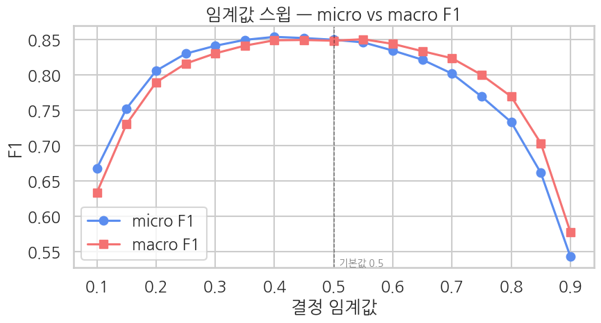

결합 헤드라인을 *문장 단위* 로 읽어보며 모델이 *두 주제를 모두 잡는지* 확인합니다. 평가 metric 은 전체 평균이라 *한 샘플에서 무슨 일이 일어나는지* 직관이 안 옵니다.

```python
texts = list(eval_full["text"])
n_active_eval = labels.sum(axis=1)

# 활성 2개 샘플 중: 모델이 둘 다 맞춘 것 / 하나만 맞춘 것 / 자신있게 틀린 것
two_active = np.where(n_active_eval == 2)[0]
hit_both, partial, conf_wrong = -1, -1, -1
best_conf_wrong = -1.0
for idx in two_active:
    match = (preds[idx] == labels[idx]).all()
    n_correct = int((preds[idx] * labels[idx]).sum())   # 맞춘 양성 개수
    if match and hit_both < 0:
        hit_both = idx
    if (not match) and n_correct == 1 and partial < 0:
        partial = idx
    # 음성(정답 0)인데 높은 확률로 활성 = 자신있게 틀림
    wrong_pos = ((labels[idx] == 0) & (preds[idx] == 1))
    if wrong_pos.any():
        max_wrong = float(probs[idx][wrong_pos].max())
        if max_wrong > best_conf_wrong:
            best_conf_wrong, conf_wrong = max_wrong, idx

samples = [
    ("both categories correct", hit_both),
    ("partially correct (1 of 2)", partial),
    ("confidently wrong activation", conf_wrong),
]

for label_kind, idx in samples:
    if idx < 0:
        continue
    print("=" * 80)
    print(f"sample #{idx}  ({label_kind})")
    print("=" * 80)
    print(f"text: {texts[idx]}")
    print()
    print(f"{'category':>10}  {'true':>5}  {'prob':>8}  {'pred(>=0.5)':>12}  match")
    for k in range(K):
        t = int(labels[idx, k])
        p = float(probs[idx, k])
        pr = int(preds[idx, k])
        ok = "O" if t == pr else "X"
        print(f"  {LABEL_NAMES_EN[k]:>9}  {t:>5}  {p:>8.4f}  {pr:>12}    {ok}")
    true_active = [LABEL_NAMES_EN[k] for k in range(K) if labels[idx, k]]
    pred_active = [LABEL_NAMES_EN[k] for k in range(K) if preds[idx, k]]
    print()
    print(f"  true:      {true_active}")
    print(f"  predicted: {pred_active}")
    print()
```

**▶ 실행 결과**

```text
================================================================================
sample #0  (both categories correct)
================================================================================
text: 새 현대미술 양식 꽃피운 故강국진 개인전 [SEP] 음성군 충북 혁신도시 본성고 2023년 개교 위해 올인

  category   true      prob   pred(>=0.5)  match
  IT/Science      0    0.0778             0    O
    Economy      0    0.0643             0    O
    Society      1    0.6206             1    O
  Life&Culture      1    0.9396             1    O
      World      0    0.0311             0    O
     Sports      0    0.1226             0    O
   Politics      0    0.0603             0    O

  true:      ['Society', 'Life&Culture']
  predicted: ['Society', 'Life&Culture']

================================================================================
sample #21  (partially correct (1 of 2))
================================================================================
text: 흑인 미술가의 녹슨 구리거울은 무엇을 비추나 [SEP] 한국형 원격교육 구축 발언하는 유은혜 부총리

  category   true      prob   pred(>=0.5)  match
  IT/Science      0    0.0906             0    O
    Economy      0    0.0205             0    O
    Society      0    0.4847             0    O
  Life&Culture      1    0.4115             0    X
      World      0    0.1434             0    O
     Sports      0    0.0180             0    O
   Politics      1    0.7287             1    O

  true:      ['Life&Culture', 'Politics']
  predicted: ['Politics']

================================================================================
sample #743  (confidently wrong activation)
================================================================================
text: 넥센 이사회의장으로 허민 영입…현안 해결에 노력 [SEP] 권광석 우리은행장 백척간두 진일보…포스트 코로나 철저 준비

... (출력 11줄 생략) ...
```

**읽는 법**

- **`true` 컬럼** — 합성 시 결합한 두 헤드라인의 카테고리. 보통 두 위치가 1.
- **`prob` 컬럼** — 각 카테고리 sigmoid 확률 (독립). 합이 1 일 필요 없음 — multi-label 의 본질.
- **`both categories correct`** — 모델이 결합 헤드라인 안의 *두 신호를 모두* 분리해 잡은 이상적 케이스.
- **`partially correct`** — 한 주제만 잡고 다른 하나는 놓침. 두 헤드라인 중 *한쪽 신호가 약했거나* 두 카테고리가 서로 헷갈리는 경우.
- **`confidently wrong`** — 정답이 0 인데 높은 확률로 활성. 결합된 두 헤드라인의 단어가 *제3의 카테고리* 신호와 겹친 경우 (예: 경제+세계 헤드라인이 '정치' 신호처럼 보임).

결정 임계값을 0.1 부터 0.9 까지 움직이며 micro·macro F1 이 어떻게 변하는지 스윕합니다. 0.5 가 항상 최적은 아님을 직접 확인하는 실험입니다.

```python
# threshold 를 옮기면 micro/macro F1 이 어떻게 변하나
sns.set_theme(style="whitegrid", context="talk", font="NanumGothic", rc={"axes.unicode_minus": False})

thresholds = np.arange(0.1, 0.91, 0.05)
micro_f1s, macro_f1s = [], []
for th in thresholds:
    preds_th = (probs >= th).astype(int)
    _, _, f1_mi, _ = precision_recall_fscore_support(labels, preds_th, average="micro", zero_division=0)
    _, _, f1_ma, _ = precision_recall_fscore_support(labels, preds_th, average="macro", zero_division=0)
    micro_f1s.append(f1_mi)
    macro_f1s.append(f1_ma)

best_micro_th = float(thresholds[int(np.argmax(micro_f1s))])
best_macro_th = float(thresholds[int(np.argmax(macro_f1s))])

fig, ax = plt.subplots(figsize=(9, 5))
ax.plot(thresholds, micro_f1s, "o-", label="micro F1", color="#5B8DEF")
ax.plot(thresholds, macro_f1s, "s-", label="macro F1", color="#F47272")
ax.axvline(0.5, color="black", lw=1.0, ls="--", alpha=0.5)
ax.text(0.5, ax.get_ylim()[0], "  기본값 0.5", va="bottom", fontsize=10, alpha=0.6)
ax.set_xlabel("결정 임계값")
ax.set_ylabel("F1")
ax.set_title("임계값 스윕 — micro vs macro F1")
ax.legend()
plt.tight_layout()
plt.show()

print(f"best micro F1 threshold: {best_micro_th:.2f}  (F1={max(micro_f1s):.4f})")
print(f"best macro F1 threshold: {best_macro_th:.2f}  (F1={max(macro_f1s):.4f})")
print(f"F1 at default 0.5:        micro={micro_f1s[list(np.round(thresholds,2)).index(0.5)]:.4f}, "
      f"macro={macro_f1s[list(np.round(thresholds,2)).index(0.5)]:.4f}")
```

**▶ 실행 결과**



```text
best micro F1 threshold: 0.40  (F1=0.8542)
best macro F1 threshold: 0.55  (F1=0.8508)
F1 at default 0.5:        micro=0.8500, macro=0.8487
```

**해석** — threshold 0.5 가 *항상* 최적은 아닙니다. 활성률이 낮은 카테고리가 있으면 *낮은 threshold* 가 recall 을 끌어올려 F1 이 더 좋아질 수 있습니다. 운영 단계에선 validation set 에서 *카테고리별로* 최적 threshold 를 찾아 저장해 두고 추론 시 적용 (FAQ Q1).
