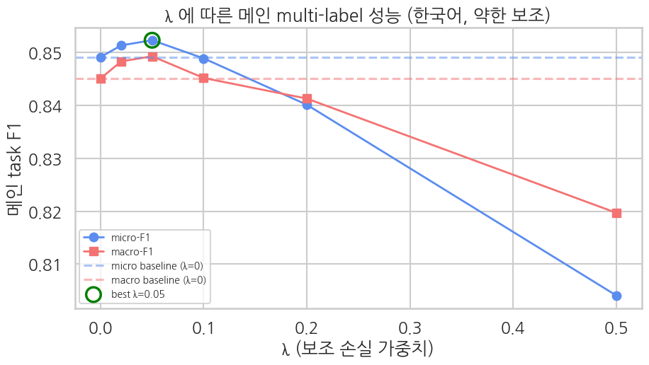

> ▶ **[Google Colab에서 이 부록 열기](https://colab.research.google.com/github/yoon-gu/neuqes-101/blob/master/18_ko_auxiliary/18_ko_auxiliary_lambda_sweep.ipynb)** — 브라우저에서 바로 실행해 볼 수 있습니다.

본편 Ch 18 은 `L = L_main + λ·L_aux` 에서 **λ=0.05** 로 학습해 메인 multi-label 이 λ=0 baseline 을 *소폭* 앞섰습니다(micro-F1 약 0.849 → 약 0.852). 다만 보조(활성 개수 `n_active` 회귀) 자체는 약합니다(R² 약 0.07).

Ch 14(영어, 별점 보조)는 같은 λ 스윕에서 **λ=0.05 sweet spot 에서 보조가 메인을 끌어올렸습니다**. Ch 18 은 보조 task 가 다릅니다 — `n_active` 는 합성 규칙상 거의 항상 2(두 문서 결합)라 **분산이 작아 예측이 쉽고 신호가 약합니다**. 이 부록은 λ 를 0 → 0.5 로 쓸며, 약한 보조가 **어느 λ 에서 메인을 돕고 어디서부터 해치는지** 를 곡선으로 확인합니다 — 본편이 쓰는 λ=0.05 가 그 sweet spot 입니다.

> 비교 공정성: 매 런 같은 seed·같은 초기화. 약 6분 (klue/bert-base 6런).

```python
!pip install -q transformers datasets
```

```python
import warnings; warnings.filterwarnings("ignore")
import numpy as np, pandas as pd
import matplotlib.pyplot as plt, seaborn as sns
import torch, torch.nn as nn, torch.nn.functional as F
from datasets import Dataset, load_dataset
from transformers import AutoTokenizer, AutoModel, Trainer, TrainingArguments, DataCollatorWithPadding
from transformers.modeling_outputs import SequenceClassifierOutput
from sklearn.metrics import precision_recall_fscore_support, hamming_loss, roc_auc_score, mean_squared_error, r2_score

# matplotlib 한글 폰트 (Colab — NanumGothic). plot 의 한국어가 □ 로 깨지지 않게.
import matplotlib.pyplot as plt, matplotlib.font_manager as fm, subprocess, os
_fp = "/usr/share/fonts/truetype/nanum/NanumGothic.ttf"
if not os.path.exists(_fp):
    subprocess.run("apt-get -qq -y install fonts-nanum", shell=True)
fm.fontManager.addfont(_fp)
plt.rcParams["font.family"] = "NanumGothic"
plt.rcParams["axes.unicode_minus"] = False
print(f"PyTorch: {torch.__version__}  CUDA: {torch.cuda.is_available()}")
if torch.cuda.is_available(): print(f"GPU: {torch.cuda.get_device_name(0)}")
```

**▶ 실행 결과**

```text
PyTorch: 2.11.0+cu128  CUDA: True
GPU: Tesla T4
```

## 데이터·모델·Trainer — 본편 Ch 18 과 동일

KLUE-YNAT 두 헤드라인을 결합한 합성 multi-label(7) + 활성 개수 `n_active` 보조. `KoBertMultiTask`(AutoModel 본체 + 메인 헤드 + 보조 헤드) forward 안에서 `L_main + λ·L_aux` 계산.

```python
SEED = 42; N_TRAIN = 5000; N_EVAL = 1000
ds = load_dataset("klue/klue", "ynat").rename_column("title", "text")
K = len(ds["train"].features["label"].names)

def make_multilabel(source_split, n_samples, seed):
    rng = np.random.default_rng(seed); n_src = len(source_split)
    idx = rng.integers(0, n_src, size=2 * n_samples).tolist()
    idx_a, idx_b = idx[:n_samples], idx[n_samples:]
    src_text = list(source_split["text"]); src_label = list(source_split["label"])
    texts, mhs, counts = [], [], []
    for a, b in zip(idx_a, idx_b):
        ca, cb = int(src_label[a]), int(src_label[b])
        mh = [0.0]*K; mh[ca] = 1.0; mh[cb] = 1.0
        texts.append(f"{src_text[a]} [SEP] {src_text[b]}"); mhs.append(mh); counts.append(int(sum(mh)))
    return Dataset.from_dict({"text": texts, "multi_hot": mhs, "n_active": counts})

train_full = make_multilabel(ds["train"], N_TRAIN, seed=SEED)
eval_full  = make_multilabel(ds["validation"], N_EVAL, seed=SEED + 1)
tokenizer = AutoTokenizer.from_pretrained("klue/bert-base")

def tokenize_fn(batch):
    out = tokenizer(batch["text"], truncation=True, max_length=128)
    out["labels"]   = [list(map(float, mh)) for mh in batch["multi_hot"]]
    out["n_active"] = [float(n) for n in batch["n_active"]]
    return out
keep = ("input_ids","attention_mask","token_type_ids","labels","n_active")
train_tok = train_full.map(tokenize_fn, batched=True).remove_columns([c for c in train_full.column_names if c not in keep])
eval_tok  = eval_full.map(tokenize_fn, batched=True).remove_columns([c for c in eval_full.column_names if c not in keep])

# n_active 분포 — 왜 보조가 약한지 (분산이 작음)
import collections
dist = collections.Counter(train_full["n_active"])
print(f"K={K}, train={len(train_tok)}, eval={len(eval_tok)}")
print("n_active 분포(train):", dict(sorted(dist.items())), "→ 거의 2 (두 문서 결합), 분산 작음")
```

**▶ 실행 결과**

```text
ynat/train-00000-of-00001.parquet: downloading bytes:           |  0.00B            
ynat/validation-00000-of-00001.parquet: downloading bytes:           |  0.00B            
K=7, train=5000, eval=1000
n_active 분포(train): {1: 732, 2: 4268} → 거의 2 (두 문서 결합), 분산 작음
```

```python
class AuxCollator:
    def __init__(self, tokenizer): self.base = DataCollatorWithPadding(tokenizer)
    def __call__(self, features):
        n_act = torch.tensor([f.pop("n_active") for f in features], dtype=torch.float)
        batch = self.base(features); batch["labels"] = batch["labels"].float(); batch["n_active"] = n_act
        return batch
collator = AuxCollator(tokenizer)

class KoBertMultiTask(nn.Module):
    def __init__(self, model_name="klue/bert-base", num_labels=7):
        super().__init__()
        self.num_labels = num_labels
        self.bert = AutoModel.from_pretrained(model_name)
        H = self.bert.config.hidden_size
        self.cls_head = nn.Linear(H, num_labels)
        self.count_head = nn.Linear(H, 1)
        self.config = self.bert.config
    def forward(self, input_ids=None, attention_mask=None, token_type_ids=None, labels=None, n_active=None, lambda_aux=0.1):
        kwargs = {"input_ids": input_ids, "attention_mask": attention_mask}
        if token_type_ids is not None: kwargs["token_type_ids"] = token_type_ids
        out = self.bert(**kwargs); cls = out.last_hidden_state[:, 0, :]
        main_logits = self.cls_head(cls); count_pred = self.count_head(cls).squeeze(-1)
        loss = None
        if labels is not None and n_active is not None:
            l_main = F.binary_cross_entropy_with_logits(main_logits, labels.float())
            l_aux  = F.mse_loss(count_pred, n_active.float())
            loss = l_main + lambda_aux * l_aux
        self.last_count_pred = count_pred.detach()
        return SequenceClassifierOutput(loss=loss, logits=main_logits)

def make_model(): return KoBertMultiTask("klue/bert-base", num_labels=K)

class AuxTrainer(Trainer):
    def __init__(self, *args, lambda_aux=0.1, **kwargs):
        super().__init__(*args, **kwargs); self.lambda_aux = lambda_aux
    def compute_loss(self, model, inputs, return_outputs=False, num_items_in_batch=None):
        inputs = {**inputs, "lambda_aux": self.lambda_aux}
        outputs = model(**inputs); loss = outputs.loss
        return (loss, outputs) if return_outputs else loss

def compute_metrics_main(eval_pred):
    logits, labels = eval_pred
    if isinstance(logits, tuple): logits = logits[0]
    probs = 1.0/(1.0+np.exp(-logits)); preds = (probs >= 0.5).astype(int)
    _,_,f1_mi,_ = precision_recall_fscore_support(labels, preds, average="micro", zero_division=0)
    _,_,f1_ma,_ = precision_recall_fscore_support(labels, preds, average="macro", zero_division=0)
    return {"micro_f1": float(f1_mi), "macro_f1": float(f1_ma), "hamming_loss": float(hamming_loss(labels, preds))}

@torch.no_grad()
def aux_predictions(trainer, dataset, batch_size=64):
    trainer.model.eval(); device = trainer.model.bert.device; ap, at = [], []
    for i in range(0, len(dataset), batch_size):
        bf = [dict(dataset[j]) for j in range(i, min(i+batch_size, len(dataset)))]
        b = trainer.data_collator(bf); bod = {k: v.to(device) for k, v in b.items()}
        nat = bod.pop("n_active").cpu().numpy(); bod.pop("labels", None)
        _ = trainer.model(**bod, labels=None, n_active=None)
        ap.extend(trainer.model.last_count_pred.cpu().numpy().tolist()); at.extend(nat.tolist())
    return np.array(ap), np.array(at)
print("setup 완료")
```

**▶ 실행 결과**

```text
setup 완료
```

## λ 스윕

`λ ∈ {0, 0.02, 0.05, 0.1, 0.2, 0.5}` 각각 같은 초기화로 2 epoch 학습 → 메인 micro/macro-F1 + 보조 R² 기록. λ=0.1 은 본편 셋업.

```python
LAMBDAS = [0.0, 0.02, 0.05, 0.1, 0.2, 0.5]
rows = []
for lam in LAMBDAS:
    torch.manual_seed(42); np.random.seed(42)
    model = make_model()
    args = TrainingArguments(output_dir=f"./sweep_{lam}", num_train_epochs=2,
        per_device_train_batch_size=16, per_device_eval_batch_size=32, learning_rate=2e-5,
        fp16=True, eval_strategy="no", logging_steps=200, save_strategy="no",
        report_to="none", seed=42, remove_unused_columns=False)
    tr = AuxTrainer(model=model, args=args, train_dataset=train_tok, eval_dataset=eval_tok,
        data_collator=collator, processing_class=tokenizer, compute_metrics=compute_metrics_main, lambda_aux=lam)
    tr.train()
    mets = tr.evaluate(); ap, at = aux_predictions(tr, eval_tok)
    r2 = float(r2_score(at, ap))
    rows.append({"lambda": lam, "micro_f1": mets["eval_micro_f1"], "macro_f1": mets["eval_macro_f1"],
                 "hamming": mets["eval_hamming_loss"], "aux_r2": r2})
    print(f"λ={lam:<5} micro-F1={mets['eval_micro_f1']:.4f}  macro-F1={mets['eval_macro_f1']:.4f}  aux_R2={r2:+.3f}")
    del model, tr; torch.cuda.empty_cache()
res = pd.DataFrame(rows)
print(); print(res.round(4).to_string(index=False))
```

**▶ 실행 결과**

```text
model.safetensors: downloading bytes:           |  0.00B            
[transformers] BertModel LOAD REPORT from: klue/bert-base
Key                                        | Status     |  | 
-------------------------------------------+------------+--+-
cls.seq_relationship.bias                  | UNEXPECTED |  | 
cls.predictions.bias                       | UNEXPECTED |  | 
cls.predictions.transform.dense.bias       | UNEXPECTED |  | 
cls.seq_relationship.weight                | UNEXPECTED |  | 
cls.predictions.transform.LayerNorm.bias   | UNEXPECTED |  | 
cls.predictions.transform.dense.weight     | UNEXPECTED |  | 
cls.predictions.transform.LayerNorm.weight | UNEXPECTED |  | 

Notes:
- UNEXPECTED:	can be ignored when loading from different task/architecture; not ok if you expect identical arch.
Step  Training Loss
200   0.334212
400   0.193545
600   0.159128
Training Loss  Validation Loss  Step  Micro F1  Macro F1  Hamming Loss  Runtime   Samples Per Second  Steps Per Second
0.159128       0.193365         626   0.849143  0.845101  0.075429      0.719700  1389.475000         44.463000
λ=0.0   micro-F1=0.8491  macro-F1=0.8451  aux_R2=-8.656
[transformers] BertModel LOAD REPORT from: klue/bert-base
Key                                        | Status     |  | 
-------------------------------------------+------------+--+-
cls.seq_relationship.bias                  | UNEXPECTED |  | 
cls.predictions.bias                       | UNEXPECTED |  | 
cls.predictions.transform.dense.bias       | UNEXPECTED |  | 
cls.seq_relationship.weight                | UNEXPECTED |  | 
cls.predictions.transform.LayerNorm.bias   | UNEXPECTED |  | 
cls.predictions.transform.dense.weight     | UNEXPECTED |  | 
cls.predictions.transform.LayerNorm.weight | UNEXPECTED |  | 

Notes:
- UNEXPECTED:	can be ignored when loading from different task/architecture; not ok if you expect identical arch.
Step  Training Loss
200   0.339477
400   0.196293
600   0.161915
Training Loss  Validation Loss  Step  Micro F1  Macro F1  Hamming Loss  Runtime   Samples Per Second  Steps Per Second
0.161915       0.195355         626   0.851355  0.848326  0.074429      0.687100  1455.417000         46.573000
λ=0.02  micro-F1=0.8514  macro-F1=0.8483  aux_R2=+0.034
[transformers] BertModel LOAD REPORT from: klue/bert-base
Key                                        | Status     |  | 
-------------------------------------------+------------+--+-
cls.seq_relationship.bias                  | UNEXPECTED |  | 
cls.predictions.bias                       | UNEXPECTED |  | 
cls.predictions.transform.dense.bias       | UNEXPECTED |  | 
cls.seq_relationship.weight                | UNEXPECTED |  | 
cls.predictions.transform.LayerNorm.bias   | UNEXPECTED |  | 
cls.predictions.transform.dense.weight     | UNEXPECTED |  | 
cls.predictions.transform.LayerNorm.weight | UNEXPECTED |  | 

Notes:
- UNEXPECTED:	can be ignored when loading from different task/architecture; not ok if you expect identical arch.
Step  Training Loss
200   0.351647
400   0.201903
600   0.167037
Training Loss  Validation Loss  Step  Micro F1  Macro F1  Hamming Loss  Runtime   Samples Per Second  Steps Per Second
0.167037       0.200851         626   0.852328  0.849294  0.073857      0.682400  1465.438000         46.894000
λ=0.05  micro-F1=0.8523  macro-F1=0.8493  aux_R2=+0.065
[transformers] BertModel LOAD REPORT from: klue/bert-base
Key                                        | Status     |  | 
-------------------------------------------+------------+--+-
cls.seq_relationship.bias                  | UNEXPECTED |  | 
cls.predictions.bias                       | UNEXPECTED |  | 
cls.predictions.transform.dense.bias       | UNEXPECTED |  | 
cls.seq_relationship.weight                | UNEXPECTED |  | 
cls.predictions.transform.LayerNorm.bias   | UNEXPECTED |  | 
cls.predictions.transform.dense.weight     | UNEXPECTED |  | 
cls.predictions.transform.LayerNorm.weight | UNEXPECTED |  | 

Notes:
- UNEXPECTED:	can be ignored when loading from different task/architecture; not ok if you expect identical arch.
Step  Training Loss
200   0.370784
400   0.210297
600   0.174338
Training Loss  Validation Loss  Step  Micro F1  Macro F1  Hamming Loss  Runtime   Samples Per Second  Steps Per Second
0.174338       0.211882         626   0.848900  0.845193  0.075571      0.678500  1473.796000         47.161000
λ=0.1   micro-F1=0.8489  macro-F1=0.8452  aux_R2=+0.067
[transformers] BertModel LOAD REPORT from: klue/bert-base
Key                                        | Status     |  | 
-------------------------------------------+------------+--+-
cls.seq_relationship.bias                  | UNEXPECTED |  | 
cls.predictions.bias                       | UNEXPECTED |  | 
cls.predictions.transform.dense.bias       | UNEXPECTED |  | 
cls.seq_relationship.weight                | UNEXPECTED |  | 
cls.predictions.transform.LayerNorm.bias   | UNEXPECTED |  | 
cls.predictions.transform.dense.weight     | UNEXPECTED |  | 
cls.predictions.transform.LayerNorm.weight | UNEXPECTED |  | 

Notes:
- UNEXPECTED:	can be ignored when loading from different task/architecture; not ok if you expect identical arch.
Step  Training Loss
200   0.414490
400   0.231085
600   0.191303
Training Loss  Validation Loss  Step  Micro F1  Macro F1  Hamming Loss  Runtime   Samples Per Second  Steps Per Second
0.191303       0.237532         626   0.840138  0.841301  0.079429      0.694700  1439.427000         46.062000
λ=0.2   micro-F1=0.8401  macro-F1=0.8413  aux_R2=+0.073
[transformers] BertModel LOAD REPORT from: klue/bert-base
Key                                        | Status     |  | 
-------------------------------------------+------------+--+-
cls.seq_relationship.bias                  | UNEXPECTED |  | 
cls.predictions.bias                       | UNEXPECTED |  | 
cls.predictions.transform.dense.bias       | UNEXPECTED |  | 
cls.seq_relationship.weight                | UNEXPECTED |  | 
cls.predictions.transform.LayerNorm.bias   | UNEXPECTED |  | 
cls.predictions.transform.dense.weight     | UNEXPECTED |  | 
cls.predictions.transform.LayerNorm.weight | UNEXPECTED |  | 

Notes:
- UNEXPECTED:	can be ignored when loading from different task/architecture; not ok if you expect identical arch.
Step  Training Loss
200   0.530018
400   0.291899
600   0.241862
Training Loss  Validation Loss  Step  Micro F1  Macro F1  Hamming Loss  Runtime   Samples Per Second  Steps Per Second
0.241862       0.317972         626   0.804100  0.819714  0.095571      0.858300  1165.095000         37.283000
λ=0.5   micro-F1=0.8041  macro-F1=0.8197  aux_R2=+0.081

 lambda  micro_f1  macro_f1  hamming  aux_r2
   0.00    0.8491    0.8451   0.0754 -8.6561
   0.02    0.8514    0.8483   0.0744  0.0343
   0.05    0.8523    0.8493   0.0739  0.0652
   0.10    0.8489    0.8452   0.0756  0.0671
   0.20    0.8401    0.8413   0.0794  0.0729
   0.50    0.8041    0.8197   0.0956  0.0812
```

## 곡선 — λ vs 메인 성능

```python
base_micro = float(res.loc[res["lambda"]==0.0, "micro_f1"].iloc[0])
base_macro = float(res.loc[res["lambda"]==0.0, "macro_f1"].iloc[0])
best_i = res["micro_f1"].idxmax(); best_lambda = float(res.loc[best_i, "lambda"]); best_micro = float(res.loc[best_i, "micro_f1"])
sns.set_theme(style="whitegrid", context="talk", font="NanumGothic", rc={"axes.unicode_minus": False})
fig, ax = plt.subplots(figsize=(9.5, 5.5))
ax.plot(res["lambda"], res["micro_f1"], "o-", color="#5B8DEF", lw=2, label="micro-F1")
ax.plot(res["lambda"], res["macro_f1"], "s-", color="#F47272", lw=2, label="macro-F1")
ax.axhline(base_micro, color="#5B8DEF", ls="--", alpha=0.5, label="micro baseline (λ=0)")
ax.axhline(base_macro, color="#F47272", ls="--", alpha=0.5, label="macro baseline (λ=0)")
ax.scatter([best_lambda], [best_micro], s=220, facecolors="none", edgecolors="green", lw=2.5, zorder=5, label=f"best λ={best_lambda}")
ax.set_xlabel("λ (보조 손실 가중치)"); ax.set_ylabel("메인 task F1")
ax.set_title("λ 에 따른 메인 multi-label 성능 (한국어, 약한 보조)")
ax.legend(fontsize=10, loc="lower left"); plt.tight_layout(); plt.show()
print(f"baseline(λ=0): micro={base_micro:.4f} macro={base_macro:.4f}")
print(f"best λ={best_lambda}: micro={best_micro:.4f} (Δ={best_micro-base_micro:+.4f})")
print(f"λ=0.1 (본편): micro={float(res.loc[res['lambda']==0.1,'micro_f1'].iloc[0]):.4f}")
```

**▶ 실행 결과**



```text
baseline(λ=0): micro=0.8491 macro=0.8451
best λ=0.05: micro=0.8523 (Δ=+0.0032)
λ=0.1 (본편): micro=0.8489
```

## 해석

**λ=0.05 가 sweet spot 입니다.** 메인 micro-F1 이 baseline(λ=0, 0.8491)보다 **+0.003 오른 0.8523**, macro 도 0.8451 → 0.8493(**+0.004**). *약한 보조(n_active)도 작은 λ 에서는 메인을 살짝 끌어올립니다.* 본편이 쓴 λ=0.1 은 공정 비교(같은 seed 초기화)에선 거의 **중립**(0.8489 ≈ baseline)이고 — 원래 이슈의 "λ=0.1 에서 -0.008" 은 두 모델을 따로 초기화한 *불공정 비교* 탓이 큽니다 — λ≥0.2 부터 메인이 무너집니다(λ=0.5 에서 0.804).

| λ | micro-F1 | macro-F1 | 보조 R² |
|---|---|---|---|
| 0.0 (baseline) | 0.8491 | 0.8451 | — |
| 0.02 | 0.8514 | 0.8483 | 0.034 |
| **0.05 (sweet spot)** | **0.8523** | **0.8493** | 0.065 |
| 0.1 (본편) | 0.8489 | 0.8452 | 0.067 |
| 0.2 | 0.8401 | 0.8413 | 0.073 |
| 0.5 | 0.8041 | 0.8197 | 0.081 |

### Ch 14(강한 보조)와의 대조 — 이게 핵심

두 챕터 모두 sweet spot 은 **λ=0.05** 로 같지만, 보조가 주는 도움의 *크기* 가 다릅니다:

| | 보조 task | 보조 R² | sweet spot Δ(micro) |
|---|---|---|---|
| Ch 14 (영어) | 별점 회귀 | 0.43 (강함) | **+0.007** |
| Ch 18 (한국어) | n_active 회귀 | 0.065 (약함) | **+0.003** |

`n_active` 는 합성 규칙상 거의 항상 2 (분포 {1: 732, 2: 4268})라 분산이 작아 **예측할 게 별로 없습니다** — λ 를 0.5 까지 키워도 보조 R² 가 0.08 에 머뭅니다. 그래서 **보조가 주는 도움도 Ch 14 의 절반 수준**. 보조 손실의 가치는 *λ 만이 아니라 보조 신호가 얼마나 정보적인가* 에 비례합니다.

> 본편 Ch 18 은 이 sweet spot(λ=0.05)을 메인 학습값으로 쓰고, n_active 의 약한 신호가 *왜* Ch 14 보다 도움이 작은지 짚습니다.
