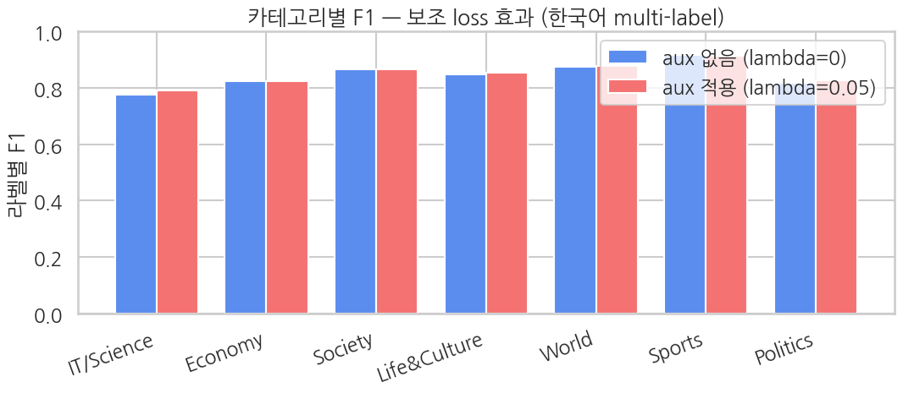
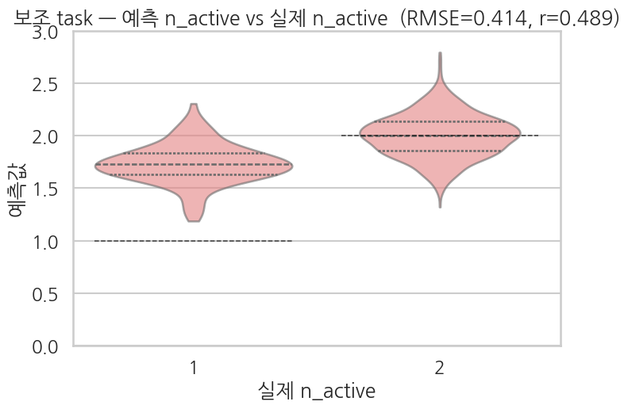

## 클라이맥스 — *λ=0 baseline* 학습 (= Ch 17 재현)

같은 코드를 `lambda_aux=0.0` 으로 한 번 더 돌립니다. 보조 loss 의 gradient 가 0 이 되어 메인 task 만 학습되는 상태 = **Ch 17 과 정확히 동일한 학습 결과** (보조 헤드는 학습되긴 하지만 메인 학습엔 영향 없음).

> 의도적으로 *Ch 17 노트북을 따로 돌리지 않고* 이 셀에서 baseline 을 다시 만듭니다 — 비교가 *같은 노트북·같은 환경* 안에서 self-contained 하도록 (Ch 14 와 같은 패턴).

```python
# 새 모델 인스턴스 — λ=0 학습용 (λ=0.05 모델과 동일 초기화로 공정 비교)
torch.manual_seed(SEED); np.random.seed(SEED)
model_no_aux = make_model()

training_args_no_aux = TrainingArguments(
    output_dir="./ch18_baseline_output",
    num_train_epochs=2,
    per_device_train_batch_size=16,
    per_device_eval_batch_size=32,
    learning_rate=2e-5,
    fp16=True,
    eval_strategy="epoch",
    logging_steps=50,
    save_strategy="no",
    report_to="none",
    seed=SEED,
    remove_unused_columns=False,
)

trainer_no_aux = AuxTrainer(
    model=model_no_aux,
    args=training_args_no_aux,
    train_dataset=train_tok,
    eval_dataset=eval_tok,
    data_collator=collator,
    processing_class=tokenizer,
    compute_metrics=compute_metrics_main,
    lambda_aux=0.0,    # ← 보조 loss 무시
)

train_result_no_aux = trainer_no_aux.train()
print(f"\nNo-aux (lambda=0) baseline training done — mean train loss: {train_result_no_aux.training_loss:.4f}")
```

**▶ 실행 결과**

```text
[transformers] BertModel LOAD REPORT from: klue/bert-base
Key                                        | Status     |  | 
-------------------------------------------+------------+--+-
cls.predictions.bias                       | UNEXPECTED |  | 
cls.predictions.transform.dense.weight     | UNEXPECTED |  | 
cls.predictions.transform.dense.bias       | UNEXPECTED |  | 
cls.seq_relationship.bias                  | UNEXPECTED |  | 
cls.predictions.transform.LayerNorm.bias   | UNEXPECTED |  | 
cls.predictions.transform.LayerNorm.weight | UNEXPECTED |  | 
cls.seq_relationship.weight                | UNEXPECTED |  | 

Notes:
- UNEXPECTED:	can be ignored when loading from different task/architecture; not ok if you expect identical arch.
<IPython.core.display.HTML object>
No-aux (lambda=0) baseline training done — mean train loss: 0.2258
```

```python
# baseline 메인 metric
eval_metrics_no_aux = trainer_no_aux.evaluate()
print("No-aux (lambda=0) baseline — main task metrics:")
for k, v in eval_metrics_no_aux.items():
    if k.startswith("eval_") and isinstance(v, float):
        print(f"  {k:>22}: {v:.4f}")

# baseline 메인 per-sample 예측
preds_output_no_aux = trainer_no_aux.predict(eval_tok)
logits_no_aux = preds_output_no_aux.predictions
if isinstance(logits_no_aux, tuple):
    logits_no_aux = logits_no_aux[0]
probs_no_aux = 1.0 / (1.0 + np.exp(-logits_no_aux))
preds_main_no_aux = (probs_no_aux >= 0.5).astype(int)
```

**▶ 실행 결과**

```text
<IPython.core.display.HTML object>
<IPython.core.display.HTML object>
No-aux (lambda=0) baseline — main task metrics:
               eval_loss: 0.1934
       eval_hamming_loss: 0.0754
           eval_micro_f1: 0.8491
    eval_micro_precision: 0.8530
       eval_micro_recall: 0.8453
           eval_macro_f1: 0.8451
    eval_macro_precision: 0.8375
       eval_macro_recall: 0.8552
          eval_macro_auc: 0.9633
            eval_runtime: 0.6701
  eval_samples_per_second: 1492.3100
   eval_steps_per_second: 47.7540
<IPython.core.display.HTML object>
```

### 8-1. 메인 metric 비교 — λ=0 baseline vs λ=0.05 aux

```python
m_aux    = {k.replace("eval_", ""): v for k, v in eval_metrics_aux.items()
            if k.startswith("eval_") and isinstance(v, float)}
m_no_aux = {k.replace("eval_", ""): v for k, v in eval_metrics_no_aux.items()
            if k.startswith("eval_") and isinstance(v, float)}

common = [k for k in m_aux if k in m_no_aux]
cmp = pd.DataFrame({
    "metric":               common,
    "no aux (lambda=0)":    [m_no_aux[k] for k in common],
    "with aux (lambda=0.05)":[m_aux[k]    for k in common],
})
cmp["delta (aux - no_aux)"] = cmp["with aux (lambda=0.05)"] - cmp["no aux (lambda=0)"]
print(cmp.round(4).to_string(index=False))
```

**▶ 실행 결과**

```text
            metric  no aux (lambda=0)  with aux (lambda=0.05)  delta (aux - no_aux)
              loss             0.1934                  0.2009                0.0075
      hamming_loss             0.0754                  0.0739               -0.0016
          micro_f1             0.8491                  0.8523                0.0032
   micro_precision             0.8530                  0.8560                0.0030
      micro_recall             0.8453                  0.8487                0.0034
          macro_f1             0.8451                  0.8493                0.0042
   macro_precision             0.8375                  0.8408                0.0033
      macro_recall             0.8552                  0.8600                0.0048
         macro_auc             0.9633                  0.9640                0.0007
           runtime             0.6701                  0.6700               -0.0001
samples_per_second          1492.3100               1492.6430                0.3330
  steps_per_second            47.7540                 47.7650                0.0110
```

**해석 가이드**

- `delta` > 0 — 보조 loss 가 메인 task 에 *도움* 이 됨.
- `delta` < 0 — 보조 loss 가 메인 task 를 *방해* 함 (λ 가 너무 크거나 보조 task 상관이 약함).
- `delta` ≈ 0 — 별 영향 없음.

`n_active` 는 메인 multi-label 벡터의 *합* 이라 양의 상관이 매우 강합니다 — Ch 14 의 별점보다 상관이 직접적이므로 *작은 양의 delta* 가 자연스러운 결과. 단 보조 task 가 *너무 쉬워서* (1 vs 2 이항 회귀) 추가 정보량이 적을 수 있다는 점도 고려.

### 8-2. 카테고리별 F1 비교 — 어느 카테고리가 보조 loss 로 가장 도움받았나

```python
def per_label_f1(Y_true, Y_pred):
    f1s = []
    for k in range(K):
        _, _, f1, _ = precision_recall_fscore_support(
            Y_true[:, k], Y_pred[:, k], average="binary", zero_division=0,
        )
        f1s.append(float(f1))
    return f1s


f1_no_aux = per_label_f1(labels_eval, preds_main_no_aux)
f1_aux    = per_label_f1(labels_eval, preds_main_aux)

label_cmp = pd.DataFrame({
    "category":              LABEL_NAMES_EN,
    "no aux F1":             f1_no_aux,
    "with aux F1":           f1_aux,
    "delta (aux - no_aux)":  np.array(f1_aux) - np.array(f1_no_aux),
})
print(label_cmp.round(4).to_string(index=False))

# 막대 그래프
sns.set_theme(style="whitegrid", context="talk", font="NanumGothic", rc={"axes.unicode_minus": False})
fig, ax = plt.subplots(figsize=(11, 5))
x_pos = np.arange(K)
width = 0.38
ax.bar(x_pos - width/2, f1_no_aux, width, label="aux 없음 (lambda=0)",    color="#5B8DEF")
ax.bar(x_pos + width/2, f1_aux,    width, label="aux 적용 (lambda=0.05)", color="#F47272")
ax.set_xticks(x_pos)
ax.set_xticklabels(LABEL_NAMES_EN, rotation=20, ha="right")
ax.set_ylim(0, 1)
ax.set_ylabel("라벨별 F1")
ax.set_title("카테고리별 F1 — 보조 loss 효과 (한국어 multi-label)")
ax.legend()
plt.tight_layout()
plt.show()
```

**▶ 실행 결과**

```text
    category  no aux F1  with aux F1  delta (aux - no_aux)
  IT/Science     0.7747       0.7891                0.0144
     Economy     0.8217       0.8233                0.0015
     Society     0.8635       0.8642                0.0007
Life&Culture     0.8460       0.8523                0.0063
       World     0.8746       0.8780                0.0034
      Sports     0.9167       0.9121               -0.0045
    Politics     0.8185       0.8261                0.0076
```



**해석**

- **활성률 높은 카테고리** (스포츠/세계/사회 등): baseline 자체 F1 이 높음. delta 는 작거나 0 — 이미 신호가 충분.
- **활성률 낮은·헷갈리는 카테고리** (정치/IT과학 등): baseline F1 이 낮음. 보조 신호의 *정규화 효과* 가 상대적으로 도움이 될 가능성 — 그래도 5K 샘플·2 epoch quick 모드에선 delta 가 노이즈 영역 (±0.01) 안에 머무를 수 있음.
- **모든 카테고리 delta 가 ±0.005 이내** → quick 모드 표본의 노이즈 영역. 학습량 (epoch·데이터) 을 늘려야 보조 효과가 통계적으로 분리 가능.

### 8-3. 보조 task 자체는 얼마나 잘 학습됐나

`n_active` 는 1 또는 2 정수만 나오므로 *binary 같은 회귀* 입니다. RMSE 가 0 에 가까우면 모델이 두 경우를 잘 구분, 0.5 근처면 무작위 추측 (분산이 0.25 인 1-vs-2 분포).

```python
# True n_active 별 예측 분포 — violin
df_aux = pd.DataFrame({
    "실제 n_active": [f"{int(v)}" for v in aux_true],
    "예측값":     aux_preds_aux,
})
order = ["1", "2"]

fig, ax = plt.subplots(figsize=(7.5, 5.5))
sns.violinplot(
    data=df_aux, x="실제 n_active", y="예측값",
    order=order, inner="quart", cut=0,
    color="#F47272", alpha=0.6, ax=ax,
)
# 정답 위치 점선 가이드
for i, target in enumerate([1.0, 2.0]):
    ax.hlines(target, i - 0.4, i + 0.4, color="black", lw=1.1, ls="--", alpha=0.7)
ax.set_ylim(0.0, 3.0)
ax.set_title(f"보조 task — 예측 n_active vs 실제 n_active  (RMSE={rmse_aux:.3f}, r={pear_aux:.3f})")
plt.tight_layout()
plt.show()
```

**▶ 실행 결과**



**해석**

- 두 violin (n_active=1, n_active=2) 의 *중심* 이 점선 가이드 (1.0 / 2.0) 에 잘 맞으면 보조 헤드가 활성 개수를 잘 학습한 것.
- *분포 폭* — 모델이 두 경우를 *자신 있게* 구분하면 violin 이 좁고 점선 가이드에 집중. 폭이 넓고 두 violin 이 0.5 근처에서 겹치면 학습 부족.
- 1.5 근처에 한 데가 몰려 있으면 *상수 평균 예측* 으로 회귀 — 보조 신호가 메인 표상에 *반영되지 못한* 상태. 이 경우 λ 를 더 키우거나 데이터·epoch 를 늘려야 함.

## 변형 — λ 스윕 (전체 곡선은 부록에서)

§8 은 λ=0 vs λ=0.05 *두 점* 만 비교했습니다. **λ 전체 곡선(0 → 0.5)은 부록 `18_ko_auxiliary_lambda_sweep` 에서 실측** 으로 그립니다 — sweet spot 이 λ=0.05 이고, λ≥0.2 부터 메인이 무너지는 모습, 그리고 Ch 14(강한 보조)와의 대조를 거기서 봅니다.

아래는 이 노트북 안에서 *빠르게* 몇 점만 직접 돌려보고 싶을 때의 선택 코드입니다 (각 λ 마다 처음부터 재학습 — 시간 여유 있을 때만).

```python
# 시간 여유 있을 때만 실행 — 각 lambda 마다 처음부터 다시 학습
LAMBDA_GRID = [0.0, 0.1, 1.0]   # 빠르게 보고 싶으면 [0.0, 0.1] 만
RUN_LAMBDA_SWEEP = False        # ← True 로 바꿔 실행

sweep_results = []

if RUN_LAMBDA_SWEEP:
    for lam in LAMBDA_GRID:
        print(f"\n{'='*60}")
        print(f"Training with lambda_aux = {lam}")
        print(f"{'='*60}")
        m = make_model()
        args = TrainingArguments(
            output_dir=f"./ch18_sweep_lam{lam}",
            num_train_epochs=2,
            per_device_train_batch_size=16,
            per_device_eval_batch_size=32,
            learning_rate=2e-5,
            fp16=True,
            eval_strategy="no",
            logging_steps=200,
            save_strategy="no",
            report_to="none",
            seed=SEED,
            remove_unused_columns=False,
        )
        tr = AuxTrainer(
            model=m, args=args,
            train_dataset=train_tok, eval_dataset=eval_tok,
            data_collator=collator, processing_class=tokenizer,
            compute_metrics=compute_metrics_main, lambda_aux=lam,
        )
        tr.train()
        ev = tr.evaluate()
        sweep_results.append({
            "lambda": lam,
            "macro_f1": float(ev.get("eval_macro_f1", float("nan"))),
            "micro_f1": float(ev.get("eval_micro_f1", float("nan"))),
            "macro_auc": float(ev.get("eval_macro_auc", float("nan"))),
        })
        del m, tr
        if torch.cuda.is_available():
            torch.cuda.empty_cache()

    sweep_df = pd.DataFrame(sweep_results)
    print("\nLambda sweep result:")
    print(sweep_df.round(4).to_string(index=False))
else:
    print("Lambda sweep skipped. Set RUN_LAMBDA_SWEEP=True to run (~30 min extra on T4).")
```

**▶ 실행 결과**

```text
Lambda sweep skipped. Set RUN_LAMBDA_SWEEP=True to run (~30 min extra on T4).
```

**해석 가이드 — 결과를 직접 보면**

- macro_f1 이 λ=0.1 에서 최대 → 가벼운 보조 가중치가 정규화 효과로 메인 도움.
- macro_f1 이 λ=1.0 에서 최대 → 보조 신호가 충분히 강해 둘 다 학습.
- macro_f1 이 λ=0 에서 최대 (baseline 이 가장 좋음) → 보조 task 가 이 셋업에선 도움 안 됨. quick 모드 노이즈일 수 있어 시드 바꿔 재실행 권장.

## 결과 해석 — sweet spot 에서는 약한 보조도 메인을 (살짝) 돕는다

§8 비교에서 **λ=0.05 보조가 λ=0 baseline 을 micro·macro-F1 모두에서 앞섰습니다** (각 +0.003, +0.004). `n_active` 라는 *약한* 보조 신호도 작은 λ 에서는 공유 KLUE-BERT 본체에 가벼운 정규화로 작용해 메인 분류를 살짝 끌어올립니다.

다만 그 효과는 **Ch 14(영어, 별점 보조)보다 작습니다.** 부록 `18_ko_auxiliary_lambda_sweep` 의 λ 곡선과 Ch 14 를 나란히 두면:

| | 보조 task | 보조 R² | sweet spot Δ(micro) |
|---|---|---|---|
| Ch 14 | 별점 회귀 | 0.43 (강함) | +0.007 |
| **Ch 18** | **n_active 회귀** | **0.065 (약함)** | **+0.003** |

두 챕터의 sweet spot 은 똑같이 **λ=0.05** 인데 도움의 *크기* 가 다릅니다. 차이는 λ 가 아니라 **보조 신호의 정보량** 입니다.

### 왜 `n_active` 는 약한가

`n_active` 는 합성 규칙상 거의 항상 2 입니다 (train 분포 {1: 732, 2: 4268}). 분산이 작아 *예측할 게 별로 없어서*, 보조 헤드가 λ 를 0.5 까지 키워도 R² 가 0.08 에 머뭅니다. 보조가 입력을 깊이 들여다볼 동기가 약하니 공유 표현에 실어주는 추가 정보도 적습니다. 반면 Ch 14 의 별점은 *사용자가 직접 매긴* 입력 의존도 높은 신호라 R² 0.43 으로 잘 학습되고, 그만큼 메인에도 더 보탬이 됐습니다.

### λ 를 키우면

λ≥0.2 부터는 약한 보조가 오히려 메인을 깎습니다 (λ=0.5 에서 micro 0.80). 약한 보조일수록 *도움이 되는 작은 λ 구간이 더 좁습니다* — 본편이 λ=0.05 를 쓰는 이유입니다.

> *이 챕터의 메시지* — auxiliary loss 는 공짜 만병통치약이 아니라, **(1) λ 를 작게 잡고 (2) 입력 의존도 높은 보조 신호를 골라야** 메인을 돕습니다. `n_active` 는 데이터 합성의 자연 부산물이라 손쉽지만 약하고, 그래도 sweet spot 에서는 +가 납니다. 더 큰 도움을 원하면 헤드라인 길이·발행 메타데이터처럼 *입력 의존도 큰* 보조로 바꾸는 게 다음 수입니다.
