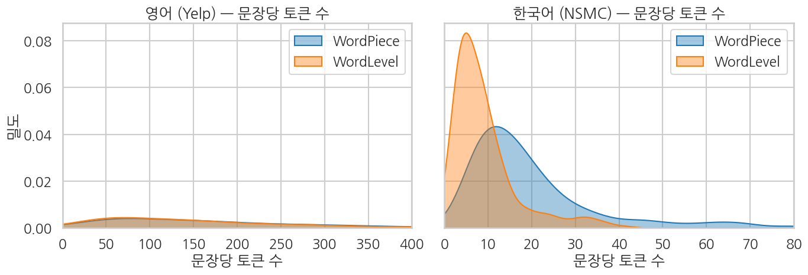
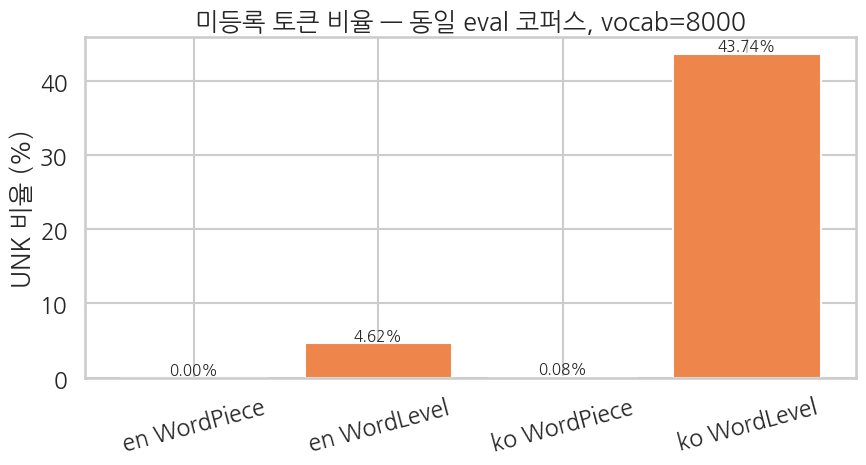

같은 영어 문장 + 같은 한국어 문장을 4 토크나이저에 통과시켜 토큰 시퀀스를 직접 출력. *알고리즘에 따라 토큰 수가 어떻게 다른지*, *언어에 따라 어떻게 다른지* 동시에 관찰.

```python
SAMPLE_EN = "The food was unforgettable and the service was excellent."
SAMPLE_KO = "이 영화는 정말 재미있어요. 배우들 연기도 훌륭했습니다."


def show_tokens(tok, text, name):
    enc = tok.encode(text)
    tokens = enc.tokens
    print(f"[{name}]  #tokens = {len(tokens)}")
    print(f"  {tokens}")
    # UNK 개수
    unk_count = sum(1 for t in tokens if t == "[UNK]")
    if unk_count:
        print(f"  ! contains {unk_count} [UNK] tokens")
    print()


print("=" * 78)
print(f"ENGLISH sample: {SAMPLE_EN}")
print("=" * 78)
show_tokens(tok_en_wp, SAMPLE_EN, "en WordPiece")
show_tokens(tok_en_wl, SAMPLE_EN, "en WordLevel")

print("=" * 78)
print(f"KOREAN sample: {SAMPLE_KO}")
print("=" * 78)
show_tokens(tok_ko_wp, SAMPLE_KO, "ko WordPiece")
show_tokens(tok_ko_wl, SAMPLE_KO, "ko WordLevel")
```

**▶ 실행 결과**

```text
==============================================================================
ENGLISH sample: The food was unforgettable and the service was excellent.
==============================================================================
[en WordPiece]  #tokens = 15
  ['[CLS]', 'the', 'food', 'was', 'unf', '##orge', '##tt', '##able', 'and', 'the', 'service', 'was', 'excellent', '.', '[SEP]']

[en WordLevel]  #tokens = 10
  ['The', 'food', 'was', '[UNK]', 'and', 'the', 'service', 'was', 'excellent', '.']
  ! contains 1 [UNK] tokens

==============================================================================
KOREAN sample: 이 영화는 정말 재미있어요. 배우들 연기도 훌륭했습니다.
==============================================================================
[ko WordPiece]  #tokens = 12
  ['[CLS]', '이', '영화는', '정말', '재미있어요', '.', '배우들', '연기도', '훌륭', '##했습니다', '.', '[SEP]']

[ko WordLevel]  #tokens = 9
  ['이', '영화는', '정말', '재미있어요', '.', '배우들', '연기도', '[UNK]', '.']
  ! contains 1 [UNK] tokens
```

**해석 가이드**

- **WordPiece (영어)** — `unforgettable` 같은 드문 단어가 *여러 조각* 으로 쪼개짐. `[CLS]`, `[SEP]` 가 자동 부착되어 BERT 입력 그대로 사용 가능.
- **WordLevel (영어)** — `unforgettable` 이 학습 코퍼스에 *충분히 등장* 했다면 1 토큰, 아니면 `[UNK]`. binary 결과.
- **WordPiece (한국어)** — 조사·어미가 `##` prefix 로 분리되어 *어근 + 조사* 구조가 토큰 시퀀스에 보임.
- **WordLevel (한국어)** — 한국어는 *교착어* 라 같은 어근에 다른 조사가 붙은 어절이 모두 *다른 vocab entry* — `재미있어요` / `재미있다` / `재미있는데` 가 전부 별개 토큰. vocab 효율이 매우 낮음.

## 비교 시각화

### 5-1. 토큰 길이 분포 — 같은 텍스트를 4 토크나이저로

eval 코퍼스 (별도 sample 1,000 문장) 에 4 토크나이저를 적용해 *문장당 토큰 수* 분포를 비교.

학습한 토크나이저를 *처음 보는* 평가 코퍼스(영어·한국어 각 1,000문장)에 적용해, 문장당 토큰 수의 평균·중앙값·p95 를 비교합니다.

```python
N_EVAL = 1000
eval_en = list(load_dataset("fancyzhx/yelp_polarity", split=f"train[{N_EN}:{N_EN + N_EVAL}]")["text"])
eval_ko = df_nsmc["document"].sample(n=N_EVAL, random_state=SEED + 1).tolist()


def token_lens(tok, texts):
    return [len(tok.encode(t).tokens) for t in texts]


len_en_wp = token_lens(tok_en_wp, eval_en)
len_en_wl = token_lens(tok_en_wl, eval_en)
len_ko_wp = token_lens(tok_ko_wp, eval_ko)
len_ko_wl = token_lens(tok_ko_wl, eval_ko)

stats = pd.DataFrame({
    "tokenizer": ["en WordPiece", "en WordLevel", "ko WordPiece", "ko WordLevel"],
    "mean_tokens": [np.mean(len_en_wp), np.mean(len_en_wl),
                    np.mean(len_ko_wp), np.mean(len_ko_wl)],
    "median_tokens": [np.median(len_en_wp), np.median(len_en_wl),
                      np.median(len_ko_wp), np.median(len_ko_wl)],
    "p95_tokens": [np.percentile(len_en_wp, 95), np.percentile(len_en_wl, 95),
                   np.percentile(len_ko_wp, 95), np.percentile(len_ko_wl, 95)],
})
print(stats.to_string(index=False))
```

**▶ 실행 결과**

```text
   tokenizer  mean_tokens  median_tokens  p95_tokens
en WordPiece      176.571          139.0      469.05
en WordLevel      159.220          126.5      426.10
ko WordPiece       19.804           15.0       57.05
ko WordLevel        9.106            7.0       27.00
```

**결과 해석**

같은 문장이라도 WordLevel 이 WordPiece 보다 토큰 수가 적습니다(한국어 9.1 vs 19.8). 어절을 통째로 1토큰 처리하기 때문인데, 이 짧은 길이는 곧 뒤에서 보듯 다량의 `[UNK]` 와 맞바꾼 결과입니다.

위 토큰 수 분포를 영어·한국어로 나눠 밀도 곡선으로 그립니다.

```python
sns.set_theme(style="whitegrid", context="talk", font="NanumGothic", rc={"axes.unicode_minus": False})
fig, axes = plt.subplots(1, 2, figsize=(14, 5), sharey=True)

# 영어
sns.kdeplot(len_en_wp, ax=axes[0], color="tab:blue", fill=True, alpha=0.4, label="WordPiece")
sns.kdeplot(len_en_wl, ax=axes[0], color="tab:orange", fill=True, alpha=0.4, label="WordLevel")
axes[0].set_title("영어 (Yelp) — 문장당 토큰 수")
axes[0].set_xlabel("문장당 토큰 수")
axes[0].set_ylabel("밀도")
axes[0].legend()
axes[0].set_xlim(0, 400)

# 한국어
sns.kdeplot(len_ko_wp, ax=axes[1], color="tab:blue", fill=True, alpha=0.4, label="WordPiece")
sns.kdeplot(len_ko_wl, ax=axes[1], color="tab:orange", fill=True, alpha=0.4, label="WordLevel")
axes[1].set_title("한국어 (NSMC) — 문장당 토큰 수")
axes[1].set_xlabel("문장당 토큰 수")
axes[1].legend()
axes[1].set_xlim(0, 80)

plt.tight_layout()
plt.show()
```

**▶ 실행 결과**



**해석**

- 영어에서는 *WordPiece 가 WordLevel 보다 토큰 수가 살짝 더 많음* — subword 분할로 한 단어가 여러 조각으로 쪼개지기 때문. 하지만 `[UNK]` 가 거의 안 생기는 *대가* 로 받아들이는 trade-off.
- 한국어에서는 *WordLevel 의 평균 토큰 수가 매우 작아 보이지만* (어절 단위), 다음 §5-2 의 UNK 비율을 보면 그 *대가* 가 드러납니다.

### 5-2. Unknown 토큰 비율 — vocab 한계가 드러나는 곳

같은 eval 코퍼스에서 각 토크나이저가 *얼마나 자주* `[UNK]` 를 뱉는지. WordPiece 의 *진짜 장점* 이 여기서 드러납니다.

토큰 수가 짧다고 좋은 토크나이저는 아닙니다. 미등록 단어가 `[UNK]` 로 바뀌면 정보가 사라지기 때문입니다. 평가 코퍼스에서 전체 토큰 대비 `[UNK]` 비율을 토크나이저별로 집계합니다.

```python
def unk_rate(tok, texts):
    total_tokens = 0
    unk_tokens = 0
    for t in texts:
        toks = tok.encode(t).tokens
        total_tokens += len(toks)
        unk_tokens += sum(1 for tk in toks if tk == "[UNK]")
    return unk_tokens / total_tokens if total_tokens > 0 else 0.0


unk_summary = pd.DataFrame({
    "tokenizer": ["en WordPiece", "en WordLevel", "ko WordPiece", "ko WordLevel"],
    "unk_rate": [
        unk_rate(tok_en_wp, eval_en),
        unk_rate(tok_en_wl, eval_en),
        unk_rate(tok_ko_wp, eval_ko),
        unk_rate(tok_ko_wl, eval_ko),
    ],
})
unk_summary["unk_pct"] = unk_summary["unk_rate"].apply(lambda x: f"{x:.2%}")
print(unk_summary[["tokenizer", "unk_pct"]].to_string(index=False))
```

**▶ 실행 결과**

```text
   tokenizer unk_pct
en WordPiece   0.00%
en WordLevel   4.62%
ko WordPiece   0.08%
ko WordLevel  43.74%
```

**결과 해석**

한국어 WordLevel 의 UNK 비율이 43.74% 로 압도적입니다. 교착어 특성상 같은 어근에 조사·어미가 다르게 붙은 어절이 모두 별개 vocab 항목이라, 8K vocab 으로는 평가 문장의 절반 가까운 토큰을 담지 못합니다. 반면 WordPiece 는 두 언어 모두 UNK 가 0.1% 이하로, 서브워드 분할이 미등록 문제를 사실상 해소함을 보여줍니다.

같은 UNK 비율을 막대그래프로 시각화합니다.

```python
sns.set_theme(style="whitegrid", context="talk", font="NanumGothic", rc={"axes.unicode_minus": False})
fig, ax = plt.subplots(figsize=(9, 5))
colors = ["#4878D0", "#EE854A", "#4878D0", "#EE854A"]
bars = ax.bar(unk_summary["tokenizer"], unk_summary["unk_rate"] * 100, color=colors)
for bar, rate in zip(bars, unk_summary["unk_rate"]):
    ax.text(bar.get_x() + bar.get_width() / 2, bar.get_height() + 0.1,
            f"{rate:.2%}", ha="center", va="bottom", fontsize=11)
ax.set_ylabel("UNK 비율 (%)")
ax.set_title("미등록 토큰 비율 — 동일 eval 코퍼스, vocab=8000")
ax.tick_params(axis="x", rotation=15)
plt.tight_layout()
plt.show()
```

**▶ 실행 결과**



**해석 — 이 챕터의 가장 중요한 결과**

- **WordPiece (양쪽 언어 모두)**: UNK 비율 거의 0%. *모르는 단어* 가 와도 작은 조각으로 분해 가능.
- **WordLevel (영어)**: 보통 1-3% — 영어는 어휘가 한정되어 8K vocab 으로도 그럭저럭 커버.
- **WordLevel (한국어)**: 5-15% — 교착어 특성상 *같은 어근의 다른 활용* 이 vocab 을 잡아먹어 vocab 부족.

> **BERT 가 WordPiece 를 채택한 이유** — 모든 단어가 *학습 가능한 표현* 으로 인코딩되어, 모델이 가지런한 임베딩 공간에서 작동할 수 있음. WordLevel 처럼 `[UNK]` 가 빈번하면 그 위치들은 *학습 신호가 사라진 빈 구멍* 이 됩니다.

### 5-3. 2×2 비교 표 — 한눈에 정리

같은 vocab=8000 일 때 *언어 × 알고리즘* 의 모든 조합.

앞서 본 토큰 수와 UNK 비율을 (언어 × 알고리즘) 2×2 표 하나로 정리합니다.

```python
summary_2x2 = pd.DataFrame({
    "language": ["English", "English", "Korean", "Korean"],
    "algorithm": ["WordPiece", "WordLevel", "WordPiece", "WordLevel"],
    "vocab_size": [tok_en_wp.get_vocab_size(), tok_en_wl.get_vocab_size(),
                   tok_ko_wp.get_vocab_size(), tok_ko_wl.get_vocab_size()],
    "mean_tokens_per_sent": [np.mean(len_en_wp), np.mean(len_en_wl),
                              np.mean(len_ko_wp), np.mean(len_ko_wl)],
    "p95_tokens_per_sent": [np.percentile(len_en_wp, 95), np.percentile(len_en_wl, 95),
                             np.percentile(len_ko_wp, 95), np.percentile(len_ko_wl, 95)],
    "unk_rate_pct": [unk_rate(tok_en_wp, eval_en) * 100,
                     unk_rate(tok_en_wl, eval_en) * 100,
                     unk_rate(tok_ko_wp, eval_ko) * 100,
                     unk_rate(tok_ko_wl, eval_ko) * 100],
})

# 보기 좋게 둥글리기
for col in ["mean_tokens_per_sent", "p95_tokens_per_sent", "unk_rate_pct"]:
    summary_2x2[col] = summary_2x2[col].round(2)

print(summary_2x2.to_string(index=False))
```

**▶ 실행 결과**

```text
language algorithm  vocab_size  mean_tokens_per_sent  p95_tokens_per_sent  unk_rate_pct
 English WordPiece        8000                176.57               469.05          0.00
 English WordLevel        8000                159.22               426.10          4.62
  Korean WordPiece        8000                 19.80                57.05          0.08
  Korean WordLevel        8000                  9.11                27.00         43.74
```

### 5-4. 🌐 교차 적용 — 영어 토크나이저로 한국어를, 그 반대도

지금까지 *학습 언어 = 적용 언어* 였습니다. 만약 **다른 언어 텍스트** 를 학습한 토크나이저에 통과시키면?

- **WordPiece (영어)** → 한국어 텍스트: 한국어 글자가 vocab 에 없어 대부분 **`[UNK]` 로 떨어짐** (BERT character fallback 도 없으면)
- **WordLevel (영어)** → 한국어 텍스트: 한국어 *어절 통째* 가 단어로 vocab 에 없어 **거의 100% UNK**
- 반대 (한국어 학습 → 영어 입력) 도 같은 양상

이걸 정량 비교하면 "왜 multilingual 모델은 *공통 vocab* (mBERT 의 110k WordPiece, XLM-R 의 250k SentencePiece) 으로 학습되는지" 가 직관됩니다.

학습 언어와 입력 언어가 어긋나면 어떻게 되는지 교차 적용으로 확인합니다. 영어·한국어 예시 문장을 4개 토크나이저에 모두 통과시켜, 학습 언어와 *맞는* 경우와 *어긋나는*(cross) 경우의 토큰 수·UNK 를 비교합니다.

```python
# 4 토크나이저를 dict 로 묶어 cross-language 분석에 사용
tokenizers = {
    "en_WordPiece": tok_en_wp,
    "en_WordLevel": tok_en_wl,
    "ko_WordPiece": tok_ko_wp,
    "ko_WordLevel": tok_ko_wl,
}

# 교차 적용: 영어/한국어 예시 문장을 모두 4 토크나이저에 통과
cross_examples = [
    ("EN", "The food was absolutely delicious and the service was great."),
    ("KO", "음식이 정말 맛있었고 서비스도 훌륭했습니다."),
]

cross_rows = []
for lang, text in cross_examples:
    for tok_name, tok in tokenizers.items():
        enc = tok.encode(text)
        n_tokens = len(enc.tokens)
        n_unk = sum(1 for t in enc.tokens if t == "[UNK]")
        cross_rows.append({
            "input_lang": lang,
            "tokenizer": tok_name,
            "tokenizer_train_lang": "EN" if "en_" in tok_name else "KO",
            "n_tokens": n_tokens,
            "n_unk": n_unk,
            "unk_pct": round(n_unk / n_tokens * 100, 1) if n_tokens else 0.0,
            "match": "✅ same" if (lang.lower() in tok_name.lower()[:5]) else "❌ cross",
        })

cross_df = pd.DataFrame(cross_rows)
print(cross_df.to_string(index=False))
```

**▶ 실행 결과**

```text
input_lang    tokenizer tokenizer_train_lang  n_tokens  n_unk  unk_pct   match
        EN en_WordPiece                   EN        13      0      0.0  ✅ same
        EN en_WordLevel                   EN        11      0      0.0  ✅ same
        EN ko_WordPiece                   KO        40      0      0.0 ❌ cross
        EN ko_WordLevel                   KO        11      7     63.6 ❌ cross
        KO en_WordPiece                   EN         8      5     62.5 ❌ cross
        KO en_WordLevel                   EN         6      5     83.3 ❌ cross
        KO ko_WordPiece                   KO        14      0      0.0  ✅ same
        KO ko_WordLevel                   KO         6      4     66.7  ✅ same
```

**결과 해석**

학습 언어와 입력 언어가 어긋난 행은 UNK 비율이 치솟습니다(영어 입력 → 한국어 WordLevel 63.6%, 한국어 입력 → 영어 WordLevel 83.3%). 토크나이저가 학습 코퍼스에 *본 적 없는* 문자·어절을 거의 다 `[UNK]` 로 떨어뜨리기 때문입니다. WordPiece 교차의 경우 UNK 는 적지만(영어→ko WordPiece 0%) 대신 토큰 수가 40개로 폭증해, 모르는 문자를 잘게 쪼개 처리함을 보여줍니다.

UNK 비율은 같지만 *실제 토큰 분할* 이 어떻게 다른지 첫 12개 토큰을 직접 출력합니다.

```python
# 같은 입력을 토크나이저 별로 실제로 어떻게 쪼개는지 (첫 12 토큰)
print("=" * 78)
for lang, text in cross_examples:
    print(f"\n[input ({lang})]  {text}")
    for tok_name, tok in tokenizers.items():
        enc = tok.encode(text)
        cross = "❌" if (lang.lower()[:2] not in tok_name.lower()[:5]) else "  "
        head = enc.tokens[:12]
        print(f"  {cross} {tok_name:18} ({len(enc.tokens):>3} tokens, UNK {sum(1 for t in enc.tokens if t=='[UNK]'):>2}): {head}")
```

**▶ 실행 결과**

```text
==============================================================================

[input (EN)]  The food was absolutely delicious and the service was great.
     en_WordPiece       ( 13 tokens, UNK  0): ['[CLS]', 'the', 'food', 'was', 'absolutely', 'delicious', 'and', 'the', 'service', 'was', 'great', '.']
     en_WordLevel       ( 11 tokens, UNK  0): ['The', 'food', 'was', 'absolutely', 'delicious', 'and', 'the', 'service', 'was', 'great', '.']
  ❌ ko_WordPiece       ( 40 tokens, UNK  0): ['[CLS]', 'Th', '##e', 'f', '##oo', '##d', 'w', '##a', '##s', 'a', '##b', '##s']
  ❌ ko_WordLevel       ( 11 tokens, UNK  7): ['The', '[UNK]', '[UNK]', '[UNK]', '[UNK]', 'and', 'the', '[UNK]', '[UNK]', '[UNK]', '.']

[input (KO)]  음식이 정말 맛있었고 서비스도 훌륭했습니다.
  ❌ en_WordPiece       (  8 tokens, UNK  5): ['[CLS]', '[UNK]', '[UNK]', '[UNK]', '[UNK]', '[UNK]', '.', '[SEP]']
  ❌ en_WordLevel       (  6 tokens, UNK  5): ['[UNK]', '[UNK]', '[UNK]', '[UNK]', '[UNK]', '.']
     ko_WordPiece       ( 14 tokens, UNK  0): ['[CLS]', '음', '##식이', '정말', '맛', '##있어', '##ᆻ고', '서', '##비스', '##도', '훌륭', '##했습니다']
     ko_WordLevel       (  6 tokens, UNK  4): ['[UNK]', '정말', '[UNK]', '[UNK]', '[UNK]', '.']
```

교차 언어 UNK 비율을 (토크나이저 × 입력 언어) 히트맵으로 한눈에 정리합니다. 대각선(언어 일치)은 옅고, 어긋난 칸은 붉게 나타나는지 확인합니다.

```python
# 시각화: UNK 비율 4×2 매트릭스 (가로 토크나이저, 세로 입력 언어)
fig, ax = plt.subplots(figsize=(8.5, 3.6))
pivot = cross_df.pivot(index="input_lang", columns="tokenizer", values="unk_pct")
pivot = pivot[list(tokenizers.keys())]   # 열 순서 유지
sns.heatmap(pivot, annot=True, fmt=".1f", cmap="Reds", vmin=0, vmax=100,
            cbar_kws={"label": "UNK 비율 (%)"}, ax=ax)
ax.set_title("교차 언어 UNK 비율 — 학습 토크나이저 (EN|KO) × 입력 언어 (EN|KO)")
ax.set_xlabel("토크나이저 (알고리즘 × 학습 언어)")
ax.set_ylabel("입력 언어")
plt.tight_layout(); plt.show()
```

**▶ 실행 결과**


**관찰**

- 대각선(같은 언어) 셀은 UNK 가 거의 0 — 학습 언어와 같으면 vocab 이 커버.
- **비대각선(교차) 셀은 UNK 가 크게 솟음** — 특히 WordLevel 은 어절 매칭이라 *거의 100%*, WordPiece 는 서브워드라도 한·영 *글자* 가 vocab 에 없으면 통째 UNK.
- WordPiece 가 그나마 한·영 *공통 알파벳·구두점* 일부를 커버할 수 있지만, *한글 자모/조합* 또는 *영문 단어* 자체는 학습 corpus 에 의존.

**시사점**

- **단일 언어 corpus 로 학습한 토크나이저는 다른 언어에 거의 못 씁니다.** 모델을 통째 다른 언어로 재사용하려면 *vocab 부터* 그 언어 데이터를 보고 학습해야 합니다.
- **multilingual 모델** (mBERT, XLM-R, mT5 등)은 *수십-백여 언어 corpus 를 섞어* 토크나이저를 학습해 *공통 vocab* 을 만듭니다 — 그래서 한 모델로 여러 언어 입력이 가능.
- **byte-level BPE** (GPT-2/RoBERTa) 나 **SentencePiece(Unigram)** (T5/Llama) 같은 *byte/character 단위 fallback* 이 있는 토크나이저는 UNK 가 원리상 없습니다 — 단 비-학습 언어는 *매우 긴 토큰 시퀀스* 가 되어 비효율적.

> 즉 "토크나이저는 모델의 언어를 *물리적으로 결정* 한다" 가 이 챕터의 큰 결론. Ch 20-23 에서 사전학습 모델의 토크나이저 (`bert-base-uncased` / `klue/bert-base`) 를 그대로 가져오는 이유 — 모델 본체와 *vocab 일치* 가 필수.

## 저장·로드 — `tokenizer.save()` / `PreTrainedTokenizerFast` 로 wrap

토크나이저는 학습 후 *파일로 저장* 해 다음 챕터에서 불러 쓸 수 있어야 합니다. HF 인터페이스 (`AutoModel.from_pretrained` 와 함께 사용 가능한 형태) 로 wrap 하는 패턴도 시연.

학습한 토크나이저는 단일 JSON 파일로 저장해 두면 다음 챕터에서 재사용할 수 있습니다. 4개 토크나이저를 각각 파일로 저장하고 크기를 출력합니다.

```python
import os
os.makedirs("./tokenizers_ch19", exist_ok=True)

# 1) 4개 토크나이저를 각각 json 파일로 저장
tok_en_wp.save("./tokenizers_ch19/en_wordpiece.json")
tok_ko_wp.save("./tokenizers_ch19/ko_wordpiece.json")
tok_en_wl.save("./tokenizers_ch19/en_wordlevel.json")
tok_ko_wl.save("./tokenizers_ch19/ko_wordlevel.json")

print("saved 4 tokenizer files:")
for p in sorted(os.listdir("./tokenizers_ch19")):
    size_kb = os.path.getsize(f"./tokenizers_ch19/{p}") / 1024
    print(f"  ./tokenizers_ch19/{p}  ({size_kb:.1f} KB)")
```

**▶ 실행 결과**

```text
saved 4 tokenizer files:
  ./tokenizers_ch19/en_wordlevel.json  (172.5 KB)
  ./tokenizers_ch19/en_wordpiece.json  (170.3 KB)
  ./tokenizers_ch19/ko_wordlevel.json  (205.9 KB)
  ./tokenizers_ch19/ko_wordpiece.json  (251.6 KB)
```

저장한 파일을 `Tokenizer.from_file()` 로 다시 불러와, 같은 문장을 인코딩한 결과가 원본과 토큰 단위로 일치하는지(round-trip) 확인합니다.

```python
# 2) Tokenizer.from_file() 로 다시 로드
tok_en_wp_loaded = Tokenizer.from_file("./tokenizers_ch19/en_wordpiece.json")
enc_orig = tok_en_wp.encode(SAMPLE_EN).tokens
enc_loaded = tok_en_wp_loaded.encode(SAMPLE_EN).tokens
print(f"original tokens : {enc_orig}")
print(f"loaded tokens   : {enc_loaded}")
print(f"match           : {enc_orig == enc_loaded}")
```

**▶ 실행 결과**

```text
original tokens : ['[CLS]', 'the', 'food', 'was', 'unf', '##orge', '##tt', '##able', 'and', 'the', 'service', 'was', 'excellent', '.', '[SEP]']
loaded tokens   : ['[CLS]', 'the', 'food', 'was', 'unf', '##orge', '##tt', '##able', 'and', 'the', 'service', 'was', 'excellent', '.', '[SEP]']
match           : True
```

**결과 해석**

로드한 토크나이저의 토큰 시퀀스가 원본과 정확히 같아 `match: True` 입니다. JSON 한 파일에 모델·normalizer·vocab·post-processor 가 모두 직렬화되므로, 저장·로드만으로 동일한 토크나이저를 완전히 복원할 수 있음을 확인합니다.

마지막으로, 직접 학습한 토크나이저를 `PreTrainedTokenizerFast` 로 감싸 Ch 7 이후 익숙했던 HF 표준 인터페이스로 변환합니다. 이제 같은 호출(`padding`·`truncation`·`return_tensors`)을 *직접 학습한* 토크나이저로 그대로 쓸 수 있습니다.

```python
# 3) PreTrainedTokenizerFast 로 wrap — HF 표준 인터페이스로 변환
hf_en_wp = PreTrainedTokenizerFast(
    tokenizer_object=tok_en_wp,
    unk_token="[UNK]",
    pad_token="[PAD]",
    cls_token="[CLS]",
    sep_token="[SEP]",
    mask_token="[MASK]",
)

print(f"vocab_size      : {hf_en_wp.vocab_size}")
print(f"pad_token_id    : {hf_en_wp.pad_token_id}")
print(f"cls_token_id    : {hf_en_wp.cls_token_id}")

# Ch 7+ 에서 본 익숙한 호출 — 이제 *직접 학습한* 토크나이저로 동일 결과
enc = hf_en_wp(SAMPLE_EN, padding=True, truncation=True, max_length=32, return_tensors="pt")
print(f"\ninput_ids shape : {enc['input_ids'].shape}")
print(f"input_ids       : {enc['input_ids'][0].tolist()}")
print(f"decoded         : {hf_en_wp.decode(enc['input_ids'][0])}")
```

**▶ 실행 결과**

```text
vocab_size      : 8000
pad_token_id    : 0
cls_token_id    : 2

input_ids shape : torch.Size([1, 15])
input_ids       : [2, 107, 218, 128, 4814, 5350, 3763, 300, 115, 107, 312, 128, 956, 18, 3]
decoded         : [CLS] the food was unforgettable and the service was excellent. [SEP]
```

**결과 해석**

`vocab_size=8000`, `pad_token_id=0`, `cls_token_id=2` 가 특수 토큰 설정대로 잡혔고, 호출 한 번으로 `[CLS]`/`[SEP]` 가 부착된 패딩·텐서 출력이 나옵니다. `decode` 결과가 원문을 그대로 복원해, 처음부터 학습한 토크나이저가 사전학습 모델과 동일한 인터페이스로 곧바로 쓰일 수 있음을 보여줍니다.

**다음 챕터의 다리** — Ch 20 부터는 이 wrap 패턴으로 토크나이저를 모델에 연결합니다. 단, *학습 안정성* 을 위해 Ch 20+ 는 *직접 학습한 토크나이저 대신* 표준 사전학습 토크나이저 (`bert-base-uncased`, `klue/bert-base`) 를 가져옴 — Ch 19 의 *경험* 위에 표준 도구의 신뢰성을 얹는 구조.
