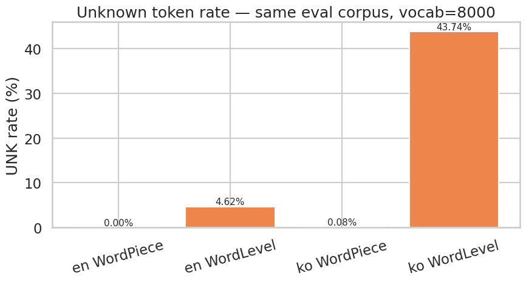
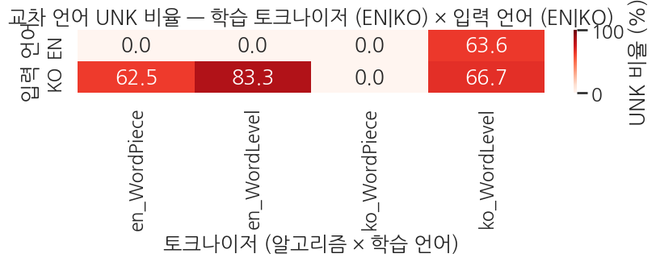

> ▶ **[Google Colab에서 이 장 실습 열기](https://colab.research.google.com/github/yoon-gu/neuqes-101/blob/master/19_tokenizer_training/19_tokenizer_training.ipynb)** — 브라우저에서 바로 실행해 볼 수 있습니다.

## 환경 준비

```python
%pip install -q -U tokenizers transformers datasets
```

**▶ 실행 결과**

```text
   ━━━━━━━━━━━━━━━━━━━━━━━━━━━━━━━━━━━━━━━━ 11.2/11.2 MB 85.7 MB/s eta 0:00:00
   ━━━━━━━━━━━━━━━━━━━━━━━━━━━━━━━━━━━━━━━━ 555.1/555.1 kB 48.3 MB/s eta 0:00:00
   ━━━━━━━━━━━━━━━━━━━━━━━━━━━━━━━━━━━━━━━━ 0.0/48.9 MB ? eta -:--:--
   ━━━━━━━━━━━━━━━━━━━━━━━━━━━━━━━╺━━━━━━━━ 38.3/48.9 MB 171.9 MB/s eta 0:00:01
   ━━━━━━━━━━━━━━━━━━━━━━━━━━━━━━━━━━━━━━━╸ 48.9/48.9 MB 128.0 MB/s eta 0:00:01
   ━━━━━━━━━━━━━━━━━━━━━━━━━━━━━━━━━━━━━━━━ 48.9/48.9 MB 17.0 MB/s eta 0:00:00
```

```python
import warnings
warnings.filterwarnings("ignore")

import json
import time
from collections import Counter

import numpy as np
import pandas as pd
import matplotlib.pyplot as plt
import seaborn as sns
import torch

from datasets import load_dataset
from tokenizers import Tokenizer
from tokenizers.models import WordPiece, WordLevel
from tokenizers.trainers import WordPieceTrainer, WordLevelTrainer
from tokenizers.pre_tokenizers import Whitespace, BertPreTokenizer
from tokenizers.normalizers import NFD, Lowercase, StripAccents, Sequence as NormSequence
from tokenizers.processors import TemplateProcessing
from tokenizers.decoders import WordPiece as WordPieceDecoder
from transformers import PreTrainedTokenizerFast

# matplotlib 한글 폰트 (Colab — NanumGothic). plot 의 한국어가 □ 로 깨지지 않게.
import matplotlib.pyplot as plt, matplotlib.font_manager as fm, subprocess, os
_fp = "/usr/share/fonts/truetype/nanum/NanumGothic.ttf"
if not os.path.exists(_fp):
    subprocess.run("apt-get -qq -y install fonts-nanum", shell=True)
fm.fontManager.addfont(_fp)
plt.rcParams["font.family"] = "NanumGothic"
plt.rcParams["axes.unicode_minus"] = False

print(f"PyTorch:        {torch.__version__}")
print(f"CUDA available: {torch.cuda.is_available()}")
if torch.cuda.is_available():
    print(f"GPU:             {torch.cuda.get_device_name(0)}")
else:
    print("Note: this chapter does not train a model, so CPU is fine.")
```

**▶ 실행 결과**

```text
PyTorch:        2.11.0+cu128
CUDA available: True
GPU:             Tesla T4
```

먼저 영어 코퍼스를 준비합니다. Yelp 리뷰 5,000문장을 받아 토크나이저 학습용 텍스트 리스트로 만들고, 문장당 문자 길이 분포를 확인합니다.

```python
SEED = 42
N_EN = 5000

ds_yelp = load_dataset("fancyzhx/yelp_polarity", split=f"train[:{N_EN}]")
texts_en = list(ds_yelp["text"])
print(f"english corpus: {len(texts_en):,} sentences")
print(f"first sample (truncated):\n  {texts_en[0][:200]}...")
print(f"\nchar length stats:")
char_lens_en = [len(t) for t in texts_en]
print(f"  mean: {np.mean(char_lens_en):.0f}, median: {np.median(char_lens_en):.0f}, max: {max(char_lens_en)}")
```

**▶ 실행 결과**

```text
english corpus: 5,000 sentences
first sample (truncated):
  Unfortunately, the frustration of being Dr. Goldberg's patient is a repeat of the experience I've had with so many other doctors in NYC -- …(뒤 65자 생략)

char length stats:
  mean: 735, median: 548, max: 5038
```

같은 방식으로 한국어 코퍼스도 준비합니다. NSMC(네이버 영화 리뷰) 학습셋을 내려받아 5,000문장을 무작위 추출합니다. 영어와 한국어를 나란히 학습해 언어별 토큰화 차이를 비교하기 위함입니다.

```python
TRAIN_URL = "https://raw.githubusercontent.com/e9t/nsmc/master/ratings_train.txt"

print("downloading NSMC train from GitHub...")
df_nsmc = pd.read_csv(TRAIN_URL, sep="\t").dropna(subset=["document"])
print(f"  total rows: {len(df_nsmc):,}")

N_KO = 5000
texts_ko = df_nsmc["document"].sample(n=N_KO, random_state=SEED).tolist()
print(f"\nkorean corpus: {len(texts_ko):,} sentences")
print(f"first sample:\n  {texts_ko[0]}")
print(f"\nchar length stats:")
char_lens_ko = [len(t) for t in texts_ko]
print(f"  mean: {np.mean(char_lens_ko):.0f}, median: {np.median(char_lens_ko):.0f}, max: {max(char_lens_ko)}")
```

**▶ 실행 결과**

```text
downloading NSMC train from GitHub...
  total rows: 149,995

korean corpus: 5,000 sentences
first sample:
  원본이 최고

char length stats:
  mean: 34, median: 26, max: 143
```

이 챕터의 핵심입니다. 사전학습된 토크나이저를 받아오는 대신, `tokenizers` 라이브러리로 토크나이저를 *코퍼스에서 직접 학습* 합니다. `build_wordpiece()` 는 BERT 표준인 WordPiece(서브워드) 토크나이저를, `build_wordlevel()` 은 비교용 WordLevel(어절 단위) 토크나이저를 만듭니다. 두 함수 모두 모델·normalizer·pre-tokenizer 를 조립한 뒤 `train_from_iterator()` 로 vocab 을 학습합니다.

```python
SPECIAL_TOKENS = ["[PAD]", "[UNK]", "[CLS]", "[SEP]", "[MASK]"]
VOCAB_SIZE = 8000


def build_wordpiece(corpus_iter, vocab_size=VOCAB_SIZE, lowercase=True):
    '''같은 corpus 에 대해 WordPiece 토크나이저를 학습해 반환.'''
    tok = Tokenizer(WordPiece(unk_token="[UNK]"))
    norms = [NFD(), StripAccents()]
    if lowercase:
        norms.append(Lowercase())
    tok.normalizer = NormSequence(norms)
    tok.pre_tokenizer = BertPreTokenizer()
    tok.decoder = WordPieceDecoder(prefix="##")

    trainer = WordPieceTrainer(
        vocab_size=vocab_size,
        special_tokens=SPECIAL_TOKENS,
        continuing_subword_prefix="##",
        show_progress=False,
    )
    tok.train_from_iterator(corpus_iter, trainer=trainer)

    cls_id = tok.token_to_id("[CLS]")
    sep_id = tok.token_to_id("[SEP]")
    tok.post_processor = TemplateProcessing(
        single="[CLS] $A [SEP]",
        pair="[CLS] $A [SEP] $B:1 [SEP]:1",
        special_tokens=[("[CLS]", cls_id), ("[SEP]", sep_id)],
    )
    return tok


def build_wordlevel(corpus_iter, vocab_size=VOCAB_SIZE):
    '''같은 corpus 에 대해 WordLevel (어절 단위) 토크나이저를 학습해 반환.'''
    tok = Tokenizer(WordLevel(unk_token="[UNK]"))
    tok.pre_tokenizer = Whitespace()

    trainer = WordLevelTrainer(
        vocab_size=vocab_size,
        special_tokens=SPECIAL_TOKENS,
        show_progress=False,
    )
    tok.train_from_iterator(corpus_iter, trainer=trainer)
    return tok


print("helper builders ready: build_wordpiece(), build_wordlevel()")
```

**▶ 실행 결과**

```text
helper builders ready: build_wordpiece(), build_wordlevel()
```

이제 (영어/한국어) × (WordPiece/WordLevel) 조합으로 토크나이저 4개를 모두 같은 `vocab_size=8000` 으로 학습합니다. 각 학습에 걸린 시간을 함께 출력해, 모델 학습과 달리 토크나이저 학습이 GPU 없이 수 초 만에 끝남을 확인합니다.

```python
# 4개 토크나이저 학습 (vocab_size=8000)
t0 = time.time()
tok_en_wp = build_wordpiece(texts_en, lowercase=True)
t_en_wp = time.time() - t0
print(f"[1/4] en WordPiece  trained in {t_en_wp:.2f}s  vocab={tok_en_wp.get_vocab_size()}")

t0 = time.time()
tok_ko_wp = build_wordpiece(texts_ko, lowercase=False)  # 한국어는 lowercase 의미 없음
t_ko_wp = time.time() - t0
print(f"[2/4] ko WordPiece  trained in {t_ko_wp:.2f}s  vocab={tok_ko_wp.get_vocab_size()}")

t0 = time.time()
tok_en_wl = build_wordlevel(texts_en)
t_en_wl = time.time() - t0
print(f"[3/4] en WordLevel  trained in {t_en_wl:.2f}s  vocab={tok_en_wl.get_vocab_size()}")

t0 = time.time()
tok_ko_wl = build_wordlevel(texts_ko)
t_ko_wl = time.time() - t0
print(f"[4/4] ko WordLevel  trained in {t_ko_wl:.2f}s  vocab={tok_ko_wl.get_vocab_size()}")

print(f"\ntotal time: {t_en_wp + t_ko_wp + t_en_wl + t_ko_wl:.2f}s")
```

**▶ 실행 결과**

```text
[1/4] en WordPiece  trained in 1.44s  vocab=8000
[2/4] ko WordPiece  trained in 0.51s  vocab=8000
[3/4] en WordLevel  trained in 0.51s  vocab=8000
[4/4] ko WordLevel  trained in 0.08s  vocab=8000

total time: 2.53s
```

**결과 해석**

토크나이저 4개 모두 목표 `vocab=8000` 에 정확히 도달했고, 총 학습 시간이 2.53초에 불과합니다. 사전학습 모델 없이 코퍼스만으로 vocab 을 처음부터 쌓는 작업이 GPU 없이도 순식간에 끝남을 보여줍니다.

학습된 vocab 안을 직접 들여다봅니다. id 순서로 앞쪽 특수 토큰과 그 뒤 토큰을 출력하고, `##` prefix 가 붙은 서브워드 토큰이 전체 vocab 에서 차지하는 비율을 셉니다.

```python
def vocab_peek(tok, name, n=15):
    vocab = tok.get_vocab()
    items = sorted(vocab.items(), key=lambda x: x[1])  # id 순서
    print(f"=== {name}  (size={len(vocab)}) ===")
    print(f"  first 5 ids (specials): {[t for t, _ in items[:5]]}")
    print(f"  ids 5-20             : {[t for t, _ in items[5:20]]}")
    # ## prefix 토큰 (subword) 개수
    sub = sum(1 for t in vocab if t.startswith('##'))
    print(f"  subword (##) tokens  : {sub}  ({sub/len(vocab):.1%} of vocab)")
    print()

vocab_peek(tok_en_wp, "en WordPiece")
vocab_peek(tok_ko_wp, "ko WordPiece")
vocab_peek(tok_en_wl, "en WordLevel")
vocab_peek(tok_ko_wl, "ko WordLevel")
```

**▶ 실행 결과**

```text
=== en WordPiece  (size=8000) ===
  first 5 ids (specials): ['[PAD]', '[UNK]', '[CLS]', '[SEP]', '[MASK]']
  ids 5-20             : ['!', '"', '#', '$', '%', '&', "'", '(', ')', '*', '+', ',', '-', '.', '/']
  subword (##) tokens  : 1735  (21.7% of vocab)

=== ko WordPiece  (size=8000) ===
  first 5 ids (specials): ['[PAD]', '[UNK]', '[CLS]', '[SEP]', '[MASK]']
  ids 5-20             : ['!', '"', '%', '&', "'", '(', ')', '*', '+', ',', '-', '.', '/', '0', '1']
  subword (##) tokens  : 3349  (41.9% of vocab)

=== en WordLevel  (size=8000) ===
  first 5 ids (specials): ['[PAD]', '[UNK]', '[CLS]', '[SEP]', '[MASK]']
  ids 5-20             : ['.', 'the', ',', 'and', 'I', 'a', 'to', "'", 'was', 'of', '\\', 'it', 'in', 'is', 'for']
  subword (##) tokens  : 0  (0.0% of vocab)

=== ko WordLevel  (size=8000) ===
  first 5 ids (specials): ['[PAD]', '[UNK]', '[CLS]', '[SEP]', '[MASK]']
  ids 5-20             : ['.', '..', '...', '영화', ',', '?', '정말', '!', '너무', '진짜', '~', '이', '....', '더', '왜']
  subword (##) tokens  : 0  (0.0% of vocab)
```

**결과 해석**

WordPiece 한국어는 `##` 서브워드가 vocab 의 41.9% 로, 영어(21.7%)의 거의 두 배입니다. 교착어인 한국어가 어근+조사·어미를 서브워드로 더 많이 쪼개기 때문입니다. WordLevel 은 어절 단위라 두 언어 모두 `##` 토큰이 0개이며, 한국어 vocab 상위에는 `영화`·`정말`·`너무` 같은 통째 어절이 자리합니다.

학습한 토크나이저를 *처음 보는* 평가 코퍼스(영어·한국어 각 1,000문장)에 적용해, 문장당 토큰 수의 평균·중앙값·p95 를 비교합니다.

```python
N_EVAL = 1000
eval_en = list(load_dataset("fancyzhx/yelp_polarity", split=f"train[{N_EN}:{N_EN + N_EVAL}]")["text"])
eval_ko = df_nsmc["document"].sample(n=N_EVAL, random_state=SEED + 1).tolist()


def token_lens(tok, texts):
    return [len(tok.encode(t).tokens) for t in texts]


len_en_wp = token_lens(tok_en_wp, eval_en)
len_en_wl = token_lens(tok_en_wl, eval_en)
len_ko_wp = token_lens(tok_ko_wp, eval_ko)
len_ko_wl = token_lens(tok_ko_wl, eval_ko)

stats = pd.DataFrame({
    "tokenizer": ["en WordPiece", "en WordLevel", "ko WordPiece", "ko WordLevel"],
    "mean_tokens": [np.mean(len_en_wp), np.mean(len_en_wl),
                    np.mean(len_ko_wp), np.mean(len_ko_wl)],
    "median_tokens": [np.median(len_en_wp), np.median(len_en_wl),
                      np.median(len_ko_wp), np.median(len_ko_wl)],
    "p95_tokens": [np.percentile(len_en_wp, 95), np.percentile(len_en_wl, 95),
                   np.percentile(len_ko_wp, 95), np.percentile(len_ko_wl, 95)],
})
print(stats.to_string(index=False))
```

**▶ 실행 결과**

```text
   tokenizer  mean_tokens  median_tokens  p95_tokens
en WordPiece      176.571          139.0      469.05
en WordLevel      159.220          126.5      426.10
ko WordPiece       19.804           15.0       57.05
ko WordLevel        9.106            7.0       27.00
```

**결과 해석**

같은 문장이라도 WordLevel 이 WordPiece 보다 토큰 수가 적습니다(한국어 9.1 vs 19.8). 어절을 통째로 1토큰 처리하기 때문인데, 이 짧은 길이는 곧 뒤에서 보듯 다량의 `[UNK]` 와 맞바꾼 결과입니다.

위 토큰 수 분포를 영어·한국어로 나눠 밀도 곡선으로 그립니다.

```python
sns.set_theme(style="whitegrid", context="talk", font="NanumGothic", rc={"axes.unicode_minus": False})
fig, axes = plt.subplots(1, 2, figsize=(14, 5), sharey=True)

# 영어
sns.kdeplot(len_en_wp, ax=axes[0], color="tab:blue", fill=True, alpha=0.4, label="WordPiece")
sns.kdeplot(len_en_wl, ax=axes[0], color="tab:orange", fill=True, alpha=0.4, label="WordLevel")
axes[0].set_title("영어 (Yelp) — 문장당 토큰 수")
axes[0].set_xlabel("문장당 토큰 수")
axes[0].set_ylabel("밀도")
axes[0].legend()
axes[0].set_xlim(0, 400)

# 한국어
sns.kdeplot(len_ko_wp, ax=axes[1], color="tab:blue", fill=True, alpha=0.4, label="WordPiece")
sns.kdeplot(len_ko_wl, ax=axes[1], color="tab:orange", fill=True, alpha=0.4, label="WordLevel")
axes[1].set_title("한국어 (NSMC) — 문장당 토큰 수")
axes[1].set_xlabel("문장당 토큰 수")
axes[1].legend()
axes[1].set_xlim(0, 80)

plt.tight_layout()
plt.show()
```

**▶ 실행 결과**


토큰 수가 짧다고 좋은 토크나이저는 아닙니다. 미등록 단어가 `[UNK]` 로 바뀌면 정보가 사라지기 때문입니다. 평가 코퍼스에서 전체 토큰 대비 `[UNK]` 비율을 토크나이저별로 집계합니다.

```python
def unk_rate(tok, texts):
    total_tokens = 0
    unk_tokens = 0
    for t in texts:
        toks = tok.encode(t).tokens
        total_tokens += len(toks)
        unk_tokens += sum(1 for tk in toks if tk == "[UNK]")
    return unk_tokens / total_tokens if total_tokens > 0 else 0.0


unk_summary = pd.DataFrame({
    "tokenizer": ["en WordPiece", "en WordLevel", "ko WordPiece", "ko WordLevel"],
    "unk_rate": [
        unk_rate(tok_en_wp, eval_en),
        unk_rate(tok_en_wl, eval_en),
        unk_rate(tok_ko_wp, eval_ko),
        unk_rate(tok_ko_wl, eval_ko),
    ],
})
unk_summary["unk_pct"] = unk_summary["unk_rate"].apply(lambda x: f"{x:.2%}")
print(unk_summary[["tokenizer", "unk_pct"]].to_string(index=False))
```

**▶ 실행 결과**

```text
   tokenizer unk_pct
en WordPiece   0.00%
en WordLevel   4.62%
ko WordPiece   0.08%
ko WordLevel  43.74%
```

**결과 해석**

한국어 WordLevel 의 UNK 비율이 43.74% 로 압도적입니다. 교착어 특성상 같은 어근에 조사·어미가 다르게 붙은 어절이 모두 별개 vocab 항목이라, 8K vocab 으로는 평가 문장의 절반 가까운 토큰을 담지 못합니다. 반면 WordPiece 는 두 언어 모두 UNK 가 0.1% 이하로, 서브워드 분할이 미등록 문제를 사실상 해소함을 보여줍니다.

같은 UNK 비율을 막대그래프로 시각화합니다.

```python
sns.set_theme(style="whitegrid", context="talk", font="NanumGothic", rc={"axes.unicode_minus": False})
fig, ax = plt.subplots(figsize=(9, 5))
colors = ["#4878D0", "#EE854A", "#4878D0", "#EE854A"]
bars = ax.bar(unk_summary["tokenizer"], unk_summary["unk_rate"] * 100, color=colors)
for bar, rate in zip(bars, unk_summary["unk_rate"]):
    ax.text(bar.get_x() + bar.get_width() / 2, bar.get_height() + 0.1,
            f"{rate:.2%}", ha="center", va="bottom", fontsize=11)
ax.set_ylabel("UNK 비율 (%)")
ax.set_title("미등록 토큰 비율 — 동일 eval 코퍼스, vocab=8000")
ax.tick_params(axis="x", rotation=15)
plt.tight_layout()
plt.show()
```

**▶ 실행 결과**



앞서 본 토큰 수와 UNK 비율을 (언어 × 알고리즘) 2×2 표 하나로 정리합니다.

```python
summary_2x2 = pd.DataFrame({
    "language": ["English", "English", "Korean", "Korean"],
    "algorithm": ["WordPiece", "WordLevel", "WordPiece", "WordLevel"],
    "vocab_size": [tok_en_wp.get_vocab_size(), tok_en_wl.get_vocab_size(),
                   tok_ko_wp.get_vocab_size(), tok_ko_wl.get_vocab_size()],
    "mean_tokens_per_sent": [np.mean(len_en_wp), np.mean(len_en_wl),
                              np.mean(len_ko_wp), np.mean(len_ko_wl)],
    "p95_tokens_per_sent": [np.percentile(len_en_wp, 95), np.percentile(len_en_wl, 95),
                             np.percentile(len_ko_wp, 95), np.percentile(len_ko_wl, 95)],
    "unk_rate_pct": [unk_rate(tok_en_wp, eval_en) * 100,
                     unk_rate(tok_en_wl, eval_en) * 100,
                     unk_rate(tok_ko_wp, eval_ko) * 100,
                     unk_rate(tok_ko_wl, eval_ko) * 100],
})

# 보기 좋게 둥글리기
for col in ["mean_tokens_per_sent", "p95_tokens_per_sent", "unk_rate_pct"]:
    summary_2x2[col] = summary_2x2[col].round(2)

print(summary_2x2.to_string(index=False))
```

**▶ 실행 결과**

```text
language algorithm  vocab_size  mean_tokens_per_sent  p95_tokens_per_sent  unk_rate_pct
 English WordPiece        8000                176.57               469.05          0.00
 English WordLevel        8000                159.22               426.10          4.62
  Korean WordPiece        8000                 19.80                57.05          0.08
  Korean WordLevel        8000                  9.11                27.00         43.74
```

학습 언어와 입력 언어가 어긋나면 어떻게 되는지 교차 적용으로 확인합니다. 영어·한국어 예시 문장을 4개 토크나이저에 모두 통과시켜, 학습 언어와 *맞는* 경우와 *어긋나는*(cross) 경우의 토큰 수·UNK 를 비교합니다.

```python
# 4 토크나이저를 dict 로 묶어 cross-language 분석에 사용
tokenizers = {
    "en_WordPiece": tok_en_wp,
    "en_WordLevel": tok_en_wl,
    "ko_WordPiece": tok_ko_wp,
    "ko_WordLevel": tok_ko_wl,
}

# 교차 적용: 영어/한국어 예시 문장을 모두 4 토크나이저에 통과
cross_examples = [
    ("EN", "The food was absolutely delicious and the service was great."),
    ("KO", "음식이 정말 맛있었고 서비스도 훌륭했습니다."),
]

cross_rows = []
for lang, text in cross_examples:
    for tok_name, tok in tokenizers.items():
        enc = tok.encode(text)
        n_tokens = len(enc.tokens)
        n_unk = sum(1 for t in enc.tokens if t == "[UNK]")
        cross_rows.append({
            "input_lang": lang,
            "tokenizer": tok_name,
            "tokenizer_train_lang": "EN" if "en_" in tok_name else "KO",
            "n_tokens": n_tokens,
            "n_unk": n_unk,
            "unk_pct": round(n_unk / n_tokens * 100, 1) if n_tokens else 0.0,
            "match": "✅ same" if (lang.lower() in tok_name.lower()[:5]) else "❌ cross",
        })

cross_df = pd.DataFrame(cross_rows)
print(cross_df.to_string(index=False))
```

**▶ 실행 결과**

```text
input_lang    tokenizer tokenizer_train_lang  n_tokens  n_unk  unk_pct   match
        EN en_WordPiece                   EN        13      0      0.0  ✅ same
        EN en_WordLevel                   EN        11      0      0.0  ✅ same
        EN ko_WordPiece                   KO        40      0      0.0 ❌ cross
        EN ko_WordLevel                   KO        11      7     63.6 ❌ cross
        KO en_WordPiece                   EN         8      5     62.5 ❌ cross
        KO en_WordLevel                   EN         6      5     83.3 ❌ cross
        KO ko_WordPiece                   KO        14      0      0.0  ✅ same
        KO ko_WordLevel                   KO         6      4     66.7  ✅ same
```

**결과 해석**

학습 언어와 입력 언어가 어긋난 행은 UNK 비율이 치솟습니다(영어 입력 → 한국어 WordLevel 63.6%, 한국어 입력 → 영어 WordLevel 83.3%). 토크나이저가 학습 코퍼스에 *본 적 없는* 문자·어절을 거의 다 `[UNK]` 로 떨어뜨리기 때문입니다. WordPiece 교차의 경우 UNK 는 적지만(영어→ko WordPiece 0%) 대신 토큰 수가 40개로 폭증해, 모르는 문자를 잘게 쪼개 처리함을 보여줍니다.

UNK 비율은 같지만 *실제 토큰 분할* 이 어떻게 다른지 첫 12개 토큰을 직접 출력합니다.

```python
# 같은 입력을 토크나이저 별로 실제로 어떻게 쪼개는지 (첫 12 토큰)
print("=" * 78)
for lang, text in cross_examples:
    print(f"\n[input ({lang})]  {text}")
    for tok_name, tok in tokenizers.items():
        enc = tok.encode(text)
        cross = "❌" if (lang.lower()[:2] not in tok_name.lower()[:5]) else "  "
        head = enc.tokens[:12]
        print(f"  {cross} {tok_name:18} ({len(enc.tokens):>3} tokens, UNK {sum(1 for t in enc.tokens if t=='[UNK]'):>2}): {head}")
```

**▶ 실행 결과**

```text
==============================================================================

[input (EN)]  The food was absolutely delicious and the service was great.
     en_WordPiece       ( 13 tokens, UNK  0): ['[CLS]', 'the', 'food', 'was', 'absolutely', 'delicious', 'and', 'the', 'service', 'was', 'great', '.']
     en_WordLevel       ( 11 tokens, UNK  0): ['The', 'food', 'was', 'absolutely', 'delicious', 'and', 'the', 'service', 'was', 'great', '.']
  ❌ ko_WordPiece       ( 40 tokens, UNK  0): ['[CLS]', 'Th', '##e', 'f', '##oo', '##d', 'w', '##a', '##s', 'a', '##b', '##s']
  ❌ ko_WordLevel       ( 11 tokens, UNK  7): ['The', '[UNK]', '[UNK]', '[UNK]', '[UNK]', 'and', 'the', '[UNK]', '[UNK]', '[UNK]', '.']

[input (KO)]  음식이 정말 맛있었고 서비스도 훌륭했습니다.
  ❌ en_WordPiece       (  8 tokens, UNK  5): ['[CLS]', '[UNK]', '[UNK]', '[UNK]', '[UNK]', '[UNK]', '.', '[SEP]']
  ❌ en_WordLevel       (  6 tokens, UNK  5): ['[UNK]', '[UNK]', '[UNK]', '[UNK]', '[UNK]', '.']
     ko_WordPiece       ( 14 tokens, UNK  0): ['[CLS]', '음', '##식이', '정말', '맛', '##있어', '##ᆻ고', '서', '##비스', '##도', '훌륭', '##했습니다']
     ko_WordLevel       (  6 tokens, UNK  4): ['[UNK]', '정말', '[UNK]', '[UNK]', '[UNK]', '.']
```

교차 언어 UNK 비율을 (토크나이저 × 입력 언어) 히트맵으로 한눈에 정리합니다. 대각선(언어 일치)은 옅고, 어긋난 칸은 붉게 나타나는지 확인합니다.

```python
# 시각화: UNK 비율 4×2 매트릭스 (가로 토크나이저, 세로 입력 언어)
fig, ax = plt.subplots(figsize=(8.5, 3.6))
pivot = cross_df.pivot(index="input_lang", columns="tokenizer", values="unk_pct")
pivot = pivot[list(tokenizers.keys())]   # 열 순서 유지
sns.heatmap(pivot, annot=True, fmt=".1f", cmap="Reds", vmin=0, vmax=100,
            cbar_kws={"label": "UNK 비율 (%)"}, ax=ax)
ax.set_title("교차 언어 UNK 비율 — 학습 토크나이저 (EN|KO) × 입력 언어 (EN|KO)")
ax.set_xlabel("토크나이저 (알고리즘 × 학습 언어)")
ax.set_ylabel("입력 언어")
plt.tight_layout(); plt.show()
```

**▶ 실행 결과**



학습한 토크나이저는 단일 JSON 파일로 저장해 두면 다음 챕터에서 재사용할 수 있습니다. 4개 토크나이저를 각각 파일로 저장하고 크기를 출력합니다.

```python
import os
os.makedirs("./tokenizers_ch19", exist_ok=True)

# 1) 4개 토크나이저를 각각 json 파일로 저장
tok_en_wp.save("./tokenizers_ch19/en_wordpiece.json")
tok_ko_wp.save("./tokenizers_ch19/ko_wordpiece.json")
tok_en_wl.save("./tokenizers_ch19/en_wordlevel.json")
tok_ko_wl.save("./tokenizers_ch19/ko_wordlevel.json")

print("saved 4 tokenizer files:")
for p in sorted(os.listdir("./tokenizers_ch19")):
    size_kb = os.path.getsize(f"./tokenizers_ch19/{p}") / 1024
    print(f"  ./tokenizers_ch19/{p}  ({size_kb:.1f} KB)")
```

**▶ 실행 결과**

```text
saved 4 tokenizer files:
  ./tokenizers_ch19/en_wordlevel.json  (172.5 KB)
  ./tokenizers_ch19/en_wordpiece.json  (170.3 KB)
  ./tokenizers_ch19/ko_wordlevel.json  (205.9 KB)
  ./tokenizers_ch19/ko_wordpiece.json  (251.6 KB)
```

저장한 파일을 `Tokenizer.from_file()` 로 다시 불러와, 같은 문장을 인코딩한 결과가 원본과 토큰 단위로 일치하는지(round-trip) 확인합니다.

```python
# 2) Tokenizer.from_file() 로 다시 로드
tok_en_wp_loaded = Tokenizer.from_file("./tokenizers_ch19/en_wordpiece.json")
enc_orig = tok_en_wp.encode(SAMPLE_EN).tokens
enc_loaded = tok_en_wp_loaded.encode(SAMPLE_EN).tokens
print(f"original tokens : {enc_orig}")
print(f"loaded tokens   : {enc_loaded}")
print(f"match           : {enc_orig == enc_loaded}")
```

**▶ 실행 결과**

```text
original tokens : ['[CLS]', 'the', 'food', 'was', 'unf', '##orge', '##tt', '##able', 'and', 'the', 'service', 'was', 'excellent', '.', '[SEP]']
loaded tokens   : ['[CLS]', 'the', 'food', 'was', 'unf', '##orge', '##tt', '##able', 'and', 'the', 'service', 'was', 'excellent', '.', '[SEP]']
match           : True
```

**결과 해석**

로드한 토크나이저의 토큰 시퀀스가 원본과 정확히 같아 `match: True` 입니다. JSON 한 파일에 모델·normalizer·vocab·post-processor 가 모두 직렬화되므로, 저장·로드만으로 동일한 토크나이저를 완전히 복원할 수 있음을 확인합니다.

마지막으로, 직접 학습한 토크나이저를 `PreTrainedTokenizerFast` 로 감싸 Ch 7 이후 익숙했던 HF 표준 인터페이스로 변환합니다. 이제 같은 호출(`padding`·`truncation`·`return_tensors`)을 *직접 학습한* 토크나이저로 그대로 쓸 수 있습니다.

```python
# 3) PreTrainedTokenizerFast 로 wrap — HF 표준 인터페이스로 변환
hf_en_wp = PreTrainedTokenizerFast(
    tokenizer_object=tok_en_wp,
    unk_token="[UNK]",
    pad_token="[PAD]",
    cls_token="[CLS]",
    sep_token="[SEP]",
    mask_token="[MASK]",
)

print(f"vocab_size      : {hf_en_wp.vocab_size}")
print(f"pad_token_id    : {hf_en_wp.pad_token_id}")
print(f"cls_token_id    : {hf_en_wp.cls_token_id}")

# Ch 7+ 에서 본 익숙한 호출 — 이제 *직접 학습한* 토크나이저로 동일 결과
enc = hf_en_wp(SAMPLE_EN, padding=True, truncation=True, max_length=32, return_tensors="pt")
print(f"\ninput_ids shape : {enc['input_ids'].shape}")
print(f"input_ids       : {enc['input_ids'][0].tolist()}")
print(f"decoded         : {hf_en_wp.decode(enc['input_ids'][0])}")
```

**▶ 실행 결과**

```text
vocab_size      : 8000
pad_token_id    : 0
cls_token_id    : 2

input_ids shape : torch.Size([1, 15])
input_ids       : [2, 107, 218, 128, 4814, 5350, 3763, 300, 115, 107, 312, 128, 956, 18, 3]
decoded         : [CLS] the food was unforgettable and the service was excellent. [SEP]
```

**결과 해석**

`vocab_size=8000`, `pad_token_id=0`, `cls_token_id=2` 가 특수 토큰 설정대로 잡혔고, 호출 한 번으로 `[CLS]`/`[SEP]` 가 부착된 패딩·텐서 출력이 나옵니다. `decode` 결과가 원문을 그대로 복원해, 처음부터 학습한 토크나이저가 사전학습 모델과 동일한 인터페이스로 곧바로 쓰일 수 있음을 보여줍니다.
