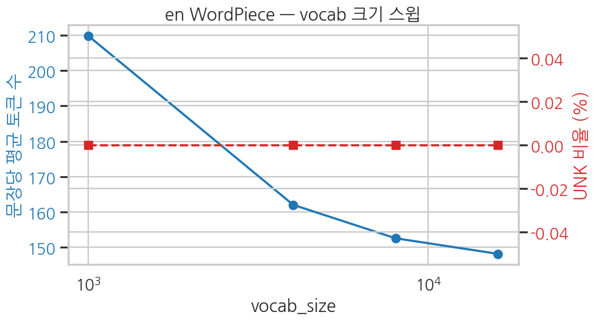

`vocab_size` 를 1K / 4K / 8K / 16K 로 sweep 하며 영어 WordPiece 의 mean 토큰 수와 UNK 비율이 어떻게 변하는지. vocab 이 *작을수록* 토큰 수는 늘고, *클수록* 토큰 수는 줄지만 vocab 자체가 무거워짐 — 모델 크기와의 trade-off.

```python
sweep_results = []
for vs in [1000, 4000, 8000, 16000]:
    t = build_wordpiece(texts_en, vocab_size=vs, lowercase=True)
    lens = token_lens(t, eval_en[:200])  # 빠른 평가: 200건만
    unk = unk_rate(t, eval_en[:200])
    sweep_results.append({
        "vocab_size": vs,
        "actual_vocab": t.get_vocab_size(),
        "mean_tokens": float(np.mean(lens)),
        "p95_tokens": float(np.percentile(lens, 95)),
        "unk_rate_pct": float(unk * 100),
    })

df_sweep = pd.DataFrame(sweep_results)
print(df_sweep.to_string(index=False))
```

**▶ 실행 결과**

```text
 vocab_size  actual_vocab  mean_tokens  p95_tokens  unk_rate_pct
       1000          1000      209.815      557.35           0.0
       4000          4000      161.980      436.85           0.0
       8000          8000      152.510      412.30           0.0
      16000         16000      148.095      398.30           0.0
```

```python
sns.set_theme(style="whitegrid", context="talk", font="NanumGothic", rc={"axes.unicode_minus": False})
fig, ax1 = plt.subplots(figsize=(9, 5))

ax1.plot(df_sweep["vocab_size"], df_sweep["mean_tokens"], "o-", color="tab:blue", label="문장당 평균 토큰 수")
ax1.set_xlabel("vocab_size")
ax1.set_ylabel("문장당 평균 토큰 수", color="tab:blue")
ax1.tick_params(axis="y", labelcolor="tab:blue")
ax1.set_xscale("log")

ax2 = ax1.twinx()
ax2.plot(df_sweep["vocab_size"], df_sweep["unk_rate_pct"], "s--", color="tab:red", label="UNK 비율 (%)")
ax2.set_ylabel("UNK 비율 (%)", color="tab:red")
ax2.tick_params(axis="y", labelcolor="tab:red")

ax1.set_title("en WordPiece — vocab 크기 스윕")
plt.tight_layout()
plt.show()
```

**▶ 실행 결과**



**해석**

- vocab 1K — 한 단어가 평균 1.5 조각 가까이로 쪼개져 sequence 가 가장 길어짐. 그래도 UNK 는 거의 없음 — subword 라 모르는 단어를 *조각* 으로 표현할 수 있기 때문입니다.
- vocab 8K-16K — 한 단어가 거의 1 조각에 수렴해 sequence 길이가 안정. UNK 는 계속 0% 수준.
- 표준 BERT (vocab 30K) 는 이 curve 의 *오른쪽 끝* — 한 단어가 거의 1 토큰에 수렴.

> **실무 가이드** — 사전학습 BERT 와 같은 *모델 크기* 를 노린다면 vocab 30K, 작은 모델 (Ch 20 의 scratch BERT) 이면 8K-16K 가 적절. vocab 이 커지면 임베딩 테이블 파라미터도 커지니 ($V \times H$) 모델 전체 크기와 함께 결정해야 합니다.
