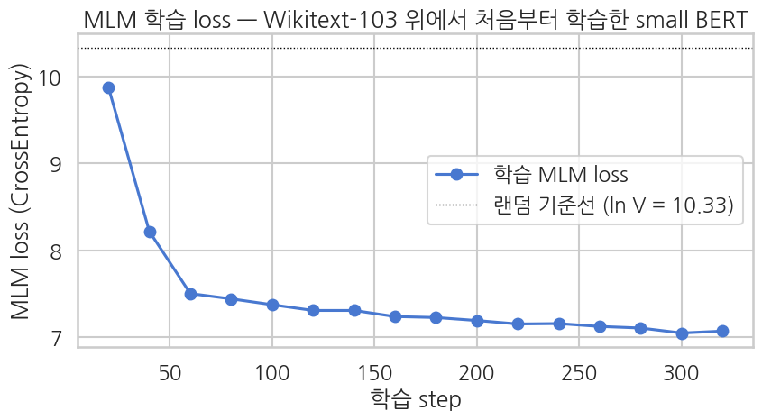
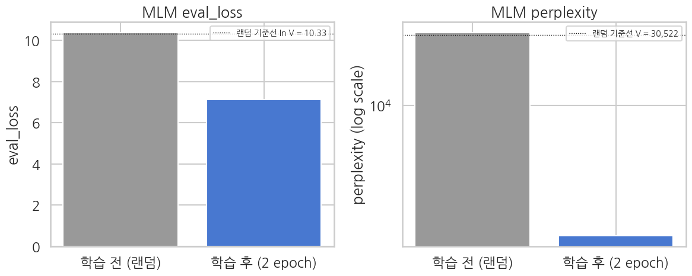

## 평가 — MLM loss 곡선 + perplexity + masked token 예측

학습이 *실제로 진행* 됐는지 세 각도로 확인:
1. step-by-step train loss 곡선 — 빠르게 10.33 (random baseline) → 약 7 부근으로 떨어졌는지
2. eval set 의 perplexity — 외부 텍스트에서도 일관된 수준인지
3. 임의 문장에 `[MASK]` 를 끼워 top-5 후보 출력 — *어떤 단어를 예측하는지* 정성 평가

먼저 loss 곡선입니다. `TrainingArguments(logging_steps=20)` 덕분에 20 step 마다 찍힌 기록이 `trainer.state.log_history` 에 남아 있으므로, 별도 콜백 없이 그대로 꺼내 그립니다. random baseline 을 점선으로 함께 그어 *어디서 출발해 어디까지 내려왔는지* 를 한눈에 봅니다.

```python
# 학습 로그에서 train loss 추출
log_history = trainer.state.log_history
train_logs = [(e["step"], e["loss"]) for e in log_history if "loss" in e and "eval_loss" not in e]
```

**위 코드 읽기** `log_history` 에는 학습 기록과 평가 기록이 뒤섞여 쌓입니다. `"loss" in e and "eval_loss" not in e` 조건이 그중 학습 step 기록만 골라내는 필터입니다.

```python
if train_logs:
    steps, losses = zip(*train_logs)
    random_baseline = math.log(tokenizer.vocab_size)

    sns.set_theme(style="whitegrid", context="talk", font="NanumGothic", rc={"axes.unicode_minus": False})
    fig, ax = plt.subplots(figsize=(9, 5))
    ax.plot(steps, losses, "o-", color="#4878D0", label="학습 MLM loss")
    ax.axhline(random_baseline, color="black", lw=1.0, ls=":", label=f"랜덤 기준선 (ln V = {random_baseline:.2f})")
    ax.set_xlabel("학습 step")
    ax.set_ylabel("MLM loss (CrossEntropy)")
    ax.set_title("MLM 학습 loss — Wikitext-103 위에서 처음부터 학습한 small BERT")
    ax.legend()
    plt.tight_layout()
    plt.show()
else:
    print("No train loss logs found.")
```

**▶ 실행 결과**



**결과 해석**

10.33 점선 근처에서 출발한 loss 가 초반 수십 step 만에 8 아래로 급락한 뒤 7 부근에서 완만해집니다. 이 급락 구간이 *어떤 토큰이 흔한가* 를 배우는 단계이고, 뒤이은 평탄한 구간은 그 이상(문맥)을 배우려면 이 데이터·시간으로는 부족하다는 신호입니다.

이제 held-out 평가셋으로 같은 수치를 다시 재고, loss 를 지수화해 perplexity 로 바꿔 봅니다. perplexity 는 *마스크 자리마다 몇 개 후보를 두고 고민하는가* 라는 직관적 해석을 주므로 vocab 크기와 바로 견줄 수 있습니다.

```python
eval_metrics = trainer.evaluate()
eval_loss = eval_metrics["eval_loss"]
eval_ppl = math.exp(eval_loss)
```

**위 코드 읽기** `math.exp(eval_loss)` 한 줄이 loss 를 perplexity 로 바꿉니다. MLM loss 는 자연로그 기반 cross-entropy 라 지수를 취하면 곧바로 "유효 후보 개수" 가 되고, 그래서 vocab 크기 30,522 와 같은 축에서 비교할 수 있습니다.

```python
print("=== eval (held-out Wikitext-103 paragraphs) ===")
for k, v in eval_metrics.items():
    if isinstance(v, float):
        print(f"  {k:>22}: {v:.4f}")
print()
print(f"  MLM loss:               {eval_loss:.4f}")
print(f"  perplexity (exp loss):  {eval_ppl:.2f}")
print(f"  random baseline PPL:    {tokenizer.vocab_size:,}  (uniform over vocab)")
print(f"  -> model narrowed vocab to approx. {eval_ppl:.0f} candidates per masked position")
```

**▶ 실행 결과**

```text
Training Loss  Validation Loss  Epoch
7.072258       7.133166         2
=== eval (held-out Wikitext-103 paragraphs) ===
               eval_loss: 7.1332

  MLM loss:               7.1332
  perplexity (exp loss):  1252.84
  random baseline PPL:    30,522  (uniform over vocab)
  -> model narrowed vocab to approx. 1253 candidates per masked position
```

**결과 해석**

eval_loss 7.1332, perplexity 1,252.84 — 30,522 개 후보를 약 1,253 개로 좁힌 셈이니 24 배 줄었습니다. 숫자만 보면 큰 진전이지만, 그 1,253 이 *어느 수준인지* 는 6-3 의 unigram 기준선과 견줘 봐야 드러납니다.

### 6-1. 🔬 사전학습 전·후 비교 — random init 본체 vs 2 epoch 학습 후

학습 직전 (5번 마지막 셀에서 측정해 둔 `pre_eval_loss` / `pre_top5_records`) 와 *완전히 같은 문장·같은 평가 셋* 에 학습 후 모델을 적용해 두 결과를 나란히 봅니다. *사전학습이 본체에 무엇을 새겼는가* 의 가장 직접적인 증거.

> 학습 후 `eval_loss` 는 **6 절에서 잰 값을 그대로** 씁니다. MLM 평가는 `DataCollatorForLanguageModeling` 이 호출할 때마다 *다른 자리* 를 마스킹하므로, `trainer.evaluate()` 를 두 번 부르면 같은 모델·같은 평가셋인데도 값이 미세하게 달라집니다 — 비교의 기준을 하나로 고정하기 위해 재측정하지 않습니다. 같은 이유로 **학습 로그에 찍히는 epoch 별 `Validation Loss` 도 6 절의 값과 조금씩 다릅니다** — 오탈자가 아니라 MLM 평가가 매번 다른 자리를 마스킹하는 데서 오는 정상적인 편차입니다.

```python
# ---- 사전학습 후 eval_loss / perplexity ----
# 6 절에서 이미 잰 값을 그대로 씁니다. trainer.evaluate() 를 다시 부르면 collator 가
# 매번 *다른 자리* 를 마스킹하므로, 같은 모델·같은 평가셋인데도 값이 조금씩 달라집니다.
post_eval_loss = eval_loss
post_eval_ppl  = eval_ppl
```

**위 코드 읽기** 여기서 `trainer.evaluate()` 를 다시 부르지 않고 앞 셀 값을 재사용하는 것이 핵심입니다. MLM 평가는 호출할 때마다 마스킹 자리가 달라져 값이 미세하게 흔들리므로, 비교 기준을 하나로 못 박아 둡니다.

```python
print("=" * 78)
print("AFTER pretraining  (2 epoch MLM on Wikitext-103)")
print("=" * 78)
print(f"  eval_loss       : {post_eval_loss:.4f}   (before: {pre_eval_loss:.4f})")
print(f"  eval_perplexity : {post_eval_ppl:,.2f}        (before: {pre_eval_ppl:,.0f})")
print(f"  -> narrowed vocab to approx. {post_eval_ppl:.0f} candidates per masked position")
print()
```

**위 코드 읽기** 학습 전 값(`pre_eval_loss`·`pre_eval_ppl`)을 괄호 안에 나란히 찍어 한 줄에서 before/after 를 읽을 수 있게 했습니다. 두 값 모두 *같은 평가셋* 에서 나온 것이라 그대로 비교됩니다.

```python
# ---- 사전학습 후 [MASK] top-5 ----
post_top5_records = []
for sent in test_sentences:
    results = predict_mask(sent, top_k=5)
    top5_tokens = [tok for tok, _ in results[0][1]] if results else []
    post_top5_records.append({"sentence": sent, "top5_after": top5_tokens})
    print(f"input: {sent}")
    print(f"  top-5 after pretraining: {top5_tokens}")
    print()
```

**▶ 실행 결과**

```text
==============================================================================
AFTER pretraining  (2 epoch MLM on Wikitext-103)
==============================================================================
  eval_loss       : 7.1332   (before: 10.3721)
  eval_perplexity : 1,252.84        (before: 31,956)
  -> narrowed vocab to approx. 1253 candidates per masked position

input: The capital of France is [MASK].
  top-5 after pretraining: ['the', ',', '.', 'and', 'in']

input: Water freezes at [MASK] degrees Celsius.
  top-5 after pretraining: ['the', ',', '.', 'and', 'in']

input: The food at this restaurant was absolutely [MASK].
  top-5 after pretraining: ['the', ',', '.', 'and', 'of']

input: I would [MASK] recommend this place.
  top-5 after pretraining: ['the', ',', '.', 'and', 'in']
```

**결과 해석**

수치는 10.3721 → 7.1332 (perplexity 31,956 → 1,253) 으로 확실히 좋아졌는데, top-5 는 네 문장이 거의 똑같이 `the`, `,`, `.`, `and` 입니다. 학습 전의 난수 토큰이 *흔한 토큰* 으로 바뀐 것 자체가 진전이지만, 입력이 달라져도 답이 그대로라는 점에서 아직 문맥은 읽지 못하는 상태입니다.

### 6-2. eval_loss / perplexity — 수치 비교

두 측정치를 한 표·한 막대 그래프로.

before/after 두 값에 *이론적 random baseline* 까지 세 번째 열로 붙여 표로 만듭니다. 기준선을 같이 놓아야 "얼마나 내려갔나" 가 아니라 "출발점 대비 어디까지 왔나" 로 읽히기 때문입니다.

```python
# 사전·사후 수치 비교 표
metric_compare = pd.DataFrame({
    "metric":           ["eval_loss", "eval_perplexity"],
    "before (random)":  [pre_eval_loss,  pre_eval_ppl],
    "after (2 epoch)":  [post_eval_loss, post_eval_ppl],
    "random baseline":  [random_baseline_loss, float(tokenizer.vocab_size)],
})
print("Before vs After — eval metrics")
print(metric_compare.round(4).to_string(index=False))
```

**▶ 실행 결과**

```text
Before vs After — eval metrics
         metric  before (random)  after (2 epoch)  random baseline
      eval_loss          10.3721           7.1332          10.3262
eval_perplexity       31955.8444        1252.8376       30522.0000
```

**결과 해석**

학습 전 값 10.3721 / 31,956 이 random baseline 10.3262 / 30,522 을 아주 살짝 웃도는데, 이는 난수 가중치가 *균등보다도 조금 나쁜* 편향을 갖기 때문으로 정상입니다. 학습 후 7.1332 / 1,253 이 기준선 아래로 확실히 내려온 것이 사전학습이 실제로 무언가를 새겼다는 증거입니다.

같은 두 수치를 막대로도 그립니다. perplexity 는 3만과 1천 처럼 자릿수가 달라 선형 축에서는 뒤쪽 막대가 보이지 않으므로 로그 축을 씁니다.

```python
# 막대 그래프 두 장 (eval_loss / perplexity)
sns.set_theme(style="whitegrid", context="talk", font="NanumGothic", rc={"axes.unicode_minus": False})
fig, axes = plt.subplots(1, 2, figsize=(12, 5))

loss_values = [pre_eval_loss, post_eval_loss]
loss_labels = ["학습 전 (랜덤)", "학습 후 (2 epoch)"]
axes[0].bar(loss_labels, loss_values, color=["#999999", "#4878D0"])
axes[0].axhline(random_baseline_loss, color="black", lw=1.0, ls=":",
                label=f"랜덤 기준선 ln V = {random_baseline_loss:.2f}")
axes[0].set_ylabel("eval_loss")
axes[0].set_title("MLM eval_loss")
axes[0].legend(loc="upper right", fontsize=10)
```

**위 코드 읽기** 왼쪽 패널은 loss 를 그대로 막대로 그리고, `axhline(random_baseline_loss)` 점선으로 이론 기준선을 겹쳐 둡니다. 학습 전 막대가 이 점선에 닿아 있는지가 random init 이 제대로 됐는지의 눈대중 점검입니다.

```python
ppl_values = [pre_eval_ppl, post_eval_ppl]
axes[1].bar(loss_labels, ppl_values, color=["#999999", "#4878D0"])
axes[1].set_yscale("log")
axes[1].axhline(tokenizer.vocab_size, color="black", lw=1.0, ls=":",
                label=f"랜덤 기준선 V = {tokenizer.vocab_size:,}")
axes[1].set_ylabel("perplexity (log scale)")
axes[1].set_title("MLM perplexity")
axes[1].legend(loc="upper right", fontsize=10)
```

**위 코드 읽기** `set_yscale("log")` 가 오른쪽 패널의 관건입니다. 31,956 과 1,253 은 자릿수가 달라 선형 축이면 뒤 막대가 바닥에 붙어 버리는데, 로그 축에서는 두 막대의 *배수 차이* 가 높이 차이로 정직하게 보입니다.

```python
plt.tight_layout()
plt.show()
```

**▶ 실행 결과**



**결과 해석**

왼쪽에서 학습 전 막대가 점선(랜덤 기준선)에 정확히 닿아 있고 학습 후 막대만 뚜렷이 낮아진 것이, 이번 사전학습의 순 효과를 가장 간명하게 보여 주는 그림입니다. 오른쪽 로그 축에서는 그 차이가 약 25 배 축소로 나타납니다.

### 6-3. 📏 unigram 기준선 — 우리 모델은 지금 무엇을 배운 상태인가

학습 후 top-5 를 보면 *어떤 문장을 넣어도 거의 같은 답* (`the`, `,`, `.`, `and` …) 이 나옵니다. 버그처럼 보이지만 아닙니다 — **문맥을 전혀 쓰지 않는 모델에게는 그게 최선의 답** 이기 때문입니다. 입력이 무엇이든 *코퍼스에서 가장 흔한 토큰* 을 찍는 것이 기대 loss 를 최소화합니다.

그렇다면 "문맥은 전혀 못 쓰고 **빈도만** 아는 모델" 의 loss 는 정확히 얼마일까요? 학습 코퍼스의 **unigram 분포** 로 직접 계산해, 우리 모델이 `ln V` (균등) 와 그 사이 *어디쯤* 서 있는지 확인합니다. 이 한 줄이 *2 epoch 학습이 무엇을 새겼고 무엇을 아직 못 새겼는지* 를 확정해 줍니다.

> 엄밀히는 두 값의 측정 범위가 조금 다릅니다 — unigram 기준선은 eval 셋 *전체 토큰* 으로 계산하고, 모델의 `eval_loss` 는 collator 가 고른 *마스킹된 15% 자리* 에서만 계산됩니다. 마스크 위치가 무작위 균일 표본이라 비교 자체는 타당하지만, 80/10/10 중 *원본 그대로 유지되는 10%* 에서 모델이 입력을 그대로 베껴 얻는 이득이 섞여 있어 아래 출력의 '문맥으로 벌어들인 이득' 은 실제보다 조금 후하게 잡힙니다. 즉 문맥을 거의 못 배웠다는 결론은 이 보정을 감안하면 오히려 더 강해집니다.

```python
# 학습 코퍼스의 unigram(빈도) 분포 — "문맥을 전혀 안 쓰는 모델" 의 이론적 한계선
from collections import Counter

counter = Counter()
for ids in lm_train["input_ids"]:
    counter.update(ids)
total_tok = sum(counter.values())
V = tokenizer.vocab_size
```

**위 코드 읽기** `Counter` 로 학습 블록 전체의 토큰 등장 횟수를 셉니다. 여기에는 문맥 정보가 전혀 없고 *어떤 토큰이 몇 번 나왔는가* 뿐이라, 이 분포가 곧 "빈도만 아는 모델" 의 전부입니다.

```python
# 이 unigram 분포로 eval 셋을 예측했을 때의 cross-entropy (add-1 smoothing)
unigram_ce = -np.mean([
    math.log((counter[i] + 1) / (total_tok + V))
    for ids in lm_eval["input_ids"] for i in ids
])
unigram_ppl = math.exp(unigram_ce)
```

**위 코드 읽기** `(counter[i] + 1) / (total_tok + V)` 의 `+1`·`+V` 가 add-1 스무딩으로, 학습 코퍼스에 한 번도 안 나온 토큰이 eval 에 등장해도 확률 0 (loss 무한대) 이 되지 않게 막아 줍니다. 모델과 똑같이 `-log p` 의 평균을 내므로 두 값을 같은 자에 놓고 비교할 수 있습니다.

```python
print("=" * 78)
print("MLM loss 사다리 — 우리 모델은 지금 어디에 있나")
print("=" * 78)
print(f"  1) 균등 분포 (random init) : {random_baseline_loss:7.4f}   ppl {V:>9,.0f}")
print(f"  2) unigram (빈도만, 문맥 X): {unigram_ce:7.4f}   ppl {unigram_ppl:>9,.0f}")
print(f"  3) 우리 작은 BERT (2 epoch): {post_eval_loss:7.4f}   ppl {post_eval_ppl:>9,.0f}")
print()
print(f"  1) -> 2) : {random_baseline_loss - unigram_ce:+.4f} nats   <- 빈도만 배워도 이만큼 내려감")
print(f"  2) vs 3) : {unigram_ce - post_eval_loss:+.4f} nats   <- 문맥으로 벌어들인 이득 (양수면 unigram 보다 나음)")
print()
```

**위 코드 읽기** 세 줄이 곧 loss 사다리의 세 칸입니다 — 균등(10.33), unigram, 우리 모델. 아래 두 줄의 차이값 중 `unigram_ce - post_eval_loss` 가 **문맥으로 벌어들인 순이익** 에 해당하며, 이 값이 얼마나 작은지가 이 절의 결론입니다.

```python
corpus_top5 = [tokenizer.convert_ids_to_tokens(i) for i, _ in counter.most_common(5)]
shared = set.intersection(*[set(r["top5_after"]) for r in post_top5_records])
shared_ordered = [t for t in post_top5_records[0]["top5_after"] if t in shared]
print(f"  학습 코퍼스 top-5 unigram : {corpus_top5}")
print(f"  우리 모델의 top-5         : {post_top5_records[0]['top5_after']}")
print(f"  문장 4개가 공유하는 토큰  : {len(shared)}/5 개 — {shared_ordered}")
print( "                              (입력이 달라져도 답이 거의 안 바뀜 = 문맥을 아직 안 읽음)")
```

**위 코드 읽기** `counter.most_common(5)` 로 뽑은 *코퍼스 최다 빈도 토큰* 과 모델의 top-5 를 나란히 찍어 둘이 같은 목록인지 확인합니다. `set.intersection(...)` 은 문장 네 개의 top-5 가 몇 개나 겹치는지 세는데, 겹침이 클수록 입력을 안 보고 답한다는 뜻입니다.

**▶ 실행 결과**

```text
==============================================================================
MLM loss 사다리 — 우리 모델은 지금 어디에 있나
==============================================================================
  1) 균등 분포 (random init) : 10.3262   ppl    30,522
  2) unigram (빈도만, 문맥 X):  7.2525   ppl     1,412
  3) 우리 작은 BERT (2 epoch):  7.1332   ppl     1,253

  1) -> 2) : +3.0737 nats   <- 빈도만 배워도 이만큼 내려감
  2) vs 3) : +0.1193 nats   <- 문맥으로 벌어들인 이득 (양수면 unigram 보다 나음)

  학습 코퍼스 top-5 unigram : ['the', ',', '.', 'of', 'and']
  우리 모델의 top-5         : ['the', ',', '.', 'and', 'in']
  문장 4개가 공유하는 토큰  : 4/5 개 — ['the', ',', '.', 'and']
                              (입력이 달라져도 답이 거의 안 바뀜 = 문맥을 아직 안 읽음)
```

**결과 해석**

균등(10.3262)에서 unigram(7.2525)까지가 3.07 nats 인데, 우리 모델은 거기서 겨우 0.12 nats 를 더 벌었을 뿐입니다. 즉 2 epoch 이 새긴 것의 거의 전부가 **빈도 통계** 이며, 문장 네 개의 top-5 가 5 개 중 4 개나 겹치는 것도 같은 사실의 정성적 확인입니다.

### 6-4. 🏆 학습이 *충분히 잘 된 경우* 의 기준점 — 표준 `bert-base-uncased` 비교

우리 작은 BERT (약 11M, 5K paragraphs × 2 epoch) 는 방금 확인했듯 *unigram 분포까지* 도달한 상태 — 문맥은 아직 거의 못 씁니다. 이유는 단순합니다: **학습 데이터·모델 크기·학습 시간 모두 부족**. *그럼 사다리의 끝, 문맥을 제대로 배운 모델은 같은 자리에 무엇을 놓나?* 를 표준 `bert-base-uncased` (110M, 위키+BookCorpus 약 33억 토큰) 로 직접 봅니다.

같은 토크나이저 (`bert-base-uncased`) 를 쓰고 있으므로 *모델만 바꿔* 두 결과를 나란히.

```python
# 표준 bert-base-uncased 로드 — 학습이 충분히 잘 된 경우의 기준점
from transformers import AutoModelForMaskedLM

ref_model = AutoModelForMaskedLM.from_pretrained("bert-base-uncased")
ref_model.to(model.device)
ref_model.eval()
```

**위 코드 읽기** 이번에는 `from_pretrained` 입니다 — 지금까지 토크나이저만 가져오던 이름에서 **가중치까지** 내려받는, 이 챕터에서 유일하게 사전학습 weight 를 쓰는 자리입니다. `eval()` 로 dropout 을 꺼야 top-5 가 실행마다 흔들리지 않습니다.

```python
ref_param_count = sum(p.numel() for p in ref_model.parameters())
our_param_count = sum(p.numel() for p in model.parameters())
print(f"Our small BERT params: {our_param_count/1e6:.1f}M")
print(f"Reference BERT params: {ref_param_count/1e6:.1f}M  ({ref_param_count/our_param_count:.0f}x larger)")
```

**▶ 실행 결과**

```text
model.safetensors: downloading bytes:           |  0.00B            
[transformers] BertForMaskedLM LOAD REPORT from: bert-base-uncased
Key                         | Status     |  | 
----------------------------+------------+--+-
cls.seq_relationship.weight | UNEXPECTED |  | 
bert.pooler.dense.bias      | UNEXPECTED |  | 
cls.seq_relationship.bias   | UNEXPECTED |  | 
bert.pooler.dense.weight    | UNEXPECTED |  | 

Notes:
- UNEXPECTED:	can be ignored when loading from different task/architecture; not ok if you expect identical arch.
Our small BERT params: 11.1M
Reference BERT params: 109.5M  (10x larger)
```

**결과 해석**

`UNEXPECTED` 로 뜨는 `cls.seq_relationship.*`·`bert.pooler.*` 는 원본 BERT 가 함께 학습했던 NSP 헤드와 pooler 로, MLM 만 쓰는 `BertForMaskedLM` 에는 자리가 없어 버려집니다 — 경고가 아니라 정상 동작입니다. 파라미터는 10 배 차이지만, 학습 데이터 격차(5K 문단 vs 33억 토큰)가 훨씬 크다는 점을 염두에 두고 다음 비교를 보세요.

앞서 만든 `predict_mask` 는 전역 `model` 을 보도록 짜여 있으므로, 임의의 모델을 인자로 받는 쌍둥이 함수를 하나 더 만들어 reference 모델에 적용합니다. 측정이 끝나면 110M 짜리 모델을 GPU 에서 곧바로 내려 T4 메모리를 돌려줍니다.

```python
# Reference 모델로 같은 문장의 top-5 측정
def predict_mask_with(text, ref, top_k=5):
    '''임의의 MLM 모델로 [MASK] 자리 top-k 예측.'''
    ref.eval()
    inputs = tokenizer(text, return_tensors="pt").to(ref.device)
    with torch.no_grad():
        outputs = ref(**inputs)
    logits = outputs.logits[0]
    mask_positions = (inputs["input_ids"][0] == tokenizer.mask_token_id).nonzero(as_tuple=True)[0]
    if len(mask_positions) == 0:
        return None
    results = []
    for pos in mask_positions:
        probs = torch.softmax(logits[pos], dim=-1)
        top_p, top_i = probs.topk(top_k)
        candidates = [(tokenizer.convert_ids_to_tokens(int(i)), float(p))
                       for p, i in zip(top_p, top_i)]
        results.append((int(pos), candidates))
    return results
```

**위 코드 읽기** 본문은 `predict_mask` 와 같고 대상 모델만 `ref` 인자로 받습니다. **토크나이저는 그대로 공유** 한다는 점이 이 비교의 전제로, 두 모델이 같은 vocab 을 쓰기 때문에 top-5 토큰을 곧바로 나란히 놓을 수 있습니다.

```python
ref_top5_records = []
for sent in test_sentences:
    results = predict_mask_with(sent, ref_model, top_k=5)
    top5_tokens = [tok for tok, _ in results[0][1]] if results else []
    ref_top5_records.append({"sentence": sent, "top5_ref": top5_tokens})
```

**위 코드 읽기** 학습 전·후에 썼던 것과 **완전히 같은 `test_sentences`** 를 세 번째로 재사용합니다. 문장을 바꾸지 않았기에 다음 절의 3-way 비교가 공정해집니다.

```python
# 참조 모델 메모리 해제 (분류 fine-tune 챕터 21 가 같은 노트북이 아니므로 안전)
del ref_model
if torch.cuda.is_available():
    torch.cuda.empty_cache()
```

### 6-5. [MASK] top-5 — 3-way 비교 (before / ours / reference BERT)

같은 문장 4개의 [MASK] 자리 top-5 후보를 *사전학습 전 → 우리 작은 BERT 학습 후 → 표준 bert-base-uncased* 셋으로 나란히.

```python
# 3-way top-5 비교 표
rows = []
for pre, post, ref in zip(pre_top5_records, post_top5_records, ref_top5_records):
    rows.append({
        "sentence":          pre["sentence"],
        "top5_before":       ", ".join(pre["top5_before"]),
        "top5_ours":         ", ".join(post["top5_after"]),
        "top5_ref_bert":     ", ".join(ref["top5_ref"]),
    })

top5_compare = pd.DataFrame(rows)
```

**위 코드 읽기** `zip(pre_top5_records, post_top5_records, ref_top5_records)` 가 세 기록을 문장 순서대로 짝지어 한 행으로 묶습니다. 세 목록 모두 같은 `test_sentences` 를 같은 순서로 돌았으므로 인덱스만으로 정렬이 맞습니다.

```python
print("Before (random) vs Ours (small BERT, 5K paragraphs) vs Reference (bert-base-uncased, approx. 3.3B tokens)")
print("=" * 100)
for _, row in top5_compare.iterrows():
    print(f"input: {row['sentence']}")
    print(f"  before (random)        : {row['top5_before']}")
    print(f"  ours  (small, 5K para) : {row['top5_ours']}")
    print(f"  ref   (bert-base)      : {row['top5_ref_bert']}")
    print()
```

**▶ 실행 결과**

```text
Before (random) vs Ours (small BERT, 5K paragraphs) vs Reference (bert-base-uncased, approx. 3.3B tokens)
====================================================================================================
input: The capital of France is [MASK].
  before (random)        : 76, fragments, community, plea, temporal
  ours  (small, 5K para) : the, ,, ., and, in
  ref   (bert-base)      : paris, lille, lyon, marseille, tours

input: Water freezes at [MASK] degrees Celsius.
  before (random)        : [unused556], fragments, buildings, shoving, turnout
  ours  (small, 5K para) : the, ,, ., and, in
  ref   (bert-base)      : 100, 60, 50, 30, 90

input: The food at this restaurant was absolutely [MASK].
  before (random)        : plea, turnout, siegfried, harta, roared
  ours  (small, 5K para) : the, ,, ., and, of
  ref   (bert-base)      : delicious, amazing, fabulous, fantastic, incredible

input: I would [MASK] recommend this place.
  before (random)        : ministries, terrifying, geometric, pained, ot
  ours  (small, 5K para) : the, ,, ., and, in
  ref   (bert-base)      : highly, certainly, definitely, strongly, greatly
```

**해석 가이드 — 사전학습이 만든 차이**

- **`eval_loss`**: 균등 분포 `ln V ≈ 10.33` 에서 약 7.1 까지 내려왔습니다. 다만 6-3 에서 확인했듯 그 값은 **unigram 기준선 바로 위** — 즉 2 epoch 이 새긴 것은 대부분 *"어떤 토큰이 흔한가"* 라는 **빈도 통계** 이고, *"앞뒤 문맥상 무엇이 와야 하는가"* 는 아직 거의 못 배웠습니다.
- **`perplexity`**: 30,522 (vocab 전체) 에서 약 1,250 부근으로. *마스크 자리마다 후보를 약 1,250 개로 좁힌 상태* 라는 직관적 해석. 이 역시 unigram 모델이 도달하는 수준과 거의 같습니다.
- **top-5 토큰** (3-way 비교):
  - *before (random)*: **빈도 순위와도 문맥과도 무관한 난수 토큰** — 조각 토큰 (`##…`)이나 희귀어가 섞이기도 하고, 평범한 중간 빈도 단어가 나오기도 합니다 (`SEED` 를 바꾸면 달라집니다). logits 가 순수한 난수라 *어떤 토큰도 특별히 유리하지 않습니다*.
  - *ours (small BERT, 5K paragraphs × 2 epoch)*: 입력 문장이 무엇이든 **거의 똑같은 top-5** (`the`, `,`, `.`, `and` …) — 6-3 에서 계산한 *코퍼스 최상위 unigram 과 사실상 같은 목록* 입니다. 끝자리가 `of`/`in` 처럼 **빈도가 엇비슷한 토큰 사이에서만 흔들릴 뿐**, 입력이 바뀌어도 답이 사실상 그대로라는 것은 **모델이 아직 문맥을 읽지 않는다** 는 뜻입니다. 실패가 아니라 *MLM 학습이 반드시 거치는 첫 계단* — 문맥을 배우기 전에 주변 분포부터 배웁니다.
  - *ref (bert-base-uncased, 약 33억 토큰 × 40 epoch)*: 입력마다 **답이 달라집니다** — `The capital of France is [MASK]` 에는 `paris`, `lille`, `lyon` 처럼 *프랑스 도시* 가, Yelp 문장에는 `delicious`, `amazing`, `highly` 같은 *감성 표현* 이 옵니다. **문맥을 읽는다는 것의 관찰 가능한 증거** 가 바로 이 "입력이 바뀌면 답도 바뀐다" 입니다.

> ⚠️ **ref 의 답이 곧 '정답' 은 아닙니다.** `Water freezes at [MASK] degrees Celsius.` 에 `bert-base-uncased` 는 `100`, `60`, `50` … 을 내놓습니다 — 물이 어는 온도는 0 인데 말이죠. MLM 이 배우는 것은 *세상의 사실* 이 아니라 **"이 자리에 올 법한 토큰의 분포"** 입니다. 위키 문서에서 `... degrees Celsius` 앞에 가장 자주 오는 숫자가 `100` 이기 때문에 그렇게 답하는 것. 사전학습 모델을 *지식 베이스* 로 착각하면 안 되는 이유이고, 그래서 downstream task 마다 **fine-tune** 이 필요합니다.

> **세 모델의 격차 = 데이터 규모 + 모델 크기 + 학습 시간의 격차** — 우리 작은 BERT (약 11M, 5K paragraphs, 2 epoch) → reference (110M, 3.3B tokens, 40 epoch) 사이에 *데이터 약 5,000배, 파라미터 약 10배, epoch 20배*. 그 격차가 "빈도만 아는 단계" 와 "문맥을 읽는 단계" 의 질적 차이로 드러납니다.

이번 챕터의 작은 BERT 는 *Wikitext-103 5K paragraphs × 2 epoch* 로 학습한 *일반 도메인 mini BERT* — **빈도 통계까지 새겨진 본체** 입니다. Ch 21 에서 Yelp 이진 분류로 fine-tune 하며 *그 정도 본체라도 random init 보다 나은가* 를 직접 측정합니다 — *우리가 직접 만든 작은 영어 BERT (일반 위키 5K, 약 11M)* vs *Ch 10 의 DistilBERT (대규모 Wikipedia+BookCorpus, 약 66M)* vs *random init baseline*.

## 모델 저장 — Ch 21 에서 재사용

`model.save_pretrained()` 와 `tokenizer.save_pretrained()` 를 *같은 폴더* 에 저장. Ch 21 에서는 `AutoModelForSequenceClassification.from_pretrained("./ch20_small_bert_mlm", num_labels=2)` 한 줄로 *이 BERT body* 를 가져와 분류 헤드를 새로 얹습니다.

```python
SAVE_DIR = "./ch20_small_bert_mlm"
model.save_pretrained(SAVE_DIR)
tokenizer.save_pretrained(SAVE_DIR)
```

**위 코드 읽기** 모델과 토크나이저를 **같은 폴더** 에 저장하는 것이 관건입니다. 이래야 Ch 21 에서 경로 하나만 넘겨도 `from_pretrained` 가 둘을 함께 찾아, 토크나이저와 모델이 어긋날 여지가 없습니다.

```python
import os
print(f"Saved to: {SAVE_DIR}")
print(f"Files:")
for f in sorted(os.listdir(SAVE_DIR)):
    size = os.path.getsize(os.path.join(SAVE_DIR, f))
    if size > 1024 * 1024:
        size_str = f"{size / 1024 / 1024:.1f} MB"
    else:
        size_str = f"{size / 1024:.1f} KB"
    print(f"  {f:>30s}  {size_str}")
```

**▶ 실행 결과**

```text
Saved to: ./ch20_small_bert_mlm
Files:
                     config.json  0.7 KB
               model.safetensors  42.4 MB
                  tokenizer.json  694.7 KB
           tokenizer_config.json  0.3 KB
```

**결과 해석**

`model.safetensors` 42.4MB 는 파라미터 11.1M × 4바이트(fp32) 와 거의 정확히 맞아떨어집니다 — 학습은 fp16 으로 했지만 저장되는 가중치는 fp32 이기 때문입니다. `bert-base-uncased` 의 약 440MB 와 비교하면 이 체크포인트가 얼마나 가벼운지 짐작할 수 있습니다.

**저장된 파일 구조** — `from_pretrained` 가 인식하는 HF 표준 레이아웃:

| 파일 | 역할 |
|---|---|
| `config.json` | `BertConfig` 직렬화 (hidden, layer, head, vocab 등) |
| `model.safetensors` (또는 `pytorch_model.bin`) | 모델 weight |
| `tokenizer.json` / `vocab.txt` | 토크나이저 (Ch 21 fine-tune 에서 같은 토크나이저 사용) |
| `special_tokens_map.json`, `tokenizer_config.json` | 특수 토큰 메타 |

> Ch 21 에서 `AutoModelForSequenceClassification.from_pretrained("./ch20_small_bert_mlm", num_labels=2)` 호출 시, `BertForMaskedLM` 의 *MLM head 는 버려지고* encoder body 만 가져옴. 그 위에 새 `Linear(256, 2)` 분류 헤드를 random init 으로 부착 — Ch 7-18 의 fine-tune 셋업과 *동일한 구조*. 이번 챕터의 사전학습이 *얼마나 도움 됐는지* 가 Ch 21 의 학습 곡선에서 직접 비교됩니다.
