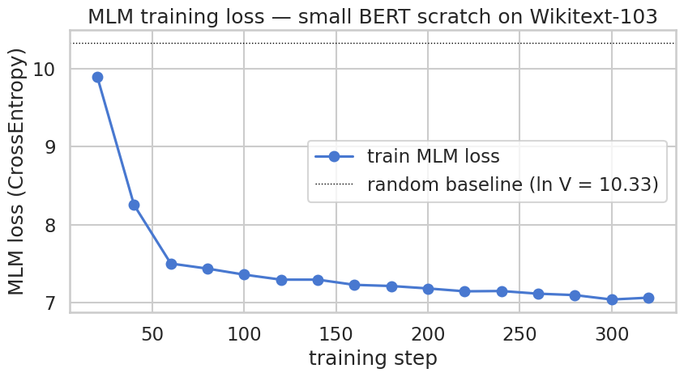
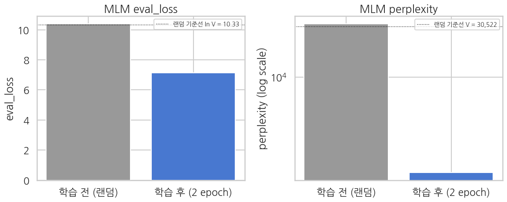

> ▶ **[Google Colab에서 이 장 실습 열기](https://colab.research.google.com/github/yoon-gu/neuqes-101/blob/master/20_en_bert_pretrain/20_en_bert_pretrain.ipynb)** — 브라우저에서 바로 실행해 볼 수 있습니다.

## 환경 준비

```python
%pip install -q -U transformers datasets accelerate
```

**▶ 실행 결과**

```text
   ━━━━━━━━━━━━━━━━━━━━━━━━━━━━━━━━━━━━━━━━ 11.2/11.2 MB 85.3 MB/s eta 0:00:00
   ━━━━━━━━━━━━━━━━━━━━━━━━━━━━━━━━━━━━━━━━ 555.1/555.1 kB 46.4 MB/s eta 0:00:00
   ━━━━━━━━━━━━━━━━━━━━━━━━━━━━━━━━━━━━━━━━ 389.2/389.2 kB 35.3 MB/s eta 0:00:00
   ━━━━━━╸━━━━━━━━━━━━━━━━━━━━━━━━━━━━━━━━━ 8.3/48.9 MB 249.0 MB/s eta 0:00:01
   ━━━━━━━━━━━━━━━━━━━━━━━━━━━━━━━━━━━━━━━╸ 48.9/48.9 MB 149.9 MB/s eta 0:00:01
   ━━━━━━━━━━━━━━━━━━━━━━━━━━━━━━━━━━━━━━━╸ 48.9/48.9 MB 149.9 MB/s eta 0:00:01
   ━━━━━━━━━━━━━━━━━━━━━━━━━━━━━━━━━━━━━━━━ 48.9/48.9 MB 17.2 MB/s eta 0:00:00
```

```python
import warnings
warnings.filterwarnings("ignore")

import math
import time

import numpy as np
import pandas as pd
import matplotlib.pyplot as plt
import seaborn as sns
import torch

from datasets import load_dataset
from transformers import (
    AutoTokenizer,
    BertConfig,
    BertForMaskedLM,
    DataCollatorForLanguageModeling,
    Trainer,
    TrainingArguments,
)

plt.rcParams["axes.unicode_minus"] = False

# matplotlib 한글 폰트 (Colab — NanumGothic). plot 의 한국어가 □ 로 깨지지 않게.
import matplotlib.font_manager as fm, subprocess, os
_fp = "/usr/share/fonts/truetype/nanum/NanumGothic.ttf"
if not os.path.exists(_fp):
    subprocess.run("apt-get -qq -y install fonts-nanum", shell=True)
fm.fontManager.addfont(_fp)
plt.rcParams["font.family"] = "NanumGothic"

# device 자동감지 — Colab(T4) 은 CUDA, 로컬 Mac 은 MPS, 그 외 CPU
if torch.cuda.is_available():
    DEVICE = "cuda"
elif getattr(torch.backends, "mps", None) is not None and torch.backends.mps.is_available():
    DEVICE = "mps"
else:
    DEVICE = "cpu"

print(f"PyTorch:        {torch.__version__}")
print(f"CUDA available: {torch.cuda.is_available()}")
print(f"Device:         {DEVICE}")
if DEVICE == "cuda":
    print(f"GPU:             {torch.cuda.get_device_name(0)}")
elif DEVICE == "cpu":
    print("Warning: CPU runtime — MLM training will be very slow. Switch to T4 recommended.")
```

**▶ 실행 결과**

```text
PyTorch:        2.11.0+cu128
CUDA available: True
Device:         cuda
GPU:             Tesla T4
```

```python
!nvidia-smi
```

**▶ 실행 결과**

```text
Mon Jun 22 04:08:21 2026       
+-----------------------------------------------------------------------------------------+
| NVIDIA-SMI 580.82.07              Driver Version: 580.82.07      CUDA Version: 13.0     |
+-----------------------------------------+------------------------+----------------------+
| GPU  Name                 Persistence-M | Bus-Id          Disp.A | Volatile Uncorr. ECC |
| Fan  Temp   Perf          Pwr:Usage/Cap |           Memory-Usage | GPU-Util  Compute M. |
|                                         |                        |               MIG M. |
|=========================================+========================+======================|
|   0  Tesla T4                       Off |   00000000:00:04.0 Off |                    0 |
| N/A   36C    P8             12W /   70W |       3MiB /  15360MiB |      0%      Default |
|                                         |                        |                  N/A |
+-----------------------------------------+------------------------+----------------------+

+-----------------------------------------------------------------------------------------+
| Processes:                                                                              |
|  GPU   GI   CI              PID   Type   Process name                        GPU Memory |
|        ID   ID                                                               Usage      |
|=========================================================================================|
|  No running processes found                                                             |
+-----------------------------------------------------------------------------------------+
```

```python
TOKENIZER_NAME = "bert-base-uncased"
tokenizer = AutoTokenizer.from_pretrained(TOKENIZER_NAME)

print(f"tokenizer:        {TOKENIZER_NAME}")
print(f"vocab_size:       {tokenizer.vocab_size:,}")
print(f"model_max_length: {tokenizer.model_max_length}")
print(f"special tokens:")
for name in ("pad_token", "unk_token", "cls_token", "sep_token", "mask_token"):
    tok = getattr(tokenizer, name)
    tid = tokenizer.convert_tokens_to_ids(tok) if tok is not None else None
    print(f"  {name:>11}: {tok!r:>10}  (id={tid})")

# 간단 시연 — 일반 위키풍 문장
SAMPLE = "The capital of France is Paris, located on the Seine river."
enc = tokenizer(SAMPLE, return_tensors="pt")
tokens = tokenizer.convert_ids_to_tokens(enc["input_ids"][0])
print(f"\nsample: {SAMPLE!r}")
print(f"tokens ({len(tokens)}): {tokens}")
print(f"ids:    {enc['input_ids'][0].tolist()}")
```

**▶ 실행 결과**

```text
tokenizer:        bert-base-uncased
vocab_size:       30,522
model_max_length: 512
special tokens:
    pad_token:    '[PAD]'  (id=0)
    unk_token:    '[UNK]'  (id=100)
    cls_token:    '[CLS]'  (id=101)
    sep_token:    '[SEP]'  (id=102)
   mask_token:   '[MASK]'  (id=103)

sample: 'The capital of France is Paris, located on the Seine river.'
tokens (15): ['[CLS]', 'the', 'capital', 'of', 'france', 'is', 'paris', ',', 'located', 'on', 'the', 'seine', 'river', '.', '[SEP]']
ids:    [101, 1996, 3007, 1997, 2605, 2003, 3000, 1010, 2284, 2006, 1996, 16470, 2314, 1012, 102]
```

```python
SEED = 42
N_TRAIN_TEXT = 5000
N_EVAL_TEXT  = 500

print("downloading Wikitext-103 (Salesforce/wikitext, wikitext-103-raw-v1)...")
raw_train = load_dataset("Salesforce/wikitext", "wikitext-103-raw-v1", split="train")
raw_eval  = load_dataset("Salesforce/wikitext", "wikitext-103-raw-v1", split="validation")
print(f"  raw train lines: {len(raw_train):,}")
print(f"  raw eval  lines: {len(raw_eval):,}")

# 빈 줄 / 너무 짧은 줄 (제목·메타) / 너무 긴 줄 (목록·인용) 제외
def is_good(ex, min_len=50, max_len=2000):
    t = ex["text"].strip()
    return min_len <= len(t) <= max_len

train_filtered = raw_train.filter(is_good).shuffle(seed=SEED).select(range(N_TRAIN_TEXT))
eval_filtered  = raw_eval.filter(is_good).shuffle(seed=SEED).select(range(N_EVAL_TEXT))

# text 컬럼만 유지
ds_train_raw = train_filtered.remove_columns([c for c in train_filtered.column_names if c != "text"])
ds_eval_raw  = eval_filtered.remove_columns([c for c in eval_filtered.column_names if c != "text"])

print(f"\nsampled train: {len(ds_train_raw):,} paragraphs")
print(f"sampled eval:  {len(ds_eval_raw):,} paragraphs")
print()
print(f"sample text length stats (chars):")
lens = [len(t) for t in ds_train_raw["text"]]
print(f"  mean: {np.mean(lens):.1f}, median: {np.median(lens):.0f}, max: {max(lens)}")
print()
print(f"first sample previews:")
for i in range(3):
    t = ds_train_raw[i]["text"]
    print(f"  Sample {i}: {t[:120]}")
```

**▶ 실행 결과**

```text
downloading Wikitext-103 (Salesforce/wikitext, wikitext-103-raw-v1)...
  raw train lines: 1,801,350
  raw eval  lines: 3,760
sampled train: 5,000 paragraphs
sampled eval:  500 paragraphs

sample text length stats (chars):
  mean: 650.0, median: 614, max: 2002

first sample previews:
  Sample 0:  Balinor Buckhannah , the Crown Prince of the country of Callahorn and the " charismatic commander of [ the ] Border Leg
  Sample 1:  Bellomont was Member of Parliament for Droitwich from 1688 to 1695 . In the 1690s he became involved in the attempts by
  Sample 2:  Paulet was promoted to full lieutenant in 1791 and appointed to HMS Vulcan , though he was moved to HMS Assistance in A
```

```python
BLOCK_SIZE = 128

def tokenize_function(examples):
    # 특수 토큰 부착 안 함 — 블록 단위로 자를 거라 [CLS]/[SEP] 가 의미 없음
    return tokenizer(examples["text"], add_special_tokens=False, truncation=False)

tokenized_train = ds_train_raw.map(
    tokenize_function, batched=True, remove_columns=["text"],
)
tokenized_eval = ds_eval_raw.map(
    tokenize_function, batched=True, remove_columns=["text"],
)
print(f"tokenized_train: {tokenized_train}")
print(f"first 30 input_ids of sample 0: {tokenized_train[0]['input_ids'][:30]}")
```

**▶ 실행 결과**

```text
tokenized_train: Dataset({
    features: ['input_ids', 'token_type_ids', 'attention_mask'],
    num_rows: 5000
})
first 30 input_ids of sample 0: [20222, 12131, 10131, 4819, 15272, 1010, 1996, 4410, 3159, 1997, 1996, 2406, 1997, 2655, 4430, 9691, 1998, 1 …(뒤 77자 생략)
```

```python
def group_texts(examples):
    '''HF 표준 group_texts — 모든 토큰 스트림을 이어 붙인 뒤 block_size 로 자름.'''
    concatenated = {k: sum(examples[k], []) for k in examples.keys()}
    total_length = len(concatenated[list(examples.keys())[0]])
    # block_size 배수로 잘라내기 (마지막 토막은 버림)
    total_length = (total_length // BLOCK_SIZE) * BLOCK_SIZE
    result = {
        k: [t[i : i + BLOCK_SIZE] for i in range(0, total_length, BLOCK_SIZE)]
        for k, t in concatenated.items()
    }
    # labels = input_ids 사본 (collator 가 mask 위치만 골라냄)
    result["labels"] = [ids.copy() for ids in result["input_ids"]]
    return result


lm_train = tokenized_train.map(group_texts, batched=True, batch_size=1000)
lm_eval  = tokenized_eval.map(group_texts, batched=True, batch_size=1000)

print(f"lm_train: {lm_train}")
print(f"lm_eval:  {lm_eval}")
print(f"\nblock_size:           {BLOCK_SIZE}")
print(f"train blocks: {len(lm_train):,}  (approx. {len(lm_train) * BLOCK_SIZE:,} tokens)")
print(f"eval blocks:  {len(lm_eval):,}   (approx. {len(lm_eval) * BLOCK_SIZE:,} tokens)")
print(f"\nsample block 0 first 20 ids: {lm_train[0]['input_ids'][:20]}")
print(f"sample block 0 first 20 tok: {tokenizer.convert_ids_to_tokens(lm_train[0]['input_ids'][:20])}")
```

**▶ 실행 결과**

```text
lm_train: Dataset({
    features: ['input_ids', 'token_type_ids', 'attention_mask', 'labels'],
    num_rows: 5352
})
lm_eval:  Dataset({
    features: ['input_ids', 'token_type_ids', 'attention_mask', 'labels'],
    num_rows: 535
})

block_size:           128
train blocks: 5,352  (approx. 685,056 tokens)
eval blocks:  535   (approx. 68,480 tokens)

sample block 0 first 20 ids: [20222, 12131, 10131, 4819, 15272, 1010, 1996, 4410, 3159, 1997, 1996, 2406, 1997, 2655, 4430, 9691, 1998, 1996, 1000, 23916]
sample block 0 first 20 tok: ['bali', '##nor', 'buck', '##han', '##nah', ',', 'the', 'crown', 'prince', 'of', 'the', 'country', 'of', 'call' …(뒤 52자 생략)
```

```python
HIDDEN_SIZE         = 256
NUM_HIDDEN_LAYERS   = 4
NUM_ATTENTION_HEADS = 4
INTERMEDIATE_SIZE   = 1024
MAX_POS_EMBED       = 128  # = BLOCK_SIZE

config = BertConfig(
    vocab_size=tokenizer.vocab_size,
    hidden_size=HIDDEN_SIZE,
    num_hidden_layers=NUM_HIDDEN_LAYERS,
    num_attention_heads=NUM_ATTENTION_HEADS,
    intermediate_size=INTERMEDIATE_SIZE,
    max_position_embeddings=MAX_POS_EMBED,
    pad_token_id=tokenizer.pad_token_id,
)

model = BertForMaskedLM(config)  # random init — pretrained weight 없음!

total = sum(p.numel() for p in model.parameters())
trainable = sum(p.numel() for p in model.parameters() if p.requires_grad)
emb = sum(p.numel() for n, p in model.named_parameters() if "embeddings" in n)
encoder = sum(p.numel() for n, p in model.named_parameters() if "encoder" in n)
head = sum(p.numel() for n, p in model.named_parameters() if "cls" in n)

print(f"Config: hidden={HIDDEN_SIZE}, layer={NUM_HIDDEN_LAYERS}, "
      f"head={NUM_ATTENTION_HEADS}, intermediate={INTERMEDIATE_SIZE}")
print(f"max_position_embeddings: {MAX_POS_EMBED}")
print()
print(f"Total parameters:    {total:>13,}  ({total/1e6:.2f} M)")
print(f"Trainable:           {trainable:>13,}")
print(f"  embeddings:        {emb:>13,}  ({emb/total:.1%})  ← vocab 30522 x hidden 256")
print(f"  encoder (4 layer): {encoder:>13,}  ({encoder/total:.1%})")
print(f"  MLM head:          {head:>13,}  ({head/total:.1%})  ← tied with embeddings")
```

**▶ 실행 결과**

```text
Config: hidden=256, layer=4, head=4, intermediate=1024
max_position_embeddings: 128

Total parameters:       11,103,290  (11.10 M)
Trainable:              11,103,290
  embeddings:            7,847,424  (70.7%)  ← vocab 30522 x hidden 256
  encoder (4 layer):     3,159,040  (28.5%)
  MLM head:                 96,826  (0.9%)  ← tied with embeddings
```

```python
data_collator = DataCollatorForLanguageModeling(
    tokenizer=tokenizer,
    mlm=True,
    mlm_probability=0.15,
)
```

```python
# 짧은 예시 문장 하나에 collator 한 번 돌려서 어떤 자리가 어떻게 바뀌는지 직접 봅니다.
import pandas as pd

DEMO_SENT = "Pretraining a language model on Wikipedia teaches it general English structure."
demo_enc = tokenizer(DEMO_SENT, return_tensors=None)
demo_ids = demo_enc["input_ids"]

torch.manual_seed(0)  # 재현성: 같은 seed 면 같은 마스킹
demo_batch = [{"input_ids": demo_ids, "attention_mask": [1] * len(demo_ids)}]
demo_out = data_collator(demo_batch)

masked_ids = demo_out["input_ids"][0].tolist()
labels     = demo_out["labels"][0].tolist()
mask_id    = tokenizer.mask_token_id

orig_tokens   = tokenizer.convert_ids_to_tokens(demo_ids)
masked_tokens = tokenizer.convert_ids_to_tokens(masked_ids)

rows = []
for orig_id, new_id, lab, orig_tok, new_tok in zip(demo_ids, masked_ids, labels, orig_tokens, masked_tokens):
    if lab == -100:
        kind = "—"
    elif new_id == mask_id:
        kind = "[MASK] (80%)"
    elif new_id == orig_id:
        kind = "kept (10%)"
    else:
        kind = "random (10%)"
    rows.append({
        "pos": len(rows),
        "original": orig_tok,
        "after_collator": new_tok,
        "label_id": lab,
        "what_happened": kind,
    })

demo_df = pd.DataFrame(rows)
print(demo_df.to_string(index=False))
```

**▶ 실행 결과**

```text
 pos  original after_collator  label_id what_happened
   0     [CLS]          [CLS]      -100             —
   1       pre            pre      -100             —
   2   ##train         [MASK]     23654  [MASK] (80%)
   3     ##ing         [MASK]      2075  [MASK] (80%)
   4         a              a      -100             —
   5  language       language      -100             —
   6     model          model      -100             —
   7        on             on      -100             —
   8 wikipedia      wikipedia      -100             —
   9   teaches        teaches      -100             —
  10        it             it      -100             —
  11   general        general      -100             —
  12   english         [MASK]      2394  [MASK] (80%)
  13 structure      structure      -100             —
  14         .              .      -100             —
  15     [SEP]          [SEP]      -100             —
```

```python
# 큰 batch 통계 — 80/10/10 비율이 실제로 맞는지 확인
torch.manual_seed(0)
N_DEMO = 64
big_batch = [
    {"input_ids": lm_train[i]["input_ids"], "attention_mask": [1] * BLOCK_SIZE}
    for i in range(N_DEMO)
]
big_out = data_collator(big_batch)

in_ids = big_out["input_ids"]
lab    = big_out["labels"]

selected = (lab != -100)
n_total    = lab.numel()
n_selected = selected.sum().item()
n_mask     = ((in_ids == mask_id) & selected).sum().item()
n_kept     = ((in_ids == lab) & selected).sum().item()
n_random   = n_selected - n_mask - n_kept

print(f"Total tokens:                      {n_total:>7,}")
print(f"Selected for loss (target 15%):    {n_selected:>7,}  ({100 * n_selected / n_total:5.2f}%)")
print(f"  └─ replaced with [MASK]:         {n_mask:>7,}  ({100 * n_mask / n_selected:5.2f}% of selected)")
print(f"  └─ replaced with random:         {n_random:>7,}  ({100 * n_random / n_selected:5.2f}% of selected)")
print(f"  └─ kept as original:             {n_kept:>7,}  ({100 * n_kept / n_selected:5.2f}% of selected)")
print()
print("Target: 선택 15% / 그 중 80-10-10 으로 [MASK]-random-kept. 표본 크면 비율 안정.")
```

**▶ 실행 결과**

```text
Total tokens:                        8,192
Selected for loss (target 15%):      1,217  (14.86%)
  └─ replaced with [MASK]:             961  (78.96% of selected)
  └─ replaced with random:             121  ( 9.94% of selected)
  └─ kept as original:                 135  (11.09% of selected)

Target: 선택 15% / 그 중 80-10-10 으로 [MASK]-random-kept. 표본 크면 비율 안정.
```

```python
USE_FP16 = (DEVICE == "cuda")   # T4 는 fp16, MPS/CPU 는 fp32
NUM_EPOCHS = 2

training_args = TrainingArguments(
    output_dir="./ch20_output",
    num_train_epochs=NUM_EPOCHS,
    per_device_train_batch_size=32,
    per_device_eval_batch_size=64,
    learning_rate=5e-4,            # scratch 학습이라 fine-tune (2e-5) 보다 크게
    weight_decay=0.01,
    warmup_ratio=0.06,
    fp16=USE_FP16,
    eval_strategy="epoch",
    logging_steps=20,
    save_strategy="no",            # 마지막에 직접 save_pretrained
    report_to="none",
    seed=SEED,
)

trainer = Trainer(
    model=model,
    args=training_args,
    train_dataset=lm_train,
    eval_dataset=lm_eval,
    data_collator=data_collator,
    processing_class=tokenizer,
)

print(f"epochs:        {NUM_EPOCHS}")
print(f"batch size:    {training_args.per_device_train_batch_size}")
print(f"learning rate: {training_args.learning_rate}")
print(f"fp16:          {USE_FP16}")
print(f"train blocks:  {len(lm_train):,}")
print(f"steps / epoch: {len(lm_train) // training_args.per_device_train_batch_size}")
```

**▶ 실행 결과**

```text
[transformers] warmup_ratio is deprecated and will be removed in v5.2. Use `warmup_steps` instead.
epochs:        2
batch size:    32
learning rate: 0.0005
fp16:          True
train blocks:  5,352
steps / epoch: 167
```

```python
# predict_mask 함수 정의 — 학습 전·후 두 번 호출하므로 먼저 정의
def predict_mask(text, top_k=5):
    '''text 안의 [MASK] 자리 top-k 토큰과 확률 반환.'''
    model.eval()
    inputs = tokenizer(text, return_tensors="pt").to(model.device)
    with torch.no_grad():
        outputs = model(**inputs)
    logits = outputs.logits[0]
    mask_positions = (inputs["input_ids"][0] == tokenizer.mask_token_id).nonzero(as_tuple=True)[0]
    if len(mask_positions) == 0:
        return None
    results = []
    for pos in mask_positions:
        probs = torch.softmax(logits[pos], dim=-1)
        top_p, top_i = probs.topk(top_k)
        candidates = [(tokenizer.convert_ids_to_tokens(int(i)), float(p))
                       for p, i in zip(top_p, top_i)]
        results.append((int(pos), candidates))
    return results


# 검증용 문장 — 학습 전·후 동일하게 사용
# 위키 일반 도메인 (사전학습 직접 본 분포) + Yelp 도메인 (Ch 21 downstream, 다른 도메인 transfer)
test_sentences = [
    # 위키 도메인 — 사전학습 직접 본 분포, 향상 명확히 기대
    f"The capital of France is {tokenizer.mask_token}.",
    f"Water freezes at {tokenizer.mask_token} degrees Celsius.",
    # Yelp 도메인 (Ch 21 fine-tune 대상) — 다른 도메인 transfer 한계 확인
    f"The food at this restaurant was absolutely {tokenizer.mask_token}.",
    f"I would {tokenizer.mask_token} recommend this place.",
]

# ---- 사전학습 전 eval_loss / perplexity ----
pre_eval = trainer.evaluate()
pre_eval_loss = pre_eval["eval_loss"]
pre_eval_ppl  = math.exp(pre_eval_loss)
random_baseline_loss = math.log(tokenizer.vocab_size)

print("=" * 78)
print("BEFORE pretraining  (random init body)")
print("=" * 78)
print(f"  eval_loss       : {pre_eval_loss:.4f}   (random baseline ln V = {random_baseline_loss:.4f})")
print(f"  eval_perplexity : {pre_eval_ppl:,.0f}     (random baseline V    = {tokenizer.vocab_size:,})")
print()

# ---- 사전학습 전 [MASK] top-5 ----
pre_top5_records = []
for sent in test_sentences:
    results = predict_mask(sent, top_k=5)
    top5_tokens = [tok for tok, _ in results[0][1]] if results else []
    pre_top5_records.append({"sentence": sent, "top5_before": top5_tokens})
    print(f"input: {sent}")
    print(f"  top-5 before pretraining: {top5_tokens}")
    print()
```

**▶ 실행 결과**

```text
<IPython.core.display.HTML object>
<IPython.core.display.HTML object>
==============================================================================
BEFORE pretraining  (random init body)
==============================================================================
  eval_loss       : 10.3834   (random baseline ln V = 10.3262)
  eval_perplexity : 32,319     (random baseline V    = 30,522)
input: The capital of France is [MASK].
  top-5 before pretraining: ['broadband', '##eti', 'weights', 'smack', '##umen']

input: Water freezes at [MASK] degrees Celsius.
  top-5 before pretraining: ['##hp', 'damages', 'slogan', '##ssion', '[unused358]']

input: The food at this restaurant was absolutely [MASK].
  top-5 before pretraining: ['languages', 'sampling', '##pic', 'libretto', '##orus']

input: I would [MASK] recommend this place.
  top-5 before pretraining: ['ahmed', 'smack', 'stations', '##sam', 'now']
```

```python
t0 = time.time()
train_result = trainer.train()
elapsed = time.time() - t0
print(f"\nMLM pretraining done in {elapsed/60:.1f} min")
print(f"mean train loss: {train_result.training_loss:.4f}")
print(f"random baseline loss (uniform over vocab): {math.log(tokenizer.vocab_size):.4f}")
```

**▶ 실행 결과**

```text
<IPython.core.display.HTML object>
MLM pretraining done in 0.4 min
mean train loss: 7.4179
random baseline loss (uniform over vocab): 10.3262
```

```python
!nvidia-smi
```

**▶ 실행 결과**

```text
Mon Jun 22 04:09:26 2026       
+-----------------------------------------------------------------------------------------+
| NVIDIA-SMI 580.82.07              Driver Version: 580.82.07      CUDA Version: 13.0     |
+-----------------------------------------+------------------------+----------------------+
| GPU  Name                 Persistence-M | Bus-Id          Disp.A | Volatile Uncorr. ECC |
| Fan  Temp   Perf          Pwr:Usage/Cap |           Memory-Usage | GPU-Util  Compute M. |
|                                         |                        |               MIG M. |
|=========================================+========================+======================|
|   0  Tesla T4                       Off |   00000000:00:04.0 Off |                    0 |
| N/A   51C    P0             65W /   70W |    3335MiB /  15360MiB |     49%      Default |
|                                         |                        |                  N/A |
+-----------------------------------------+------------------------+----------------------+

+-----------------------------------------------------------------------------------------+
| Processes:                                                                              |
|  GPU   GI   CI              PID   Type   Process name                        GPU Memory |
|        ID   ID                                                               Usage      |
|=========================================================================================|
|    0   N/A  N/A            5453      C   /usr/bin/python3                       3332MiB |
+-----------------------------------------------------------------------------------------+
```

```python
# 학습 로그에서 train loss 추출
log_history = trainer.state.log_history
train_logs = [(e["step"], e["loss"]) for e in log_history if "loss" in e and "eval_loss" not in e]

if train_logs:
    steps, losses = zip(*train_logs)
    random_baseline = math.log(tokenizer.vocab_size)

    sns.set_theme(style="whitegrid", context="talk", font="NanumGothic", rc={"axes.unicode_minus": False})
    fig, ax = plt.subplots(figsize=(9, 5))
    ax.plot(steps, losses, "o-", color="#4878D0", label="학습 MLM loss")
    ax.axhline(random_baseline, color="black", lw=1.0, ls=":", label=f"랜덤 기준선 (ln V = {random_baseline:.2f})")
    ax.set_xlabel("학습 step")
    ax.set_ylabel("MLM loss (CrossEntropy)")
    ax.set_title("MLM 학습 loss — Wikitext-103 위에서 처음부터 학습한 small BERT")
    ax.legend()
    plt.tight_layout()
    plt.show()
else:
    print("No train loss logs found.")
```

**▶ 실행 결과**



```python
eval_metrics = trainer.evaluate()
eval_loss = eval_metrics["eval_loss"]
eval_ppl = math.exp(eval_loss)
print("=== eval (held-out Wikitext-103 paragraphs) ===")
for k, v in eval_metrics.items():
    if isinstance(v, float):
        print(f"  {k:>22}: {v:.4f}")
print()
print(f"  MLM loss:               {eval_loss:.4f}")
print(f"  perplexity (exp loss):  {eval_ppl:.2f}")
print(f"  random baseline PPL:    {tokenizer.vocab_size:,}  (uniform over vocab)")
print(f"  -> model narrowed vocab to approx. {eval_ppl:.0f} candidates per masked position")
```

**▶ 실행 결과**

```text
<IPython.core.display.HTML object>
<IPython.core.display.HTML object>
=== eval (held-out Wikitext-103 paragraphs) ===
               eval_loss: 7.1202

  MLM loss:               7.1202
  perplexity (exp loss):  1236.73
  random baseline PPL:    30,522  (uniform over vocab)
  -> model narrowed vocab to approx. 1237 candidates per masked position
```

```python
# ---- 사전학습 후 eval_loss / perplexity ----
post_eval = trainer.evaluate()
post_eval_loss = post_eval["eval_loss"]
post_eval_ppl  = math.exp(post_eval_loss)

print("=" * 78)
print("AFTER pretraining  (2 epoch MLM on Wikitext-103)")
print("=" * 78)
print(f"  eval_loss       : {post_eval_loss:.4f}   (before: {pre_eval_loss:.4f})")
print(f"  eval_perplexity : {post_eval_ppl:,.2f}        (before: {pre_eval_ppl:,.0f})")
print(f"  -> narrowed vocab to approx. {post_eval_ppl:.0f} candidates per masked position")
print()

# ---- 사전학습 후 [MASK] top-5 ----
post_top5_records = []
for sent in test_sentences:
    results = predict_mask(sent, top_k=5)
    top5_tokens = [tok for tok, _ in results[0][1]] if results else []
    post_top5_records.append({"sentence": sent, "top5_after": top5_tokens})
    print(f"input: {sent}")
    print(f"  top-5 after pretraining: {top5_tokens}")
    print()
```

**▶ 실행 결과**

```text
<IPython.core.display.HTML object>
<IPython.core.display.HTML object>
==============================================================================
AFTER pretraining  (2 epoch MLM on Wikitext-103)
==============================================================================
  eval_loss       : 7.1278   (before: 10.3834)
  eval_perplexity : 1,246.14        (before: 32,319)
  -> narrowed vocab to approx. 1246 candidates per masked position

input: The capital of France is [MASK].
  top-5 after pretraining: ['the', ',', '.', 'and', 'of']

input: Water freezes at [MASK] degrees Celsius.
  top-5 after pretraining: ['the', ',', '.', 'and', 'of']

input: The food at this restaurant was absolutely [MASK].
  top-5 after pretraining: ['the', ',', '.', 'and', 'of']

input: I would [MASK] recommend this place.
  top-5 after pretraining: ['the', ',', '.', 'and', 'of']
```

```python
# 사전·사후 수치 비교 표
metric_compare = pd.DataFrame({
    "metric":           ["eval_loss", "eval_perplexity"],
    "before (random)":  [pre_eval_loss,  pre_eval_ppl],
    "after (2 epoch)":  [post_eval_loss, post_eval_ppl],
    "random baseline":  [random_baseline_loss, float(tokenizer.vocab_size)],
})
print("Before vs After — eval metrics")
print(metric_compare.round(4).to_string(index=False))
```

**▶ 실행 결과**

```text
Before vs After — eval metrics
         metric  before (random)  after (2 epoch)  random baseline
      eval_loss          10.3834           7.1278          10.3262
eval_perplexity       32319.2119        1246.1431       30522.0000
```

```python
# 막대 그래프 두 장 (eval_loss / perplexity)
sns.set_theme(style="whitegrid", context="talk", font="NanumGothic", rc={"axes.unicode_minus": False})
fig, axes = plt.subplots(1, 2, figsize=(12, 5))

loss_values = [pre_eval_loss, post_eval_loss]
loss_labels = ["학습 전 (랜덤)", "학습 후 (2 epoch)"]
axes[0].bar(loss_labels, loss_values, color=["#999999", "#4878D0"])
axes[0].axhline(random_baseline_loss, color="black", lw=1.0, ls=":",
                label=f"랜덤 기준선 ln V = {random_baseline_loss:.2f}")
axes[0].set_ylabel("eval_loss")
axes[0].set_title("MLM eval_loss")
axes[0].legend(loc="upper right", fontsize=10)

ppl_values = [pre_eval_ppl, post_eval_ppl]
axes[1].bar(loss_labels, ppl_values, color=["#999999", "#4878D0"])
axes[1].set_yscale("log")
axes[1].axhline(tokenizer.vocab_size, color="black", lw=1.0, ls=":",
                label=f"랜덤 기준선 V = {tokenizer.vocab_size:,}")
axes[1].set_ylabel("perplexity (log scale)")
axes[1].set_title("MLM perplexity")
axes[1].legend(loc="upper right", fontsize=10)

plt.tight_layout()
plt.show()
```

**▶ 실행 결과**



```python
# 표준 bert-base-uncased 로드 — 학습이 충분히 잘 된 경우의 기준점
from transformers import AutoModelForMaskedLM

ref_model = AutoModelForMaskedLM.from_pretrained("bert-base-uncased")
ref_model.to(model.device)
ref_model.eval()

ref_param_count = sum(p.numel() for p in ref_model.parameters())
our_param_count = sum(p.numel() for p in model.parameters())
print(f"Our small BERT params: {our_param_count/1e6:.1f}M")
print(f"Reference BERT params: {ref_param_count/1e6:.1f}M  ({ref_param_count/our_param_count:.0f}x larger)")
```

**▶ 실행 결과**

```text
[transformers] BertForMaskedLM LOAD REPORT from: bert-base-uncased
Key                         | Status     |  | 
----------------------------+------------+--+-
bert.pooler.dense.weight    | UNEXPECTED |  | 
cls.seq_relationship.weight | UNEXPECTED |  | 
bert.pooler.dense.bias      | UNEXPECTED |  | 
cls.seq_relationship.bias   | UNEXPECTED |  | 

Notes:
- UNEXPECTED:	can be ignored when loading from different task/architecture; not ok if you expect identical arch.
Our small BERT params: 11.1M
Reference BERT params: 109.5M  (10x larger)
```

```python
# Reference 모델로 같은 문장의 top-5 측정
def predict_mask_with(text, ref, top_k=5):
    '''임의의 MLM 모델로 [MASK] 자리 top-k 예측.'''
    ref.eval()
    inputs = tokenizer(text, return_tensors="pt").to(ref.device)
    with torch.no_grad():
        outputs = ref(**inputs)
    logits = outputs.logits[0]
    mask_positions = (inputs["input_ids"][0] == tokenizer.mask_token_id).nonzero(as_tuple=True)[0]
    if len(mask_positions) == 0:
        return None
    results = []
    for pos in mask_positions:
        probs = torch.softmax(logits[pos], dim=-1)
        top_p, top_i = probs.topk(top_k)
        candidates = [(tokenizer.convert_ids_to_tokens(int(i)), float(p))
                       for p, i in zip(top_p, top_i)]
        results.append((int(pos), candidates))
    return results


ref_top5_records = []
for sent in test_sentences:
    results = predict_mask_with(sent, ref_model, top_k=5)
    top5_tokens = [tok for tok, _ in results[0][1]] if results else []
    ref_top5_records.append({"sentence": sent, "top5_ref": top5_tokens})

# 참조 모델 메모리 해제 (분류 fine-tune 챕터 21 가 같은 노트북이 아니므로 안전)
del ref_model
if torch.cuda.is_available():
    torch.cuda.empty_cache()
```

```python
# 3-way top-5 비교 표
rows = []
for pre, post, ref in zip(pre_top5_records, post_top5_records, ref_top5_records):
    rows.append({
        "sentence":          pre["sentence"],
        "top5_before":       ", ".join(pre["top5_before"]),
        "top5_ours":         ", ".join(post["top5_after"]),
        "top5_ref_bert":     ", ".join(ref["top5_ref"]),
    })

top5_compare = pd.DataFrame(rows)
print("Before (random) vs Ours (small BERT, 5K paragraphs) vs Reference (bert-base-uncased, approx. 3.3B tokens)")
print("=" * 100)
for _, row in top5_compare.iterrows():
    print(f"input: {row['sentence']}")
    print(f"  before (random)        : {row['top5_before']}")
    print(f"  ours  (small, 5K para) : {row['top5_ours']}")
    print(f"  ref   (bert-base)      : {row['top5_ref_bert']}")
    print()
```

**▶ 실행 결과**

```text
Before (random) vs Ours (small BERT, 5K paragraphs) vs Reference (bert-base-uncased, approx. 3.3B tokens)
====================================================================================================
input: The capital of France is [MASK].
  before (random)        : broadband, ##eti, weights, smack, ##umen
  ours  (small, 5K para) : the, ,, ., and, of
  ref   (bert-base)      : paris, lille, lyon, marseille, tours

input: Water freezes at [MASK] degrees Celsius.
  before (random)        : ##hp, damages, slogan, ##ssion, [unused358]
  ours  (small, 5K para) : the, ,, ., and, of
  ref   (bert-base)      : 100, 60, 50, 30, 90

input: The food at this restaurant was absolutely [MASK].
  before (random)        : languages, sampling, ##pic, libretto, ##orus
  ours  (small, 5K para) : the, ,, ., and, of
  ref   (bert-base)      : delicious, amazing, fabulous, fantastic, incredible

input: I would [MASK] recommend this place.
  before (random)        : ahmed, smack, stations, ##sam, now
  ours  (small, 5K para) : the, ,, ., and, of
  ref   (bert-base)      : highly, certainly, definitely, strongly, greatly
```

```python
SAVE_DIR = "./ch20_small_bert_mlm"
model.save_pretrained(SAVE_DIR)
tokenizer.save_pretrained(SAVE_DIR)

import os
print(f"Saved to: {SAVE_DIR}")
print(f"Files:")
for f in sorted(os.listdir(SAVE_DIR)):
    size = os.path.getsize(os.path.join(SAVE_DIR, f))
    if size > 1024 * 1024:
        size_str = f"{size / 1024 / 1024:.1f} MB"
    else:
        size_str = f"{size / 1024:.1f} KB"
    print(f"  {f:>30s}  {size_str}")
```

**▶ 실행 결과**

```text
Saved to: ./ch20_small_bert_mlm
Files:
                     config.json  0.7 KB
               model.safetensors  42.4 MB
                  tokenizer.json  694.7 KB
           tokenizer_config.json  0.3 KB
```
