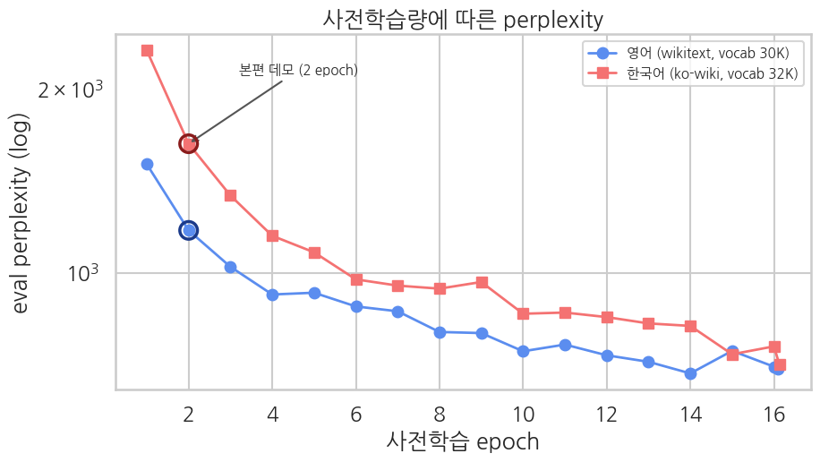

> ▶ **[Google Colab에서 이 부록 열기](https://colab.research.google.com/github/yoon-gu/neuqes-101/blob/master/20_en_bert_pretrain/20_en_bert_pretrain_scaling.ipynb)** — 브라우저에서 바로 실행해 볼 수 있습니다.

본편 Ch 20(영어)·Ch 22(한국어)는 small BERT 를 **2 epoch** 만 MLM 사전학습해서 perplexity 가 높았습니다 (영어 ~1,253, 한국어 ~1,833). 짧은 데모 학습의 정직한 반영이지만, *더 돌리면 얼마나 내려가는지* 는 한 점만 봐선 알 수 없습니다.

이 부록은 같은 small BERT(hidden=256·L=4)를 **2 → 16 epoch 으로 길게 학습** 하며, 체크포인트마다 eval perplexity 를 기록해 곡선으로 봅니다. 학습을 한 번만 돌리고 `eval_strategy="steps"` 로 중간 perplexity 를 모으므로 효율적입니다.

> 영어(wikitext-103)·한국어(ko-wiki) 두 곡선을 epoch 축에서 비교. small 모델이라 T4 에서 가볍습니다.

```python
!pip install -q transformers datasets
```

```python
import warnings; warnings.filterwarnings("ignore")
import math, numpy as np, pandas as pd
import matplotlib.pyplot as plt, seaborn as sns, torch
from datasets import load_dataset, Dataset
from transformers import AutoTokenizer, BertConfig, BertForMaskedLM, DataCollatorForLanguageModeling, Trainer, TrainingArguments

# matplotlib 한글 폰트 (Colab — NanumGothic). plot 의 한국어가 □ 로 깨지지 않게.
import matplotlib.font_manager as fm, subprocess, os
_fp = "/usr/share/fonts/truetype/nanum/NanumGothic.ttf"
if not os.path.exists(_fp):
    subprocess.run("apt-get -qq -y install fonts-nanum", shell=True)
fm.fontManager.addfont(_fp)
plt.rcParams["font.family"] = "NanumGothic"; plt.rcParams["axes.unicode_minus"] = False
print(f"CUDA: {torch.cuda.is_available()}")
```

**▶ 실행 결과**

```text
CUDA: True
```

## 공통 유틸 — 블록화 / small BERT / 학습+perplexity 곡선

본편 Ch 20·22 와 같은 파이프라인: `add_special_tokens=False` 토큰화 → `group_texts`(128 블록) → MLM collator. `train_curve` 는 `eval_strategy="steps"` 로 중간 perplexity 를 모아 곡선을 돌려줍니다 (epoch=2 데모점 포함).

```python
BLOCK_SIZE = 128; EPOCHS = 16; SEED = 42

def prep_blocks(text_ds, tokenizer):
    tok = text_ds.map(lambda e: tokenizer(e["text"], add_special_tokens=False, truncation=False),
                      batched=True, remove_columns=text_ds.column_names)
    def group(ex):
        concat = {k: sum(ex[k], []) for k in ex.keys()}
        total = (len(concat["input_ids"]) // BLOCK_SIZE) * BLOCK_SIZE
        return {k: [t[i:i+BLOCK_SIZE] for i in range(0, total, BLOCK_SIZE)] for k, t in concat.items()}
    return tok.map(group, batched=True)

def build_small_bert(tokenizer):
    cfg = BertConfig(vocab_size=tokenizer.vocab_size, hidden_size=256, num_hidden_layers=4,
                     num_attention_heads=4, intermediate_size=1024,
                     max_position_embeddings=BLOCK_SIZE, pad_token_id=tokenizer.pad_token_id)
    return BertForMaskedLM(cfg)

def train_curve(tokenizer, lm_train, lm_eval, label):
    torch.manual_seed(SEED); np.random.seed(SEED)
    model = build_small_bert(tokenizer)
    collator = DataCollatorForLanguageModeling(tokenizer=tokenizer, mlm=True, mlm_probability=0.15)
    spe = max(1, len(lm_train) // 32)   # steps per epoch
    args = TrainingArguments(output_dir=f"./curve_{label}", num_train_epochs=EPOCHS,
        per_device_train_batch_size=32, per_device_eval_batch_size=64, learning_rate=5e-4,
        weight_decay=0.01, warmup_steps=0.06,   # 1 미만이면 전체 step 대비 *비율* (구 warmup_ratio)
        fp16=torch.cuda.is_available(),
        eval_strategy="steps", eval_steps=spe, logging_steps=spe, save_strategy="no",
        report_to="none", seed=SEED)
    tr = Trainer(model=model, args=args, train_dataset=lm_train, eval_dataset=lm_eval,
                 data_collator=collator, processing_class=tokenizer)
    tr.train()
    curve = [(e["step"]/spe, math.exp(e["eval_loss"])) for e in tr.state.log_history if "eval_loss" in e]
    del model, tr; torch.cuda.empty_cache()
    return curve   # [(epoch, perplexity), ...]
print("유틸 준비 완료")
```

**▶ 실행 결과**

```text
유틸 준비 완료
```

## 영어 — wikitext-103, small BERT MLM 16 epoch

```python
raw_tr = load_dataset("Salesforce/wikitext", "wikitext-103-raw-v1", split="train")
raw_ev = load_dataset("Salesforce/wikitext", "wikitext-103-raw-v1", split="validation")
good = lambda ex: 50 <= len(ex["text"].strip()) <= 2000
tr_txt = raw_tr.filter(good).shuffle(seed=SEED).select(range(5000))
ev_txt = raw_ev.filter(good).shuffle(seed=SEED).select(range(500))
tok_en = AutoTokenizer.from_pretrained("bert-base-uncased")
lm_tr_en = prep_blocks(tr_txt, tok_en); lm_ev_en = prep_blocks(ev_txt, tok_en)
print(f"EN blocks — train {len(lm_tr_en)}, eval {len(lm_ev_en)}, vocab {tok_en.vocab_size}")
curve_en = train_curve(tok_en, lm_tr_en, lm_ev_en, "en")
print("EN (epoch, ppl):", [(round(e,1), round(p,1)) for e,p in curve_en])
```

**▶ 실행 결과**

```text
wikitext-103-raw-v1/test-00000-of-00001.(…): downloading bytes:           |  0.00B            
wikitext-103-raw-v1/train-00000-of-00002(…): downloading bytes:           |  0.00B            
wikitext-103-raw-v1/train-00001-of-00002(…): downloading bytes:           |  0.00B            
wikitext-103-raw-v1/validation-00000-of-(…): downloading bytes:           |  0.00B            
EN blocks — train 5352, eval 535, vocab 30522
Step  Training Loss  Validation Loss
167   8.343121       7.316820
334   7.136372       7.067544
501   6.943708       6.930294
668   6.833707       6.825957
835   6.789280       6.832632
1002  6.719531       6.780964
1169  6.674949       6.762733
1336  6.623808       6.684711
1503  6.611356       6.680601
1670  6.577999       6.611996
1837  6.534630       6.637313
2004  6.528907       6.596831
2171  6.488390       6.572335
2338  6.500032       6.528592
2505  6.476247       6.613510
2672  6.466481       6.554009
2688  6.466481       6.546917
EN (epoch, ppl): [(1.0, 1505.4), (2.0, 1173.3), (3.0, 1022.8), (4.0, 921.5), (5.0, 927.6), (6.0, 880.9), (7.0, 865.0), (8.0, 800.1), (9.0, 7 …(뒤 126자 생략)
```

## 한국어 — ko-wiki, small BERT MLM 16 epoch

```python
ds_ko = load_dataset("wikimedia/wikipedia", "20231101.ko", split="train")
def collect_paragraphs(ds, target, min_len=50, max_len=2000):
    out = []
    for ex in ds:
        for para in ex["text"].split("\n\n"):
            para = para.strip()
            if min_len <= len(para) <= max_len:
                out.append(para)
                if len(out) >= target: return out
    return out
paras = collect_paragraphs(ds_ko.shuffle(seed=SEED), target=5500)
tr_ko = Dataset.from_dict({"text": paras[:5000]}); ev_ko = Dataset.from_dict({"text": paras[5000:5500]})
tok_ko = AutoTokenizer.from_pretrained("klue/bert-base")
lm_tr_ko = prep_blocks(tr_ko, tok_ko); lm_ev_ko = prep_blocks(ev_ko, tok_ko)
print(f"KO blocks — train {len(lm_tr_ko)}, eval {len(lm_ev_ko)}, vocab {tok_ko.vocab_size}")
curve_ko = train_curve(tok_ko, lm_tr_ko, lm_ev_ko, "ko")
print("KO (epoch, ppl):", [(round(e,1), round(p,1)) for e,p in curve_ko])
```

**▶ 실행 결과**

```text
20231101.ko/train-00000-of-00003.parquet: downloading bytes:           |  0.00B            
20231101.ko/train-00001-of-00003.parquet: downloading bytes:           |  0.00B            
20231101.ko/train-00002-of-00003.parquet: downloading bytes:           |  0.00B            
[transformers] Token indices sequence length is longer than the specified maximum sequence length for this model (610 > 512). Running this s …(뒤 56자 생략)
KO blocks — train 3924, eval 429, vocab 32000
Step  Training Loss  Validation Loss
122   8.756504       7.745499
244   7.447506       7.394058
366   7.200113       7.198878
488   7.008336       7.047162
610   6.870553       6.984996
732   6.762624       6.882943
854   6.695641       6.859433
976   6.609315       6.847979
1098  6.532805       6.873027
1220  6.483001       6.753463
1342  6.453019       6.757910
1464  6.392867       6.740801
1586  6.333251       6.716921
1708  6.291349       6.707616
1830  6.285862       6.600687
1952  6.247048       6.630420
1968  6.247048       6.561598
KO (epoch, ppl): [(1.0, 2311.1), (2.0, 1626.3), (3.0, 1337.9), (4.0, 1149.6), (5.0, 1080.3), (6.0, 975.5), (7.0, 952.8), (8.0, 942.0), (9.0, …(뒤 128자 생략)
```

## 곡선 — eval perplexity vs 사전학습 epoch

```python
def at_epoch(curve, ep):
    return min(curve, key=lambda x: abs(x[0]-ep))[1]
en_ep, en_pp = zip(*curve_en); ko_ep, ko_pp = zip(*curve_ko)
sns.set_theme(style="whitegrid", context="talk", font="NanumGothic", rc={"axes.unicode_minus": False})
fig, ax = plt.subplots(figsize=(9.5, 5.5))
ax.plot(en_ep, en_pp, "o-", color="#5B8DEF", lw=2, label="영어 (wikitext, vocab 30K)")
ax.plot(ko_ep, ko_pp, "s-", color="#F47272", lw=2, label="한국어 (ko-wiki, vocab 32K)")
# 본편 데모점 (2 epoch)
ax.scatter([2],[at_epoch(curve_en,2)], s=200, facecolors="none", edgecolors="#1B3A8A", lw=2.5, zorder=5)
ax.scatter([2],[at_epoch(curve_ko,2)], s=200, facecolors="none", edgecolors="#8A1B1B", lw=2.5, zorder=5)
ax.annotate("본편 데모 (2 epoch)", (2, at_epoch(curve_ko,2)), xytext=(3.2, at_epoch(curve_ko,2)*1.3),
            fontsize=11, arrowprops=dict(arrowstyle="->", color="#555"))
ax.set_yscale("log"); ax.set_xlabel("사전학습 epoch"); ax.set_ylabel("eval perplexity (log)")
ax.set_title("사전학습량에 따른 perplexity")
ax.legend(fontsize=11); plt.tight_layout(); plt.show()

for name, c in [("영어", curve_en), ("한국어", curve_ko)]:
    p2, pf = at_epoch(c,2), c[-1][1]
    print(f"{name}: 2 epoch ppl={p2:.0f} → {EPOCHS} epoch ppl={pf:.0f}  ({p2/pf:.1f}배 감소)")
```

**▶ 실행 결과**



```text
영어: 2 epoch ppl=1173 → 16 epoch ppl=697  (1.7배 감소)
한국어: 2 epoch ppl=1626 → 16 epoch ppl=707  (2.3배 감소)
```

## 해석

**더 학습하면 perplexity 는 분명히 내려갑니다 — 다만 곧 평탄해집니다.**

| | 2 epoch (본편 데모) | 16 epoch | 감소 |
|---|---|---|---|
| 영어 (wikitext) | 1,173 | 697 | 1.7배 |
| 한국어 (ko-wiki) | 1,626 | 707 | 2.3배 |

곡선을 보면 두 언어 모두 처음 몇 epoch 에서 가파르게 떨어지다가 **epoch 8-10 부터 평탄** 해집니다. 8배 더 돌려도(2→16 epoch) perplexity 는 ~2배 낮아질 뿐이고, 마지막 6 epoch 은 거의 움직이지 않습니다.

**왜 평탄해지나 — 데이터가 병목입니다.** 5,000 텍스트는 small BERT 가 금세 다 외울 만큼 적어, epoch 을 늘리면 train loss 는 계속 떨어져도 *새 패턴* 을 못 봐 eval perplexity 가 saturate 합니다 (overfitting 영역 진입). 잘 학습된 BERT 의 perplexity 가 두 자리-수십 수준인 것과의 큰 격차는 **epoch 이 아니라 데이터·compute 규모** 의 문제입니다 — 원본 BERT 는 수십억 토큰으로 학습했습니다.

**그래서 본편의 높은 perplexity 는 버그가 아닙니다.** "데모용 짧은 학습이라 빈도까지만 익힌 단계" 가 맞고, 더 돌리면 ~2배까지는 내려가지만 그 이상은 *데이터 양* 을 늘려야 합니다. 이는 Ch 12 부록(데이터 스케일링)에서 본 *데이터가 가장 큰 lever* 라는 교훈, 그리고 Ch 21·23 의 사전학습 분류 천장과 같은 뿌리입니다.
