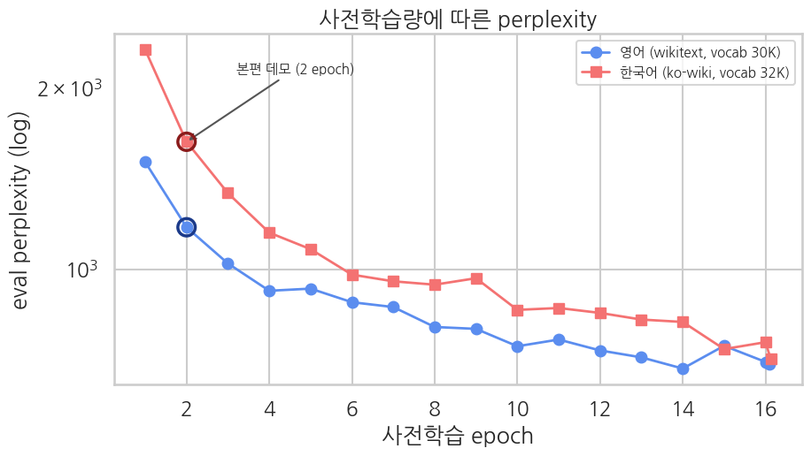

## 부록 — 사전학습량과 perplexity 곡선

> ▶ **[Google Colab에서 사전학습량 부록 열기](https://colab.research.google.com/github/yoon-gu/neuqes-101/blob/master/20_en_bert_pretrain/20_en_bert_pretrain_scaling.ipynb)** — Ch 20·22 본편의 높은 perplexity가 버그인지, 짧은 데모 학습의 한계인지 직접 확인합니다.

Ch 20과 Ch 22의 작은 BERT는 **5,000개 텍스트, 2 epoch**만 학습합니다. 그래서 본편의 perplexity는 높습니다. 이 부록은 같은 구조의 small BERT를 16 epoch까지 더 길게 학습하면서, 영어와 한국어 MLM perplexity가 얼마나 내려가는지 확인합니다.

핵심 질문은 다음입니다.

**“epoch만 더 늘리면 perplexity가 계속 내려가는가, 아니면 데이터·compute 병목에 먼저 부딪히는가?”**

## 실험 조건

| 항목 | 영어 실험 | 한국어 실험 |
|---|---|---|
| 모델 | small BERT MLM | small BERT MLM |
| 본체 구조 | hidden 256, 4 layers | hidden 256, 4 layers |
| 토크나이저 | `bert-base-uncased` | `klue/bert-base` |
| 데이터 | Wikitext-103 5,000 texts | 한국어 Wikipedia 5,000 texts |
| 비교 축 | 2 → 16 epoch | 2 → 16 epoch |
| 지표 | eval perplexity | eval perplexity |

## 결과

| 언어 | 2 epoch perplexity | 16 epoch perplexity | 감소 폭 |
|---|---:|---:|---:|
| 영어 Wikitext | 1,173 | 696 | 1.7배 |
| 한국어 Wikipedia | 1,626 | 709 | 2.3배 |

## 결과 해석

1. **더 돌리면 내려가긴 합니다.** 영어는 1,173에서 696으로, 한국어는 1,626에서 709로 내려갑니다. 본편의 2 epoch 결과가 학습 실패는 아니라는 뜻입니다.
2. **하지만 epoch 8-10 이후부터 평탄해집니다.** 같은 5,000개 텍스트를 반복해서 보는 것만으로는 추가 개선이 빠르게 줄어듭니다.
3. **병목은 epoch보다 데이터·compute입니다.** 더 낮은 perplexity를 원하면 단순히 epoch를 늘리기보다 데이터 수, 모델 크기, 학습 시간 전체를 함께 키워야 합니다.

## 본편과의 연결

Ch 20·22 본편의 높은 perplexity는 “작은 모델이 아무것도 못 배웠다”는 의미가 아닙니다. 짧은 데모 사전학습에서는 빈도와 일부 문맥 신호까지만 익히고, 충분한 언어 표상까지는 가지 못합니다. 이 곡선은 그 한계를 수치로 보여 줍니다.

따라서 Ch 21·23에서 분류 fine-tuning 성능이 제한되는 이유도 같은 뿌리를 갖습니다. 사전학습은 효과가 있지만, **5,000개 텍스트와 짧은 학습으로 만든 본체는 대규모 사전학습 모델과 같은 출발점이 아닙니다.**
