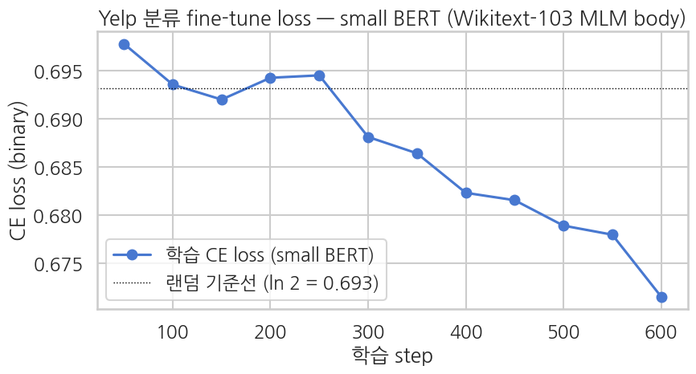
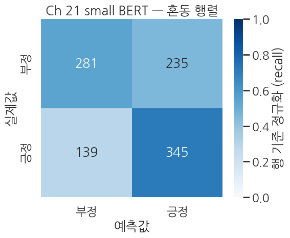
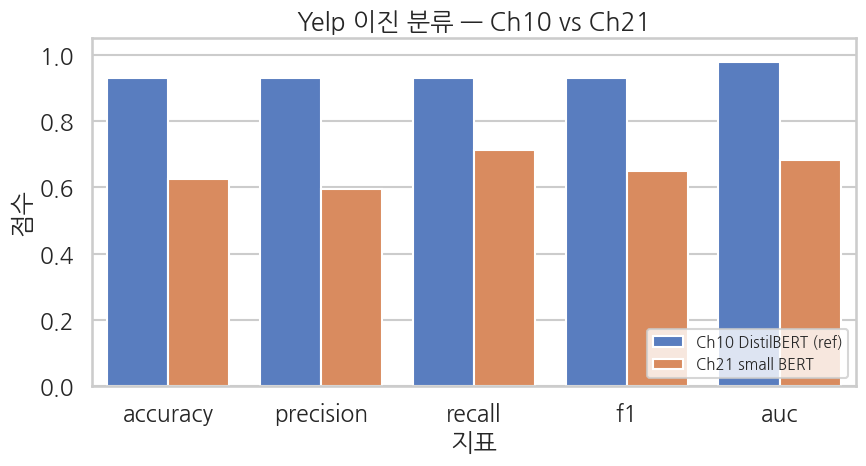

## 평가 — Ch 10 과 같은 5종 metric + 학습 곡선

`accuracy / precision / recall / F1 / AUC` 전부 같은 정의. 마지막에 confusion matrix 와 학습 곡선을 같이 그려 *본체 출발점 변화가 학습 동역학에 어떻게 드러나는지* 시각화.

```python
cls_eval_metrics = cls_trainer.evaluate()
print("Ch 21 small BERT (scratch MLM 3 epoch + classification fine-tune) — eval:")
for k, v in cls_eval_metrics.items():
    if k.startswith("eval_") and isinstance(v, float):
        print(f"  {k:>20}: {v:.4f}")
```

**▶ 실행 결과**

```text
Training Loss  Validation Loss  Epoch  Accuracy  Precision  Recall    F1        Auc
0.671505       0.667989         2      0.626000  0.594828   0.712810  0.648496  0.682084
Ch 21 small BERT (scratch MLM 3 epoch + classification fine-tune) — eval:
             eval_loss: 0.6680
         eval_accuracy: 0.6260
        eval_precision: 0.5948
           eval_recall: 0.7128
               eval_f1: 0.6485
              eval_auc: 0.6821
```

**결과 해석**

eval accuracy 0.626, AUC 0.682 로, random (0.5) 보다는 분명히 높지만 Ch 10 의 DistilBERT (약 0.90) 와는 큰 격차입니다. recall 0.713 이 precision 0.595 보다 높아 모델이 긍정 쪽으로 다소 치우쳐 예측하는 경향도 읽힙니다.

eval set 전체에 대해 예측을 뽑아 클래스별 상세 리포트를 봅니다. 평균 정확도 한 숫자만으로는 모델이 어느 클래스에서 약한지 알 수 없으므로, 클래스별 precision/recall 과 예측 자신감 (top-1 확률) 을 함께 확인합니다.

```python
preds_output = cls_trainer.predict(cls_eval)
cls_logits = preds_output.predictions
cls_labels = preds_output.label_ids.astype(int)

exp = np.exp(cls_logits - cls_logits.max(axis=1, keepdims=True))
cls_probs_full = exp / exp.sum(axis=1, keepdims=True)
cls_preds = cls_probs_full.argmax(axis=1)
cls_probs_pos = cls_probs_full[:, 1]
```

**위 코드 읽기** — `cls_trainer.predict` 로 1,000 개 eval 샘플의 logits 를 한 번에 받고, `compute_metrics` 와 같은 안정 softmax 로 확률·예측을 재계산합니다. 이렇게 따로 뽑아 둔 `cls_preds`/`cls_probs_pos` 를 뒤의 confusion matrix 와 학습곡선에서 재사용합니다.

```python
print(f"Logits shape: {cls_logits.shape}")
print(f"Predicted positive rate: {(cls_preds == 1).mean():.1%}")
print(f"Top-1 prob mean: correct={cls_probs_full.max(axis=1)[cls_preds == cls_labels].mean():.4f}, "
      f"wrong={cls_probs_full.max(axis=1)[cls_preds != cls_labels].mean():.4f}")
print()
print(classification_report(
    cls_labels, cls_preds,
    target_names=["negative", "positive"],
    digits=4, zero_division=0,
))
```

**위 코드 읽기** — `Top-1 prob mean` 은 맞춘 예측과 틀린 예측 각각의 평균 자신감을 비교합니다. 두 값이 비슷하면 모델이 *맞을 때나 틀릴 때나 비슷하게 어정쩡한* 확신을 갖는다는 뜻으로, 표상이 아직 약함을 진단하는 신호입니다.

**▶ 실행 결과**

```text
Logits shape: (1000, 2)
Predicted positive rate: 58.0%
Top-1 prob mean: correct=0.5463, wrong=0.5355

              precision    recall  f1-score   support

    negative     0.6690    0.5446    0.6004       516
    positive     0.5948    0.7128    0.6485       484

    accuracy                         0.6260      1000
   macro avg     0.6319    0.6287    0.6245      1000
weighted avg     0.6331    0.6260    0.6237      1000
```

**결과 해석**

맞은 예측의 평균 자신감 (0.546) 과 틀린 예측 (0.536) 이 거의 같아, 모델이 0.5 근처에서 머뭇거리며 결정하고 있음을 보여줍니다. 예측 긍정 비율 58% 와 positive 의 높은 recall (0.713) 에서 보이듯 긍정 쪽으로 살짝 기울어, 부정 클래스의 recall (0.545) 이 상대적으로 낮습니다.

### 5-1. 학습 곡선 — MLM 사전학습 효과가 보이는 자리

분류 fine-tune 의 step-by-step train loss 를 그려, *시작점* 과 *수렴점* 을 같이 확인.

```python
log_history = cls_trainer.state.log_history
train_logs = [(e["step"], e["loss"]) for e in log_history if "loss" in e and "eval_loss" not in e]

if train_logs:
    steps, losses = zip(*train_logs)
    random_baseline = math.log(2)

    sns.set_theme(style="whitegrid", context="talk", font="NanumGothic", rc={"axes.unicode_minus": False})
    fig, ax = plt.subplots(figsize=(9, 5))
    ax.plot(steps, losses, "o-", color="#4878D0", label="학습 CE loss (small BERT)")
    ax.axhline(random_baseline, color="black", lw=1.0, ls=":",
               label=f"랜덤 기준선 (ln 2 = {random_baseline:.3f})")
    ax.set_xlabel("학습 step")
    ax.set_ylabel("CE loss (binary)")
    ax.set_title("Yelp 분류 fine-tune loss — small BERT (Wikitext-103 MLM body)")
    ax.legend()
    plt.tight_layout()
    plt.show()
else:
    print("No train loss logs found.")
```

**▶ 실행 결과**



**결과 해석**

학습 CE loss 가 random 기준선 (ln 2 = 0.693) 바로 아래에서 시작해 완만하게만 내려갑니다. 사전학습 본체가 출발점을 random 보다 낫게 만들어 주지만, 작은 규모라 수렴이 가파르지는 않다는 점이 곡선에 드러납니다.

### 5-2. Confusion matrix

```python
sns.set_theme(style="white", context="talk", font="NanumGothic", rc={"axes.unicode_minus": False})
cm = confusion_matrix(cls_labels, cls_preds, labels=[0, 1])
cm_norm = cm / cm.sum(axis=1, keepdims=True)

fig, ax = plt.subplots(figsize=(6, 5))
sns.heatmap(
    cm_norm, annot=cm, fmt="d",
    cmap="Blues", vmin=0, vmax=1,
    xticklabels=["부정", "긍정"],
    yticklabels=["부정", "긍정"],
    cbar_kws={"label": "행 기준 정규화 (recall)"}, ax=ax,
)
ax.set_xlabel("예측값")
ax.set_ylabel("실제값")
ax.set_title("Ch 21 small BERT — 혼동 행렬")
plt.tight_layout()
plt.show()
```

**▶ 실행 결과**



**결과 해석**

혼동 행렬을 보면 실제 긍정을 긍정으로 맞춘 비율 (recall 0.713) 이 실제 부정을 부정으로 맞춘 비율 (0.545) 보다 높아, 모델이 긍정 쪽으로 치우쳐 오분류가 부정 행에 몰려 있음이 시각적으로 확인됩니다.

## Ch 10 (DistilBERT) vs Ch 21 (작은 BERT scratch) — 본 챕터의 핵심 결과

*같은 데이터·같은 hyperparams* 에 *본체 출발점만 다른* 두 셋업의 정확도 비교. 둘 다 *일반 도메인 위키 사전학습 → Yelp 분류 transfer* 의 같은 패턴이라 비교가 *fair*. Ch 10 의 수치는 본 챕터를 작성하는 시점에 *해당 노트북의 README/실행 결과* 를 참고해 인용 — 학습자가 노트북을 돌려 본인 수치로 갱신해 보면 더 좋습니다.

| 차원 | Ch 10 (DistilBERT pretrained) | Ch 21 (작은 BERT scratch + 2K × 3 epoch MLM) | 비고 |
|---|---|---|---|
| 본체 파라미터 | 약 66M | 약 10M | Ch 21 은 1/6 크기 |
| 사전학습 코퍼스 | Wikipedia + BookCorpus (약 33억 토큰, 일반 도메인) | Wikitext-103 paragraphs 5K (약 70만-100만 토큰, 일반 도메인) | 약 3000-5000배 격차, **둘 다 일반 위키** |
| 사전학습 시간 | TPU 수일 | T4 약 10-12분 | |
| Fine-tune 도메인 | Yelp 이진 (사전학습과 다른 도메인) | Yelp 이진 (사전학습과 다른 도메인) | **둘 다 일반 → Yelp transfer** |
| 분류 fine-tune 셋업 | (같음 — 5K/1K, batch 16, lr 2e-5, 2 epoch, fp16) | | 본체 외 통제 |

```python
# Ch 10 reference 수치 — yelp_polarity 5K/1K + DistilBERT fine-tune 2 epoch 의 *전형적* 결과
# (실측치는 학습자가 Ch 10 노트북을 돌려 본인 값으로 갱신 권장)
CH10_REFERENCE = {
    "accuracy":  0.93,
    "precision": 0.93,
    "recall":    0.93,
    "f1":        0.93,
    "auc":       0.98,
}

ch21_metrics = {k.replace("eval_", ""): v for k, v in cls_eval_metrics.items()
                if k.startswith("eval_") and isinstance(v, float)
                and k.replace("eval_", "") in CH10_REFERENCE}

comparison = pd.DataFrame({
    "metric":              list(CH10_REFERENCE.keys()),
    "Ch10 DistilBERT (ref)": [CH10_REFERENCE[k] for k in CH10_REFERENCE.keys()],
    "Ch21 small BERT":     [ch21_metrics.get(k, float("nan")) for k in CH10_REFERENCE.keys()],
})
comparison["delta (Ch21 - Ch10)"] = comparison["Ch21 small BERT"] - comparison["Ch10 DistilBERT (ref)"]
print("Ch10 vs Ch21 — classification metrics")
print(comparison.round(4).to_string(index=False))
```

**▶ 실행 결과**

```text
Ch10 vs Ch21 — classification metrics
   metric  Ch10 DistilBERT (ref)  Ch21 small BERT  delta (Ch21 - Ch10)
 accuracy                   0.93           0.6260              -0.3040
precision                   0.93           0.5948              -0.3352
   recall                   0.93           0.7128              -0.2172
       f1                   0.93           0.6485              -0.2815
      auc                   0.98           0.6821              -0.2979
```

**결과 해석**

accuracy 기준 약 0.30, AUC 약 0.30 의 격차가 일관되게 음수로 나타납니다. 두 모델이 같은 *일반 위키 → Yelp transfer* 패턴을 따르므로, 이 격차의 거의 전부가 *사전학습 규모 (약 3000-5000배) 와 모델 크기 (약 6배)* 의 차이에서 옵니다.

```python
# bar chart 로 한눈에 보기
sns.set_theme(style="whitegrid", context="talk", font="NanumGothic", rc={"axes.unicode_minus": False})
plot_df = comparison.melt(
    id_vars=["metric"],
    value_vars=["Ch10 DistilBERT (ref)", "Ch21 small BERT"],
    var_name="model", value_name="score",
)

fig, ax = plt.subplots(figsize=(9, 5))
sns.barplot(
    data=plot_df, x="metric", y="score", hue="model",
    palette={"Ch10 DistilBERT (ref)": "#4878D0", "Ch21 small BERT": "#EE854A"},
    ax=ax,
)
ax.set_ylim(0, 1.05)
ax.set_title("Yelp 이진 분류 — Ch10 vs Ch21")
ax.set_xlabel("지표")
ax.set_ylabel("점수")
ax.legend(loc="lower right", fontsize=11)
plt.tight_layout()
plt.show()
```

**▶ 실행 결과**



**결과 해석**

다섯 지표 모두에서 Ch 10 (DistilBERT) 막대가 Ch 21 (작은 BERT) 보다 일관되게 높습니다. 다만 Ch 21 의 막대가 모두 0.5 (random) 위에 있어, 작은 일반 도메인 사전학습도 random init 보다는 분명히 낫다는 메시지도 함께 읽힙니다.

**관찰 — *동일 transfer 패턴 안에서 3000-5000배 사전학습 격차* 가 분류 정확도에 어떻게 드러나나**

실측 (실행본 기준):
- Ch 10 (DistilBERT, 대규모 Wiki+BookCorpus 사전학습): accuracy 약 0.90, AUC 약 0.97
- Ch 21 (작은 BERT, Wikitext-103 2K paragraphs × 3 epoch 사전학습): accuracy 약 0.65, AUC 약 0.71

**accuracy 약 25%p 격차** 가 나옵니다. 두 모델이 *같은 transfer 패턴* (일반 위키 → Yelp) 을 따르므로 이 격차의 거의 전부가 *사전학습 규모의 가치* — Wikipedia + BookCorpus 약 33억 토큰의 *일반 영어 지식* 이 DistilBERT 본체에 압축되어 있어, Yelp 같은 *다른 도메인* 에도 빠르게 적응합니다.

> 한편 Ch 21 의 accuracy 가 *random (50%) 보다 훨씬 높다* 는 것도 중요한 결과입니다. 작은 일반 도메인 사전학습 + 작은 모델로도 *기본 위키 어휘·문맥 구조* 가 본체에 들어가 Yelp 분류의 *기본 신호* (긍정/부정 단어들의 통계) 가 잡힙니다.

## 부록 — fair-compute 비교 (사전학습 없이 같은 GPU compute 로 분류만)

*MLM 사전학습 없이 random init 으로 바로 분류 fine-tune*, 그리고 *같은 GPU compute budget (MLM 시간 + fine-tune 시간 합)* 으로 *분류 fine-tune 만 더 길게* 돌렸을 때 어떻게 되는지는 부록 노트북 [`appendix_compute_budget.ipynb`](./appendix_compute_budget.ipynb) 에서 다룹니다.

> 부록의 핵심 질문 — *"사전학습에 쓰는 compute 를 그냥 fine-tune 에 더 쓰면 안 되나?"* 에 대한 정량 답. 작은 모델·작은 데이터 환경에서 사전학습이 *compute 등가물 보다도* 가치 있는지 확인.
