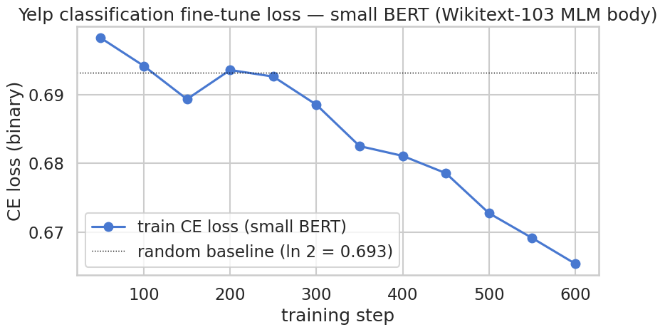
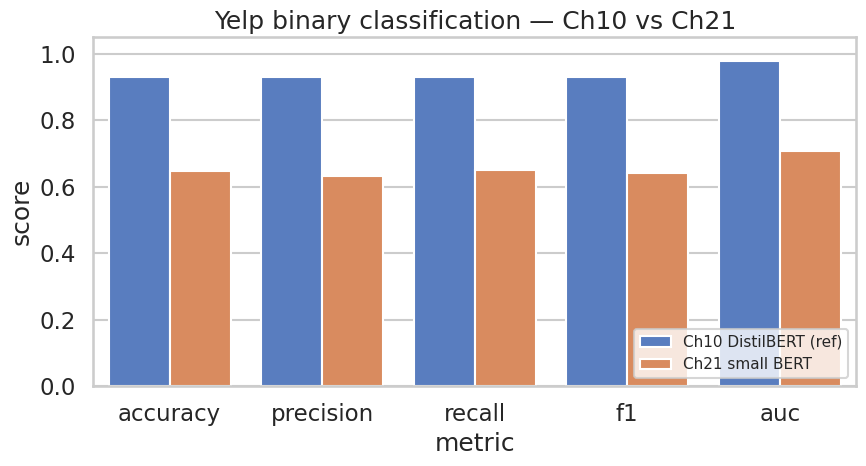

## 환경 준비

```python
%pip install -q -U transformers datasets accelerate
```

**▶ 실행 결과**

```text
   ━━━━━━━━━━━━━━━━━━━━━━━━━━━━━━━━━━━━━━━━ 11.2/11.2 MB 106.4 MB/s eta 0:00:00
   ━━━━━━━━━━━━━━━━━━━━━━━━━━━━━━━━━━━━━━━━ 555.1/555.1 kB 46.2 MB/s eta 0:00:00
   ━━━━━━━━━━━━━━━━━━━━━━━━━━━━━━━━━━━━━━━━ 389.2/389.2 kB 26.7 MB/s eta 0:00:00
   ━━━━━━━━━━━━━━━━━━━━━━━━━━━━━━━━━╺━━━━━━ 40.8/48.9 MB 273.1 MB/s eta 0:00:01
   ━━━━━━━━━━━━━━━━━━━━━━━━━━━━━━━━━━━━━━━╸ 48.9/48.9 MB 176.6 MB/s eta 0:00:01
   ━━━━━━━━━━━━━━━━━━━━━━━━━━━━━━━━━━━━━━━╸ 48.9/48.9 MB 176.6 MB/s eta 0:00:01
   ━━━━━━━━━━━━━━━━━━━━━━━━━━━━━━━━━━━━━━━━ 48.9/48.9 MB 17.6 MB/s eta 0:00:00
```

```python
import warnings
warnings.filterwarnings("ignore")

import math
import time

import numpy as np
import pandas as pd
import matplotlib.pyplot as plt
import seaborn as sns
import torch

from datasets import load_dataset
from transformers import (
    AutoTokenizer,
    BertConfig,
    BertForMaskedLM,
    BertForSequenceClassification,
    DataCollatorForLanguageModeling,
    Trainer,
    TrainingArguments,
)
from sklearn.metrics import (
    accuracy_score, precision_recall_fscore_support,
    classification_report, roc_auc_score, confusion_matrix,
)

plt.rcParams["axes.unicode_minus"] = False

# device 자동감지 — Colab(T4) 은 CUDA, 로컬 Mac 은 MPS, 그 외 CPU
if torch.cuda.is_available():
    DEVICE = "cuda"
elif getattr(torch.backends, "mps", None) is not None and torch.backends.mps.is_available():
    DEVICE = "mps"
else:
    DEVICE = "cpu"

print(f"PyTorch:        {torch.__version__}")
print(f"CUDA available: {torch.cuda.is_available()}")
print(f"Device:         {DEVICE}")
if DEVICE == "cuda":
    print(f"GPU:             {torch.cuda.get_device_name(0)}")
elif DEVICE == "cpu":
    print("Warning: CPU runtime — both MLM and classification will be very slow. Switch to T4 recommended.")
```

**▶ 실행 결과**

```text
PyTorch:        2.11.0+cu128
CUDA available: True
Device:         cuda
GPU:             Tesla T4
```

```python
!nvidia-smi
```

**▶ 실행 결과**

```text
Wed Jun 17 21:58:55 2026       
+-----------------------------------------------------------------------------------------+
| NVIDIA-SMI 580.82.07              Driver Version: 580.82.07      CUDA Version: 13.0     |
+-----------------------------------------+------------------------+----------------------+
| GPU  Name                 Persistence-M | Bus-Id          Disp.A | Volatile Uncorr. ECC |
| Fan  Temp   Perf          Pwr:Usage/Cap |           Memory-Usage | GPU-Util  Compute M. |
|                                         |                        |               MIG M. |
|=========================================+========================+======================|
|   0  Tesla T4                       Off |   00000000:00:04.0 Off |                    0 |
| N/A   36C    P8             10W /   70W |       3MiB /  15360MiB |      0%      Default |
|                                         |                        |                  N/A |
+-----------------------------------------+------------------------+----------------------+

+-----------------------------------------------------------------------------------------+
| Processes:                                                                              |
|  GPU   GI   CI              PID   Type   Process name                        GPU Memory |
|        ID   ID                                                               Usage      |
|=========================================================================================|
|  No running processes found                                                             |
+-----------------------------------------------------------------------------------------+
```

```python
SEED = 42
N_TRAIN = 5000
N_EVAL = 1000

ds_raw = load_dataset("fancyzhx/yelp_polarity")
print(f"splits: {list(ds_raw.keys())}")
print(f"train size: {len(ds_raw['train']):,}")
print(f"test size:  {len(ds_raw['test']):,}")
print(f"label names: {ds_raw['train'].features['label'].names}")

# Ch 10 과 동일한 seed·크기로 sample
ds_train_full = ds_raw["train"].shuffle(seed=SEED).select(range(N_TRAIN))
ds_eval_full  = ds_raw["test"].shuffle(seed=SEED).select(range(N_EVAL))

# 클래스 분포
train_labels = np.array(ds_train_full["label"])
eval_labels  = np.array(ds_eval_full["label"])
print(f"\nsampled train: {len(ds_train_full):,}")
print(f"  positive rate: {train_labels.mean():.1%}  (label 1)")
print(f"sampled eval:  {len(ds_eval_full):,}")
print(f"  positive rate: {eval_labels.mean():.1%}  (label 1)")

print(f"\nfirst train sample:")
print(f"  label: {ds_train_full[0]['label']} ({ds_raw['train'].features['label'].names[ds_train_full[0]['label']]})")
print(f"  text:  {ds_train_full[0]['text'][:200]}...")
```

**▶ 실행 결과**

```text
splits: ['train', 'test']
train size: 560,000
test size:  38,000
label names: ['1', '2']
sampled train: 5,000
  positive rate: 50.7%  (label 1)
sampled eval:  1,000
  positive rate: 48.4%  (label 1)

first train sample:
  label: 1 (2)
  text:  Decent size, decent selection, decent staff.\n\nI guess that can wholly sum this place up, it's decent.  As with many other stores …(뒤 72자 생략)
```

```python
TOKENIZER_NAME = "bert-base-uncased"
tokenizer = AutoTokenizer.from_pretrained(TOKENIZER_NAME)

print(f"tokenizer:        {TOKENIZER_NAME}")
print(f"vocab_size:       {tokenizer.vocab_size:,}")
print(f"model_max_length: {tokenizer.model_max_length}")

# 분류 입력 예시
SAMPLE = "The food was unforgettable and the service was excellent."
enc = tokenizer(SAMPLE, return_tensors="pt", truncation=True, max_length=128)
tokens = tokenizer.convert_ids_to_tokens(enc["input_ids"][0])
print(f"\nsample: {SAMPLE!r}")
print(f"tokens ({len(tokens)}): {tokens}")
```

**▶ 실행 결과**

```text
tokenizer:        bert-base-uncased
vocab_size:       30,522
model_max_length: 512

sample: 'The food was unforgettable and the service was excellent.'
tokens (15): ['[CLS]', 'the', 'food', 'was', 'un', '##for', '##get', '##table', 'and', 'the', 'service', 'was', 'excellent', '.', '[SEP]']
```

```python
# Ch 20 과 같은 작은 BERT 설정
HIDDEN_SIZE         = 256
NUM_HIDDEN_LAYERS   = 4
NUM_ATTENTION_HEADS = 4
INTERMEDIATE_SIZE   = 1024
MAX_POS_EMBED       = 128
BLOCK_SIZE          = 128

mlm_config = BertConfig(
    vocab_size=tokenizer.vocab_size,
    hidden_size=HIDDEN_SIZE,
    num_hidden_layers=NUM_HIDDEN_LAYERS,
    num_attention_heads=NUM_ATTENTION_HEADS,
    intermediate_size=INTERMEDIATE_SIZE,
    max_position_embeddings=MAX_POS_EMBED,
    pad_token_id=tokenizer.pad_token_id,
)

mlm_model = BertForMaskedLM(mlm_config)  # random init
total = sum(p.numel() for p in mlm_model.parameters())
print(f"Small BERT config: hidden={HIDDEN_SIZE}, layer={NUM_HIDDEN_LAYERS}, head={NUM_ATTENTION_HEADS}")
print(f"Total parameters:  {total:,}  ({total/1e6:.2f} M)")
```

**▶ 실행 결과**

```text
Small BERT config: hidden=256, layer=4, head=4
Total parameters:  11,103,290  (11.10 M)
```

```python
# MLM 사전학습용 일반 도메인 코퍼스: Wikitext-103 (분류용 Yelp 와 별도)
# 한국어 Ch 23 self-contained 와 동일한 hyperparams 로 통일 (2K × 3 epoch)
N_MLM_TRAIN = 2000
N_MLM_EVAL  = 400

print("downloading Wikitext-103 (Salesforce/wikitext, wikitext-103-raw-v1)...")
raw_train = load_dataset("Salesforce/wikitext", "wikitext-103-raw-v1", split="train")
raw_eval  = load_dataset("Salesforce/wikitext", "wikitext-103-raw-v1", split="validation")

# 빈 줄 / 너무 짧은 줄 (제목·메타) / 너무 긴 줄 (목록·인용) 제외
def is_good(ex, min_len=50, max_len=2000):
    t = ex["text"].strip()
    return min_len <= len(t) <= max_len

mlm_train_raw = (
    raw_train.filter(is_good).shuffle(seed=SEED).select(range(N_MLM_TRAIN))
    .remove_columns([c for c in raw_train.column_names if c != "text"])
)
mlm_eval_raw = (
    raw_eval.filter(is_good).shuffle(seed=SEED).select(range(N_MLM_EVAL))
    .remove_columns([c for c in raw_eval.column_names if c != "text"])
)

print(f"MLM train paragraphs: {len(mlm_train_raw):,}  (wikitext-103)")
print(f"MLM eval paragraphs:  {len(mlm_eval_raw):,}")
print(f"first MLM sample: {mlm_train_raw[0]['text'][:120]}...")

def mlm_tokenize(examples):
    return tokenizer(examples["text"], add_special_tokens=False, truncation=False)

mlm_tokenized_train = mlm_train_raw.map(mlm_tokenize, batched=True, remove_columns=["text"])
mlm_tokenized_eval  = mlm_eval_raw.map(mlm_tokenize,  batched=True, remove_columns=["text"])

def group_texts(examples):
    concatenated = {k: sum(examples[k], []) for k in examples.keys()}
    total_length = len(concatenated[list(examples.keys())[0]])
    total_length = (total_length // BLOCK_SIZE) * BLOCK_SIZE
    result = {
        k: [t[i : i + BLOCK_SIZE] for i in range(0, total_length, BLOCK_SIZE)]
        for k, t in concatenated.items()
    }
    result["labels"] = [ids.copy() for ids in result["input_ids"]]
    return result

lm_train = mlm_tokenized_train.map(group_texts, batched=True, batch_size=1000)
lm_eval  = mlm_tokenized_eval.map(group_texts,  batched=True, batch_size=1000)

print(f"\nMLM train blocks: {len(lm_train):,}  (block_size={BLOCK_SIZE})")
print(f"MLM eval blocks:  {len(lm_eval):,}")
```

**▶ 실행 결과**

```text
downloading Wikitext-103 (Salesforce/wikitext, wikitext-103-raw-v1)...
MLM train paragraphs: 2,000  (wikitext-103)
MLM eval paragraphs:  400
first MLM sample:  Balinor Buckhannah , the Crown Prince of the country of Callahorn and the " charismatic commander of [ the ] Border Leg...
MLM train blocks: 2,100  (block_size=128)
MLM eval blocks:  428
```

```python
mlm_collator = DataCollatorForLanguageModeling(
    tokenizer=tokenizer,
    mlm=True,
    mlm_probability=0.15,
)
```

```python
# 짧은 예시 문장 하나에 collator 한 번 돌려서 어떤 자리가 어떻게 바뀌는지 직접 봅니다.
# 사전학습 데이터 (위키) 도메인 문장 — collator 는 토큰 id 위에서만 동작하므로 도메인 무관.
import torch
import pandas as pd

DEMO_SENT = "The capital of France is Paris, located on the banks of the Seine river."
demo_enc = tokenizer(DEMO_SENT, return_tensors=None)
demo_ids = demo_enc["input_ids"]

torch.manual_seed(0)  # 재현성: 같은 seed 면 같은 마스킹
demo_batch = [{"input_ids": demo_ids, "attention_mask": [1] * len(demo_ids)}]
demo_out = mlm_collator(demo_batch)

masked_ids = demo_out["input_ids"][0].tolist()
labels     = demo_out["labels"][0].tolist()   # -100 = loss 무시, 그 외 = 원본 token id
mask_id    = tokenizer.mask_token_id

orig_tokens   = tokenizer.convert_ids_to_tokens(demo_ids)
masked_tokens = tokenizer.convert_ids_to_tokens(masked_ids)

rows = []
for orig_id, new_id, lab, orig_tok, new_tok in zip(demo_ids, masked_ids, labels, orig_tokens, masked_tokens):
    if lab == -100:
        kind = "—"                      # 미선택 (loss 계산 X)
    elif new_id == mask_id:
        kind = "[MASK] (80%)"            # 표준 마스킹
    elif new_id == orig_id:
        kind = "kept (10%)"              # 선택됐지만 원본 유지
    else:
        kind = "random (10%)"            # 다른 token 으로 교체
    rows.append({
        "pos": len(rows),
        "original": orig_tok,
        "after_collator": new_tok,
        "label_id": lab,
        "what_happened": kind,
    })

demo_df = pd.DataFrame(rows)
print(demo_df.to_string(index=False))
```

**▶ 실행 결과**

```text
 pos original after_collator  label_id what_happened
   0    [CLS]          [CLS]      -100             —
   1      the            the      -100             —
   2  capital         [MASK]      3007  [MASK] (80%)
   3       of             of      1997    kept (10%)
   4   france         france      -100             —
   5       is             is      -100             —
   6    paris          paris      -100             —
   7        ,              ,      -100             —
   8  located        located      -100             —
   9       on             on      -100             —
  10      the            the      -100             —
  11    banks          banks      -100             —
  12       of         [MASK]      1997  [MASK] (80%)
  13      the            the      -100             —
  14    seine          seine      -100             —
  15    river          river      -100             —
  16        .              .      -100             —
  17    [SEP]          [SEP]      -100             —
```

```python
# 큰 batch (block 64개 = 약 8000 토큰) 에서 80/10/10 비율이 실제로 맞는지 통계로 확인.
torch.manual_seed(0)
N_DEMO = 64
big_batch = [
    {"input_ids": lm_train[i]["input_ids"], "attention_mask": [1] * BLOCK_SIZE}
    for i in range(N_DEMO)
]
big_out = mlm_collator(big_batch)

in_ids = big_out["input_ids"]
lab    = big_out["labels"]

selected = (lab != -100)                                  # loss 계산 대상
n_total    = lab.numel()
n_selected = selected.sum().item()
n_mask     = ((in_ids == mask_id) & selected).sum().item()
n_kept     = ((in_ids == lab) & selected).sum().item()    # 선택됐지만 원본 유지
n_random   = n_selected - n_mask - n_kept

print(f"Total tokens:                {n_total:>7,}")
print(f"Selected for loss (target 15%):    {n_selected:>7,}  ({100 * n_selected / n_total:5.2f}%)")
print(f"  └─ replaced with [MASK]:   {n_mask:>7,}  ({100 * n_mask / n_selected:5.2f}% of selected)")
print(f"  └─ replaced with random:   {n_random:>7,}  ({100 * n_random / n_selected:5.2f}% of selected)")
print(f"  └─ kept as original:       {n_kept:>7,}  ({100 * n_kept / n_selected:5.2f}% of selected)")
print()
print("이론치: 선택 15% / 그 중 80-10-10 으로 [MASK]-random-kept. 표본이 작아 약간 흔들리지만 비율 일치.")
```

**▶ 실행 결과**

```text
Total tokens:                  8,192
Selected for loss (target 15%):      1,217  (14.86%)
  └─ replaced with [MASK]:       961  (78.96% of selected)
  └─ replaced with random:       121  ( 9.94% of selected)
  └─ kept as original:           135  (11.09% of selected)

이론치: 선택 15% / 그 중 80-10-10 으로 [MASK]-random-kept. 표본이 작아 약간 흔들리지만 비율 일치.
```

```python
USE_FP16 = (DEVICE == "cuda")
MLM_EPOCHS = 3   # 한국어 Ch 23 self-contained 와 동일 (1 epoch 은 도메인 gap 작은 영어에선 충분하지만, 일관성 위해 3 으로 통일)

mlm_args = TrainingArguments(
    output_dir="./ch21_mlm_output",
    num_train_epochs=MLM_EPOCHS,
    per_device_train_batch_size=32,
    per_device_eval_batch_size=64,
    learning_rate=5e-4,
    weight_decay=0.01,
    warmup_ratio=0.06,
    fp16=USE_FP16,
    eval_strategy="epoch",
    logging_steps=20,
    save_strategy="no",
    report_to="none",
    seed=SEED,
)

mlm_trainer = Trainer(
    model=mlm_model,
    args=mlm_args,
    train_dataset=lm_train,
    eval_dataset=lm_eval,
    data_collator=mlm_collator,
    processing_class=tokenizer,
)

print(f"MLM epochs:     {MLM_EPOCHS}")
print(f"MLM batch size: {mlm_args.per_device_train_batch_size}")
print(f"MLM learning rate: {mlm_args.learning_rate}")
print(f"MLM fp16:       {USE_FP16}")
print(f"MLM steps:      {len(lm_train) // mlm_args.per_device_train_batch_size * MLM_EPOCHS}")
```

**▶ 실행 결과**

```text
[transformers] warmup_ratio is deprecated and will be removed in v5.2. Use `warmup_steps` instead.
MLM epochs:     3
MLM batch size: 32
MLM learning rate: 0.0005
MLM fp16:       True
MLM steps:      195
```

```python
t0 = time.time()
mlm_result = mlm_trainer.train()
mlm_elapsed = time.time() - t0
print(f"\nMLM pretraining done in {mlm_elapsed/60:.1f} min")
print(f"mean train loss: {mlm_result.training_loss:.4f}")
print(f"random baseline (ln vocab): {math.log(tokenizer.vocab_size):.4f}")
```

**▶ 실행 결과**

```text
<IPython.core.display.HTML object>
MLM pretraining done in 0.3 min
mean train loss: 7.5983
random baseline (ln vocab): 10.3262
```

**결과 해석**

train loss 7.60 은 무작위 추측 기준선 10.33 보다 분명히 낮아, 단 0.3 분의 짧은 사전학습으로도 모델이 언어 패턴을 일부 익혔음을 보여줍니다. 다만 기준선과의 격차가 크지 않아 학습 강도가 약했음도 함께 드러납니다.

```python
mlm_eval_metrics = mlm_trainer.evaluate()
mlm_eval_loss = mlm_eval_metrics["eval_loss"]
print(f"MLM eval loss:        {mlm_eval_loss:.4f}")
print(f"MLM eval perplexity:  {math.exp(mlm_eval_loss):.2f}")
print(f"(random baseline PPL: {tokenizer.vocab_size:,})")
```

**▶ 실행 결과**

```text
<IPython.core.display.HTML object>
<IPython.core.display.HTML object>
MLM eval loss:        7.2001
MLM eval perplexity:  1339.60
(random baseline PPL: 30,522)
```

**결과 해석**

검증 perplexity 1339.60 은 무작위 기준선 30,522 의 약 1/23 수준으로, 다음 토큰 후보를 3 만 개에서 천여 개 규모로 좁힌 셈입니다. 그래도 절대값이 여전히 높아, 짧은 사전학습으로 얻은 표현이 제한적임을 보여줍니다.

```python
# 분류용 config: 같은 본체 구조 + num_labels=2 + problem_type
cls_config = BertConfig(
    vocab_size=tokenizer.vocab_size,
    hidden_size=HIDDEN_SIZE,
    num_hidden_layers=NUM_HIDDEN_LAYERS,
    num_attention_heads=NUM_ATTENTION_HEADS,
    intermediate_size=INTERMEDIATE_SIZE,
    max_position_embeddings=MAX_POS_EMBED,
    pad_token_id=tokenizer.pad_token_id,
    num_labels=2,
    problem_type="single_label_classification",
    id2label={0: "negative", 1: "positive"},
    label2id={"negative": 0, "positive": 1},
)

cls_model = BertForSequenceClassification(cls_config)

# MLM 본체 (embeddings + encoder) 를 분류 모델로 *복사* — pooler 까지 같이
missing, unexpected = cls_model.bert.load_state_dict(mlm_model.bert.state_dict(), strict=False)
print(f"본체 가중치 복사 완료")
print(f"  missing keys (분류 측에만 있는 부분): {len(missing)}  e.g. {missing[:3] if missing else []}")
print(f"  unexpected keys (MLM 측 잉여):       {len(unexpected)}  e.g. {unexpected[:3] if unexpected else []}")

# 파라미터 수 비교
total_cls = sum(p.numel() for p in cls_model.parameters())
total_body = sum(p.numel() for n, p in cls_model.named_parameters() if "classifier" not in n)
total_head = sum(p.numel() for n, p in cls_model.named_parameters() if "classifier" in n)
print(f"\nClassification model parameters:")
print(f"  body (embeddings + encoder + pooler): {total_body:>10,}  ({total_body/total_cls:.1%})")
print(f"  classifier head Linear(256, 2):       {total_head:>10,}  ({total_head/total_cls:.1%})")
print(f"  total:                                 {total_cls:>10,}  ({total_cls/1e6:.2f} M)")
```

**▶ 실행 결과**

```text
본체 가중치 복사 완료
  missing keys (분류 측에만 있는 부분): 2  e.g. ['pooler.dense.weight', 'pooler.dense.bias']
  unexpected keys (MLM 측 잉여):       0  e.g. []

Classification model parameters:
  body (embeddings + encoder + pooler): 11,072,256  (100.0%)
  classifier head Linear(256, 2):              514  (0.0%)
  total:                                 11,072,770  (11.07 M)
```

```python
# 분류용 토큰화 — 문장 단위, [CLS]/[SEP] 부착, max_length=128
def cls_tokenize(batch):
    out = tokenizer(batch["text"], truncation=True, max_length=128)
    out["labels"] = [int(l) for l in batch["label"]]
    return out

cls_train = ds_train_full.map(cls_tokenize, batched=True).remove_columns(
    [c for c in ds_train_full.column_names if c not in ("input_ids", "attention_mask", "token_type_ids", "labels")]
)
cls_eval  = ds_eval_full.map(cls_tokenize,  batched=True).remove_columns(
    [c for c in ds_eval_full.column_names if c not in ("input_ids", "attention_mask", "token_type_ids", "labels")]
)

print(cls_train)
print(f"\nFirst sample label: {cls_train[0]['labels']}  (int 0 or 1)")
```

**▶ 실행 결과**

```text
Dataset({
    features: ['input_ids', 'token_type_ids', 'attention_mask', 'labels'],
    num_rows: 5000
})

First sample label: 1  (int 0 or 1)
```

```python
def compute_metrics(eval_pred):
    logits, labels = eval_pred
    # 안정 softmax (K=2)
    exp = np.exp(logits - logits.max(axis=1, keepdims=True))
    probs_full = exp / exp.sum(axis=1, keepdims=True)
    preds = probs_full.argmax(axis=1)
    probs_pos = probs_full[:, 1]   # 클래스 1 의 확률 = AUC 입력

    p, r, f1, _ = precision_recall_fscore_support(labels, preds, average="binary", zero_division=0)
    return {
        "accuracy":  float(accuracy_score(labels, preds)),
        "precision": float(p),
        "recall":    float(r),
        "f1":        float(f1),
        "auc":       float(roc_auc_score(labels, probs_pos)),
    }
```

```python
# Ch 10 과 같은 hyperparams — 변하는 건 *본체 출발점* 뿐
cls_args = TrainingArguments(
    output_dir="./ch21_cls_output",
    num_train_epochs=2,
    per_device_train_batch_size=16,
    per_device_eval_batch_size=32,
    learning_rate=2e-5,
    fp16=USE_FP16,
    eval_strategy="epoch",
    logging_steps=50,
    save_strategy="no",
    report_to="none",
    seed=SEED,
)

cls_trainer = Trainer(
    model=cls_model,
    args=cls_args,
    train_dataset=cls_train,
    eval_dataset=cls_eval,
    processing_class=tokenizer,
    compute_metrics=compute_metrics,
)

t0 = time.time()
cls_result = cls_trainer.train()
cls_elapsed = time.time() - t0
print(f"\nClassification fine-tune done in {cls_elapsed/60:.1f} min")
print(f"mean train loss: {cls_result.training_loss:.4f}")
print(f"random baseline (ln 2): {math.log(2):.4f}")
```

**▶ 실행 결과**

```text
<IPython.core.display.HTML object>
Classification fine-tune done in 0.3 min
mean train loss: 0.6829
random baseline (ln 2): 0.6931
```

**결과 해석**

train loss 0.6829 가 무작위 기준선 0.6931 을 살짝만 밑돌아, 사전학습이 약했던 본체로 시작한 탓에 분류 학습이 거의 출발선 근처에 머무는 모습입니다.

```python
!nvidia-smi
```

**▶ 실행 결과**

```text
Wed Jun 17 22:00:17 2026       
+-----------------------------------------------------------------------------------------+
| NVIDIA-SMI 580.82.07              Driver Version: 580.82.07      CUDA Version: 13.0     |
+-----------------------------------------+------------------------+----------------------+
| GPU  Name                 Persistence-M | Bus-Id          Disp.A | Volatile Uncorr. ECC |
| Fan  Temp   Perf          Pwr:Usage/Cap |           Memory-Usage | GPU-Util  Compute M. |
|                                         |                        |               MIG M. |
|=========================================+========================+======================|
|   0  Tesla T4                       Off |   00000000:00:04.0 Off |                    0 |
| N/A   53C    P0             42W /   70W |     797MiB /  15360MiB |     29%      Default |
|                                         |                        |                  N/A |
+-----------------------------------------+------------------------+----------------------+

+-----------------------------------------------------------------------------------------+
| Processes:                                                                              |
|  GPU   GI   CI              PID   Type   Process name                        GPU Memory |
|        ID   ID                                                               Usage      |
|=========================================================================================|
|    0   N/A  N/A           13366      C   /usr/bin/python3                        794MiB |
+-----------------------------------------------------------------------------------------+
```

```python
cls_eval_metrics = cls_trainer.evaluate()
print("Ch 21 small BERT (scratch MLM 3 epoch + classification fine-tune) — eval:")
for k, v in cls_eval_metrics.items():
    if k.startswith("eval_") and isinstance(v, float):
        print(f"  {k:>20}: {v:.4f}")
```

**▶ 실행 결과**

```text
<IPython.core.display.HTML object>
<IPython.core.display.HTML object>
Ch 21 small BERT (scratch MLM 3 epoch + classification fine-tune) — eval:
             eval_loss: 0.6590
         eval_accuracy: 0.6490
        eval_precision: 0.6338
           eval_recall: 0.6508
               eval_f1: 0.6422
              eval_auc: 0.7079
```

**결과 해석**

정확도 0.649, F1 0.642, AUC 0.708 로 50% 무작위 추측보다는 확실히 낫지만, 본격적인 분류기로 보기엔 부족합니다. 짧게 사전학습한 작은 BERT 의 표현력 한계가 그대로 성능 천장으로 나타난 결과입니다.

```python
preds_output = cls_trainer.predict(cls_eval)
cls_logits = preds_output.predictions
cls_labels = preds_output.label_ids.astype(int)

exp = np.exp(cls_logits - cls_logits.max(axis=1, keepdims=True))
cls_probs_full = exp / exp.sum(axis=1, keepdims=True)
cls_preds = cls_probs_full.argmax(axis=1)
cls_probs_pos = cls_probs_full[:, 1]

print(f"Logits shape: {cls_logits.shape}")
print(f"Predicted positive rate: {(cls_preds == 1).mean():.1%}")
print(f"Top-1 prob mean: correct={cls_probs_full.max(axis=1)[cls_preds == cls_labels].mean():.4f}, "
      f"wrong={cls_probs_full.max(axis=1)[cls_preds != cls_labels].mean():.4f}")
print()
print(classification_report(
    cls_labels, cls_preds,
    target_names=["negative", "positive"],
    digits=4, zero_division=0,
))
```

**▶ 실행 결과**

```text
<IPython.core.display.HTML object>
Logits shape: (1000, 2)
Predicted positive rate: 49.7%
Top-1 prob mean: correct=0.5529, wrong=0.5385

              precision    recall  f1-score   support

    negative     0.6640    0.6473    0.6555       516
    positive     0.6338    0.6508    0.6422       484

    accuracy                         0.6490      1000
   macro avg     0.6489    0.6491    0.6489      1000
weighted avg     0.6494    0.6490    0.6491      1000
```

**결과 해석**

예측 양성 비율 49.7% 와 두 클래스가 거의 대칭인 precision/recall 은 모델이 한쪽으로 쏠리지 않고 고르게 틀리고 있음을 보여줍니다. 맞힌 예측의 평균 확신도(0.553)와 틀린 예측의 확신도(0.539)가 거의 같다는 점은 분류 경계가 아직 흐릿함을 뜻합니다.

```python
log_history = cls_trainer.state.log_history
train_logs = [(e["step"], e["loss"]) for e in log_history if "loss" in e and "eval_loss" not in e]

if train_logs:
    steps, losses = zip(*train_logs)
    random_baseline = math.log(2)

    sns.set_theme(style="whitegrid", context="talk")
    fig, ax = plt.subplots(figsize=(9, 5))
    ax.plot(steps, losses, "o-", color="#4878D0", label="train CE loss (small BERT)")
    ax.axhline(random_baseline, color="black", lw=1.0, ls=":",
               label=f"random baseline (ln 2 = {random_baseline:.3f})")
    ax.set_xlabel("training step")
    ax.set_ylabel("CE loss (binary)")
    ax.set_title("Yelp classification fine-tune loss — small BERT (Wikitext-103 MLM body)")
    ax.legend()
    plt.tight_layout()
    plt.show()
else:
    print("No train loss logs found.")
```

**▶ 실행 결과**



**결과 해석**

train CE loss 곡선이 ln 2 기준선 바로 아래에서 천천히 내려가, 학습이 진행되긴 하지만 폭이 매우 좁습니다. 사전학습이 충분했다면 이 곡선이 훨씬 가파르게 떨어졌을 자리입니다.

```python
sns.set_theme(style="white", context="talk")
cm = confusion_matrix(cls_labels, cls_preds, labels=[0, 1])
cm_norm = cm / cm.sum(axis=1, keepdims=True)

fig, ax = plt.subplots(figsize=(6, 5))
sns.heatmap(
    cm_norm, annot=cm, fmt="d",
    cmap="Blues", vmin=0, vmax=1,
    xticklabels=["negative", "positive"],
    yticklabels=["negative", "positive"],
    cbar_kws={"label": "row-normalized (recall)"}, ax=ax,
)
ax.set_xlabel("Predicted")
ax.set_ylabel("Actual")
ax.set_title("Ch 21 small BERT — Confusion Matrix")
plt.tight_layout()
plt.show()
```

**▶ 실행 결과**


**결과 해석**

대각선(정답)이 두 클래스 모두 0.65 안팎이고 오분류도 양쪽에 고르게 퍼져, 특정 클래스만 못 맞히는 편향 없이 전반적으로 절반 가까이 틀리는 모습입니다.

```python
# Ch 10 reference 수치 — yelp_polarity 5K/1K + DistilBERT fine-tune 2 epoch 의 *전형적* 결과
# (실측치는 학습자가 Ch 10 노트북을 돌려 본인 값으로 갱신 권장)
CH10_REFERENCE = {
    "accuracy":  0.93,
    "precision": 0.93,
    "recall":    0.93,
    "f1":        0.93,
    "auc":       0.98,
}

ch21_metrics = {k.replace("eval_", ""): v for k, v in cls_eval_metrics.items()
                if k.startswith("eval_") and isinstance(v, float)
                and k.replace("eval_", "") in CH10_REFERENCE}

comparison = pd.DataFrame({
    "metric":              list(CH10_REFERENCE.keys()),
    "Ch10 DistilBERT (ref)": [CH10_REFERENCE[k] for k in CH10_REFERENCE.keys()],
    "Ch21 small BERT":     [ch21_metrics.get(k, float("nan")) for k in CH10_REFERENCE.keys()],
})
comparison["delta (Ch21 - Ch10)"] = comparison["Ch21 small BERT"] - comparison["Ch10 DistilBERT (ref)"]
print("Ch10 vs Ch21 — classification metrics")
print(comparison.round(4).to_string(index=False))
```

**▶ 실행 결과**

```text
Ch10 vs Ch21 — classification metrics
   metric  Ch10 DistilBERT (ref)  Ch21 small BERT  delta (Ch21 - Ch10)
 accuracy                   0.93           0.6490              -0.2810
precision                   0.93           0.6338              -0.2962
   recall                   0.93           0.6508              -0.2792
       f1                   0.93           0.6422              -0.2878
      auc                   0.98           0.7079              -0.2721
```

**결과 해석**

모든 지표에서 Ch 10 의 기성 사전학습 DistilBERT 가 0.28 - 0.30 포인트 앞섭니다. 대규모 코퍼스로 오래 사전학습한 본체와, 위키 2 천 단락으로 잠깐 사전학습한 작은 본체의 차이가 분류 성능 격차로 그대로 환산된 결과입니다.

```python
# bar chart 로 한눈에 보기
sns.set_theme(style="whitegrid", context="talk")
plot_df = comparison.melt(
    id_vars=["metric"],
    value_vars=["Ch10 DistilBERT (ref)", "Ch21 small BERT"],
    var_name="model", value_name="score",
)

fig, ax = plt.subplots(figsize=(9, 5))
sns.barplot(
    data=plot_df, x="metric", y="score", hue="model",
    palette={"Ch10 DistilBERT (ref)": "#4878D0", "Ch21 small BERT": "#EE854A"},
    ax=ax,
)
ax.set_ylim(0, 1.05)
ax.set_title("Yelp binary classification — Ch10 vs Ch21")
ax.set_xlabel("metric")
ax.set_ylabel("score")
ax.legend(loc="lower right", fontsize=11)
plt.tight_layout()
plt.show()
```

**▶ 실행 결과**



**결과 해석**

막대 높이 차이가 모든 지표에서 일정하게 벌어져, 사전학습의 양과 질이 곧 다운스트림 분류 성능으로 이어진다는 점을 한눈에 보여줍니다. 작은 BERT 도 무작위 수준은 넘었지만, 사전학습이 분류의 출발점을 결정한다는 메시지가 분명히 드러납니다.
