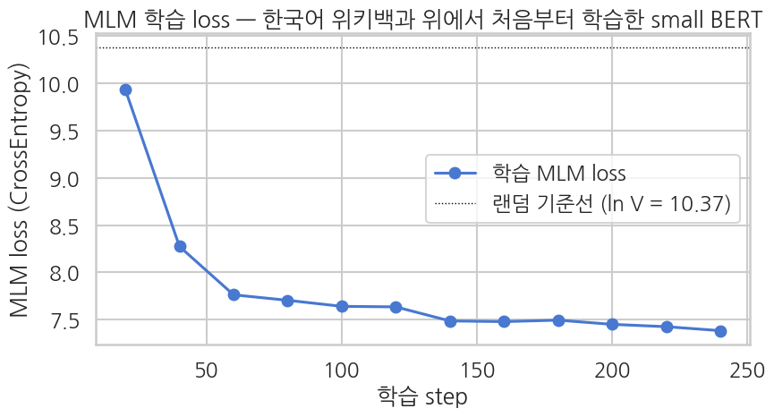
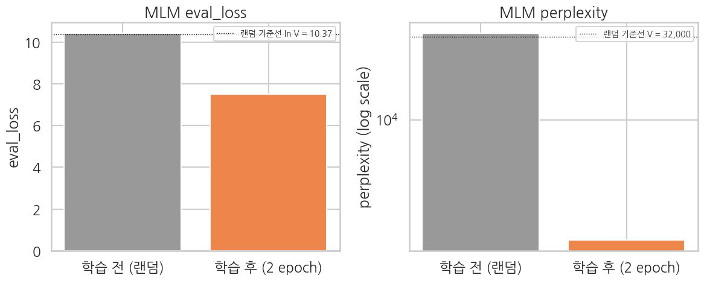

## 학습 결과 — Loss / Perplexity 곡선

학습이 *실제로 진행* 됐는지 세 각도로 확인:
1. step-by-step train loss 곡선 — 빠르게 약 10.37 (random baseline) 에서 5 이하로 떨어졌는지
2. eval set 의 perplexity — 외부 텍스트에서도 일관된 수준인지
3. 임의 한국어 문장에 `[MASK]` 를 끼워 top-5 후보 출력 — *어떤 한국어 토큰을 예측하는지* 정성 평가

```python
# 학습 로그에서 train loss 추출
log_history = trainer.state.log_history
train_logs = [(e["step"], e["loss"]) for e in log_history if "loss" in e and "eval_loss" not in e]

if train_logs:
    steps, losses = zip(*train_logs)
    random_baseline = math.log(tokenizer.vocab_size)

    sns.set_theme(style="whitegrid", context="talk", font="NanumGothic", rc={"axes.unicode_minus": False})
    fig, ax = plt.subplots(figsize=(9, 5))
    ax.plot(steps, losses, "o-", color="#4878D0", label="학습 MLM loss")
    ax.axhline(random_baseline, color="black", lw=1.0, ls=":",
               label=f"랜덤 기준선 (ln V = {random_baseline:.2f})")
    ax.set_xlabel("학습 step")
    ax.set_ylabel("MLM loss (CrossEntropy)")
    ax.set_title("MLM 학습 loss — 한국어 위키백과 위에서 처음부터 학습한 small BERT")
    ax.legend()
    plt.tight_layout()
    plt.show()
else:
    print("No train loss logs found.")
```

**▶ 실행 결과**



```python
eval_metrics = trainer.evaluate()
eval_loss = eval_metrics["eval_loss"]
eval_ppl = math.exp(eval_loss)
print("=== eval (held-out Korean Wikipedia paragraphs) ===")
for k, v in eval_metrics.items():
    if isinstance(v, float):
        print(f"  {k:>22}: {v:.4f}")
print()
print(f"  MLM loss:               {eval_loss:.4f}")
print(f"  perplexity (exp loss):  {eval_ppl:.2f}")
print(f"  random baseline PPL:    {tokenizer.vocab_size:,}  (uniform over vocab)")
print(f"  -> model narrowed vocab to approx. {eval_ppl:.0f} candidates per masked position")
```

**▶ 실행 결과**

```text
Training Loss  Validation Loss  Epoch
7.385564       7.513839         2
=== eval (held-out Korean Wikipedia paragraphs) ===
               eval_loss: 7.5138

  MLM loss:               7.5138
  perplexity (exp loss):  1833.24
  random baseline PPL:    32,000  (uniform over vocab)
  -> model narrowed vocab to approx. 1833 candidates per masked position
```

## 사전학습 전·후 비교 — random init 본체 vs 2 epoch 학습 후

학습 직전 (5-2 마지막 셀에서 측정해 둔 `pre_eval_loss` / `pre_top5_records`) 와 *완전히 같은 문장·같은 평가 셋* 에 학습 후 모델을 적용해 두 결과를 나란히 봅니다. *사전학습이 본체에 무엇을 새겼는가* 의 가장 직접적인 증거.

```python
# ---- 사전학습 후 eval_loss / perplexity ----
post_eval = trainer.evaluate()
post_eval_loss = post_eval["eval_loss"]
post_eval_ppl  = math.exp(post_eval_loss)

print("=" * 78)
print("AFTER pretraining  (2 epoch MLM)")
print("=" * 78)
print(f"  eval_loss       : {post_eval_loss:.4f}   (before: {pre_eval_loss:.4f})")
print(f"  eval_perplexity : {post_eval_ppl:,.2f}        (before: {pre_eval_ppl:,.0f})")
print(f"  -> narrowed vocab to approx. {post_eval_ppl:.0f} candidates per masked position")
print()

# ---- 사전학습 후 [MASK] top-5 ----
post_top5_records = []
for sent in test_sentences:
    results = predict_mask(sent, top_k=5)
    top5_tokens = [tok for tok, _ in results[0][1]] if results else []
    post_top5_records.append({"sentence": sent, "top5_after": top5_tokens})
    print(f"input: {sent}")
    print(f"  top-5 after pretraining: {top5_tokens}")
    print()
```

**▶ 실행 결과**

```text
Training Loss  Validation Loss  Epoch
7.385564       7.524879         2
==============================================================================
AFTER pretraining  (2 epoch MLM)
==============================================================================
  eval_loss       : 7.5249   (before: 10.4255)
  eval_perplexity : 1,853.59        (before: 33,709)
  -> narrowed vocab to approx. 1854 candidates per masked position

input: 대한민국의 수도는 [MASK]이다.
  top-5 after pretraining: ['.', '##의', ',', '##에', '##는']

input: 태양계에는 행성이 [MASK] 개 있다.
  top-5 after pretraining: ['.', '##의', '##다', '##에', ',']

input: 이 영화 정말 [MASK].
  top-5 after pretraining: ['.', '##의', ',', ')', '##다']

input: 배우 연기가 [MASK] 좋았어요.
  top-5 after pretraining: ['.', '##의', ',', ')', '##다']
```

### 7-1. eval_loss / perplexity — 수치 비교

두 측정치를 한 표·한 막대 그래프로.

```python
# 사전·사후 수치 비교 표
metric_compare = pd.DataFrame({
    "metric":           ["eval_loss", "eval_perplexity"],
    "before (random)":  [pre_eval_loss,  pre_eval_ppl],
    "after (2 epoch)":  [post_eval_loss, post_eval_ppl],
    "random baseline":  [random_baseline_loss, float(tokenizer.vocab_size)],
})
print("Before vs After — eval metrics")
print(metric_compare.round(4).to_string(index=False))
```

**▶ 실행 결과**

```text
Before vs After — eval metrics
         metric  before (random)  after (2 epoch)  random baseline
      eval_loss          10.4255           7.5249          10.3735
eval_perplexity       33708.8968        1853.5880       32000.0000
```

```python
# 막대 그래프 두 장 (eval_loss / perplexity)
sns.set_theme(style="whitegrid", context="talk", font="NanumGothic", rc={"axes.unicode_minus": False})
fig, axes = plt.subplots(1, 2, figsize=(12, 5))

loss_values = [pre_eval_loss, post_eval_loss]
loss_labels = ["학습 전 (랜덤)", "학습 후 (2 epoch)"]
axes[0].bar(loss_labels, loss_values, color=["#999999", "#EE854A"])
axes[0].axhline(random_baseline_loss, color="black", lw=1.0, ls=":",
                label=f"랜덤 기준선 ln V = {random_baseline_loss:.2f}")
axes[0].set_ylabel("eval_loss")
axes[0].set_title("MLM eval_loss")
axes[0].legend(loc="upper right", fontsize=10)

ppl_values = [pre_eval_ppl, post_eval_ppl]
axes[1].bar(loss_labels, ppl_values, color=["#999999", "#EE854A"])
axes[1].set_yscale("log")
axes[1].axhline(tokenizer.vocab_size, color="black", lw=1.0, ls=":",
                label=f"랜덤 기준선 V = {tokenizer.vocab_size:,}")
axes[1].set_ylabel("perplexity (log scale)")
axes[1].set_title("MLM perplexity")
axes[1].legend(loc="upper right", fontsize=10)

plt.tight_layout()
plt.show()
```

**▶ 실행 결과**



### 7-2. 🏆 학습이 *충분히 잘 된 경우* 의 기준점 — 표준 `klue/bert-base` 비교

우리 작은 BERT (10M, 한국어 위키 5K paragraphs × 2 epoch) 의 top-5 가 *방향성은 맞지만 정답이 잘 안 보이는* 이유는 단순합니다 — **학습 데이터·모델 크기·학습 시간 모두 부족**. *그럼 학습이 충분히 잘 되면 어떤 결과가 나오나?* 의 답을 같은 한국어 문장에 표준 `klue/bert-base` (110M, 약 8.4B 토큰 대규모 한국어 코퍼스) 를 적용해 직접 봅니다.

같은 토크나이저 (`klue/bert-base`) 를 쓰고 있으므로 *모델만 바꿔* 두 결과를 나란히.

```python
# 표준 klue/bert-base 로드 — 학습이 충분히 잘 된 경우의 기준점
from transformers import AutoModelForMaskedLM

ref_model = AutoModelForMaskedLM.from_pretrained("klue/bert-base")
ref_model.to(model.device)
ref_model.eval()

ref_param_count = sum(p.numel() for p in ref_model.parameters())
our_param_count = sum(p.numel() for p in model.parameters())
print(f"Our small BERT params: {our_param_count/1e6:.1f}M")
print(f"Reference BERT params: {ref_param_count/1e6:.1f}M  ({ref_param_count/our_param_count:.0f}x larger)")
```

**▶ 실행 결과**

```text
[transformers] BertForMaskedLM LOAD REPORT from: klue/bert-base
Key                         | Status     |  | 
----------------------------+------------+--+-
cls.seq_relationship.bias   | UNEXPECTED |  | 
bert.pooler.dense.weight    | UNEXPECTED |  | 
cls.seq_relationship.weight | UNEXPECTED |  | 
bert.pooler.dense.bias      | UNEXPECTED |  | 

Notes:
- UNEXPECTED:	can be ignored when loading from different task/architecture; not ok if you expect identical arch.
Our small BERT params: 11.5M
Reference BERT params: 110.7M  (10x larger)
```

```python
# Reference 모델로 같은 문장의 top-5 측정
def predict_mask_with(text, ref, top_k=5):
    '''임의의 MLM 모델로 [MASK] 자리 top-k 예측.'''
    ref.eval()
    inputs = tokenizer(text, return_tensors="pt").to(ref.device)
    with torch.no_grad():
        outputs = ref(**inputs)
    logits = outputs.logits[0]
    mask_positions = (inputs["input_ids"][0] == tokenizer.mask_token_id).nonzero(as_tuple=True)[0]
    if len(mask_positions) == 0:
        return None
    results = []
    for pos in mask_positions:
        probs = torch.softmax(logits[pos], dim=-1)
        top_p, top_i = probs.topk(top_k)
        candidates = [(tokenizer.convert_ids_to_tokens(int(i)), float(p))
                       for p, i in zip(top_p, top_i)]
        results.append((int(pos), candidates))
    return results


ref_top5_records = []
for sent in test_sentences:
    results = predict_mask_with(sent, ref_model, top_k=5)
    top5_tokens = [tok for tok, _ in results[0][1]] if results else []
    ref_top5_records.append({"sentence": sent, "top5_ref": top5_tokens})

# 참조 모델 메모리 해제
del ref_model
if torch.cuda.is_available():
    torch.cuda.empty_cache()
```

### 7-3. [MASK] top-5 — 3-way 비교 (before / ours / reference klue/bert-base)

같은 한국어 문장 4개의 [MASK] 자리 top-5 후보를 *사전학습 전 → 우리 작은 BERT 학습 후 → 표준 klue/bert-base* 셋으로 나란히.

```python
# 3-way top-5 비교 표
rows = []
for pre, post, ref in zip(pre_top5_records, post_top5_records, ref_top5_records):
    rows.append({
        "sentence":          pre["sentence"],
        "top5_before":       ", ".join(pre["top5_before"]),
        "top5_ours":         ", ".join(post["top5_after"]),
        "top5_ref_bert":     ", ".join(ref["top5_ref"]),
    })

top5_compare = pd.DataFrame(rows)
print("Before (random) vs Ours (small BERT, ko wiki 5K) vs Reference (klue/bert-base, approx. 8.4B tokens)")
print("=" * 100)
for _, row in top5_compare.iterrows():
    print(f"input: {row['sentence']}")
    print(f"  before (random)            : {row['top5_before']}")
    print(f"  ours  (small, 5K para)     : {row['top5_ours']}")
    print(f"  ref   (klue/bert-base)     : {row['top5_ref_bert']}")
    print()
```

**▶ 실행 결과**

```text
Before (random) vs Ours (small BERT, ko wiki 5K) vs Reference (klue/bert-base, approx. 8.4B tokens)
====================================================================================================
input: 대한민국의 수도는 [MASK]이다.
  before (random)            : ##희정, 해석, 찬성, 전한, par
  ours  (small, 5K para)     : ., ##의, ,, ##에, ##는
  ref   (klue/bert-base)     : 서울, 광화문, 평양, 부산, 인천

input: 태양계에는 행성이 [MASK] 개 있다.
  before (random)            : 이씨, 저지른, 1958, 몰입, 끄집어내
  ours  (small, 5K para)     : ., ##의, ##다, ##에, ,
  ref   (klue/bert-base)     : 여러, 몇, 두, 세, 다섯

input: 이 영화 정말 [MASK].
  before (random)            : 계약서, 서귀, 스페인어, 드세요, William
  ours  (small, 5K para)     : ., ##의, ,, ), ##다
  ref   (klue/bert-base)     : 좋아, [UNK], ., 좋아해, 좋아한다

input: 배우 연기가 [MASK] 좋았어요.
  before (random)            : 계약서, 서귀, 드세요, 스페인어, William
  ours  (small, 5K para)     : ., ##의, ,, ), ##다
  ref   (klue/bert-base)     : 너무, 정말, 참, 굉장히, 아주
```

**해석 가이드 — 사전학습이 만든 차이**

- **`eval_loss`**: random baseline `ln V ≈ 10.37` 에서 약 5-7 부근까지 떨어졌으면 본체가 *언어 구조 일부* 를 학습. *완전한* 한국어 표상은 아니어도 `klue/bert-base` 가 학습한 것의 *방향* 은 맞춤.
- **`perplexity`**: 32,000 (vocab 전체) 에서 수십-수백 부근으로. *마스크 자리마다 후보를 약 50-500 개로 좁힌 상태* 라는 직관적 해석.
- **top-5 토큰** (3-way 비교):
  - *before (random)*: 자주 등장하는 *조사·어미·특수문자* (`##요`, `##어`, `.`, `는`, `이`) — random init 이지만 logits 가 미세하게 흔들려 *통계적 빈도* 높은 토큰만 뽑힘.
  - *ours (small BERT, 위키 5K paragraphs × 2 epoch)*: 한국어 어미·내용어 일부가 섞이기 시작 — 위키 도메인은 *방향성이 보이지만* 정답 (`서울`, `8` 등) 이 top-5 안에 *안정적으로* 들어오지는 못함. **데이터·모델 크기 부족의 한계**.
  - *ref (klue/bert-base, 약 8.4B 토큰)*: 위키 도메인은 *정답이 top-1* — `서울`, `여덟` 같은 자연스러운 답. NSMC 도메인 (다른 도메인) 도 *감성 형용사·부사* (`재미있`, `정말`, `너무`) 가 자연스럽게 top-5 에 들어옴. **이게 사전학습이 충분히 잘 됐을 때의 모습**.

> **세 모델의 격차가 정확히 *데이터 규모 + 모델 크기 + 학습 시간* 의 격차** — 우리 작은 BERT (10M, 위키 5K paragraphs, 2 epoch) → reference (110M, 약 8.4B tokens) 사이에 *데이터 수천 배, 파라미터 11배*. 그 격차가 top-5 의 *질적 차이* 로 정확히 드러납니다.

이번 챕터의 작은 BERT 는 *한국어 위키 paragraphs 5K × 2 epoch* 로 학습한 *일반 도메인 mini BERT*. 위키 도메인은 직접 본 분포라 향상이 빠르지만, NSMC 영화 리뷰는 *다른 도메인* 이라 fine-tune 단계에서 적응이 필요합니다 — 이게 *진짜 사전학습 → fine-tune 패러다임* 의 핵심. Ch 23 에서 NSMC 이진 분류로 fine-tune 할 때 진짜 비교 — *우리가 직접 만든 작은 한국어 BERT (일반 도메인 5K, 약 10M)* vs *Ch 15 의 `klue/bert-base` (대규모 일반 코퍼스, 약 110M)*.

## 모델 저장 — Ch 23 에서 재사용

`model.save_pretrained()` 와 `tokenizer.save_pretrained()` 를 *같은 폴더* 에 저장. Ch 23 에서는 `AutoModelForSequenceClassification.from_pretrained("./ch22_small_bert_mlm_ko", num_labels=2)` 한 줄로 *이 BERT body* 를 가져와 분류 헤드를 새로 얹습니다.

```python
SAVE_DIR = "./ch22_small_bert_mlm_ko"
model.save_pretrained(SAVE_DIR)
tokenizer.save_pretrained(SAVE_DIR)

import os
print(f"Saved to: {SAVE_DIR}")
print(f"Files:")
for f in sorted(os.listdir(SAVE_DIR)):
    size = os.path.getsize(os.path.join(SAVE_DIR, f))
    if size > 1024 * 1024:
        size_str = f"{size / 1024 / 1024:.1f} MB"
    else:
        size_str = f"{size / 1024:.1f} KB"
    print(f"  {f:>30s}  {size_str}")
```

**▶ 실행 결과**

```text
Saved to: ./ch22_small_bert_mlm_ko
Files:
                     config.json  0.7 KB
               model.safetensors  43.8 MB
                  tokenizer.json  734.4 KB
           tokenizer_config.json  0.4 KB
```

**저장된 파일 구조** — Ch 20 과 동일한 HF 표준 레이아웃:

| 파일 | 역할 |
|---|---|
| `config.json` | `BertConfig` 직렬화 (hidden, layer, head, vocab 등) |
| `model.safetensors` (또는 `pytorch_model.bin`) | 모델 weight |
| `tokenizer.json` / `vocab.txt` | 한국어 토크나이저 (Ch 23 fine-tune 에서 동일 사용) |
| `special_tokens_map.json`, `tokenizer_config.json` | 특수 토큰 메타 |

> Ch 23 에서 `AutoModelForSequenceClassification.from_pretrained("./ch22_small_bert_mlm_ko", num_labels=2)` 호출 시, `BertForMaskedLM` 의 *MLM head 는 버려지고* encoder body 만 가져옴. 그 위에 새 `Linear(256, 2)` 분류 헤드를 random init 으로 부착. Ch 15 의 `klue/bert-base` fine-tune 과 *같은 구조* — 본체 출발점 (사전학습 규모) 만 다름.
