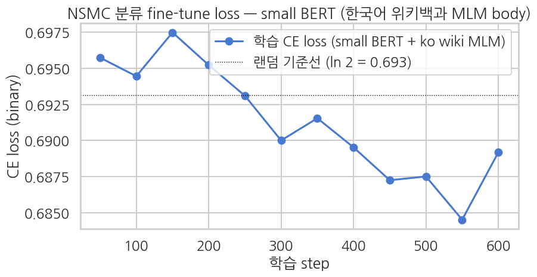
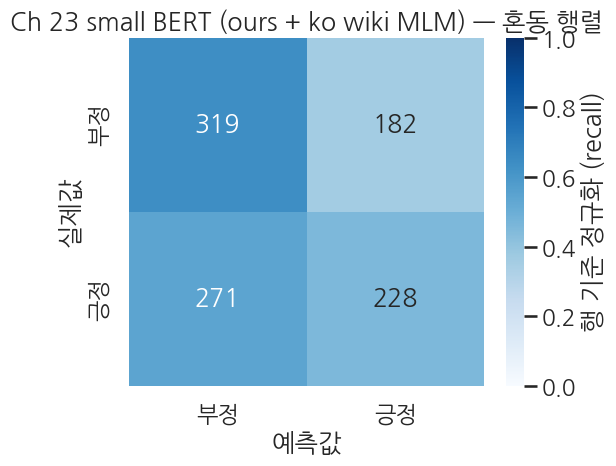
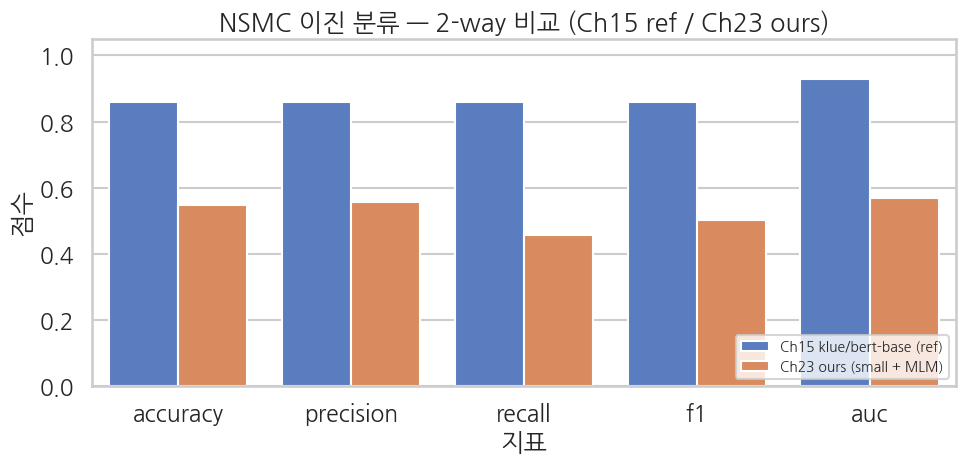

## 평가 — Ch 15 / Ch 21 과 같은 5종 metric + 학습 곡선

`accuracy / precision / recall / F1 / AUC` 전부 같은 정의. 마지막에 confusion matrix 와 학습 곡선을 같이 그려 *본체 출발점 변화가 학습 동역학에 어떻게 드러나는지* 시각화.

```python
cls_eval_metrics = cls_trainer.evaluate()
print("Ch 23 small BERT (scratch MLM 3 epoch on Korean Wikipedia + NSMC fine-tune) — eval:")
for k, v in cls_eval_metrics.items():
    if k.startswith("eval_") and isinstance(v, float):
        print(f"  {k:>20}: {v:.4f}")
```

**▶ 실행 결과**

```text
Training Loss  Validation Loss  Epoch  Accuracy  Precision  Recall    F1        Auc
0.689194       0.686685         2      0.547000  0.556098   0.456914  0.501650  0.567784
Ch 23 small BERT (scratch MLM 3 epoch on Korean Wikipedia + NSMC fine-tune) — eval:
             eval_loss: 0.6867
         eval_accuracy: 0.5470
        eval_precision: 0.5561
           eval_recall: 0.4569
               eval_f1: 0.5017
              eval_auc: 0.5678
```

```python
preds_output = cls_trainer.predict(cls_eval)
cls_logits = preds_output.predictions
cls_labels = preds_output.label_ids.astype(int)

exp = np.exp(cls_logits - cls_logits.max(axis=1, keepdims=True))
cls_probs_full = exp / exp.sum(axis=1, keepdims=True)
cls_preds = cls_probs_full.argmax(axis=1)
cls_probs_pos = cls_probs_full[:, 1]

print(f"Logits shape: {cls_logits.shape}")
print(f"Predicted positive rate: {(cls_preds == 1).mean():.1%}")
print(f"Top-1 prob mean: correct={cls_probs_full.max(axis=1)[cls_preds == cls_labels].mean():.4f}, "
      f"wrong={cls_probs_full.max(axis=1)[cls_preds != cls_labels].mean():.4f}")
print()
print(classification_report(
    cls_labels, cls_preds,
    target_names=["negative", "positive"],
    digits=4, zero_division=0,
))
```

**▶ 실행 결과**

```text
Logits shape: (1000, 2)
Predicted positive rate: 41.0%
Top-1 prob mean: correct=0.5274, wrong=0.5236

              precision    recall  f1-score   support

    negative     0.5407    0.6367    0.5848       501
    positive     0.5561    0.4569    0.5017       499

    accuracy                         0.5470      1000
   macro avg     0.5484    0.5468    0.5432      1000
weighted avg     0.5484    0.5470    0.5433      1000
```

### 5-1. 학습 곡선 — MLM 사전학습 효과가 보이는 자리

분류 fine-tune 의 step-by-step train loss 를 그려, *시작점* 과 *수렴점* 을 같이 확인.

```python
log_history = cls_trainer.state.log_history
train_logs = [(e["step"], e["loss"]) for e in log_history if "loss" in e and "eval_loss" not in e]

if train_logs:
    steps, losses = zip(*train_logs)
    random_baseline = math.log(2)

    sns.set_theme(style="whitegrid", context="talk", font="NanumGothic", rc={"axes.unicode_minus": False})
    fig, ax = plt.subplots(figsize=(9, 5))
    ax.plot(steps, losses, "o-", color="#4878D0", label="학습 CE loss (small BERT + ko wiki MLM)")
    ax.axhline(random_baseline, color="black", lw=1.0, ls=":",
               label=f"랜덤 기준선 (ln 2 = {random_baseline:.3f})")
    ax.set_xlabel("학습 step")
    ax.set_ylabel("CE loss (binary)")
    ax.set_title("NSMC 분류 fine-tune loss — small BERT (한국어 위키백과 MLM body)")
    ax.legend()
    plt.tight_layout()
    plt.show()
else:
    print("No train loss logs found.")
```

**▶ 실행 결과**



### 5-2. Confusion matrix

```python
sns.set_theme(style="white", context="talk", font="NanumGothic", rc={"axes.unicode_minus": False})
cm = confusion_matrix(cls_labels, cls_preds, labels=[0, 1])
cm_norm = cm / cm.sum(axis=1, keepdims=True)

fig, ax = plt.subplots(figsize=(6, 5))
sns.heatmap(
    cm_norm, annot=cm, fmt="d",
    cmap="Blues", vmin=0, vmax=1,
    xticklabels=["부정", "긍정"],
    yticklabels=["부정", "긍정"],
    cbar_kws={"label": "행 기준 정규화 (recall)"}, ax=ax,
)
ax.set_xlabel("예측값")
ax.set_ylabel("실제값")
ax.set_title("Ch 23 small BERT (ours + ko wiki MLM) — 혼동 행렬")
plt.tight_layout()
plt.show()
```

**▶ 실행 결과**



## 2-way 비교 — Ch 15 (klue/bert-base) vs Ch 23 ours (small BERT + ko wiki MLM)

두 셋업을 한 표·한 막대 그래프로. Ch 15 의 수치는 *해당 노트북의 검증된 결과* 를 인용 — 학습자가 직접 Ch 15 노트북을 돌려 본인 수치로 갱신해 보면 더 좋습니다.

| 차원 | Ch 15 (klue/bert-base) | Ch 23 ours (small + MLM) |
|---|---|---|
| 본체 파라미터 | 약 110M | 약 11.5M |
| 사전학습 코퍼스 | 한국어 위키 + 모두의 말뭉치 + 뉴스 + 댓글 (약 8.4B 토큰) | 한국어 Wikipedia paragraphs 2K (약 20만 토큰) |
| 사전학습 시간 | TPU 수일 | T4 약 0.2분 (MLM 3 epoch 실측) |
| Fine-tune 도메인 | NSMC 이진 (다른 도메인) | NSMC 이진 (다른 도메인) |
| 분류 fine-tune 셋업 | (둘 다 같음 — 5K/1K, batch 16, lr 2e-5, 2 epoch, fp16) | |

```python
# Ch 15 reference 수치 — klue/bert-base + NSMC 5K/1K + 2 epoch
# 출처: executed/15_ko_binary.ipynb (accuracy 0.8640 / F1 0.8612 / AUC 0.9292) 를 소수 둘째 자리로
# (실측치는 학습자가 Ch 15 노트북을 돌려 본인 값으로 갱신 권장)
CH15_REFERENCE = {
    "accuracy":  0.86,
    "precision": 0.86,
    "recall":    0.86,
    "f1":        0.86,
    "auc":       0.93,
}

ch23_ours = {k.replace("eval_", ""): v for k, v in cls_eval_metrics.items()
             if k.startswith("eval_") and isinstance(v, float)
             and k.replace("eval_", "") in CH15_REFERENCE}

comparison = pd.DataFrame({
    "metric":                    list(CH15_REFERENCE.keys()),
    "Ch15 klue/bert-base (ref)": [CH15_REFERENCE[k] for k in CH15_REFERENCE.keys()],
    "Ch23 ours (small + MLM)":   [ch23_ours.get(k, float("nan")) for k in CH15_REFERENCE.keys()],
})
print("2-way comparison — NSMC binary classification metrics")
print(comparison.round(4).to_string(index=False))
```

**▶ 실행 결과**

```text
2-way comparison — NSMC binary classification metrics
   metric  Ch15 klue/bert-base (ref)  Ch23 ours (small + MLM)
 accuracy                       0.86                   0.5470
precision                       0.86                   0.5561
   recall                       0.86                   0.4569
       f1                       0.86                   0.5017
      auc                       0.93                   0.5678
```

```python
# 2-way bar chart 로 한눈에 보기
sns.set_theme(style="whitegrid", context="talk", font="NanumGothic", rc={"axes.unicode_minus": False})
plot_df = comparison.melt(
    id_vars=["metric"],
    value_vars=["Ch15 klue/bert-base (ref)", "Ch23 ours (small + MLM)"],
    var_name="model", value_name="score",
)

fig, ax = plt.subplots(figsize=(10, 5))
sns.barplot(
    data=plot_df, x="metric", y="score", hue="model",
    palette={
        "Ch15 klue/bert-base (ref)": "#4878D0",
        "Ch23 ours (small + MLM)":   "#EE854A",
    },
    ax=ax,
)
ax.set_ylim(0, 1.05)
ax.set_title("NSMC 이진 분류 — 2-way 비교 (Ch15 ref / Ch23 ours)")
ax.set_xlabel("지표")
ax.set_ylabel("점수")
ax.legend(loc="lower right", fontsize=10)
plt.tight_layout()
plt.show()
```

**▶ 실행 결과**



**관찰 — *동일 transfer 패턴 안에서 사전학습 규모 격차* 가 NSMC 정확도에 어떻게 드러나나**

실측 (실행본 기준):
- **Ch 15** (`klue/bert-base`, 약 110M, 약 8.4B 토큰 대규모 한국어 사전학습): accuracy 약 0.86, AUC 약 0.93 (`executed/15_ko_binary.ipynb`)
- **Ch 23 ours** (small BERT, 한국어 Wikipedia 2K paragraphs × 3 epoch 사전학습): accuracy 약 0.55, AUC 약 0.57 — 정확값은 위 셀 출력이 단일 출처 (동전 던지기 수준 — MLM 약 0.2분의 짧은 사전학습 한계)

**Ch 15 vs Ch 23 ours**: accuracy 약 32%p 격차. 두 모델이 *같은 transfer 패턴* (일반 한국어 위키 → NSMC) 을 따르므로 격차의 거의 전부가 *사전학습 규모의 가치* — 약 8.4B 토큰의 *일반 한국어 지식* 이 `klue/bert-base` 본체에 압축되어 있어, NSMC 같은 *비격식 구어체 도메인* 에도 빠르게 적응합니다. *작은 일반 사전학습 < 대규모 일반 사전학습* 의 본질은 단순 양적 차이가 아니라 *도메인 다양성의 질적 차이* — `klue/bert-base` 는 위키 + 뉴스 + 블로그·댓글까지 포함한 약 8.4B 토큰으로 비격식 한국어 도메인도 *이미 본 적이 있어* transfer 가 자연스럽습니다.

> NSMC 는 *짧은 한 줄 리뷰* 이고 *반어·맞춤법 흔들림·라벨 노이즈* 가 섞여 있어 영어 Yelp (Ch 21) 보다 *살짝 더 어려운* 데이터. 작은 모델 + 작은 사전학습 환경에서는 그 어려움이 더 두드러집니다 — 한국어 환경 특유의 *negative transfer 가능성* 까지 포함한 정량 비교는 부록을 참조하세요.

## 부록 — random init baseline + negative transfer 분석

*MLM 사전학습 없이 random init 으로 바로 분류 fine-tune* 한 결과와의 비교, 그리고 *한국어 위키 → NSMC 의 큰 도메인 gap* 에서 발생할 수 있는 **negative transfer** 현상의 분석은 부록 노트북 [`appendix_random_baseline.ipynb`](https://colab.research.google.com/github/yoon-gu/neuqes-101/blob/master/23_ko_bert_classify/appendix_random_baseline.ipynb) 에서 다룹니다. 영어 Ch 21 (transfer 양성) 과 한국어 Ch 23 (transfer 음성 가능) 의 비대칭 메커니즘이 핵심.
