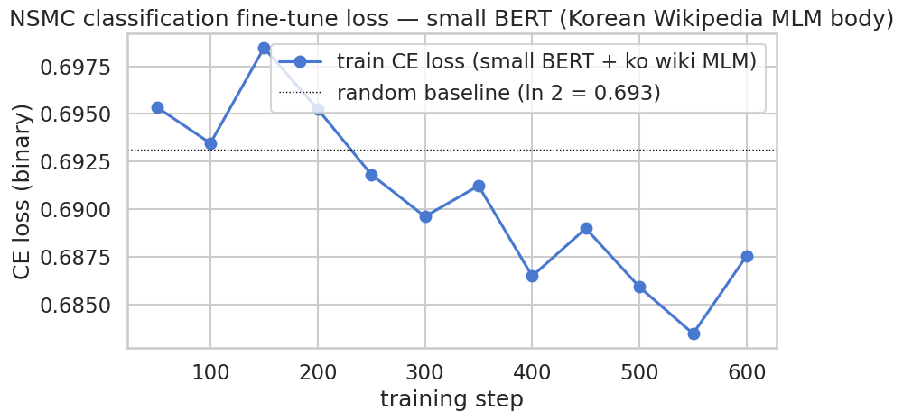
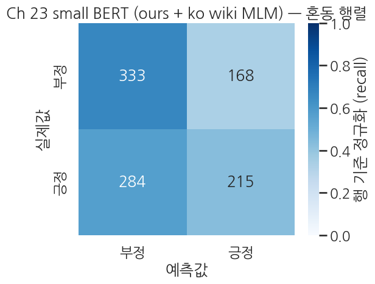
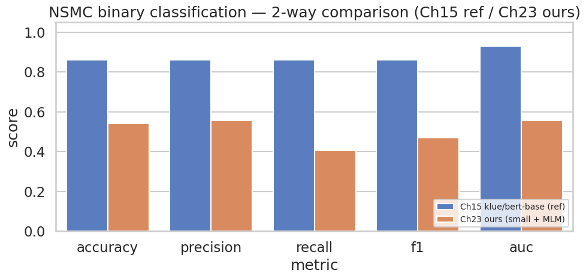

> ▶ **[Google Colab에서 이 장 실습 열기](https://colab.research.google.com/github/yoon-gu/neuqes-101/blob/master/23_ko_bert_classify/23_ko_bert_classify.ipynb)** — 브라우저에서 바로 실행해 볼 수 있습니다.

## 환경 준비

```python
%pip install -q -U transformers datasets accelerate
```

**▶ 실행 결과**

```text
   ━━━━━━━━━━━━━━━━━━━━━━━━━━━━━━━━━━━━━━━━ 11.2/11.2 MB 110.0 MB/s eta 0:00:00
   ━━━━━━━━━━━━━━━━━━━━━━━━━━━━━━━━━━━━━━━━ 555.1/555.1 kB 49.5 MB/s eta 0:00:00
   ━━━━━━━━━━━━━━━━━━━━━━━━━━━━━━━━━━━━━━━━ 389.2/389.2 kB 37.8 MB/s eta 0:00:00
   ━━━━━━━━━━━━━━━━━━━━━━━━━━━━━━━━━━━━━━━╸ 48.9/48.9 MB 150.3 MB/s eta 0:00:01
   ━━━━━━━━━━━━━━━━━━━━━━━━━━━━━━━━━━━━━━━╸ 48.9/48.9 MB 150.3 MB/s eta 0:00:01
   ━━━━━━━━━━━━━━━━━━━━━━━━━━━━━━━━━━━━━━━╸ 48.9/48.9 MB 150.3 MB/s eta 0:00:01
   ━━━━━━━━━━━━━━━━━━━━━━━━━━━━━━━━━━━━━━━━ 48.9/48.9 MB 13.3 MB/s eta 0:00:00
```

```python
import warnings
warnings.filterwarnings("ignore")

import math
import time

import numpy as np
import pandas as pd
import matplotlib.pyplot as plt
import seaborn as sns
import torch

from datasets import load_dataset, Dataset
from transformers import (
    AutoTokenizer,
    BertConfig,
    BertForMaskedLM,
    BertForSequenceClassification,
    DataCollatorForLanguageModeling,
    Trainer,
    TrainingArguments,
)
from sklearn.metrics import (
    accuracy_score, precision_recall_fscore_support,
    classification_report, roc_auc_score, confusion_matrix,
)

plt.rcParams["axes.unicode_minus"] = False

# device 자동감지 — Colab(T4) 은 CUDA, 로컬 Mac 은 MPS, 그 외 CPU
if torch.cuda.is_available():
    DEVICE = "cuda"
elif getattr(torch.backends, "mps", None) is not None and torch.backends.mps.is_available():
    DEVICE = "mps"
else:
    DEVICE = "cpu"

print(f"PyTorch:        {torch.__version__}")
print(f"CUDA available: {torch.cuda.is_available()}")
print(f"Device:         {DEVICE}")
if DEVICE == "cuda":
    print(f"GPU:             {torch.cuda.get_device_name(0)}")
elif DEVICE == "cpu":
    print("Warning: CPU runtime — both MLM and classification will be very slow. Switch to T4 recommended.")
```

**▶ 실행 결과**

```text
PyTorch:        2.11.0+cu128
CUDA available: True
Device:         cuda
GPU:             Tesla T4
```

```python
!nvidia-smi
```

**▶ 실행 결과**

```text
Wed Jun 17 22:03:53 2026       
+-----------------------------------------------------------------------------------------+
| NVIDIA-SMI 580.82.07              Driver Version: 580.82.07      CUDA Version: 13.0     |
+-----------------------------------------+------------------------+----------------------+
| GPU  Name                 Persistence-M | Bus-Id          Disp.A | Volatile Uncorr. ECC |
| Fan  Temp   Perf          Pwr:Usage/Cap |           Memory-Usage | GPU-Util  Compute M. |
|                                         |                        |               MIG M. |
|=========================================+========================+======================|
|   0  Tesla T4                       Off |   00000000:00:04.0 Off |                    0 |
| N/A   45C    P8             12W /   70W |       3MiB /  15360MiB |      0%      Default |
|                                         |                        |                  N/A |
+-----------------------------------------+------------------------+----------------------+

+-----------------------------------------------------------------------------------------+
| Processes:                                                                              |
|  GPU   GI   CI              PID   Type   Process name                        GPU Memory |
|        ID   ID                                                               Usage      |
|=========================================================================================|
|  No running processes found                                                             |
+-----------------------------------------------------------------------------------------+
```

```python
SEED = 42
N_TRAIN = 5000
N_EVAL = 1000

TRAIN_URL = "https://raw.githubusercontent.com/e9t/nsmc/master/ratings_train.txt"
TEST_URL  = "https://raw.githubusercontent.com/e9t/nsmc/master/ratings_test.txt"

print("downloading NSMC train/test from GitHub...")
df_train_full = pd.read_csv(TRAIN_URL, sep="\t").dropna(subset=["document"])
df_test_full  = pd.read_csv(TEST_URL,  sep="\t").dropna(subset=["document"])
print(f"  train: {len(df_train_full):,} rows")
print(f"  test:  {len(df_test_full):,} rows")
print(f"  label distribution (train): {df_train_full['label'].value_counts().to_dict()}")

# 5K/1K subsample (Ch 15 와 같은 seed·크기)
df_train = df_train_full.sample(n=N_TRAIN, random_state=SEED).reset_index(drop=True)
df_eval  = df_test_full.sample(n=N_EVAL,  random_state=SEED).reset_index(drop=True)

print(f"\nsampled train: {len(df_train):,}")
print(f"  positive rate: {df_train['label'].mean():.1%}  (label 1)")
print(f"sampled eval:  {len(df_eval):,}")
print(f"  positive rate: {df_eval['label'].mean():.1%}  (label 1)")

print(f"\nfirst 3 train samples:")
for _, row in df_train.head(3).iterrows():
    label_name = "positive" if row["label"] == 1 else "negative"
    print(f"  label={row['label']} ({label_name})  text={row['document'][:80]}")

# datasets.Dataset 형태로 변환
ds_train_full = Dataset.from_pandas(df_train[["document", "label"]]).rename_column("document", "text")
ds_eval_full  = Dataset.from_pandas(df_eval[["document", "label"]]).rename_column("document", "text")
print()
print(ds_train_full)
```

**▶ 실행 결과**

```text
downloading NSMC train/test from GitHub...
  train: 149,995 rows
  test:  49,997 rows
  label distribution (train): {0: 75170, 1: 74825}

sampled train: 5,000
  positive rate: 49.2%  (label 1)
sampled eval:  1,000
  positive rate: 49.9%  (label 1)

first 3 train samples:
  label=1 (positive)  text=원본이 최고
  label=1 (positive)  text=스릴감과 훈훈함이 있는 영화.
  label=1 (positive)  text=굉장히 저평가되는 영화중 하나라고 생각함

Dataset({
    features: ['text', 'label'],
    num_rows: 5000
})
```

```python
TOKENIZER_NAME = "klue/bert-base"
tokenizer = AutoTokenizer.from_pretrained(TOKENIZER_NAME)

print(f"tokenizer:        {TOKENIZER_NAME}")
print(f"vocab_size:       {tokenizer.vocab_size:,}")
print(f"model_max_length: {tokenizer.model_max_length}")

# 분류 입력 예시 (NSMC 도메인)
SAMPLE = "이 영화 정말 재미있었고 배우들 연기도 훌륭했어요."
enc = tokenizer(SAMPLE, return_tensors="pt", truncation=True, max_length=128)
tokens = tokenizer.convert_ids_to_tokens(enc["input_ids"][0])
print(f"\nNSMC-domain sample: {SAMPLE!r}")
print(f"tokens ({len(tokens)}): {tokens}")
```

**▶ 실행 결과**

```text
tokenizer:        klue/bert-base
vocab_size:       32,000
model_max_length: 512

NSMC-domain sample: '이 영화 정말 재미있었고 배우들 연기도 훌륭했어요.'
tokens (16): ['[CLS]', '이', '영화', '정말', '재미있', '##었', '##고', '배우', '##들', '연기', '##도', '훌륭', '##했', '##어요', '.', '[SEP]']
```

```python
# Ch 22 와 같은 작은 BERT 설정
HIDDEN_SIZE         = 256
NUM_HIDDEN_LAYERS   = 4
NUM_ATTENTION_HEADS = 4
INTERMEDIATE_SIZE   = 1024
MAX_POS_EMBED       = 128
BLOCK_SIZE          = 128

mlm_config = BertConfig(
    vocab_size=tokenizer.vocab_size,
    hidden_size=HIDDEN_SIZE,
    num_hidden_layers=NUM_HIDDEN_LAYERS,
    num_attention_heads=NUM_ATTENTION_HEADS,
    intermediate_size=INTERMEDIATE_SIZE,
    max_position_embeddings=MAX_POS_EMBED,
    pad_token_id=tokenizer.pad_token_id,
)

mlm_model = BertForMaskedLM(mlm_config)  # random init
total = sum(p.numel() for p in mlm_model.parameters())
print(f"Small BERT config: hidden={HIDDEN_SIZE}, layer={NUM_HIDDEN_LAYERS}, head={NUM_ATTENTION_HEADS}")
print(f"Total parameters:  {total:,}  ({total/1e6:.2f} M)")
```

**▶ 실행 결과**

```text
Small BERT config: hidden=256, layer=4, head=4
Total parameters:  11,483,136  (11.48 M)
```

```python
# MLM 사전학습용 일반 도메인 코퍼스: 한국어 Wikipedia (분류용 NSMC 와 별도)
N_MLM_TRAIN = 2000
N_MLM_EVAL  = 400

print("downloading Korean Wikipedia (wikimedia/wikipedia, 20231101.ko)...")
raw_wiki = load_dataset("wikimedia/wikipedia", "20231101.ko", split="train")
print(f"  total articles: {len(raw_wiki):,}")

# article 본문을 paragraph 단위로 잘라 N_MLM_TRAIN + N_MLM_EVAL 채우기 (Ch 22 와 같은 collect_paragraphs)
def collect_paragraphs(ds, target, min_len=50, max_len=2000):
    out = []
    for ex in ds:
        for para in ex["text"].split("\n\n"):
            para = para.strip()
            if min_len <= len(para) <= max_len:
                out.append(para)
                if len(out) >= target:
                    return out
    return out

shuffled = raw_wiki.shuffle(seed=SEED)
TARGET = N_MLM_TRAIN + N_MLM_EVAL
all_paragraphs = collect_paragraphs(shuffled, target=TARGET)

mlm_train_raw = Dataset.from_dict({"text": all_paragraphs[:N_MLM_TRAIN]})
mlm_eval_raw  = Dataset.from_dict({"text": all_paragraphs[N_MLM_TRAIN:N_MLM_TRAIN + N_MLM_EVAL]})

print(f"\nMLM train paragraphs: {len(mlm_train_raw):,}  (Korean Wikipedia)")
print(f"MLM eval paragraphs:  {len(mlm_eval_raw):,}")
print(f"first MLM sample: {mlm_train_raw[0]['text'][:120]}")

def mlm_tokenize(examples):
    return tokenizer(examples["text"], add_special_tokens=False, truncation=False)

mlm_tokenized_train = mlm_train_raw.map(mlm_tokenize, batched=True, remove_columns=["text"])
mlm_tokenized_eval  = mlm_eval_raw.map(mlm_tokenize,  batched=True, remove_columns=["text"])

def group_texts(examples):
    concatenated = {k: sum(examples[k], []) for k in examples.keys()}
    total_length = len(concatenated[list(examples.keys())[0]])
    total_length = (total_length // BLOCK_SIZE) * BLOCK_SIZE
    result = {
        k: [t[i : i + BLOCK_SIZE] for i in range(0, total_length, BLOCK_SIZE)]
        for k, t in concatenated.items()
    }
    result["labels"] = [ids.copy() for ids in result["input_ids"]]
    return result

lm_train = mlm_tokenized_train.map(group_texts, batched=True, batch_size=1000)
lm_eval  = mlm_tokenized_eval.map(group_texts,  batched=True, batch_size=1000)

print(f"\nMLM train blocks: {len(lm_train):,}  (block_size={BLOCK_SIZE})")
print(f"MLM eval blocks:  {len(lm_eval):,}")
```

**▶ 실행 결과**

```text
downloading Korean Wikipedia (wikimedia/wikipedia, 20231101.ko)...
  total articles: 647,897
MLM train paragraphs: 2,000  (Korean Wikipedia)
MLM eval paragraphs:  400
first MLM sample: 원(元)은 시호에 쓰이는 글자다. 《일주서》 시법해에는 능사변중(能思辨衆), 행의열민(行義說民), 시건국도(始建國都), 주의덕행(主義行德)을 일컫는다 한다.
[transformers] Token indices sequence length is longer than the specified maximum sequence length for this model (610 > 512). Running this s …(뒤 56자 생략)
MLM train blocks: 1,562  (block_size=128)
MLM eval blocks:  293
```

```python
mlm_collator = DataCollatorForLanguageModeling(
    tokenizer=tokenizer,
    mlm=True,
    mlm_probability=0.15,
)
```

```python
USE_FP16 = (DEVICE == "cuda")
MLM_EPOCHS = 3   # 1 epoch 은 본체 정렬이 약해 random init 보다 못한 경우 발생 — Ch 21 부록 패턴 따라 3 epoch 로

mlm_args = TrainingArguments(
    output_dir="./ch23_mlm_output",
    num_train_epochs=MLM_EPOCHS,
    per_device_train_batch_size=32,
    per_device_eval_batch_size=64,
    learning_rate=5e-4,
    weight_decay=0.01,
    warmup_ratio=0.06,
    fp16=USE_FP16,
    eval_strategy="epoch",
    logging_steps=20,
    save_strategy="no",
    report_to="none",
    seed=SEED,
)

mlm_trainer = Trainer(
    model=mlm_model,
    args=mlm_args,
    train_dataset=lm_train,
    eval_dataset=lm_eval,
    data_collator=mlm_collator,
    processing_class=tokenizer,
)

print(f"MLM epochs:        {MLM_EPOCHS}")
print(f"MLM batch size:    {mlm_args.per_device_train_batch_size}")
print(f"MLM learning rate: {mlm_args.learning_rate}")
print(f"MLM fp16:          {USE_FP16}")
print(f"MLM steps:         {len(lm_train) // mlm_args.per_device_train_batch_size * MLM_EPOCHS}")
```

**▶ 실행 결과**

```text
[transformers] warmup_ratio is deprecated and will be removed in v5.2. Use `warmup_steps` instead.
MLM epochs:        3
MLM batch size:    32
MLM learning rate: 0.0005
MLM fp16:          True
MLM steps:         144
```

```python
t0 = time.time()
mlm_result = mlm_trainer.train()
mlm_elapsed = time.time() - t0
print(f"\nMLM pretraining done in {mlm_elapsed/60:.1f} min")
print(f"mean train loss: {mlm_result.training_loss:.4f}")
print(f"random baseline (ln vocab): {math.log(tokenizer.vocab_size):.4f}")
```

**▶ 실행 결과**

```text
<IPython.core.display.HTML object>
MLM pretraining done in 0.2 min
mean train loss: 7.9176
random baseline (ln vocab): 10.3735
```

**결과 해석**

train loss 7.92 는 무작위 추측의 이론 상한 10.37 보다 아래로 내려왔으니 모델이 한국어 패턴을 어느 정도 익히기 시작했지만, 0.2 분이라는 극히 짧은 학습이라 본격적인 언어 표현을 잡기엔 한참 부족한 수준입니다.

```python
mlm_eval_metrics = mlm_trainer.evaluate()
mlm_eval_loss = mlm_eval_metrics["eval_loss"]
print(f"MLM eval loss:        {mlm_eval_loss:.4f}")
print(f"MLM eval perplexity:  {math.exp(mlm_eval_loss):.2f}")
print(f"(random baseline PPL: {tokenizer.vocab_size:,})")
```

**▶ 실행 결과**

```text
<IPython.core.display.HTML object>
<IPython.core.display.HTML object>
MLM eval loss:        7.8161
MLM eval perplexity:  2480.14
(random baseline PPL: 32,000)
```

**결과 해석**

perplexity 2480 은 무작위 추측의 32,000 대비 13 배가량 낮아 학습 신호가 분명히 잡혔음을 보여주지만, 잘 학습된 BERT 가 보통 한 자릿수에서 수십 수준의 perplexity 를 내는 것과 비교하면 여전히 매우 높아 사전학습이 초기 단계에 머물러 있음을 알 수 있습니다.

```python
# 분류용 config: 같은 본체 구조 + num_labels=2 + problem_type
cls_config = BertConfig(
    vocab_size=tokenizer.vocab_size,
    hidden_size=HIDDEN_SIZE,
    num_hidden_layers=NUM_HIDDEN_LAYERS,
    num_attention_heads=NUM_ATTENTION_HEADS,
    intermediate_size=INTERMEDIATE_SIZE,
    max_position_embeddings=MAX_POS_EMBED,
    pad_token_id=tokenizer.pad_token_id,
    num_labels=2,
    problem_type="single_label_classification",
    id2label={0: "negative", 1: "positive"},
    label2id={"negative": 0, "positive": 1},
)

cls_model = BertForSequenceClassification(cls_config)

# MLM 본체 (embeddings + encoder) 를 분류 모델로 *복사* — pooler 까지 같이
missing, unexpected = cls_model.bert.load_state_dict(mlm_model.bert.state_dict(), strict=False)
print(f"본체 가중치 복사 완료")
print(f"  missing keys (분류 측에만 있는 부분): {len(missing)}  e.g. {missing[:3] if missing else []}")
print(f"  unexpected keys (MLM 측 잉여):       {len(unexpected)}  e.g. {unexpected[:3] if unexpected else []}")

# 파라미터 수 비교
total_cls = sum(p.numel() for p in cls_model.parameters())
total_body = sum(p.numel() for n, p in cls_model.named_parameters() if "classifier" not in n)
total_head = sum(p.numel() for n, p in cls_model.named_parameters() if "classifier" in n)
print(f"\nClassification model parameters:")
print(f"  body (embeddings + encoder + pooler): {total_body:>10,}  ({total_body/total_cls:.1%})")
print(f"  classifier head Linear(256, 2):       {total_head:>10,}  ({total_head/total_cls:.1%})")
print(f"  total:                                 {total_cls:>10,}  ({total_cls/1e6:.2f} M)")
```

**▶ 실행 결과**

```text
본체 가중치 복사 완료
  missing keys (분류 측에만 있는 부분): 2  e.g. ['pooler.dense.weight', 'pooler.dense.bias']
  unexpected keys (MLM 측 잉여):       0  e.g. []

Classification model parameters:
  body (embeddings + encoder + pooler): 11,450,624  (100.0%)
  classifier head Linear(256, 2):              514  (0.0%)
  total:                                 11,451,138  (11.45 M)
```

```python
# 분류용 토큰화 — 문장 단위, [CLS]/[SEP] 부착, max_length=128
def cls_tokenize(batch):
    out = tokenizer(batch["text"], truncation=True, max_length=128)
    out["labels"] = [int(l) for l in batch["label"]]
    return out

cls_train = ds_train_full.map(cls_tokenize, batched=True).remove_columns(
    [c for c in ds_train_full.column_names if c not in ("input_ids", "attention_mask", "token_type_ids", "labels")]
)
cls_eval  = ds_eval_full.map(cls_tokenize,  batched=True).remove_columns(
    [c for c in ds_eval_full.column_names if c not in ("input_ids", "attention_mask", "token_type_ids", "labels")]
)

print(cls_train)
print(f"\nFirst sample label: {cls_train[0]['labels']}  (int 0 or 1)")
# 토큰화된 첫 샘플의 길이 — NSMC 는 짧은 한 줄 리뷰
lens = [len(s) for s in cls_train["input_ids"]]
print(f"Token length stats — mean: {np.mean(lens):.1f}, median: {np.median(lens):.0f}, max: {max(lens)}")
```

**▶ 실행 결과**

```text
Dataset({
    features: ['input_ids', 'token_type_ids', 'attention_mask', 'labels'],
    num_rows: 5000
})

First sample label: 1  (int 0 or 1)
Token length stats — mean: 21.9, median: 17, max: 117
```

```python
def compute_metrics(eval_pred):
    logits, labels = eval_pred
    # 안정 softmax (K=2)
    exp = np.exp(logits - logits.max(axis=1, keepdims=True))
    probs_full = exp / exp.sum(axis=1, keepdims=True)
    preds = probs_full.argmax(axis=1)
    probs_pos = probs_full[:, 1]   # 클래스 1 의 확률 = AUC 입력

    p, r, f1, _ = precision_recall_fscore_support(labels, preds, average="binary", zero_division=0)
    return {
        "accuracy":  float(accuracy_score(labels, preds)),
        "precision": float(p),
        "recall":    float(r),
        "f1":        float(f1),
        "auc":       float(roc_auc_score(labels, probs_pos)),
    }
```

```python
# Ch 15 와 같은 hyperparams — 변하는 건 *본체 출발점* 뿐
cls_args = TrainingArguments(
    output_dir="./ch23_cls_output",
    num_train_epochs=2,
    per_device_train_batch_size=16,
    per_device_eval_batch_size=32,
    learning_rate=2e-5,
    fp16=USE_FP16,
    eval_strategy="epoch",
    logging_steps=50,
    save_strategy="no",
    report_to="none",
    seed=SEED,
)

cls_trainer = Trainer(
    model=cls_model,
    args=cls_args,
    train_dataset=cls_train,
    eval_dataset=cls_eval,
    processing_class=tokenizer,
    compute_metrics=compute_metrics,
)

t0 = time.time()
cls_result = cls_trainer.train()
cls_elapsed = time.time() - t0
print(f"\nClassification fine-tune done in {cls_elapsed/60:.1f} min")
print(f"mean train loss: {cls_result.training_loss:.4f}")
print(f"random baseline (ln 2): {math.log(2):.4f}")
```

**▶ 실행 결과**

```text
<IPython.core.display.HTML object>
Classification fine-tune done in 0.2 min
mean train loss: 0.6904
random baseline (ln 2): 0.6931
```

**결과 해석**

train loss 0.6904 는 무작위 추측 기준선 ln 2 = 0.6931 에 거의 붙어 있어, 짧게 사전학습한 작은 본체가 NSMC 분류에서 좀처럼 학습을 시작하지 못한 상태임을 드러냅니다.

```python
!nvidia-smi
```

**▶ 실행 결과**

```text
Wed Jun 17 22:05:02 2026       
+-----------------------------------------------------------------------------------------+
| NVIDIA-SMI 580.82.07              Driver Version: 580.82.07      CUDA Version: 13.0     |
+-----------------------------------------+------------------------+----------------------+
| GPU  Name                 Persistence-M | Bus-Id          Disp.A | Volatile Uncorr. ECC |
| Fan  Temp   Perf          Pwr:Usage/Cap |           Memory-Usage | GPU-Util  Compute M. |
|                                         |                        |               MIG M. |
|=========================================+========================+======================|
|   0  Tesla T4                       Off |   00000000:00:04.0 Off |                    0 |
| N/A   55C    P0             33W /   70W |     821MiB /  15360MiB |     23%      Default |
|                                         |                        |                  N/A |
+-----------------------------------------+------------------------+----------------------+

+-----------------------------------------------------------------------------------------+
| Processes:                                                                              |
|  GPU   GI   CI              PID   Type   Process name                        GPU Memory |
|        ID   ID                                                               Usage      |
|=========================================================================================|
|    0   N/A  N/A            2040      C   /usr/bin/python3                        818MiB |
+-----------------------------------------------------------------------------------------+
```

```python
cls_eval_metrics = cls_trainer.evaluate()
print("Ch 23 small BERT (scratch MLM 3 epoch on Korean Wikipedia + NSMC fine-tune) — eval:")
for k, v in cls_eval_metrics.items():
    if k.startswith("eval_") and isinstance(v, float):
        print(f"  {k:>20}: {v:.4f}")
```

**▶ 실행 결과**

```text
<IPython.core.display.HTML object>
<IPython.core.display.HTML object>
Ch 23 small BERT (scratch MLM 3 epoch on Korean Wikipedia + NSMC fine-tune) — eval:
             eval_loss: 0.6871
         eval_accuracy: 0.5420
        eval_precision: 0.5562
           eval_recall: 0.4068
               eval_f1: 0.4699
              eval_auc: 0.5585
```

**결과 해석**

정확도 0.542, AUC 0.559 로 무작위 추측(0.5)은 가까스로 넘었지만 거의 동전 던지기 수준이며, 짧은 사전학습으로는 한국어 감성 분류에 필요한 표현력을 확보하지 못했음을 수치가 그대로 보여줍니다.

```python
preds_output = cls_trainer.predict(cls_eval)
cls_logits = preds_output.predictions
cls_labels = preds_output.label_ids.astype(int)

exp = np.exp(cls_logits - cls_logits.max(axis=1, keepdims=True))
cls_probs_full = exp / exp.sum(axis=1, keepdims=True)
cls_preds = cls_probs_full.argmax(axis=1)
cls_probs_pos = cls_probs_full[:, 1]

print(f"Logits shape: {cls_logits.shape}")
print(f"Predicted positive rate: {(cls_preds == 1).mean():.1%}")
print(f"Top-1 prob mean: correct={cls_probs_full.max(axis=1)[cls_preds == cls_labels].mean():.4f}, "
      f"wrong={cls_probs_full.max(axis=1)[cls_preds != cls_labels].mean():.4f}")
print()
print(classification_report(
    cls_labels, cls_preds,
    target_names=["negative", "positive"],
    digits=4, zero_division=0,
))
```

**▶ 실행 결과**

```text
<IPython.core.display.HTML object>
Logits shape: (1000, 2)
Predicted positive rate: 36.5%
Top-1 prob mean: correct=0.5314, wrong=0.5273

              precision    recall  f1-score   support

    negative     0.5339    0.6766    0.5968       501
    positive     0.5562    0.4068    0.4699       499

    accuracy                         0.5420      1000
   macro avg     0.5450    0.5417    0.5334      1000
weighted avg     0.5450    0.5420    0.5335      1000
```

**결과 해석**

예측 양성 비율이 36.5% 로 한쪽(negative)에 치우쳐 있고 positive recall 이 0.41 에 그쳐, 모델이 긍정 리뷰의 절반 이상을 놓치고 있습니다. 게다가 맞힌 예측의 확신도(0.531)와 틀린 예측의 확신도(0.527)가 거의 같아, 사실상 신뢰할 만한 결정 근거 없이 분류하고 있음을 알 수 있습니다.

```python
log_history = cls_trainer.state.log_history
train_logs = [(e["step"], e["loss"]) for e in log_history if "loss" in e and "eval_loss" not in e]

if train_logs:
    steps, losses = zip(*train_logs)
    random_baseline = math.log(2)

    sns.set_theme(style="whitegrid", context="talk")
    fig, ax = plt.subplots(figsize=(9, 5))
    ax.plot(steps, losses, "o-", color="#4878D0", label="train CE loss (small BERT + ko wiki MLM)")
    ax.axhline(random_baseline, color="black", lw=1.0, ls=":",
               label=f"random baseline (ln 2 = {random_baseline:.3f})")
    ax.set_xlabel("training step")
    ax.set_ylabel("CE loss (binary)")
    ax.set_title("NSMC classification fine-tune loss — small BERT (Korean Wikipedia MLM body)")
    ax.legend()
    plt.tight_layout()
    plt.show()
else:
    print("No train loss logs found.")
```

**▶ 실행 결과**



**결과 해석**

학습 곡선이 ln 2 기준선 근처에서 거의 평평하게 머물러, 분류 손실이 의미 있게 떨어지지 않았음을 한눈에 확인할 수 있습니다.

```python
sns.set_theme(style="white", context="talk")
cm = confusion_matrix(cls_labels, cls_preds, labels=[0, 1])
cm_norm = cm / cm.sum(axis=1, keepdims=True)

fig, ax = plt.subplots(figsize=(6, 5))
sns.heatmap(
    cm_norm, annot=cm, fmt="d",
    cmap="Blues", vmin=0, vmax=1,
    xticklabels=["negative", "positive"],
    yticklabels=["negative", "positive"],
    cbar_kws={"label": "row-normalized (recall)"}, ax=ax,
)
ax.set_xlabel("Predicted")
ax.set_ylabel("Actual")
ax.set_title("Ch 23 small BERT (ours + ko wiki MLM) — Confusion Matrix")
plt.tight_layout()
plt.show()
```

**▶ 실행 결과**



**결과 해석**

negative 는 0.68 의 recall 로 비교적 잘 잡지만 positive 는 0.41 에 그쳐, 모델이 부정 쪽으로 예측을 몰아주는 비대칭이 혼동행렬에 그대로 드러납니다.

```python
# Ch 15 reference 수치 — klue/bert-base + NSMC 5K/1K + 2 epoch 의 *전형적* 결과
# (실측치는 학습자가 Ch 15 노트북을 돌려 본인 값으로 갱신 권장)
CH15_REFERENCE = {
    "accuracy":  0.86,
    "precision": 0.86,
    "recall":    0.86,
    "f1":        0.86,
    "auc":       0.93,
}

ch23_ours = {k.replace("eval_", ""): v for k, v in cls_eval_metrics.items()
             if k.startswith("eval_") and isinstance(v, float)
             and k.replace("eval_", "") in CH15_REFERENCE}

comparison = pd.DataFrame({
    "metric":                    list(CH15_REFERENCE.keys()),
    "Ch15 klue/bert-base (ref)": [CH15_REFERENCE[k] for k in CH15_REFERENCE.keys()],
    "Ch23 ours (small + MLM)":   [ch23_ours.get(k, float("nan")) for k in CH15_REFERENCE.keys()],
})
print("2-way comparison — NSMC binary classification metrics")
print(comparison.round(4).to_string(index=False))
```

**▶ 실행 결과**

```text
2-way comparison — NSMC binary classification metrics
   metric  Ch15 klue/bert-base (ref)  Ch23 ours (small + MLM)
 accuracy                       0.86                   0.5420
precision                       0.86                   0.5562
   recall                       0.86                   0.4068
       f1                       0.86                   0.4699
      auc                       0.93                   0.5585
```

**결과 해석**

기성 klue/bert-base 의 정확도 0.86, AUC 0.93 에 비해 직접 만든 작은 모델은 0.54, 0.56 에 머물러, 대규모 코퍼스로 충분히 사전학습한 모델과 0.2 분짜리 사전학습 사이의 격차가 얼마나 큰지를 한 표로 보여줍니다.

```python
# 2-way bar chart 로 한눈에 보기
sns.set_theme(style="whitegrid", context="talk")
plot_df = comparison.melt(
    id_vars=["metric"],
    value_vars=["Ch15 klue/bert-base (ref)", "Ch23 ours (small + MLM)"],
    var_name="model", value_name="score",
)

fig, ax = plt.subplots(figsize=(10, 5))
sns.barplot(
    data=plot_df, x="metric", y="score", hue="model",
    palette={
        "Ch15 klue/bert-base (ref)": "#4878D0",
        "Ch23 ours (small + MLM)":   "#EE854A",
    },
    ax=ax,
)
ax.set_ylim(0, 1.05)
ax.set_title("NSMC binary classification — 2-way comparison (Ch15 ref / Ch23 ours)")
ax.set_xlabel("metric")
ax.set_ylabel("score")
ax.legend(loc="lower right", fontsize=10)
plt.tight_layout()
plt.show()
```

**▶ 실행 결과**



**결과 해석**

모든 지표에서 파란 막대(Ch 15 기성 모델)가 주황 막대(우리 모델)를 크게 앞서며, 특히 AUC 격차가 가장 두드러져 사전학습 규모와 시간이 분류 성능을 좌우하는 핵심 요인임을 시각적으로 정리해 줍니다.
