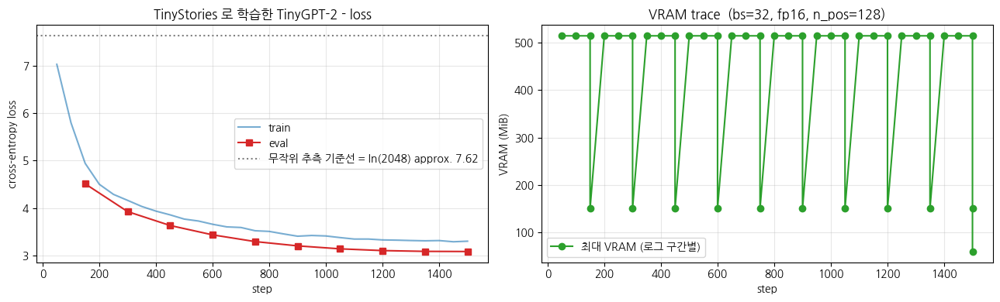

> ▶ **[Google Colab에서 이 장 실습 열기](https://colab.research.google.com/github/yoon-gu/neuqes-101/blob/master/24_gpt_tinystories/24_gpt_tinystories.ipynb)** — 브라우저에서 바로 실행해 볼 수 있습니다.

## 환경 셋업

```python
%pip install -q -U transformers tokenizers datasets accelerate
```

**▶ 실행 결과**

```text
   ━━━━━━━━━━━━━━━━━━━━━━━━━━━━━━━━━━━━━━━━ 11.2/11.2 MB 102.1 MB/s eta 0:00:00
   ━━━━━━━━━━━━━━━━━━━━━━━━━━━━━━━━━━━━━━━━ 555.1/555.1 kB 49.4 MB/s eta 0:00:00
   ━━━━━━━━━━━━━━━━━━━━━━━━━━━━━━━━━━━━━━━━ 389.2/389.2 kB 38.0 MB/s eta 0:00:00
   ━━━━━━━━━━━━━━━━━━━━━━━━━━━━━━━━━━━━━━━━ 0.0/48.9 MB ? eta -:--:--
   ━━━━━━━━━━━━━━━━━━━━━━━━━━━━━━━━━╺━━━━━━ 40.4/48.9 MB 169.3 MB/s eta 0:00:01
   ━━━━━━━━━━━━━━━━━━━━━━━━━━━━━━━━━━━━━━━╸ 48.9/48.9 MB 140.6 MB/s eta 0:00:01
   ━━━━━━━━━━━━━━━━━━━━━━━━━━━━━━━━━━━━━━━╸ 48.9/48.9 MB 140.6 MB/s eta 0:00:01
   ━━━━━━━━━━━━━━━━━━━━━━━━━━━━━━━━━━━━━━━━ 48.9/48.9 MB 16.9 MB/s eta 0:00:00
```

```python
import warnings
warnings.filterwarnings("ignore")

import math
import os
import random
import time

import numpy as np
import pandas as pd
import matplotlib.pyplot as plt
import torch

# device 자동 감지 - Colab T4 / 로컬 MPS / CPU 모두 지원
if torch.cuda.is_available():
    device = torch.device("cuda")
    device_name = torch.cuda.get_device_name(0)
    vram_gib = torch.cuda.get_device_properties(0).total_memory / 1024**3
    print(f"device     : cuda  ({device_name})")
    print(f"VRAM total : {vram_gib:.2f} GiB")
elif torch.backends.mps.is_available():
    device = torch.device("mps")
    print("device     : mps  (Apple Silicon)")
else:
    device = torch.device("cpu")
    print("device     : cpu  (training will be very slow - Colab T4 recommended)")

print(f"torch      : {torch.__version__}")

# 재현성
SEED = 0
torch.manual_seed(SEED)
np.random.seed(SEED)
random.seed(SEED)

# fp16 은 CUDA 에서만 (MPS 는 미지원, CPU 는 의미 없음)
USE_FP16 = (device.type == "cuda")
print(f"use fp16   : {USE_FP16}")

# matplotlib 한글 폰트 (Colab — NanumGothic). plot 의 한국어가 □ 로 깨지지 않게.
import matplotlib.pyplot as plt, matplotlib.font_manager as fm, subprocess, os
_fp = "/usr/share/fonts/truetype/nanum/NanumGothic.ttf"
if not os.path.exists(_fp):
    subprocess.run("apt-get -qq -y install fonts-nanum", shell=True)
fm.fontManager.addfont(_fp)
plt.rcParams["font.family"] = "NanumGothic"
plt.rcParams["axes.unicode_minus"] = False
```

**▶ 실행 결과**

```text
device     : cuda  (Tesla T4)
VRAM total : 14.56 GiB
torch      : 2.11.0+cu128
use fp16   : True
```

## TinyStories 데이터 로드

`roneneldan/TinyStories` 는 GPT-3.5 / GPT-4 가 *4세 어린이가 이해할 단어만* 으로 생성한 짧은 영어 동화 약 2.1M 편 (Eldan & Li 2023, arXiv:2305.07759). 어휘·문법이 단순해 **3-5M 파라미터** 짜리 작은 모델로도 grammatical 한 생성이 가능합니다.

학습 split 의 처음 **30,000 stories** 만 사용 (T4 30분 룰 안).

`roneneldan/TinyStories` 의 학습 split 에서 처음 30,000 편, 검증 split 에서 500 편만 가져옵니다. full 은 약 2.1M 편이라 그대로 쓰면 T4 30분 룰을 넘기므로 subset 으로 제한합니다. 샘플 story 를 한 편 찍어 보면 어휘·문법이 얼마나 단순한지 한눈에 확인할 수 있습니다.

```python
from datasets import load_dataset

N_TRAIN = 30_000      # 더 길게 돌리려면 키우세요 (full 은 약 2.1M stories)
N_VAL   = 500

raw_train = load_dataset("roneneldan/TinyStories", split=f"train[:{N_TRAIN}]")
raw_val   = load_dataset("roneneldan/TinyStories", split=f"validation[:{N_VAL}]")
print("train:", raw_train)
print("val  :", raw_val)
print("\n=== sample story ===")
print(raw_train[0]["text"][:400])
```

**▶ 실행 결과**

```text
train: Dataset({
    features: ['text'],
    num_rows: 30000
})
val  : Dataset({
    features: ['text'],
    num_rows: 500
})

=== sample story ===
One day, a little girl named Lily found a needle in her room. She knew it was difficult to play with it because it was sharp. Lily wanted to …(뒤 71자 생략)

Lily went to her mom and said, "Mom, I found this needle. Can you share it with me and sew my shirt?" Her mom smiled and said, "Yes, Lily, w …(뒤 43자 생략)

To
```

**결과 해석**

train 30,000 편 / val 500 편이 정상적으로 로드되었고, 샘플 story 가 "One day, a little girl named Lily..." 처럼 4세 어린이가 이해할 단어로만 쓰인 짧은 동화임이 보입니다. 이 단순한 어휘·문법 덕분에 약 3M 짜리 작은 모델로도 grammatical 한 생성이 가능합니다.

## BPE 토크나이저 직접 학습

`tokenizers.BPE` + ByteLevel pre-tokenizer 로 vocab 2,048 의 BPE 를 코퍼스에서 직접 학습합니다. Ch 19 의 토크나이저 학습 절차와 같은 패턴 - 다른 점은 *알고리즘* 만 (WordPiece → BPE).

GPT-2 와 같은 종류인 byte-level BPE 토크나이저를 코퍼스에서 직접 학습합니다. Ch 19 의 WordPiece/WordLevel 학습과 같은 절차이고 알고리즘만 BPE 로 바뀝니다. 핵심은 vocab 을 작게 (2,048) 잡아 작은 모델에 맞춘다는 점입니다.

```python
from tokenizers import Tokenizer
from tokenizers.models import BPE
from tokenizers.trainers import BpeTrainer
from tokenizers.pre_tokenizers import ByteLevel
from tokenizers.decoders import ByteLevel as ByteLevelDecoder
from transformers import PreTrainedTokenizerFast

VOCAB_SIZE = 2048
EOS = "<|endoftext|>"

bpe = Tokenizer(BPE(unk_token=None))
bpe.pre_tokenizer = ByteLevel(add_prefix_space=False)
bpe.decoder = ByteLevelDecoder()
trainer = BpeTrainer(
    vocab_size=VOCAB_SIZE,
    special_tokens=[EOS],
    initial_alphabet=ByteLevel.alphabet(),
    show_progress=True,
)
```

**위 코드 읽기** — `BPE(unk_token=None)` 으로 빈 BPE 모델을 만들고, `ByteLevel` pre-tokenizer 를 붙입니다. byte-level 방식이라 `unk_token` 이 필요 없습니다 — 가장 작은 단위가 byte (256개) 라 `initial_alphabet=ByteLevel.alphabet()` 으로 모든 byte 를 vocab 에 미리 넣어 두면 어떤 유니코드 문자열도 UNK 없이 완전 가역으로 표현됩니다. `special_tokens=[EOS]` 로 `<|endoftext|>` 단 하나만 등록하는 것이 GPT-2 의 최소 특수 토큰 컨벤션입니다.

```python
t0 = time.time()
bpe.train_from_iterator((ex["text"] for ex in raw_train), trainer, length=len(raw_train))
print(f"BPE training done: {time.time()-t0:.1f}s, vocab={bpe.get_vocab_size()}")

# HF 표준 인터페이스로 wrap - bos = eos = pad 모두 <|endoftext|> 로 (GPT-2 컨벤션)
tokenizer = PreTrainedTokenizerFast(
    tokenizer_object=bpe,
    bos_token=EOS,
    eos_token=EOS,
    pad_token=EOS,
)
```

**위 코드 읽기** — `train_from_iterator` 로 30,000 편 코퍼스에서 빈도 높은 byte 쌍을 반복 병합해 vocab 2,048 을 학습합니다. 그런 다음 `PreTrainedTokenizerFast` 로 감싸 HF 표준 인터페이스로 만드는데, `bos_token = eos_token = pad_token = EOS` 로 셋을 모두 `<|endoftext|>` 하나에 겸용시키는 것이 GPT-2 컨벤션입니다 (BERT 의 5종 특수 토큰과 대비).

```python
print("\n=== encode/decode demo ===")
sample = "Once upon a time, a little rabbit went to the forest."
enc = tokenizer(sample)
print(f"input      : {sample}")
print(f"ids        : {enc['input_ids']}")
print(f"tokens     : {tokenizer.convert_ids_to_tokens(enc['input_ids'])}")
print(f"decode     : {tokenizer.decode(enc['input_ids'])}")
print(f"vocab_size : {tokenizer.vocab_size}")
print(f"eos_token  : {tokenizer.eos_token}  id={tokenizer.eos_token_id}")
```

**위 코드 읽기** — 학습된 토크나이저로 예시 문장을 encode → decode 해 가역성을 확인합니다. 토큰 앞의 `Ġ` 는 byte-level 방식에서 *공백* 을 나타내는 표시로, 단어 경계가 별도 접두사 없이 공백 byte 자체로 인코딩됨을 보여 줍니다.

**▶ 실행 결과**

```text
BPE training done: 10.3s, vocab=2048

=== encode/decode demo ===
input      : Once upon a time, a little rabbit went to the forest.
ids        : [428, 440, 259, 394, 12, 259, 395, 1114, 464, 266, 263, 1081, 14]
tokens     : ['Once', 'Ġupon', 'Ġa', 'Ġtime', ',', 'Ġa', 'Ġlittle', 'Ġrabbit', 'Ġwent', 'Ġto', 'Ġthe', 'Ġforest', '.']
decode     : Once upon a time, a little rabbit went to the forest.
vocab_size : 2048
eos_token  : <|endoftext|>  id=0
```

**결과 해석**

BPE 학습이 약 10초 만에 끝나 vocab 2,048 이 완성되었고, `Once / Ġupon / Ġa / Ġtime` 처럼 자주 등장하는 표현은 한 토큰으로 압축되는 반면 `Ġrabbit` 도 단일 토큰으로 잡혔습니다. decode 결과가 원문과 정확히 일치해 byte-level BPE 의 완전 가역성이 확인되고, `<|endoftext|>` 가 id=0 으로 잘 등록되었습니다.

**관전 포인트** — `Once upon a time` 같이 TinyStories 에 *자주 등장* 하는 표현은 *적은 수의 토큰* 으로 압축, `rabbit` 처럼 덜 등장한 단어는 *여러 byte 조각* 으로 분할되는 경향. vocab 2,048 은 작은 모델에 맞춘 *최소한의 크기* 입니다.

## 토큰화 + `group_texts` (HF 표준 CLM 전처리)

HuggingFace 의 causal LM 학습 표준 패턴 (`run_clm.py`) 그대로:

1. 전체 코퍼스를 토큰화 (배치 단위)
2. 각 story 끝에 `<|endoftext|>` 부착 (story 경계 표시)
3. 모든 토큰을 이어붙여 1D 스트림으로 만든 뒤 `block_size=128` 단위로 잘라 chunk 화
4. 각 chunk 가 한 학습 sample - `DataCollatorForLanguageModeling(mlm=False)` 가 `labels = input_ids` 를 자동으로 채워 next-token prediction loss 가 됨

Ch 20·22 의 `group_texts` 와 *완전히 같은 패턴*. MLM 챕터들에선 *마스킹* 만 추가됐다면, CausalLM 챕터에선 *labels = input_ids* 그대로.

HuggingFace 의 causal LM 학습 표준 패턴 (`run_clm.py`) 그대로, 가변 길이 story 들을 고정 길이 토큰 블록의 스트림으로 만듭니다. Ch 20·22 의 MLM `group_texts` 와 완전히 같은 패턴이고, 마스킹이 없다는 점만 다릅니다.

```python
BLOCK_SIZE = 128

def tokenize_fn(batch):
    return tokenizer(batch["text"])

# 토큰화 (text 컬럼 제거)
tok_train = raw_train.map(tokenize_fn, batched=True, remove_columns=["text"], desc="tokenize train")
tok_val   = raw_val.map(tokenize_fn,   batched=True, remove_columns=["text"], desc="tokenize val")
```

**위 코드 읽기** — `BLOCK_SIZE=128` 로 chunk 길이를 정하고, 코퍼스를 배치 단위로 토큰화하면서 원본 `text` 컬럼은 제거합니다. 이 시점의 각 행은 아직 *story 한 편 길이* 의 가변 길이 토큰 시퀀스입니다.

```python
# 각 story 끝에 EOS 부착 (story 경계 표시)
def add_eos(batch):
    new_ids, new_mask = [], []
    for ids in batch["input_ids"]:
        ids = ids + [tokenizer.eos_token_id]
        new_ids.append(ids)
        new_mask.append([1] * len(ids))
    return {"input_ids": new_ids, "attention_mask": new_mask}

tok_train = tok_train.map(add_eos, batched=True, desc="add eos train")
tok_val   = tok_val.map(add_eos,   batched=True, desc="add eos val")
```

**위 코드 읽기** — 각 story 끝에 `eos_token_id` (`<|endoftext|>`) 를 붙여 story 경계를 표시합니다. 다음 단계에서 모든 토큰을 하나의 스트림으로 이어 붙일 때, 이 EOS 가 *서로 다른 story 가 한 chunk 안에서 섞일 때의 경계 신호* 역할을 합니다.

```python
# group_texts - 모든 토큰을 이어붙여 BLOCK_SIZE 단위로 자름
def group_texts(batch):
    concatenated = {k: sum(batch[k], []) for k in batch.keys()}
    total_len = len(concatenated["input_ids"])
    total_len = (total_len // BLOCK_SIZE) * BLOCK_SIZE
    return {
        k: [t[i : i + BLOCK_SIZE] for i in range(0, total_len, BLOCK_SIZE)]
        for k, t in concatenated.items()
    }

lm_train = tok_train.map(group_texts, batched=True, desc="group train")
lm_val   = tok_val.map(group_texts,   batched=True, desc="group val")

print(f"\ntrain chunks: {len(lm_train):,}  (block_size={BLOCK_SIZE})")
print(f"val   chunks: {len(lm_val):,}")
print(f"approx. train tokens: {len(lm_train) * BLOCK_SIZE / 1e6:.2f} M")
print("\nfirst chunk decode (first 200 chars):")
print(tokenizer.decode(lm_train[0]["input_ids"])[:200])
```

**위 코드 읽기** — `concatenated` 에서 배치의 모든 토큰을 하나로 이어 붙인 뒤 `BLOCK_SIZE` 의 배수로 길이를 잘라 (나머지 버림) 128 토큰 chunk 들로 나눕니다. 각 chunk 한 개가 학습 sample 한 개가 되고, 이후 collator 가 `labels` 를 채워 next-token prediction loss 로 이어집니다.

**▶ 실행 결과**

```text
train chunks: 57,973  (block_size=128)
val   chunks: 867
approx. train tokens: 7.42 M

first chunk decode (first 200 chars):
One day, a little girl named Lily found a needle in her room. She knew it was difficult to play with it because it was sharp. Lily wanted to …(뒤 60자 생략)
```

**결과 해석**

30,000 편이 57,973 개의 128-토큰 chunk (약 7.42M 토큰) 로, val 은 867 chunk 로 변환되었습니다. 첫 chunk 를 decode 하면 끊김 없는 연속 텍스트가 나와 가변 길이 story 들이 고정 길이 스트림으로 정상 재구성됐음이 확인됩니다.

### Collator 가 만드는 `labels` 확인 - *거의 모든 자리* 가 학습 신호

`DataCollatorForLanguageModeling(mlm=False)` 가 *내부적으로* `labels = input_ids.clone()` 을 만들어 `-100` 자리는 *없거나 pad 토큰 자리만* 임을 직접 확인합니다. Ch 20·22 의 MLM collator 가 약 85% 를 `-100` 으로 채웠던 것과 *정확히 반대*.

`DataCollatorForLanguageModeling(mlm=False)` 가 내부적으로 `labels = input_ids.clone()` 을 만든다는 사실을, 실제 배치를 하나 만들어 `-100` 자리 비율로 직접 확인합니다. MLM collator 가 약 85% 를 `-100` 으로 채웠던 것과 정반대로, CausalLM 은 거의 모든 자리가 학습 신호임을 눈으로 보는 셀입니다.

```python
from transformers import DataCollatorForLanguageModeling

collator_demo = DataCollatorForLanguageModeling(tokenizer=tokenizer, mlm=False)
demo_batch = collator_demo([lm_train[0], lm_train[1]])

input_ids = demo_batch["input_ids"]
labels = demo_batch["labels"]

print(f"input_ids shape: {tuple(input_ids.shape)}")
print(f"labels shape   : {tuple(labels.shape)}")

# -100 자리 vs 학습 신호 자리 비율
total = labels.numel()
n_ignored = (labels == -100).sum().item()
n_train_signal = total - n_ignored
print(f"\n=== 'labels = -100' thread - CausalLM vs MLM comparison ===")
print(f"total positions      : {total}")
print(f"  ignored (-100)     : {n_ignored:>5d}  ({100 * n_ignored / total:5.2f}%)")
print(f"  train signal       : {n_train_signal:>5d}  ({100 * n_train_signal / total:5.2f}%)")
print(f"\n[MLM (Ch 20/22)]     approx. 85% = -100, 15% = train signal")
print(f"[CausalLM (this ch)] {100 * n_ignored / total:5.2f}% = -100, {100 * n_train_signal / total:5.2f}% = train signal  <- almost every position")
print(f"\n=> a single step's token-learning efficiency: GPT pretrain is approx. 5-6x higher than MLM")

# input_ids 와 labels 의 동일성 검증 (pad 가 아닌 자리)
identical = (input_ids == labels).sum().item()
print(f"\n(input_ids == labels) positions: {identical}/{total}  - clone as-is")
```

**▶ 실행 결과**

```text
input_ids shape: (2, 128)
labels shape   : (2, 128)

=== 'labels = -100' thread - CausalLM vs MLM comparison ===
total positions      : 256
  ignored (-100)     :     1  ( 0.39%)
  train signal       :   255  (99.61%)

[MLM (Ch 20/22)]     approx. 85% = -100, 15% = train signal
[CausalLM (this ch)]  0.39% = -100, 99.61% = train signal  <- almost every position

=> a single step's token-learning efficiency: GPT pretrain is approx. 5-6x higher than MLM

(input_ids == labels) positions: 255/256  - clone as-is
```

**결과 해석**

256 자리 중 `-100` 은 단 1자리 (0.39%) 뿐이고 99.61% 가 학습 신호로, MLM 의 약 15% 와 정확히 반대입니다. `input_ids == labels` 가 255/256 으로 일치해 collator 가 정말 `input_ids.clone()` 을 그대로 labels 로 쓴다는 점이 확인되며, 이 토대가 Ch 28 SFT 의 `labels[:prompt_len] = -100` 한 줄을 이해하는 배경이 됩니다.

> **`-100` thread 환기** - MLM 은 *마스킹된 자리만* 학습, CausalLM 은 *거의 모든 자리* 학습. 같은 PyTorch `CrossEntropyLoss(ignore_index=-100)` 트릭이 *적용 자리만 정반대*. Ch 28 (SFT) 에서는 *prompt 자리만 -100* - 같은 트릭의 세 번째 적용. 그 한 줄 코드가 *모델이 instruction 을 따라가게 만드는 핵심* 입니다.

본 챕터의 collator 셋업이 *그 토대* - `labels = input_ids.clone()` 의 직관을 손에 익혀 두면 Ch 28 의 `labels[:prompt_len] = -100` 가 단번에 이해됩니다.

## `GPT2LMHeadModel` from scratch

`GPT2Config` 의 핵심 필드만 작게 잡고 *random init* (사전학습 X) 시작.

- `n_layer=4, n_head=4, n_embd=256` → 약 3M params, BERT 챕터들의 small DistilBERT 와 비슷한 스케일
- `n_positions = BLOCK_SIZE = 128` - 학습한 만큼만 context 사용
- bos / eos / pad token id 를 토크나이저와 동기화
- `tie_word_embeddings=True` (기본) - LM head 와 input embedding 의 weight 를 공유 → 파라미터 절약

### BERT 와의 차이가 코드로 드러나는 곳

- `BertForMaskedLM` 이 아니라 `GPT2LMHeadModel` - 클래스 자체가 *causal attention 내장*
- `from_pretrained(...)` 없이 `GPT2LMHeadModel(config)` - 무작위 초기화 from scratch (Ch 20·22 의 `BertForMaskedLM(config)` 와 같은 패턴, *모델 패밀리만* 다름)

`GPT2Config` 의 핵심 필드만 작게 (`n_layer=4, n_head=4, n_embd=256`) 잡아 약 3M 짜리 작은 모델을 *random init* 으로 띄웁니다. `from_pretrained` 없이 `GPT2LMHeadModel(config)` 로 만드는 것이 from-scratch 의 핵심이고, bos/eos/pad token id 를 토크나이저와 동기화해야 generation 이 정상 종료됩니다.

```python
from transformers import GPT2Config, GPT2LMHeadModel

config = GPT2Config(
    vocab_size=tokenizer.vocab_size,
    n_positions=BLOCK_SIZE,
    n_embd=256,
    n_layer=4,
    n_head=4,
    bos_token_id=tokenizer.bos_token_id,
    eos_token_id=tokenizer.eos_token_id,
    pad_token_id=tokenizer.pad_token_id,
    activation_function="gelu_new",
    resid_pdrop=0.1, embd_pdrop=0.1, attn_pdrop=0.1,
)

model = GPT2LMHeadModel(config).to(device)   # 학습 전 generation 시연용으로 미리 GPU 로
n_params = model.num_parameters()
print(f"#params           : {n_params/1e6:.2f} M")
print(f"weight tying      : {config.tie_word_embeddings}  (lm_head <-> wte shared)")
print(f"fp32 weight size  : {n_params * 4 / 1024**2:.2f} MiB")
print(f"\nmodel: {type(model).__name__}")
print(f"  - body : {type(model.transformer).__name__}  (Decoder, causal attention)")
print(f"  - head : {type(model.lm_head).__name__}(in={model.lm_head.in_features}, out={model.lm_head.out_features})")
```

**▶ 실행 결과**

```text
#params           : 3.72 M
weight tying      : True  (lm_head <-> wte shared)
fp32 weight size  : 14.18 MiB

model: GPT2LMHeadModel
  - body : GPT2Model  (Decoder, causal attention)
  - head : Linear(in=256, out=2048)
```

**결과 해석**

모델이 약 3.72M params (fp32 약 14MiB) 로, weight tying 이 켜져 LM head 와 input embedding 이 같은 텐서를 공유합니다. 본체는 `GPT2Model` (causal attention 내장) 이고 head 는 `Linear(in=256, out=2048)` 로, BERT 의 `BertForMaskedLM` 과 달리 클래스 자체가 decoder 임이 코드로 드러납니다.

## 학습 *전* generation - 비교 기준선 (random init baseline)

Ch 20·22 의 *사전학습 전 [MASK] top-5 후보* 와 같은 역할. random init 모델은 통계적으로 *어느 토큰이든 거의 균등한 확률* 로 뽑으니, 생성 텍스트가 *영어와 거리가 먼 byte 조각 / 의미 없는 짧은 단어 나열* 이 나옵니다.

같은 prompt 와 sampling 설정을 학습 *전 / 후* 모두에서 호출 → loss 곡선 없이도 *학습이 본체에 무엇을 새겼는가* 가 한 화면에 드러납니다.

학습 *전* random init 모델로 같은 prompt 3개를 생성해 비교 기준선을 만듭니다. Ch 20·22 의 *사전학습 전 [MASK] top-5* 와 같은 역할로, 나중에 학습 후 결과와 나란히 두면 사전학습이 본체에 무엇을 새겼는지가 한 화면에 드러납니다.

```python
PROMPTS = [
    "Once upon a time,",
    "The little girl",
    "A big dog",
]
GEN_KWARGS = dict(max_new_tokens=60, do_sample=True, temperature=0.8, top_k=50)


@torch.no_grad()
def generate_text(active_model, prompt: str, gen_tokenizer=None, **kwargs):
    tok = gen_tokenizer if gen_tokenizer is not None else tokenizer
    enc = tok(prompt, return_tensors="pt").to(active_model.device)
    out = active_model.generate(
        **enc,
        pad_token_id=tok.pad_token_id,
        eos_token_id=tok.eos_token_id,
        **kwargs,
    )
    return tok.decode(out[0], skip_special_tokens=True)
```

**위 코드 읽기** — `PROMPTS` 3개와 공통 sampling 설정 `GEN_KWARGS` (`temperature=0.8, top_k=50`) 를 정의하고, `generate_text` 헬퍼는 prompt 를 인코딩해 `active_model.generate(...)` 를 호출한 뒤 특수 토큰을 빼고 디코드합니다. `gen_tokenizer` 인자가 있어 뒤에서 reference `gpt2` 의 다른 토크나이저로도 같은 함수를 재사용합니다.

```python
# 재현성을 위해 학습 전·후 동일 seed
torch.manual_seed(SEED)
model.eval()
before_outputs = []
print("=" * 70)
print("UNTRAINED model - generation from random initial weights")
print("=" * 70)
for p in PROMPTS:
    text = generate_text(model, p, **GEN_KWARGS)
    before_outputs.append(text)
    print(f"\n[prompt] {p}")
    print(text)
```

**위 코드 읽기** — 학습 전·후를 같은 조건에서 비교하려고 `torch.manual_seed(SEED)` 로 sampling 난수를 고정한 뒤, random init 모델로 각 prompt 의 생성 결과를 `before_outputs` 에 모아 둡니다. 이 리스트가 나중 before/after 비교의 한 축이 됩니다.

**▶ 실행 결과**

```text
======================================================================
UNTRAINED model - generation from random initial weights
======================================================================
[prompt] Once upon a time,
Once upon a time,ushinkush min is wondered5 cruallyked bed farmer smo wonder smo dropped crush child�� grabbed home5ail wonder� bed j( slow …(뒤 96자 생략)
[prompt] The little girl
The little girlakak everyush Sarahgged:un't different different# gl keepner Graied likedJackampsel turnedDo decided beautiful} Gra has Benny …(뒤 120자 생략)
[prompt] A big dog
A big dog cle music hisftere learnedpe fam pullve bat batinin paper paper teacherkes cr wear soup yes curi tw7 colors wall runlf This Sam bb …(뒤 113자 생략)
```

**결과 해석**

세 prompt 모두 영어와 거리가 먼 byte 조각·의미 없는 짧은 단어가 반복되는 무작위 나열입니다. logits 가 random 초기값이라 sampling 이 통계적 빈도 토큰 사이에서만 흔들리는 상태로, 학습 후 결과의 비교 기준선이 됩니다.

**관전 포인트** - 학습 전 출력은 *무작위 토큰 나열* (반복되는 짧은 byte 조각, 의미 없는 단어들). Ch 20·22 의 *학습 전 [MASK] top-5* 가 *the / a / of / , / .* 같은 통계적 빈도 토큰이었던 것과 같은 현상의 *generation 판* 입니다. 학습 후 출력과 *나란히 비교* 하면 사전학습이 본체에 *next-token 분포* 를 새긴 증거를 직접 보게 됩니다.

## `Trainer` 로 사전학습

BERT 챕터들 (Ch 20·22) 과 *완전히 같은* Trainer 패턴 - 바뀌는 건 모델 클래스와 collator 의 `mlm=False` 두 곳.

- `DataCollatorForLanguageModeling(mlm=False)` → `labels = input_ids` (next-token prediction)
- `max_steps=1500`, `batch_size=32`, `fp16=True` - T4 약 1분
- `eval_steps=150` 으로 train / val loss 추이 관찰

BERT 챕터들 (Ch 20·22) 과 완전히 같은 `Trainer` 패턴으로 사전학습합니다. 바뀌는 곳은 모델 클래스와 collator 의 `mlm=False` 두 군데뿐이고, `max_steps=1500 / batch_size=32 / fp16=True` 로 T4 약 1분에 맞춥니다 (T4 는 bf16 불가라 항상 fp16). `VRAMCallback` 은 step 별 peak VRAM 을 기록해 뒤 그래프에 씁니다.

```python
from transformers import (DataCollatorForLanguageModeling, Trainer,
                          TrainingArguments, TrainerCallback)

collator = DataCollatorForLanguageModeling(tokenizer=tokenizer, mlm=False)

args = TrainingArguments(
    output_dir="./out_gpt_tinystories",
    max_steps=1500,
    per_device_train_batch_size=32,
    per_device_eval_batch_size=32,
    learning_rate=3e-4,
    weight_decay=0.1,
    adam_beta1=0.9, adam_beta2=0.95,
    warmup_steps=100,
    lr_scheduler_type="cosine",
    max_grad_norm=1.0,
    fp16=USE_FP16,                       # T4 는 bf16 불가
    logging_steps=50,
    eval_strategy="steps",
    eval_steps=150,
    save_strategy="no",
    report_to="none",
    dataloader_num_workers=2,
    dataloader_pin_memory=True,
    seed=SEED,
)


class VRAMCallback(TrainerCallback):
    '''step 별 peak VRAM 기록 (로깅 윈도우 단위로 reset). CUDA 에서만 유효.'''

    def __init__(self):
        self.steps, self.peak_MiB = [], []

    def on_train_begin(self, args, state, control, **kwargs):
        if torch.cuda.is_available():
            torch.cuda.reset_peak_memory_stats()

    def on_log(self, args, state, control, logs=None, **kwargs):
        if torch.cuda.is_available():
            peak = torch.cuda.max_memory_allocated() / 1024**2
            self.steps.append(state.global_step)
            self.peak_MiB.append(peak)
            torch.cuda.reset_peak_memory_stats()


vram_cb = VRAMCallback()

trainer = Trainer(
    model=model,
    args=args,
    train_dataset=lm_train,
    eval_dataset=lm_val,
    data_collator=collator,
    callbacks=[vram_cb],
)

t0 = time.time()
train_out = trainer.train()
elapsed = time.time() - t0

print(f"\n=== training summary ===")
print(f"elapsed       : {elapsed/60:.2f} min")
print(f"global_step   : {train_out.global_step}")
print(f"train_loss    : {train_out.training_loss:.4f}")
print(f"random baseline (ln vocab): {math.log(tokenizer.vocab_size):.4f}")
if torch.cuda.is_available():
    print(f"final peak    : {torch.cuda.max_memory_allocated()/1024**2:.0f} MiB")
```

**▶ 실행 결과**

```text
[transformers] `loss_type=None` was set in the config but it is unrecognized. Using the default loss: `ForCausalLMLoss`.
<IPython.core.display.HTML object>
=== training summary ===
elapsed       : 0.87 min
global_step   : 1500
train_loss    : 3.8319
random baseline (ln vocab): 7.6246
final peak    : 60 MiB
```

**결과 해석**

1500 step 학습이 약 0.87분 만에 끝났고, 누적 평균 `train_loss` 가 3.83 으로 random baseline `ln(2048) ≈ 7.62` 에서 크게 내려왔습니다. perplexity 로는 약 $e^{3.83} \approx 46$ 으로, vocab 2,048 중 수십 개 후보로 좁힌 상태이고 peak VRAM 도 60MiB 에 불과해 T4 30분 룰 안에 여유롭게 들어옵니다.

학습 로그에서 train/eval loss 와 step 별 peak VRAM 을 뽑아 두 패널로 그립니다. loss 패널에는 `ln(2048)` 무작위 추측 기준선을 점선으로 함께 표시해, 곡선이 그 기준선에서 얼마나 내려왔는지를 한눈에 보게 합니다.

```python
# loss curve + VRAM trace
log = trainer.state.log_history
train_pts = [(r["step"], r["loss"]) for r in log if "loss" in r and "eval_loss" not in r]
eval_pts  = [(r["step"], r["eval_loss"]) for r in log if "eval_loss" in r]

fig, (ax1, ax2) = plt.subplots(1, 2, figsize=(13, 4))

# loss
ax1.plot([s for s, _ in train_pts], [l for _, l in train_pts], "-",
         color="tab:blue", alpha=0.6, label="train")
if eval_pts:
    ax1.plot([s for s, _ in eval_pts], [l for _, l in eval_pts], "s-",
             color="tab:red", label="eval")
ax1.axhline(math.log(tokenizer.vocab_size), ls=":", color="gray",
            label=f"무작위 추측 기준선 = ln({tokenizer.vocab_size}) approx. {math.log(tokenizer.vocab_size):.2f}")
ax1.set_xlabel("step"); ax1.set_ylabel("cross-entropy loss")
ax1.set_title("TinyStories 로 학습한 TinyGPT-2 - loss")
ax1.grid(True, alpha=0.3); ax1.legend()

# VRAM (CUDA 만)
if vram_cb.steps:
    ax2.plot(vram_cb.steps, vram_cb.peak_MiB, "o-", color="tab:green",
             label="최대 VRAM (로그 구간별)")
    ax2.set_title(f"VRAM trace  (bs=32, fp16, n_pos={BLOCK_SIZE})")
else:
    ax2.text(0.5, 0.5, "VRAM 추적은 CUDA 에서만 가능",
             ha="center", va="center", transform=ax2.transAxes)
    ax2.set_title("VRAM 추적 - CUDA 전용")
ax2.set_xlabel("step"); ax2.set_ylabel("VRAM (MiB)")
ax2.grid(True, alpha=0.3); ax2.legend()

plt.tight_layout(); plt.show()
```

**▶ 실행 결과**



**관전 포인트** - 학습 첫 step loss 가 약 7.6 (random baseline `ln(2048)`) 부근에서 시작해 *수백 step 안에 약 4-5* 로 빠르게 떨어지고, 1500 step 끝에 누적 평균 `train_loss` 가 *약 3.8* 까지 내려가면 정상 (`train_loss` 는 학습 내내 본 step 들의 누적 평균이라 마지막 step 의 순간 loss 보다 다소 높게 보입니다). perplexity 로 환산하면 vocab 2,048 중 *수십 개 후보* 로 좁힌 상태 - 다음 토큰을 *어느 정도 결정적* 으로 뽑는 수준.

## 학습 *후* generation + before/after 비교

같은 `PROMPTS / GEN_KWARGS` 로 학습 후 모델에서 다시 생성하고, §5 의 학습 전 결과와 나란히 비교합니다. **이 챕터의 합격 기준**: 학습 후 텍스트가 *전* 보다 명확히 *영어 문장* 에 가까워졌는가 - Ch 20·22 의 *사전·사후 [MASK] top-5* 비교의 *generation 판*.

학습 전과 *완전히 같은* seed·prompt·sampling 설정으로 학습된 모델에서 다시 생성합니다. 조건이 동일하므로 출력 차이는 오직 학습된 가중치에서 옵니다.

```python
torch.manual_seed(SEED)
model.eval()
after_outputs = []
print("=" * 70)
print("TRAINED model - generation after Trainer.train()")
print("=" * 70)
for p in PROMPTS:
    text = generate_text(model, p, **GEN_KWARGS)
    after_outputs.append(text)
    print(f"\n[prompt] {p}")
    print(text)
```

**▶ 실행 결과**

```text
======================================================================
TRAINED model - generation after Trainer.train()
======================================================================
[prompt] Once upon a time,
Once upon a time, there was a girl named Lily. She loved to play with her friends. She loved to play outside to play with her friends when t …(뒤 32자 생략)

One day, Lily saw a small house, a boy named Timmy. He was so happy because he saw a big
[prompt] The little girl
The little girl had been a wonderful time. It was so happy to see the park. She thanked the garden, and the girl. She thanked the little gir …(뒤 129자 생략)
[prompt] A big dog
A big dog, but they could go in the park. They ran away and the truck. The bird was sad. It had a bit fun.

"But we can't get my mouth. I can play with you."

"It's okay, it is not very curious. He is not
```

**결과 해석**

학습 후에는 "there was a girl named Lily. She loved to play with her friends..." 처럼 주어+동사+목적어 구조의 동화 풍 영어 문장이 나옵니다. 완벽하지는 않지만 학습 전의 무작위 byte 나열과 비교하면 사전학습이 본체에 next-token 분포를 새겼다는 증거가 한눈에 드러납니다.

```python
# before / after 나란히 - 사전학습이 본체에 새긴 next-token 분포의 직접적 증거
print("=" * 78)
print("BEFORE (random init) vs AFTER (trained on TinyStories 30K)")
print("=" * 78)
for p, before, after in zip(PROMPTS, before_outputs, after_outputs):
    print(f"\nPROMPT  : {p}")
    print("-" * 78)
    print(f"BEFORE  : {before[len(p):].strip()[:280]}")
    print(f"AFTER   : {after[len(p):].strip()[:280]}")
```

**▶ 실행 결과**

```text
==============================================================================
BEFORE (random init) vs AFTER (trained on TinyStories 30K)
==============================================================================

PROMPT  : Once upon a time,
------------------------------------------------------------------------------
BEFORE  : ushinkush min is wondered5 cruallyked bed farmer smo wonder smo dropped crush child�� grabbed home5ail wonder� bed j( slowy clapp …(뒤 89자 생략)
AFTER   : there was a girl named Lily. She loved to play with her friends. She loved to play outside to play with her friends when they put …(뒤 24자 생략)

One day, Lily saw a small house, a boy named Timmy. He was so happy because he saw a big

PROMPT  : The little girl
------------------------------------------------------------------------------
BEFORE  : akak everyush Sarahgged:un't different different# gl keepner Graied likedJackampsel turnedDo decided beautiful} Gra has Benny find …(뒤 115자 생략)
AFTER   : had been a wonderful time. It was so happy to see the park. She thanked the garden, and the girl. She thanked the little girl to k …(뒤 123자 생략)

PROMPT  : A big dog
------------------------------------------------------------------------------
BEFORE  : cle music hisftere learnedpe fam pullve bat batinin paper paper teacherkes cr wear soup yes curi tw7 colors wall runlf This Sam bb …(뒤 113자 생략)
AFTER   : , but they could go in the park. They ran away and the truck. The bird was sad. It had a bit fun.

"But we can't get my mouth. I can play with you."

"It's okay, it is not very curious. He is not
```

**해석 가이드 - 사전학습이 만든 차이**

- **BEFORE (random init)**: *영어와 거리가 먼 byte 조각 / 의미 없는 짧은 단어 반복*. logits 가 random 초기값이라 sampling 이 통계적 빈도 토큰들 사이에서만 흔들림.
- **AFTER (TinyStories 30K × 1500 steps)**: *말이 되는 영어 문장* - 짧지만 *주어 + 동사 + 목적어* 구조, *동화 풍 어휘* (rabbit, forest, friend, mom, happy, ...). 완벽하진 않아도 *학습이 본체에 next-token 분포를 새긴 증거* 가 한 줄에서 명확.

> Ch 20·22 의 *사전·사후 [MASK] top-5* 비교에서 `[MASK]` 자리에 *the / a / of* 같은 빈도 토큰만 뽑히던 random init 모델이, 학습 후엔 *문맥에 맞는 정답 토큰* 을 top-5 에 담아내던 그 변화의 *generation 판* 입니다.

### Reference 비교 - `gpt2` (124M, OpenAI WebText) 의 같은 prompt generation

같은 prompt 3개를 *학습이 충분히 잘 된* 표준 `gpt2` (124M params, WebText 약 40GB 사전학습) 에 넣어 *우리 작은 GPT (약 3M, TinyStories 30K)* 와 격차를 직접 비교. Ch 20 의 *3-way [MASK] top-5 비교* (before / ours / `bert-base-uncased`) 와 같은 패턴.

T4 에서 약 1분 추가. 데이터·파라미터 격차가 generation 품질의 격차로 어떻게 드러나는지 한 화면에.

같은 prompt 3개를 충분히 학습된 표준 `gpt2` (124M, WebText 약 40GB 사전학습) 에 넣어, 우리 작은 GPT (약 3M, TinyStories 30K) 와 격차를 직접 비교합니다. Ch 20 의 *3-way [MASK] top-5 비교* 와 같은 패턴이고, T4 에서 약 1분 추가됩니다. 끝에서 `del` + `empty_cache()` 로 124M 모델 메모리를 정리합니다.

```python
from transformers import AutoTokenizer, AutoModelForCausalLM

print("loading reference gpt2 (124M, OpenAI WebText pretraining)...")
ref_tok = AutoTokenizer.from_pretrained("gpt2")
ref_tok.pad_token = ref_tok.eos_token
ref_model = AutoModelForCausalLM.from_pretrained("gpt2").to(device).eval()
print(f"  vocab_size : {ref_tok.vocab_size:,}")
print(f"  #params    : {ref_model.num_parameters()/1e6:.1f} M")

torch.manual_seed(SEED)
ref_outputs = []
print("\n" + "=" * 70)
print("REFERENCE gpt2 (124M, WebText) - generation on same prompts")
print("=" * 70)
for p in PROMPTS:
    text = generate_text(ref_model, p, gen_tokenizer=ref_tok, **GEN_KWARGS)
    ref_outputs.append(text)
    print(f"\n[prompt] {p}")
    print(text)

# 메모리 정리
del ref_model
if torch.cuda.is_available():
    torch.cuda.empty_cache()
```

**▶ 실행 결과**

```text
loading reference gpt2 (124M, OpenAI WebText pretraining)...
  vocab_size : 50,257
  #params    : 124.4 M

======================================================================
REFERENCE gpt2 (124M, WebText) - generation on same prompts
======================================================================
[prompt] Once upon a time,
Once upon a time, if you don't know what your country's government is doing, you can find out.

In the last few months, I've traveled to dozens of countries around the world, and I've seen the results of that.

My new book — the Making of a Better World Order:
[prompt] The little girl
The little girl has been at her desk all day...for two hours. She's got a pen and paper and a pen and paper, not a pen and paper and pencil. …(뒤 112자 생략)
[prompt] A big dog
A big dog is a dog that loves to eat, but is also a dog that's afraid to do anything that might hurt others.

In the long run, we find that people who have an allergy to animals are less likely to have allergies to dogs.

But these people are less likely to have
```

**결과 해석**

`gpt2` (124M, vocab 50,257) 는 같은 prompt 에 동화풍이 아닌 일반 산문·뉴스·대화 등 훨씬 다양한 톤·도메인 어휘로 자연스러운 문장 흐름을 만들어 냅니다. WebText 의 다양성이 generation 다양성으로 직결되며, 이는 우리 작은 GPT 가 동화 도메인에 강한 대신 폭이 좁은 것과 대비됩니다.

```python
# 3-way 비교 - BEFORE (random) / OURS (3M, TinyStories) / REF (gpt2 124M, WebText)
print("=" * 78)
print("3-way comparison: BEFORE (random) / OURS (3M, TinyStories 30K) / REF (gpt2 124M, WebText)")
print("=" * 78)
for p, before, after, ref in zip(PROMPTS, before_outputs, after_outputs, ref_outputs):
    print(f"\nPROMPT : {p}")
    print("-" * 78)
    print(f"BEFORE : {before[len(p):].strip()[:240]}")
    print(f"OURS   : {after[len(p):].strip()[:240]}")
    print(f"REF    : {ref[len(p):].strip()[:240]}")
```

**▶ 실행 결과**

```text
==============================================================================
3-way comparison: BEFORE (random) / OURS (3M, TinyStories 30K) / REF (gpt2 124M, WebText)
==============================================================================

PROMPT : Once upon a time,
------------------------------------------------------------------------------
BEFORE : ushinkush min is wondered5 cruallyked bed farmer smo wonder smo dropped crush child�� grabbed home5ail wonder� bed j( slowy clappe …(뒤 88자 생략)
OURS   : there was a girl named Lily. She loved to play with her friends. She loved to play outside to play with her friends when they put o …(뒤 23자 생략)

One day, Lily saw a small house, a boy named Timmy. He was so happy because he saw a
REF    : if you don't know what your country's government is doing, you can find out.

In the last few months, I've traveled to dozens of countries around the world, and I've seen the results of that.

My new book — the Making of a Better World Orde

PROMPT : The little girl
------------------------------------------------------------------------------
BEFORE : akak everyush Sarahgged:un't different different# gl keepner Graied likedJackampsel turnedDo decided beautiful} Gra has Benny find …(뒤 109자 생략)
OURS   : had been a wonderful time. It was so happy to see the park. She thanked the garden, and the girl. She thanked the little girl to ke …(뒤 109자 생략)
REF    : has been at her desk all day...for two hours. She's got a pen and paper and a pen and paper, not a pen and paper and pencil. And sh …(뒤 105자 생략)

PROMPT : A big dog
------------------------------------------------------------------------------
BEFORE : cle music hisftere learnedpe fam pullve bat batinin paper paper teacherkes cr wear soup yes curi tw7 colors wall runlf This Sam bby …(뒤 109자 생략)
OURS   : , but they could go in the park. They ran away and the truck. The bird was sad. It had a bit fun.

"But we can't get my mouth. I can play with you."

"It's okay, it is not
...
```

**결과 해석**

세 모델을 한 줄에 놓으면 격차가 또렷합니다. BEFORE 는 영어와 거리가 먼 byte 조각 나열, OURS (3M, TinyStories 30K) 는 "there was a girl named Lily..." 처럼 문법은 맞지만 같은 구절을 반복하는 단순한 동화체, REF (`gpt2` 124M) 는 동화와 무관한 일반 산문·뉴스·대화체입니다. OURS 가 동화 도메인 안에서는 그럴듯하지만 폭이 좁고 반복이 잦은 반면 REF 는 도메인이 넓고 자연스러워, generation 품질이 *모델 크기 + 데이터 규모·다양성* 의 격차를 그대로 반영함이 드러납니다.

**해석 가이드 - 데이터·파라미터 규모가 만든 격차**

- **BEFORE (random)**: 영어와 거리 먼 byte 조각.
- **OURS (3M, TinyStories 30K × 1500 steps)**: *동화 풍 단순 영어* - 어휘는 동화 도메인에 강하지만 (rabbit, forest, mom, friend, ...) *복잡한 문장 구조 / 추상적 어휘* 는 약함.
- **REF (gpt2 124M, WebText 약 40GB)**: *다양한 도메인 어휘 + 자연스러운 문장 흐름* - 같은 prompt 에 대해 *동화풍이 아닌 일반 산문 / 뉴스 / 대화* 등 다양한 톤. 학습 데이터 분포 (WebText) 의 다양성이 generation 다양성으로 직결.

> **세 모델의 격차가 정확히 *모델 크기 + 데이터 크기 + 데이터 다양성* 의 격차** - 우리 작은 GPT (3M, TinyStories 30K stories) → reference `gpt2` (124M, WebText 약 40GB) 사이에 *파라미터 약 40배, 데이터 규모 약 수천 배, 도메인 다양성 격차*. 그게 generation 의 *질적 차이* 로 정확히 드러납니다.

> Ch 25 가 이 격차를 *데이터 축을 통제하고* 좁히는 챕터입니다 - `gpt2` (124M) 의 사전학습 *위에* 같은 TinyStories 30K 로 **continual pretraining**. *대규모 일반 사전학습 모델을 작은 도메인 데이터로 적응* 시킬 때의 generation 품질이, 우리 from-scratch 작은 GPT 와 어떻게 다른지 직접 비교.
