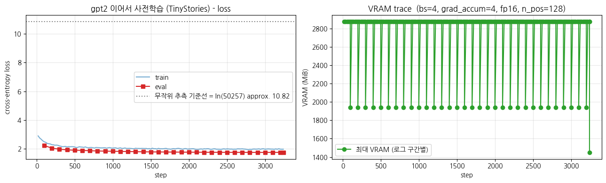

> ▶ **[Google Colab에서 이 장 실습 열기](https://colab.research.google.com/github/yoon-gu/neuqes-101/blob/master/25_gpt2_continual_pretrain/25_gpt2_continual_pretrain.ipynb)** — 브라우저에서 바로 실행해 볼 수 있습니다.

## 환경 셋업

```python
%pip install -q -U transformers tokenizers datasets accelerate
```

**▶ 실행 결과**

```text
   ━━━━━━━━━━━━━━━━━━━━━━━━━━━━━━━╸━━━━━━━━ 9.7/12.1 MB 141.2 MB/s eta 0:00:01
   ━━━━━━━━━━━━━━━━━━━━━━━━━━━━━━━━━━━━━━━━ 12.1/12.1 MB 37.8 MB/s eta 0:00:00
   ━━━━━━━━━━━━━━━━━━━━━━━━━━━━━━━━━━━━━━━━ 3.3/3.3 MB 110.0 MB/s eta 0:00:00
   ━━━━━━━━━━━━━━━━━━━━━━━━━━━━━━━━━━━━━━━━ 559.1/559.1 kB 48.6 MB/s eta 0:00:00
   ━━━━━━━━━━━━━━━━╸━━━━━━━━━━━━━━━━━━━━━━━ 20.9/50.1 MB 189.0 MB/s eta 0:00:01
   ━━━━━━━━━━━━━━━━━━━━━━━━━━━━━━━━━━━━━━━╸ 50.1/50.1 MB 213.5 MB/s eta 0:00:01
   ━━━━━━━━━━━━━━━━━━━━━━━━━━━━━━━━━━━━━━━╸ 50.1/50.1 MB 213.5 MB/s eta 0:00:01
   ━━━━━━━━━━━━━━━━━━━━━━━━━━━━━━━━━━━━━━━╸ 50.1/50.1 MB 213.5 MB/s eta 0:00:01
   ━━━━━━━━━━━━━━━━━━━━━━━━━━━━━━━━━━━━━━━╸ 50.1/50.1 MB 213.5 MB/s eta 0:00:01
   ━━━━━━━━━━━━━━━━━━━━━━━━━━━━━━━━━━━━━━━━ 50.1/50.1 MB 13.3 MB/s eta 0:00:00
```

```python
import warnings
warnings.filterwarnings("ignore")

import math
import os
import random
import time

import numpy as np
import pandas as pd
import matplotlib.pyplot as plt
import torch

# device 자동 감지 - Colab T4 / 로컬 MPS / CPU 모두 지원
if torch.cuda.is_available():
    device = torch.device("cuda")
    device_name = torch.cuda.get_device_name(0)
    vram_gib = torch.cuda.get_device_properties(0).total_memory / 1024**3
    print(f"device     : cuda  ({device_name})")
    print(f"VRAM total : {vram_gib:.2f} GiB")
elif torch.backends.mps.is_available():
    device = torch.device("mps")
    print("device     : mps  (Apple Silicon)")
else:
    device = torch.device("cpu")
    print("device     : cpu  (training will be very slow - Colab T4 recommended)")

print(f"torch      : {torch.__version__}")

# 재현성
SEED = 0
torch.manual_seed(SEED)
np.random.seed(SEED)
random.seed(SEED)

# fp16 은 CUDA 에서만 (MPS 는 미지원, CPU 는 의미 없음)
USE_FP16 = (device.type == "cuda")
print(f"use fp16   : {USE_FP16}")

# matplotlib 한글 폰트 (Colab — NanumGothic). plot 의 한국어가 □ 로 깨지지 않게.
import matplotlib.pyplot as plt, matplotlib.font_manager as fm, subprocess, os
_fp = "/usr/share/fonts/truetype/nanum/NanumGothic.ttf"
if not os.path.exists(_fp):
    subprocess.run("apt-get -qq -y install fonts-nanum", shell=True)
fm.fontManager.addfont(_fp)
plt.rcParams["font.family"] = "NanumGothic"
plt.rcParams["axes.unicode_minus"] = False
```

**▶ 실행 결과**

```text
device     : cuda  (Tesla T4)
VRAM total : 14.56 GiB
torch      : 2.11.0+cu128
use fp16   : True
```

**결과 해석**

T4 GPU(VRAM 약 14.56 GiB)가 잡혔고 `use fp16 : True` 라 학습 시 fp16 혼합정밀도가 켜집니다. 124M gpt2 본체를 T4 한 장에서 돌리려면 이 fp16 설정이 메모리·속도 양쪽에서 중요합니다.

## TinyStories 데이터 로드 — *Ch 24 와 완전히 동일*

본 챕터의 데이터는 *통제 변수*. Ch 24 와 정확히 같은 split 을 사용합니다 (`roneneldan/TinyStories`, train 30K + eval 500). *데이터를 고정하고 본체·토크나이저·lr 만 바꿔 격차를 본다* 가 본 챕터의 격리 실험 설계.

이어서 데이터를 불러옵니다. Ch 24 와 *완전히 같은* TinyStories 30K(train) + 500(val) split 을 사용하는데, 데이터를 통제 변수로 고정해야 본체·토크나이저·lr 변화의 효과만 분리해 볼 수 있기 때문입니다.

```python
from datasets import load_dataset

N_TRAIN = 30_000      # Ch 24 와 동일
N_VAL   = 500

raw_train = load_dataset("roneneldan/TinyStories", split=f"train[:{N_TRAIN}]")
raw_val   = load_dataset("roneneldan/TinyStories", split=f"validation[:{N_VAL}]")
print("train:", raw_train)
print("val  :", raw_val)
print("\n=== sample story (same as Ch 24) ===")
print(raw_train[0]["text"][:400])
```

**▶ 실행 결과**

```text
data/train-00000-of-00004-2d5a1467fff108(…): downloading bytes:           |  0.00B            
data/train-00001-of-00004-5852b56a2bd28f(…): downloading bytes:           |  0.00B            
data/train-00002-of-00004-a26307300439e9(…): downloading bytes:           |  0.00B            
data/train-00003-of-00004-d243063613e5a0(…): downloading bytes:           |  0.00B            
data/validation-00000-of-00001-869c898b5(…): downloading bytes:           |  0.00B            
train: Dataset({
    features: ['text'],
    num_rows: 30000
})
val  : Dataset({
    features: ['text'],
    num_rows: 500
})

=== sample story (same as Ch 24) ===
One day, a little girl named Lily found a needle in her room. She knew it was difficult to play with it because it was sharp. Lily wanted to …(뒤 71자 생략)

Lily went to her mom and said, "Mom, I found this needle. Can you share it with me and sew my shirt?" Her mom smiled and said, "Yes, Lily, w …(뒤 43자 생략)

To
```

**결과 해석**

train 30,000 / val 500 행이 정상 로드됐고, 첫 story 가 Ch 24 와 똑같은 Lily 이야기인 것으로 *동일 데이터* 임이 확인됩니다. TinyStories 특유의 짧고 단순한 동화 문장이 본 챕터에서 gpt2 가 적응할 도메인입니다.

## `gpt2` 토크나이저·모델 로드 — *모델 로드 한 줄로 학습 단계 2 진입*

본 챕터의 *유일한 큰 변화*. Ch 24 의 `GPT2LMHeadModel(config)` random init 대신 `AutoModelForCausalLM.from_pretrained("gpt2")` 한 줄. 토크나이저도 같이 가져옵니다.

이제 본 챕터의 *유일한 큰 변화* 인 모델·토크나이저 로드입니다. Ch 24 의 random init 대신 OpenAI 가 WebText 로 사전학습한 `gpt2` 본체를 `from_pretrained` 한 줄로 가져오고, 토크나이저도 본체에 맞춰 함께 불러옵니다.

```python
from transformers import AutoTokenizer, AutoModelForCausalLM

t0 = time.time()
tokenizer = AutoTokenizer.from_pretrained("gpt2")
tokenizer.pad_token = tokenizer.eos_token   # gpt2 의 pad 컨벤션 (EOS 재활용)

model = AutoModelForCausalLM.from_pretrained("gpt2").to(device)
print(f"load done: {time.time()-t0:.1f}s")

n_params = model.num_parameters()
print(f"\n=== model ===")
print(f"#params           : {n_params/1e6:.2f} M  (Ch 24 was approx. 3.7M; Ch 25 is approx. {n_params/3.72e6:.0f}x larger)")
print(f"vocab_size        : {tokenizer.vocab_size:,}  (Ch 24 was 2,048; Ch 25 is approx. {tokenizer.vocab_size/2048:.0f}x larger)")
print(f"weight tying      : {model.config.tie_word_embeddings}  (lm_head <-> wte shared)")
print(f"fp32 weight size  : {n_params * 4 / 1024**2:.1f} MiB")
print(f"\ntokenizer    : {type(tokenizer).__name__}")
print(f"  eos_token  : {tokenizer.eos_token}  id={tokenizer.eos_token_id}")
print(f"  pad_token  : {tokenizer.pad_token}  id={tokenizer.pad_token_id}  (= eos_token)")
print(f"\nmodel: {type(model).__name__}")
print(f"  - body : {type(model.transformer).__name__}  (Decoder, causal attention)")
print(f"  - head : {type(model.lm_head).__name__}(in={model.lm_head.in_features}, out={model.lm_head.out_features})")
```

**▶ 실행 결과**

```text
model.safetensors: downloading bytes:           |  0.00B            
load done: 15.2s

=== model ===
#params           : 124.44 M  (Ch 24 was approx. 3.7M; Ch 25 is approx. 33x larger)
vocab_size        : 50,257  (Ch 24 was 2,048; Ch 25 is approx. 25x larger)
weight tying      : True  (lm_head <-> wte shared)
fp32 weight size  : 474.7 MiB

tokenizer    : GPT2Tokenizer
  eos_token  : <|endoftext|>  id=50256
  pad_token  : <|endoftext|>  id=50256  (= eos_token)

model: GPT2LMHeadModel
  - body : GPT2Model  (Decoder, causal attention)
  - head : Linear(in=768, out=50257)
```

**결과 해석**

본체가 124.44M params 로 Ch 24 의 약 3.7M 대비 약 33배, vocab 은 50,257 로 약 25배 큽니다. `pad_token` 이 `eos_token`(id=50256)으로 지정됐고, LM head 가 `Linear(768, 50257)` 에 weight tying(`lm_head ↔ wte` 공유)된 점이 Ch 24 와 같은 CausalLM 구조임을 보여줍니다.


### Ch 24 ↔ Ch 25 코드 diff — *모델·토크나이저 로드 두 줄 차이*

```python
# Ch 24 (영어 GPT scratch) - BPE 직접 학습 후 random init 모델
# bpe = Tokenizer(BPE(unk_token=None))
# trainer = BpeTrainer(vocab_size=2048, ...)
# bpe.train_from_iterator(text_iter, trainer)
# tokenizer = PreTrainedTokenizerFast(tokenizer_object=bpe, bos_token=EOS, eos_token=EOS, pad_token=EOS)
# config = GPT2Config(vocab_size=2048, n_layer=4, n_head=4, n_embd=256, ...)
# model = GPT2LMHeadModel(config)

# Ch 25 (continual pretraining) - 단 두 줄로
tokenizer = AutoTokenizer.from_pretrained("gpt2")
tokenizer.pad_token = tokenizer.eos_token
model = AutoModelForCausalLM.from_pretrained("gpt2")
```

> *trainer·collator·loss 는 같음* — *모델 로드 한 줄 + 토크나이저 한 줄* 로 학습 단계 2 (continual pretraining) 에 진입합니다. 그게 본 챕터의 메시지.

## 토큰화 + `group_texts` — *Ch 24 와 완전히 같은 패턴*

HF causal LM 학습 표준 패턴 (`run_clm.py`) 그대로. Ch 24 와 정확히 같습니다 — *데이터·전처리·collator 는 통제 변수*.

다만 `BLOCK_SIZE` 는 Ch 24 와 동일하게 유지 (128) — *gpt2 본체의 `n_positions=1024` 까지 가능하지만, T4 + 30분 룰 안에서 비교 가능성 우선*.

토큰화는 Ch 24 와 같은 패턴입니다. 각 story 를 토큰화하고 EOS 로 경계를 표시한 뒤 `group_texts` 로 길이 128 블록 스트림으로 만드는 HF 표준 causal LM 전처리(`run_clm.py`)입니다.

```python
BLOCK_SIZE = 128   # Ch 24 와 동일

def tokenize_fn(batch):
    return tokenizer(batch["text"])

tok_train = raw_train.map(tokenize_fn, batched=True, remove_columns=["text"], desc="tokenize train")
tok_val   = raw_val.map(tokenize_fn,   batched=True, remove_columns=["text"], desc="tokenize val")
```

**위 코드 읽기** — `BLOCK_SIZE = 128` 로 한 블록 길이를 Ch 24 와 동일하게 고정합니다. gpt2 본체는 `n_positions=1024` 까지 가능하지만, T4 + 30분 룰 안에서 Ch 24 와 비교 가능성을 우선해 128 로 둡니다. `tokenize_fn` 으로 각 story 를 토큰 id 로 바꾸고 `remove_columns=["text"]` 로 원문 컬럼은 버립니다.

```python
# 각 story 끝에 EOS 부착 (story 경계 표시)
def add_eos(batch):
    new_ids, new_mask = [], []
    for ids in batch["input_ids"]:
        ids = ids + [tokenizer.eos_token_id]
        new_ids.append(ids)
        new_mask.append([1] * len(ids))
    return {"input_ids": new_ids, "attention_mask": new_mask}

tok_train = tok_train.map(add_eos, batched=True, desc="add eos train")
tok_val   = tok_val.map(add_eos,   batched=True, desc="add eos val")
```

**위 코드 읽기** — 각 story 끝에 `eos_token_id`(gpt2 의 `<|endoftext|>`, id=50256)를 붙여 story 경계를 표시합니다. 뒤에서 여러 story 를 이어 붙여 블록으로 자를 때 모델이 "이야기가 여기서 끝났다"를 학습하도록 하는 신호이며, Ch 24 와 같은 패턴입니다.

```python
def group_texts(batch):
    concatenated = {k: sum(batch[k], []) for k in batch.keys()}
    total_len = len(concatenated["input_ids"])
    total_len = (total_len // BLOCK_SIZE) * BLOCK_SIZE
    return {
        k: [t[i : i + BLOCK_SIZE] for i in range(0, total_len, BLOCK_SIZE)]
        for k, t in concatenated.items()
    }

lm_train = tok_train.map(group_texts, batched=True, desc="group train")
lm_val   = tok_val.map(group_texts,   batched=True, desc="group val")
```

**위 코드 읽기** — `group_texts` 는 여러 story 의 토큰을 한 줄로 이어 붙인 뒤(`concatenated`) `BLOCK_SIZE` 의 배수로 잘라 길이 128 짜리 블록 스트림을 만듭니다. 끝에 남는 자투리는 버립니다(`total_len // BLOCK_SIZE * BLOCK_SIZE`). 가변 길이 텍스트를 패딩 없이 고정 길이 블록으로 빈틈없이 채우는 HF `run_clm.py` 표준 방식으로, Ch 24 와 정확히 같습니다.

```python
print(f"\ntrain chunks: {len(lm_train):,}  (block_size={BLOCK_SIZE})")
print(f"val   chunks: {len(lm_val):,}")
print(f"approx. train tokens: {len(lm_train) * BLOCK_SIZE / 1e6:.2f} M")
print("\nfirst chunk decode (first 200 chars):")
print(tokenizer.decode(lm_train[0]["input_ids"])[:200])
```

**▶ 실행 결과**

```text
[transformers] Token indices sequence length is longer than the specified maximum sequence length for this model (1106 > 1024). Running this …(뒤 58자 생략)
train chunks: 51,863  (block_size=128)
val   chunks: 788
approx. train tokens: 6.64 M

first chunk decode (first 200 chars):
One day, a little girl named Lily found a needle in her room. She knew it was difficult to play with it because it was sharp. Lily wanted to …(뒤 60자 생략)
```

**결과 해석**

train 51,863 chunks(약 6.64M 토큰)가 만들어졌고, 이 값이 뒤의 학습 step 수(eff. batch 16 기준 약 3,200 step)를 결정합니다. 맨 위 1106 > 1024 경고는 일부 story 가 gpt2 max length 를 넘는다는 안내일 뿐, `group_texts` 가 128 블록으로 다시 자르므로 학습에는 영향이 없습니다.

**비교 관전 포인트** — 같은 30K stories 가 *gpt2 BPE (vocab 50,257)* 로 토큰화되면 Ch 24 의 *직접 학습 BPE (vocab 2,048)* 보다 *토큰 수가 적습니다* — vocab 이 클수록 한 토큰이 더 긴 byte 시퀀스를 표현하므로. 같은 데이터의 토큰 수 차이가 *토크나이저 vocab 크기의 직접적 효과*.

## 학습 *전* generation — *이미 잘 만들어진 본체* 라는 사실 확인

Ch 24 의 *random init baseline* 은 *영어와 거리 먼 byte 조각* 이었습니다. Ch 25 의 학습 전 baseline 은 *gpt2 가 WebText 로 이미 사전학습된 본체* 라 *학습 시작 시점에 이미 자연스러운 영어 generation* 이 가능합니다.

같은 prompt 3개로 *gpt2 학습 직전 (BEFORE)* generation 을 기록 — 학습 후 (§6) 와 나란히 비교해 *continual pretraining 이 본체에 어떤 변화를 주는가* 를 직접 봅니다.

학습 *전* generation 입니다. 같은 prompt 3개로 *gpt2 그대로(BEFORE)* 의 생성을 기록해 두고, 학습 후(AFTER)와 나란히 비교해 continual pretraining 이 본체에 준 변화를 직접 봅니다.

```python
PROMPTS = [
    "Once upon a time,",
    "The little girl",
    "A big dog",
]
GEN_KWARGS = dict(max_new_tokens=60, do_sample=True, temperature=0.8, top_k=50)


@torch.no_grad()
def generate_text(active_model, prompt: str, gen_tokenizer=None, **kwargs):
    tok = gen_tokenizer if gen_tokenizer is not None else tokenizer
    enc = tok(prompt, return_tensors="pt").to(active_model.device)
    out = active_model.generate(
        **enc,
        pad_token_id=tok.pad_token_id,
        eos_token_id=tok.eos_token_id,
        **kwargs,
    )
    return tok.decode(out[0], skip_special_tokens=True)


torch.manual_seed(SEED)
model.eval()
before_outputs = []
print("=" * 70)
print("BEFORE continual pretraining - gpt2 pretrained on WebText, as-is")
print("=" * 70)
for p in PROMPTS:
    text = generate_text(model, p, **GEN_KWARGS)
    before_outputs.append(text)
    print(f"\n[prompt] {p}")
    print(text)
```

**▶ 실행 결과**

```text
======================================================================
BEFORE continual pretraining - gpt2 pretrained on WebText, as-is
======================================================================
[prompt] Once upon a time,
Once upon a time, if you don't know what your country's government is doing, you can find out.

In the last few months, I've traveled to dozens of countries around the world, and I've seen the results of that.

My new book — the Making of a Better World Order:
[prompt] The little girl
The little girl has been at her desk all day...for two hours. She's got a pen and paper and a pen and paper, not a pen and paper and pencil. …(뒤 112자 생략)
[prompt] A big dog
A big dog is a dog that loves to eat, but is also a dog that's afraid to do anything that might hurt others.

In the long run, we find that people who have an allergy to animals are less likely to have allergies to dogs.

But these people are less likely to have
```

**결과 해석**

학습 전인데도 세 답 모두 문법적으로 자연스러운 영어입니다 — gpt2 가 이미 WebText 로 사전학습됐기 때문이며, Ch 24 의 random init baseline(의미 없는 byte 조각)과 결정적으로 다른 *시작점* 입니다. 다만 톤은 정부·여행 책·알레르기 같은 *WebText 풍 일반 산문* 이라 TinyStories 동화 풍은 아닙니다.

**해석 가이드 — *Ch 24 random init* vs *Ch 25 gpt2 사전학습* 의 직전 비교**

- **Ch 24 학습 직전 (random init)**: *영어와 거리 먼 byte 조각 / 의미 없는 짧은 단어 반복*
- **Ch 25 학습 직전 (gpt2 사전학습 그대로)**: *이미 자연스러운 영어 문장* — *주어 + 동사 + 목적어* 구조, 다양한 도메인 어휘. 다만 *TinyStories 풍은 아님* — WebText 풍 일반 문장 / 뉴스 / 대화 등 (학습 데이터 분포 반영)

> 이 차이가 *학습 시작점의 차이*. Ch 25 는 *random 에서 시작하지 않습니다* — *이미 잘 만들어진 본체* 에서 시작해 *TinyStories 풍 적응* 만 더하는 게 학습 단계 2 (continual pretraining) 의 본질.

## Continual Pretraining — *trainer 코드는 Ch 24 와 거의 동일*

Ch 24 와 *완전히 같은 구조* 의 `Trainer` 코드. 변하는 곳은 **lr (`3e-4 → 2e-5`)** 한 곳. step 수는 *데이터 1 epoch 을 도는 방식* 이라 Ch 24 의 `max_steps=1500` 과 달리 chunk 수에 따라 정해집니다 (51,863 chunks / eff. batch 16 ≈ **약 3,200 step**).

### 왜 lr 가 작아지는가 — `2e-5` 의 정확한 의미

Ch 24 (scratch) 의 lr `3e-4` 는 *random init 본체* 가 *빠르게 의미 있는 표상* 을 학습하기 위한 표준 값. Ch 25 (continual pretraining) 는 *이미 학습된 본체* 라 *큰 lr 면 사전학습된 표상이 망가질 위험* — **catastrophic forgetting**. `2e-5` 는 HF 의 continual pretraining / fine-tuning 표준 lr 중 가장 작은 쪽으로, *사전학습 표상 보존* 을 우선.

### `DataCollatorForLanguageModeling(mlm=False)` — *Ch 24 와 한 글자도 다르지 않음*

학습 단계 2 의 정의: *collator 안 바뀜, loss 안 바뀜, trainer 안 바뀜*. *데이터·본체·lr 만 바뀜*.

이제 본 챕터의 핵심인 continual pretraining 학습 설정입니다. Trainer·collator·loss 는 Ch 24 와 같고, 바뀌는 곳은 `learning_rate` 한 곳(`3e-4 → 2e-5`)뿐입니다.

```python
from transformers import (DataCollatorForLanguageModeling, Trainer,
                          TrainingArguments, TrainerCallback)

collator = DataCollatorForLanguageModeling(tokenizer=tokenizer, mlm=False)

```

**위 코드 읽기** — `DataCollatorForLanguageModeling(mlm=False)` 는 Ch 24 와 한 글자도 다르지 않은 causal LM collator 입니다. `mlm=False` 라 마스킹 없이 `labels = input_ids.clone()` 을 자동으로 만들어 next-token 예측 loss 를 구성합니다. *collator 가 그대로* 라는 점이 이번 학습이 단계 2(continual pretraining)임을 보여주는 핵심 증거입니다.

```python
args = TrainingArguments(
    output_dir="./out_gpt2_continual_pretrain",
    num_train_epochs=1,                    # 본체 이미 학습됨 - 1 epoch 충분
    per_device_train_batch_size=4,         # gpt2 124M + T4 16GB
    per_device_eval_batch_size=4,
    gradient_accumulation_steps=4,         # effective batch = 16
    learning_rate=2e-5,                    # <- Ch 24 의 3e-4 와 다른 유일한 큰 차이
    weight_decay=0.01,
    warmup_steps=0.06,                     # 1 미만이면 전체 step 대비 *비율* 로 해석 (구 warmup_ratio)
    lr_scheduler_type="cosine",
    max_grad_norm=1.0,
    fp16=USE_FP16,                         # T4 는 bf16 불가
    logging_steps=20,
    eval_strategy="steps",
    eval_steps=100,
    save_strategy="no",
    report_to="none",
    dataloader_num_workers=2,
    dataloader_pin_memory=True,
    seed=SEED,
)


```

**위 코드 읽기** — `learning_rate=2e-5` 가 Ch 24 의 `3e-4` 와 다른 *유일한 큰 차이* 입니다. 이미 학습된 본체를 큰 lr 로 흔들면 사전학습 표상이 망가지는 catastrophic forgetting 위험이 있어, continual pretraining 표준 범위(`1e-5`~`5e-5`)의 작은 값을 씁니다. `per_device_train_batch_size=4` + `gradient_accumulation_steps=4` 로 effective batch 16 을 맞춰 124M 본체를 T4 16GB 안에 욱여넣고, `num_train_epochs=1` 은 본체가 이미 좋아 1 epoch 면 충분하다는 뜻입니다.

```python
class VRAMCallback(TrainerCallback):
    '''step 별 peak VRAM 기록 (로깅 윈도우 단위로 reset). CUDA 에서만 유효.'''

    def __init__(self):
        self.steps, self.peak_MiB = [], []

    def on_train_begin(self, args, state, control, **kwargs):
        if torch.cuda.is_available():
            torch.cuda.reset_peak_memory_stats()

    def on_log(self, args, state, control, logs=None, **kwargs):
        if torch.cuda.is_available():
            peak = torch.cuda.max_memory_allocated() / 1024**2
            self.steps.append(state.global_step)
            self.peak_MiB.append(peak)
            torch.cuda.reset_peak_memory_stats()


vram_cb = VRAMCallback()

```

**위 코드 읽기** — `VRAMCallback` 은 학습과 무관한 관찰용 콜백으로, 로그 구간마다 peak VRAM 을 기록한 뒤 통계를 reset 합니다. 뒤의 VRAM trace 그림을 그리기 위한 데이터 수집일 뿐 loss 계산에는 관여하지 않습니다.

```python
trainer = Trainer(
    model=model,
    args=args,
    train_dataset=lm_train,
    eval_dataset=lm_val,
    data_collator=collator,
    callbacks=[vram_cb],
)

t0 = time.time()
train_out = trainer.train()
elapsed = time.time() - t0

print(f"\n=== continual pretraining summary ===")
print(f"elapsed       : {elapsed/60:.2f} min")
print(f"global_step   : {train_out.global_step}")
print(f"train_loss    : {train_out.training_loss:.4f}")
print(f"vocab ln (random baseline): {math.log(tokenizer.vocab_size):.4f}  (we start MUCH lower than this)")
if torch.cuda.is_available():
    print(f"final peak    : {torch.cuda.max_memory_allocated()/1024**2:.0f} MiB")
```

**결과 해석**

T4 에서 약 19분 / 3,242 step 동안 1 epoch 을 돌아 누적 평균 `train_loss` 가 2.07 까지 내려왔습니다. random baseline `ln(50257) ≈ 10.82` 보다 훨씬 낮은 지점에서 시작·도달한 것으로, *사전학습된 본체에서 출발* 한 효과가 그대로 드러납니다. peak VRAM 약 1,450 MiB 라 T4 16GB 에 여유 있게 들어갑니다.


**위 코드 읽기** — `Trainer` 인스턴스의 인자 구조가 Ch 24 와 글자 그대로 같고, `model`(gpt2 124M)과 `args`(lr·epoch)만 다릅니다. 이 *trainer 코드 재사용* 이 continual pretraining 의 미적 본질입니다. `trainer.train()` 이 1 epoch 학습을 돌리고, 끝나면 누적 평균 `train_loss` 와 random baseline `ln(vocab)` 을 함께 출력해 *시작점이 random 이 아님* 을 강조합니다.

**▶ 실행 결과**

```text
[transformers] `loss_type=None` was set in the config but it is unrecognized. Using the default loss: `ForCausalLMLoss`.
Step  Training Loss  Validation Loss
100   2.496852       2.241520
200   2.297376       2.053949
300   2.208687       1.981441
400   2.136140       1.936786
500   2.134744       1.914330
600   2.126985       1.894724
700   2.099252       1.876856
800   2.092224       1.860696
900   2.080985       1.849138
1000  2.057211       1.839122
1100  2.074610       1.827184
1200  2.038178       1.819855
1300  2.052386       1.811548
1400  2.034494       1.803470
1500  1.993476       1.795649
1600  2.042129       1.792665
1700  2.041389       1.787372
1800  2.022204       1.782786
1900  1.999587       1.778520
2000  1.999191       1.774996
2100  1.975298       1.771091
2200  2.009625       1.768129
2300  1.977822       1.765708
2400  1.981404       1.764525
2500  2.004369       1.763870
2600  1.986850       1.762384
2700  2.008152       1.761459
2800  1.975962       1.760891
2900  1.993704       1.760367
3000  1.980746       1.760369
...
=== continual pretraining summary ===
elapsed       : 19.05 min
global_step   : 3242
train_loss    : 2.0699
vocab ln (random baseline): 10.8249  (we start MUCH lower than this)
final peak    : 1450 MiB
```

이어서 학습 곡선과 VRAM 추이를 그립니다. train/eval loss 와 함께 random baseline 기준선을 점선으로 그려 *시작 loss 가 이미 baseline 한참 아래* 임을 시각적으로 확인합니다.

```python
# loss curve + VRAM trace
log = trainer.state.log_history
train_pts = [(r["step"], r["loss"]) for r in log if "loss" in r and "eval_loss" not in r]
eval_pts  = [(r["step"], r["eval_loss"]) for r in log if "eval_loss" in r]

fig, (ax1, ax2) = plt.subplots(1, 2, figsize=(13, 4))

# loss
ax1.plot([s for s, _ in train_pts], [l for _, l in train_pts], "-",
         color="tab:blue", alpha=0.6, label="train")
if eval_pts:
    ax1.plot([s for s, _ in eval_pts], [l for _, l in eval_pts], "s-",
             color="tab:red", label="eval")
ax1.axhline(math.log(tokenizer.vocab_size), ls=":", color="gray",
            label=f"무작위 추측 기준선 = ln({tokenizer.vocab_size}) approx. {math.log(tokenizer.vocab_size):.2f}")
ax1.set_xlabel("step"); ax1.set_ylabel("cross-entropy loss")
ax1.set_title("gpt2 이어서 사전학습 (TinyStories) - loss")
ax1.grid(True, alpha=0.3); ax1.legend()

# VRAM (CUDA 만)
if vram_cb.steps:
    ax2.plot(vram_cb.steps, vram_cb.peak_MiB, "o-", color="tab:green",
             label="최대 VRAM (로그 구간별)")
    ax2.set_title(f"VRAM trace  (bs=4, grad_accum=4, fp16, n_pos={BLOCK_SIZE})")
else:
    ax2.text(0.5, 0.5, "VRAM 추적은 CUDA 에서만 가능",
             ha="center", va="center", transform=ax2.transAxes)
    ax2.set_title("VRAM 추적 - CUDA 전용")
ax2.set_xlabel("step"); ax2.set_ylabel("VRAM (MiB)")
ax2.grid(True, alpha=0.3); ax2.legend()

plt.tight_layout(); plt.show()
```

**▶ 실행 결과**



**결과 해석**

왼쪽 loss 곡선은 random baseline 점선(약 10.82)에서 한참 아래인 약 3 부근에서 시작해 천천히 더 내려가는 모양으로, *random 에서 가파르게 떨어지는 Ch 24* 와 대비되는 *이미 낮은 지점에서 시작* 하는 단계 2 의 특징을 보여줍니다. 오른쪽 VRAM trace 는 학습 내내 안정적으로 유지돼 T4 메모리 안에서 무리 없이 돌아갔음을 확인해 줍니다.

**관전 포인트** — Ch 24 와 달리 *첫 step loss 가 random baseline `ln(50257) ≈ 10.82` 부근이 아니라 약 3.0-4.0 부근* 에서 시작합니다. *gpt2 가 이미 일반 영어 분포를 학습해 둔 덕분에 TinyStories 평가에서도 시작 loss 가 낮음*. 학습 진행과 함께 약 2.0-2.5 로 더 떨어지는데, 이게 *TinyStories 도메인 적응* 의 효과. 곡선이 *random baseline 으로부터 빠르게 떨어지는 Ch 24* vs *이미 낮은 지점에서 시작해 천천히 더 떨어지는 Ch 25* 의 모양 차이가 한눈에 보입니다.

## 학습 *후* generation — *continual pretraining 의 효과*

같은 `PROMPTS / GEN_KWARGS` 로 학습 후 모델에서 다시 생성. *BEFORE (gpt2 그대로) → AFTER (continual pretrained on TinyStories)* 비교가 *학습 단계 2 가 본체에 새긴 도메인 적응* 을 직접 드러냅니다.

학습 *후* generation 입니다. BEFORE 와 *완전히 같은* `PROMPTS / GEN_KWARGS` 로 다시 생성해, continual pretraining 이 본체의 생성 톤을 어떻게 바꿨는지 비교합니다.

```python
torch.manual_seed(SEED)
model.eval()
after_outputs = []
print("=" * 70)
print("AFTER continual pretraining - gpt2 + TinyStories 30K")
print("=" * 70)
for p in PROMPTS:
    text = generate_text(model, p, **GEN_KWARGS)
    after_outputs.append(text)
    print(f"\n[prompt] {p}")
    print(text)
```

**▶ 실행 결과**

```text
======================================================================
AFTER continual pretraining - gpt2 + TinyStories 30K
======================================================================
[prompt] Once upon a time,
Once upon a time, there was a little girl named Sally who wanted to play with her toys. One day, her mommy said, "I need to buy some more to …(뒤 108자 생략)
[prompt] The little girl
The little girl was so happy and hugged her mom. She said, "Mommy, I'm so glad you found your new bike. I love it!"

Her mom hugged her and said, "It's so much fun to ride a bike in the park. Just like the other kids. You are
[prompt] A big dog
A big dog was wandering around and he noticed some old people lying on the ground. He said to the old people, "Help me, please!"

The old people smiled and said, "I'm glad you are so kind. I'm sorry you can't see it."

The big dog felt
```

**결과 해석**

같은 prompt 가 이제 *동화 풍* 으로 이어집니다 — Sally·mommy·toys·happy·hugged·bike 같은 TinyStories 어휘와 짧은 대화체 문장이 등장합니다. 본체는 같은 124M gpt2 인데 *lr 한 줄 + 1 epoch 데이터* 만으로 생성 톤 자체가 도메인에 적응한 것이 continual pretraining 의 효과입니다.

다음 셀은 같은 모델의 BEFORE 와 AFTER 를 prompt 별로 나란히 출력해 변화를 직접 대조합니다.

```python
# Ch 25 within-model BEFORE vs AFTER comparison
print("=" * 78)
print("Ch 25 BEFORE (gpt2 as-is) vs AFTER (gpt2 + TinyStories continual pretrain)")
print("=" * 78)
for p, before, after in zip(PROMPTS, before_outputs, after_outputs):
    print(f"\nPROMPT  : {p}")
    print("-" * 78)
    print(f"BEFORE  : {before[len(p):].strip()[:280]}")
    print(f"AFTER   : {after[len(p):].strip()[:280]}")
```

**▶ 실행 결과**

```text
==============================================================================
Ch 25 BEFORE (gpt2 as-is) vs AFTER (gpt2 + TinyStories continual pretrain)
==============================================================================

PROMPT  : Once upon a time,
------------------------------------------------------------------------------
BEFORE  : if you don't know what your country's government is doing, you can find out.

In the last few months, I've traveled to dozens of countries around the world, and I've seen the results of that.

My new book — the Making of a Better World Order:
AFTER   : there was a little girl named Sally who wanted to play with her toys. One day, her mommy said, "I need to buy some more toys for S …(뒤 100자 생략)

PROMPT  : The little girl
------------------------------------------------------------------------------
BEFORE  : has been at her desk all day...for two hours. She's got a pen and paper and a pen and paper, not a pen and paper and pencil. And s …(뒤 106자 생략)
AFTER   : was so happy and hugged her mom. She said, "Mommy, I'm so glad you found your new bike. I love it!"

Her mom hugged her and said, "It's so much fun to ride a bike in the park. Just like the other kids. You are

PROMPT  : A big dog
------------------------------------------------------------------------------
BEFORE  : is a dog that loves to eat, but is also a dog that's afraid to do anything that might hurt others.

In the long run, we find that people who have an allergy to animals are less likely to have allergies to dogs.

But these people are less likely to have
AFTER   : was wandering around and he noticed some old people lying on the ground. He said to the old people, "Help me, please!"

The old people smiled and said, "I'm glad you are so kind. I'm sorry you can't see it."

The big dog felt
```

**결과 해석**

세 prompt 모두 BEFORE 의 *WebText 풍 일반 산문*(정부·책상·알레르기)이 AFTER 에서는 *동화 풍 등장인물·대화* 로 일관되게 바뀌었습니다. 같은 본체·같은 prompt·같은 seed 에서 데이터 적응만으로 생긴 차이라, 단계 2 가 본체에 새긴 도메인 적응이 한눈에 드러납니다.

**해석 가이드 — continual pretraining 의 도메인 적응 효과**

- **BEFORE (gpt2 그대로)**: 자연스러운 영어이지만 *WebText 풍* — 일반 산문 / 뉴스 / 대화 톤. *Once upon a time* 같은 동화 도입에 대해서도 *동화 스타일 이어쓰기보다 일반 산문 이어쓰기* 경향
- **AFTER (gpt2 + TinyStories 1 epoch)**: 같은 prompt 가 *동화 풍* 으로 이어짐 — 짧고 단순한 문장, 동화 어휘 (little / mommy / friend / play / forest / happy ...), TinyStories 특유의 *반복적이고 어린이 어휘 한정* 톤

> 본체는 *같은 124M params 모델* 이고, *한 줄 코드 차이 (lr) + 한 epoch 의 데이터* 만으로 *generation 톤 자체가 도메인 적응*. 그게 *continual pretraining 의 정량적 가치* — *task adaptation 의미의 fine-tune (head 교체 / 새 loss) 이 아닙니다*, *같은 task 의 데이터만 바뀐 단계 1 의 연장*.

## 3-way generation 비교 — Ch 24 (scratch) vs Ch 25 BEFORE vs Ch 25 AFTER

Ch 24 의 *작은 from-scratch 모델* (3.7M, TinyStories 1500 step) 의 generation 결과를 *옆에 두고* 비교합니다. *Ch 24 노트북 §7 의 "TRAINED model" generation 출력* 을 직접 인용 (사용자가 본인 결과로 갱신 가능).

### 세 셋업의 차이

| 셋업 | 본체 | 사전학습 | TinyStories 학습 |
|---|---|---|---|
| Ch 24 (scratch) | 3.7M params, random init | 없음 (from scratch) | 1500 step 사전학습 자체 |
| **Ch 25 BEFORE** | 124M params (gpt2) | **WebText 약 40GB** | 없음 (gpt2 그대로) |
| **Ch 25 AFTER** | 124M params (gpt2) | **WebText 약 40GB** | **1 epoch continual pretraining** |

마지막으로 Ch 24 의 from-scratch 모델 결과까지 함께 놓는 3-way 비교입니다. `ch24_outputs` 는 Ch 24 노트북의 학습된 모델 generation 을 인용한 것으로, 본인 결과로 갱신하면 비교가 더 정확해집니다.

```python
# Ch 24 의 TRAINED model generation 결과 인용
# (기준: 검수 2026-09 Ch 24 최종 실행본 executed/24_gpt_tinystories.ipynb 의 §7 출력.
#  Ch 24 를 재실행했다면 본인 결과로 갱신하시면 비교가 정확해집니다)
ch24_outputs = {
    "Once upon a time,": (
        "Once upon a time, there was a girl named Lily. She loved to play with "
        "her friends. She had a big ball to play with a new toy. Every day, Jane "
        "saw a big dog named Lily. She liked to play with her toys, but her mom "
        "didn't know what to play.\n\nLily wanted"
    ),
    "The little girl": (
        "The little girl had been able to go home and play with her mommy. She "
        "kept her bed and she got better. She had a new friends and had a lot of "
        "fun.\n\nOne day, Lily saw a big dog named Lily. She had an idea. She was "
        "very sad and couldn't get off"
    ),
    "A big dog": (
        "A big dog came to the dog. They saw the tree. Tom felt sorry. They "
        "wanted to leave the ball. They knew they would be a lot of fun. They "
        "had a lesson. They were happy. They felt sorry.\n\n\"It's okay, it is "
        "not old,\" Anna asked. \""
    ),
}

print("=" * 80)
print("3-way comparison: Ch 24 (3.7M scratch) vs Ch 25 BEFORE vs Ch 25 AFTER")
print("=" * 80)
for p, before, after in zip(PROMPTS, before_outputs, after_outputs):
    ch24_text = ch24_outputs.get(p, "(Ch 24 result not recorded for this prompt)")
    print(f"\nPROMPT          : {p}")
    print("-" * 80)
    print(f"Ch 24 (scratch) : {ch24_text[:240]}")
    print(f"Ch 25 BEFORE    : {before[len(p):].strip()[:240]}")
    print(f"Ch 25 AFTER     : {after[len(p):].strip()[:240]}")
```

**결과 해석**

Ch 24(3.7M scratch)는 작은 모델·작은 데이터로도 동화 풍 단순 영어를 내지만 어휘가 동화 도메인에 한정되고, Ch 25 BEFORE 는 도메인은 넓되 동화 풍이 아니며, Ch 25 AFTER 는 *동화 풍 + 넓은 어휘력* 을 함께 보입니다. 다만 AFTER 가 더 좋아 보이는 것이 모델 크기(약 40배)의 힘인지 사전학습(WebText 40GB)의 힘인지는 두 요인이 함께 바뀌어 본 셋업으로는 분리되지 않습니다(FAQ Q3 참고).


**▶ 실행 결과**

```text
================================================================================
3-way comparison: Ch 24 (3.7M scratch) vs Ch 25 BEFORE vs Ch 25 AFTER
================================================================================

PROMPT          : Once upon a time,
--------------------------------------------------------------------------------
Ch 24 (scratch) : Once upon a time, there was a girl named Lily. She loved to play with her friends. She had a big ball to play with a new t …(뒤 116자 생략)


Ch 25 BEFORE    : if you don't know what your country's government is doing, you can find out.

In the last few months, I've traveled to dozens of countries around the world, and I've seen the results of that.

My new book — the Making of a Better World Orde
Ch 25 AFTER     : there was a little girl named Sally who wanted to play with her toys. One day, her mommy said, "I need to buy some more to …(뒤 108자 생략)

PROMPT          : The little girl
--------------------------------------------------------------------------------
Ch 24 (scratch) : The little girl had been able to go home and play with her mommy. She kept her bed and she got better. She had a new frien …(뒤 24자 생략)

One day, Lily saw a big dog named Lily. She had an idea. She was very sad and couldn't get o
Ch 25 BEFORE    : has been at her desk all day...for two hours. She's got a pen and paper and a pen and paper, not a pen and paper and penci …(뒤 114자 생략)
Ch 25 AFTER     : was so happy and hugged her mom. She said, "Mommy, I'm so glad you found your new bike. I love it!"

Her mom hugged her and said, "It's so much fun to ride a bike in the park. Just like the other kids. You are

PROMPT          : A big dog
--------------------------------------------------------------------------------
Ch 24 (scratch) : A big dog came to the dog. They saw the tree. Tom felt sorry. They wanted to leave the ball. They knew they would be a lot …(뒤 61자 생략)

"It's okay, it is not old," Anna asked. "
Ch 25 BEFORE    : is a dog
...
```

**해석 가이드 — 세 셋업의 격차**

- **Ch 24 (3.7M scratch, TinyStories 1500 step)**: *동화 풍 단순 영어* 가능 — 작은 모델·작은 데이터로도 grammatical 한 생성. 다만 어휘는 동화 도메인에 한정
- **Ch 25 BEFORE (gpt2 그대로)**: *다양한 도메인 영어* 가능. 자연스러운 산문이지만 *TinyStories 풍은 아님*
- **Ch 25 AFTER (gpt2 + TinyStories continual pretrain)**: *동화 풍 + 자연스러움 + 일반 도메인 어휘력* 결합. *작은 from-scratch 의 도메인 특화 + 큰 사전학습 모델의 어휘 폭* 이 모두

> **세 셋업의 비교가 던지는 질문** — Ch 25 AFTER 가 Ch 24 보다 *훨씬 좋아 보인다면*, 이게 *모델 크기 (3.7M → 124M, 약 33배) 의 위력인가, 사전학습 (WebText 약 40GB) 의 위력인가?* — 본 챕터의 셋업으로는 *분리 불가능*. 두 요인이 *함께 변함*. FAQ Q3 에서 더 자세히.

## 학습 곡선 비교 — Ch 24 vs Ch 25 의 학습 효율

*같은 데이터 (TinyStories 30K)* 에 대한 *random init vs 사전학습 본체* 의 학습 효율 격차를 표로 정리.

| 항목 | Ch 24 (3.7M scratch) | **Ch 25 (124M continual pretrain)** |
|---|---|---|
| 시작 loss | 약 7.62 (`ln(2048)`, random baseline) | **약 3.0-4.0** (gpt2 pretrained, TinyStories 평가) |
| 도달 loss (학습 끝, 누적 평균 `train_loss`) | 약 3.8 | **약 2.07** |
| 학습 step | 1,500 | **약 3,200** (1 epoch, 51,863 chunks / eff. batch 16) |
| 학습 시간 (T4) | 약 1분 | **약 19분** |
| Vocab 차원 | 2,048 | **50,257** (loss 단위 다름 — 직접 비교 어려움) |
| Generation 품질 | grammatical 한 동화 | **자연스러운 동화 + 일반 도메인 어휘** |

> **요점**: Ch 25 는 *시작부터 낮은 loss* 에서 출발해 더 낮은 지점까지 내려갑니다 — 사전학습된 본체의 *시작 이점*. step·시간은 Ch 24 보다 오히려 더 큽니다 (124M 본체 + chunk 수가 많아 1 epoch 이 길어짐). 다만 *loss 의 절대값* 은 vocab 단위가 달라 직접 비교 어려움 (vocab 25배 차이). *Generation 품질* 로는 §7 의 3-way 비교가 정성적 차이를 보여줍니다.

> Ch 25 의 결과만 보면 *대규모 사전학습 + continual pretraining* 이 압도적으로 보이지만, *3.7M params + WebText 사전학습* (가상의 비교군) 이라면 어떻게 될까요 — *모델 크기와 사전학습 데이터를 분리하는 비교* 는 본 챕터의 셋업으로는 어렵습니다. 그게 *실험 설계의 한계* 이자 *학습 단계 2 의 실용성* — 실무는 보통 *큰 사전학습 모델을 그대로 가져와 continual pretraining* 하는 게 비용 대비 최선이라.
