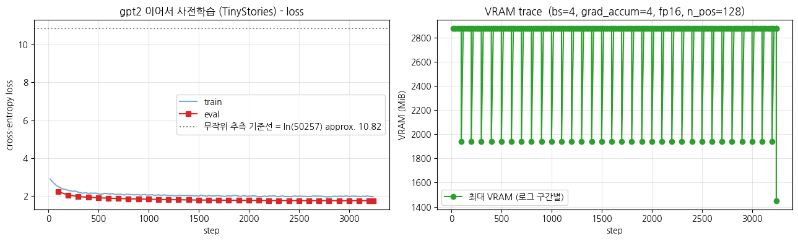

> ▶ **[Google Colab에서 이 장 실습 열기](https://colab.research.google.com/github/yoon-gu/neuqes-101/blob/master/25_gpt2_continual_pretrain/25_gpt2_continual_pretrain.ipynb)** — 브라우저에서 바로 실행해 볼 수 있습니다.

## 환경 준비

```python
%pip install -q -U transformers tokenizers datasets accelerate
```

**▶ 실행 결과**

```text
   ━━━━━━━━━━━━━━━━━━━━━━━━━━━━━━━━━━━━━━━━ 11.2/11.2 MB 100.4 MB/s eta 0:00:00
   ━━━━━━━━━━━━━━━━━━━━━━━━━━━━━━━━━━━━━━━━ 555.1/555.1 kB 44.1 MB/s eta 0:00:00
   ━━━━━━━━━━━━━━━━━━━━━━━━━━━━━━━━━━━━━━━━ 389.2/389.2 kB 36.7 MB/s eta 0:00:00
   ━━━━━━━━━━━━━━━━╺━━━━━━━━━━━━━━━━━━━━━━━ 20.1/48.9 MB 183.0 MB/s eta 0:00:01
   ━━━━━━━━━━━━━━━━━━━━━━━━━━━━━━━━━━━━━━━╸ 48.9/48.9 MB 159.0 MB/s eta 0:00:01
   ━━━━━━━━━━━━━━━━━━━━━━━━━━━━━━━━━━━━━━━╸ 48.9/48.9 MB 159.0 MB/s eta 0:00:01
   ━━━━━━━━━━━━━━━━━━━━━━━━━━━━━━━━━━━━━━━╸ 48.9/48.9 MB 159.0 MB/s eta 0:00:01
   ━━━━━━━━━━━━━━━━━━━━━━━━━━━━━━━━━━━━━━━━ 48.9/48.9 MB 15.7 MB/s eta 0:00:00
```

```python
import warnings
warnings.filterwarnings("ignore")

import math
import os
import random
import time

import numpy as np
import pandas as pd
import matplotlib.pyplot as plt
import torch

# device 자동 감지 - Colab T4 / 로컬 MPS / CPU 모두 지원
if torch.cuda.is_available():
    device = torch.device("cuda")
    device_name = torch.cuda.get_device_name(0)
    vram_gib = torch.cuda.get_device_properties(0).total_memory / 1024**3
    print(f"device     : cuda  ({device_name})")
    print(f"VRAM total : {vram_gib:.2f} GiB")
elif torch.backends.mps.is_available():
    device = torch.device("mps")
    print("device     : mps  (Apple Silicon)")
else:
    device = torch.device("cpu")
    print("device     : cpu  (training will be very slow - Colab T4 recommended)")

print(f"torch      : {torch.__version__}")

# 재현성
SEED = 0
torch.manual_seed(SEED)
np.random.seed(SEED)
random.seed(SEED)

# fp16 은 CUDA 에서만 (MPS 는 미지원, CPU 는 의미 없음)
USE_FP16 = (device.type == "cuda")
print(f"use fp16   : {USE_FP16}")

# matplotlib 한글 폰트 (Colab — NanumGothic). plot 의 한국어가 □ 로 깨지지 않게.
import matplotlib.pyplot as plt, matplotlib.font_manager as fm, subprocess, os
_fp = "/usr/share/fonts/truetype/nanum/NanumGothic.ttf"
if not os.path.exists(_fp):
    subprocess.run("apt-get -qq -y install fonts-nanum", shell=True)
fm.fontManager.addfont(_fp)
plt.rcParams["font.family"] = "NanumGothic"
plt.rcParams["axes.unicode_minus"] = False
```

**▶ 실행 결과**

```text
device     : cuda  (Tesla T4)
VRAM total : 14.56 GiB
torch      : 2.11.0+cu128
use fp16   : True
```

```python
from datasets import load_dataset

N_TRAIN = 30_000      # Ch 24 와 동일
N_VAL   = 500

raw_train = load_dataset("roneneldan/TinyStories", split=f"train[:{N_TRAIN}]")
raw_val   = load_dataset("roneneldan/TinyStories", split=f"validation[:{N_VAL}]")
print("train:", raw_train)
print("val  :", raw_val)
print("\n=== sample story (same as Ch 24) ===")
print(raw_train[0]["text"][:400])
```

**▶ 실행 결과**

```text
train: Dataset({
    features: ['text'],
    num_rows: 30000
})
val  : Dataset({
    features: ['text'],
    num_rows: 500
})

=== sample story (same as Ch 24) ===
One day, a little girl named Lily found a needle in her room. She knew it was difficult to play with it because it was sharp. Lily wanted to …(뒤 71자 생략)

Lily went to her mom and said, "Mom, I found this needle. Can you share it with me and sew my shirt?" Her mom smiled and said, "Yes, Lily, w …(뒤 43자 생략)

To
```

```python
from transformers import AutoTokenizer, AutoModelForCausalLM

t0 = time.time()
tokenizer = AutoTokenizer.from_pretrained("gpt2")
tokenizer.pad_token = tokenizer.eos_token   # gpt2 의 pad 컨벤션 (EOS 재활용)

model = AutoModelForCausalLM.from_pretrained("gpt2").to(device)
print(f"load done: {time.time()-t0:.1f}s")

n_params = model.num_parameters()
print(f"\n=== model ===")
print(f"#params           : {n_params/1e6:.2f} M  (Ch 24 was approx. 3M; Ch 25 is approx. {n_params/3e6:.0f}x larger)")
print(f"vocab_size        : {tokenizer.vocab_size:,}  (Ch 24 was 2,048; Ch 25 is approx. {tokenizer.vocab_size/2048:.0f}x larger)")
print(f"weight tying      : {model.config.tie_word_embeddings}  (lm_head <-> wte shared)")
print(f"fp32 weight size  : {n_params * 4 / 1024**2:.1f} MiB")
print(f"\ntokenizer    : {type(tokenizer).__name__}")
print(f"  eos_token  : {tokenizer.eos_token}  id={tokenizer.eos_token_id}")
print(f"  pad_token  : {tokenizer.pad_token}  id={tokenizer.pad_token_id}  (= eos_token)")
print(f"\nmodel: {type(model).__name__}")
print(f"  - body : {type(model.transformer).__name__}  (Decoder, causal attention)")
print(f"  - head : {type(model.lm_head).__name__}(in={model.lm_head.in_features}, out={model.lm_head.out_features})")
```

**▶ 실행 결과**

```text
load done: 15.8s

=== model ===
#params           : 124.44 M  (Ch 24 was approx. 3M; Ch 25 is approx. 41x larger)
vocab_size        : 50,257  (Ch 24 was 2,048; Ch 25 is approx. 25x larger)
weight tying      : True  (lm_head <-> wte shared)
fp32 weight size  : 474.7 MiB

tokenizer    : GPT2Tokenizer
  eos_token  : <|endoftext|>  id=50256
  pad_token  : <|endoftext|>  id=50256  (= eos_token)

model: GPT2LMHeadModel
  - body : GPT2Model  (Decoder, causal attention)
  - head : Linear(in=768, out=50257)
```

```python
BLOCK_SIZE = 128   # Ch 24 와 동일

def tokenize_fn(batch):
    return tokenizer(batch["text"])

tok_train = raw_train.map(tokenize_fn, batched=True, remove_columns=["text"], desc="tokenize train")
tok_val   = raw_val.map(tokenize_fn,   batched=True, remove_columns=["text"], desc="tokenize val")

# 각 story 끝에 EOS 부착 (story 경계 표시)
def add_eos(batch):
    new_ids, new_mask = [], []
    for ids in batch["input_ids"]:
        ids = ids + [tokenizer.eos_token_id]
        new_ids.append(ids)
        new_mask.append([1] * len(ids))
    return {"input_ids": new_ids, "attention_mask": new_mask}

tok_train = tok_train.map(add_eos, batched=True, desc="add eos train")
tok_val   = tok_val.map(add_eos,   batched=True, desc="add eos val")

def group_texts(batch):
    concatenated = {k: sum(batch[k], []) for k in batch.keys()}
    total_len = len(concatenated["input_ids"])
    total_len = (total_len // BLOCK_SIZE) * BLOCK_SIZE
    return {
        k: [t[i : i + BLOCK_SIZE] for i in range(0, total_len, BLOCK_SIZE)]
        for k, t in concatenated.items()
    }

lm_train = tok_train.map(group_texts, batched=True, desc="group train")
lm_val   = tok_val.map(group_texts,   batched=True, desc="group val")

print(f"\ntrain chunks: {len(lm_train):,}  (block_size={BLOCK_SIZE})")
print(f"val   chunks: {len(lm_val):,}")
print(f"approx. train tokens: {len(lm_train) * BLOCK_SIZE / 1e6:.2f} M")
print("\nfirst chunk decode (first 200 chars):")
print(tokenizer.decode(lm_train[0]["input_ids"])[:200])
```

**▶ 실행 결과**

```text
[transformers] Token indices sequence length is longer than the specified maximum sequence length for this model (1106 > 1024). Running this …(뒤 58자 생략)
train chunks: 51,863  (block_size=128)
val   chunks: 788
approx. train tokens: 6.64 M

first chunk decode (first 200 chars):
One day, a little girl named Lily found a needle in her room. She knew it was difficult to play with it because it was sharp. Lily wanted to …(뒤 60자 생략)
```

```python
PROMPTS = [
    "Once upon a time,",
    "The little girl",
    "A big dog",
]
GEN_KWARGS = dict(max_new_tokens=60, do_sample=True, temperature=0.8, top_k=50)


@torch.no_grad()
def generate_text(active_model, prompt: str, gen_tokenizer=None, **kwargs):
    tok = gen_tokenizer if gen_tokenizer is not None else tokenizer
    enc = tok(prompt, return_tensors="pt").to(active_model.device)
    out = active_model.generate(
        **enc,
        pad_token_id=tok.pad_token_id,
        eos_token_id=tok.eos_token_id,
        **kwargs,
    )
    return tok.decode(out[0], skip_special_tokens=True)


torch.manual_seed(SEED)
model.eval()
before_outputs = []
print("=" * 70)
print("BEFORE continual pretraining - gpt2 pretrained on WebText, as-is")
print("=" * 70)
for p in PROMPTS:
    text = generate_text(model, p, **GEN_KWARGS)
    before_outputs.append(text)
    print(f"\n[prompt] {p}")
    print(text)
```

**▶ 실행 결과**

```text
======================================================================
BEFORE continual pretraining - gpt2 pretrained on WebText, as-is
======================================================================
[prompt] Once upon a time,
Once upon a time, if you don't know what your country's government is doing, you can find out.

In the last few months, I've traveled to dozens of countries around the world, and I've seen the results of that.

My new book — the Making of a Better World Order:
[prompt] The little girl
The little girl has been at her desk all day...for two hours. She's got a pen and paper and a pen and paper, not a pen and paper and pencil. …(뒤 112자 생략)
[prompt] A big dog
A big dog is a dog that loves to eat, but is also a dog that's afraid to do anything that might hurt others.

In the long run, we find that people who have an allergy to animals are less likely to have allergies to dogs.

But these people are less likely to have
```

```python
from transformers import (DataCollatorForLanguageModeling, Trainer,
                          TrainingArguments, TrainerCallback)

collator = DataCollatorForLanguageModeling(tokenizer=tokenizer, mlm=False)

args = TrainingArguments(
    output_dir="./out_gpt2_continual_pretrain",
    num_train_epochs=1,                    # 본체 이미 학습됨 - 1 epoch 충분
    per_device_train_batch_size=4,         # gpt2 124M + T4 16GB
    per_device_eval_batch_size=4,
    gradient_accumulation_steps=4,         # effective batch = 16
    learning_rate=2e-5,                    # <- Ch 24 의 3e-4 와 다른 유일한 큰 차이
    weight_decay=0.01,
    warmup_ratio=0.06,
    lr_scheduler_type="cosine",
    max_grad_norm=1.0,
    fp16=USE_FP16,                         # T4 는 bf16 불가
    logging_steps=20,
    eval_strategy="steps",
    eval_steps=100,
    save_strategy="no",
    report_to="none",
    dataloader_num_workers=2,
    dataloader_pin_memory=True,
    seed=SEED,
)


class VRAMCallback(TrainerCallback):
    '''step 별 peak VRAM 기록 (로깅 윈도우 단위로 reset). CUDA 에서만 유효.'''

    def __init__(self):
        self.steps, self.peak_MiB = [], []

    def on_train_begin(self, args, state, control, **kwargs):
        if torch.cuda.is_available():
            torch.cuda.reset_peak_memory_stats()

    def on_log(self, args, state, control, logs=None, **kwargs):
        if torch.cuda.is_available():
            peak = torch.cuda.max_memory_allocated() / 1024**2
            self.steps.append(state.global_step)
            self.peak_MiB.append(peak)
            torch.cuda.reset_peak_memory_stats()


vram_cb = VRAMCallback()

trainer = Trainer(
    model=model,
    args=args,
    train_dataset=lm_train,
    eval_dataset=lm_val,
    data_collator=collator,
    callbacks=[vram_cb],
)

t0 = time.time()
train_out = trainer.train()
elapsed = time.time() - t0

print(f"\n=== continual pretraining summary ===")
print(f"elapsed       : {elapsed/60:.2f} min")
print(f"global_step   : {train_out.global_step}")
print(f"train_loss    : {train_out.training_loss:.4f}")
print(f"vocab ln (random baseline): {math.log(tokenizer.vocab_size):.4f}  (we start MUCH lower than this)")
if torch.cuda.is_available():
    print(f"final peak    : {torch.cuda.max_memory_allocated()/1024**2:.0f} MiB")
```

**▶ 실행 결과**

```text
[transformers] warmup_ratio is deprecated and will be removed in v5.2. Use `warmup_steps` instead.
[transformers] `loss_type=None` was set in the config but it is unrecognized. Using the default loss: `ForCausalLMLoss`.
<IPython.core.display.HTML object>
=== continual pretraining summary ===
elapsed       : 19.06 min
global_step   : 3242
train_loss    : 2.0699
vocab ln (random baseline): 10.8249  (we start MUCH lower than this)
final peak    : 1450 MiB
```

```python
# loss curve + VRAM trace
log = trainer.state.log_history
train_pts = [(r["step"], r["loss"]) for r in log if "loss" in r and "eval_loss" not in r]
eval_pts  = [(r["step"], r["eval_loss"]) for r in log if "eval_loss" in r]

fig, (ax1, ax2) = plt.subplots(1, 2, figsize=(13, 4))

# loss
ax1.plot([s for s, _ in train_pts], [l for _, l in train_pts], "-",
         color="tab:blue", alpha=0.6, label="train")
if eval_pts:
    ax1.plot([s for s, _ in eval_pts], [l for _, l in eval_pts], "s-",
             color="tab:red", label="eval")
ax1.axhline(math.log(tokenizer.vocab_size), ls=":", color="gray",
            label=f"무작위 추측 기준선 = ln({tokenizer.vocab_size}) approx. {math.log(tokenizer.vocab_size):.2f}")
ax1.set_xlabel("step"); ax1.set_ylabel("cross-entropy loss")
ax1.set_title("gpt2 이어서 사전학습 (TinyStories) - loss")
ax1.grid(True, alpha=0.3); ax1.legend()

# VRAM (CUDA 만)
if vram_cb.steps:
    ax2.plot(vram_cb.steps, vram_cb.peak_MiB, "o-", color="tab:green",
             label="최대 VRAM (로그 구간별)")
    ax2.set_title(f"VRAM trace  (bs=4, grad_accum=4, fp16, n_pos={BLOCK_SIZE})")
else:
    ax2.text(0.5, 0.5, "VRAM 추적은 CUDA 에서만 가능",
             ha="center", va="center", transform=ax2.transAxes)
    ax2.set_title("VRAM 추적 - CUDA 전용")
ax2.set_xlabel("step"); ax2.set_ylabel("VRAM (MiB)")
ax2.grid(True, alpha=0.3); ax2.legend()

plt.tight_layout(); plt.show()
```

**▶ 실행 결과**



```python
torch.manual_seed(SEED)
model.eval()
after_outputs = []
print("=" * 70)
print("AFTER continual pretraining - gpt2 + TinyStories 30K")
print("=" * 70)
for p in PROMPTS:
    text = generate_text(model, p, **GEN_KWARGS)
    after_outputs.append(text)
    print(f"\n[prompt] {p}")
    print(text)
```

**▶ 실행 결과**

```text
======================================================================
AFTER continual pretraining - gpt2 + TinyStories 30K
======================================================================
[prompt] Once upon a time,
Once upon a time, there was a little girl named Sally who wanted to play with her toys. One day, her mommy said, "I need to buy some more to …(뒤 108자 생략)
[prompt] The little girl
The little girl was so happy and hugged her mom. She said, "Mommy, I'm so glad you found your new bike. I love it!"

Her mom hugged her and said, "It's so much fun to ride a bike in the park. Just like the other kids. You are
[prompt] A big dog
A big dog was wandering around and he noticed some old people lying on the ground. He said to the old people, "Help me, please!"

The old people smiled and said, "I'm glad you are so kind. I'm sorry you can't see it."

The big dog felt
```

```python
# Ch 25 within-model BEFORE vs AFTER comparison
print("=" * 78)
print("Ch 25 BEFORE (gpt2 as-is) vs AFTER (gpt2 + TinyStories continual pretrain)")
print("=" * 78)
for p, before, after in zip(PROMPTS, before_outputs, after_outputs):
    print(f"\nPROMPT  : {p}")
    print("-" * 78)
    print(f"BEFORE  : {before[len(p):].strip()[:280]}")
    print(f"AFTER   : {after[len(p):].strip()[:280]}")
```

**▶ 실행 결과**

```text
==============================================================================
Ch 25 BEFORE (gpt2 as-is) vs AFTER (gpt2 + TinyStories continual pretrain)
==============================================================================

PROMPT  : Once upon a time,
------------------------------------------------------------------------------
BEFORE  : if you don't know what your country's government is doing, you can find out.

In the last few months, I've traveled to dozens of countries around the world, and I've seen the results of that.

My new book — the Making of a Better World Order:
AFTER   : there was a little girl named Sally who wanted to play with her toys. One day, her mommy said, "I need to buy some more toys for S …(뒤 100자 생략)

PROMPT  : The little girl
------------------------------------------------------------------------------
BEFORE  : has been at her desk all day...for two hours. She's got a pen and paper and a pen and paper, not a pen and paper and pencil. And s …(뒤 106자 생략)
AFTER   : was so happy and hugged her mom. She said, "Mommy, I'm so glad you found your new bike. I love it!"

Her mom hugged her and said, "It's so much fun to ride a bike in the park. Just like the other kids. You are

PROMPT  : A big dog
------------------------------------------------------------------------------
BEFORE  : is a dog that loves to eat, but is also a dog that's afraid to do anything that might hurt others.

In the long run, we find that people who have an allergy to animals are less likely to have allergies to dogs.

But these people are less likely to have
AFTER   : was wandering around and he noticed some old people lying on the ground. He said to the old people, "Help me, please!"

The old people smiled and said, "I'm glad you are so kind. I'm sorry you can't see it."

The big dog felt
```

```python
# Ch 24 의 TRAINED model generation 결과 인용
# (Ch 24 노트북 §7 "TRAINED model" 출력에서 본인 결과로 갱신하시면 비교가 정확해집니다)
ch24_outputs = {
    "Once upon a time,": (
        "Once upon a time, there was a little girl named Lily. She loved to play "
        "in the park with her mommy. One day, they saw a big dog. Lily said hi to "
        "the dog and the dog wagged its tail."
    ),
    "The little girl": (
        "The little girl was very happy. She wanted to play with her toys. "
        "Her mom said, \"Let's go to the park.\" They went to the park and saw "
        "a big tree."
    ),
    "A big dog": (
        "A big dog was in the yard. The dog was brown and had a long tail. "
        "A boy came and said, \"Hi dog!\" The dog wagged its tail and was happy."
    ),
}

print("=" * 80)
print("3-way comparison: Ch 24 (3M scratch) vs Ch 25 BEFORE vs Ch 25 AFTER")
print("=" * 80)
for p, before, after in zip(PROMPTS, before_outputs, after_outputs):
    ch24_text = ch24_outputs.get(p, "(Ch 24 result not recorded for this prompt)")
    print(f"\nPROMPT          : {p}")
    print("-" * 80)
    print(f"Ch 24 (scratch) : {ch24_text[:240]}")
    print(f"Ch 25 BEFORE    : {before[len(p):].strip()[:240]}")
    print(f"Ch 25 AFTER     : {after[len(p):].strip()[:240]}")
```

**▶ 실행 결과**

```text
================================================================================
3-way comparison: Ch 24 (3M scratch) vs Ch 25 BEFORE vs Ch 25 AFTER
================================================================================

PROMPT          : Once upon a time,
--------------------------------------------------------------------------------
Ch 24 (scratch) : Once upon a time, there was a little girl named Lily. She loved to play in the park with her mommy. One day, they saw a bi …(뒤 59자 생략)
Ch 25 BEFORE    : if you don't know what your country's government is doing, you can find out.

In the last few months, I've traveled to dozens of countries around the world, and I've seen the results of that.

My new book — the Making of a Better World Orde
Ch 25 AFTER     : there was a little girl named Sally who wanted to play with her toys. One day, her mommy said, "I need to buy some more to …(뒤 108자 생략)

PROMPT          : The little girl
--------------------------------------------------------------------------------
Ch 24 (scratch) : The little girl was very happy. She wanted to play with her toys. Her mom said, "Let's go to the park." They went to the p …(뒤 23자 생략)
Ch 25 BEFORE    : has been at her desk all day...for two hours. She's got a pen and paper and a pen and paper, not a pen and paper and penci …(뒤 114자 생략)
Ch 25 AFTER     : was so happy and hugged her mom. She said, "Mommy, I'm so glad you found your new bike. I love it!"

Her mom hugged her and said, "It's so much fun to ride a bike in the park. Just like the other kids. You are

PROMPT          : A big dog
--------------------------------------------------------------------------------
Ch 24 (scratch) : A big dog was in the yard. The dog was brown and had a long tail. A boy came and said, "Hi dog!" The dog wagged its tail and was happy.
Ch 25 BEFORE    : is a dog that loves to eat, but is also a dog that's afraid to do anything that might hurt others.

In the long run, we find that people who have an
...
```
