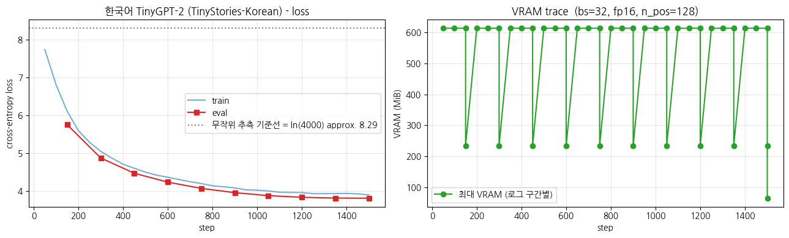

> ▶ **[Google Colab에서 이 장 실습 열기](https://colab.research.google.com/github/yoon-gu/neuqes-101/blob/master/26_ko_tiny_gpt/26_ko_tiny_gpt.ipynb)** — 브라우저에서 바로 실행해 볼 수 있습니다.

## 환경 셋업

먼저 노트북 실행에 필요한 핵심 라이브러리를 설치합니다. `transformers`(모델·Trainer), `tokenizers`(BBPE 직접 학습), `datasets`(한국어 TinyStories 로드), `accelerate`(학습 가속) 네 가지입니다.

```python
%pip install -q -U transformers tokenizers datasets accelerate
```

**▶ 실행 결과**

```text
   ━━━━━━━━━━━━━━━━━━━━━━━━━━━━━━━━━━━━━━━╸ 11.1/11.2 MB 174.1 MB/s eta 0:00:01
   ━━━━━━━━━━━━━━━━━━━━━━━━━━━━━━━━━━━━━━━━ 11.2/11.2 MB 97.4 MB/s eta 0:00:00
   ━━━━━━━━━━━━━━━━━━━━━━━━━━━━━━━━━━━━━━━━ 555.1/555.1 kB 42.8 MB/s eta 0:00:00
   ━━━━━━━━━━━━━━━━━━━━━━━━━━━━━━━━━━━━━━━━ 389.2/389.2 kB 34.4 MB/s eta 0:00:00
   ━━━━━━━━━━━━━━━━━━━━━━━╺━━━━━━━━━━━━━━━━ 28.6/48.9 MB 168.7 MB/s eta 0:00:01
   ━━━━━━━━━━━━━━━━━━━━━━━━━━━━━━━━━━━━━━━╸ 48.9/48.9 MB 196.9 MB/s eta 0:00:01
   ━━━━━━━━━━━━━━━━━━━━━━━━━━━━━━━━━━━━━━━╸ 48.9/48.9 MB 196.9 MB/s eta 0:00:01
   ━━━━━━━━━━━━━━━━━━━━━━━━━━━━━━━━━━━━━━━━ 48.9/48.9 MB 18.0 MB/s eta 0:00:00
```

실행 환경(GPU 종류·VRAM)을 자동으로 감지하고, 재현성을 위한 seed 고정과 T4 전용 `fp16` 플래그를 설정합니다. matplotlib 한글 폰트(NanumGothic)도 함께 준비해 뒤에서 그릴 loss 그래프의 한국어 라벨이 깨지지 않도록 합니다.

```python
import warnings
warnings.filterwarnings("ignore")

import math
import os
import random
import time

import numpy as np
import pandas as pd
import matplotlib.pyplot as plt
import torch

# device 자동 감지 - Colab T4 / 로컬 MPS / CPU 모두 지원
if torch.cuda.is_available():
    device = torch.device("cuda")
    device_name = torch.cuda.get_device_name(0)
    vram_gib = torch.cuda.get_device_properties(0).total_memory / 1024**3
    print(f"device     : cuda  ({device_name})")
    print(f"VRAM total : {vram_gib:.2f} GiB")
elif torch.backends.mps.is_available():
    device = torch.device("mps")
    print("device     : mps  (Apple Silicon)")
else:
    device = torch.device("cpu")
    print("device     : cpu  (training will be very slow - Colab T4 recommended)")

print(f"torch      : {torch.__version__}")

# 재현성
SEED = 0
torch.manual_seed(SEED)
np.random.seed(SEED)
random.seed(SEED)

# fp16 은 CUDA 에서만 (MPS 는 미지원, CPU 는 의미 없음)
USE_FP16 = (device.type == "cuda")
print(f"use fp16   : {USE_FP16}")

# matplotlib 한글 폰트 (Colab — NanumGothic). plot 의 한국어가 □ 로 깨지지 않게.
import matplotlib.pyplot as plt, matplotlib.font_manager as fm, subprocess, os
_fp = "/usr/share/fonts/truetype/nanum/NanumGothic.ttf"
if not os.path.exists(_fp):
    subprocess.run("apt-get -qq -y install fonts-nanum", shell=True)
fm.fontManager.addfont(_fp)
plt.rcParams["font.family"] = "NanumGothic"
plt.rcParams["axes.unicode_minus"] = False
```

**▶ 실행 결과**

```text
device     : cuda  (Tesla T4)
VRAM total : 14.56 GiB
torch      : 2.11.0+cu128
use fp16   : True
```

**결과 해석**

T4 GPU(VRAM 약 14.56 GiB)가 정상 감지되어 `fp16` 학습이 활성화됐습니다. 이 챕터의 학습·생성은 이 T4 환경을 전제로 합니다.

## 한국어 TinyStories 데이터 로드 + story 복원

`g0ster/TinyStories-Korean` 은 영어 `roneneldan/TinyStories` 를 한국어로 번역한 동화 데이터셋 (Dohoon Kim, 2024, MIT 라이선스). 어휘·문법이 단순해 **3-5M 파라미터** 짜리 작은 모델로도 한국어 문장 생성을 시연할 수 있습니다.

**데이터 구조 주의** — 이 데이터셋은 *story 단위가 아니라 줄(line) 단위* 로 저장되어 있습니다. 한 story 가 여러 줄로 나뉘어 있고, story 끝마다 `<|endoftext|>` 줄이 들어가며, 사이에 빈 줄도 섞여 있습니다. 그래서 *`<|endoftext|>` 를 만날 때까지 줄을 이어 붙여* 한 story 로 복원합니다. 그렇게 복원한 처음 **30,000 stories** 만 사용 (Ch 24 와 같은 규모, T4 30분 룰 안).

```python
from datasets import load_dataset

EOT_MARK = "<|endoftext|>"      # 데이터셋이 story 경계 표시에 쓰는 마커
N_TRAIN  = 30_000               # 복원할 story 수 (더 길게 돌리려면 키우세요)
N_VAL    = 500
# story 30K 를 복원하려면 줄을 넉넉히 스트리밍해야 합니다 (story 당 평균 여러 줄 + 빈 줄).
MAX_LINES_TO_SCAN = 800_000

# train/validation 모두 한 줄(text) 짜리 스키마. 스트리밍으로 필요한 만큼만 읽음.
def rebuild_stories(split, n_stories, max_lines):
    '''줄 단위 데이터를 <|endoftext|> 기준으로 이어 붙여 story 리스트로 복원.'''
    stories, buf = [], []
    stream = load_dataset("g0ster/TinyStories-Korean", split=split, streaming=True)
    for i, ex in enumerate(stream):
        if i >= max_lines or len(stories) >= n_stories:
            break
        line = (ex["text"] or "").strip()
        if line == EOT_MARK:
            story = " ".join(buf).strip()
            if story:
                stories.append(story)
            buf = []
        elif line:
            buf.append(line)
    # 버퍼에 남은 마지막 story 도 수습
    if buf and len(stories) < n_stories:
        tail = " ".join(buf).strip()
        if tail:
            stories.append(tail)
    return stories[:n_stories]

t0 = time.time()
train_stories = rebuild_stories("train", N_TRAIN, MAX_LINES_TO_SCAN)
val_stories   = rebuild_stories("validation", N_VAL, 50_000)
print(f"rebuilt stories: train={len(train_stories):,}, val={len(val_stories):,}  ({time.time()-t0:.1f}s)")

from datasets import Dataset
raw_train = Dataset.from_dict({"text": train_stories})
raw_val   = Dataset.from_dict({"text": val_stories})
print("train:", raw_train)
print("val  :", raw_val)

# 길이 통계 + 샘플
lens = [len(s) for s in train_stories]
print(f"\nstory length (chars): mean={np.mean(lens):.0f}, median={np.median(lens):.0f}, max={max(lens)}")
print("\n=== sample story ===")
print(raw_train[0]["text"][:400])
```

**▶ 실행 결과**

```text
rebuilt stories: train=30,000, val=500  (19.1s)
train: Dataset({
    features: ['text'],
    num_rows: 30000
})
val  : Dataset({
    features: ['text'],
    num_rows: 500
})

story length (chars): mean=468, median=420, max=2754

=== sample story ===
한때 벤이라는 이름의 어린 소년이 있었어요. 벤은 주변 세계를 탐험하는 것을 좋아했답니다. 그는 가게에 전시되어 있던 아름다운 꽃병들 같은 멋진 것들을 많이 봤어요. 어느 날, 벤은 가게를 거닐다가 정말 특별한 꽃병을 발견했죠. 벤은 그 꽃병을 보고 …(뒤 240자 생략)
```

**결과 해석**

30,000개 story 복원이 약 19초에 끝났고, story 평균 길이는 약 468자(중앙값 420자)로 짧은 동화 규모입니다. 샘플 story가 한 문장씩 자연스럽게 이어지는 것으로 보아 `<|endoftext|>` 기준 복원이 정상 동작했음을 확인할 수 있습니다.

## BBPE 토크나이저 직접 학습 (한국어)

`tokenizers.BPE` + ByteLevel pre-tokenizer 로 vocab 약 4,000 의 byte-level BPE 를 *한국어 코퍼스에서 직접* 학습합니다. Ch 24 의 영어 BPE 와 *같은 절차* — 다른 점은 *학습 코퍼스* (영어 → 한국어) 와 *vocab 크기* (2,048 → 약 4,000, 한글 byte 표현을 위해 약간 키움) 뿐.

```python
from tokenizers import Tokenizer
from tokenizers.models import BPE
from tokenizers.trainers import BpeTrainer
from tokenizers.pre_tokenizers import ByteLevel
from tokenizers.decoders import ByteLevel as ByteLevelDecoder
from transformers import PreTrainedTokenizerFast

VOCAB_SIZE = 4000     # 한국어는 byte 단위라 영어(2048)보다 약간 키움
EOS = "<|endoftext|>"

bbpe = Tokenizer(BPE(unk_token=None))
bbpe.pre_tokenizer = ByteLevel(add_prefix_space=False)
bbpe.decoder = ByteLevelDecoder()
trainer = BpeTrainer(
    vocab_size=VOCAB_SIZE,
    special_tokens=[EOS],
    initial_alphabet=ByteLevel.alphabet(),
    show_progress=True,
)

t0 = time.time()
bbpe.train_from_iterator((ex["text"] for ex in raw_train), trainer, length=len(raw_train))
print(f"BBPE training done: {time.time()-t0:.1f}s, vocab={bbpe.get_vocab_size()}")

# HF 표준 인터페이스로 wrap - bos = eos = pad 모두 <|endoftext|> 로 (GPT 컨벤션)
tokenizer = PreTrainedTokenizerFast(
    tokenizer_object=bbpe,
    bos_token=EOS,
    eos_token=EOS,
    pad_token=EOS,
)

print("\n=== encode/decode demo (Korean) ===")
sample = "옛날 옛날에 작은 토끼가 숲으로 갔어요."
enc = tokenizer(sample)
print(f"input      : {sample}")
print(f"ids        : {enc['input_ids']}")
print(f"n_tokens   : {len(enc['input_ids'])}")
print(f"decode     : {tokenizer.decode(enc['input_ids'])}")
print(f"vocab_size : {tokenizer.vocab_size}")
print(f"eos_token  : {tokenizer.eos_token}  id={tokenizer.eos_token_id}")
```

**▶ 실행 결과**

```text
BBPE training done: 9.9s, vocab=4000

=== encode/decode demo (Korean) ===
input      : 옛날 옛날에 작은 토끼가 숲으로 갔어요.
ids        : [645, 2132, 455, 2358, 1115, 452, 894, 14]
n_tokens   : 8
decode     : 옛날 옛날에 작은 토끼가 숲으로 갔어요.
vocab_size : 4000
eos_token  : <|endoftext|>  id=0
```

**결과 해석**

BBPE 학습이 약 10초 만에 끝나 vocab 4,000을 확보했고, `"옛날 옛날에 작은 토끼가 숲으로 갔어요."`가 단 8개 토큰으로 인코딩됐다가 원문 그대로 복원됩니다. 한국어 코퍼스 위에 학습한 덕분에 자주 등장하는 어절이 의미 단위로 압축됐음을 보여 줍니다.

### 같은 한국어 문장: 영어 BPE (gpt2) vs 한국어 BBPE (본 챕터)

`gpt2` 의 영어 BPE 로 한국어를 토큰화하면 한글이 *byte 단위로 잘게 쪼개져* 토큰 수가 폭증합니다. 우리가 한국어 코퍼스 위에 직접 학습한 BBPE 와 *같은 문장* 을 비교해 봅니다 (Ch 25 Q4 / Ch 19 §5-4 의 cross-language 결론을 한국어 generation 챕터에서 실측).

다음으로 같은 한국어 문장을 영어 `gpt2` BPE와 우리 BBPE로 각각 토큰화해 토큰 수를 비교합니다. 영어 BPE가 한글을 얼마나 잘게 쪼개는지(토큰 수 폭증)를 정량으로 확인하는 cross-language 실측입니다.

```python
from transformers import AutoTokenizer

# 영어 gpt2 BPE 로드 (비교용)
gpt2_tok = AutoTokenizer.from_pretrained("gpt2")

ko_sentences = [
    "옛날 옛날에 작은 토끼가 살았어요.",
    "큰 개가 공원에서 신나게 뛰어놀았어요.",
    "작은 소녀가 엄마에게 꽃을 주었어요.",
]

rows = []
for sent in ko_sentences:
    n_gpt2 = len(gpt2_tok(sent, add_special_tokens=False)["input_ids"])
    n_ours = len(tokenizer(sent, add_special_tokens=False)["input_ids"])
    rows.append({
        "sentence": sent,
        "gpt2_BPE_tokens": n_gpt2,
        "ours_BBPE_tokens": n_ours,
        "ratio_gpt2/ours": round(n_gpt2 / n_ours, 2),
    })

cmp_df = pd.DataFrame(rows)
print("Korean tokenization: English gpt2 BPE vs our Korean BBPE")
print("=" * 70)
print(cmp_df.to_string(index=False))
print("\n=> gpt2 BPE splits Korean into many byte fragments (more tokens).")
print("   Our Korean BBPE keeps meaningful units (fewer tokens).")
```

**▶ 실행 결과**

```text
Korean tokenization: English gpt2 BPE vs our Korean BBPE
======================================================================
             sentence  gpt2_BPE_tokens  ours_BBPE_tokens  ratio_gpt2/ours
  옛날 옛날에 작은 토끼가 살았어요.               43                 6             7.17
큰 개가 공원에서 신나게 뛰어놀았어요.               51                 8             6.38
 작은 소녀가 엄마에게 꽃을 주었어요.               45                 7             6.43

=> gpt2 BPE splits Korean into many byte fragments (more tokens).
   Our Korean BBPE keeps meaningful units (fewer tokens).
```

**결과 해석**

세 문장 모두에서 영어 gpt2 BPE가 우리 BBPE보다 약 6.4-7.2배 많은 토큰을 만들어 냅니다(예: `"옛날 옛날에 작은 토끼가 살았어요."`가 43 토큰 대 6 토큰). UNK는 없지만 한글이 byte 조각으로 잘게 쪼개져 의미 단위가 사라지는 것 — 한국어를 직접 학습한 토크나이저로 다뤄야 하는 이유의 실측 답입니다.

**관전 포인트** — `옛날 옛날에` 처럼 한국어 코퍼스에 *자주 등장* 하는 표현은 우리 BBPE 가 *적은 토큰* 으로 압축합니다. 영어 gpt2 BPE 는 같은 문장을 *2-4배 많은 byte 조각* 으로 쪼갭니다 — UNK 는 없지만 *의미 단위* 가 사라져, 그 위에서 학습하면 한국어 정보를 압축할 자리가 부족합니다. *왜 한국어는 토크나이저를 직접 학습하는가* 의 실측 답.

## 토큰화 + `group_texts` (HF 표준 CLM 전처리)

Ch 24 와 *완전히 같은 패턴* (HF `run_clm.py` 표준):

1. 전체 코퍼스를 토큰화 (배치 단위)
2. 각 story 끝에 `<|endoftext|>` 부착 (story 경계 표시)
3. 모든 토큰을 이어붙여 1D 스트림으로 만든 뒤 `block_size=128` 단위로 잘라 chunk 화
4. 각 chunk 가 한 학습 sample - `DataCollatorForLanguageModeling(mlm=False)` 가 `labels = input_ids` 를 자동으로 채워 next-token prediction loss 가 됨

```python
BLOCK_SIZE = 128

def tokenize_fn(batch):
    return tokenizer(batch["text"])

# 토큰화 (text 컬럼 제거)
tok_train = raw_train.map(tokenize_fn, batched=True, remove_columns=["text"], desc="tokenize train")
tok_val   = raw_val.map(tokenize_fn,   batched=True, remove_columns=["text"], desc="tokenize val")
```

**위 코드 읽기** — `block_size`를 128로 잡고, `tokenizer`로 각 story 텍스트를 토큰 id 시퀀스로 변환합니다. `remove_columns=["text"]`로 원본 문자열 컬럼은 버려 이후 단계가 토큰 id 위에서만 동작하게 합니다.

```python
# 각 story 끝에 EOS 부착 (story 경계 표시)
def add_eos(batch):
    new_ids, new_mask = [], []
    for ids in batch["input_ids"]:
        ids = ids + [tokenizer.eos_token_id]
        new_ids.append(ids)
        new_mask.append([1] * len(ids))
    return {"input_ids": new_ids, "attention_mask": new_mask}

tok_train = tok_train.map(add_eos, batched=True, desc="add eos train")
tok_val   = tok_val.map(add_eos,   batched=True, desc="add eos val")
```

**위 코드 읽기** — 각 story 토큰 끝에 `eos_token_id`(`<|endoftext|>`)를 붙여 story 경계를 표시합니다. 다음 단계에서 모든 토큰을 한 줄로 이어붙일 때, 이 EOS가 한 story가 어디서 끝나는지를 모델에 알려 주는 신호가 됩니다.

```python
# group_texts - 모든 토큰을 이어붙여 BLOCK_SIZE 단위로 자름
def group_texts(batch):
    concatenated = {k: sum(batch[k], []) for k in batch.keys()}
    total_len = len(concatenated["input_ids"])
    total_len = (total_len // BLOCK_SIZE) * BLOCK_SIZE
    return {
        k: [t[i : i + BLOCK_SIZE] for i in range(0, total_len, BLOCK_SIZE)]
        for k, t in concatenated.items()
    }

lm_train = tok_train.map(group_texts, batched=True, desc="group train")
lm_val   = tok_val.map(group_texts,   batched=True, desc="group val")

print(f"\ntrain chunks: {len(lm_train):,}  (block_size={BLOCK_SIZE})")
print(f"val   chunks: {len(lm_val):,}")
print(f"approx. train tokens: {len(lm_train) * BLOCK_SIZE / 1e6:.2f} M")
print("\nfirst chunk decode (first 200 chars):")
print(tokenizer.decode(lm_train[0]["input_ids"])[:200])
```

**위 코드 읽기** — `group_texts`는 배치 안의 모든 토큰을 하나의 긴 스트림으로 이어붙인 뒤 `BLOCK_SIZE`로 나누어떨어지는 길이만큼만 남기고 128 토큰짜리 chunk로 자릅니다. 이렇게 만든 각 chunk가 한 학습 sample이 되며, 이것이 HF `run_clm.py`의 표준 CLM 전처리 패턴입니다.

**▶ 실행 결과**

```text
train chunks: 45,845  (block_size=128)
val   chunks: 750
approx. train tokens: 5.87 M

first chunk decode (first 200 chars):
한때 벤이라는 이름의 어린 소년이 있었어요. 벤은 주변 세계를 탐험하는 것을 좋아했답니다. 그는 가게에 전시되어 있던 아름다운 꽃병들 같은 멋진 것들을 많이 봤어요. 어느 날, 벤은 가게를 거닐다가 정말 특별한 꽃병을 발견했죠. 벤은 그 꽃병을 보고 …(뒤 60자 생략)
```

**결과 해석**

30,000 story가 128 토큰짜리 45,845개 chunk(약 5.87M 토큰)로 변환됐습니다. 첫 chunk를 디코딩하면 원본 story가 그대로 복원되어, 토큰화·EOS 부착·chunk 분할 전처리가 의도대로 동작했음을 확인할 수 있습니다.

### Collator 가 만드는 `labels` 확인 (한국어) - *거의 모든 자리* 가 학습 신호

`DataCollatorForLanguageModeling(mlm=False)` 가 *내부적으로* `labels = input_ids.clone()` 을 만들어 `-100` 자리는 *없거나 pad 토큰 자리만* 임을 한국어 데이터로 직접 확인합니다. Ch 20·22 의 MLM collator 가 약 85% 를 `-100` 으로 채웠던 것과 *정확히 반대* — Ch 24 (영어) 에서 본 결과의 한국어 재확인.

다음 셀에서는 `DataCollatorForLanguageModeling(mlm=False)`이 만드는 `labels`를 직접 들여다봅니다. MLM(약 85%가 `-100`)과 달리 CausalLM은 거의 모든 자리가 학습 신호임을 한국어 데이터로 확인하는 `-100` thread 셀입니다.

```python
from transformers import DataCollatorForLanguageModeling

collator_demo = DataCollatorForLanguageModeling(tokenizer=tokenizer, mlm=False)
demo_batch = collator_demo([lm_train[0], lm_train[1]])

input_ids = demo_batch["input_ids"]
labels = demo_batch["labels"]

print(f"input_ids shape: {tuple(input_ids.shape)}")
print(f"labels shape   : {tuple(labels.shape)}")

# -100 자리 vs 학습 신호 자리 비율
total = labels.numel()
n_ignored = (labels == -100).sum().item()
n_train_signal = total - n_ignored
print(f"\n=== 'labels = -100' thread - CausalLM vs MLM comparison (Korean) ===")
print(f"total positions      : {total}")
print(f"  ignored (-100)     : {n_ignored:>5d}  ({100 * n_ignored / total:5.2f}%)")
print(f"  train signal       : {n_train_signal:>5d}  ({100 * n_train_signal / total:5.2f}%)")
print(f"\n[MLM (Ch 20/22)]     approx. 85% = -100, 15% = train signal")
print(f"[CausalLM (this ch)] {100 * n_ignored / total:5.2f}% = -100, {100 * n_train_signal / total:5.2f}% = train signal  <- almost every position")
print(f"\n=> a single step's token-learning efficiency: GPT pretrain is approx. 5-6x higher than MLM")

# input_ids 와 labels 의 동일성 검증 (pad 가 아닌 자리)
identical = (input_ids == labels).sum().item()
print(f"\n(input_ids == labels) positions: {identical}/{total}  - clone as-is")
```

**▶ 실행 결과**

```text
input_ids shape: (2, 128)
labels shape   : (2, 128)

=== 'labels = -100' thread - CausalLM vs MLM comparison (Korean) ===
total positions      : 256
  ignored (-100)     :     1  ( 0.39%)
  train signal       :   255  (99.61%)

[MLM (Ch 20/22)]     approx. 85% = -100, 15% = train signal
[CausalLM (this ch)]  0.39% = -100, 99.61% = train signal  <- almost every position

=> a single step's token-learning efficiency: GPT pretrain is approx. 5-6x higher than MLM

(input_ids == labels) positions: 255/256  - clone as-is
```

**결과 해석**

256개 자리 중 `-100`은 단 1개(0.39%)뿐이고 99.61%가 학습 신호로, MLM의 약 15%와 정확히 반대입니다. `labels`가 `input_ids`를 거의 그대로 복제한(255/256 일치) 결과로, CausalLM 사전학습이 한 step당 토큰 학습 효율이 MLM보다 약 5-6배 높음을 한국어 데이터로 재확인합니다.

> **`-100` thread 환기 (한국어)** - 언어가 한국어로 바뀌어도 collator 동작은 동일. CausalLM 은 *거의 모든 자리* 학습. Ch 28 (한국어 SFT) 에서는 *prompt 자리만 -100* - 같은 트릭의 정반대 자리. 그 한 줄 코드가 *모델이 한국어 instruction 을 따라가게 만드는 핵심* 이고, 본 챕터의 collator 셋업이 그 토대입니다.

## `GPT2LMHeadModel` from scratch (Ch 24 와 동일 구조)

`GPT2Config` 의 핵심 필드를 작게 잡고 *random init* (사전학습 X) 시작 — Ch 24 와 *완전히 같은 본체*. vocab 만 한국어 BBPE (약 4,000) 에 맞춤.

- `n_layer=4, n_head=4, n_embd=256` → 약 3M params (Ch 24 와 동일)
- `n_positions = BLOCK_SIZE = 128`
- bos / eos / pad token id 를 토크나이저와 동기화
- `tie_word_embeddings=True` (기본) - LM head 와 input embedding weight 공유

이제 학습할 모델을 정의합니다. `GPT2Config`를 작게(`n_layer=4, n_head=4, n_embd=256`) 잡아 random init하며, vocab만 한국어 BBPE(4,000)에 맞춥니다. Ch 24의 영어 모델과 완전히 같은 본체 구조입니다.

```python
from transformers import GPT2Config, GPT2LMHeadModel

config = GPT2Config(
    vocab_size=tokenizer.vocab_size,
    n_positions=BLOCK_SIZE,
    n_embd=256,
    n_layer=4,
    n_head=4,
    bos_token_id=tokenizer.bos_token_id,
    eos_token_id=tokenizer.eos_token_id,
    pad_token_id=tokenizer.pad_token_id,
    activation_function="gelu_new",
    resid_pdrop=0.1, embd_pdrop=0.1, attn_pdrop=0.1,
)

model = GPT2LMHeadModel(config).to(device)   # 학습 전 generation 시연용으로 미리 GPU 로
n_params = model.num_parameters()
print(f"#params           : {n_params/1e6:.2f} M")
print(f"weight tying      : {config.tie_word_embeddings}  (lm_head <-> wte shared)")
print(f"fp32 weight size  : {n_params * 4 / 1024**2:.2f} MiB")
print(f"\nmodel: {type(model).__name__}")
print(f"  - body : {type(model.transformer).__name__}  (Decoder, causal attention)")
print(f"  - head : {type(model.lm_head).__name__}(in={model.lm_head.in_features}, out={model.lm_head.out_features})")
```

**▶ 실행 결과**

```text
#params           : 4.22 M
weight tying      : True  (lm_head <-> wte shared)
fp32 weight size  : 16.08 MiB

model: GPT2LMHeadModel
  - body : GPT2Model  (Decoder, causal attention)
  - head : Linear(in=256, out=4000)
```

**결과 해석**

약 4.22M 파라미터의 작은 GPT가 만들어졌고, weight tying이 켜져 LM head(`Linear(256, 4000)`)가 입력 임베딩과 가중치를 공유합니다. body는 causal attention을 쓰는 디코더(`GPT2Model`)로, vocab 차원만 4,000으로 바뀐 것 외에는 Ch 24와 동일한 본체입니다.

## 학습 *전* generation - 비교 기준선 (random init baseline)

Ch 24 의 *사전학습 전 generation* 과 같은 역할. random init 모델은 *어느 토큰이든 거의 균등한 확률* 로 뽑으니, 생성 텍스트가 *한국어와 거리가 먼 byte 조각 / 의미 없는 음절 나열* 이 나옵니다.

같은 한국어 prompt 와 sampling 설정을 학습 *전 / 후* 모두에서 호출 → *학습이 본체에 무엇을 새겼는가* 가 한 화면에 드러납니다.

이제 학습 *전* generation을 해 비교 기준선을 만듭니다. random init 모델에 한국어 prompt 4개를 넣어 보면, 아직 아무것도 학습하지 않은 본체가 어떤 텍스트를 뱉는지 확인할 수 있습니다. 같은 prompt·sampling 설정을 학습 후에도 그대로 써서 before/after를 나란히 비교합니다.

```python
PROMPTS = [
    "옛날 옛날에",
    "작은 소녀가",
    "큰 개가",
    "어느 날,",
]
GEN_KWARGS = dict(max_new_tokens=60, do_sample=True, temperature=0.8, top_k=50)


@torch.no_grad()
def generate_text(active_model, prompt: str, gen_tokenizer=None, **kwargs):
    tok = gen_tokenizer if gen_tokenizer is not None else tokenizer
    enc = tok(prompt, return_tensors="pt").to(active_model.device)
    out = active_model.generate(
        **enc,
        pad_token_id=tok.pad_token_id,
        eos_token_id=tok.eos_token_id,
        **kwargs,
    )
    return tok.decode(out[0], skip_special_tokens=True)


# 재현성을 위해 학습 전·후 동일 seed
torch.manual_seed(SEED)
model.eval()
before_outputs = []
print("=" * 70)
print("UNTRAINED model - generation from random initial weights")
print("=" * 70)
for p in PROMPTS:
    text = generate_text(model, p, **GEN_KWARGS)
    before_outputs.append(text)
    print(f"\nprompt: {p}")
    print(text)
```

**▶ 실행 결과**

```text
======================================================================
UNTRAINED model - generation from random initial weights
======================================================================
prompt: 옛날 옛날에
옛날 옛날에 도와줄게 미소지으며 플러피 친절하고 있었거든요 농� 시작한�� 올려 한다는 즐겁게�요 너랑 만들어 외롭 보�갔죠티�여 혼자서 되었고 타고란다 사라와���� 상태 있었거든요 농� 스스루욱���� 다음 여기저기 달콤 개미 개미 것들을 루시라는 …(뒤 46자 생략)
prompt: 작은 소녀가
작은 소녀가산 즐거워 사라가 엄마는 과일을 기쁨었다 � 샘을상 놀라운 물속에서 놀았고 있었죠짝 에이미와 단 불 햇 약 � 레 샘는마다 친구들에게 불� 날씨고마워냈어요 선물로 멋져 항해� 있도록� 숲속 싶은 눈� 숨바꼭질을�도켰 플 있었죠 뒤� …(뒤 30자 생략)
prompt: 큰 개가
큰 개가으로합니다��화합니다 싶은 개 샘을 올려 낮� 만들어 조는 날이 방법 만들어해주티 마음이으며된 행복해졌 행복해졌론라를라를 플러피 털분에분에 조는 생각한 않 분홍양 에 쳐다 미아가�고마워 느꼈어요 차 분홍 이용 만드는 초 개미 개미�지�나는 터뜨 …(뒤 21자 생략)
prompt: 어느 날,
어느 날, 고양이는 퍼즐�리를 안아주 의사았을�� 완벽한고마워 � 플러피고마워 싸 안아주 거실 영리 페 그녀의 아이스크림 접�� 레 의자에으며치를 돕이건 자신을갔습니다 할머니 구 아이스크림계프는 엄마님은 레 거실 악 거실 파란 기뻤습니다 운� 친구들에 …(뒤 40자 생략)
```

**결과 해석**

random init 상태라 네 prompt 모두 의미 없는 음절·byte 조각(`농�`, `보�갔죠티�여` 등)이 뒤죽박죽 나열됩니다. logits가 무작위 초기값이라 next-token 분포가 형성되지 않은 상태로, 학습 후 출력과 비교할 baseline이 됩니다.

**관전 포인트** - 학습 전 출력은 *무작위 음절·byte 조각 나열* (의미 없는 한국어 토큰들). 학습 후 출력과 *나란히 비교* 하면 사전학습이 본체에 *next-token 분포* 를 새긴 증거를 직접 보게 됩니다. Ch 24 (영어) 에서 random init 출력이 영어와 거리 멀었던 것과 같은 현상의 한국어판.

## `Trainer` 로 사전학습 (Ch 24 와 동일 hyperparams)

Ch 24 와 *완전히 같은* Trainer 패턴 — 모델 클래스·collator·hyperparams 모두 동일. 변하는 건 *데이터 (한국어) + 토크나이저 (BBPE)* 뿐.

- `DataCollatorForLanguageModeling(mlm=False)` → `labels = input_ids` (next-token prediction)
- `max_steps=1500`, `batch_size=32`, `lr=5e-4`, `fp16=True` - T4 약 1분
- `eval_steps=150` 으로 train / val loss 추이 관찰

이제 `Trainer`로 본격 사전학습을 합니다. Ch 24와 같은 hyperparams(`max_steps=1500`, `batch_size=32`, `fp16`)에 학습률만 한국어 vocab에 맞춰 `5e-4`로 잡았고, VRAM 추적 콜백을 붙여 step별 peak 메모리를 기록합니다.

```python
from transformers import (DataCollatorForLanguageModeling, Trainer,
                          TrainingArguments, TrainerCallback)

collator = DataCollatorForLanguageModeling(tokenizer=tokenizer, mlm=False)

args = TrainingArguments(
    output_dir="./out_ko_tiny_gpt",
    max_steps=1500,
    per_device_train_batch_size=32,
    per_device_eval_batch_size=32,
    learning_rate=5e-4,                  # scratch 사전학습 표준
    weight_decay=0.1,
    adam_beta1=0.9, adam_beta2=0.95,
    warmup_steps=100,
    lr_scheduler_type="cosine",
    max_grad_norm=1.0,
    fp16=USE_FP16,                       # T4 는 bf16 불가
    logging_steps=50,
    eval_strategy="steps",
    eval_steps=150,
    save_strategy="no",
    report_to="none",
    dataloader_num_workers=2,
    dataloader_pin_memory=True,
    seed=SEED,
)


class VRAMCallback(TrainerCallback):
    '''step 별 peak VRAM 기록 (로깅 윈도우 단위로 reset). CUDA 에서만 유효.'''

    def __init__(self):
        self.steps, self.peak_MiB = [], []

    def on_train_begin(self, args, state, control, **kwargs):
        if torch.cuda.is_available():
            torch.cuda.reset_peak_memory_stats()

    def on_log(self, args, state, control, logs=None, **kwargs):
        if torch.cuda.is_available():
            peak = torch.cuda.max_memory_allocated() / 1024**2
            self.steps.append(state.global_step)
            self.peak_MiB.append(peak)
            torch.cuda.reset_peak_memory_stats()


vram_cb = VRAMCallback()

trainer = Trainer(
    model=model,
    args=args,
    train_dataset=lm_train,
    eval_dataset=lm_val,
    data_collator=collator,
    callbacks=[vram_cb],
)

t0 = time.time()
train_out = trainer.train()
elapsed = time.time() - t0

print(f"\n=== training summary ===")
print(f"elapsed       : {elapsed/60:.2f} min")
print(f"global_step   : {train_out.global_step}")
print(f"train_loss    : {train_out.training_loss:.4f}")
print(f"random baseline (ln vocab): {math.log(tokenizer.vocab_size):.4f}")
if torch.cuda.is_available():
    print(f"final peak    : {torch.cuda.max_memory_allocated()/1024**2:.0f} MiB")
```

**▶ 실행 결과**

```text
[transformers] `loss_type=None` was set in the config but it is unrecognized. Using the default loss: `ForCausalLMLoss`.
Step  Training Loss  Validation Loss
150   6.099236       5.745915
300   5.041654       4.868237
450   4.596394       4.463939
600   4.358889       4.229672
750   4.192318       4.064077
900   4.076734       3.951416
1050  3.997099       3.871891
1200  3.952390       3.828786
1350  3.926925       3.807920
1500  3.892811       3.804397
=== training summary ===
elapsed       : 0.91 min
global_step   : 1500
train_loss    : 4.5487
random baseline (ln vocab): 8.2940
final peak    : 66 MiB
```

**결과 해석**

1500 step 학습이 약 0.91분(1분 미만)에 끝났고, 누적 평균 `train_loss`가 random baseline 8.29에서 4.55까지 내려갔습니다. 번역체 한국어라 영어 챕터(약 3.8)보다 다소 높지만 baseline에서 절반 가까이 떨어진 정상 수렴이며, peak VRAM 66 MiB로 T4에 매우 여유롭습니다.

다음 셀은 학습 로그에서 train/eval loss 추이와 VRAM trace를 뽑아 두 개의 그래프로 그립니다.

```python
# loss curve + VRAM trace
log = trainer.state.log_history
train_pts = [(r["step"], r["loss"]) for r in log if "loss" in r and "eval_loss" not in r]
eval_pts  = [(r["step"], r["eval_loss"]) for r in log if "eval_loss" in r]

fig, (ax1, ax2) = plt.subplots(1, 2, figsize=(13, 4))

# loss
ax1.plot([s for s, _ in train_pts], [l for _, l in train_pts], "-",
         color="tab:blue", alpha=0.6, label="train")
if eval_pts:
    ax1.plot([s for s, _ in eval_pts], [l for _, l in eval_pts], "s-",
             color="tab:red", label="eval")
ax1.axhline(math.log(tokenizer.vocab_size), ls=":", color="gray",
            label=f"무작위 추측 기준선 = ln({tokenizer.vocab_size}) approx. {math.log(tokenizer.vocab_size):.2f}")
ax1.set_xlabel("step"); ax1.set_ylabel("cross-entropy loss")
ax1.set_title("한국어 TinyGPT-2 (TinyStories-Korean) - loss")
ax1.grid(True, alpha=0.3); ax1.legend()

# VRAM (CUDA 만)
if vram_cb.steps:
    ax2.plot(vram_cb.steps, vram_cb.peak_MiB, "o-", color="tab:green",
             label="최대 VRAM (로그 구간별)")
    ax2.set_title(f"VRAM trace  (bs=32, fp16, n_pos={BLOCK_SIZE})")
else:
    ax2.text(0.5, 0.5, "VRAM 추적은 CUDA 에서만 가능",
             ha="center", va="center", transform=ax2.transAxes)
    ax2.set_title("VRAM 추적 - CUDA 전용")
ax2.set_xlabel("step"); ax2.set_ylabel("VRAM (MiB)")
ax2.grid(True, alpha=0.3); ax2.legend()

plt.tight_layout(); plt.show()
```

**▶ 실행 결과**



**결과 해석**

왼쪽 그래프에서 train·eval loss가 random baseline(점선 `ln(4000)≈8.29`)에서 수백 step 안에 약 5로 급락한 뒤 완만히 4.5 부근으로 수렴합니다. 오른쪽 VRAM trace는 학습 내내 수십 MiB 수준으로 안정적이어서, 작은 GPT + T4 조합이 메모리 측면에서 매우 여유로움을 보여 줍니다.

**관전 포인트** - 학습 첫 step loss 가 약 8.3 (random baseline `ln(4000)`) 부근에서 시작해 *수백 step 안에 약 5* 로 빠르게 떨어지고, 1500 step 끝에 누적 평균 `train_loss` 가 *약 4.5* 까지 내려가면 정상. 한국어는 번역체 데이터라 영어 챕터 (Ch 24, 약 3.8) 보다 도달 loss 가 다소 높지만, *수백 step 안에 random baseline 에서 빠르게 떨어지는 수렴 곡선* 자체는 동일합니다 — *언어가 달라도 작은 GPT + 30K stories 의 학습 동역학은 비슷하다*.

## 학습 *후* generation + before/after 비교

같은 `PROMPTS / GEN_KWARGS` 로 학습 후 모델에서 다시 생성하고, §5 의 학습 전 결과와 나란히 비교합니다. **이 챕터의 합격 기준**: 학습 후 텍스트가 *전* 보다 명확히 *한국어 문장 (동화 풍)* 에 가까워졌는가 — Ch 24 (영어) 의 *사전·사후 비교* 의 한국어판.

이제 학습 *후* 모델로 같은 prompt에서 다시 생성합니다. 학습 전과 동일한 seed·`GEN_KWARGS`를 써서, 사전학습이 본체에 무엇을 새겼는지를 공정하게 비교할 수 있게 합니다.

```python
torch.manual_seed(SEED)
model.eval()
after_outputs = []
print("=" * 70)
print("TRAINED model - generation after Trainer.train()")
print("=" * 70)
for p in PROMPTS:
    text = generate_text(model, p, **GEN_KWARGS)
    after_outputs.append(text)
    print(f"\nprompt: {p}")
    print(text)
```

**▶ 실행 결과**

```text
======================================================================
TRAINED model - generation after Trainer.train()
======================================================================
prompt: 옛날 옛날에
옛날 옛날에 잭이라는 작은 소녀가 있었습니다. 그녀는 가장 좋아하는 책도 있었어요. 어느 날, 루시는 그 차를 보았어요. 그녀는 그 차를 가지고 노는 것을 정말 좋아했죠. 그녀는 엄마에게 도움을 주었다고 하며 말했어요. "그래, 나는 거에요! 같이 놀 …(뒤 33자 생략)
prompt: 작은 소녀가
작은 소녀가 공원에 갔어요. 그녀는 땅에 있는 작은 집에서 살고 있었지요. 그녀는 아주 멋진 장난감들이 있었지요. 어느 날, 미아는 장난감 자동차로 노는 것을 발견했습니다. 그녀는 그 개는 그 상자를 발견했어요. 그 안에는 부드러운 책들이 있었어요. …(뒤 44자 생략)
prompt: 큰 개가
큰 개가 자신의 친구를 보여주었다. 그는 그 개는 기분이 좋았어요. 개는 새 말을 듣게 되어 행복했답니다. 새는 새로운 친구가 되었어요. 결국, 그리고 둘은 함께 재미있게 놀았어요. 이 새는 하루 종일 함께 놀았어요. 그날 이후로, 그들은 매일 함께 …(뒤 52자 생략)
prompt: 어느 날,
어느 날, 팀이라는 소년이 땅에 앉아 있는 것을 봤어요. 그는 "안녕?" 팀은 말했죠. "응, 팀아. 같이 놀자." 팀은 매우 기뻐했어요. 팀은 동의했어요. 잠시 후, 팀은 팀에게서 그들은 공으로 놀았어요. 팀은 "안녕, 팀, 나는 네 자동차를 찾을래?"라고 말했죠. 팀은 말했어요
```

**결과 해석**

학습 후 네 prompt 모두 *주어+서술어* 구조를 갖춘 동화 풍 한국어 문장(소년, 소녀, 엄마, 친구, 공원 등)으로 이어집니다. 같은 인물·맥락을 반복하거나 어색한 부분도 있지만, random init 출력과 비교하면 사전학습이 본체에 next-token 분포를 새겼음이 분명합니다.

다음 셀은 같은 prompt의 학습 전·후 출력을 한 화면에 나란히 출력해 그 도약을 직접 대조합니다.

```python
# before / after 나란히 - 사전학습이 본체에 새긴 next-token 분포의 직접적 증거
print("=" * 78)
print("BEFORE (random init) vs AFTER (trained on TinyStories-Korean 30K)")
print("=" * 78)
for p, before, after in zip(PROMPTS, before_outputs, after_outputs):
    print(f"\nPROMPT  : {p}")
    print("-" * 78)
    print(f"BEFORE  : {before[len(p):].strip()[:280]}")
    print(f"AFTER   : {after[len(p):].strip()[:280]}")
```

**▶ 실행 결과**

```text
==============================================================================
BEFORE (random init) vs AFTER (trained on TinyStories-Korean 30K)
==============================================================================

PROMPT  : 옛날 옛날에
------------------------------------------------------------------------------
BEFORE  : 도와줄게 미소지으며 플러피 친절하고 있었거든요 농� 시작한�� 올려 한다는 즐겁게�요 너랑 만들어 외롭 보�갔죠티�여 혼자서 되었고 타고란다 사라와���� 상태 있었거든요 농� 스스루욱���� 다음 여기저기 달콤 개미 개미 것들을 루 …(뒤 49자 생략)
AFTER   : 잭이라는 작은 소녀가 있었습니다. 그녀는 가장 좋아하는 책도 있었어요. 어느 날, 루시는 그 차를 보았어요. 그녀는 그 차를 가지고 노는 것을 정말 좋아했죠. 그녀는 엄마에게 도움을 주었다고 하며 말했어요. "그래, 나는 거에요! 같 …(뒤 36자 생략)

PROMPT  : 작은 소녀가
------------------------------------------------------------------------------
BEFORE  : 산 즐거워 사라가 엄마는 과일을 기쁨었다 � 샘을상 놀라운 물속에서 놀았고 있었죠짝 에이미와 단 불 햇 약 � 레 샘는마다 친구들에게 불� 날씨고마워냈어요 선물로 멋져 항해� 있도록� 숲속 싶은 눈� 숨바꼭질을�도켰 플 있었죠 …(뒤 34자 생략)
AFTER   : 공원에 갔어요. 그녀는 땅에 있는 작은 집에서 살고 있었지요. 그녀는 아주 멋진 장난감들이 있었지요. 어느 날, 미아는 장난감 자동차로 노는 것을 발견했습니다. 그녀는 그 개는 그 상자를 발견했어요. 그 안에는 부드러운 책들이 있었어 …(뒤 47자 생략)

PROMPT  : 큰 개가
------------------------------------------------------------------------------
BEFORE  : 으로합니다��화합니다 싶은 개 샘을 올려 낮� 만들어 조는 날이 방법 만들어해주티 마음이으며된 행복해졌 행복해졌론라를라를 플러피 털분에분에 조는 생각한 않 분홍양 에 쳐다 미아가�고마워 느꼈어요 차 분홍 이용 만드는 초 개미 개미�지 …(뒤 27자 생략)
AFTER   : 자신의 친구를 보여주었다. 그는 그 개는 기분이 좋았어요. 개는 새 말을 듣게 되어 행복했답니다. 새는 새로운 친구가 되었어요. 결국, 그리고 둘은 함께 재미있게 놀았어요. 이 새는 하루 종일 함께 놀았어요. 그날 이후로, 그들은 매 …(뒤 57자 생략)

PROMPT  : 어느 날,
------------------------------------------------------------------------------
BEFORE  : 고양이는 퍼즐�리를 안아주 의사았을�� 완벽한고마워 � 플러피고마워 싸 안아주 거실 영리 페 그녀의 아이스크림 접�� 레 의자에으며치를 돕이건 자신을갔습니다 할머니 구 아이스크림계프는 엄마님은 레 거실 악 거실 파란 기뻤습니다 운� …(뒤 44자 생략)
AFTER   : 팀이라는 소년이 땅에 앉아 있는 것을 봤어요. 그는 "안녕?" 팀은 말했죠. "응, 팀아. 같이 놀자." 팀은 매우 기뻐했어요. 팀은 동의했어요. 잠시 후, 팀은 팀에게서 그들은 공으로 놀았어요. 팀은 "안녕, 팀, 나는 네 자동차를 …(뒤 21자 생략)
```

**결과 해석**

네 prompt 모두 BEFORE의 무의미한 byte 조각 나열이 AFTER에서 말이 되는 한국어 동화 문장으로 바뀌어, 학습 전·후의 질적 도약이 한눈에 드러납니다. 이것이 이 챕터의 합격 기준 — 1500 step의 from-scratch 사전학습만으로도 본체에 한국어 next-token 분포가 새겨졌다는 직접 증거입니다.

**해석 가이드 - 사전학습이 만든 차이**

- **BEFORE (random init)**: *한국어와 거리가 먼 음절·byte 조각 반복*. logits 가 random 초기값이라 sampling 이 통계적 빈도 토큰 사이에서만 흔들림.
- **AFTER (한국어 TinyStories 30K × 1500 steps)**: *말이 되는 한국어 문장* - 짧지만 *주어 + 서술어* 구조, *동화 풍 어휘* (소녀, 친구, 엄마, 행복, 숲, 토끼, ...). 완벽하진 않아도 *학습이 본체에 next-token 분포를 새긴 증거* 가 한 줄에서 명확.

> Ch 24 (영어) 의 *사전·사후 generation 비교* 에서 random init 모델이 의미 없는 토큰을 뽑다가 학습 후 *동화 풍 영어 문장* 을 만들어 낸 그 변화의 한국어판입니다. *번역체 데이터* 라 영어판보다 다소 어색할 수 있지만, *학습 전·후의 질적 도약* 자체는 동일하게 드러납니다.
