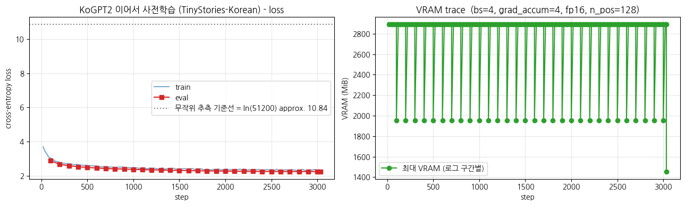

> ▶ **[Google Colab에서 이 장 실습 열기](https://colab.research.google.com/github/yoon-gu/neuqes-101/blob/master/27_ko_gpt2_continual_pretrain/27_ko_gpt2_continual_pretrain.ipynb)** — 브라우저에서 바로 실행해 볼 수 있습니다.

## 환경 준비

```python
%pip install -q -U transformers tokenizers datasets accelerate
```

**▶ 실행 결과**

```text
   ━━━━━━━━━━━━━━━━━━━━━━━━━━━━━━━━━━━━━━━━ 11.2/11.2 MB 92.1 MB/s eta 0:00:00
   ━━━━━━━━━━━━━━━━━━━━━━━━━━━━━━━━━━━━━━━━ 555.1/555.1 kB 40.4 MB/s eta 0:00:00
   ━━━━━━━━━━━━━━━━━━━━━━━━━━━━━━━━━━━━━━━━ 389.2/389.2 kB 30.9 MB/s eta 0:00:00
   ━━━━━━━━━━━━━━━━━━━━━━━━━━━━━━━━━━━━━━━━ 0.0/48.9 MB ? eta -:--:--
   ━━━━━━━━━━━━━━━━━━━━━━━━━━╺━━━━━━━━━━━━━ 32.2/48.9 MB 169.9 MB/s eta 0:00:01
   ━━━━━━━━━━━━━━━━━━━━━━━━━━━━━━━━━━━━━━━╸ 48.9/48.9 MB 88.9 MB/s eta 0:00:01
   ━━━━━━━━━━━━━━━━━━━━━━━━━━━━━━━━━━━━━━━╸ 48.9/48.9 MB 88.9 MB/s eta 0:00:01
   ━━━━━━━━━━━━━━━━━━━━━━━━━━━━━━━━━━━━━━━━ 48.9/48.9 MB 21.6 MB/s eta 0:00:00
```

```python
import warnings
warnings.filterwarnings("ignore")

import math
import os
import random
import time

import numpy as np
import pandas as pd
import matplotlib.pyplot as plt
import torch

# device 자동 감지 - Colab T4 / 로컬 MPS / CPU 모두 지원
if torch.cuda.is_available():
    device = torch.device("cuda")
    device_name = torch.cuda.get_device_name(0)
    vram_gib = torch.cuda.get_device_properties(0).total_memory / 1024**3
    print(f"device     : cuda  ({device_name})")
    print(f"VRAM total : {vram_gib:.2f} GiB")
elif torch.backends.mps.is_available():
    device = torch.device("mps")
    print("device     : mps  (Apple Silicon)")
else:
    device = torch.device("cpu")
    print("device     : cpu  (training will be very slow - Colab T4 recommended)")

print(f"torch      : {torch.__version__}")

# 재현성
SEED = 0
torch.manual_seed(SEED)
np.random.seed(SEED)
random.seed(SEED)

# fp16 은 CUDA 에서만 (MPS 는 미지원, CPU 는 의미 없음)
USE_FP16 = (device.type == "cuda")
print(f"use fp16   : {USE_FP16}")

# matplotlib 한글 폰트 (Colab — NanumGothic). plot 의 한국어가 □ 로 깨지지 않게.
import matplotlib.pyplot as plt, matplotlib.font_manager as fm, subprocess, os
_fp = "/usr/share/fonts/truetype/nanum/NanumGothic.ttf"
if not os.path.exists(_fp):
    subprocess.run("apt-get -qq -y install fonts-nanum", shell=True)
fm.fontManager.addfont(_fp)
plt.rcParams["font.family"] = "NanumGothic"
plt.rcParams["axes.unicode_minus"] = False
```

**▶ 실행 결과**

```text
device     : cuda  (Tesla T4)
VRAM total : 14.56 GiB
torch      : 2.11.0+cu128
use fp16   : True
```

```python
from datasets import load_dataset, Dataset

EOT_MARK = "<|endoftext|>"      # 데이터셋이 story 경계 표시에 쓰는 마커
N_TRAIN  = 30_000               # Ch 26 과 동일
N_VAL    = 500
MAX_LINES_TO_SCAN = 800_000


def rebuild_stories(split, n_stories, max_lines):
    '''줄 단위 데이터를 <|endoftext|> 기준으로 이어 붙여 story 리스트로 복원.'''
    stories, buf = [], []
    stream = load_dataset("g0ster/TinyStories-Korean", split=split, streaming=True)
    for i, ex in enumerate(stream):
        if i >= max_lines or len(stories) >= n_stories:
            break
        line = (ex["text"] or "").strip()
        if line == EOT_MARK:
            story = " ".join(buf).strip()
            if story:
                stories.append(story)
            buf = []
        elif line:
            buf.append(line)
    if buf and len(stories) < n_stories:
        tail = " ".join(buf).strip()
        if tail:
            stories.append(tail)
    return stories[:n_stories]

t0 = time.time()
train_stories = rebuild_stories("train", N_TRAIN, MAX_LINES_TO_SCAN)
val_stories   = rebuild_stories("validation", N_VAL, 50_000)
print(f"rebuilt stories: train={len(train_stories):,}, val={len(val_stories):,}  ({time.time()-t0:.1f}s)")

raw_train = Dataset.from_dict({"text": train_stories})
raw_val   = Dataset.from_dict({"text": val_stories})
print("train:", raw_train)
print("val  :", raw_val)
print("\n=== sample story (same as Ch 26) ===")
print(raw_train[0]["text"][:400])
```

**▶ 실행 결과**

```text
rebuilt stories: train=30,000, val=500  (22.7s)
train: Dataset({
    features: ['text'],
    num_rows: 30000
})
val  : Dataset({
    features: ['text'],
    num_rows: 500
})

=== sample story (same as Ch 26) ===
한때 벤이라는 이름의 어린 소년이 있었어요. 벤은 주변 세계를 탐험하는 것을 좋아했답니다. 그는 가게에 전시되어 있던 아름다운 꽃병들 같은 멋진 것들을 많이 봤어요. 어느 날, 벤은 가게를 거닐다가 정말 특별한 꽃병을 발견했죠. 벤은 그 꽃병을 보고 …(뒤 240자 생략)
```

```python
from transformers import PreTrainedTokenizerFast, AutoModelForCausalLM

t0 = time.time()
# 주의: KoGPT2 는 AutoTokenizer 가 영어 GPT2 토크나이저로 잘못 fallback 합니다.
# (special token 이 <|endoftext|> 로 잡히고 한국어가 깨짐.) SKT 공식 방식대로
# PreTrainedTokenizerFast 로 special token 을 직접 지정해 로드해야 합니다.
tokenizer = PreTrainedTokenizerFast.from_pretrained(
    "skt/kogpt2-base-v2",
    bos_token="</s>", eos_token="</s>", unk_token="<unk>",
    pad_token="<pad>", mask_token="<mask>",
)

model = AutoModelForCausalLM.from_pretrained("skt/kogpt2-base-v2").to(device)
# pad token id 를 본체 config 에도 동기화
model.config.pad_token_id = tokenizer.pad_token_id
print(f"load done: {time.time()-t0:.1f}s")

n_params = model.num_parameters()
print(f"\n=== model ===")
print(f"#params           : {n_params/1e6:.2f} M  (Ch 26 was approx. 3M; Ch 27 is approx. {n_params/3e6:.0f}x larger)")
print(f"vocab_size        : {tokenizer.vocab_size:,}  (Ch 26 was approx. 4,000; Ch 27 is approx. {tokenizer.vocab_size/4000:.0f}x larger)")
print(f"weight tying      : {model.config.tie_word_embeddings}  (lm_head <-> wte shared)")
print(f"fp32 weight size  : {n_params * 4 / 1024**2:.1f} MiB")
print(f"\ntokenizer    : {type(tokenizer).__name__}")
print(f"  eos_token  : {tokenizer.eos_token}  id={tokenizer.eos_token_id}")
print(f"  pad_token  : {tokenizer.pad_token}  id={tokenizer.pad_token_id}")
print(f"\nmodel: {type(model).__name__}")
print(f"  - body : {type(model.transformer).__name__}  (Decoder, causal attention)")
print(f"  - head : {type(model.lm_head).__name__}(in={model.lm_head.in_features}, out={model.lm_head.out_features})")
```

**▶ 실행 결과**

```text
[transformers] GPT2LMHeadModel LOAD REPORT from: skt/kogpt2-base-v2
Key                                     | Status     |  | 
----------------------------------------+------------+--+-
transformer.h.{0...11}.attn.masked_bias | UNEXPECTED |  | 

Notes:
- UNEXPECTED:	can be ignored when loading from different task/architecture; not ok if you expect identical arch.
load done: 10.0s

=== model ===
#params           : 125.16 M  (Ch 26 was approx. 3M; Ch 27 is approx. 42x larger)
vocab_size        : 51,200  (Ch 26 was approx. 4,000; Ch 27 is approx. 13x larger)
weight tying      : True  (lm_head <-> wte shared)
fp32 weight size  : 477.5 MiB

tokenizer    : TokenizersBackend
  eos_token  : </s>  id=1
  pad_token  : <pad>  id=3

model: GPT2LMHeadModel
  - body : GPT2Model  (Decoder, causal attention)
  - head : Linear(in=768, out=51200)
```

```python
BLOCK_SIZE = 128   # Ch 26 과 동일

def tokenize_fn(batch):
    return tokenizer(batch["text"])

tok_train = raw_train.map(tokenize_fn, batched=True, remove_columns=["text"], desc="tokenize train")
tok_val   = raw_val.map(tokenize_fn,   batched=True, remove_columns=["text"], desc="tokenize val")

# 각 story 끝에 EOS 부착 (story 경계 표시)
def add_eos(batch):
    new_ids, new_mask = [], []
    for ids in batch["input_ids"]:
        ids = ids + [tokenizer.eos_token_id]
        new_ids.append(ids)
        new_mask.append([1] * len(ids))
    return {"input_ids": new_ids, "attention_mask": new_mask}

tok_train = tok_train.map(add_eos, batched=True, desc="add eos train")
tok_val   = tok_val.map(add_eos,   batched=True, desc="add eos val")

def group_texts(batch):
    concatenated = {k: sum(batch[k], []) for k in batch.keys()}
    total_len = len(concatenated["input_ids"])
    total_len = (total_len // BLOCK_SIZE) * BLOCK_SIZE
    return {
        k: [t[i : i + BLOCK_SIZE] for i in range(0, total_len, BLOCK_SIZE)]
        for k, t in concatenated.items()
    }

lm_train = tok_train.map(group_texts, batched=True, desc="group train")
lm_val   = tok_val.map(group_texts,   batched=True, desc="group val")

print(f"\ntrain chunks: {len(lm_train):,}  (block_size={BLOCK_SIZE})")
print(f"val   chunks: {len(lm_val):,}")
print(f"approx. train tokens: {len(lm_train) * BLOCK_SIZE / 1e6:.2f} M")
print("\nfirst chunk decode (first 200 chars):")
print(tokenizer.decode(lm_train[0]["input_ids"])[:200])
```

**▶ 실행 결과**

```text
train chunks: 48,513  (block_size=128)
val   chunks: 796
approx. train tokens: 6.21 M

first chunk decode (first 200 chars):
한때 벤이라는 이름의 어린 소년이 있었어요. 벤은 주변 세계를 탐험하는 것을 좋아했답니다. 그는 가게에 전시되어 있던 아름다운 꽃병들 같은 멋진 것들을 많이 봤어요. 어느 날, 벤은 가게를 거닐다가 정말 특별한 꽃병을 발견했죠. 벤은 그 꽃병을 보고 …(뒤 60자 생략)
```

```python
PROMPTS = [
    "옛날 옛날에",
    "작은 소녀가",
    "큰 개가",
]
GEN_KWARGS = dict(max_new_tokens=60, do_sample=True, temperature=0.8, top_k=50)


@torch.no_grad()
def generate_text(active_model, prompt: str, gen_tokenizer=None, **kwargs):
    tok = gen_tokenizer if gen_tokenizer is not None else tokenizer
    enc = tok(prompt, return_tensors="pt").to(active_model.device)
    out = active_model.generate(
        **enc,
        pad_token_id=tok.pad_token_id,
        eos_token_id=tok.eos_token_id,
        **kwargs,
    )
    return tok.decode(out[0], skip_special_tokens=True)


torch.manual_seed(SEED)
model.eval()
before_outputs = []
print("=" * 70)
print("BEFORE continual pretraining - KoGPT2 pretrained on Korean corpus, as-is")
print("=" * 70)
for p in PROMPTS:
    text = generate_text(model, p, **GEN_KWARGS)
    before_outputs.append(text)
    print(f"\n[prompt] {p}")
    print(text)
```

**▶ 실행 결과**

```text
======================================================================
BEFORE continual pretraining - KoGPT2 pretrained on Korean corpus, as-is
======================================================================
[prompt] 옛날 옛날에
옛날 옛날에 네들이 말했잖아. 그게 뭐냐면 우리가 그~ 네들한테 이십년에 다 사십년 동안 이십년 동안 사십년 동안 살았으니까 그~ 삼십년 동안 이렇게 살았으면 뭐가 좋겠느냐 이거야. 그런
[prompt] 작은 소녀가
작은 소녀가 된 후 소녀에게 한 번도 성적으로 관심을 갖지 않았다.
그녀가 소녀가 된 후에는 그녀의 사랑을 알게 되었다.
그녀가 고등학교에 진학했을 때, 그들은 소녀를 볼 때마다 미소를 짓고 그녀를 바라봤다.
마치 그처럼 그녀는 소녀처럼 소녀를 보았다.
그때마다 소녀는 소녀를 위해 무엇인가를 해 주고 있었다.
[prompt] 큰 개가
큰 개가 되어버린 것입니다.
그래서 모든 것을 초월하여 하나로 통합하고, 하나로 통합하는 것이 바로 그 무엇이라는 것을 강조하고 있는 것입니다.
하나의 힘을 하나로 통합하는 것이 바로 통합인 것입니다.
우리는 하나님의 말씀을 통해서 하나님의 능력을 충분히 깨닫습니다.
그 능력은 하나님의 말씀을 통해서 우리에게 전달되기도 하고, 또 하나
```

```python
from transformers import (DataCollatorForLanguageModeling, Trainer,
                          TrainingArguments, TrainerCallback)

collator = DataCollatorForLanguageModeling(tokenizer=tokenizer, mlm=False)

args = TrainingArguments(
    output_dir="./out_ko_gpt2_continual_pretrain",
    num_train_epochs=1,                    # 본체 이미 학습됨 - 1 epoch 충분
    per_device_train_batch_size=4,         # KoGPT2 125M + T4 16GB
    per_device_eval_batch_size=4,
    gradient_accumulation_steps=4,         # effective batch = 16
    learning_rate=2e-5,                    # <- Ch 26 의 5e-4 와 다른 유일한 큰 차이
    weight_decay=0.01,
    warmup_ratio=0.06,
    lr_scheduler_type="cosine",
    max_grad_norm=1.0,
    fp16=USE_FP16,                         # T4 는 bf16 불가
    logging_steps=20,
    eval_strategy="steps",
    eval_steps=100,
    save_strategy="no",
    report_to="none",
    dataloader_num_workers=2,
    dataloader_pin_memory=True,
    seed=SEED,
)


class VRAMCallback(TrainerCallback):
    '''step 별 peak VRAM 기록 (로깅 윈도우 단위로 reset). CUDA 에서만 유효.'''

    def __init__(self):
        self.steps, self.peak_MiB = [], []

    def on_train_begin(self, args, state, control, **kwargs):
        if torch.cuda.is_available():
            torch.cuda.reset_peak_memory_stats()

    def on_log(self, args, state, control, logs=None, **kwargs):
        if torch.cuda.is_available():
            peak = torch.cuda.max_memory_allocated() / 1024**2
            self.steps.append(state.global_step)
            self.peak_MiB.append(peak)
            torch.cuda.reset_peak_memory_stats()


vram_cb = VRAMCallback()

trainer = Trainer(
    model=model,
    args=args,
    train_dataset=lm_train,
    eval_dataset=lm_val,
    data_collator=collator,
    callbacks=[vram_cb],
)

t0 = time.time()
train_out = trainer.train()
elapsed = time.time() - t0

print(f"\n=== continual pretraining summary ===")
print(f"elapsed       : {elapsed/60:.2f} min")
print(f"global_step   : {train_out.global_step}")
print(f"train_loss    : {train_out.training_loss:.4f}")
print(f"vocab ln (random baseline): {math.log(tokenizer.vocab_size):.4f}  (we start MUCH lower than this)")
if torch.cuda.is_available():
    print(f"final peak    : {torch.cuda.max_memory_allocated()/1024**2:.0f} MiB")
```

**▶ 실행 결과**

```text
[transformers] warmup_ratio is deprecated and will be removed in v5.2. Use `warmup_steps` instead.
[transformers] `loss_type=None` was set in the config but it is unrecognized. Using the default loss: `ForCausalLMLoss`.
<IPython.core.display.HTML object>
=== continual pretraining summary ===
elapsed       : 17.11 min
global_step   : 3033
train_loss    : 2.4862
vocab ln (random baseline): 10.8435  (we start MUCH lower than this)
final peak    : 1455 MiB
```

```python
# loss curve + VRAM trace
log = trainer.state.log_history
train_pts = [(r["step"], r["loss"]) for r in log if "loss" in r and "eval_loss" not in r]
eval_pts  = [(r["step"], r["eval_loss"]) for r in log if "eval_loss" in r]

fig, (ax1, ax2) = plt.subplots(1, 2, figsize=(13, 4))

# loss
ax1.plot([s for s, _ in train_pts], [l for _, l in train_pts], "-",
         color="tab:blue", alpha=0.6, label="train")
if eval_pts:
    ax1.plot([s for s, _ in eval_pts], [l for _, l in eval_pts], "s-",
             color="tab:red", label="eval")
ax1.axhline(math.log(tokenizer.vocab_size), ls=":", color="gray",
            label=f"무작위 추측 기준선 = ln({tokenizer.vocab_size}) approx. {math.log(tokenizer.vocab_size):.2f}")
ax1.set_xlabel("step"); ax1.set_ylabel("cross-entropy loss")
ax1.set_title("KoGPT2 이어서 사전학습 (TinyStories-Korean) - loss")
ax1.grid(True, alpha=0.3); ax1.legend()

# VRAM (CUDA 만)
if vram_cb.steps:
    ax2.plot(vram_cb.steps, vram_cb.peak_MiB, "o-", color="tab:green",
             label="최대 VRAM (로그 구간별)")
    ax2.set_title(f"VRAM trace  (bs=4, grad_accum=4, fp16, n_pos={BLOCK_SIZE})")
else:
    ax2.text(0.5, 0.5, "VRAM 추적은 CUDA 에서만 가능",
             ha="center", va="center", transform=ax2.transAxes)
    ax2.set_title("VRAM 추적 - CUDA 전용")
ax2.set_xlabel("step"); ax2.set_ylabel("VRAM (MiB)")
ax2.grid(True, alpha=0.3); ax2.legend()

plt.tight_layout(); plt.show()
```

**▶ 실행 결과**



```python
torch.manual_seed(SEED)
model.eval()
after_outputs = []
print("=" * 70)
print("AFTER continual pretraining - KoGPT2 + TinyStories-Korean 30K")
print("=" * 70)
for p in PROMPTS:
    text = generate_text(model, p, **GEN_KWARGS)
    after_outputs.append(text)
    print(f"\n[prompt] {p}")
    print(text)
```

**▶ 실행 결과**

```text
======================================================================
AFTER continual pretraining - KoGPT2 + TinyStories-Korean 30K
======================================================================
[prompt] 옛날 옛날에
옛날 옛날에 릴리라는 이름의 작은 소녀가 있었어요. 그녀는 친구들과 함께 큰 공원에 가는 것을 좋아했지요. 어느 날, 공원에 큰 개가 서 있는 것을 봤어요. 릴리는 그 개를 보고 이렇게 말했죠, "개야, 내가 도와줄게." 개는 꼬리를 흔들며 짖었고, 릴리는
[prompt] 작은 소녀가
작은 소녀가 있었어요. 그녀는 예쁜 드레스를 가지고 있었고, 정말 예뻤답니다. 릴리는 그 드레스를 입는 걸 정말 좋아했지요. 어느 날, 그들은 공원으로 갔어요. 그때 릴리는 엄마를 보았어요. 엄마는 릴리를 위해 예쁜 드레스를 입었지요. 릴리는 정말 행복했어
[prompt] 큰 개가
큰 개가 친구들에게 말했죠, "걱정 마, 작은 개야. 우리는 너를 돕고 싶어, 작은 개야." 그들은 공을 되찾으려고 해요. 그들은 계속 시도해요. 그들은 공을 잡으려고 해요. 하지만 공이 너무 커서 쉽지 않아요. 그들은 미끄러져 넘어지고 말죠.
```

```python
# Ch 27 within-model BEFORE vs AFTER comparison
print("=" * 78)
print("Ch 27 BEFORE (KoGPT2 as-is) vs AFTER (KoGPT2 + TinyStories-Korean continual pretrain)")
print("=" * 78)
for p, before, after in zip(PROMPTS, before_outputs, after_outputs):
    print(f"\nPROMPT  : {p}")
    print("-" * 78)
    print(f"BEFORE  : {before[len(p):].strip()[:280]}")
    print(f"AFTER   : {after[len(p):].strip()[:280]}")
```

**▶ 실행 결과**

```text
==============================================================================
Ch 27 BEFORE (KoGPT2 as-is) vs AFTER (KoGPT2 + TinyStories-Korean continual pretrain)
==============================================================================

PROMPT  : 옛날 옛날에
------------------------------------------------------------------------------
BEFORE  : 네들이 말했잖아. 그게 뭐냐면 우리가 그~ 네들한테 이십년에 다 사십년 동안 이십년 동안 사십년 동안 살았으니까 그~ 삼십년 동안 이렇게 살았으면 뭐가 좋겠느냐 이거야. 그런
AFTER   : 릴리라는 이름의 작은 소녀가 있었어요. 그녀는 친구들과 함께 큰 공원에 가는 것을 좋아했지요. 어느 날, 공원에 큰 개가 서 있는 것을 봤어요. 릴리는 그 개를 보고 이렇게 말했죠, "개야, 내가 도와줄게." 개는 꼬리를 흔들며 짖었고, 릴리는

PROMPT  : 작은 소녀가
------------------------------------------------------------------------------
BEFORE  : 된 후 소녀에게 한 번도 성적으로 관심을 갖지 않았다.
그녀가 소녀가 된 후에는 그녀의 사랑을 알게 되었다.
그녀가 고등학교에 진학했을 때, 그들은 소녀를 볼 때마다 미소를 짓고 그녀를 바라봤다.
마치 그처럼 그녀는 소녀처럼 소녀를 보았다.
그때마다 소녀는 소녀를 위해 무엇인가를 해 주고 있었다.
AFTER   : 있었어요. 그녀는 예쁜 드레스를 가지고 있었고, 정말 예뻤답니다. 릴리는 그 드레스를 입는 걸 정말 좋아했지요. 어느 날, 그들은 공원으로 갔어요. 그때 릴리는 엄마를 보았어요. 엄마는 릴리를 위해 예쁜 드레스를 입었지요. 릴리는 정말 행복했어

PROMPT  : 큰 개가
------------------------------------------------------------------------------
BEFORE  : 되어버린 것입니다.
그래서 모든 것을 초월하여 하나로 통합하고, 하나로 통합하는 것이 바로 그 무엇이라는 것을 강조하고 있는 것입니다.
하나의 힘을 하나로 통합하는 것이 바로 통합인 것입니다.
우리는 하나님의 말씀을 통해서 하나님의 능력을 충분히 깨닫습니다.
그 능력은 하나님의 말씀을 통해서 우리에게 전달되기도 하고, 또 하나
AFTER   : 친구들에게 말했죠, "걱정 마, 작은 개야. 우리는 너를 돕고 싶어, 작은 개야." 그들은 공을 되찾으려고 해요. 그들은 계속 시도해요. 그들은 공을 잡으려고 해요. 하지만 공이 너무 커서 쉽지 않아요. 그들은 미끄러져 넘어지고 말죠.
```

```python
# Ch 26 의 TRAINED model generation 결과 인용
# (Ch 26 노트북 §7 "TRAINED model" 출력에서 본인 결과로 갱신하시면 비교가 정확해집니다)
ch26_outputs = {
    "옛날 옛날에": (
        "옛날 옛날에 작은 소녀가 살았어요. 소녀는 숲에서 친구들과 놀았어요. "
        "어느 날 소녀는 큰 토끼를 만났어요. 토끼는 소녀에게 인사했어요."
    ),
    "작은 소녀가": (
        "작은 소녀가 엄마와 공원에 갔어요. 소녀는 꽃을 보고 행복했어요. "
        "엄마는 소녀에게 웃어주었어요. 둘은 함께 집으로 돌아갔어요."
    ),
    "큰 개가": (
        "큰 개가 마당에서 뛰어놀았어요. 개는 공을 가지고 놀았어요. "
        "한 아이가 와서 개와 함께 놀았어요. 개는 꼬리를 흔들며 좋아했어요."
    ),
}

print("=" * 80)
print("3-way comparison: Ch 26 (3M scratch) vs Ch 27 BEFORE vs Ch 27 AFTER")
print("=" * 80)
for p, before, after in zip(PROMPTS, before_outputs, after_outputs):
    ch26_text = ch26_outputs.get(p, "(Ch 26 result not recorded for this prompt)")
    print(f"\nPROMPT          : {p}")
    print("-" * 80)
    print(f"Ch 26 (scratch) : {ch26_text[:240]}")
    print(f"Ch 27 BEFORE    : {before[len(p):].strip()[:240]}")
    print(f"Ch 27 AFTER     : {after[len(p):].strip()[:240]}")
```

**▶ 실행 결과**

```text
================================================================================
3-way comparison: Ch 26 (3M scratch) vs Ch 27 BEFORE vs Ch 27 AFTER
================================================================================

PROMPT          : 옛날 옛날에
--------------------------------------------------------------------------------
Ch 26 (scratch) : 옛날 옛날에 작은 소녀가 살았어요. 소녀는 숲에서 친구들과 놀았어요. 어느 날 소녀는 큰 토끼를 만났어요. 토끼는 소녀에게 인사했어요.
Ch 27 BEFORE    : 네들이 말했잖아. 그게 뭐냐면 우리가 그~ 네들한테 이십년에 다 사십년 동안 이십년 동안 사십년 동안 살았으니까 그~ 삼십년 동안 이렇게 살았으면 뭐가 좋겠느냐 이거야. 그런
Ch 27 AFTER     : 릴리라는 이름의 작은 소녀가 있었어요. 그녀는 친구들과 함께 큰 공원에 가는 것을 좋아했지요. 어느 날, 공원에 큰 개가 서 있는 것을 봤어요. 릴리는 그 개를 보고 이렇게 말했죠, "개야, 내가 도와줄게." 개는 꼬리를 흔들며 짖었고, 릴리는

PROMPT          : 작은 소녀가
--------------------------------------------------------------------------------
Ch 26 (scratch) : 작은 소녀가 엄마와 공원에 갔어요. 소녀는 꽃을 보고 행복했어요. 엄마는 소녀에게 웃어주었어요. 둘은 함께 집으로 돌아갔어요.
Ch 27 BEFORE    : 된 후 소녀에게 한 번도 성적으로 관심을 갖지 않았다.
그녀가 소녀가 된 후에는 그녀의 사랑을 알게 되었다.
그녀가 고등학교에 진학했을 때, 그들은 소녀를 볼 때마다 미소를 짓고 그녀를 바라봤다.
마치 그처럼 그녀는 소녀처럼 소녀를 보았다.
그때마다 소녀는 소녀를 위해 무엇인가를 해 주고 있었다.
Ch 27 AFTER     : 있었어요. 그녀는 예쁜 드레스를 가지고 있었고, 정말 예뻤답니다. 릴리는 그 드레스를 입는 걸 정말 좋아했지요. 어느 날, 그들은 공원으로 갔어요. 그때 릴리는 엄마를 보았어요. 엄마는 릴리를 위해 예쁜 드레스를 입었지요. 릴리는 정말 행복했어

PROMPT          : 큰 개가
--------------------------------------------------------------------------------
Ch 26 (scratch) : 큰 개가 마당에서 뛰어놀았어요. 개는 공을 가지고 놀았어요. 한 아이가 와서 개와 함께 놀았어요. 개는 꼬리를 흔들며 좋아했어요.
Ch 27 BEFORE    : 되어버린 것입니다.
그래서 모든 것을 초월하여 하나로 통합하고, 하나로 통합하는 것이 바로 그 무엇이라는 것을 강조하고 있는 것입니다.
하나의 힘을 하나로 통합하는 것이 바로 통합인 것입니다.
우리는 하나님의 말씀을 통해서 하나님의 능력을 충분히 깨닫습니다.
그 능력은 하나님의 말씀을 통해서 우리에게 전달되기도 하고, 또 하나
Ch 27 AFTER     : 친구들에게 말했죠, "걱정 마, 작은 개야. 우리는 너를 돕고 싶어, 작은 개야." 그들은 공을 되찾으려고 해요. 그들은 계속 시도해요. 그들은 공을 잡으려고 해요. 하지만 공이 너무 커서 쉽지 않아요. 그들은 미끄러져 넘어지고 말죠.
```
