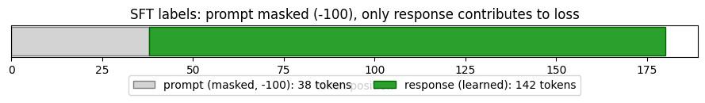
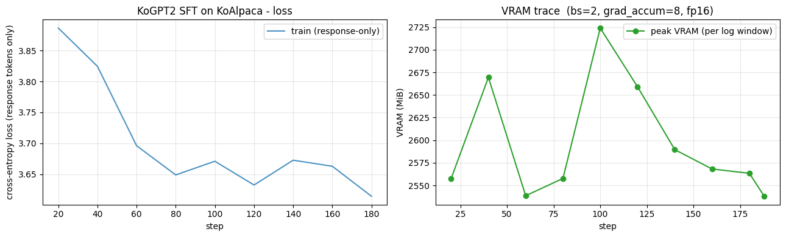

> ▶ **[Google Colab에서 이 장 실습 열기](https://colab.research.google.com/github/yoon-gu/neuqes-101/blob/master/28_sft/28_sft.ipynb)** — 브라우저에서 바로 실행해 볼 수 있습니다.

## 환경 준비

```python
%pip install -q -U trl transformers tokenizers datasets accelerate
```

**▶ 실행 결과**

```text
   ━━━━━━━━━━━━━━━━━━━━━━━━━━━━━━━━━━━━━━━━ 825.1/825.1 kB 22.3 MB/s eta 0:00:00
   ━━━━━━━━━━━━━━━━━━━━━━━━━━━━━━━━━━━━━━━╸ 11.1/11.2 MB 198.4 MB/s eta 0:00:01
   ━━━━━━━━━━━━━━━━━━━━━━━━━━━━━━━━━━━━━━━━ 11.2/11.2 MB 111.5 MB/s eta 0:00:00
   ━━━━━━━━━━━━━━━━━━━━━━━━━━━━━━━━━━━━━━━━ 555.1/555.1 kB 49.5 MB/s eta 0:00:00
   ━━━━━━━━━━━━━━━━━━━━━━━━━━━━━━━━━━━━━━━━ 389.2/389.2 kB 38.0 MB/s eta 0:00:00
   ━━━━━━━━━━━━━━━╸━━━━━━━━━━━━━━━━━━━━━━━━ 19.0/48.9 MB 232.1 MB/s eta 0:00:01
   ━━━━━━━━━━━━━━━━━━━━━━━━━━━━━━━━━━━━━━━╸ 48.9/48.9 MB 155.5 MB/s eta 0:00:01
   ━━━━━━━━━━━━━━━━━━━━━━━━━━━━━━━━━━━━━━━╸ 48.9/48.9 MB 155.5 MB/s eta 0:00:01
   ━━━━━━━━━━━━━━━━━━━━━━━━━━━━━━━━━━━━━━━╸ 48.9/48.9 MB 155.5 MB/s eta 0:00:01
   ━━━━━━━━━━━━━━━━━━━━━━━━━━━━━━━━━━━━━━━━ 48.9/48.9 MB 16.1 MB/s eta 0:00:00
```

```python
import warnings
warnings.filterwarnings("ignore")

import math
import os
import random
import time

import numpy as np
import pandas as pd
import matplotlib.pyplot as plt
import torch

import trl
print(f"trl          : {trl.__version__}")

# device 자동 감지 - Colab T4 / 로컬 MPS / CPU 모두 지원
if torch.cuda.is_available():
    device = torch.device("cuda")
    device_name = torch.cuda.get_device_name(0)
    vram_gib = torch.cuda.get_device_properties(0).total_memory / 1024**3
    print(f"device       : cuda  ({device_name})")
    print(f"VRAM total   : {vram_gib:.2f} GiB")
elif torch.backends.mps.is_available():
    device = torch.device("mps")
    print("device       : mps  (Apple Silicon)")
else:
    device = torch.device("cpu")
    print("device       : cpu  (training will be very slow - Colab T4 recommended)")

print(f"torch        : {torch.__version__}")

# 재현성
SEED = 0
torch.manual_seed(SEED)
np.random.seed(SEED)
random.seed(SEED)

# fp16 은 CUDA 에서만 (MPS 는 미지원, CPU 는 의미 없음)
USE_FP16 = (device.type == "cuda")
print(f"use fp16     : {USE_FP16}")

# matplotlib 한글 폰트 (Colab — NanumGothic). plot 의 한국어가 □ 로 깨지지 않게.
import matplotlib.pyplot as plt, matplotlib.font_manager as fm, subprocess, os
_fp = "/usr/share/fonts/truetype/nanum/NanumGothic.ttf"
if not os.path.exists(_fp):
    subprocess.run("apt-get -qq -y install fonts-nanum", shell=True)
fm.fontManager.addfont(_fp)
plt.rcParams["font.family"] = "NanumGothic"
plt.rcParams["axes.unicode_minus"] = False
```

**▶ 실행 결과**

```text
trl          : 1.6.0
device       : cuda  (Tesla T4)
VRAM total   : 14.56 GiB
torch        : 2.11.0+cu128
use fp16     : True
```

KoAlpaca 데이터셋을 불러와 instruction-response 쌍의 구조를 먼저 눈으로 확인합니다. 빈 샘플을 거른 뒤 3,000 개만 추려 T4 + 30분 룰 안에서 학습할 수 있게 줄이는데, `MAX_CHARS` 로 답변 길이를 통제해 평균 시퀀스 길이가 들쭉날쭉해지지 않도록 잡아 둡니다.

```python
from datasets import load_dataset

N_SFT = 3000          # T4 + 30분 룰 - subset
MAX_CHARS = 600       # 너무 긴 답변은 잘라 평균 길이 통제 (학습 안정 + 속도)

raw = load_dataset("beomi/KoAlpaca-v1.1a", split="train")
print("raw dataset:", raw)
print("\nfields:", raw.column_names)
print("\n=== sample 0 ===")
ex0 = raw[0]
print("instruction:", ex0["instruction"][:200])
print("output     :", ex0["output"][:200])

# instruction / output 모두 비어있지 않은 샘플만, 길이 통제 후 subset
def keep(ex):
    return bool(ex["instruction"].strip()) and bool(ex["output"].strip())

raw = raw.filter(keep)
raw = raw.shuffle(seed=SEED).select(range(min(N_SFT, len(raw))))
print(f"\nafter filter + subset: {len(raw):,} samples")
```

**▶ 실행 결과**

```text
raw dataset: Dataset({
    features: ['instruction', 'output', 'url'],
    num_rows: 21155
})

fields: ['instruction', 'output', 'url']

=== sample 0 ===
instruction: 양파는 어떤 식물 부위인가요? 그리고 고구마는 뿌리인가요?
output     : 양파는 잎이 아닌 식물의 줄기 부분입니다. 고구마는 식물의 뿌리 부분입니다. 

식물의 부위의 구분에 대해 궁금해하는 분이라면 분명 이 질문에 대한 답을 찾고 있을 것입니다. 양파는 잎이 아닌 줄기 부분입니다. 고구마는 다른 질문과 답변에서 언급된 것과 같이 뿌리 부분입니다. 따라서, 양파는 식물의 줄기 부분이 되고, 고구마는 식물의 뿌리 부분입니다.
after filter + subset: 3,000 samples
```

**결과 해석**

원본 KoAlpaca 는 21,155 행이지만 필터 + subset 으로 정확히 3,000 샘플만 남았습니다. sample 0 처럼 각 행이 `instruction` (지시) 과 `output` (응답) 한 쌍으로 이뤄져 있어, 이 형식 자체가 Ch 27 의 연속 텍스트와 갈라지는 첫 변경점입니다.

`### 응답:\n` 를 response_template 로 고정하고, instruction 을 그 앞 prompt 에, output 을 그 뒤 completion 에 배치하는 포맷 함수를 정의합니다. response_template 까지를 prompt 에 포함시키는 것이 핵심으로, collator 가 이 경계를 기준으로 답변 시작점을 잡기 때문입니다.

```python
RESPONSE_TEMPLATE = "### 응답:\n"   # 이 뒤부터가 '답변' (학습 대상)


def build_prompt(instruction: str) -> str:
    '''KoGPT2 용 instruction 포맷. RESPONSE_TEMPLATE 로 끝나 답변 경계를 명시.'''
    return f"### 명령어:\n{instruction}\n\n{RESPONSE_TEMPLATE}"


def to_prompt_completion(ex):
    output = ex["output"].strip()
    if len(output) > MAX_CHARS:
        output = output[:MAX_CHARS]
    return {
        "prompt": build_prompt(ex["instruction"].strip()),
        "completion": output,
    }


sft_ds = raw.map(to_prompt_completion, remove_columns=raw.column_names, desc="format")
print("formatted dataset:", sft_ds)
print("\n=== formatted sample 0 ===")
print("--- prompt ---")
print(sft_ds[0]["prompt"])
print("--- completion ---")
print(sft_ds[0]["completion"][:200])
```

**▶ 실행 결과**

```text
formatted dataset: Dataset({
    features: ['prompt', 'completion'],
    num_rows: 3000
})

=== formatted sample 0 ===
--- prompt ---
### 명령어:
나무가 말라 죽을 때 왜 속부터 썩는 걸까요? 그리고, 나무 속에 전선을 넣을 수 있는 방법이 있을까요?

### 응답:

--- completion ---
나무 내부에 있는 심재는 죽은 세포들로 이루어져 있습니다. 이 부분은 변재와는 달리 생명력이 없기 때문에 균에 저항력이 떨어져 있습니다. 그래서 변재와는 달리 균에 대항하기 어렵습니다. 일단 균이 침입해서 번져나가면, 막을 수 있는 방법이 없어서 썩어 …(뒤 60자 생략)
```

**결과 해석**

데이터셋이 `prompt` / `completion` 두 컬럼으로 재편됐고, prompt 가 `### 응답:\n` 으로 정확히 끝나는 것을 sample 0 출력에서 볼 수 있습니다. 이 두 컬럼 형식은 뒤에서 `SFTTrainer` 가 completion 부분만 자동으로 학습 대상으로 잡게 하는 입력 규약입니다.

KoGPT2 본체와 토크나이저를 Ch 27 과 같은 방식으로 로드합니다. KoGPT2 는 `AutoTokenizer` 가 영어 GPT2 토크나이저로 잘못 fallback 하는 함정이 있어, `PreTrainedTokenizerFast` 로 special token 을 직접 지정해 불러오고 encode → decode 왕복으로 한국어가 깨지지 않는지 한 줄 검증합니다.

```python
from transformers import PreTrainedTokenizerFast, AutoModelForCausalLM

t0 = time.time()
# 주의: KoGPT2 는 AutoTokenizer 가 영어 GPT2 토크나이저로 잘못 fallback 합니다.
# SKT 공식 방식대로 PreTrainedTokenizerFast 로 special token 을 직접 지정해 로드.
tokenizer = PreTrainedTokenizerFast.from_pretrained(
    "skt/kogpt2-base-v2",
    bos_token="</s>", eos_token="</s>", unk_token="<unk>",
    pad_token="<pad>", mask_token="<mask>",
)

model = AutoModelForCausalLM.from_pretrained("skt/kogpt2-base-v2").to(device)
model.config.pad_token_id = tokenizer.pad_token_id
print(f"load done: {time.time()-t0:.1f}s")

# encode -> decode 왕복 검증 (한국어 깨짐 방지)
probe = "옛날 옛날에 작은 소녀가"
roundtrip = tokenizer.decode(tokenizer(probe)["input_ids"])
print(f"\nroundtrip check: {roundtrip!r}  ({'OK' if roundtrip == probe else 'BROKEN'})")

n_params = model.num_parameters()
print(f"\n=== model ===")
print(f"#params      : {n_params/1e6:.2f} M  (same body as Ch 27)")
print(f"vocab_size   : {tokenizer.vocab_size:,}")
print(f"tokenizer    : {type(tokenizer).__name__}")
print(f"  eos_token  : {tokenizer.eos_token}  id={tokenizer.eos_token_id}")
print(f"  pad_token  : {tokenizer.pad_token}  id={tokenizer.pad_token_id}")
```

**▶ 실행 결과**

```text
[transformers] GPT2LMHeadModel LOAD REPORT from: skt/kogpt2-base-v2
Key                                     | Status     |  | 
----------------------------------------+------------+--+-
transformer.h.{0...11}.attn.masked_bias | UNEXPECTED |  | 

Notes:
- UNEXPECTED:	can be ignored when loading from different task/architecture; not ok if you expect identical arch.
load done: 7.2s

roundtrip check: '옛날 옛날에 작은 소녀가'  (OK)

=== model ===
#params      : 125.16 M  (same body as Ch 27)
vocab_size   : 51,200
tokenizer    : TokenizersBackend
  eos_token  : </s>  id=1
  pad_token  : <pad>  id=3
```

**결과 해석**

roundtrip check 가 `OK` 로 나와 한국어가 토큰화·복원 과정에서 깨지지 않음을 확인했고, 파라미터 수 125.16M·vocab 51,200 으로 Ch 27 과 완전히 같은 본체임이 드러납니다. 즉 바뀐 것은 본체가 아니라 데이터 형식과 마스킹 자리뿐입니다.

여기가 이 챕터의 클라이맥스입니다. 한 샘플을 prompt / completion 으로 직접 토큰화해 이어 붙이고 `completion_mask` (0 = prompt, 1 = 답변) 를 만든 뒤, `trl` 의 SFT collator 가 prompt 부분을 전부 `-100` 으로 덮는 과정을 눈으로 따라갑니다. 답변 끝에 EOS 를 붙이는 것이 `SFTTrainer` 내부 절차와 같다는 점도 함께 봅니다.

```python
# trl 1.x 의 SFT collator. 버전마다 위치가 다를 수 있어 폴백 import.
try:
    from trl.trainer.sft_trainer import DataCollatorForLanguageModeling as SFTCollator
except Exception:
    from trl import DataCollatorForLanguageModeling as SFTCollator  # 일부 버전
```

**위 코드 읽기** — `trl` 은 버전마다 SFT collator 의 위치·이름이 달라지는 라이브러리라, `trl.trainer.sft_trainer` 경로를 먼저 시도하고 실패하면 `trl` 최상위에서 가져오는 폴백을 둡니다. 어느 쪽이든 `SFTCollator` 라는 같은 이름으로 묶어 이후 코드가 버전에 무관하게 동작합니다.

```python
# 한 샘플을 prompt / completion 으로 직접 토큰화 (SFTTrainer 내부와 같은 절차)
sample = sft_ds[0]
prompt_text = sample["prompt"]
completion_text = sample["completion"]

p_ids = tokenizer(prompt_text, add_special_tokens=False)["input_ids"]
c_ids = tokenizer(completion_text, add_special_tokens=False)["input_ids"]
c_ids = c_ids + [tokenizer.eos_token_id]   # SFTTrainer 는 답변 끝에 EOS 부착
```

**위 코드 읽기** — prompt 와 completion 을 각각 토큰화하는데, `### 명령어:` 머리표나 `</s>` 가 중복 삽입되지 않도록 `add_special_tokens=False` 로 둡니다. completion 쪽에는 답변의 끝을 모델에 가르치기 위해 `eos_token_id` 를 직접 덧붙이는데, 이는 `SFTTrainer` 가 내부에서 하는 일을 손으로 재현한 것입니다.

```python
input_ids = p_ids + c_ids
completion_mask = [0] * len(p_ids) + [1] * len(c_ids)   # 0 = prompt, 1 = 답변

print(f"prompt tokens     : {len(p_ids)}")
print(f"completion tokens : {len(c_ids)}  (incl. EOS)")
print(f"total tokens      : {len(input_ids)}")
```

**위 코드 읽기** — prompt 토큰과 completion 토큰을 한 줄로 이어 붙이고, 같은 길이의 `completion_mask` 를 prompt 자리에는 0, 답변 자리에는 1 로 만듭니다. 이 마스크가 바로 다음 단계에서 어느 위치를 `-100` 으로 가릴지 결정하는 기준이 됩니다.

```python
# collator 적용 - prompt 부분이 -100 으로 마스킹됨
collator = SFTCollator(pad_token_id=tokenizer.pad_token_id, completion_only_loss=True)
batch = collator([{"input_ids": input_ids, "completion_mask": completion_mask}])
labels = batch["labels"][0].tolist()
ids = batch["input_ids"][0].tolist()

n_learn = sum(1 for l in labels if l != -100)
print(f"\nlabels learned    : {n_learn} / {len(labels)}  (prompt masked = {len(labels) - n_learn})")
```

**위 코드 읽기** — `completion_only_loss=True` 로 만든 collator 에 위 샘플을 넣으면, `completion_mask == 0` 인 prompt 자리가 모두 `-100` 으로 덮인 `labels` 가 돌아옵니다. `-100` 이 아닌 라벨 개수를 세어 보면 실제로 답변 토큰만 학습 대상으로 남았는지 숫자로 확인할 수 있습니다.

**▶ 실행 결과**

```text
prompt tokens     : 38
completion tokens : 142  (incl. EOS)
total tokens      : 180

labels learned    : 142 / 180  (prompt masked = 38)
```

**결과 해석**

총 180 토큰 중 prompt 38 개가 전부 `-100` 으로 가려지고 답변 142 개만 학습 대상으로 남았습니다. 곧 한 줄 `labels[:prompt_len] = -100` 의 효과가 실제 숫자로 확인된 것으로, 모델은 질문을 외우지 않고 답변 생성만 학습합니다.

이번에는 가려짐을 토큰 단위로 펼쳐 봅니다. 위치별로 토큰 문자열·input_id·label·학습 여부를 한 표로 묶어, prompt 구간이 줄줄이 `-100` 으로 표시되는 모습을 직접 읽습니다.

```python
# 토큰별 표 - position | token | input_id | label | learn?
rows = []
for i, (tid, lab) in enumerate(zip(ids, labels)):
    rows.append({
        "pos": i,
        "token": repr(tokenizer.decode([tid])),
        "input_id": tid,
        "label": lab,
        "learn?": "Y (response)" if lab != -100 else "- (prompt, -100)",
    })
label_table = pd.DataFrame(rows)

pd.set_option("display.max_rows", None)
pd.set_option("display.width", 120)
print("=" * 78)
print("Per-token labels - prompt is masked (-100), only response is learned")
print("=" * 78)
print(label_table.to_string(index=False))
```

**▶ 실행 결과**

```text
==============================================================================
Per-token labels - prompt is masked (-100), only response is learned
==============================================================================
 pos   token  input_id  label           learn?
   0      ''       739   -100 - (prompt, -100)
   1     '#'       378   -100 - (prompt, -100)
   2     '#'       378   -100 - (prompt, -100)
   3     '#'       378   -100 - (prompt, -100)
   4    '명령'     14266   -100 - (prompt, -100)
   5     '어'      8006   -100 - (prompt, -100)
   6     ':'       401   -100 - (prompt, -100)
   7    '\n'       375   -100 - (prompt, -100)
   8   '나무가'     18306   -100 - (prompt, -100)
   9    '말라'     15020   -100 - (prompt, -100)
  10    '죽을'     14909   -100 - (prompt, -100)
  11     '때'      9068   -100 - (prompt, -100)
  12     '왜'     10401   -100 - (prompt, -100)
  13     '속'      9238   -100 - (prompt, -100)
  14    '부터'      9148   -100 - (prompt, -100)
  15     '썩'     23623   -100 - (prompt, -100)
  16     '는'      7162   -100 - (prompt, -100)
  17     '걸'      9539   -100 - (prompt, -100)
  18     '까'      6969   -100 - (prompt, -100)
  19     '요'      8084   -100 - (prompt, -100)
  20     '?'       406   -100 - (prompt, -100)
  21  '그리고,'     39678   -100 - (prompt, -100)
  22    '나무'     10221   -100 - (prompt, -100)
  23    '속에'     10671   -100 - (prompt, -100)
  24   '전선을'     46886   -100 - (prompt, -100)
  25    '넣을'     44361   -100 - (prompt, -100)
  26     '수'      9025   -100 - (prompt, -100)
  27    '있는'      9080   -100 - (prompt, -100)
  28   '방법이'     15517   -100 - (prompt, -100)
  29    '있을'      9846   -100 - (prompt, -100)
  30 '까요?\n'     15092   -100 - (prompt, -100)
  31    '\n'       375   -100 - (prompt, -100)
  32     '#'       378   -100 - (prompt, -100)
  33     '#'       378   -100 - (prompt, -100)
  34     '#'       378   -100 - (prompt, -100)
... (출력 145줄 생략) ...
```

**결과 해석**

`### 명령어:` 부터 사용자의 질문 전체가 `learn?` 열에서 모두 `- (prompt, -100)` 으로 찍혀 있어, prompt 의 어느 토큰도 loss 에 들어가지 않음을 위치별로 볼 수 있습니다. 표 뒷부분(생략된 구간)의 답변 토큰들이 `Y (response)` 로 바뀌면서 학습 대상이 시작됩니다.

이제 같은 결과를 막대그래프 하나로 요약합니다. 가려진 prompt 토큰 수와 학습되는 response 토큰 수를 나란히 그려, 답변만 loss 에 기여한다는 사실을 한눈에 보이게 합니다.

```python
# 요약 시각화 - prompt vs response 토큰 수, loss 기여 비율
n_prompt = len(labels) - n_learn
n_resp = n_learn

fig, ax = plt.subplots(figsize=(9, 1.8))
ax.barh([0], [n_prompt], color="lightgray", edgecolor="gray",
        label=f"prompt (가림, -100): {n_prompt} tokens")
ax.barh([0], [n_resp], left=[n_prompt], color="tab:green", edgecolor="darkgreen",
        label=f"response (학습됨): {n_resp} tokens")
ax.set_yticks([])
ax.set_xlabel("토큰 위치")
ax.set_title("SFT labels: prompt 은 가리고 (-100), response 만 loss 에 기여")
ax.legend(loc="upper center", bbox_to_anchor=(0.5, -0.4), ncol=2)
plt.tight_layout(); plt.show()
```

**▶ 실행 결과**



**결과 해석**

회색 막대(가려진 prompt 38 토큰)와 초록 막대(학습되는 response 142 토큰)가 한 줄에 나란히 그려져, loss 가 답변 구간에서만 발생함을 시각적으로 확정합니다. 이 그림이 Ch 21 의 `[MASK]` 시각화에 대응하는 SFT 판입니다.

SFT 의 효과를 검증하려면 같은 instruction 을 학습 전·후에 넣어 비교해야 합니다. 먼저 비교용 프롬프트와 sampling 설정을 정하고, 답변만 깔끔히 뽑아내는 헬퍼를 정의한 뒤, 아직 SFT 하지 않은 raw KoGPT2 의 출력을 기록해 둡니다.

```python
from trl import SFTTrainer, SFTConfig

# SFT 학습 전 generation 비교를 위해 '학습 전' 모델 상태를 기록해 둠 (§5 에서 사용)
PROMPTS = [
    "피보나치 수열을 설명해줘",
    "건강한 식습관 3가지를 알려줘",
    "파이썬으로 리스트를 뒤집는 방법은?",
    "아침에 일찍 일어나는 팁을 알려줘",
]
GEN_KWARGS = dict(max_new_tokens=80, do_sample=True, temperature=0.8,
                  top_k=50, repetition_penalty=1.3)
```

**위 코드 읽기** — SFT 전후로 던질 instruction 4 개를 고정하고, sampling 파라미터를 한 dict 에 모아 두 시점에서 같은 조건으로 생성합니다. `repetition_penalty=1.3` 은 작은 모델이 같은 구절을 반복하는 경향을 누르기 위한 설정입니다.

```python
@torch.no_grad()
def generate_answer(active_model, instruction: str, **kwargs):
    '''instruction 을 포맷해 답변을 생성. RESPONSE_TEMPLATE 뒤부터를 답변으로 디코드.'''
    text = build_prompt(instruction)
    enc = tokenizer(text, return_tensors="pt").to(active_model.device)
    out = active_model.generate(
        **enc,
        pad_token_id=tokenizer.pad_token_id,
        eos_token_id=tokenizer.eos_token_id,
        **kwargs,
    )
    full = tokenizer.decode(out[0], skip_special_tokens=True)
    # 답변 부분만 잘라내기 (response_template 이후)
    if RESPONSE_TEMPLATE.strip() in full:
        return full.split(RESPONSE_TEMPLATE.strip(), 1)[-1].strip()
    return full[len(text):].strip()
```

**위 코드 읽기** — instruction 을 학습 때와 똑같은 `### 명령어:` / `### 응답:` 포맷으로 감싸 생성하는 것이 핵심으로, 추론 포맷이 학습 포맷과 어긋나면 모델이 제대로 반응하지 못합니다. 생성된 전체 문자열에서 `### 응답:` 뒤만 잘라내 답변 부분만 보여 줍니다.

```python
torch.manual_seed(SEED)
model.eval()
before_outputs = []
print("=" * 70)
print("BEFORE SFT - raw KoGPT2 (no instruction tuning yet)")
print("=" * 70)
for p in PROMPTS:
    ans = generate_answer(model, p, **GEN_KWARGS)
    before_outputs.append(ans)
    print(f"\n[instruction] {p}")
    print(f"[answer] {ans[:240]}")
```

**위 코드 읽기** — 시드를 고정해 재현 가능하게 한 뒤, SFT 를 한 번도 거치지 않은 현재 모델로 네 prompt 의 답변을 생성해 `before_outputs` 에 보관합니다. 이 출력이 나중에 SFT 후 결과와 나란히 비교될 기준선이 됩니다.

**▶ 실행 결과**

```text
======================================================================
BEFORE SFT - raw KoGPT2 (no instruction tuning yet)
======================================================================
[instruction] 피보나치 수열을 설명해줘
[answer] 일단 한 번만 들어주면 끝나요
이제 본격적으로 사용하셔야겠죠?
다음부터는 내가 쓰는게 다인 듯!
내 안에 있는 피보라인의 모든 부분을 소개해드려요! momeljae.eats & pet_bang bong.
#미소천사 님이네요.
아무튼 저는 매일 미소에 대한
[instruction] 건강한 식습관 3가지를 알려줘
[answer] #diet #dieter #dietfood #eatclean <16.01.13.Sun>  
오늘은 정말 맛있는 날!
오랜만에 먹는 떡볶이가 나왔는데~ 진짜 너무 맛있었다
그리고 빵투샷도 있네용ᄒᄒ!ᄏᄏᄏ 대박이어서
다음에 또 먹어야지염
[instruction] 파이썬으로 리스트를 뒤집는 방법은?
[answer] 이벤트 응모 이벤트도 진행중이라, 오늘부터 이벤트에 신청하면 추첨을 통하여
2人1파이어보틀 세트를 선물로 받을 수 있는데,
(당첨된사람은 모두 파운데이션)
그래서인지 구매를 하면 제일 먼저 할인이 되는거 같아요~!
아니면 다들 미리미리 준비해서 갔는데...
그냥
[instruction] 아침에 일찍 일어나는 팁을 알려줘
[answer] crutsof_blogger.co.kr
오늘도 일상이 너무 행복해서요
이제는 아침을 거르지 않고 집에서 운동장 가기!
일단 점심시간이고 퇴근~~
우리 가족끼리 가자고 했다가 저는 저녁까지 먹고 싶다! 이젠 더 이상 뭐, 어떡해?.....
미세먼지
```

**결과 해석**

네 질문 모두 답변이 아니라 블로그·해시태그·잡담으로 흘러가, raw KoGPT2 가 instruction 을 지시로 인식하지 못하고 단순 이어쓰기만 한다는 것이 드러납니다. 같은 125M 본체인데도 "피보나치 수열을 설명해줘" 에 설명이 전혀 나오지 않는 점이 SFT 전의 출발 상태입니다.

이제 `SFTConfig` 로 학습 설정을 잡습니다. `completion_only_loss=True` 가 답변 부분만 학습하라는 핵심 옵션이고, T4 메모리에 맞춰 작은 batch + gradient accumulation 으로 effective batch 16 을 만들며, VRAM 추적 콜백을 붙여 `SFTTrainer` 로 학습합니다.

```python
sft_config = SFTConfig(
    output_dir="./out_kogpt2_sft",
    num_train_epochs=1,                     # SFT 는 1-3 epoch 이 표준 - T4 룰 안에서 1
    per_device_train_batch_size=2,          # KoGPT2 125M + instruction 은 시퀀스가 길어 작게
    gradient_accumulation_steps=8,          # effective batch = 16
    learning_rate=2e-5,                     # SFT 표준 lr
    weight_decay=0.01,
    warmup_ratio=0.03,
    lr_scheduler_type="cosine",
    max_grad_norm=1.0,
    max_length=512,                         # instruction + response 길이 상한
    completion_only_loss=True,              # <- 핵심: 답변 부분만 loss (prompt = -100)
    packing=False,                          # 샘플 경계 유지 (마스킹이 정확하려면 packing 끔)
    fp16=USE_FP16,                          # T4 는 bf16 불가
    logging_steps=20,
    save_strategy="no",
    report_to="none",
    dataloader_num_workers=2,
    seed=SEED,
)


class VRAMCallback(__import__("transformers").TrainerCallback):
    '''step 별 peak VRAM 기록 (로깅 윈도우 단위 reset). CUDA 에서만 유효.'''

    def __init__(self):
        self.steps, self.peak_MiB = [], []

    def on_train_begin(self, args, state, control, **kwargs):
        if torch.cuda.is_available():
            torch.cuda.reset_peak_memory_stats()

    def on_log(self, args, state, control, logs=None, **kwargs):
        if torch.cuda.is_available():
            peak = torch.cuda.max_memory_allocated() / 1024**2
            self.steps.append(state.global_step)
            self.peak_MiB.append(peak)
            torch.cuda.reset_peak_memory_stats()


vram_cb = VRAMCallback()

trainer = SFTTrainer(
    model=model,
    args=sft_config,
    train_dataset=sft_ds,
    processing_class=tokenizer,
    callbacks=[vram_cb],
)

t0 = time.time()
train_out = trainer.train()
elapsed = time.time() - t0

print(f"\n=== SFT summary ===")
print(f"elapsed     : {elapsed/60:.2f} min")
print(f"global_step : {train_out.global_step}")
print(f"train_loss  : {train_out.training_loss:.4f}")
if torch.cuda.is_available():
    print(f"final peak  : {torch.cuda.max_memory_allocated()/1024**2:.0f} MiB")
```

**▶ 실행 결과**

```text
[transformers] warmup_ratio is deprecated and will be removed in v5.2. Use `warmup_steps` instead.
[transformers] `loss_type=None` was set in the config but it is unrecognized. Using the default loss: `ForCausalLMLoss`.
<IPython.core.display.HTML object>
=== SFT summary ===
elapsed     : 2.40 min
global_step : 188
train_loss  : 3.7007
final peak  : 1453 MiB
```

**결과 해석**

188 step (3,000 샘플 1 epoch) 학습이 약 2.4 분 만에 끝났고 peak VRAM 은 1,453 MiB 로 T4 16GB 에 한참 여유가 있습니다. train_loss 3.70 은 답변 토큰에서만 계산된 값이라, prompt 까지 합산하는 Ch 27 의 loss 와는 합산 대상이 달라 절대값을 직접 비교하지 않습니다.

학습 로그에서 step 별 loss 와 콜백이 모은 VRAM 흔적을 꺼내 두 패널로 그립니다. loss 곡선은 답변 토큰에서만 계산된 값이라는 점을 축 라벨에서 다시 짚어 줍니다.

```python
log = trainer.state.log_history
train_pts = [(r["step"], r["loss"]) for r in log if "loss" in r and "eval_loss" not in r]

fig, (ax1, ax2) = plt.subplots(1, 2, figsize=(13, 4))

if train_pts:
    ax1.plot([s for s, _ in train_pts], [l for _, l in train_pts], "-",
             color="tab:blue", alpha=0.8, label="train (response 만)")
ax1.set_xlabel("step"); ax1.set_ylabel("cross-entropy loss (response 토큰만)")
ax1.set_title("KoGPT2 SFT (KoAlpaca) - loss")
ax1.grid(True, alpha=0.3); ax1.legend()

if vram_cb.steps:
    ax2.plot(vram_cb.steps, vram_cb.peak_MiB, "o-", color="tab:green",
             label="최대 VRAM (로그 구간별)")
    ax2.set_title("VRAM trace  (bs=2, grad_accum=8, fp16)")
else:
    ax2.text(0.5, 0.5, "VRAM 추적은 CUDA 에서만 가능",
             ha="center", va="center", transform=ax2.transAxes)
    ax2.set_title("VRAM 추적 - CUDA 전용")
ax2.set_xlabel("step"); ax2.set_ylabel("VRAM (MiB)")
ax2.grid(True, alpha=0.3); ax2.legend()

plt.tight_layout(); plt.show()
```

**▶ 실행 결과**



**결과 해석**

왼쪽 loss 곡선이 step 이 진행되며 전반적으로 내려가 답변 생성을 학습하고 있음을 보여 주고, 오른쪽 VRAM 흔적은 1.5GiB 안팎에서 안정적으로 유지됩니다. 이 곡선은 prompt 를 제외한 response 토큰만의 cross-entropy 라는 점이 다른 챕터와의 차이입니다.

학습이 끝난 같은 모델에 §앞에서와 똑같은 prompt·sampling·시드를 다시 적용해 SFT 후 답변을 생성합니다. before 와 동일 조건으로 뽑아야 변화가 본체가 아니라 SFT 때문임이 분명해집니다.

```python
torch.manual_seed(SEED)
model.eval()
after_outputs = []
print("=" * 70)
print("AFTER SFT - KoGPT2 + KoAlpaca instruction tuning")
print("=" * 70)
for p in PROMPTS:
    ans = generate_answer(model, p, **GEN_KWARGS)
    after_outputs.append(ans)
    print(f"\n[instruction] {p}")
    print(f"[answer] {ans[:240]}")
```

**▶ 실행 결과**

```text
======================================================================
AFTER SFT - KoGPT2 + KoAlpaca instruction tuning
======================================================================
[instruction] 피보나치 수열을 설명해줘
[answer] 수열이란 어떤 원인에 의해서 생기는 열입니다.
이러한 현상은 두 가지 종류가 있습니다. 첫째는 물 또는 공기 중에 포함된 물이 모두 다 녹아서 수증기가 만들어지는 현상이고, 둘째는 물에 녹아있는 산소가 열을 가해서 증발하는 현상입니다. 이 때, 물은 대부분 산화되지 않도록 보호 작용을 합니다. 
또한, 물을 끓여 끓이면 산소를 흡수하여 수분이 되어 다시 용해되기 때문에 물과 산소도 함께 배출되어 열이 발생하게 됩니다. 이러한
[instruction] 건강한 식습관 3가지를 알려줘
[answer] 1. 건강한 식사를 위해서는 균형과 식이섭취가 중요합니다. 아침식사는 탄수화물과 단백질은 풍부하지만, 단백질이 부족하면 소화도 잘 되지 않는 경우가 있습니다. 따라서 적당한 양의 영양소를 섭취하는 것이 좋으며, 저녁은 신선한 채소와 함께 먹는 것을 추천드립니다. 
2. 단백질을 풍부한 음식으로 만들기 위해 필요한 비타민 C, E는 필수적이며, 단백질 대신 과일과 채소를 풍부하게 먹어야 합니다. 또한, 칼슘을 충분히 함유하고 있
[instruction] 파이썬으로 리스트를 뒤집는 방법은?
[answer] 리스트에 파일 이름을 등록하여 해당 페이지에 접속한 뒤, 그 계정을 열지 않고 다시 연결하면, 파일을 열어보내면 된다.
- 리스트는 'inficitecture guide' 또는 '이디렉티브', '이미지(Deady Leak)'입니다.
- 이 디바이스는 P2P 사이트인 링크드인을 통해 제공되며, 현재까지는
[instruction] 아침에 일찍 일어나는 팁을 알려줘
[answer] 1. 아침에 일어나서 가장 먼저 하는 것은 아침체온 관리입니다.
2. 저녁에 잠자리에 들기 전에 꼭 하고 싶은 것이 있다면 아침을 먹고 하루를 시작하는 것입니다.
3. 아침에 일어날 때는 식욕을 억제해 몸의 신진대사를 활발하게 합니다.
4. 오후에는 몸을 따뜻하게 하기 위해 비타민이 풍부한 영양소를 보충합니다.
5. 낮 동안에는 잠을 자지 않는 습관을 가지면 좋습니다. 
6. 밤에 옷을 입는 것도 권장됩니다.
```

**결과 해석**

같은 본체가 이제 "건강한 식습관 3가지" 에 1·2·3 번호를 매겨 답하고, "아침 팁" 에도 항목을 나눠 응답하는 등 instruction 을 따라가는 구조로 바뀌었습니다. 사실 정확도는 거칠지만(125M + 3K 샘플의 한계), 잡담 이어쓰기에서 질문에 답하는 형태로 행동 방향 자체가 정렬된 것이 핵심입니다.

마지막으로 같은 instruction 의 before / after 를 한 화면에 나란히 출력해, 행동 정렬이 일어났는지를 직접 대조합니다.

```python
# BEFORE vs AFTER 나란히 비교
print("=" * 80)
print("BEFORE SFT (raw KoGPT2) vs AFTER SFT (KoGPT2 + KoAlpaca) - instruction following")
print("=" * 80)
comparison = []
for p, before, after in zip(PROMPTS, before_outputs, after_outputs):
    print(f"\nINSTRUCTION : {p}")
    print("-" * 80)
    print(f"BEFORE      : {before[:300]}")
    print(f"AFTER       : {after[:300]}")
    comparison.append({
        "instruction": p,
        "before (raw)": before[:80] + ("..." if len(before) > 80 else ""),
        "after (sft)": after[:80] + ("..." if len(after) > 80 else ""),
    })

print("\n\n=== compact table ===")
print(pd.DataFrame(comparison).to_string(index=False))
```

**▶ 실행 결과**

```text
================================================================================
BEFORE SFT (raw KoGPT2) vs AFTER SFT (KoGPT2 + KoAlpaca) - instruction following
================================================================================

INSTRUCTION : 피보나치 수열을 설명해줘
--------------------------------------------------------------------------------
BEFORE      : 일단 한 번만 들어주면 끝나요
이제 본격적으로 사용하셔야겠죠?
다음부터는 내가 쓰는게 다인 듯!
내 안에 있는 피보라인의 모든 부분을 소개해드려요! momeljae.eats & pet_bang bong.
#미소천사 님이네요.
아무튼 저는 매일 미소에 대한
AFTER       : 수열이란 어떤 원인에 의해서 생기는 열입니다.
이러한 현상은 두 가지 종류가 있습니다. 첫째는 물 또는 공기 중에 포함된 물이 모두 다 녹아서 수증기가 만들어지는 현상이고, 둘째는 물에 녹아있는 산소가 열을 가해서 증발하는 현상입니다. 이 때, 물은 대부분 산화되지 않도록 보호 작용을 합니다. 
또한, 물을 끓여 끓이면 산소를 흡수하여 수분이 되어 다시 용해되기 때문에 물과 산소도 함께 배출되어 열이 발생하게 됩니다. 이러한

INSTRUCTION : 건강한 식습관 3가지를 알려줘
--------------------------------------------------------------------------------
BEFORE      : #diet #dieter #dietfood #eatclean <16.01.13.Sun>  
오늘은 정말 맛있는 날!
오랜만에 먹는 떡볶이가 나왔는데~ 진짜 너무 맛있었다
그리고 빵투샷도 있네용ᄒᄒ!ᄏᄏᄏ 대박이어서
다음에 또 먹어야지염
AFTER       : 1. 건강한 식사를 위해서는 균형과 식이섭취가 중요합니다. 아침식사는 탄수화물과 단백질은 풍부하지만, 단백질이 부족하면 소화도 잘 되지 않는 경우가 있습니다. 따라서 적당한 양의 영양소를 섭취하는 것이 좋으며, 저녁은 신선한 …(뒤 21자 생략)
2. 단백질을 풍부한 음식으로 만들기 위해 필요한 비타민 C, E는 필수적이며, 단백질 대신 과일과 채소를 풍부하게 먹어야 합니다. 또한, 칼슘을 충분히 함유하고 있으므로

INSTRUCTION : 파이썬으로 리스트를 뒤집는 방법은?
--------------------------------------------------------------------------------
BEFORE      : 이벤트 응모 이벤트도 진행중이라, 오늘부터 이벤트에 신청하면 추첨을 통하여
2人1파이어보틀 세트를 선물로 받을 수 있는데,
(당첨된사람은 모두 파운데이션)
그래서인지 구매를 하면 제일 먼저 할인이 되는거 같아요~!
아니면 다들 미리미리 준비해서 갔는데...
그냥
AFTER       : 리스트에 파일 이름을 등록하여 해당 페이지에 접속한 뒤, 그 계정을 열지 않고 다시 연결하면, 파일을 열어보내면 된다.
- 리스트는 'inficitecture guide' 또는 '이디렉티브', '이미지(Deady Leak)'입니다.
- 이 디바이스는 P2P 사이트인 링크드인을 통해 제공되며, 현재까지는

INSTRUCTION : 아침에 일찍 일어나는 팁을 알려줘
... (출력 21줄 생략) ...
```

**결과 해석**

BEFORE 열은 네 질문 모두 해시태그·블로그체로 새는 반면, AFTER 열은 같은 질문에 번호 매긴 답변이나 설명 시도로 응답합니다. 이 BEFORE/AFTER 대조가 behavior alignment 의 직접 증거로, 본체는 한 토큰도 바꾸지 않고 데이터 형식 + 마스킹 자리만 바꿔 모델 행동을 정렬했음을 보여 줍니다.
