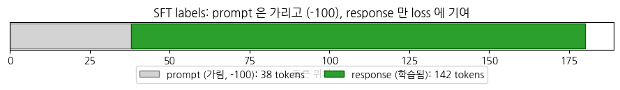
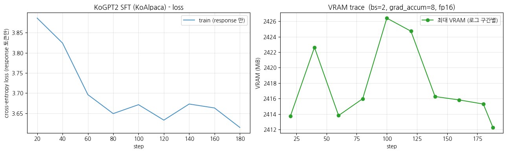

## collator 의 `labels` 마스킹 직접 시각화 — **이 챕터의 클라이맥스**

여기가 본 챕터의 핵심. `trl` 의 SFT collator 가 한 instruction-response 샘플을 받아 **prompt 부분을 전부 `-100` 으로, 답변 부분만 원본 token id 로** 만드는 것을 *눈으로* 확인합니다. Ch 21 의 `[MASK]` 80/10/10 시각화의 *SFT 판* 입니다.

### 동작 원리

1. `SFTTrainer` 가 *prompt + completion* 을 토큰화해 이어 붙이고, *completion 부분에 1, prompt 부분에 0* 인 `completion_mask` 를 만듭니다 (response_template `### 응답:\n` 가 prompt 의 끝).
2. `SFTTrainer` 가 *데이터 준비 단계* 에서 `labels = input_ids` 복사본을 만들고 *`completion_mask == 0` 인 자리 (= prompt) 를 전부 `-100`* 으로 덮은 `labels` 컬럼을 데이터셋에 추가합니다 (trl 1.10 기준 — 구버전 trl 은 collator 가 담당했습니다. collator 는 완성된 `labels` 를 배치 길이에 맞춰 패딩만 합니다).
3. 그래서 loss 는 *답변 토큰에서만* 계산됩니다 — `labels[:prompt_len] = -100` 의 효과.

여기가 이 챕터의 클라이맥스입니다. 한 샘플을 prompt / completion 으로 직접 토큰화해 이어 붙이고 `completion_mask` (0 = prompt, 1 = 답변) 를 만든 뒤, `SFTTrainer` 가 데이터 준비 단계에서 하는 것과 같은 규칙으로 prompt 자리를 전부 `-100` 으로 덮는 과정을 눈으로 따라갑니다. 답변 끝에 EOS 를 붙이는 것이 `SFTTrainer` 내부 절차와 같다는 점도 함께 봅니다.

```python
# trl 1.10 기준: completion 마스킹은 collator 가 아니라 SFTTrainer 의 *데이터 준비 단계* 에서 일어납니다.
# (SFTTrainer 가 prompt/completion 을 토큰화해 completion_mask 를 만들고, 그걸로 labels 컬럼을 생성한 뒤 mask 를 버립니다.
#  구버전 trl 은 collator 가 담당 - 버전마다 위치가 달라, 여기서는 같은 규칙을 직접 재현해 눈으로 확인합니다.)

# 한 샘플을 prompt / completion 으로 직접 토큰화 (SFTTrainer 내부와 같은 절차)
sample = sft_ds[0]
prompt_text = sample["prompt"]
completion_text = sample["completion"]

p_ids = tokenizer(prompt_text, add_special_tokens=False)["input_ids"]
c_ids = tokenizer(completion_text, add_special_tokens=False)["input_ids"]
c_ids = c_ids + [tokenizer.eos_token_id]   # SFTTrainer 는 답변 끝에 EOS 부착
```

**위 코드 읽기** — prompt 와 completion 을 각각 토큰화하는데, `### 명령어:` 머리표나 `</s>` 가 중복 삽입되지 않도록 `add_special_tokens=False` 로 둡니다. completion 쪽에는 답변의 끝을 모델에 가르치기 위해 `eos_token_id` 를 직접 덧붙이는데, 이는 `SFTTrainer` 가 내부에서 하는 일을 손으로 재현한 것입니다.

```python
input_ids = p_ids + c_ids
completion_mask = [0] * len(p_ids) + [1] * len(c_ids)   # 0 = prompt, 1 = 답변

print(f"prompt tokens     : {len(p_ids)}")
print(f"completion tokens : {len(c_ids)}  (incl. EOS)")
print(f"total tokens      : {len(input_ids)}")
```

**위 코드 읽기** — prompt 토큰과 completion 토큰을 한 줄로 이어 붙이고, 같은 길이의 `completion_mask` 를 prompt 자리에는 0, 답변 자리에는 1 로 만듭니다. 이 마스크가 바로 다음 단계에서 어느 위치를 `-100` 으로 가릴지 결정하는 기준이 됩니다.

```python
# SFTTrainer 의 build_labels 와 같은 규칙 - completion_mask == 0 (= prompt) 자리를 -100 으로
labels = [tid if m == 1 else -100 for tid, m in zip(input_ids, completion_mask)]
ids = input_ids

n_learn = sum(1 for l in labels if l != -100)
print(f"\nlabels learned    : {n_learn} / {len(labels)}  (prompt masked = {len(labels) - n_learn})")
```

**위 코드 읽기** — `completion_mask` 가 0 인 prompt 자리는 `-100` 으로, 1 인 답변 자리는 원본 token id 로 남겨 `labels` 를 만듭니다. trl 1.10 의 `SFTTrainer` 가 데이터 준비 단계(`build_labels`)에서 수행하는 규칙 그대로입니다. `-100` 이 아닌 라벨 개수를 세어 보면 실제로 답변 토큰만 학습 대상으로 남았는지 숫자로 확인할 수 있습니다.

**▶ 실행 결과**

```text
prompt tokens     : 38
completion tokens : 142  (incl. EOS)
total tokens      : 180

labels learned    : 142 / 180  (prompt masked = 38)
```

**결과 해석**

총 180 토큰 중 prompt 38 개가 전부 `-100` 으로 가려지고 답변 142 개만 학습 대상으로 남았습니다. 곧 한 줄 `labels[:prompt_len] = -100` 의 효과가 실제 숫자로 확인된 것으로, 모델은 질문을 외우지 않고 답변 생성만 학습합니다.

이번에는 가려짐을 토큰 단위로 펼쳐 봅니다. 위치별로 토큰 문자열·input_id·label·학습 여부를 한 표로 묶어, prompt 구간이 줄줄이 `-100` 으로 표시되는 모습을 직접 읽습니다.

```python
# 토큰별 표 - position | token | input_id | label | learn?
rows = []
for i, (tid, lab) in enumerate(zip(ids, labels)):
    rows.append({
        "pos": i,
        "token": repr(tokenizer.decode([tid])),
        "input_id": tid,
        "label": lab,
        "learn?": "Y (response)" if lab != -100 else "- (prompt, -100)",
    })
label_table = pd.DataFrame(rows)

pd.set_option("display.max_rows", None)
pd.set_option("display.width", 120)
print("=" * 78)
print("Per-token labels - prompt is masked (-100), only response is learned")
print("=" * 78)
print(label_table.to_string(index=False))
```

**▶ 실행 결과**

```text
==============================================================================
Per-token labels - prompt is masked (-100), only response is learned
==============================================================================
 pos   token  input_id  label           learn?
   0      ''       739   -100 - (prompt, -100)
   1     '#'       378   -100 - (prompt, -100)
   2     '#'       378   -100 - (prompt, -100)
   3     '#'       378   -100 - (prompt, -100)
   4    '명령'     14266   -100 - (prompt, -100)
   5     '어'      8006   -100 - (prompt, -100)
   6     ':'       401   -100 - (prompt, -100)
   7    '\n'       375   -100 - (prompt, -100)
   8   '나무가'     18306   -100 - (prompt, -100)
   9    '말라'     15020   -100 - (prompt, -100)
  10    '죽을'     14909   -100 - (prompt, -100)
  11     '때'      9068   -100 - (prompt, -100)
  12     '왜'     10401   -100 - (prompt, -100)
  13     '속'      9238   -100 - (prompt, -100)
  14    '부터'      9148   -100 - (prompt, -100)
  15     '썩'     23623   -100 - (prompt, -100)
  16     '는'      7162   -100 - (prompt, -100)
  17     '걸'      9539   -100 - (prompt, -100)
  18     '까'      6969   -100 - (prompt, -100)
  19     '요'      8084   -100 - (prompt, -100)
  20     '?'       406   -100 - (prompt, -100)
  21  '그리고,'     39678   -100 - (prompt, -100)
  22    '나무'     10221   -100 - (prompt, -100)
  23    '속에'     10671   -100 - (prompt, -100)
  24   '전선을'     46886   -100 - (prompt, -100)
  25    '넣을'     44361   -100 - (prompt, -100)
  26     '수'      9025   -100 - (prompt, -100)
  27    '있는'      9080   -100 - (prompt, -100)
  28   '방법이'     15517   -100 - (prompt, -100)
  29    '있을'      9846   -100 - (prompt, -100)
  30 '까요?\n'     15092   -100 - (prompt, -100)
  31    '\n'       375   -100 - (prompt, -100)
  32     '#'       378   -100 - (prompt, -100)
  33     '#'       378   -100 - (prompt, -100)
  34     '#'       378   -100 - (prompt, -100)
... (출력 145줄 생략) ...
```

**결과 해석**

`### 명령어:` 부터 사용자의 질문 전체가 `learn?` 열에서 모두 `- (prompt, -100)` 으로 찍혀 있어, prompt 의 어느 토큰도 loss 에 들어가지 않음을 위치별로 볼 수 있습니다. 표 뒷부분(생략된 구간)의 답변 토큰들이 `Y (response)` 로 바뀌면서 학습 대상이 시작됩니다.

**무엇을 보고 있나** — 위 표의 `learn?` 열을 보면:

- **prompt 부분** (`### 명령어:` ... `### 응답:\n` 까지) → `label = -100` → *loss 에서 제외*. 모델은 *이 질문 자체* 를 외우지 않습니다
- **답변 부분** (`### 응답:\n` *이후* 의 모든 토큰 + EOS) → `label = 원본 token id` → *loss 에 포함*. 모델은 *이 답변을 생성하는 법* 만 배웁니다

> Ch 21 의 `[MASK]` 시각화는 *문장의 약 15% 를 가렸다* 면, 여기서는 *prompt 전체를 가립니다* — **정반대 방향의 마스킹**. 그리고 이게 `labels = -100` thread 의 *세 번째이자 마지막 단계*. MLM(15% 만 학습) → CausalLM(거의 전부 학습) → **SFT(답변만 학습)**. 한 줄 `labels[:prompt_len] = -100` 의 효과를 *눈으로 확인* 했습니다.

이제 같은 결과를 막대그래프 하나로 요약합니다. 가려진 prompt 토큰 수와 학습되는 response 토큰 수를 나란히 그려, 답변만 loss 에 기여한다는 사실을 한눈에 보이게 합니다.

```python
# 요약 시각화 - prompt vs response 토큰 수, loss 기여 비율
n_prompt = len(labels) - n_learn
n_resp = n_learn

fig, ax = plt.subplots(figsize=(9, 1.8))
ax.barh([0], [n_prompt], color="lightgray", edgecolor="gray",
        label=f"prompt (가림, -100): {n_prompt} tokens")
ax.barh([0], [n_resp], left=[n_prompt], color="tab:green", edgecolor="darkgreen",
        label=f"response (학습됨): {n_resp} tokens")
ax.set_yticks([])
ax.set_xlabel("토큰 위치")
ax.set_title("SFT labels: prompt 은 가리고 (-100), response 만 loss 에 기여")
ax.legend(loc="upper center", bbox_to_anchor=(0.5, -0.4), ncol=2)
plt.tight_layout(); plt.show()
```

**▶ 실행 결과**



**결과 해석**

회색 막대(가려진 prompt 38 토큰)와 초록 막대(학습되는 response 142 토큰)가 한 줄에 나란히 그려져, loss 가 답변 구간에서만 발생함을 시각적으로 확정합니다. 이 그림이 Ch 21 의 `[MASK]` 시각화에 대응하는 SFT 판입니다.

## `SFTTrainer` 로 SFT 학습 — *새 trainer, 같은 loss 종류*

`trl.SFTTrainer` 는 본 챕터에 처음 등장하는 클래스입니다. `transformers.Trainer` 를 상속해 *SFT 에 특화된 전처리* (prompt/completion 토큰화, EOS 부착, completion 마스킹) 를 자동으로 해 줍니다. 설정은 `SFTConfig` (`TrainingArguments` 를 상속) 로 주며, **`completion_only_loss=True`** 가 *답변 부분만 학습* 하라는 핵심 옵션입니다.

SFT 의 효과를 검증하려면 같은 instruction 을 학습 전·후에 넣어 비교해야 합니다. 먼저 비교용 프롬프트와 sampling 설정을 정하고, 답변만 깔끔히 뽑아내는 헬퍼를 정의한 뒤, 아직 SFT 하지 않은 raw KoGPT2 의 출력을 기록해 둡니다.

```python
from trl import SFTTrainer, SFTConfig

# SFT 학습 전 generation 비교를 위해 '학습 전' 모델 상태를 기록해 둠 (§5 에서 사용)
PROMPTS = [
    "피보나치 수열을 설명해줘",
    "건강한 식습관 3가지를 알려줘",
    "파이썬으로 리스트를 뒤집는 방법은?",
    "아침에 일찍 일어나는 팁을 알려줘",
]
GEN_KWARGS = dict(max_new_tokens=80, do_sample=True, temperature=0.8,
                  top_k=50, repetition_penalty=1.3)
```

**위 코드 읽기** — SFT 전후로 던질 instruction 4 개를 고정하고, sampling 파라미터를 한 dict 에 모아 두 시점에서 같은 조건으로 생성합니다. `repetition_penalty=1.3` 은 작은 모델이 같은 구절을 반복하는 경향을 누르기 위한 설정입니다.

```python
@torch.no_grad()
def generate_answer(active_model, instruction: str, **kwargs):
    '''instruction 을 포맷해 답변을 생성. RESPONSE_TEMPLATE 뒤부터를 답변으로 디코드.'''
    text = build_prompt(instruction)
    enc = tokenizer(text, return_tensors="pt").to(active_model.device)
    out = active_model.generate(
        **enc,
        pad_token_id=tokenizer.pad_token_id,
        eos_token_id=tokenizer.eos_token_id,
        **kwargs,
    )
    full = tokenizer.decode(out[0], skip_special_tokens=True)
    # 답변 부분만 잘라내기 (response_template 이후)
    if RESPONSE_TEMPLATE.strip() in full:
        return full.split(RESPONSE_TEMPLATE.strip(), 1)[-1].strip()
    return full[len(text):].strip()
```

**위 코드 읽기** — instruction 을 학습 때와 똑같은 `### 명령어:` / `### 응답:` 포맷으로 감싸 생성하는 것이 핵심으로, 추론 포맷이 학습 포맷과 어긋나면 모델이 제대로 반응하지 못합니다. 생성된 전체 문자열에서 `### 응답:` 뒤만 잘라내 답변 부분만 보여 줍니다.

```python
torch.manual_seed(SEED)
model.eval()
before_outputs = []
print("=" * 70)
print("BEFORE SFT - raw KoGPT2 (no instruction tuning yet)")
print("=" * 70)
for p in PROMPTS:
    ans = generate_answer(model, p, **GEN_KWARGS)
    before_outputs.append(ans)
    print(f"\n[instruction] {p}")
    print(f"[answer] {ans[:240]}")
```

**위 코드 읽기** — 시드를 고정해 재현 가능하게 한 뒤, SFT 를 한 번도 거치지 않은 현재 모델로 네 prompt 의 답변을 생성해 `before_outputs` 에 보관합니다. 이 출력이 나중에 SFT 후 결과와 나란히 비교될 기준선이 됩니다.

**▶ 실행 결과**

```text
======================================================================
BEFORE SFT - raw KoGPT2 (no instruction tuning yet)
======================================================================
[instruction] 피보나치 수열을 설명해줘
[answer] 일단 한 번만 들어주면 끝나요
이제 본격적으로 사용하셔야겠죠?
다음부터는 내가 쓰는게 다인 듯!
내 안에 있는 피보라인의 모든 부분을 소개해드려요! momeljae.eats & pet_bang bong.
#미소천사 님이네요.
아무튼 저는 매일 미소에 대한
[instruction] 건강한 식습관 3가지를 알려줘
[answer] #diet #dieter #dietfood #eatclean <16.01.13.Sun>  
오늘은 정말 맛있는 날!
오랜만에 먹는 떡볶이가 나왔는데~ 진짜 너무 맛있었다
그리고 빵투샷도 있네용ᄒᄒ!ᄏᄏᄏ 대박이어서
다음에 또 먹어야지염
[instruction] 파이썬으로 리스트를 뒤집는 방법은?
[answer] 이벤트 응모 이벤트도 진행중이라, 오늘부터 이벤트에 신청하면 추첨을 통하여
2人1파이어보틀 세트를 선물로 받을 수 있는데,
(당첨된사람은 모두 파운데이션)
그래서인지 구매를 하면 제일 먼저 할인이 되는거 같아요~!
아니면 다들 미리미리 준비해서 갔는데...
그냥
[instruction] 아침에 일찍 일어나는 팁을 알려줘
[answer] crutsof_blogger.co.kr
오늘도 일상이 너무 행복해서요
이제는 아침을 거르지 않고 집에서 운동장 가기!
일단 점심시간이고 퇴근~~
우리 가족끼리 가자고 했다가 저는 저녁까지 먹고 싶다! 이젠 더 이상 뭐, 어떡해?.....
미세먼지
```

**결과 해석**

네 질문 모두 답변이 아니라 블로그·해시태그·잡담으로 흘러가, raw KoGPT2 가 instruction 을 지시로 인식하지 못하고 단순 이어쓰기만 한다는 것이 드러납니다. 같은 125M 본체인데도 "피보나치 수열을 설명해줘" 에 설명이 전혀 나오지 않는 점이 SFT 전의 출발 상태입니다.

이제 `SFTConfig` 로 학습 설정을 잡습니다. `completion_only_loss=True` 가 답변 부분만 학습하라는 핵심 옵션이고, T4 메모리에 맞춰 작은 batch + gradient accumulation 으로 effective batch 16 을 만들며, VRAM 추적 콜백을 붙여 `SFTTrainer` 로 학습합니다.

```python
sft_config = SFTConfig(
    output_dir="./out_kogpt2_sft",
    num_train_epochs=1,                     # SFT 는 1-3 epoch 이 표준 - T4 룰 안에서 1
    per_device_train_batch_size=2,          # KoGPT2 125M + instruction 은 시퀀스가 길어 작게
    gradient_accumulation_steps=8,          # effective batch = 16
    learning_rate=2e-5,                     # SFT 표준 lr
    weight_decay=0.01,
    warmup_steps=0.03,                      # 1 미만이면 전체 step 대비 *비율* 로 해석 (구 warmup_ratio)
    lr_scheduler_type="cosine",
    max_grad_norm=1.0,
    max_length=512,                         # instruction + response 길이 상한
    completion_only_loss=True,              # <- 핵심: 답변 부분만 loss (prompt = -100)
    packing=False,                          # 샘플 경계 유지 (마스킹이 정확하려면 packing 끔)
    fp16=USE_FP16,                          # T4 는 bf16 불가
    logging_steps=20,
    save_strategy="no",
    report_to="none",
    dataloader_num_workers=2,
    seed=SEED,
)


class VRAMCallback(__import__("transformers").TrainerCallback):
    '''step 별 peak VRAM 기록 (로깅 윈도우 단위 reset). CUDA 에서만 유효.'''

    def __init__(self):
        self.steps, self.peak_MiB = [], []

    def on_train_begin(self, args, state, control, **kwargs):
        if torch.cuda.is_available():
            torch.cuda.reset_peak_memory_stats()

    def on_log(self, args, state, control, logs=None, **kwargs):
        if torch.cuda.is_available():
            peak = torch.cuda.max_memory_allocated() / 1024**2
            self.steps.append(state.global_step)
            self.peak_MiB.append(peak)
            torch.cuda.reset_peak_memory_stats()


vram_cb = VRAMCallback()

trainer = SFTTrainer(
    model=model,
    args=sft_config,
    train_dataset=sft_ds,
    processing_class=tokenizer,
    callbacks=[vram_cb],
)

t0 = time.time()
train_out = trainer.train()
elapsed = time.time() - t0

print(f"\n=== SFT summary ===")
print(f"elapsed     : {elapsed/60:.2f} min")
print(f"global_step : {train_out.global_step}")
print(f"train_loss  : {train_out.training_loss:.4f}")
if torch.cuda.is_available():
    print(f"final peak  : {torch.cuda.max_memory_allocated()/1024**2:.0f} MiB")
```

**▶ 실행 결과**

```text
Step  Training Loss
20    3.886173
40    3.824303
60    3.696179
80    3.649105
100   3.671245
120   3.632870
140   3.672873
160   3.663120
180   3.614760
=== SFT summary ===
elapsed     : 2.48 min
global_step : 188
train_loss  : 3.7007
final peak  : 1452 MiB
```

**결과 해석**

188 step (3,000 샘플 1 epoch) 학습이 약 2.5 분 만에 끝났고 peak VRAM 은 1,452 MiB 로 T4 16GB 에 한참 여유가 있습니다. train_loss 3.70 은 답변 토큰에서만 계산된 값이라, prompt 까지 합산하는 Ch 27 의 loss 와는 합산 대상이 달라 절대값을 직접 비교하지 않습니다.

## 학습 곡선 — *답변 부분에서만 계산된* loss

아래 loss 는 *답변 토큰에서만* 계산된 값입니다 (prompt 는 `-100` 으로 제외). Ch 27 의 loss (거의 모든 자리) 와는 *합산 대상* 이 다르므로 절대값을 직접 비교하지는 않습니다.

학습 로그에서 step 별 loss 와 콜백이 모은 VRAM 흔적을 꺼내 두 패널로 그립니다. loss 곡선은 답변 토큰에서만 계산된 값이라는 점을 축 라벨에서 다시 짚어 줍니다.

```python
log = trainer.state.log_history
train_pts = [(r["step"], r["loss"]) for r in log if "loss" in r and "eval_loss" not in r]

fig, (ax1, ax2) = plt.subplots(1, 2, figsize=(13, 4))

if train_pts:
    ax1.plot([s for s, _ in train_pts], [l for _, l in train_pts], "-",
             color="tab:blue", alpha=0.8, label="train (response 만)")
ax1.set_xlabel("step"); ax1.set_ylabel("cross-entropy loss (response 토큰만)")
ax1.set_title("KoGPT2 SFT (KoAlpaca) - loss")
ax1.grid(True, alpha=0.3); ax1.legend()

if vram_cb.steps:
    ax2.plot(vram_cb.steps, vram_cb.peak_MiB, "o-", color="tab:green",
             label="최대 VRAM (로그 구간별)")
    ax2.set_title("VRAM trace  (bs=2, grad_accum=8, fp16)")
else:
    ax2.text(0.5, 0.5, "VRAM 추적은 CUDA 에서만 가능",
             ha="center", va="center", transform=ax2.transAxes)
    ax2.set_title("VRAM 추적 - CUDA 전용")
ax2.set_xlabel("step"); ax2.set_ylabel("VRAM (MiB)")
ax2.grid(True, alpha=0.3); ax2.legend()

plt.tight_layout(); plt.show()
```

**▶ 실행 결과**



**결과 해석**

왼쪽 loss 곡선이 step 이 진행되며 전반적으로 내려가 답변 생성을 학습하고 있음을 보여 주고, 오른쪽 VRAM 흔적은 1.5GiB 안팎에서 안정적으로 유지됩니다. 이 곡선은 prompt 를 제외한 response 토큰만의 cross-entropy 라는 점이 다른 챕터와의 차이입니다.

## SFT 전·후 instruction following 비교 — *행동 정렬이 일어났는가*

본 챕터의 핵심 데모. *같은 instruction* 을 *SFT 전 (raw KoGPT2)* 과 *SFT 후* 에 각각 넣어 답변을 비교합니다.

- **SFT 전 (raw KoGPT2)**: instruction 을 *지시로 인식하지 못하고* — 질문을 *이어쓰기* 하거나, 블로그·해시태그·SNS 잡담체로 흘러가는 경향, 엉뚱한 방향으로 흐름
- **SFT 후**: instruction 을 *따라* — 질문에 *대답* 하는 구조화된 답변

이 차이가 *행동 정렬 (behavior alignment)* 의 직접 증거입니다.

학습이 끝난 같은 모델에 §앞에서와 똑같은 prompt·sampling·시드를 다시 적용해 SFT 후 답변을 생성합니다. before 와 동일 조건으로 뽑아야 변화가 본체가 아니라 SFT 때문임이 분명해집니다.

```python
torch.manual_seed(SEED)
model.eval()
after_outputs = []
print("=" * 70)
print("AFTER SFT - KoGPT2 + KoAlpaca instruction tuning")
print("=" * 70)
for p in PROMPTS:
    ans = generate_answer(model, p, **GEN_KWARGS)
    after_outputs.append(ans)
    print(f"\n[instruction] {p}")
    print(f"[answer] {ans[:240]}")
```

**▶ 실행 결과**

```text
======================================================================
AFTER SFT - KoGPT2 + KoAlpaca instruction tuning
======================================================================
[instruction] 피보나치 수열을 설명해줘
[answer] 수열이란 어떤 원인에 의해서 생기는 열입니다.
이러한 현상은 두 가지 종류가 있습니다. 첫째는 물 또는 공기 중에 포함된 물이 모두 다 녹아서 수증기가 만들어지는 현상이고, 둘째는 물에 녹아있는 산소가 열을 가해서 증발하는 현상입니다. 이 때, 물은 대부분 산화되지 않도록 보호 작용을 합니다. 
또한, 물을 끓여 끓이면 산소를 흡수하여 수분이 되어 다시 용해되기 때문에 물과 산소도 함께 배출되어 열이 발생하게 됩니다. 이러한
[instruction] 건강한 식습관 3가지를 알려줘
[answer] 1. 건강한 식사를 위해서는 균형과 식이섭취가 중요합니다. 아침식사는 탄수화물과 단백질은 풍부하지만, 단백질이 부족하면 소화도 잘 되지 않는 경우가 있습니다. 따라서 적당한 양의 영양소를 섭취하는 것이 좋으며, 저녁은 신선한 채소와 함께 먹는 것을 추천드립니다. 
2. 단백질을 풍부한 음식으로 만들기 위해 필요한 비타민 C, E는 필수적이며, 단백질 대신 과일과 채소를 풍부하게 먹어야 합니다. 또한, 칼슘을 충분히 함유하고 있
[instruction] 파이썬으로 리스트를 뒤집는 방법은?
[answer] 리스트에 파일 이름을 등록하여 해당 페이지에 접속한 뒤, 그 계정을 열지 않고 다시 연결하면, 파일을 열어보내면 된다.
- 리스트는 'inficitecture guide' 또는 '이디렉티브', '이미지(Deady Leak)'입니다.
- 이 디바이스는 P2P 사이트인 링크드인을 통해 제공되며, 현재까지는
[instruction] 아침에 일찍 일어나는 팁을 알려줘
[answer] 1. 아침에 일어나서 가장 먼저 하는 것은 아침체온 관리입니다.
2. 저녁에 잠자리에 들기 전에 꼭 하고 싶은 것이 있다면 아침을 먹고 하루를 시작하는 것입니다.
3. 아침에 일어날 때는 식욕을 억제해 몸의 신진대사를 활발하게 합니다.
4. 오후에는 몸을 따뜻하게 하기 위해 비타민이 풍부한 영양소를 보충합니다.
5. 낮 동안에는 잠을 자지 않는 습관을 가지면 좋습니다. 
6. 밤에 옷을 입는 것도 권장됩니다.
```

**결과 해석**

같은 본체가 이제 "건강한 식습관 3가지" 에 1·2·3 번호를 매겨 답하고, "아침 팁" 에도 항목을 나눠 응답하는 등 instruction 을 따라가는 구조로 바뀌었습니다. 사실 정확도는 거칠지만(125M + 3K 샘플의 한계), 잡담 이어쓰기에서 질문에 답하는 형태로 행동 방향 자체가 정렬된 것이 핵심입니다.

마지막으로 같은 instruction 의 before / after 를 한 화면에 나란히 출력해, 행동 정렬이 일어났는지를 직접 대조합니다.

```python
# BEFORE vs AFTER 나란히 비교
print("=" * 80)
print("BEFORE SFT (raw KoGPT2) vs AFTER SFT (KoGPT2 + KoAlpaca) - instruction following")
print("=" * 80)
comparison = []
for p, before, after in zip(PROMPTS, before_outputs, after_outputs):
    print(f"\nINSTRUCTION : {p}")
    print("-" * 80)
    print(f"BEFORE      : {before[:300]}")
    print(f"AFTER       : {after[:300]}")
    comparison.append({
        "instruction": p,
        "before (raw)": before[:80] + ("..." if len(before) > 80 else ""),
        "after (sft)": after[:80] + ("..." if len(after) > 80 else ""),
    })

print("\n\n=== compact table ===")
print(pd.DataFrame(comparison).to_string(index=False))
```

**▶ 실행 결과**

```text
================================================================================
BEFORE SFT (raw KoGPT2) vs AFTER SFT (KoGPT2 + KoAlpaca) - instruction following
================================================================================

INSTRUCTION : 피보나치 수열을 설명해줘
--------------------------------------------------------------------------------
BEFORE      : 일단 한 번만 들어주면 끝나요
이제 본격적으로 사용하셔야겠죠?
다음부터는 내가 쓰는게 다인 듯!
내 안에 있는 피보라인의 모든 부분을 소개해드려요! momeljae.eats & pet_bang bong.
#미소천사 님이네요.
아무튼 저는 매일 미소에 대한
AFTER       : 수열이란 어떤 원인에 의해서 생기는 열입니다.
이러한 현상은 두 가지 종류가 있습니다. 첫째는 물 또는 공기 중에 포함된 물이 모두 다 녹아서 수증기가 만들어지는 현상이고, 둘째는 물에 녹아있는 산소가 열을 가해서 증발하는 현상입니다. 이 때, 물은 대부분 산화되지 않도록 보호 작용을 합니다. 
또한, 물을 끓여 끓이면 산소를 흡수하여 수분이 되어 다시 용해되기 때문에 물과 산소도 함께 배출되어 열이 발생하게 됩니다. 이러한

INSTRUCTION : 건강한 식습관 3가지를 알려줘
--------------------------------------------------------------------------------
BEFORE      : #diet #dieter #dietfood #eatclean <16.01.13.Sun>  
오늘은 정말 맛있는 날!
오랜만에 먹는 떡볶이가 나왔는데~ 진짜 너무 맛있었다
그리고 빵투샷도 있네용ᄒᄒ!ᄏᄏᄏ 대박이어서
다음에 또 먹어야지염
AFTER       : 1. 건강한 식사를 위해서는 균형과 식이섭취가 중요합니다. 아침식사는 탄수화물과 단백질은 풍부하지만, 단백질이 부족하면 소화도 잘 되지 않는 경우가 있습니다. 따라서 적당한 양의 영양소를 섭취하는 것이 좋으며, 저녁은 신선한 …(뒤 21자 생략)
2. 단백질을 풍부한 음식으로 만들기 위해 필요한 비타민 C, E는 필수적이며, 단백질 대신 과일과 채소를 풍부하게 먹어야 합니다. 또한, 칼슘을 충분히 함유하고 있으므로

INSTRUCTION : 파이썬으로 리스트를 뒤집는 방법은?
--------------------------------------------------------------------------------
BEFORE      : 이벤트 응모 이벤트도 진행중이라, 오늘부터 이벤트에 신청하면 추첨을 통하여
2人1파이어보틀 세트를 선물로 받을 수 있는데,
(당첨된사람은 모두 파운데이션)
그래서인지 구매를 하면 제일 먼저 할인이 되는거 같아요~!
아니면 다들 미리미리 준비해서 갔는데...
그냥
AFTER       : 리스트에 파일 이름을 등록하여 해당 페이지에 접속한 뒤, 그 계정을 열지 않고 다시 연결하면, 파일을 열어보내면 된다.
- 리스트는 'inficitecture guide' 또는 '이디렉티브', '이미지(Deady Leak)'입니다.
- 이 디바이스는 P2P 사이트인 링크드인을 통해 제공되며, 현재까지는

INSTRUCTION : 아침에 일찍 일어나는 팁을 알려줘
... (출력 21줄 생략) ...
```

**결과 해석**

BEFORE 열은 네 질문 모두 해시태그·블로그체로 새는 반면, AFTER 열은 같은 질문에 번호 매긴 답변이나 설명 시도로 응답합니다. 이 BEFORE/AFTER 대조가 behavior alignment 의 직접 증거로, 본체는 한 토큰도 바꾸지 않고 데이터 형식 + 마스킹 자리만 바꿔 모델 행동을 정렬했음을 보여 줍니다.

**해석 가이드 — behavior alignment 의 증거**

- **BEFORE (raw KoGPT2)**: 같은 *125M 본체* 인데도 instruction 을 *지시로 받아들이지 못합니다*. `"피보나치 수열을 설명해줘"` 를 넣으면 *설명* 대신 *질문을 이어 쓰거나*, 일반 산문으로 흘러가거나, 블로그·해시태그·SNS 잡담체로 흘러가는 경향
- **AFTER (KoGPT2 + KoAlpaca SFT)**: *같은 본체* 가 이제 instruction 을 *따라* — 질문에 *대답하는* 구조로 응답. 짧은 SFT (1 epoch, 약 3K 샘플) 만으로도 *행동의 방향* 이 바뀝니다

> **핵심**: 본체는 *한 토큰도 바꾸지 않은 같은 125M KoGPT2* 입니다 (continual pretraining 처럼 *데이터만* 바뀐 게 아니라, *데이터 형식 + 마스킹 자리* 가 바뀌었습니다). 그 결과 *모델의 행동 자체* 가 instruction 을 따르도록 정렬됐습니다. **이게 *왜 GPT 하나가 모든 task 를 해내는가* 의 답** — 입력 프롬프트 형식만 바꾸면 다른 일을 하도록, SFT 가 그 능력을 *깨웠습니다*.

> ⚠️ KoGPT2 는 125M 의 *작은* 모델이고 SFT 데이터·시간도 작아서, 답변 품질 자체는 거칠 수 있습니다 (사실 오류, 반복 등). 본 챕터의 관전 포인트는 *답변의 정확도* 가 아니라 ***instruction 을 따라가는 행동 자체가 생겼는가*** 입니다. 품질은 *더 큰 모델 + 더 많은 데이터 + LoRA* 로 끌어올립니다 (FAQ 참고).

## 변형 — 더 많은 데이터 / 다른 response_template / LoRA

본 챕터에서 다루지 못한 변형들 — 직접 시도해 보고 싶다면 아래를 출발점으로:

### 변형 1. 더 많은 데이터 / epoch

subset 크기와 epoch 수를 늘리면 instruction 다양성이 커져 instruction following 능력이 향상됩니다. 다만 T4 + 30분 룰을 넘기지 않도록 학습 시간 증가에 주의해 값을 조절하세요.

```python
# N_SFT = 10000           # subset 확대 (T4 시간 증가 주의)
# sft_config.num_train_epochs = 3   # SFT 는 1-3 epoch 표준
# 더 많은 instruction 다양성 -> instruction following 능력 향상
```

### 변형 2. 다른 response_template

response_template 은 답변 시작 경계를 알리는 표식일 뿐이라, 영어 마커든 chat-style 마커든 자유롭게 바꿀 수 있습니다. 단 collator 가 input_ids 안에서 이 문자열을 찾으므로, 데이터에 일관되게 등장하면서 본문과 충돌하지 않는 특수한 문자열이어야 합니다.

```python
# RESPONSE_TEMPLATE = "### Answer:\n"   # 영어 마커
# RESPONSE_TEMPLATE = "<|assistant|>\n" # chat-style 마커
# response_template 은 '답변 시작 경계' 표시일 뿐 - 데이터에 일관되게만 등장하면 됨.
# 단 본문과 충돌하지 않는 특수 문자열이어야 (collator 가 input_ids 안에서 이걸 찾음).
```

### 변형 3. LoRA / QLoRA — 더 큰 모델 SFT

본체 weight 는 freeze 한 채 작은 low-rank adapter 만 학습하는 LoRA 를 쓰면 메모리를 크게 절감해 7B 급 모델도 SFT 할 수 있습니다. `SFTTrainer` 에 `peft_config` 만 넘기면 적용되며, 마스킹·loss 원리는 full SFT 와 동일하다는 점에 유의하세요.

```python
# from peft import LoraConfig
# peft_config = LoraConfig(r=16, lora_alpha=32, target_modules=["c_attn"],
# lora_dropout=0.05, task_type="CAUSAL_LM")
# trainer = SFTTrainer(model=model, args=sft_config, train_dataset=sft_ds,
# processing_class=tokenizer, peft_config=peft_config)
# 본체 weight 는 freeze, 작은 adapter 만 학습 -> 메모리 대폭 절감.
# 7B 급 모델 SFT 의 실무 표준 (QLoRA 는 4bit 양자화까지 더함). 본 커리큘럼 범위 밖.
```
