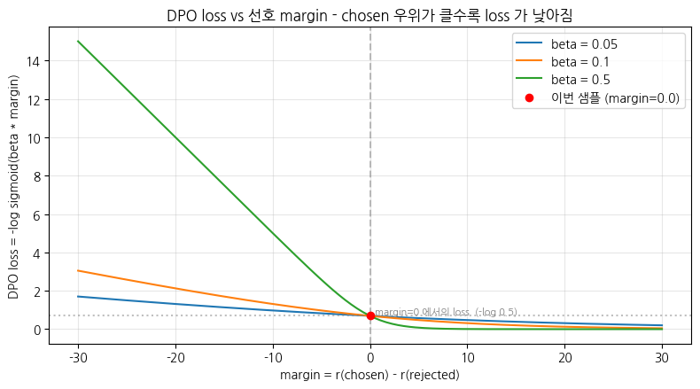
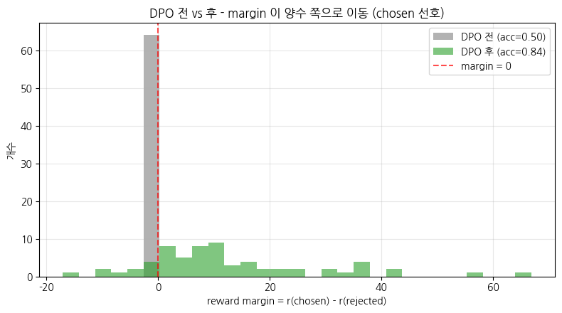
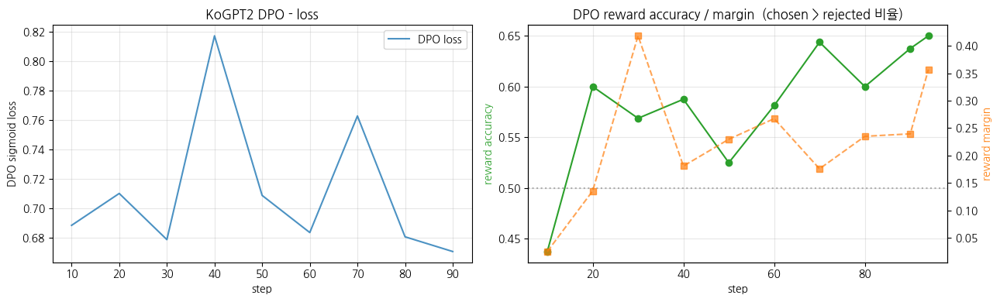

> ▶ **[Google Colab에서 이 장 실습 열기](https://colab.research.google.com/github/yoon-gu/neuqes-101/blob/master/30_dpo/30_dpo.ipynb)** — 브라우저에서 바로 실행해 볼 수 있습니다.

## 환경 준비

```python
%pip install -q -U trl transformers tokenizers datasets accelerate
```

**▶ 실행 결과**

```text
   ━━━━━━━━━━━━━━━━━━━━━━━━━━━━━━━━━━━━━━━━ 825.1/825.1 kB 27.6 MB/s eta 0:00:00
   ━━━━━━━━━━━━━━━━━━━━━━━╸━━━━━━━━━━━━━━━━ 6.6/11.2 MB 199.2 MB/s eta 0:00:01
   ━━━━━━━━━━━━━━━━━━━━━━━━━━━━━━━━━━━━━━━━ 11.2/11.2 MB 113.5 MB/s eta 0:00:00
   ━━━━━━━━━━━━━━━━━━━━━━━━━━━━━━━━━━━━━━━━ 555.1/555.1 kB 50.6 MB/s eta 0:00:00
   ━━━━━━━━━━━━━━━━━━━━━━━━━━━━━━━━━━━━━━━━ 389.2/389.2 kB 39.4 MB/s eta 0:00:00
   ━━━━━━━━━━━━━━━━╸━━━━━━━━━━━━━━━━━━━━━━━ 20.7/48.9 MB 219.7 MB/s eta 0:00:01
   ━━━━━━━━━━━━━━━━━━━━━━━━━━━━━━━━━━━━━━━╸ 48.9/48.9 MB 148.1 MB/s eta 0:00:01
   ━━━━━━━━━━━━━━━━━━━━━━━━━━━━━━━━━━━━━━━╸ 48.9/48.9 MB 148.1 MB/s eta 0:00:01
   ━━━━━━━━━━━━━━━━━━━━━━━━━━━━━━━━━━━━━━━╸ 48.9/48.9 MB 148.1 MB/s eta 0:00:01
   ━━━━━━━━━━━━━━━━━━━━━━━━━━━━━━━━━━━━━━━━ 48.9/48.9 MB 16.2 MB/s eta 0:00:00
```

```python
import warnings
warnings.filterwarnings("ignore")

import copy
import math
import os
import random
import time

import numpy as np
import pandas as pd
import matplotlib.pyplot as plt
import torch
import torch.nn.functional as F

import trl
print(f"trl          : {trl.__version__}")

# device 자동 감지 - Colab T4 / 로컬 MPS / CPU 모두 지원
if torch.cuda.is_available():
    device = torch.device("cuda")
    device_name = torch.cuda.get_device_name(0)
    vram_gib = torch.cuda.get_device_properties(0).total_memory / 1024**3
    print(f"device       : cuda  ({device_name})")
    print(f"VRAM total   : {vram_gib:.2f} GiB")
elif torch.backends.mps.is_available():
    device = torch.device("mps")
    print("device       : mps  (Apple Silicon)")
else:
    device = torch.device("cpu")
    print("device       : cpu  (training will be very slow - Colab T4 recommended)")

print(f"torch        : {torch.__version__}")

# 재현성
SEED = 0
torch.manual_seed(SEED)
np.random.seed(SEED)
random.seed(SEED)

# fp16 은 CUDA 에서만 (MPS 는 미지원, CPU 는 의미 없음)
USE_FP16 = (device.type == "cuda")
print(f"use fp16     : {USE_FP16}")

# matplotlib 한글 폰트 (Colab — NanumGothic). plot 의 한국어가 □ 로 깨지지 않게.
import matplotlib.pyplot as plt, matplotlib.font_manager as fm, subprocess, os
_fp = "/usr/share/fonts/truetype/nanum/NanumGothic.ttf"
if not os.path.exists(_fp):
    subprocess.run("apt-get -qq -y install fonts-nanum", shell=True)
fm.fontManager.addfont(_fp)
plt.rcParams["font.family"] = "NanumGothic"
plt.rcParams["axes.unicode_minus"] = False
```

**▶ 실행 결과**

```text
trl          : 1.6.0
device       : cuda  (Tesla T4)
VRAM total   : 14.56 GiB
torch        : 2.11.0+cu128
use fp16     : True
```

```python
from datasets import load_dataset

N_DPO = 1500          # T4 + 30분 룰 - subset
MAX_PROMPT_CHARS = 300
MAX_RESP_CHARS = 400  # 긴 에세이 답변을 잘라 시퀀스 길이 통제 (학습 안정 + 속도)

raw = load_dataset("maywell/ko_Ultrafeedback_binarized", split="train")
print("raw dataset:", raw)
print("\nfields:", raw.column_names)

# 짧고 chosen != rejected 인 샘플만 (길이 통제 + 비교가 의미 있는 쌍)
def keep(ex):
    p, c, r = ex["prompt"], ex["chosen"], ex["rejected"]
    return (
        bool(p.strip()) and bool(c.strip()) and bool(r.strip())
        and c.strip() != r.strip()
        and len(p) <= MAX_PROMPT_CHARS
    )

raw = raw.filter(keep)
raw = raw.shuffle(seed=SEED).select(range(min(N_DPO, len(raw))))
print(f"\nafter filter + subset: {len(raw):,} samples")
```

**▶ 실행 결과**

```text
raw dataset: Dataset({
    features: ['prompt', 'chosen', 'rejected'],
    num_rows: 61966
})

fields: ['prompt', 'chosen', 'rejected']
after filter + subset: 1,500 samples
```

```python
RESPONSE_TEMPLATE = "### 응답:\n"   # Ch 28 SFT 와 동일한 답변 경계


def build_prompt(instruction: str) -> str:
    '''Ch 28 SFT 와 동일한 instruction 포맷. 학습·추론 포맷을 일치시켜야 정렬이 됨.'''
    return f"### 명령어:\n{instruction}\n\n{RESPONSE_TEMPLATE}"


def to_preference(ex):
    chosen = ex["chosen"].strip()[:MAX_RESP_CHARS]
    rejected = ex["rejected"].strip()[:MAX_RESP_CHARS]
    return {
        "prompt": build_prompt(ex["prompt"].strip()),
        "chosen": chosen,
        "rejected": rejected,
    }


dpo_ds = raw.map(to_preference, remove_columns=raw.column_names, desc="format")
print("formatted dataset:", dpo_ds)
print("\n=== preference sample 0 ===")
ex0 = dpo_ds[0]
print("--- prompt ---")
print(ex0["prompt"])
print("--- chosen (선호) ---")
print(ex0["chosen"][:200])
print("\n--- rejected (덜 선호) ---")
print(ex0["rejected"][:200])
```

**▶ 실행 결과**

```text
formatted dataset: Dataset({
    features: ['prompt', 'chosen', 'rejected'],
    num_rows: 1500
})

=== preference sample 0 ===
--- prompt ---
### 명령어:
다음 숫자 배열 [1, 2, 3, 4, 5]의 표준 편차를 계산합니다.[1, 2, 3, 4, 5]

### 응답:

--- chosen (선호) ---
숫자 집합의 표준 편차를 계산하려면 다음 단계를 따르세요:1. 숫자의 평균(평균)을 계산합니다.2. 각 숫자에서 평균을 뺀 다음 결과를 제곱합니다.3. 제곱 차이의 평균을 계산합니다.4. 제곱 차이의 평균의 제곱근을 구합니다.주어진 숫자 [1, 2, …(뒤 60자 생략)

--- rejected (덜 선호) ---
배열 [1, 2, 3, 4, 5]의 표준 편차를 구하려면 먼저 배열의 평균을 계산해야 합니다. 이렇게 하려면 배열의 모든 숫자를 합산하고 배열의 총 숫자 수로 나눕니다. 이 경우 (1+2+3+4+5)/5 = 16입니다. 따라서 배열의 평균은 16입니다 …(뒤 60자 생략)
```

```python
from transformers import PreTrainedTokenizerFast, AutoModelForCausalLM

t0 = time.time()
# 주의: KoGPT2 는 AutoTokenizer 가 영어 GPT2 토크나이저로 잘못 fallback (Ch 27).
# PreTrainedTokenizerFast 로 special token 을 직접 지정해 로드.
tokenizer = PreTrainedTokenizerFast.from_pretrained(
    "skt/kogpt2-base-v2",
    bos_token="</s>", eos_token="</s>", unk_token="<unk>",
    pad_token="<pad>", mask_token="<mask>",
)

# policy = 학습 대상. 보통은 Ch 28 SFT 체크포인트를 쓰지만, 단독 실행을 위해 base 로 시작.
# (실무: SFT 모델에서 DPO 를 시작해야 '지시 따름' 위에 '선호' 만 정렬됩니다.)
SFT_MODEL = "skt/kogpt2-base-v2"   # Ch 28 SFT 체크포인트 경로가 있으면 여기에
policy = AutoModelForCausalLM.from_pretrained(SFT_MODEL).to(device)
policy.config.pad_token_id = tokenizer.pad_token_id
print(f"load done: {time.time()-t0:.1f}s")

n_params = policy.num_parameters()
print(f"\n=== policy model ===")
print(f"#params      : {n_params/1e6:.2f} M")
print(f"vocab_size   : {tokenizer.vocab_size:,}")
print(f"tokenizer    : {type(tokenizer).__name__}")
print(f"  eos_token  : {tokenizer.eos_token}  id={tokenizer.eos_token_id}")
print(f"  pad_token  : {tokenizer.pad_token}  id={tokenizer.pad_token_id}")
```

**▶ 실행 결과**

```text
[transformers] GPT2LMHeadModel LOAD REPORT from: skt/kogpt2-base-v2
Key                                     | Status     |  | 
----------------------------------------+------------+--+-
transformer.h.{0...11}.attn.masked_bias | UNEXPECTED |  | 

Notes:
- UNEXPECTED:	can be ignored when loading from different task/architecture; not ok if you expect identical arch.
load done: 15.0s

=== policy model ===
#params      : 125.16 M
vocab_size   : 51,200
tokenizer    : TokenizersBackend
  eos_token  : </s>  id=1
  pad_token  : <pad>  id=3
```

```python
# §3 의 'DPO loss 직관 시각화' 용 - reference 를 직접 복사 + freeze.
# (§4 의 실제 DPOTrainer 학습은 ref_model=None 으로 trl 에 맡깁니다.)
ref_model = copy.deepcopy(policy).to(device)
ref_model.eval()
for p in ref_model.parameters():
    p.requires_grad_(False)

n_trainable_ref = sum(p.requires_grad for p in ref_model.parameters())
print(f"reference model: frozen  (trainable params = {n_trainable_ref})")
print("policy   : 학습 대상 (gradient 흐름)")
print("reference: 고정 (gradient 안 흐름) - KL 제약의 닻")
```

**▶ 실행 결과**

```text
reference model: frozen  (trainable params = 0)
policy   : 학습 대상 (gradient 흐름)
reference: 고정 (gradient 안 흐름) - KL 제약의 닻
```

```python
BETA = 0.1   # DPO 기본 beta


@torch.no_grad()
def response_logprob(model, prompt_text, response_text):
    '''response 부분 토큰만의 log-prob 합 (prompt 는 제외 = labels=-100 thread).'''
    p_ids = tokenizer(prompt_text, add_special_tokens=False)["input_ids"]
    r_ids = tokenizer(response_text, add_special_tokens=False)["input_ids"] + [tokenizer.eos_token_id]
    ids = torch.tensor([p_ids + r_ids], device=model.device)
    logits = model(ids).logits                       # (1, L, V)
    logp = F.log_softmax(logits[:, :-1], dim=-1)     # 다음 토큰 분포 (shift)
    tgt = ids[:, 1:]
    tok_logp = logp.gather(-1, tgt.unsqueeze(-1)).squeeze(-1)[0]   # (L-1,)
    # response 부분만: prompt 마지막 토큰이 첫 response 토큰을 예측 -> p_len-1 부터
    resp_logp = tok_logp[len(p_ids) - 1:]
    return resp_logp.sum().item()


sample = dpo_ds[0]
prompt_text = sample["prompt"]
chosen_text = sample["chosen"]
rejected_text = sample["rejected"]

# policy / reference 의 response-only log-prob
pi_w = response_logprob(policy, prompt_text, chosen_text)
pi_l = response_logprob(policy, prompt_text, rejected_text)
ref_w = response_logprob(ref_model, prompt_text, chosen_text)
ref_l = response_logprob(ref_model, prompt_text, rejected_text)

# implicit reward = log pi_theta - log pi_ref
r_w = pi_w - ref_w
r_l = pi_l - ref_l
margin = r_w - r_l
loss = -math.log(1.0 / (1.0 + math.exp(-BETA * margin)))   # -log sigmoid(beta*margin)

print("=" * 60)
print("DPO loss - 한 샘플로 손계산 (response-only log-prob)")
print("=" * 60)
print(f"log pi_theta(chosen)    : {pi_w:10.3f}")
print(f"log pi_ref  (chosen)    : {ref_w:10.3f}")
print(f"log pi_theta(rejected)  : {pi_l:10.3f}")
print(f"log pi_ref  (rejected)  : {ref_l:10.3f}")
print("-" * 60)
print(f"implicit reward (chosen)   r_w = {r_w:8.3f}")
print(f"implicit reward (rejected) r_l = {r_l:8.3f}")
print(f"margin = r_w - r_l             = {margin:8.3f}")
print(f"DPO loss = -log sigmoid(beta*margin) = {loss:8.4f}   (beta={BETA})")
```

**▶ 실행 결과**

```text
============================================================
DPO loss - 한 샘플로 손계산 (response-only log-prob)
============================================================
log pi_theta(chosen)    :   -579.046
log pi_ref  (chosen)    :   -579.046
log pi_theta(rejected)  :   -551.591
log pi_ref  (rejected)  :   -551.591
------------------------------------------------------------
implicit reward (chosen)   r_w =    0.000
implicit reward (rejected) r_l =    0.000
margin = r_w - r_l             =    0.000
DPO loss = -log sigmoid(beta*margin) =   0.6931   (beta=0.1)
```

```python
# margin -> loss 곡선 (beta 별) + 이번 샘플의 위치 표시
margins = np.linspace(-30, 30, 200)
fig, ax = plt.subplots(figsize=(8, 4.5))
for b in [0.05, 0.1, 0.5]:
    losses = -np.log(1.0 / (1.0 + np.exp(-b * margins)))
    ax.plot(margins, losses, label=f"beta = {b}")

# 이번 샘플의 (margin, loss) 위치
ax.scatter([margin], [loss], color="red", zorder=5,
           label=f"이번 샘플 (margin={margin:.1f})")
ax.axvline(0, color="gray", ls="--", alpha=0.5)
ax.axhline(-math.log(0.5), color="gray", ls=":", alpha=0.5)
ax.text(0.5, -math.log(0.5) + 0.05, "margin=0 에서의 loss  (-log 0.5)",
        fontsize=8, color="gray")
ax.set_xlabel("margin = r(chosen) - r(rejected)")
ax.set_ylabel("DPO loss = -log sigmoid(beta * margin)")
ax.set_title("DPO loss vs 선호 margin - chosen 우위가 클수록 loss 가 낮아짐")
ax.legend(); ax.grid(True, alpha=0.3)
plt.tight_layout(); plt.show()
```

**▶ 실행 결과**



```python
from trl import DPOTrainer, DPOConfig

# DPO 학습 전 reward margin 분포를 기록 (§5 에서 학습 후와 비교)
@torch.no_grad()
def reward_margins(model, ref, dataset, n=64):
    '''dataset 일부에 대해 implicit reward margin (chosen-rejected) 분포를 계산.'''
    model.eval()
    out = []
    for ex in dataset.select(range(min(n, len(dataset)))):
        pw = response_logprob(model, ex["prompt"], ex["chosen"])
        pl = response_logprob(model, ex["prompt"], ex["rejected"])
        rw = response_logprob(ref, ex["prompt"], ex["chosen"])
        rl = response_logprob(ref, ex["prompt"], ex["rejected"])
        out.append((pw - rw) - (pl - rl))
    return np.array(out)


before_margins = reward_margins(policy, ref_model, dpo_ds, n=64)
acc_before = float((before_margins > 0).mean() + 0.5 * (before_margins == 0).mean())  # 무승부(margin=0)=0.5
print(f"BEFORE DPO - reward margin (n={len(before_margins)})")
print(f"  mean margin     : {before_margins.mean():.3f}")
print(f"  reward accuracy : {acc_before:.3f}  (ratio of margin>0; policy=ref 라 margin=0 → 무승부 50%)")
```

**▶ 실행 결과**

```text
BEFORE DPO - reward margin (n=64)
  mean margin     : 0.000
  reward accuracy : 0.500  (ratio of margin>0; policy=ref 라 margin=0 → 무승부 50%)
```

```python
dpo_config = DPOConfig(
    output_dir="./out_kogpt2_dpo",
    num_train_epochs=1,                     # alignment 는 1 epoch 으로 충분 (T4 룰)
    per_device_train_batch_size=2,          # policy + ref 두 모델 -> batch 작게
    gradient_accumulation_steps=8,          # effective batch = 16
    learning_rate=5e-6,                     # DPO 는 SFT 보다 작은 lr (천천히 정렬)
    weight_decay=0.0,
    warmup_ratio=0.1,
    lr_scheduler_type="cosine",
    max_grad_norm=1.0,
    beta=BETA,                              # <- reference 제약 강도 (KL), 기본 0.1
    max_length=512,                         # prompt + response 길이 상한
    fp16=USE_FP16,                          # T4 는 bf16 불가
    logging_steps=10,
    save_strategy="no",
    report_to="none",
    dataloader_num_workers=2,
    seed=SEED,
)


class VRAMCallback(__import__("transformers").TrainerCallback):
    '''step 별 peak VRAM 기록 (로깅 윈도우 단위 reset). CUDA 에서만 유효.'''

    def __init__(self):
        self.steps, self.peak_MiB = [], []

    def on_train_begin(self, args, state, control, **kwargs):
        if torch.cuda.is_available():
            torch.cuda.reset_peak_memory_stats()

    def on_log(self, args, state, control, logs=None, **kwargs):
        if torch.cuda.is_available():
            peak = torch.cuda.max_memory_allocated() / 1024**2
            self.steps.append(state.global_step)
            self.peak_MiB.append(peak)
            torch.cuda.reset_peak_memory_stats()


vram_cb = VRAMCallback()

# ref_model=None -> DPOTrainer 가 reference 를 자동 복사·freeze.
trainer = DPOTrainer(
    model=policy,
    ref_model=None,
    args=dpo_config,
    train_dataset=dpo_ds,
    processing_class=tokenizer,
    callbacks=[vram_cb],
)

t0 = time.time()
train_out = trainer.train()
elapsed = time.time() - t0

print(f"\n=== DPO summary ===")
print(f"elapsed     : {elapsed/60:.2f} min")
print(f"global_step : {train_out.global_step}")
print(f"train_loss  : {train_out.training_loss:.4f}")
if torch.cuda.is_available():
    print(f"final peak  : {torch.cuda.max_memory_allocated()/1024**2:.0f} MiB")
```

**▶ 실행 결과**

```text
[transformers] warmup_ratio is deprecated and will be removed in v5.2. Use `warmup_steps` instead.
[transformers] GPT2LMHeadModel LOAD REPORT from: skt/kogpt2-base-v2
Key                                     | Status     |  | 
----------------------------------------+------------+--+-
transformer.h.{0...11}.attn.masked_bias | UNEXPECTED |  | 

Notes:
- UNEXPECTED:	can be ignored when loading from different task/architecture; not ok if you expect identical arch.
<IPython.core.display.HTML object>
=== DPO summary ===
elapsed     : 2.39 min
global_step : 94
train_loss  : 0.7070
final peak  : 2414 MiB
```

```python
# DPO 후 margin 분포 (학습된 policy vs 동일한 frozen reference)
after_margins = reward_margins(policy, ref_model, dpo_ds, n=64)
acc_after = float((after_margins > 0).mean() + 0.5 * (after_margins == 0).mean())

print(f"AFTER DPO - reward margin (n={len(after_margins)})")
print(f"  mean margin     : {after_margins.mean():.3f}  (before: {before_margins.mean():.3f})")
print(f"  reward accuracy : {acc_after:.3f}  (before: {acc_before:.3f})")

fig, ax = plt.subplots(figsize=(8, 4.5))
bins = np.linspace(min(before_margins.min(), after_margins.min()),
                   max(before_margins.max(), after_margins.max()), 30)
ax.hist(before_margins, bins=bins, alpha=0.6, color="tab:gray",
        label=f"DPO 전 (acc={acc_before:.2f})")
ax.hist(after_margins, bins=bins, alpha=0.6, color="tab:green",
        label=f"DPO 후 (acc={acc_after:.2f})")
ax.axvline(0, color="red", ls="--", alpha=0.7, label="margin = 0")
ax.set_xlabel("reward margin = r(chosen) - r(rejected)")
ax.set_ylabel("개수")
ax.set_title("DPO 전 vs 후 - margin 이 양수 쪽으로 이동 (chosen 선호)")
ax.legend(); ax.grid(True, alpha=0.3)
plt.tight_layout(); plt.show()
```

**▶ 실행 결과**

```text
AFTER DPO - reward margin (n=64)
  mean margin     : 12.712  (before: 0.000)
  reward accuracy : 0.844  (before: 0.500)
```



```python
log = trainer.state.log_history
steps = [r["step"] for r in log if "loss" in r]
losses = [r["loss"] for r in log if "loss" in r]
# trl 의 DPO 로깅 키 (버전에 따라 존재 여부 다를 수 있어 get 으로 안전 접근)
acc_key = "rewards/accuracies"
mgn_key = "rewards/margins"
accs = [(r["step"], r[acc_key]) for r in log if acc_key in r]
mgns = [(r["step"], r[mgn_key]) for r in log if mgn_key in r]

fig, (ax1, ax2) = plt.subplots(1, 2, figsize=(13, 4))

ax1.plot(steps, losses, "-", color="tab:blue", alpha=0.8, label="DPO loss")
ax1.set_xlabel("step"); ax1.set_ylabel("DPO sigmoid loss")
ax1.set_title("KoGPT2 DPO - loss")
ax1.grid(True, alpha=0.3); ax1.legend()

if accs:
    ax2.plot([s for s, _ in accs], [a for _, a in accs], "o-",
             color="tab:green", label="reward accuracy")
if mgns:
    ax2b = ax2.twinx()
    ax2b.plot([s for s, _ in mgns], [m for _, m in mgns], "s--",
              color="tab:orange", alpha=0.7, label="reward margin")
    ax2b.set_ylabel("reward margin", color="tab:orange")
ax2.axhline(0.5, color="gray", ls=":", alpha=0.6)
ax2.set_xlabel("step"); ax2.set_ylabel("reward accuracy", color="tab:green")
ax2.set_title("DPO reward accuracy / margin  (chosen > rejected 비율)")
ax2.grid(True, alpha=0.3)

plt.tight_layout(); plt.show()

if torch.cuda.is_available() and vram_cb.steps:
    print(f"peak VRAM (max over training): {max(vram_cb.peak_MiB):.0f} MiB"
          f"  (policy + reference, bs=2, grad_accum=8, fp16)")
```

**▶ 실행 결과**



```text
peak VRAM (max over training): 4332 MiB  (policy + reference, bs=2, grad_accum=8, fp16)
```
