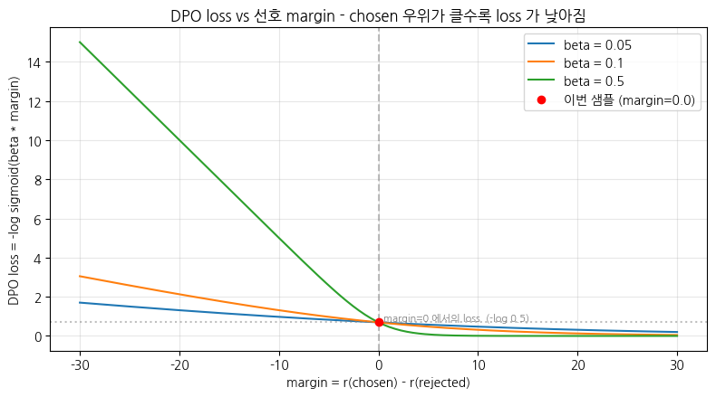
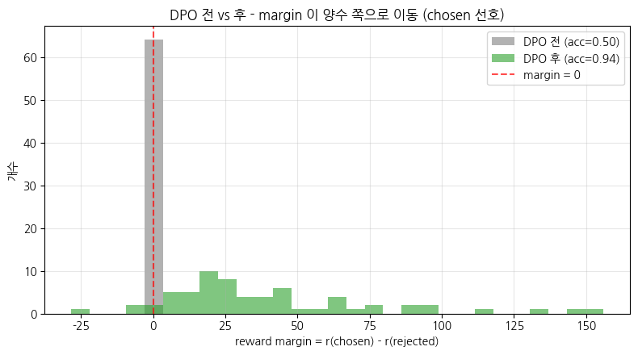
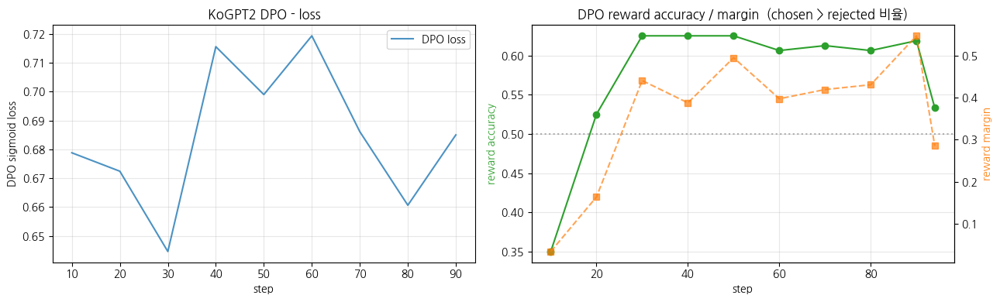

> ▶ **[Google Colab에서 이 장 실습 열기](https://colab.research.google.com/github/yoon-gu/neuqes-101/blob/master/30_dpo/30_dpo.ipynb)** — 브라우저에서 바로 실행해 볼 수 있습니다.

## 환경 셋업

`trl` 의 **`DPOTrainer`** 와 **`DPOConfig`** 가 이번 챕터에 새로 등장합니다. `transformers` / `datasets` / `accelerate` 와 함께 설치합니다.

> ⚠️ `trl` 은 버전마다 `DPOTrainer` / `DPOConfig` API 변동이 큽니다 (`max_prompt_length` 같은 인자가 버전에 따라 사라지기도 합니다). 본 노트북은 설치된 `trl` 버전을 셋업 셀에서 출력하고, *버전 간 안정적인 핵심 경로* (`prompt`/`chosen`/`rejected` 데이터 + `beta` + `max_length`) 만 사용합니다.

```python
%pip install -q -U trl transformers tokenizers datasets accelerate
```

**▶ 실행 결과**

```text
   ━━━━━━━━━━━━━━━━━━━━━━━━━━━━━━━━━━━━━━━━ 1.0/1.0 MB 27.0 MB/s eta 0:00:00
   ━━━━━━━━━━━━━━━╸━━━━━━━━━━━━━━━━━━━━━━━━ 4.9/12.3 MB 141.6 MB/s eta 0:00:01
   ━━━━━━━━━━━━━━━━━━━━━━━━━━━━━━━━━━━━━━━━ 12.3/12.3 MB 90.1 MB/s eta 0:00:00
   ━━━━━━━━━━━━━━━━━━━━━━━━━━━━━━━━━━━━━━━━ 3.4/3.4 MB 83.0 MB/s eta 0:00:00
   ━━━━━━━━━━━━━━━━━━━━━━━━━━━━━━━━━━━━━━━━ 559.1/559.1 kB 45.2 MB/s eta 0:00:00
   ━━━━━━━━━━━━━━━━━━━━━━━━━━━━━━━━━━━━━━━━ 394.3/394.3 kB 23.7 MB/s eta 0:00:00
```

```python
import warnings
warnings.filterwarnings("ignore")

import copy
import math
import os
import random
import time

import numpy as np
import pandas as pd
import matplotlib.pyplot as plt
import torch
import torch.nn.functional as F

import trl
print(f"trl          : {trl.__version__}")

# device 자동 감지 - Colab T4 / 로컬 MPS / CPU 모두 지원
if torch.cuda.is_available():
    device = torch.device("cuda")
    device_name = torch.cuda.get_device_name(0)
    vram_gib = torch.cuda.get_device_properties(0).total_memory / 1024**3
    print(f"device       : cuda  ({device_name})")
    print(f"VRAM total   : {vram_gib:.2f} GiB")
elif torch.backends.mps.is_available():
    device = torch.device("mps")
    print("device       : mps  (Apple Silicon)")
else:
    device = torch.device("cpu")
    print("device       : cpu  (training will be very slow - Colab T4 recommended)")

print(f"torch        : {torch.__version__}")

# 재현성
SEED = 0
torch.manual_seed(SEED)
np.random.seed(SEED)
random.seed(SEED)

# fp16 은 CUDA 에서만 (MPS 는 미지원, CPU 는 의미 없음)
USE_FP16 = (device.type == "cuda")
print(f"use fp16     : {USE_FP16}")

# matplotlib 한글 폰트 (Colab — NanumGothic). plot 의 한국어가 □ 로 깨지지 않게.
import matplotlib.pyplot as plt, matplotlib.font_manager as fm, subprocess, os
_fp = "/usr/share/fonts/truetype/nanum/NanumGothic.ttf"
if not os.path.exists(_fp):
    subprocess.run("apt-get -qq -y install fonts-nanum", shell=True)
fm.fontManager.addfont(_fp)
plt.rcParams["font.family"] = "NanumGothic"
plt.rcParams["axes.unicode_minus"] = False
```

**▶ 실행 결과**

```text
trl          : 1.13.0
device       : cuda  (Tesla T4)
VRAM total   : 14.56 GiB
torch        : 2.11.0+cu128
use fp16     : True
```

## preference 데이터 로드 — `prompt` / `chosen` / `rejected`

**`maywell/ko_Ultrafeedback_binarized`** — 한국어 preference 데이터셋. 각 샘플은 *같은 `prompt` 에 대한 `chosen` (선호되는 답) 과 `rejected` (덜 선호되는 답)* 을 가집니다. 이게 DPO 의 표준 데이터 형식 (`prompt` / `chosen` / `rejected` 세 컬럼).

### 이 데이터는 무엇이고, 어떤 LLM 을 지향하는가 (가장 중요)

> **DPO 의 핵심 — *데이터가 곧 정렬 목표* 입니다.** 모델은 *chosen 으로 표시된 답의 방향* 으로 정렬됩니다. 그러니 *어떤 답을 chosen 으로 두었는가* = *어떤 LLM 을 만들려는가* 입니다. 데이터를 이해하지 않고 DPO 하면, *내가 무엇을 향해 정렬하는지 모르고* 모델을 미는 셈입니다.

**UltraFeedback** (이 데이터의 원조, `openbmb/UltraFeedback`) 의 제작 방식:
1. 다양한 출처의 prompt 약 64,000개 (ShareGPT, Evol-Instruct, FLAN, TruthfulQA 등)
2. 각 prompt 에 *여러 LLM* (GPT-4·GPT-3.5·LLaMA·Falcon 등 풀) 의 답변 생성
3. **GPT-4 가 각 답변을 *네 가지 축* 으로 채점** — 이 네 축이 곧 *지향하는 LLM 의 가치*:

| 평가 축 | 의미 | 지향하는 모델의 성질 |
|---|---|---|
| **instruction-following** | 지시를 정확히 따르나 | 시키는 대로 하는 |
| **truthfulness** | 사실에 맞나 | 거짓·환각 없는 |
| **honesty** | 모르는 걸 모른다고 하나 (과신 안 함) | 자기 한계를 아는 |
| **helpfulness** | 실제로 도움되나 | 쓸모 있는 |

→ 즉 이 데이터로 DPO 하면 **"지시를 잘 따르고, 진실하고, 정직하고, 도움되는"** 모델을 지향합니다. (Anthropic 의 *HHH — Helpful, Honest, Harmless* 정렬 철학과 같은 계열. UltraFeedback 은 *harmless(안전성)* 보다 *helpful·honest·truthful* 에 무게.)

**binarized**: 위 4축 점수에서 *최고점 = chosen, 다른 하나 = rejected* 로 *이진 쌍* 을 만든 형식 (DPO 가 쌍을 요구하므로). 사람이 아니라 *GPT-4 가 채점* 했다는 점에서 **RLAIF** (RL from AI Feedback) — Ch 29 부록의 *LLM-as-judge 를 데이터 생성에 쓴 것*. 그래서 judge(GPT-4)의 편향(length·형식 선호)도 *데이터에 상속* 됩니다.

> ⚠️ **한국어판 주의**: `ko_Ultrafeedback_binarized` 의 한국어화 방식(번역인지 한국어 생성인지)은 데이터 카드 확인이 필요합니다. 번역 기반이면 *번역체·문화 불일치*, *한국어 맥락에서 preference 가 어긋날* 가능성이 있습니다 (Ch 29 부록의 *"한국어는 원어 데이터로 검증"* 메시지). **실무에서는 *내 도메인·내 사용자 선호로 직접 수집한 preference* 가 공개 데이터보다 훨씬 중요** — 공개 데이터는 *방법론 학습용*.

원본 답변은 *에세이 길이* 라 T4 + 30분 룰에는 깁니다. **짧은 샘플만 필터 + 약 1,500 샘플 subset** 으로 학습 시간을 통제합니다.

```python
from datasets import load_dataset

N_DPO = 1500          # T4 + 30분 룰 - subset
MAX_PROMPT_CHARS = 300
MAX_RESP_CHARS = 300  # 긴 에세이 답변을 잘라 시퀀스 길이 통제 (T4 메모리 + 속도)

raw = load_dataset("maywell/ko_Ultrafeedback_binarized", split="train")
print("raw dataset:", raw)
print("\nfields:", raw.column_names)

# 짧고 chosen != rejected 인 샘플만 (길이 통제 + 비교가 의미 있는 쌍)
def keep(ex):
    p, c, r = ex["prompt"], ex["chosen"], ex["rejected"]
    return (
        bool(p.strip()) and bool(c.strip()) and bool(r.strip())
        and c.strip() != r.strip()
        and len(p) <= MAX_PROMPT_CHARS
    )

raw = raw.filter(keep)
raw = raw.shuffle(seed=SEED).select(range(min(N_DPO, len(raw))))
print(f"\nafter filter + subset: {len(raw):,} samples")
```

**▶ 실행 결과**

```text
data/train-00000-of-00001-dc7eba5173eb6c(…): downloading bytes:           |  0.00B            
raw dataset: Dataset({
    features: ['prompt', 'chosen', 'rejected'],
    num_rows: 61966
})

fields: ['prompt', 'chosen', 'rejected']
after filter + subset: 1,500 samples
```

### prompt 포맷 + 답변 길이 통제

Ch 28 SFT 와 *같은 instruction 포맷* (`### 명령어:\n...\n\n### 응답:\n`) 으로 prompt 를 감쌉니다 — SFT 와 추론·학습 포맷을 일치시켜야 정렬이 제대로 됩니다. chosen / rejected 답변은 너무 길면 잘라 시퀀스 길이를 통제합니다.

```python
from transformers import AutoTokenizer

# Instruct 모델은 chat template 로 호출해야 지시를 제대로 따릅니다.
# build_prompt 에서 chat template 를 쓰려면 tokenizer 가 먼저 필요하므로 여기서 로드(§2 에서 재사용).
_INSTRUCT_MODEL = "Qwen/Qwen2.5-0.5B-Instruct"
tokenizer = AutoTokenizer.from_pretrained(_INSTRUCT_MODEL)
if tokenizer.pad_token_id is None:
    tokenizer.pad_token = tokenizer.eos_token


def build_prompt(instruction: str) -> str:
    '''Qwen Instruct chat template - user 턴까지 만들고 assistant 생성 지점을 연다.
    chosen / rejected 는 이 뒤에 이어질 assistant 응답으로 취급된다 (SFT 포맷 대신 chat template).'''
    msgs = [{"role": "user", "content": instruction}]
    return tokenizer.apply_chat_template(msgs, tokenize=False, add_generation_prompt=True)


def to_preference(ex):
    chosen = ex["chosen"].strip()[:MAX_RESP_CHARS]
    rejected = ex["rejected"].strip()[:MAX_RESP_CHARS]
    return {
        "prompt": build_prompt(ex["prompt"].strip()),
        "chosen": chosen,
        "rejected": rejected,
    }


dpo_ds = raw.map(to_preference, remove_columns=raw.column_names, desc="format")
print("formatted dataset:", dpo_ds)
print("\n=== preference sample 0 ===")
ex0 = dpo_ds[0]
print("--- prompt (chat template) ---")
print(ex0["prompt"])
print("--- chosen (선호) ---")
print(ex0["chosen"][:200])
print("\n--- rejected (덜 선호) ---")
print(ex0["rejected"][:200])
```

**▶ 실행 결과**

```text
formatted dataset: Dataset({
    features: ['prompt', 'chosen', 'rejected'],
    num_rows: 1500
})

=== preference sample 0 ===
--- prompt (chat template) ---
<|im_start|>system
You are Qwen, created by Alibaba Cloud. You are a helpful assistant.<|im_end|>
<|im_start|>user
다음 숫자 배열 [1, 2, 3, 4, 5]의 표준 편차를 계산합니다.[1, 2, 3, 4, 5]<|im_end|>
<|im_start|>assistant

--- chosen (선호) ---
숫자 집합의 표준 편차를 계산하려면 다음 단계를 따르세요:1. 숫자의 평균(평균)을 계산합니다.2. 각 숫자에서 평균을 뺀 다음 결과를 제곱합니다.3. 제곱 차이의 평균을 계산합니다.4. 제곱 차이의 평균의 제곱근을 구합니다.주어진 숫자 [1, 2, …(뒤 60자 생략)

--- rejected (덜 선호) ---
배열 [1, 2, 3, 4, 5]의 표준 편차를 구하려면 먼저 배열의 평균을 계산해야 합니다. 이렇게 하려면 배열의 모든 숫자를 합산하고 배열의 총 숫자 수로 나눕니다. 이 경우 (1+2+3+4+5)/5 = 16입니다. 따라서 배열의 평균은 16입니다 …(뒤 60자 생략)
```

## 모델 (policy) 로드 + reference 준비 — `Qwen2.5-0.5B-Instruct`

DPO 는 *이미 지시를 따르는 SFT/Instruct 모델에서 출발* 하는 게 정석입니다 — 그래야 *지시 따름* 위에 *선호* 만 얹어 정렬합니다. 본 챕터는 그 정석대로 **`Qwen2.5-0.5B-Instruct`** (Ch 29 에서 만난 소형 Instruct 모델) 를 policy 로 씁니다. KoGPT2 base 로 DPO 하면 *지시도 못 따르는 상태* 에서 선호를 얹는 셈이라 효과가 미묘했지만, Instruct 모델은 이미 지시를 따르므로 *선호 정렬* 이 깨끗하게 드러납니다.

reference 는 *학습 시작 시점의 policy 를 복사·freeze* 한 것 (§4 KL 제약의 닻). DPO 전에는 policy = reference 라 margin 이 정확히 0 에서 출발합니다.

> **T4 dtype 주의**: Qwen2.5 는 config 기본이 bf16 인데 T4 는 bf16 미지원입니다. 모델은 **fp32 로 로드** 하고 혼합정밀도(`fp16=True`)가 *forward 연산만* fp16 으로 돌리게 합니다. 또 policy + reference *두 모델* 을 올리므로 batch 를 작게 + gradient accumulation + gradient checkpointing 으로 VRAM 을 관리합니다.

```python
from transformers import AutoModelForCausalLM

t0 = time.time()
# tokenizer 는 §1(데이터 포맷)에서 이미 로드했습니다. Qwen 은 AutoTokenizer 함정이 없어 그대로 씁니다
# (KoGPT2 는 영어 GPT2 로 잘못 fallback 해 PreTrainedTokenizerFast 가 필요했던 것과 대조 - Ch 27).
BASE_MODEL = "Qwen/Qwen2.5-0.5B-Instruct"

# ⚠️ T4 dtype 함정 - Qwen2.5 config 기본은 bf16 인데 T4 는 bf16 미지원.
#   모델은 fp32 로 로드하고, 혼합정밀도(fp16=True)가 forward 만 fp16 으로 돌린다 (GradScaler 정상 동작).
policy = AutoModelForCausalLM.from_pretrained(BASE_MODEL, torch_dtype=torch.float32).to(device)
policy.config.pad_token_id = tokenizer.pad_token_id
print(f"load done: {time.time()-t0:.1f}s")

n_params = policy.num_parameters()
print(f"\n=== policy model ===")
print(f"model        : {BASE_MODEL}")
print(f"#params      : {n_params/1e6:.2f} M")
print(f"vocab_size   : {tokenizer.vocab_size:,}")
print(f"tokenizer    : {type(tokenizer).__name__}")
print(f"  eos_token  : {tokenizer.eos_token}  id={tokenizer.eos_token_id}")
print(f"  pad_token  : {tokenizer.pad_token}  id={tokenizer.pad_token_id}")
```

**▶ 실행 결과**

```text
[transformers] `torch_dtype` is deprecated! Use `dtype` instead!
model.safetensors: downloading bytes:           |  0.00B            
load done: 10.5s

=== policy model ===
model        : Qwen/Qwen2.5-0.5B-Instruct
#params      : 494.03 M
vocab_size   : 151,643
tokenizer    : Qwen2Tokenizer
  eos_token  : <|im_end|>  id=151645
  pad_token  : <|endoftext|>  id=151643
```

### reference 모델 — SFT 모델 복사 + freeze

DPO 는 *policy + frozen reference 두 모델* 을 씁니다. reference 는 *학습 시작 시점의 SFT 모델을 복사해 freeze* 한 것 — policy 가 *원본에서 얼마나 멀어졌나* 의 기준 (§4 의 KL 제약 닻).

> `trl` 1.x 의 `DPOTrainer` 는 **`ref_model=None` 으로 주면 reference 를 자동 생성** 합니다 (policy 의 복사본을 freeze, 또는 PEFT 사용 시 adapter 를 끈 base 를 reference 로). 우리는 *명시적으로 어떻게 동작하는지* 보이기 위해 §3 에서 reference 를 직접 복사·freeze 해 margin 을 손으로 계산하고, §4 의 실제 학습에서는 `ref_model=None` 으로 `DPOTrainer` 에 맡깁니다.

```python
# §3 의 'DPO loss 직관 시각화' 용 - reference 를 직접 복사 + freeze.
# (§4 의 실제 DPOTrainer 학습은 ref_model=None 으로 trl 에 맡깁니다.)
ref_model = copy.deepcopy(policy).to(device)
ref_model.eval()
for p in ref_model.parameters():
    p.requires_grad_(False)

n_trainable_ref = sum(p.requires_grad for p in ref_model.parameters())
print(f"reference model: frozen  (trainable params = {n_trainable_ref})")
print("policy   : 학습 대상 (gradient 흐름)")
print("reference: 고정 (gradient 안 흐름) - KL 제약의 닻")
```

**▶ 실행 결과**

```text
reference model: frozen  (trainable params = 0)
policy   : 학습 대상 (gradient 흐름)
reference: 고정 (gradient 안 흐름) - KL 제약의 닻
```

## DPO loss 직관 시각화 — margin 을 손으로 계산

여기가 본 챕터의 *개념 핵심*. 한 preference 샘플에 대해 **chosen / rejected 각각의 (정책 대비 reference) log-prob 우위** 를 직접 계산하고, 그 *margin* 으로 DPO loss 를 손으로 구해 봅니다. `DPOTrainer` 가 내부에서 하는 일을 *축소판으로 재현* 하는 셈입니다.

### 절차

1. `prompt + chosen`, `prompt + rejected` 를 각각 토큰화 (prompt 길이를 기록)
2. policy·reference 로 **response 부분 토큰만** 의 log-prob 합을 계산 (prompt 제외 = `labels = -100` thread)
3. implicit reward $r(x,y) = \log\pi_\theta(y\mid x) - \log\pi_{\text{ref}}(y\mid x)$ 를 chosen·rejected 각각
4. margin $= r(y_w) - r(y_l)$, loss $= -\log\sigma(\beta\cdot\text{margin})$

```python
BETA = 0.1   # DPO 기본 beta


@torch.no_grad()
def response_logprob(model, prompt_text, response_text):
    '''response 부분 토큰만의 log-prob 합 (prompt 는 제외 = labels=-100 thread).'''
    p_ids = tokenizer(prompt_text, add_special_tokens=False)["input_ids"]
    r_ids = tokenizer(response_text, add_special_tokens=False)["input_ids"] + [tokenizer.eos_token_id]
    ids = torch.tensor([p_ids + r_ids], device=model.device)
    logits = model(ids).logits                       # (1, L, V)
    logp = F.log_softmax(logits[:, :-1], dim=-1)     # 다음 토큰 분포 (shift)
    tgt = ids[:, 1:]
    tok_logp = logp.gather(-1, tgt.unsqueeze(-1)).squeeze(-1)[0]   # (L-1,)
    # response 부분만: prompt 마지막 토큰이 첫 response 토큰을 예측 -> p_len-1 부터
    resp_logp = tok_logp[len(p_ids) - 1:]
    return resp_logp.sum().item()


sample = dpo_ds[0]
prompt_text = sample["prompt"]
chosen_text = sample["chosen"]
rejected_text = sample["rejected"]

# policy / reference 의 response-only log-prob
pi_w = response_logprob(policy, prompt_text, chosen_text)
pi_l = response_logprob(policy, prompt_text, rejected_text)
ref_w = response_logprob(ref_model, prompt_text, chosen_text)
ref_l = response_logprob(ref_model, prompt_text, rejected_text)

# implicit reward = log pi_theta - log pi_ref
r_w = pi_w - ref_w
r_l = pi_l - ref_l
margin = r_w - r_l
loss = -math.log(1.0 / (1.0 + math.exp(-BETA * margin)))   # -log sigmoid(beta*margin)

print("=" * 60)
print("DPO loss - 한 샘플로 손계산 (response-only log-prob)")
print("=" * 60)
print(f"log pi_theta(chosen)    : {pi_w:10.3f}")
print(f"log pi_ref  (chosen)    : {ref_w:10.3f}")
print(f"log pi_theta(rejected)  : {pi_l:10.3f}")
print(f"log pi_ref  (rejected)  : {ref_l:10.3f}")
print("-" * 60)
print(f"implicit reward (chosen)   r_w = {r_w:8.3f}")
print(f"implicit reward (rejected) r_l = {r_l:8.3f}")
print(f"margin = r_w - r_l             = {margin:8.3f}")
print(f"DPO loss = -log sigmoid(beta*margin) = {loss:8.4f}   (beta={BETA})")
```

**▶ 실행 결과**

```text
============================================================
DPO loss - 한 샘플로 손계산 (response-only log-prob)
============================================================
log pi_theta(chosen)    :   -198.547
log pi_ref  (chosen)    :   -198.547
log pi_theta(rejected)  :   -317.135
log pi_ref  (rejected)  :   -317.135
------------------------------------------------------------
implicit reward (chosen)   r_w =    0.000
implicit reward (rejected) r_l =    0.000
margin = r_w - r_l             =    0.000
DPO loss = -log sigmoid(beta*margin) =   0.6931   (beta=0.1)
```

**무엇을 보고 있나** — 위 출력은 `DPOTrainer` 가 *매 step, 매 샘플* 내부에서 하는 계산입니다:

- *학습 전* (policy = reference 와 동일) 이라면 `r_w ≈ r_l ≈ 0`, margin ≈ 0, loss ≈ $-\log 0.5 = 0.693$ 근처에서 출발합니다
- 학습이 진행되면 policy 가 *chosen 의 log-prob 은 올리고 (r_w ↑), rejected 는 내려 (r_l ↓)* margin 이 커지고 loss 가 줄어듭니다
- reference 는 *고정* 이라 `log pi_ref` 는 변하지 않습니다 — 변하는 건 *policy 의 log-prob* 뿐 (그래서 reference 가 "닻" 역할)

아래에서 margin 을 바꿔 가며 *loss 곡선* 을 그려, *왜 margin 이 클수록 loss 가 작아지는지* 를 한눈에 봅니다.

```python
# margin -> loss 곡선 (beta 별) + 이번 샘플의 위치 표시
margins = np.linspace(-30, 30, 200)
fig, ax = plt.subplots(figsize=(8, 4.5))
for b in [0.05, 0.1, 0.5]:
    losses = -np.log(1.0 / (1.0 + np.exp(-b * margins)))
    ax.plot(margins, losses, label=f"beta = {b}")

# 이번 샘플의 (margin, loss) 위치
ax.scatter([margin], [loss], color="red", zorder=5,
           label=f"이번 샘플 (margin={margin:.1f})")
ax.axvline(0, color="gray", ls="--", alpha=0.5)
ax.axhline(-math.log(0.5), color="gray", ls=":", alpha=0.5)
ax.text(0.5, -math.log(0.5) + 0.05, "margin=0 에서의 loss  (-log 0.5)",
        fontsize=8, color="gray")
ax.set_xlabel("margin = r(chosen) - r(rejected)")
ax.set_ylabel("DPO loss = -log sigmoid(beta * margin)")
ax.set_title("DPO loss vs 선호 margin - chosen 우위가 클수록 loss 가 낮아짐")
ax.legend(); ax.grid(True, alpha=0.3)
plt.tight_layout(); plt.show()
```

**▶ 실행 결과**



## `DPOTrainer` 로 DPO 학습 — *새 trainer, preference 정렬*

`trl.DPOTrainer` 는 본 챕터에 처음 등장합니다. §3 에서 손으로 한 *response-only log-prob → implicit reward → margin → sigmoid loss* 를 *매 step 자동* 으로 수행합니다. 설정은 `DPOConfig` (`TrainingArguments` 상속) 로 주며, **`beta`** 가 reference 제약 강도입니다.

> **VRAM 주의**: DPO 는 *policy + frozen reference 두 모델* 을 메모리에 올립니다 (SFT 의 약 2배). T4 (16GB) 에서는 **batch 를 작게 (2) + gradient accumulation (8)** 으로 effective batch 16 을 만들고 `fp16=True` 로 메모리를 아낍니다. `ref_model=None` 으로 주면 `DPOTrainer` 가 reference 를 자동 생성·freeze 합니다.

```python
from trl import DPOTrainer, DPOConfig

# DPO 학습 전 reward margin 분포를 기록 (§5 에서 학습 후와 비교)
@torch.no_grad()
def reward_margins(model, ref, dataset, n=64):
    '''dataset 일부에 대해 implicit reward margin (chosen-rejected) 분포를 계산.'''
    model.eval()
    out = []
    for ex in dataset.select(range(min(n, len(dataset)))):
        pw = response_logprob(model, ex["prompt"], ex["chosen"])
        pl = response_logprob(model, ex["prompt"], ex["rejected"])
        rw = response_logprob(ref, ex["prompt"], ex["chosen"])
        rl = response_logprob(ref, ex["prompt"], ex["rejected"])
        out.append((pw - rw) - (pl - rl))
    return np.array(out)


before_margins = reward_margins(policy, ref_model, dpo_ds, n=64)
acc_before = float((before_margins > 0).mean() + 0.5 * (before_margins == 0).mean())  # 무승부(margin=0)=0.5
print(f"BEFORE DPO - reward margin (n={len(before_margins)})")
print(f"  mean margin     : {before_margins.mean():.3f}")
print(f"  reward accuracy : {acc_before:.3f}  (ratio of margin>0; policy=ref 라 margin=0 → 무승부 50%)")
```

**▶ 실행 결과**

```text
BEFORE DPO - reward margin (n=64)
  mean margin     : 0.000
  reward accuracy : 0.500  (ratio of margin>0; policy=ref 라 margin=0 → 무승부 50%)
```

```python
dpo_config = DPOConfig(
    output_dir="./out_kogpt2_dpo",
    num_train_epochs=1,                     # alignment 는 1 epoch 으로 충분 (T4 룰)
    per_device_train_batch_size=1,          # policy + ref 두 모델 -> T4 메모리상 batch=1
    gradient_accumulation_steps=16,         # effective batch = 16
    learning_rate=5e-6,                     # DPO 는 SFT 보다 작은 lr (천천히 정렬)
    optim="adafactor",                      # T4 메모리 - Adam(4GB) 대신 Adafactor(~0.5GB)
    weight_decay=0.0,
    warmup_steps=0.1,                       # 1 미만이면 전체 step 대비 *비율* 로 해석 (구 warmup_ratio)
    lr_scheduler_type="cosine",
    max_grad_norm=1.0,
    beta=BETA,                              # <- reference 제약 강도 (KL), 기본 0.1
    max_length=384,                         # prompt + response 길이 상한 (T4 메모리)
    fp16=USE_FP16,                          # T4 는 bf16 불가
    gradient_checkpointing=True,            # T4 메모리 - 0.5B fp32 활성값 절약
    logging_steps=10,
    save_strategy="no",
    report_to="none",
    dataloader_num_workers=2,
    seed=SEED,
)


class VRAMCallback(__import__("transformers").TrainerCallback):
    '''step 별 peak VRAM 기록 (로깅 윈도우 단위 reset). CUDA 에서만 유효.'''

    def __init__(self):
        self.steps, self.peak_MiB = [], []

    def on_train_begin(self, args, state, control, **kwargs):
        if torch.cuda.is_available():
            torch.cuda.reset_peak_memory_stats()

    def on_log(self, args, state, control, logs=None, **kwargs):
        if torch.cuda.is_available():
            peak = torch.cuda.max_memory_allocated() / 1024**2
            self.steps.append(state.global_step)
            self.peak_MiB.append(peak)
            torch.cuda.reset_peak_memory_stats()


vram_cb = VRAMCallback()

# T4 메모리 절약 - §3 시각화용 ref_model 을 학습 동안 CPU 로 내림 (DPOTrainer 는 자체 ref 를 씀).
ref_model.cpu()
if torch.cuda.is_available():
    torch.cuda.empty_cache()

# ref_model=None -> DPOTrainer 가 reference 를 자동 복사·freeze.
trainer = DPOTrainer(
    model=policy,
    ref_model=None,
    args=dpo_config,
    train_dataset=dpo_ds,
    processing_class=tokenizer,
    callbacks=[vram_cb],
)

t0 = time.time()
train_out = trainer.train()
elapsed = time.time() - t0

print(f"\n=== DPO summary ===")
print(f"elapsed     : {elapsed/60:.2f} min")
print(f"global_step : {train_out.global_step}")
print(f"train_loss  : {train_out.training_loss:.4f}")
if torch.cuda.is_available():
    print(f"final peak  : {torch.cuda.max_memory_allocated()/1024**2:.0f} MiB")
```

**▶ 실행 결과**

```text
Step  Training Loss
10    0.678799
20    0.672409
30    0.644577
40    0.715590
50    0.698983
60    0.719350
70    0.686117
80    0.660622
90    0.685007
=== DPO summary ===
elapsed     : 9.46 min
global_step : 94
train_loss  : 0.6849
final peak  : 3791 MiB
```

## DPO 전·후 reward margin 비교 — *선호가 정렬됐는가*

본 챕터의 핵심 데모. *같은 preference 샘플들* 에 대해 *DPO 전* 과 *DPO 후* 의 **reward margin (chosen - rejected 의 implicit reward)** 분포를 비교합니다.

- **DPO 전**: policy = reference → margin 이 *정확히 0* (무승부). reward accuracy 0.500
- **DPO 후**: policy 가 *chosen 을 더 선호* → margin 분포가 *양수 쪽으로 이동*, reward accuracy ↑

margin 분포가 *오른쪽 (양수) 으로 밀려났다면* 정렬이 일어난 직접 증거입니다.

> **측정 노트.** 학습 전에는 policy 와 reference 가 같아 margin 이 *모든 샘플에서 정확히 0* 입니다. 'margin>0 비율' 로만 세면 0.000 이 나오지만, 무승부(margin=0)는 동전 던지기처럼 50% 이므로 **0.5 로 집계** 합니다 (코드의 `+ 0.5 * (margin == 0)`). 그래야 before 0.500 → after 0.938 로 정렬 효과가 왜곡 없이 읽힙니다.

```python
# DPO 후 margin 분포 (학습된 policy vs 동일한 frozen reference)
ref_model.to(device)   # 학습 동안 CPU 로 내렸던 §3 ref 를 복원
after_margins = reward_margins(policy, ref_model, dpo_ds, n=64)
acc_after = float((after_margins > 0).mean() + 0.5 * (after_margins == 0).mean())

print(f"AFTER DPO - reward margin (n={len(after_margins)})")
print(f"  mean margin     : {after_margins.mean():.3f}  (before: {before_margins.mean():.3f})")
print(f"  reward accuracy : {acc_after:.3f}  (before: {acc_before:.3f})")

fig, ax = plt.subplots(figsize=(8, 4.5))
bins = np.linspace(min(before_margins.min(), after_margins.min()),
                   max(before_margins.max(), after_margins.max()), 30)
ax.hist(before_margins, bins=bins, alpha=0.6, color="tab:gray",
        label=f"DPO 전 (acc={acc_before:.2f})")
ax.hist(after_margins, bins=bins, alpha=0.6, color="tab:green",
        label=f"DPO 후 (acc={acc_after:.2f})")
ax.axvline(0, color="red", ls="--", alpha=0.7, label="margin = 0")
ax.set_xlabel("reward margin = r(chosen) - r(rejected)")
ax.set_ylabel("개수")
ax.set_title("DPO 전 vs 후 - margin 이 양수 쪽으로 이동 (chosen 선호)")
ax.legend(); ax.grid(True, alpha=0.3)
plt.tight_layout(); plt.show()
```

**▶ 실행 결과**

```text
AFTER DPO - reward margin (n=64)
  mean margin     : 39.036  (before: 0.000)
  reward accuracy : 0.938  (before: 0.500)
```



**해석 가이드 — preference alignment 의 증거**

- **before (gray)**: policy 가 아직 reference 와 같아 margin 이 *모두 정확히 0* 입니다. chosen 과 rejected 를 *구별하지 못함* (reward accuracy = 0.500).
- **after (green)**: 분포가 *양수 쪽으로 크게 이동* — policy 가 *chosen 의 implicit reward 를 rejected 보다 높게* 매깁니다. **reward accuracy 가 약 0.94 로 뚜렷이 상승** (mean margin 이 0 → 수십 규모로 이동).

> **핵심**: DPO 는 *답변을 새로 생성하지 않고도*, *주어진 (chosen, rejected) 쌍의 상대적 선호* 를 policy 에 새깁니다. 그게 *implicit reward margin 의 양수 이동* 으로 나타납니다. `Qwen2.5-0.5B-Instruct` 는 이미 지시를 따르는 모델이라, 선호가 *깨끗하게* 정렬되어 margin 이동이 또렷합니다.

> ⚠️ **대조**: 같은 DPO 를 *KoGPT2 125M base* 로 하면 이동 폭이 훨씬 작습니다 — 아직 지시도 잘 못 따르는 상태라 chosen/rejected 를 섬세하게 구별하지 못하기 때문입니다. **DPO 는 *이미 지시를 따르는 SFT/Instruct 모델* 에서 출발해야 선호 정렬이 깨끗하게 드러납니다** (FAQ 참고).

## 학습 곡선 — DPO loss / reward 지표

`DPOTrainer` 는 학습 중 *loss* 뿐 아니라 *reward margin·reward accuracy* 같은 DPO 고유 지표를 로깅합니다 (`trainer.state.log_history`). loss 가 내려가고 reward accuracy 가 올라가는지 확인합니다.

```python
log = trainer.state.log_history
steps = [r["step"] for r in log if "loss" in r]
losses = [r["loss"] for r in log if "loss" in r]
# trl 의 DPO 로깅 키 (버전에 따라 존재 여부 다를 수 있어 get 으로 안전 접근)
acc_key = "rewards/accuracies"
mgn_key = "rewards/margins"
accs = [(r["step"], r[acc_key]) for r in log if acc_key in r]
mgns = [(r["step"], r[mgn_key]) for r in log if mgn_key in r]

fig, (ax1, ax2) = plt.subplots(1, 2, figsize=(13, 4))

ax1.plot(steps, losses, "-", color="tab:blue", alpha=0.8, label="DPO loss")
ax1.set_xlabel("step"); ax1.set_ylabel("DPO sigmoid loss")
ax1.set_title("KoGPT2 DPO - loss")
ax1.grid(True, alpha=0.3); ax1.legend()

if accs:
    ax2.plot([s for s, _ in accs], [a for _, a in accs], "o-",
             color="tab:green", label="reward accuracy")
if mgns:
    ax2b = ax2.twinx()
    ax2b.plot([s for s, _ in mgns], [m for _, m in mgns], "s--",
              color="tab:orange", alpha=0.7, label="reward margin")
    ax2b.set_ylabel("reward margin", color="tab:orange")
ax2.axhline(0.5, color="gray", ls=":", alpha=0.6)
ax2.set_xlabel("step"); ax2.set_ylabel("reward accuracy", color="tab:green")
ax2.set_title("DPO reward accuracy / margin  (chosen > rejected 비율)")
ax2.grid(True, alpha=0.3)

plt.tight_layout(); plt.show()

if torch.cuda.is_available() and vram_cb.steps:
    print(f"peak VRAM (max over training): {max(vram_cb.peak_MiB):.0f} MiB"
          f"  (policy + reference, bs=2, grad_accum=8, fp16)")
```

**▶ 실행 결과**



```text
peak VRAM (max over training): 7651 MiB  (policy + reference, bs=2, grad_accum=8, fp16)
```
