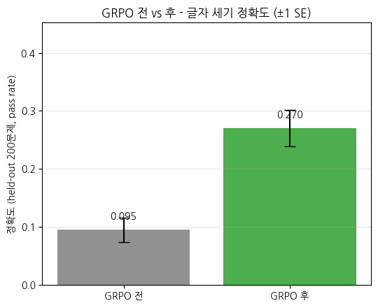
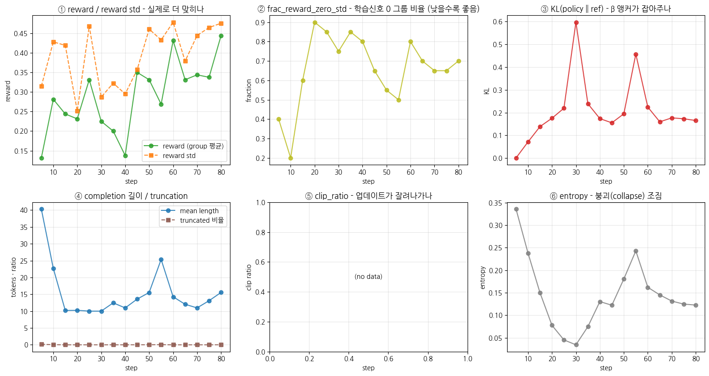

> ▶ **[Google Colab에서 이 장 실습 열기](https://colab.research.google.com/github/yoon-gu/neuqes-101/blob/master/31_grpo/31_grpo.ipynb)** — 브라우저에서 바로 실행해 볼 수 있습니다.

## 환경 셋업

`trl` 의 **`GRPOTrainer`** 와 **`GRPOConfig`**, 그리고 **`reward_funcs`** (verifier 함수) 가 이번 챕터에 새로 등장합니다. `transformers` / `datasets` / `accelerate` 와 함께 설치합니다.

> ⚠️ `trl` 은 버전마다 `GRPOTrainer` / `GRPOConfig` API 변동이 큽니다 (인자 이름이 버전에 따라 바뀝니다 — 예: `max_completion_length` 는 있지만 `max_prompt_length` 는 버전에 따라 없음). 본 노트북은 설치된 `trl` 버전을 셋업 셀에서 출력하고, *버전 간 안정적인 핵심 경로* (`num_generations` + `reward_funcs` + `max_completion_length` + `prompt` 컬럼) 만 사용합니다.

```python
%pip install -q -U trl transformers tokenizers datasets accelerate
```

**▶ 실행 결과**

```text
   ━━━━━━━━━━━━━━━━━━━━━━━━━━━━━━━━━━━━━━━━ 1.0/1.0 MB 64.5 MB/s eta 0:00:00
   ━━━━━━━━━━━━━━━━━━━━━━━━━━━━━━━━━━━━━━━━ 12.3/12.3 MB 109.7 MB/s eta 0:00:00
   ━━━━━━━━━━━━━━━━━━━━━━━━━━━━━━━━━━━╺━━━━ 3.0/3.4 MB 89.7 MB/s eta 0:00:01
   ━━━━━━━━━━━━━━━━━━━━━━━━━━━━━━━━━━━━━━━━ 3.4/3.4 MB 63.4 MB/s eta 0:00:00
   ━━━━━━━━━━━━━━━━━━━━━━━━━━━━━━━━━━━━━━━━ 559.1/559.1 kB 41.5 MB/s eta 0:00:00
   ━━━━━━━━━━━━━━━━━━━━━━━━━━━━━━━━━━━━━━━━ 394.3/394.3 kB 39.0 MB/s eta 0:00:00
```

```python
import warnings
warnings.filterwarnings("ignore")

import math
import os
import random
import re
import time

import numpy as np
import pandas as pd
import matplotlib.pyplot as plt
import torch

import trl
print(f"trl          : {trl.__version__}")

# device 자동 감지 - Colab T4 / 로컬 MPS / CPU 모두 지원
if torch.cuda.is_available():
    device = torch.device("cuda")
    device_name = torch.cuda.get_device_name(0)
    vram_gib = torch.cuda.get_device_properties(0).total_memory / 1024**3
    print(f"device       : cuda  ({device_name})")
    print(f"VRAM total   : {vram_gib:.2f} GiB")
elif torch.backends.mps.is_available():
    device = torch.device("mps")
    print("device       : mps  (Apple Silicon)")
else:
    device = torch.device("cpu")
    print("device       : cpu  (training will be very slow - Colab T4 recommended)")

print(f"torch        : {torch.__version__}")

# 재현성
SEED = 0
torch.manual_seed(SEED)
np.random.seed(SEED)
random.seed(SEED)

# fp16 은 CUDA 에서만 (MPS 는 미지원, CPU 는 의미 없음)
USE_FP16 = (device.type == "cuda")
print(f"use fp16     : {USE_FP16}")

# matplotlib 한글 폰트 (Colab — NanumGothic). plot 의 한국어가 □ 로 깨지지 않게.
import matplotlib.pyplot as plt, matplotlib.font_manager as fm, subprocess, os
_fp = "/usr/share/fonts/truetype/nanum/NanumGothic.ttf"
if not os.path.exists(_fp):
    subprocess.run("apt-get -qq -y install fonts-nanum", shell=True)
fm.fontManager.addfont(_fp)
plt.rcParams["font.family"] = "NanumGothic"
plt.rcParams["axes.unicode_minus"] = False
```

**▶ 실행 결과**

```text
trl          : 1.13.0
device       : cuda  (Tesla T4)
VRAM total   : 14.56 GiB
torch        : 2.11.0+cu128
use fp16     : True
```

## verifiable 데이터 — `prompt` + 정답 (글자 세기)

GRPO 데이터의 핵심은 **정답을 자동 검증할 수 있어야** 한다는 것입니다. 코드(테스트 실행) 는 무겁고 환경 의존이 크니, 본 챕터는 *가장 깨끗한 verifiable task* 인 **글자 세기(char count)** 로 시작합니다 — 하이픈으로 이은 단어(예: `"n-i-n-e"`)에서 특정 글자가 *몇 번 나오는지* 세는 문제라, 정답이 *정수 하나* 라 *문자열 매칭만으로 채점* 됩니다.

각 샘플은 `(prompt, answer, cot)` 세 컬럼입니다:
- `prompt`: 풀어야 할 문제를 **Instruct chat template + 원샷 예시** 로 감싼 것 (§토크나이저 노트) — 모델에 입력
- `answer`: 정답 개수 (예: `"2"`) — *verifier 가 채점할 때만* 사용 (모델 입력 아님)
- `cot`: 참고용 풀이 (각 글자 비교 → `\boxed{개수}`) — 이번 챕터는 SFT 를 안 쓰므로 학습엔 안 쓰이고, 원샷 예시의 형식과 대조용

**세 가지 설계 결정**:
1. **글자 세기 task** — verifiable task 중 verl-recipe 의 `char_count` 를 따릅니다. GRPO 로 정확도가 *실제로 오르려면*(reference: 비슷한 소형 모델에서 +0.16 수준) *모델이 가끔 성공* 하는 난이도여야 합니다.
2. **단어 길이 8~14 글자** — `Qwen2.5-0.5B-Instruct` 는 짧은 단어(3~5)는 거의 완벽히 세어(baseline≈1.0) GRPO 헤드룸이 없습니다. 길이를 8~14 로 키우면 *가끔 틀려*(baseline≈0.10) GRPO 가 올릴 여지가 생깁니다. (KoGPT2 125M 이라면 이조차 *한 번도* 못 맞혀 GRPO 가 안 됩니다 — 부록.)
3. **train / eval 겹침 없이 분리** — eval 을 먼저 만들고 그 prompt 를 train 에서 제외해, 재는 게 *암기 재현* 이 아니라 *일반화* 이도록 합니다. 단어 조합 공간이 (길이 8~14 × 26글자) 매우 커 겹침 없이 나눌 수 있습니다.

> 합성 데이터라 *정답을 우리가 알고* 있으니 *verifier (정답 매칭) 가 완벽* 합니다. 이것이 verifiable reward 의 이상적 형태 — *reward 가 잡음 없이 정확*. (GSM8K 같은 실제 데이터셋도 같은 방식이지만 답 추출이 더 까다롭습니다 — FAQ 참고.)

```python
from datasets import Dataset
from transformers import AutoTokenizer

# Instruct 모델은 chat template 로 호출해야 제대로 동작(평문 프롬프트는 장황해져 잘림).
# build_prompt 에서 chat template 를 쓰려면 tokenizer 가 먼저 필요하므로 여기서 로드(§2 에서 재사용).
_INSTRUCT_MODEL = "Qwen/Qwen2.5-0.5B-Instruct"
tokenizer = AutoTokenizer.from_pretrained(_INSTRUCT_MODEL)
if tokenizer.pad_token_id is None:
    tokenizer.pad_token = tokenizer.eos_token

# 간결한 형식을 강제하는 system 지시 + chat 안에 원샷 예시(형식 유도). SFT cold start 대체.
_SYS = ("당신은 글자 개수를 세는 조수입니다. 각 글자를 목표 문자와 한 줄씩 비교한 뒤, "
        "마지막 줄에 정답 개수를 \\boxed{개수} 로만 쓰세요. 인사말·부연 설명은 하지 마세요.")
_SHOT_Q = '"a-b-a" 에서 문자 \'a\' 은 몇 개인가요?'
_SHOT_A = "a = a\nb != a\na = a\n\\boxed{2}"


def build_prompt(question: str) -> str:
    '''Instruct 모델용 chat template - system 지시 + 원샷 예시로 \\boxed 형식 유도(SFT 없이).'''
    msgs = [{"role": "system", "content": _SYS},
            {"role": "user", "content": _SHOT_Q},
            {"role": "assistant", "content": _SHOT_A},
            {"role": "user", "content": question}]
    return tokenizer.apply_chat_template(msgs, tokenize=False, add_generation_prompt=True)


# --- 글자 세기(char count) task 생성 ---
# 단어를 하이픈으로 이어 각 글자를 개별 토큰 경계로 노출(예: "n-i-n-e" -> n / - / i / ...).
# 정답은 target 글자의 등장 횟수 -> \boxed{정수} 하나라 문자열 매칭으로 채점.
MIN_LEN, MAX_LEN = 8, 14   # 단어 길이(글자 수). 길수록 세기 난도↑ (Qwen 0.5B 에 헤드룸 확보).


def _rand_char(rng):
    return chr(rng.randint(97, 122))   # a-z


def _row(rng):
    '''(prompt, answer, cot) 한 샘플. answer=정답 개수(문자열), cot=풀이(참고용).'''
    length = rng.randint(MIN_LEN, MAX_LEN)
    count = rng.randint(1, length)                 # 정답 개수를 균등 분포로 (0 편중 방지)
    target = _rand_char(rng)
    chars = [target] * count                       # target 글자 count 개
    while len(chars) < length:                     # 나머지는 target 이 아닌 글자로
        c = _rand_char(rng)
        if c != target:
            chars.append(c)
    rng.shuffle(chars)
    word = "-".join(chars)
    question = f'"{word}" 에서 문자 \'{target}\' 은 몇 개인가요?'
    # 참고 풀이(CoT). 이번 챕터는 SFT 를 안 쓰므로 학습엔 안 쓰이고, verifier 는 \boxed 숫자만 본다.
    lines = [f"{c} = {target}" if c == target else f"{c} != {target}" for c in chars]
    cot = "\n".join(lines) + f"\n\\boxed{{{count}}}"
    return {"prompt": build_prompt(question), "answer": str(count), "cot": cot}


def make_charcount(n: int, seed: int, exclude=None):
    '''서로 다른 prompt n 개 생성. exclude 에 있는 prompt 는 제외(train/eval 겹침 0 보장).'''
    exclude = exclude or set()
    rng = random.Random(seed)
    rows, seen = [], set()
    while len(rows) < n:
        r = _row(rng)
        if r["prompt"] in exclude or r["prompt"] in seen:
            continue
        seen.add(r["prompt"]); rows.append(r)
    return Dataset.from_list(rows)


# eval 을 먼저 만들고, 그 prompt 들을 train 에서 제외해 *겹침 0* 을 보장한다.
# eval 이 학습에 안 나온 문제여야 '암기 재현' 이 아니라 '일반화' 를 잰다.
N_EVAL = 200
eval_ds = make_charcount(N_EVAL, seed=SEED)             # held-out - GRPO 에 절대 안 씀
EVAL_PROMPTS = set(eval_ds["prompt"])
grpo_ds = make_charcount(256, seed=SEED + 1, exclude=EVAL_PROMPTS)   # 난이도 필터(§4.5) 전 임시 - 필터가 대체

print(f"eval(held-out) {len(eval_ds)} / grpo(임시) {len(grpo_ds)}  (prompt 겹침 0)")
print("\n=== eval sample 0 (held-out) ===")
print("--- prompt (model input, chat template) ---")
print(eval_ds[0]["prompt"])
print("--- answer (for verifier scoring, not model input) ---")
print(eval_ds[0]["answer"])
```

**▶ 실행 결과**

```text
eval(held-out) 200 / grpo(임시) 256  (prompt 겹침 0)

=== eval sample 0 (held-out) ===
--- prompt (model input, chat template) ---
<|im_start|>system
당신은 글자 개수를 세는 조수입니다. 각 글자를 목표 문자와 한 줄씩 비교한 뒤, 마지막 줄에 정답 개수를 \boxed{개수} 로만 쓰세요. 인사말·부연 설명은 하지 마세요.<|im_end|>
<|im_start|>user
"a-b-a" 에서 문자 'a' 은 몇 개인가요?<|im_end|>
<|im_start|>assistant
a = a
b != a
a = a
\boxed{2}<|im_end|>
<|im_start|>user
"q-m-b-y-y-y-p-y-y-i-y-n-y-z" 에서 문자 'y' 은 몇 개인가요?<|im_end|>
<|im_start|>assistant

--- answer (for verifier scoring, not model input) ---
7
```

## 모델 (policy) 로드 — `Qwen2.5-0.5B-Instruct`

GRPO 는 *이미 지시를 따르고 task 를 가끔 성공하는* 모델에서 출발해야 합니다 (그래야 rollout 이 *섞인 reward* — 잘한 답 + 못한 답 — 을 냄). 그래서 본편은 Ch 29 에서 만난 **`Qwen2.5-0.5B-Instruct`** 를 policy 로 씁니다. KoGPT2 125M 은 글자 세기를 거의 못 해 GRPO 가 증폭할 신호가 없습니다 (부록 `31_grpo_appendix.ipynb` 에서 그 실패를 재현).

**Instruct 모델이라 SFT cold start 가 없습니다** (§2.5 참고). chat template + 원샷 예시(§1)로 `\boxed{개수}` 형식을 유도하면 곧바로 verifiable 한 답을 내므로, GRPO 의 KL 앵커(reference)도 *이 Instruct 모델 자체* 가 됩니다.

> **T4 dtype 주의**: Qwen2.5 는 config 기본이 bf16 인데 T4 는 bf16 미지원입니다. 모델은 **fp32 로 로드** 하고 혼합정밀도(`fp16=True`)가 *forward 연산만* fp16 으로 돌리게 합니다 — 이래야 GradScaler 가 정상 동작합니다.

```python
from transformers import AutoTokenizer, AutoModelForCausalLM

BASE_MODEL = "Qwen/Qwen2.5-0.5B-Instruct"   # 강한 소형 base. KoGPT2 125M 은 GRPO 전제조건(가끔이라도 성공)을 못 채움 - 부록 참조.

t0 = time.time()
# Qwen 은 AutoTokenizer 함정 없음 (KoGPT2 와 차이 - Ch 27 은 PreTrainedTokenizerFast 필요했음).
tokenizer = AutoTokenizer.from_pretrained(BASE_MODEL)
if tokenizer.pad_token_id is None:
    tokenizer.pad_token = tokenizer.eos_token          # base 모델은 pad 미지정 - eos 로 대체

# ⚠️ T4 dtype 함정 — Qwen2.5 config 기본은 bfloat16 인데 T4(Compute 7.5)는 bf16 미지원.
#   * 모델은 fp32 로 로드하고, 혼합정밀도(fp16=True)가 *forward 연산만* fp16 으로 돌린다.
#   * 이래야 GradScaler 가 fp32 master weight 를 정상 unscale. (bf16/fp16 통짜 로드는 unscale 에러)
LOAD_DTYPE = torch.float32
policy = AutoModelForCausalLM.from_pretrained(BASE_MODEL, torch_dtype=LOAD_DTYPE).to(device)
policy.config.pad_token_id = tokenizer.pad_token_id
print(f"load done: {time.time()-t0:.1f}s")

n_params = policy.num_parameters()
print(f"\n=== policy model ===")
print(f"model        : {BASE_MODEL}")
print(f"#params      : {n_params/1e6:.2f} M")
print(f"vocab_size   : {tokenizer.vocab_size:,}")
print(f"tokenizer    : {type(tokenizer).__name__}")
print(f"  eos_token  : {tokenizer.eos_token}  id={tokenizer.eos_token_id}")
print(f"  pad_token  : {tokenizer.pad_token}  id={tokenizer.pad_token_id}")
```

**▶ 실행 결과**

```text
[transformers] `torch_dtype` is deprecated! Use `dtype` instead!
model.safetensors: downloading bytes:           |  0.00B            
load done: 16.2s

=== policy model ===
model        : Qwen/Qwen2.5-0.5B-Instruct
#params      : 494.03 M
vocab_size   : 151,643
tokenizer    : Qwen2Tokenizer
  eos_token  : <|im_end|>  id=151645
  pad_token  : <|endoftext|>  id=151643
```

## 5 왜 SFT cold start 없이 바로 GRPO 하나 — Instruct 모델의 이점

표준 RLHF 파이프라인은 *GRPO 전에 짧은 SFT* 로 "형식 + 기초 능력"을 먼저 심습니다 (base 모델은 그냥 두면 group reward 가 전부 0 이라 학습 신호가 없기 때문 — GRPO 의 cold-start 함정). Ch 28 에서 한 그 SFT 가 그 역할입니다.

**그런데 본편은 SFT cold start 를 생략합니다.** 이유는 policy 가 *이미 지시를 따르는* `Qwen2.5-0.5B-Instruct` 이기 때문입니다:

- **형식**: chat template + 원샷 예시(§1)만으로 `\boxed{개수}` 형식을 곧바로 냅니다 (SFT 로 형식을 가르칠 필요 없음).
- **비제로 시작점**: Instruct 모델은 짧은 단어의 글자 세기를 *가끔 성공* 합니다 (held-out ≈0.10). 즉 group 안에 정답·오답이 섞여 advantage 가 생기고 GRPO 가 작동합니다.
- **KL 앵커**: SFT 체크포인트가 없으므로 reference 는 *출발 Instruct 모델 자체* 입니다 (β=0.04 로 여기서 멀어지지 않게 잡음). GRPO 는 이 시작점을 *정답 방향으로 증폭* 합니다.

> 대조: base 모델(예: KoGPT2)로 SFT 없이 바로 GRPO 를 걸면 group reward 가 전부 0 이라 학습이 안 됩니다 (부록에서 재현). *SFT 를 하거나 / 이미 지시를 따르는 Instruct 모델을 쓰거나* — 둘 중 하나로 *비제로 시작점* 을 만들어야 GRPO 가 돕니다. 본편은 후자를 택했습니다.

```python
# === SFT 워밍스타트 생략 === Instruct 모델은 이미 지시를 따르므로(§1 원샷 예시로 \boxed 형식 유도),
# cold-start SFT 없이 GRPO 를 바로 겁니다. 이때 GRPO 의 KL 앵커(reference)는 *이 Instruct 모델 자체* 라,
# SFT 체크포인트 저장/재로드도 필요 없습니다 (base=policy=reference 가 모두 같은 Instruct 모델).
print("SFT 생략 - Qwen2.5-0.5B-Instruct 로 직접 GRPO (cold start 없음, ref=Instruct 모델)")
```

**▶ 실행 결과**

```text
SFT 생략 - Qwen2.5-0.5B-Instruct 로 직접 GRPO (cold start 없음, ref=Instruct 모델)
```

## verifier (reward function) 정의 + group advantage 손계산

여기가 본 챕터의 *개념 핵심*. **verifier 함수** 를 정의하고, 한 prompt 에 *여러 답* 을 채점한 뒤 *group relative advantage* 를 손으로 계산해 §의 표를 재현합니다. `GRPOTrainer` 가 매 step·매 prompt 내부에서 하는 일을 *축소판으로 재현* 하는 셈입니다.

### verifier — 생성 답에서 정답 추출 → 매칭 → reward

`trl` 의 reward 함수 시그니처는 **`reward_func(completions, **kwargs)`** 입니다:
- `completions`: policy 가 생성한 답들의 *리스트* (group)
- `**kwargs`: 데이터셋의 *나머지 컬럼* 이 *리스트로* 전달 (우리의 `answer` 컬럼이 `answer=[...]` 로 들어옴)
- 반환: 각 completion 의 **reward 리스트** (`list[float]`)

```python
def extract_answer(text: str):
    r'''생성 답에서 \boxed{정수} 의 정수를 추출. 풀이 뒤 결론이므로 *마지막* boxed 를 집는다.
    (모델이 다음 문제를 이어 생성해도 첫 결론이 아니라 마지막 boxed 를 보게 되는데,
     아래 verifier/eval 은 max_new_tokens 로 한 문제 분량만 생성하므로 실질적으로 그 문제의 답.)'''
    ms = re.findall(r"\\boxed\{\s*(-?\d+)\s*\}", text)
    return ms[-1] if ms else None


def reward_correct(completions, answer, **kwargs):
    r'''verifier: 생성 답의 \boxed{n} 이 정답 개수와 일치하면 1.0, 아니면 0.0 (이진 검증가능 보상).
    trl reward_func 시그니처: completions(생성 답 리스트) + answer(정답 리스트) -> reward 리스트.'''
    return [1.0 if (extract_answer(c) == str(g)) else 0.0
            for c, g in zip(completions, answer)]


# verifier 시연 - 한 prompt("n-i-n-e 에서 n?", 정답 2) 에 4개 답 (일부 맞음/틀림)
demo_completions = [
    "n = n\ni != n\nn = n\ne != n\n\\boxed{2}",   # 풀이+정답
    "\\boxed{3}",                                  # 오답 (개수 틀림)
    "정답은 \\boxed{2} 입니다.",                    # 정답 (형식 달라도 boxed 추출)
    "음 잘 모르겠어요",                            # boxed 없음 -> None -> 오답
]
demo_answers = ["2", "2", "2", "2"]
demo_rewards = reward_correct(demo_completions, answer=demo_answers)
print("=" * 60)
print("verifier demo - prompt: '\"n-i-n-e\" 에서 문자 n 은 몇 개?', gold answer: 2")
print("=" * 60)
for c, r in zip(demo_completions, demo_rewards):
    disp = c.replace("\n", " / ")
    print(f"  reward={r:.1f}  <- completion: {disp!r}")
print(f"\nrewards (group): {demo_rewards}")
```

**▶ 실행 결과**

```text
============================================================
verifier demo - prompt: '"n-i-n-e" 에서 문자 n 은 몇 개?', gold answer: 2
============================================================
  reward=1.0  <- completion: 'n = n / i != n / n = n / e != n / \\boxed{2}'
  reward=0.0  <- completion: '\\boxed{3}'
  reward=1.0  <- completion: '정답은 \\boxed{2} 입니다.'
  reward=0.0  <- completion: '음 잘 모르겠어요'

rewards (group): [1.0, 0.0, 1.0, 0.0]
```

### group relative advantage 손계산 — reward → advantage

verifier 가 매긴 reward $[1, 0, 1, 0]$ 를 *group 평균 대비 상대값* 으로 바꿉니다 (§의 수식):

$$A_i = \frac{r_i - \text{mean}(r)}{\text{std}(r) + \varepsilon}$$

이게 `GRPOTrainer` 가 *critic 없이* advantage 를 만드는 방법 — *group 평균이 baseline*.

```python
def group_advantage(rewards, eps=1e-4, scale=True):
    '''GRPO 의 group relative advantage = (r - mean) / (std + eps). critic 불필요.
    trl 은 표본표준편차(ddof=1)를 쓰므로 여기서도 동일하게 맞춘다 (scale=False 면 Dr. GRPO).'''
    r = np.asarray(rewards, dtype=float)
    adv = r - r.mean()
    return adv / (r.std(ddof=1) + eps) if scale else adv


rewards = np.array(demo_rewards)
adv = group_advantage(rewards)

print("=" * 60)
print("group relative advantage - by hand (group mean as baseline, no critic)")
print("=" * 60)
print(f"rewards          : {rewards}")
print(f"group mean       : {rewards.mean():.3f}   <- baseline (replaces critic)")
print(f"group std (ddof=1): {rewards.std(ddof=1):.3f}")
print(f"advantage        : {np.round(adv, 3)}")
print("-" * 60)
for i, (r, a) in enumerate(zip(rewards, adv)):
    arrow = "prob UP (above avg)" if a > 0 else ("prob DOWN (below avg)" if a < 0 else "no signal")
    print(f"  y{i+1}: reward={r:.0f}  advantage={a:+.2f}  -> {arrow}")

# 다른 group 들도 - 동료 구성에 따라 advantage 가 어떻게 달라지나
print("\nadvantage for various group compositions:")
for rw in [[1, 0, 1, 0], [1, 1, 1, 0], [1, 0, 0, 0], [1, 1, 1, 1], [0, 0, 0, 0]]:
    a = group_advantage(rw)
    note = "  (all same -> no learning signal)" if np.allclose(a, 0) else ""
    print(f"  rewards={rw} -> advantage={np.round(a, 2)}{note}")
```

**▶ 실행 결과**

```text
============================================================
group relative advantage - by hand (group mean as baseline, no critic)
============================================================
rewards          : [1. 0. 1. 0.]
group mean       : 0.500   <- baseline (replaces critic)
group std (ddof=1): 0.577
advantage        : [ 0.866 -0.866  0.866 -0.866]
------------------------------------------------------------
  y1: reward=1  advantage=+0.87  -> prob UP (above avg)
  y2: reward=0  advantage=-0.87  -> prob DOWN (below avg)
  y3: reward=1  advantage=+0.87  -> prob UP (above avg)
  y4: reward=0  advantage=-0.87  -> prob DOWN (below avg)

advantage for various group compositions:
  rewards=[1, 0, 1, 0] -> advantage=[ 0.87 -0.87  0.87 -0.87]
  rewards=[1, 1, 1, 0] -> advantage=[ 0.5  0.5  0.5 -1.5]
  rewards=[1, 0, 0, 0] -> advantage=[ 1.5 -0.5 -0.5 -0.5]
  rewards=[1, 1, 1, 1] -> advantage=[0. 0. 0. 0.]  (all same -> no learning signal)
  rewards=[0, 0, 0, 0] -> advantage=[0. 0. 0. 0.]  (all same -> no learning signal)
```

**무엇을 보고 있나** — 위 두 출력은 `GRPOTrainer` 가 *매 step, 매 prompt* 내부에서 하는 계산입니다:

- **verifier** 가 *사람 없이 자동* 으로 reward 를 매깁니다 (정답 매칭). preference 라벨이 필요 없습니다
- **group advantage** 가 *critic 없이* 만들어집니다 — *그룹 동료들의 평균* 이 baseline. 평균보다 잘한 답은 +, 못한 답은 −
- **group 전체가 같으면 (전부 정답·전부 오답) advantage = 0** → 학습 신호 없음. *그룹 안에 다양성* (잘한 답 + 못한 답) 이 있어야 GRPO 가 작동합니다

> 이 두 부품 — *verifier (reward)* 와 *group advantage (baseline)* — 이 GRPO 의 전부입니다. 아래 §4 에서 `GRPOTrainer` 에 이 verifier 를 넘기면, 나머지 (rollout · advantage · 정책 갱신) 는 자동입니다.

## `GRPOTrainer` 로 GRPO 학습 — *새 trainer, verifier 로 정렬*

`trl.GRPOTrainer` 는 본 챕터에 처음 등장합니다. §3 에서 손으로 한 *verifier reward → group advantage* 를, *매 step* *rollout (여러 답 생성) → 채점 → advantage → 정책 갱신* 으로 자동 수행합니다. 설정은 `GRPOConfig` (`TrainingArguments` 상속) 로 주며, **`num_generations`** 가 group size 입니다.

> **rollout 주의 (T4 시간·메모리)**: GRPO 는 *매 step 여러 답을 생성* 하므로 무겁습니다 (DPO 보다 generation 비용이 큼). T4 + 30분 룰을 지키려면: **group size 작게 (`num_generations=8`) + 짧은 generation (`max_completion_length` 작게) + 작은 batch + 적은 step**. 시간이 빡빡하면 `N_TRAIN` 이나 step 을 더 줄이세요.

> **`trl` 버전 주의**: `GRPOConfig` 는 `max_completion_length` 를 받지만 `max_prompt_length` 는 버전에 따라 없습니다. `beta` 는 KL 제약의 세기로, 0 으로 두면 reference 없이(ref-free) 돌지만 정책이 SFT 모델에서 멀어지는 것을 막을 닻이 사라집니다. 본 노트북은 *작은 KL 앵커 (`beta=0.04`)* 로 reference (= SFT 모델) 근처에 묶어 collapse·reward hacking 을 완화합니다.

```python
from trl import GRPOTrainer, GRPOConfig


# GRPO 전·후 비교용 - greedy(do_sample=False) 로 결정화 측정.
# sampling 측정은 실행마다 베이스라인이 흔들려 delta 를 못 읽는다 -> greedy 로 고정.
@torch.no_grad()
def eval_accuracy(model, dataset, n=200, max_new=160):
    was_training = model.training
    model.eval()
    try:
        m = min(n, len(dataset))
        correct = 0
        for ex in dataset.select(range(m)):
            enc = tokenizer(ex["prompt"], return_tensors="pt").to(model.device)
            gen = model.generate(**enc, max_new_tokens=max_new, do_sample=False, num_beams=1,
                                 pad_token_id=tokenizer.pad_token_id)
            text = tokenizer.decode(gen[0][enc["input_ids"].shape[1]:], skip_special_tokens=True)
            correct += int(extract_answer(text) == str(ex["answer"]))
        return correct / m
    finally:
        if was_training:
            model.train()   # eval 모드로 두고 나가지 않도록 복원 (셀 순서 바뀌어도 안전)


acc_before = eval_accuracy(policy, eval_ds)
print(f"BEFORE GRPO - char-count accuracy (greedy verifier pass rate): {acc_before:.3f}")
```

**▶ 실행 결과**

```text
BEFORE GRPO - char-count accuracy (greedy verifier pass rate): 0.095
```

## 5 🎯 난이도 필터 — GRPO 가 배울 *신호* 만들기

GRPO 의 advantage 는 그룹 안에서 $(r-\text{mean})/\text{std}$ 입니다. 그런데 글자 세기도 prompt 마다 정답률이 **0 또는 1 로 양극화** 되기 쉽습니다 - SFT 후 *쉬운 단어*(짧고 글자가 안 헷갈리는)는 8개 답이 *전부 정답*, *어려운 단어*(길거나 같은 글자가 여럿)는 *전부 오답*. 그러면 그룹 보상의 **표준편차가 0** 이라 advantage 가 전부 0 → *학습 신호가 아예 없습니다*.

그래서 GRPO 가 실제로 배우려면 **그룹 안에 정답과 오답이 섞여야** 합니다. SFT 직후 각 prompt 의 정답률을 재서, *중간 난이도(약 25-87.5%)* 인 prompt 만 GRPO 학습셋으로 남깁니다. 이것이 reward 를 손대지 않고(이진 검증가능 보상 그대로) advantage 분산을 살리는 가장 직접적인 방법입니다.

```python
# 각 prompt 에 k 개 답을 생성해 정답률(pass rate)을 측정
@torch.no_grad()
def pass_rate(model, prompt, gold, k=8):
    enc = tokenizer(prompt, return_tensors="pt").to(model.device)
    gen = model.generate(**enc, max_new_tokens=160, do_sample=True, temperature=0.7, top_p=0.95,
                         num_return_sequences=k, pad_token_id=tokenizer.pad_token_id)
    c = sum(extract_answer(tokenizer.decode(g[enc["input_ids"].shape[1]:], skip_special_tokens=True)) == str(gold)
            for g in gen)
    return c / k

# 중간 난이도(2-7/8 정답)인 prompt 만 남겨 그룹 std>0 보장.
# TRAIN 공간에서 *유니크하게* 뽑아(같은 문제 중복 rollout 낭비 방지) 정답률을 잰다 (eval 과 겹침 0).
pool = make_charcount(200, seed=SEED + 3, exclude=EVAL_PROMPTS)
keep = [ex for ex in pool if 0.1 <= pass_rate(policy, ex["prompt"], ex["answer"]) <= 0.9]
grpo_ds = Dataset.from_list(keep) if len(keep) >= 16 else grpo_ds  # 너무 적으면 원본 유지
print(f"난이도 필터: pool {len(pool)}(유니크) -> 중간난이도 {len(keep)}개 사용 "
      f"(그룹에 정답·오답 섞임 → advantage std>0)")
```

**▶ 실행 결과**

```text
난이도 필터: pool 200(유니크) -> 중간난이도 82개 사용 (그룹에 정답·오답 섞임 → advantage std>0)
```

```python
GROUP_SIZE = 8   # num_generations - rollout group size (T4 룰: 작게)

grpo_config = GRPOConfig(
    output_dir="./out_qwen_grpo",
    num_train_epochs=4,
    max_steps=80,               # T4 시간 상한 - 생성이 무거운 char count + 0.5B 라 스텝 수를 고정
    # 배치·그룹: micro-batch = group 1개(8/8=prompt 1개) × grad_accum 4 = step 당 unique prompt 4
    per_device_train_batch_size=GROUP_SIZE,
    gradient_accumulation_steps=4,
    num_generations=GROUP_SIZE,               # 한 prompt 당 생성 답 개수(그룹 크기)
    max_completion_length=160,
    mask_truncated_completions=True,          # 잘린 생성은 loss 에서 제외
    # rollout 은 다양성 확보용 sampling(0.7), eval 은 분산 제거용 greedy - 의도적으로 다름
    temperature=0.7,
    top_p=0.95,
    # 신호 정규화: 그룹 std 로 나눔 - §3 손계산의 (r-mean)/(std+eps) 와 정확히 동일(trl 도 eps=1e-4).
    #   난이도 필터(§4.5)로 group std>0 을 보장했으므로 표준 GRPO 정규화를 그대로 씁니다.
    scale_rewards="group",
    loss_type="grpo",
    # collapse 방지: 0.5B 라 lr 아주 작게(1e-6 근처) + clip + KL 앵커. 짧은 RL 에 cosine 금지.
    learning_rate=2e-6,
    lr_scheduler_type="constant_with_warmup",
    warmup_steps=0.1,  # 1 미만이면 전체 step 대비 비율로 해석 (구 warmup_ratio)
    max_grad_norm=0.5,
    beta=0.04,                                # KL 앵커(참조=출발 Instruct 모델), ref-free(0) 금지
    gradient_checkpointing=True,              # T4 메모리 - policy+reference 0.5B fp32 활성값 절약
    fp16=USE_FP16,
    logging_steps=5,
    save_strategy="no",
    report_to="none",
    use_vllm=False,
    seed=SEED,
)


from transformers import TrainerCallback


class VRAMCallback(TrainerCallback):
    '''step 별 peak VRAM 기록 (로깅 윈도우 단위 reset). CUDA 에서만 유효.'''

    def __init__(self):
        self.steps, self.peak_MiB = [], []

    def on_train_begin(self, args, state, control, **kwargs):
        if torch.cuda.is_available():
            torch.cuda.reset_peak_memory_stats()

    def on_log(self, args, state, control, logs=None, **kwargs):
        if torch.cuda.is_available():
            peak = torch.cuda.max_memory_allocated() / 1024**2
            self.steps.append(state.global_step)
            self.peak_MiB.append(peak)
            torch.cuda.reset_peak_memory_stats()


vram_cb = VRAMCallback()

# reward_funcs 에 verifier 를 넘기면 rollout -> 채점 -> group advantage -> 정책 갱신 자동.
trainer = GRPOTrainer(
    model=policy,
    reward_funcs=reward_correct,   # <- verifier (callable 또는 list). 데이터의 answer 컬럼이 kwargs 로 전달
    args=grpo_config,
    train_dataset=grpo_ds,
    processing_class=tokenizer,
    callbacks=[vram_cb],
)

t0 = time.time()
train_out = trainer.train()
elapsed = time.time() - t0

# GRPO 는 loss 값 자체가 진행 지표가 아니므로(≈ β·KL, §6 참조) 마지막 reward/kl 을 함께 본다.
last = {k: r[k] for r in trainer.state.log_history for k in ("reward", "reward_std", "kl") if k in r}
print(f"\n=== GRPO summary ===")
print(f"elapsed     : {elapsed/60:.2f} min")
print(f"global_step : {train_out.global_step}")
print(f"train_loss  : {train_out.training_loss:.4f}   (참고용 - GRPO 에선 진행 지표 아님)")
if last:
    print(f"final reward: {last.get('reward', float('nan')):.3f}   reward_std: {last.get('reward_std', float('nan')):.3f}   kl: {last.get('kl', float('nan')):.4f}")
if torch.cuda.is_available():
    print(f"final peak  : {torch.cuda.max_memory_allocated()/1024**2:.0f} MiB")
```

**▶ 실행 결과**

```text
Step  Training Loss
5     -0.031869
10    -0.013906
15    0.005664
20    0.007078
25    0.008773
30    0.023888
35    0.009525
40    0.006852
45    0.001823
50    0.007107
55    0.018379
60    0.008574
65    0.006435
70    0.006736
75    0.006726
80    0.006384
=== GRPO summary ===
elapsed     : 6.36 min
global_step : 80
train_loss  : 0.0049   (참고용 - GRPO 에선 진행 지표 아님)
final reward: 0.444   reward_std: 0.476   kl: 0.1653
final peak  : 7569 MiB
```

## GRPO 전·후 정확도 비교 — *verifier pass rate 가 올랐는가*

본 챕터의 핵심 데모. *같은 eval 셋* (학습에 안 쓴 글자 세기 문제) 에 대해 *GRPO 전* 과 *후* 의 **정확도 (verifier pass rate)** 를 비교합니다.

- **GRPO 전**: Instruct 모델의 zero-shot(원샷 프롬프트) held-out 정확도 — *가끔만* 맞힘 (baseline)
- **GRPO 후**: *정답 방향* 으로 정책이 강화되어 pass rate ↑ (정답을 더 자주 생성)

정확도가 *올랐다면* verifiable reward 로 능력이 정렬된 직접 증거입니다. (측정은 실행마다 baseline 이 흔들리지 않도록 greedy 디코딩으로 합니다.)

```python
acc_after = eval_accuracy(policy, eval_ds)
n_eval = len(eval_ds)

print(f"AFTER  GRPO - char-count accuracy (verifier pass rate): {acc_after:.3f}")
print(f"BEFORE GRPO - char-count accuracy                     : {acc_before:.3f}")
print(f"delta                                                 : {acc_after - acc_before:+.3f}")

# 이항 표준오차 - held-out n 문제에서 정확도 p 의 불확실성. |delta| 가 이 안이면 통계적으로 '차이 없음'.
def _se(p, n): return (p * (1 - p) / n) ** 0.5
se_before, se_after = _se(acc_before, n_eval), _se(acc_after, n_eval)
print(f"±1 SE (n={n_eval})                                      : before ±{se_before:.3f}, after ±{se_after:.3f}")
print(f"-> |delta| {abs(acc_after-acc_before):.3f} {'<' if abs(acc_after-acc_before) < max(se_before, se_after) else '>='} 1 SE "
      f"({'오차범위 내: 차이 없음' if abs(acc_after-acc_before) < max(se_before, se_after) else '유의미할 수 있음'})")

fig, ax = plt.subplots(figsize=(5.5, 4.5))
bars = ax.bar(["GRPO 전", "GRPO 후"], [acc_before, acc_after],
              yerr=[se_before, se_after], capsize=6,
              color=["tab:gray", "tab:green"], alpha=0.85)
for b, v in zip(bars, [acc_before, acc_after]):
    ax.text(b.get_x() + b.get_width() / 2, v + 0.015, f"{v:.3f}", ha="center", va="bottom")
ax.set_ylabel(f"정확도 (held-out {n_eval}문제, pass rate)")
top = max(acc_before + se_before, acc_after + se_after)
ax.set_ylim(0, min(1.0, max(0.3, top * 1.5)))
ax.set_title("GRPO 전 vs 후 - 글자 세기 정확도 (±1 SE)")
ax.grid(True, axis="y", alpha=0.3)
plt.tight_layout(); plt.show()
```

**▶ 실행 결과**

```text
AFTER  GRPO - char-count accuracy (verifier pass rate): 0.270
BEFORE GRPO - char-count accuracy                     : 0.095
delta                                                 : +0.175
±1 SE (n=200)                                      : before ±0.021, after ±0.031
-> |delta| 0.175 >= 1 SE (유의미할 수 있음)
```



**해석 가이드 — verifiable reward 가 능력을 *실제로* 끌어올린 경우**

- **before (gray)**: GRPO 전, Instruct 모델의 원샷 held-out 정확도입니다. 8~14 글자 단어의 세기는 0.5B 모델에도 어려워 baseline 이 낮습니다 (**약 0.10**). 즉 *가끔만* 성공합니다 — 하지만 *가끔이라도 성공* 한다는 게 GRPO 의 전제조건입니다.
- **after (green)**: GRPO 후 정확도가 **약 0.27 로 뚜렷이 올랐습니다** (Δ ≈ **+0.18**, 오차막대 ±1 SE 를 넘는 *유의미한* 상승). 실행마다 값은 조금씩 다르지만, *held-out(학습에 안 쓴 문제)* 에서 오른다는 건 *암기 재현이 아니라 세기 능력이 정렬* 됐다는 직접 증거입니다.

> **이것이 GRPO 가 통하는 조건입니다.** GRPO 는 *모델이 이미 가끔 성공하는 능력* 을 그 방향으로 **증폭** 합니다. Instruct 모델은 세기를 *가끔* 성공하므로(baseline ≈0.10) group 안에 정답·오답이 섞여 advantage 가 살아있고(§6 에서 reward·reward_std 로 확인), GRPO 가 그 성공을 강화해 held-out 을 끌어올립니다.

> ⚠️ **대조**: 같은 GRPO 를 *KoGPT2 125M* 에 걸면 정확도가 오르지 않습니다 (부록 `31_grpo_appendix.ipynb`). KoGPT2 는 세기를 *한 번도 성공하지 못해* group reward 가 전부 0 → advantage 0 → 증폭할 신호가 없기 때문입니다. **같은 알고리즘·같은 task 인데 base 모델의 능력이 성패를 가릅니다** — 이것이 §8 의 핵심 교훈입니다.

## 학습 곡선 — GRPO 고유 지표 (reward · KL · clip · 길이 · entropy)

`GRPOTrainer` 는 매 로깅 스텝마다 GRPO 고유 지표를 `trainer.state.log_history` 에 남깁니다. **GRPO 에서는 *loss 값 자체* 를 보는 의미가 거의 없습니다** — supervised loss 처럼 "내려가면 좋은" 양이 아니라, advantage·KL 이 섞인 policy-gradient 목적함수라 부호·크기가 직관적이지 않기 때문입니다(때로 매우 큰 값이 찍히기도 합니다). 대신 아래 지표들을 봅니다:

- **reward / reward_std**: 정책이 *실제로 더 잘 맞히고 있나*. reward 가 오르고, reward_std 가 0 이 아닌(= group 안에 정답·오답이 섞인) 구간에서 학습이 일어납니다.
- **KL(policy‖ref)**: reference(=출발 Instruct 모델) 에서 *얼마나 멀어졌나*. `beta=0.04` 앵커가 잘 잡아주면 KL 이 폭주하지 않습니다.
- **clip_ratio**: 업데이트가 *얼마나 잘려나갔나*. 너무 크면 lr/clip 을 재검토하라는 신호입니다.
- **completion 평균 길이 / truncation 비율**: 답이 너무 짧게 끝나는지, `max_completion_length=160` 에 잘려나가는 비율은 얼마인지.
- **entropy**: 생성 분포의 무질서도. 급락하면 *붕괴(collapse)* 조짐입니다.

```python
log = trainer.state.log_history


def series(key):
    """log_history 에서 key 가 있는 (step, value) 만 추출 (없는 지표는 빈 리스트)."""
    return [(r["step"], r[key]) for r in log if key in r and r[key] is not None]


# GRPO 고유 지표 - loss 가 아니라 이것들을 봐야 정렬이 되고 있는지 알 수 있다
reward_s     = series("reward")                     # 정책이 실제로 더 맞히나 (group 평균 reward)
reward_std_s = series("reward_std")                 # group 안 다양성
zero_std_s   = series("frac_reward_zero_std")       # group 전체가 같은 reward(=학습신호 0)인 비율 - §4.5 핵심
kl_s         = series("kl")                         # reference(=SFT) 에서 얼마나 멀어졌나
clip_s       = series("clip_ratio")                 # 업데이트가 얼마나 잘려나가나
len_s        = series("completions/mean_length")    # 답 길이 (짧게 끝나나)
trunc_s      = series("completions/clipped_ratio")  # max_completion_length 에 잘린 비율
entropy_s    = series("entropy")                    # 붕괴(collapse) 조짐

fig, axes = plt.subplots(2, 3, figsize=(15, 8))


def _plot(ax, series_list, title, ylabel):
    """series_list: [(data, label, color, marker), ...] 여러 곡선을 한 축에."""
    any_data = False
    for s, label, color, marker in series_list:
        if s:
            any_data = True
            ax.plot([x for x, _ in s], [v for _, v in s], marker, color=color, alpha=0.85, label=label)
    if not any_data:
        ax.text(0.5, 0.5, "(no data)", ha="center", va="center", transform=ax.transAxes)
    ax.set_xlabel("step"); ax.set_ylabel(ylabel); ax.set_title(title)
    ax.grid(True, alpha=0.3)
    if any_data and len(series_list) > 1:
        ax.legend()


_plot(axes[0, 0], [(reward_s, "reward (group 평균)", "tab:green", "o-"),
                   (reward_std_s, "reward std", "tab:orange", "s--")],
      "① reward / reward std - 실제로 더 맞히나", "reward")
_plot(axes[0, 1], [(zero_std_s, None, "tab:olive", "o-")],
      "② frac_reward_zero_std - 학습신호 0 그룹 비율 (낮을수록 좋음)", "fraction")
_plot(axes[0, 2], [(kl_s, None, "tab:red", "o-")],
      "③ KL(policy‖ref) - β 앵커가 잡아주나", "KL")
_plot(axes[1, 0], [(len_s, "mean length", "tab:blue", "o-"),
                   (trunc_s, "truncated 비율", "tab:brown", "s--")],
      "④ completion 길이 / truncation", "tokens · ratio")
_plot(axes[1, 1], [(clip_s, None, "tab:purple", "o-")],
      "⑤ clip_ratio - 업데이트가 잘려나가나", "clip ratio")
_plot(axes[1, 2], [(entropy_s, None, "tab:gray", "o-")],
      "⑥ entropy - 붕괴(collapse) 조짐", "entropy")

plt.tight_layout(); plt.show()

if torch.cuda.is_available() and vram_cb.steps:
    print(f"peak VRAM (max over training): {max(vram_cb.peak_MiB):.0f} MiB"
          f"  (policy + reference(β=0.04 KL 앵커), num_generations={GROUP_SIZE}, fp16)")
```

**▶ 실행 결과**



```text
peak VRAM (max over training): 12172 MiB  (policy + reference(β=0.04 KL 앵커), num_generations=8, fp16)
```
