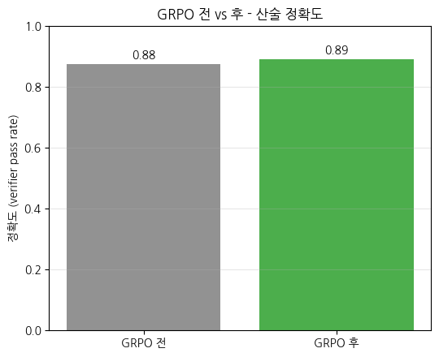
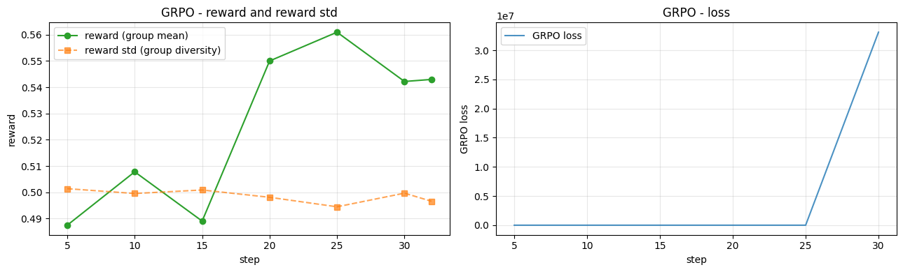

> ▶ **[Google Colab에서 이 장 실습 열기](https://colab.research.google.com/github/yoon-gu/neuqes-101/blob/master/31_grpo/31_grpo.ipynb)** — 브라우저에서 바로 실행해 볼 수 있습니다.

## 환경 준비

```python
%pip install -q -U trl transformers tokenizers datasets accelerate
```

**▶ 실행 결과**

```text
   ━━━━━━━━━━━━━━━━━━━━━━━━━━━━━━━━━━━━━━━━ 825.1/825.1 kB 25.9 MB/s eta 0:00:00
   ━━━━━━━━━━━━━━━━━━━━━━━━━━━━━━━━━━━━━━━━ 11.2/11.2 MB 97.3 MB/s eta 0:00:00
   ━━━━━━━━━━━━━━━━━━━━━━━━━━━━━━━━━━━━━━━━ 555.1/555.1 kB 28.7 MB/s eta 0:00:00
   ━━━━━━━━━━━━━━━━━━━━━━━━━━━━━━━━━━━━━━━━ 389.2/389.2 kB 24.4 MB/s eta 0:00:00
   ━━━━━━━━━━━━━━━━━━━━━━━━━━━━╸━━━━━━━━━━━ 34.9/48.9 MB 192.2 MB/s eta 0:00:01
   ━━━━━━━━━━━━━━━━━━━━━━━━━━━━━━━━━━━━━━━╸ 48.9/48.9 MB 156.2 MB/s eta 0:00:01
   ━━━━━━━━━━━━━━━━━━━━━━━━━━━━━━━━━━━━━━━╸ 48.9/48.9 MB 156.2 MB/s eta 0:00:01
   ━━━━━━━━━━━━━━━━━━━━━━━━━━━━━━━━━━━━━━━━ 48.9/48.9 MB 15.0 MB/s eta 0:00:00
```

```python
import warnings
warnings.filterwarnings("ignore")

import math
import os
import random
import re
import time

import numpy as np
import pandas as pd
import matplotlib.pyplot as plt
import torch

import trl
print(f"trl          : {trl.__version__}")

# device 자동 감지 - Colab T4 / 로컬 MPS / CPU 모두 지원
if torch.cuda.is_available():
    device = torch.device("cuda")
    device_name = torch.cuda.get_device_name(0)
    vram_gib = torch.cuda.get_device_properties(0).total_memory / 1024**3
    print(f"device       : cuda  ({device_name})")
    print(f"VRAM total   : {vram_gib:.2f} GiB")
elif torch.backends.mps.is_available():
    device = torch.device("mps")
    print("device       : mps  (Apple Silicon)")
else:
    device = torch.device("cpu")
    print("device       : cpu  (training will be very slow - Colab T4 recommended)")

print(f"torch        : {torch.__version__}")

# 재현성
SEED = 0
torch.manual_seed(SEED)
np.random.seed(SEED)
random.seed(SEED)

# fp16 은 CUDA 에서만 (MPS 는 미지원, CPU 는 의미 없음)
USE_FP16 = (device.type == "cuda")
print(f"use fp16     : {USE_FP16}")
```

**▶ 실행 결과**

```text
trl          : 1.6.0
device       : cuda  (Tesla T4)
VRAM total   : 14.56 GiB
torch        : 2.11.0+cu128
use fp16     : True
```

```python
from datasets import Dataset

# Ch 28 SFT / Ch 30 DPO 와 같은 instruction 포맷으로 prompt 를 감쌉니다.
RESPONSE_TEMPLATE = "### 응답:\n"


def build_prompt(question: str) -> str:
    '''Ch 28 SFT 와 동일한 instruction 포맷 (학습·추론 포맷 일치).'''
    return f"### 명령어:\n{question}\n\n{RESPONSE_TEMPLATE}"


def make_arithmetic(n: int, max_operand: int = 9, seed: int = 0):
    '''산술 prompt + 정답. verifier 가 정답을 자동 검증할 수 있는 task.'''
    rng = random.Random(seed)
    rows = []
    for _ in range(n):
        a = rng.randint(1, max_operand)
        b = rng.randint(1, max_operand)
        op = rng.choice(["+", "-"])
        ans = a + b if op == "+" else a - b
        rows.append({
            "prompt": build_prompt(f"{a} {op} {b} = ?"),
            "answer": str(ans),          # 정답 (verifier 채점용)
        })
    return Dataset.from_list(rows)


N_TRAIN = 256       # T4 + 30분 룰 - rollout 이 무거우니 작게
grpo_ds = make_arithmetic(N_TRAIN, max_operand=9, seed=SEED)
eval_ds = make_arithmetic(64, max_operand=9, seed=SEED + 1)   # 전·후 비교용

print(f"train: {len(grpo_ds)} samples,  eval: {len(eval_ds)} samples")
print("\n=== sample 0 ===")
print("--- prompt (model input) ---")
print(grpo_ds[0]["prompt"])
print("--- answer (for verifier scoring, not model input) ---")
print(grpo_ds[0]["answer"])
```

**▶ 실행 결과**

```text
train: 256 samples,  eval: 64 samples

=== sample 0 ===
--- prompt (model input) ---
### 명령어:
7 + 7 = ?

### 응답:

--- answer (for verifier scoring, not model input) ---
14
```

```python
from transformers import PreTrainedTokenizerFast, AutoModelForCausalLM

t0 = time.time()
# 주의: KoGPT2 는 AutoTokenizer 가 영어 GPT2 토크나이저로 잘못 fallback (Ch 27).
# PreTrainedTokenizerFast 로 special token 을 직접 지정해 로드.
tokenizer = PreTrainedTokenizerFast.from_pretrained(
    "skt/kogpt2-base-v2",
    bos_token="</s>", eos_token="</s>", unk_token="<unk>",
    pad_token="<pad>", mask_token="<mask>",
)

# policy = 학습 대상. 보통은 Ch 28 SFT 체크포인트를 쓰지만, 단독 실행을 위해 base 로 시작.
SFT_MODEL = "skt/kogpt2-base-v2"   # Ch 28 SFT 체크포인트 경로가 있으면 여기에
policy = AutoModelForCausalLM.from_pretrained(SFT_MODEL).to(device)
policy.config.pad_token_id = tokenizer.pad_token_id
print(f"load done: {time.time()-t0:.1f}s")

n_params = policy.num_parameters()
print(f"\n=== policy model ===")
print(f"#params      : {n_params/1e6:.2f} M")
print(f"vocab_size   : {tokenizer.vocab_size:,}")
print(f"tokenizer    : {type(tokenizer).__name__}")
print(f"  eos_token  : {tokenizer.eos_token}  id={tokenizer.eos_token_id}")
print(f"  pad_token  : {tokenizer.pad_token}  id={tokenizer.pad_token_id}")
```

**▶ 실행 결과**

```text
[transformers] GPT2LMHeadModel LOAD REPORT from: skt/kogpt2-base-v2
Key                                     | Status     |  | 
----------------------------------------+------------+--+-
transformer.h.{0...11}.attn.masked_bias | UNEXPECTED |  | 

Notes:
- UNEXPECTED:	can be ignored when loading from different task/architecture; not ok if you expect identical arch.
load done: 17.0s

=== policy model ===
#params      : 125.16 M
vocab_size   : 51,200
tokenizer    : TokenizersBackend
  eos_token  : </s>  id=1
  pad_token  : <pad>  id=3
```

```python
# === SFT 워밍스타트 === GRPO 전에 산술 포맷+정답을 지도학습 (비제로 시작점)
from transformers import Trainer, TrainingArguments, DataCollatorForLanguageModeling

sft_ds = make_arithmetic(3000, max_operand=9, seed=SEED + 7)   # SFT 용 (정답 포함 학습)
def _to_sft(ex):
    # prompt + 정답 + EOS 를 통째로 언어모델링 (정답 생성을 학습)
    return tokenizer(ex["prompt"] + ex["answer"] + tokenizer.eos_token,
                     truncation=True, max_length=48, padding="max_length")
sft_tok = sft_ds.map(_to_sft, remove_columns=sft_ds.column_names)

sft_args = TrainingArguments(
    output_dir="./out_grpo_sft", num_train_epochs=5,
    per_device_train_batch_size=32, learning_rate=5e-4,
    warmup_ratio=0.1, lr_scheduler_type="cosine", max_grad_norm=1.0,
    fp16=torch.cuda.is_available(), logging_steps=50, save_strategy="no", report_to="none")
sft_trainer = Trainer(model=policy, args=sft_args, train_dataset=sft_tok,
                      data_collator=DataCollatorForLanguageModeling(tokenizer, mlm=False))
t0 = time.time(); sft_trainer.train()
print(f"SFT warmstart done ({(time.time()-t0)/60:.1f}min) - policy now knows the arithmetic format")
```

**▶ 실행 결과**

```text
[transformers] warmup_ratio is deprecated and will be removed in v5.2. Use `warmup_steps` instead.
[transformers] `loss_type=None` was set in the config but it is unrecognized. Using the default loss: `ForCausalLMLoss`.
<IPython.core.display.HTML object>
SFT warmstart done (1.2min) - policy now knows the arithmetic format
```

```python
def extract_answer(text: str):
    '''생성 답에서 정답 정수를 추출. 응답 블록만 보고(모델이 다음 문제를 이어 생성해도
    그 숫자를 집지 않도록 "###" 앞까지만) 첫 정수를 집는다.'''
    seg = text.split("###")[0]
    m = re.search(r"-?\d+", seg)
    return m.group(0) if m else None


def reward_correct(completions, answer, **kwargs):
    '''verifier: 생성 답의 정수가 정답과 일치하면 1.0, 아니면 0.0 (이진 검증가능 보상).
    trl reward_func 시그니처: completions(생성 답 리스트) + answer(정답 리스트) -> reward 리스트.'''
    return [1.0 if (extract_answer(c) == str(g)) else 0.0
            for c, g in zip(completions, answer)]


# verifier 시연 - 한 prompt("3 + 5 = ?", 정답 8) 에 4개 답 (일부 맞음/틀림)
demo_completions = ["The answer is 8.", "answer: 7", "8", "I don't know"]
demo_answers = ["8", "8", "8", "8"]
demo_rewards = reward_correct(demo_completions, answer=demo_answers)
print("=" * 56)
print("verifier demo - prompt: '3 + 5 = ?', gold answer: 8")
print("=" * 56)
for c, r in zip(demo_completions, demo_rewards):
    print(f"  reward={r:.1f}  <- completion: {c!r}")
print(f"\nrewards (group): {demo_rewards}")
```

**▶ 실행 결과**

```text
========================================================
verifier demo - prompt: '3 + 5 = ?', gold answer: 8
========================================================
  reward=1.0  <- completion: 'The answer is 8.'
  reward=0.0  <- completion: 'answer: 7'
  reward=1.0  <- completion: '8'
  reward=0.0  <- completion: "I don't know"

rewards (group): [1.0, 0.0, 1.0, 0.0]
```

```python
def group_advantage(rewards, eps=1e-4):
    '''GRPO 의 group relative advantage = (r - mean) / (std + eps). critic 불필요.'''
    r = np.asarray(rewards, dtype=float)
    return (r - r.mean()) / (r.std() + eps)


rewards = np.array(demo_rewards)
adv = group_advantage(rewards)

print("=" * 60)
print("group relative advantage - by hand (group mean as baseline, no critic)")
print("=" * 60)
print(f"rewards          : {rewards}")
print(f"group mean       : {rewards.mean():.3f}   <- baseline (replaces critic)")
print(f"group std        : {rewards.std():.3f}")
print(f"advantage        : {np.round(adv, 3)}")
print("-" * 60)
for i, (r, a) in enumerate(zip(rewards, adv)):
    arrow = "prob UP (above avg)" if a > 0 else ("prob DOWN (below avg)" if a < 0 else "no signal")
    print(f"  y{i+1}: reward={r:.0f}  advantage={a:+.2f}  -> {arrow}")

# 다른 group 들도 - 동료 구성에 따라 advantage 가 어떻게 달라지나
print("\nadvantage for various group compositions:")
for rw in [[1, 0, 1, 0], [1, 1, 1, 0], [1, 0, 0, 0], [1, 1, 1, 1], [0, 0, 0, 0]]:
    a = group_advantage(rw)
    note = "  (all same -> no learning signal)" if np.allclose(a, 0) else ""
    print(f"  rewards={rw} -> advantage={np.round(a, 2)}{note}")
```

**▶ 실행 결과**

```text
============================================================
group relative advantage - by hand (group mean as baseline, no critic)
============================================================
rewards          : [1. 0. 1. 0.]
group mean       : 0.500   <- baseline (replaces critic)
group std        : 0.500
advantage        : [ 1. -1.  1. -1.]
------------------------------------------------------------
  y1: reward=1  advantage=+1.00  -> prob UP (above avg)
  y2: reward=0  advantage=-1.00  -> prob DOWN (below avg)
  y3: reward=1  advantage=+1.00  -> prob UP (above avg)
  y4: reward=0  advantage=-1.00  -> prob DOWN (below avg)

advantage for various group compositions:
  rewards=[1, 0, 1, 0] -> advantage=[ 1. -1.  1. -1.]
  rewards=[1, 1, 1, 0] -> advantage=[ 0.58  0.58  0.58 -1.73]
  rewards=[1, 0, 0, 0] -> advantage=[ 1.73 -0.58 -0.58 -0.58]
  rewards=[1, 1, 1, 1] -> advantage=[0. 0. 0. 0.]  (all same -> no learning signal)
  rewards=[0, 0, 0, 0] -> advantage=[0. 0. 0. 0.]  (all same -> no learning signal)
```

```python
from trl import GRPOTrainer, GRPOConfig


# GRPO 전·후 비교용 - greedy(do_sample=False) 로 결정화 측정.
# sampling 측정은 실행마다 베이스라인이 흔들려 delta 를 못 읽는다 -> greedy 로 고정.
@torch.no_grad()
def eval_accuracy(model, dataset, n=64, max_new=24):
    model.eval()
    correct = 0
    for ex in dataset.select(range(min(n, len(dataset)))):
        enc = tokenizer(ex["prompt"], return_tensors="pt").to(model.device)
        gen = model.generate(**enc, max_new_tokens=max_new, do_sample=False, num_beams=1,
                             pad_token_id=tokenizer.pad_token_id)
        text = tokenizer.decode(gen[0][enc["input_ids"].shape[1]:], skip_special_tokens=True)
        correct += int(extract_answer(text) == str(ex["answer"]))
    return correct / min(n, len(dataset))


acc_before = eval_accuracy(policy, eval_ds, n=64)
print(f"BEFORE GRPO - arithmetic accuracy (greedy verifier pass rate): {acc_before:.3f}")
```

**▶ 실행 결과**

```text
BEFORE GRPO - arithmetic accuracy (greedy verifier pass rate): 0.875
```

```python
# 각 prompt 에 k 개 답을 생성해 정답률(pass rate)을 측정
@torch.no_grad()
def pass_rate(model, prompt, gold, k=8):
    enc = tokenizer(prompt, return_tensors="pt").to(model.device)
    gen = model.generate(**enc, max_new_tokens=24, do_sample=True, temperature=0.7, top_p=0.95,
                         num_return_sequences=k, pad_token_id=tokenizer.pad_token_id)
    c = sum(extract_answer(tokenizer.decode(g[enc["input_ids"].shape[1]:], skip_special_tokens=True)) == str(gold)
            for g in gen)
    return c / k

# 중간 난이도(2-7/8 정답)인 prompt 만 남겨 그룹 std>0 보장
pool = make_arithmetic(500, max_operand=9, seed=SEED + 3)
keep = [ex for ex in pool if 0.25 <= pass_rate(policy, ex["prompt"], ex["answer"]) <= 0.875]
grpo_ds = Dataset.from_list(keep[:256]) if len(keep) >= 16 else grpo_ds  # 너무 적으면 원본 유지
print(f"difficulty filter: pool {len(pool)} -> {len(grpo_ds)} medium-difficulty (groups mix correct/wrong -> advantage std>0)")
```

**▶ 실행 결과**

```text
difficulty filter: pool 500 -> 256 medium-difficulty (groups mix correct/wrong -> advantage std>0)
```

```python
GROUP_SIZE = 8   # num_generations - rollout group size (T4 룰: 작게)

grpo_config = GRPOConfig(
    output_dir="./out_kogpt2_grpo",
    num_train_epochs=2,
    # 배치·그룹: micro-batch 당 prompt 2개(16/8) × grad_accum 8 = step 당 unique prompt 16
    per_device_train_batch_size=16,
    gradient_accumulation_steps=8,
    num_generations=GROUP_SIZE,               # 한 prompt 당 생성 답 개수(그룹 크기)
    max_completion_length=24,
    mask_truncated_completions=True,          # 잘린 생성은 loss 에서 제외
    # 탐색: eval(greedy)·rollout 정합, 산술은 저엔트로피라 0.7 로 낮춤
    temperature=0.7,
    top_p=0.95,
    # 신호 정규화: std 나눗셈 제거(난이도 bias·과증폭 차단)
    scale_rewards=False,
    loss_type="dr_grpo",
    # 붕괴 방지: lr 낮추고(정석 ~1e-6 근처) clip 강화, 짧은 RL 에 cosine 금지
    learning_rate=5e-6,
    lr_scheduler_type="constant_with_warmup",
    warmup_ratio=0.1,
    max_grad_norm=0.2,
    beta=0.04,                                # KL 앵커(참조=SFT 모델), ref-free(0) 금지
    fp16=USE_FP16,
    logging_steps=5,
    save_strategy="no",
    report_to="none",
    use_vllm=False,
    seed=SEED,
)


class VRAMCallback(__import__("transformers").TrainerCallback):
    '''step 별 peak VRAM 기록 (로깅 윈도우 단위 reset). CUDA 에서만 유효.'''

    def __init__(self):
        self.steps, self.peak_MiB = [], []

    def on_train_begin(self, args, state, control, **kwargs):
        if torch.cuda.is_available():
            torch.cuda.reset_peak_memory_stats()

    def on_log(self, args, state, control, logs=None, **kwargs):
        if torch.cuda.is_available():
            peak = torch.cuda.max_memory_allocated() / 1024**2
            self.steps.append(state.global_step)
            self.peak_MiB.append(peak)
            torch.cuda.reset_peak_memory_stats()


vram_cb = VRAMCallback()

# reward_funcs 에 verifier 를 넘기면 rollout -> 채점 -> group advantage -> 정책 갱신 자동.
trainer = GRPOTrainer(
    model=policy,
    reward_funcs=reward_correct,   # <- verifier (callable 또는 list). 데이터의 answer 컬럼이 kwargs 로 전달
    args=grpo_config,
    train_dataset=grpo_ds,
    processing_class=tokenizer,
    callbacks=[vram_cb],
)

t0 = time.time()
train_out = trainer.train()
elapsed = time.time() - t0

print(f"\n=== GRPO summary ===")
print(f"elapsed     : {elapsed/60:.2f} min")
print(f"global_step : {train_out.global_step}")
print(f"train_loss  : {train_out.training_loss:.4f}")
if torch.cuda.is_available():
    print(f"final peak  : {torch.cuda.max_memory_allocated()/1024**2:.0f} MiB")
```

**▶ 실행 결과**

```text
[transformers] warmup_ratio is deprecated and will be removed in v5.2. Use `warmup_steps` instead.
[transformers] GPT2LMHeadModel LOAD REPORT from: skt/kogpt2-base-v2
Key                                     | Status     |  | 
----------------------------------------+------------+--+-
transformer.h.{0...11}.attn.masked_bias | UNEXPECTED |  | 

Notes:
- UNEXPECTED:	can be ignored when loading from different task/architecture; not ok if you expect identical arch.
<IPython.core.display.HTML object>
=== GRPO summary ===
elapsed     : 0.49 min
global_step : 32
train_loss  : 5171634.2480
final peak  : 2886 MiB
```

```python
acc_after = eval_accuracy(policy, eval_ds, n=64)

print(f"AFTER  GRPO - arithmetic accuracy (verifier pass rate): {acc_after:.3f}")
print(f"BEFORE GRPO - arithmetic accuracy                     : {acc_before:.3f}")
print(f"delta                                                 : {acc_after - acc_before:+.3f}")

fig, ax = plt.subplots(figsize=(5.5, 4.5))
bars = ax.bar(["before GRPO", "after GRPO"], [acc_before, acc_after],
              color=["tab:gray", "tab:green"], alpha=0.85)
for b, v in zip(bars, [acc_before, acc_after]):
    ax.text(b.get_x() + b.get_width() / 2, v + 0.01, f"{v:.2f}",
            ha="center", va="bottom")
ax.set_ylabel("accuracy (verifier pass rate)")
ax.set_ylim(0, 1)
ax.set_title("GRPO before vs after - arithmetic accuracy")
ax.grid(True, axis="y", alpha=0.3)
plt.tight_layout(); plt.show()
```

**▶ 실행 결과**

```text
AFTER  GRPO - arithmetic accuracy (verifier pass rate): 0.891
BEFORE GRPO - arithmetic accuracy                     : 0.875
delta                                                 : +0.016
```



```python
log = trainer.state.log_history
steps = [r["step"] for r in log if "loss" in r]
losses = [r["loss"] for r in log if "loss" in r]


def series(key):
    return [(r["step"], r[key]) for r in log if key in r]


reward_s = series("reward")          # group 평균 reward
reward_std_s = series("reward_std")  # group reward 표준편차 (다양성 지표)

fig, (ax1, ax2) = plt.subplots(1, 2, figsize=(13, 4))

if reward_s:
    ax1.plot([s for s, _ in reward_s], [v for _, v in reward_s], "o-",
             color="tab:green", label="reward (group mean)")
if reward_std_s:
    ax1.plot([s for s, _ in reward_std_s], [v for _, v in reward_std_s], "s--",
             color="tab:orange", alpha=0.7, label="reward std (group diversity)")
ax1.set_xlabel("step"); ax1.set_ylabel("reward")
ax1.set_title("GRPO - reward and reward std")
ax1.grid(True, alpha=0.3); ax1.legend()

if steps and losses:
    ax2.plot(steps, losses, "-", color="tab:blue", alpha=0.8, label="GRPO loss")
ax2.set_xlabel("step"); ax2.set_ylabel("GRPO loss")
ax2.set_title("GRPO - loss")
ax2.grid(True, alpha=0.3); ax2.legend()

plt.tight_layout(); plt.show()

if torch.cuda.is_available() and vram_cb.steps:
    print(f"peak VRAM (max over training): {max(vram_cb.peak_MiB):.0f} MiB"
          f"  (policy only, ref-free, num_generations={GROUP_SIZE}, fp16)")
```

**▶ 실행 결과**



```text
peak VRAM (max over training): 3670 MiB  (policy only, ref-free, num_generations=8, fp16)
```
