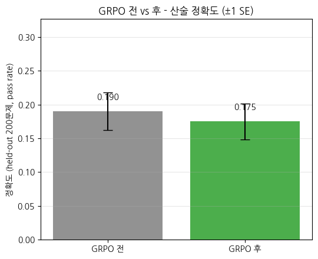
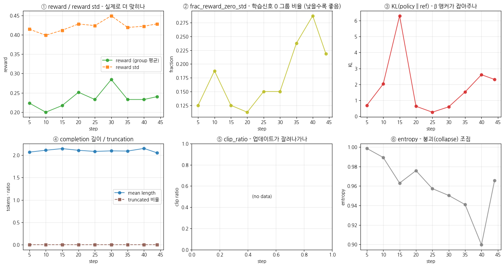

> ▶ **[Google Colab에서 이 장 실습 열기](https://colab.research.google.com/github/yoon-gu/neuqes-101/blob/master/31_grpo/31_grpo.ipynb)** — 브라우저에서 바로 실행해 볼 수 있습니다.

## 환경 셋업

`trl` 의 **`GRPOTrainer`** 와 **`GRPOConfig`**, 그리고 **`reward_funcs`** (verifier 함수) 가 이번 챕터에 새로 등장합니다. `transformers` / `datasets` / `accelerate` 와 함께 설치합니다.

> ⚠️ `trl` 은 버전마다 `GRPOTrainer` / `GRPOConfig` API 변동이 큽니다 (인자 이름이 버전에 따라 바뀝니다 — 예: `max_completion_length` 는 있지만 `max_prompt_length` 는 버전에 따라 없음). 본 노트북은 설치된 `trl` 버전을 셋업 셀에서 출력하고, *버전 간 안정적인 핵심 경로* (`num_generations` + `reward_funcs` + `max_completion_length` + `prompt` 컬럼) 만 사용합니다.

```python
%pip install -q -U trl transformers tokenizers datasets accelerate
```

**▶ 실행 결과**

```text
   ━━━━━━━━━━━━━━━━━━━━━━━━━━━━━━━━━━━━━━━━ 925.8/925.8 kB 23.7 MB/s eta 0:00:00
   ━━━━━━━━━━━━━━━━━━━━╸━━━━━━━━━━━━━━━━━━━ 6.1/11.7 MB 183.5 MB/s eta 0:00:01
   ━━━━━━━━━━━━━━━━━━━━━━━━━━━━━━━━━━━━━━━━ 11.7/11.7 MB 116.7 MB/s eta 0:00:00
   ━━━━━━━━━━━━━━━━━━━━━━━━━━━━━━━━━━━━━━━━ 559.1/559.1 kB 45.0 MB/s eta 0:00:00
   ━━━━━━━━━━━━━━━━━━╺━━━━━━━━━━━━━━━━━━━━━ 22.8/50.1 MB 224.1 MB/s eta 0:00:01
   ━━━━━━━━━━━━━━━━━━━━━━━━━━━━━━━━━━━━━━━╸ 50.1/50.1 MB 235.1 MB/s eta 0:00:01
   ━━━━━━━━━━━━━━━━━━━━━━━━━━━━━━━━━━━━━━━╸ 50.1/50.1 MB 235.1 MB/s eta 0:00:01
   ━━━━━━━━━━━━━━━━━━━━━━━━━━━━━━━━━━━━━━━━ 50.1/50.1 MB 18.8 MB/s eta 0:00:00
```

```python
import warnings
warnings.filterwarnings("ignore")

import math
import os
import random
import re
import time

import numpy as np
import pandas as pd
import matplotlib.pyplot as plt
import torch

import trl
print(f"trl          : {trl.__version__}")

# device 자동 감지 - Colab T4 / 로컬 MPS / CPU 모두 지원
if torch.cuda.is_available():
    device = torch.device("cuda")
    device_name = torch.cuda.get_device_name(0)
    vram_gib = torch.cuda.get_device_properties(0).total_memory / 1024**3
    print(f"device       : cuda  ({device_name})")
    print(f"VRAM total   : {vram_gib:.2f} GiB")
elif torch.backends.mps.is_available():
    device = torch.device("mps")
    print("device       : mps  (Apple Silicon)")
else:
    device = torch.device("cpu")
    print("device       : cpu  (training will be very slow - Colab T4 recommended)")

print(f"torch        : {torch.__version__}")

# 재현성
SEED = 0
torch.manual_seed(SEED)
np.random.seed(SEED)
random.seed(SEED)

# fp16 은 CUDA 에서만 (MPS 는 미지원, CPU 는 의미 없음)
USE_FP16 = (device.type == "cuda")
print(f"use fp16     : {USE_FP16}")

# matplotlib 한글 폰트 (Colab — NanumGothic). plot 의 한국어가 □ 로 깨지지 않게.
import matplotlib.pyplot as plt, matplotlib.font_manager as fm, subprocess, os
_fp = "/usr/share/fonts/truetype/nanum/NanumGothic.ttf"
if not os.path.exists(_fp):
    subprocess.run("apt-get -qq -y install fonts-nanum", shell=True)
fm.fontManager.addfont(_fp)
plt.rcParams["font.family"] = "NanumGothic"
plt.rcParams["axes.unicode_minus"] = False
```

**▶ 실행 결과**

```text
trl          : 1.10.0
device       : cuda  (Tesla T4)
VRAM total   : 14.56 GiB
torch        : 2.11.0+cu128
use fp16     : True
```

## verifiable 데이터 — `prompt` + 정답 (산술)

GRPO 데이터의 핵심은 **정답을 자동 검증할 수 있어야** 한다는 것입니다. 코드(테스트 실행) 는 무겁고 환경 의존이 크니, 본 챕터는 *가장 깨끗한 verifiable task* 인 **산술(arithmetic)** 로 시작합니다 — 정답이 *정수 하나* 라 *문자열 매칭만으로 채점* 됩니다.

각 샘플은 `(prompt, answer)` 두 컬럼입니다:
- `prompt`: 풀어야 할 문제 (예: `"37 + 58 = ?"`) — 모델에 입력
- `answer`: 정답 (예: `"95"`) — *verifier 가 채점할 때만* 사용 (모델 입력 아님)

**두 가지 설계 결정**:
1. **1~2 자리 산술** (피연산자 1~99) 로 문제 공간을 ≈2만 개로 키웁니다. 한 자리(피연산자 1~9)면 가능한 문제가 162개뿐이라 모델이 *암기* 해버려 GRPO 가 개선할 여지가 없습니다. 공간이 커야 *일반화* 를 배우고 GRPO 가 올릴 헤드룸이 생깁니다.
2. **문제 공간을 train / eval 로 겹침 없이 분리**합니다. eval 은 *학습에 한 번도 안 나온 문제* 여야 우리가 재는 게 *암기 재현* 이 아니라 *일반화* 입니다.

> 합성 산술이라 *정답을 우리가 알고* 있으니, *verifier (정답 매칭) 가 완벽* 합니다. 이것이 verifiable reward 의 이상적 형태 — *reward 가 잡음 없이 정확*. (GSM8K 같은 실제 수학 데이터셋도 같은 방식이지만, 답 추출이 더 까다롭습니다 — FAQ 참고.)

```python
from datasets import Dataset

# Ch 28 SFT / Ch 30 DPO 와 같은 instruction 포맷으로 prompt 를 감쌉니다.
RESPONSE_TEMPLATE = "### 응답:\n"


def build_prompt(question: str) -> str:
    '''Ch 28 SFT 와 동일한 instruction 포맷 (학습·추론 포맷 일치).'''
    return f"### 명령어:\n{question}\n\n{RESPONSE_TEMPLATE}"


def _row(a, op, b):
    ans = a + b if op == "+" else a - b
    return {"prompt": build_prompt(f"{a} {op} {b} = ?"), "answer": str(ans)}


# 문제 공간을 통째로 만든 뒤 train / eval 로 *문제 단위 분리*.
# eval 이 학습에 안 나온 문제여야 '암기 재현' 이 아니라 '일반화' 를 잰다.
# 1~2 자리 산술이라 공간이 커(≈2만) 겹침 없이 나눌 수 있다 (한 자리면 162개뿐이라 전부 겹침).
MAX_OPERAND = 50
ALL_PROBLEMS = [(a, op, b)
                for a in range(1, MAX_OPERAND + 1)
                for b in range(1, MAX_OPERAND + 1)
                for op in ["+", "-"]]
random.Random(SEED).shuffle(ALL_PROBLEMS)
N_EVAL = 200
EVAL_PROBLEMS = ALL_PROBLEMS[:N_EVAL]         # held-out - SFT·GRPO 에 절대 안 씀
TRAIN_PROBLEMS = ALL_PROBLEMS[N_EVAL:]        # SFT·난이도필터·GRPO 는 여기서만


def make_arithmetic(n: int, problems, seed: int = 0):
    '''problems 풀에서 n 개를 뽑아 (prompt, answer). verifier 가 정답을 자동 검증.'''
    rng = random.Random(seed)
    return Dataset.from_list([_row(*rng.choice(problems)) for _ in range(n)])


eval_ds = Dataset.from_list([_row(*p) for p in EVAL_PROBLEMS])   # held-out 문제 그대로 (겹침 0)
grpo_ds = make_arithmetic(256, TRAIN_PROBLEMS, seed=SEED)        # 난이도 필터(§4.5) 전 임시 - 필터가 대체

print(f"문제 공간 {len(ALL_PROBLEMS):,}개 -> train {len(TRAIN_PROBLEMS):,} / eval(held-out) {len(EVAL_PROBLEMS)}")
print("\n=== eval sample 0 (held-out) ===")
print("--- prompt (model input) ---")
print(eval_ds[0]["prompt"])
print("--- answer (for verifier scoring, not model input) ---")
print(eval_ds[0]["answer"])
```

**▶ 실행 결과**

```text
문제 공간 5,000개 -> train 4,800 / eval(held-out) 200

=== eval sample 0 (held-out) ===
--- prompt (model input) ---
### 명령어:
28 - 48 = ?

### 응답:

--- answer (for verifier scoring, not model input) ---
-20
```

## SFT 모델 (policy) 로드

GRPO 는 *SFT 모델에서 출발* 합니다 (Ch 28 의 SFT 체크포인트가 정석). 노트북 단독 실행을 위해 **base KoGPT2 를 로드** 하되, 바로 다음 §2.5 에서 *짧은 SFT 워밍스타트* 로 산술 능력을 부여해 그 위에서 GRPO 를 돌립니다 — 보통은 *이미 지시를 따르는 SFT 모델* 에서 GRPO 를 시작해야 *rollout 이 의미 있는 답* 을 내고 verifier 가 *섞인 reward* (잘한 답 + 못한 답) 를 줄 수 있습니다.

토크나이저는 Ch 27·28·30 과 동일 (`PreTrainedTokenizerFast` + special token 명시 — `AutoTokenizer` 함정 회피).

GRPO 는 *SFT 모델에서 출발* 합니다 (Ch 28 의 SFT 체크포인트가 정석). 노트북 단독 실행을 위해 **base KoGPT2 로 시작** 합니다 — 보통은 *이미 지시를 따르는 SFT 모델* 에서 GRPO 를 시작해야 *rollout 이 의미 있는 답* 을 내고 verifier 가 *섞인 reward* (잘한 답 + 못한 답) 를 줄 수 있습니다.

학습 대상인 policy 모델과 토크나이저를 불러옵니다. KoGPT2 는 `AutoTokenizer` 가 영어 GPT2 토크나이저로 잘못 fallback 되므로 (Ch 27), `PreTrainedTokenizerFast` 로 special token 을 직접 지정해 로드합니다. 단독 실행을 위해 SFT 체크포인트 대신 base 모델에서 시작합니다.

```python
from transformers import PreTrainedTokenizerFast, AutoModelForCausalLM

t0 = time.time()
# 주의: KoGPT2 는 AutoTokenizer 가 영어 GPT2 토크나이저로 잘못 fallback (Ch 27).
# PreTrainedTokenizerFast 로 special token 을 직접 지정해 로드.
tokenizer = PreTrainedTokenizerFast.from_pretrained(
    "skt/kogpt2-base-v2",
    bos_token="</s>", eos_token="</s>", unk_token="<unk>",
    pad_token="<pad>", mask_token="<mask>",
)

# policy = 학습 대상. 보통은 Ch 28 SFT 체크포인트를 쓰지만, 단독 실행을 위해 base 로 시작.
SFT_MODEL = "skt/kogpt2-base-v2"   # Ch 28 SFT 체크포인트 경로가 있으면 여기에
policy = AutoModelForCausalLM.from_pretrained(SFT_MODEL).to(device)
policy.config.pad_token_id = tokenizer.pad_token_id
print(f"load done: {time.time()-t0:.1f}s")

n_params = policy.num_parameters()
print(f"\n=== policy model ===")
print(f"#params      : {n_params/1e6:.2f} M")
print(f"vocab_size   : {tokenizer.vocab_size:,}")
print(f"tokenizer    : {type(tokenizer).__name__}")
print(f"  eos_token  : {tokenizer.eos_token}  id={tokenizer.eos_token_id}")
print(f"  pad_token  : {tokenizer.pad_token}  id={tokenizer.pad_token_id}")
```

**▶ 실행 결과**

```text
pytorch_model.bin: downloading bytes:           |  0.00B            
[transformers] GPT2LMHeadModel LOAD REPORT from: skt/kogpt2-base-v2
Key                                     | Status     |  | 
----------------------------------------+------------+--+-
transformer.h.{0...11}.attn.masked_bias | UNEXPECTED |  | 

Notes:
- UNEXPECTED:	can be ignored when loading from different task/architecture; not ok if you expect identical arch.
model.safetensors: downloading bytes:           |  0.00B            
load done: 17.3s

=== policy model ===
#params      : 125.16 M
vocab_size   : 51,200
tokenizer    : TokenizersBackend
  eos_token  : </s>  id=1
  pad_token  : <pad>  id=3
```

## 5 SFT 워밍스타트 — GRPO 의 비제로 시작점 만들기

GRPO 는 한 prompt 에 여러 답(group)을 생성해 *그룹 안에서* 잘한 답의 확률을 올립니다. 그런데 base KoGPT2 는 산술을 거의 못 풀어 **그룹의 보상이 전부 0** 이 되기 쉽고, 그러면 advantage 가 모두 0 이라 *학습 신호가 없습니다*(GRPO 의 cold-start 함정).

그래서 표준 RLHF 파이프라인처럼 **GRPO 전에 짧은 SFT 로 "포맷 + 산술"을 먼저 가르칩니다.** 산술 prompt 와 정답을 지도학습해 모델이 일부 문제를 맞히기 시작하면(비제로 정확도), 그룹 안에 정답·오답이 섞여 advantage 가 생기고 GRPO 가 비로소 작동합니다. Ch 28 에서 한 그 SFT 를, 이번엔 산술 task 에 맞춰 워밍스타트로 씁니다.

> **Ch 28 과 동일하게 `completion_only_loss=True` 로 *답변(정답)만* 학습합니다** — prompt(`### 명령어: ... ### 응답:`) 토큰은 `labels=-100` 으로 가려 loss 에서 제외합니다. instruction tuning 의 표준이고, prompt 까지 next-token 으로 학습하면 모델이 *문제 문장 자체를 외우는 데* 용량을 나눠 쓰게 됩니다. 우리가 원하는 건 *prompt 를 조건으로 정답을 생성* 하는 능력이므로 답변만 학습하는 게 맞습니다.

```python
# === SFT 워밍스타트 === GRPO 전에 산술 포맷+정답을 지도학습 (비제로 시작점)
# Ch 28 과 동일하게 SFTTrainer + completion_only_loss=True 로 *답변(정답)만* 학습합니다.
# (prompt 토큰은 labels=-100 으로 가림 - prompt 까지 외우지 않고 "정답 생성" 에만 집중)
from trl import SFTTrainer, SFTConfig

sft_ds = make_arithmetic(3000, TRAIN_PROBLEMS, seed=SEED + 7)   # TRAIN 문제 공간에서만 (eval 과 겹침 0)
sft_ds = sft_ds.rename_column("answer", "completion")          # SFTTrainer: (prompt, completion) 포맷

sft_config = SFTConfig(
    output_dir="./out_grpo_sft", num_train_epochs=5,
    per_device_train_batch_size=32, learning_rate=5e-4,
    warmup_steps=0.1, lr_scheduler_type="cosine", max_grad_norm=1.0,  # 1 미만이면 전체 step 대비 비율로 해석
    max_length=48,
    completion_only_loss=True,   # <- 핵심: 답변만 loss, prompt 은 -100 으로 가림 (Ch 28 과 동일)
    packing=False,               # 샘플 경계 유지 (마스킹 정확도)
    fp16=torch.cuda.is_available(), logging_steps=50, save_strategy="no", report_to="none")
sft_trainer = SFTTrainer(model=policy, args=sft_config, train_dataset=sft_ds,
                         processing_class=tokenizer)
t0 = time.time(); sft_trainer.train()

# ⚠️ GRPO 의 KL 앵커(reference) 는 policy.config._name_or_path 에서 새로 로드됩니다.
#   인메모리 SFT 만 하면 그 경로가 여전히 base("skt/kogpt2-base-v2") 라, GRPO 가 *base 기준* 으로
#   KL 을 재서 SFT 로 배운 산술을 도로 지웁니다(=학습이 base 로 되끌림). 그래서 SFT 체크포인트를
#   디스크에 저장하고 그 경로에서 다시 로드해, reference 가 "base" 가 아니라 "SFT 모델" 이 되게 합니다.
SFT_CKPT = "./out_grpo_sft/sft_ckpt"
sft_trainer.save_model(SFT_CKPT); tokenizer.save_pretrained(SFT_CKPT)
del sft_trainer, policy
torch.cuda.empty_cache() if torch.cuda.is_available() else None
policy = AutoModelForCausalLM.from_pretrained(SFT_CKPT).to(device)   # config._name_or_path = SFT_CKPT
policy.config.pad_token_id = tokenizer.pad_token_id
print(f"SFT 워밍스타트 완료 ({(time.time()-t0)/60:.1f}min) + 체크포인트 재로드 "
      f"- GRPO 의 KL 앵커가 이제 SFT 모델 (답변만 학습)")
```

**▶ 실행 결과**

```text
Step  Training Loss
50    3.375355
100   1.912159
150   1.656755
200   1.553462
250   1.431599
300   1.317042
350   1.207288
400   1.086702
450   1.021249
SFT 워밍스타트 완료 (1.1min) + 체크포인트 재로드 - GRPO 의 KL 앵커가 이제 SFT 모델 (답변만 학습)
```

## verifier (reward function) 정의 + group advantage 손계산

여기가 본 챕터의 *개념 핵심*. **verifier 함수** 를 정의하고, 한 prompt 에 *여러 답* 을 채점한 뒤 *group relative advantage* 를 손으로 계산해 §의 표를 재현합니다. `GRPOTrainer` 가 매 step·매 prompt 내부에서 하는 일을 *축소판으로 재현* 하는 셈입니다.

### verifier — 생성 답에서 정답 추출 → 매칭 → reward

`trl` 의 reward 함수 시그니처는 **`reward_func(completions, **kwargs)`** 입니다:
- `completions`: policy 가 생성한 답들의 *리스트* (group)
- `**kwargs`: 데이터셋의 *나머지 컬럼* 이 *리스트로* 전달 (우리의 `answer` 컬럼이 `answer=[...]` 로 들어옴)
- 반환: 각 completion 의 **reward 리스트** (`list[float]`)

GRPO 의 핵심은 verifier 입니다. 생성된 답에서 정수를 추출해 정답과 일치하면 1.0, 아니면 0.0 을 주는 이진 보상 함수를 정의합니다. `trl` 의 reward 함수는 `completions` (생성 답 리스트) 와 `answer` (정답 리스트) 를 받아 reward 리스트를 돌려주는 시그니처를 씁니다.

```python
def extract_answer(text: str):
    '''생성 답에서 정답 정수를 추출. 응답 블록만 보고(모델이 다음 문제를 이어 생성해도
    그 숫자를 집지 않도록 "###" 앞까지만) 첫 정수를 집는다.'''
    seg = text.split("###")[0]
    m = re.search(r"-?\d+", seg)
    return m.group(0) if m else None


def reward_correct(completions, answer, **kwargs):
    '''verifier: 생성 답의 정수가 정답과 일치하면 1.0, 아니면 0.0 (이진 검증가능 보상).
    trl reward_func 시그니처: completions(생성 답 리스트) + answer(정답 리스트) -> reward 리스트.'''
    return [1.0 if (extract_answer(c) == str(g)) else 0.0
            for c, g in zip(completions, answer)]


# verifier 시연 - 한 prompt("3 + 5 = ?", 정답 8) 에 4개 답 (일부 맞음/틀림)
demo_completions = ["The answer is 8.", "answer: 7", "8", "I don't know"]
demo_answers = ["8", "8", "8", "8"]
demo_rewards = reward_correct(demo_completions, answer=demo_answers)
print("=" * 56)
print("verifier demo - prompt: '3 + 5 = ?', gold answer: 8")
print("=" * 56)
for c, r in zip(demo_completions, demo_rewards):
    print(f"  reward={r:.1f}  <- completion: {c!r}")
print(f"\nrewards (group): {demo_rewards}")
```

**▶ 실행 결과**

```text
========================================================
verifier demo - prompt: '3 + 5 = ?', gold answer: 8
========================================================
  reward=1.0  <- completion: 'The answer is 8.'
  reward=0.0  <- completion: 'answer: 7'
  reward=1.0  <- completion: '8'
  reward=0.0  <- completion: "I don't know"

rewards (group): [1.0, 0.0, 1.0, 0.0]
```

**결과 해석**

정답 8 이 포함된 `'The answer is 8.'` 과 `'8'` 은 1.0, 7 을 낸 답과 모르겠다는 답은 0.0 을 받았습니다. 한 group 안에 정답·오답이 섞여 있어 다음 단계의 group advantage 가 0 이 아닌 학습 신호를 만들 수 있습니다.

### group relative advantage 손계산 — reward → advantage

verifier 가 매긴 reward $[1, 0, 1, 0]$ 를 *group 평균 대비 상대값* 으로 바꿉니다 (§의 수식):

$$A_i = \frac{r_i - \text{mean}(r)}{\text{std}(r) + \varepsilon}$$

이게 `GRPOTrainer` 가 *critic 없이* advantage 를 만드는 방법 — *group 평균이 baseline*.

```python
def group_advantage(rewards, eps=1e-4, scale=True):
    '''GRPO 의 group relative advantage = (r - mean) / (std + eps). critic 불필요.
    trl 은 표본표준편차(ddof=1)를 쓰므로 여기서도 동일하게 맞춘다 (scale=False 면 Dr. GRPO).'''
    r = np.asarray(rewards, dtype=float)
    adv = r - r.mean()
    return adv / (r.std(ddof=1) + eps) if scale else adv


rewards = np.array(demo_rewards)
adv = group_advantage(rewards)

print("=" * 60)
print("group relative advantage - by hand (group mean as baseline, no critic)")
print("=" * 60)
print(f"rewards          : {rewards}")
print(f"group mean       : {rewards.mean():.3f}   <- baseline (replaces critic)")
print(f"group std (ddof=1): {rewards.std(ddof=1):.3f}")
print(f"advantage        : {np.round(adv, 3)}")
print("-" * 60)
for i, (r, a) in enumerate(zip(rewards, adv)):
    arrow = "prob UP (above avg)" if a > 0 else ("prob DOWN (below avg)" if a < 0 else "no signal")
    print(f"  y{i+1}: reward={r:.0f}  advantage={a:+.2f}  -> {arrow}")

# 다른 group 들도 - 동료 구성에 따라 advantage 가 어떻게 달라지나
print("\nadvantage for various group compositions:")
for rw in [[1, 0, 1, 0], [1, 1, 1, 0], [1, 0, 0, 0], [1, 1, 1, 1], [0, 0, 0, 0]]:
    a = group_advantage(rw)
    note = "  (all same -> no learning signal)" if np.allclose(a, 0) else ""
    print(f"  rewards={rw} -> advantage={np.round(a, 2)}{note}")
```

**▶ 실행 결과**

```text
============================================================
group relative advantage - by hand (group mean as baseline, no critic)
============================================================
rewards          : [1. 0. 1. 0.]
group mean       : 0.500   <- baseline (replaces critic)
group std (ddof=1): 0.577
advantage        : [ 0.866 -0.866  0.866 -0.866]
------------------------------------------------------------
  y1: reward=1  advantage=+0.87  -> prob UP (above avg)
  y2: reward=0  advantage=-0.87  -> prob DOWN (below avg)
  y3: reward=1  advantage=+0.87  -> prob UP (above avg)
  y4: reward=0  advantage=-0.87  -> prob DOWN (below avg)

advantage for various group compositions:
  rewards=[1, 0, 1, 0] -> advantage=[ 0.87 -0.87  0.87 -0.87]
  rewards=[1, 1, 1, 0] -> advantage=[ 0.5  0.5  0.5 -1.5]
  rewards=[1, 0, 0, 0] -> advantage=[ 1.5 -0.5 -0.5 -0.5]
  rewards=[1, 1, 1, 1] -> advantage=[0. 0. 0. 0.]  (all same -> no learning signal)
  rewards=[0, 0, 0, 0] -> advantage=[0. 0. 0. 0.]  (all same -> no learning signal)
```

**무엇을 보고 있나** — 위 두 출력은 `GRPOTrainer` 가 *매 step, 매 prompt* 내부에서 하는 계산입니다:

- **verifier** 가 *사람 없이 자동* 으로 reward 를 매깁니다 (정답 매칭). preference 라벨이 필요 없습니다
- **group advantage** 가 *critic 없이* 만들어집니다 — *그룹 동료들의 평균* 이 baseline. 평균보다 잘한 답은 +, 못한 답은 −
- **group 전체가 같으면 (전부 정답·전부 오답) advantage = 0** → 학습 신호 없음. *그룹 안에 다양성* (잘한 답 + 못한 답) 이 있어야 GRPO 가 작동합니다

> 이 두 부품 — *verifier (reward)* 와 *group advantage (baseline)* — 이 GRPO 의 전부입니다. 아래 §4 에서 `GRPOTrainer` 에 이 verifier 를 넘기면, 나머지 (rollout · advantage · 정책 갱신) 는 자동입니다.

## `GRPOTrainer` 로 GRPO 학습 — *새 trainer, verifier 로 정렬*

`trl.GRPOTrainer` 는 본 챕터에 처음 등장합니다. §3 에서 손으로 한 *verifier reward → group advantage* 를, *매 step* *rollout (여러 답 생성) → 채점 → advantage → 정책 갱신* 으로 자동 수행합니다. 설정은 `GRPOConfig` (`TrainingArguments` 상속) 로 주며, **`num_generations`** 가 group size 입니다.

> **rollout 주의 (T4 시간·메모리)**: GRPO 는 *매 step 여러 답을 생성* 하므로 무겁습니다 (DPO 보다 generation 비용이 큼). T4 + 30분 룰을 지키려면: **group size 작게 (`num_generations=8`) + 짧은 generation (`max_completion_length` 작게) + 작은 batch + 적은 step**. 시간이 빡빡하면 `N_TRAIN` 이나 step 을 더 줄이세요.

> **`trl` 버전 주의**: `GRPOConfig` 는 `max_completion_length` 를 받지만 `max_prompt_length` 는 버전에 따라 없습니다. `beta` 는 KL 제약의 세기로, 0 으로 두면 reference 없이(ref-free) 돌지만 정책이 SFT 모델에서 멀어지는 것을 막을 닻이 사라집니다. 본 노트북은 *작은 KL 앵커 (`beta=0.04`)* 로 reference (= SFT 모델) 근처에 묶어 collapse·reward hacking 을 완화합니다.

```python
from trl import GRPOTrainer, GRPOConfig


# GRPO 전·후 비교용 - greedy(do_sample=False) 로 결정화 측정.
# sampling 측정은 실행마다 베이스라인이 흔들려 delta 를 못 읽는다 -> greedy 로 고정.
@torch.no_grad()
def eval_accuracy(model, dataset, n=200, max_new=24):
    was_training = model.training
    model.eval()
    try:
        m = min(n, len(dataset))
        correct = 0
        for ex in dataset.select(range(m)):
            enc = tokenizer(ex["prompt"], return_tensors="pt").to(model.device)
            gen = model.generate(**enc, max_new_tokens=max_new, do_sample=False, num_beams=1,
                                 pad_token_id=tokenizer.pad_token_id)
            text = tokenizer.decode(gen[0][enc["input_ids"].shape[1]:], skip_special_tokens=True)
            correct += int(extract_answer(text) == str(ex["answer"]))
        return correct / m
    finally:
        if was_training:
            model.train()   # eval 모드로 두고 나가지 않도록 복원 (셀 순서 바뀌어도 안전)


acc_before = eval_accuracy(policy, eval_ds)
print(f"BEFORE GRPO - arithmetic accuracy (greedy verifier pass rate): {acc_before:.3f}")
```

**▶ 실행 결과**

```text
BEFORE GRPO - arithmetic accuracy (greedy verifier pass rate): 0.190
```

## 5 🎯 난이도 필터 — GRPO 가 배울 *신호* 만들기

GRPO 의 advantage 는 그룹 안에서 $(r-\text{mean})/\text{std}$ 입니다. 그런데 한 자리 산술은 prompt 마다 정답률이 **0 또는 1 로 양극화** 되기 쉽습니다 - SFT 후 쉬운 문제는 8개 답이 *전부 정답*, 못 푸는 문제는 *전부 오답*. 그러면 그룹 보상의 **표준편차가 0** 이라 advantage 가 전부 0 → *학습 신호가 아예 없습니다*.

그래서 GRPO 가 실제로 배우려면 **그룹 안에 정답과 오답이 섞여야** 합니다. SFT 직후 각 prompt 의 정답률을 재서, *중간 난이도(약 25-87.5%)* 인 prompt 만 GRPO 학습셋으로 남깁니다. 이것이 reward 를 손대지 않고(이진 검증가능 보상 그대로) advantage 분산을 살리는 가장 직접적인 방법입니다.

```python
# 각 prompt 에 k 개 답을 생성해 정답률(pass rate)을 측정
@torch.no_grad()
def pass_rate(model, prompt, gold, k=8):
    enc = tokenizer(prompt, return_tensors="pt").to(model.device)
    gen = model.generate(**enc, max_new_tokens=24, do_sample=True, temperature=0.7, top_p=0.95,
                         num_return_sequences=k, pad_token_id=tokenizer.pad_token_id)
    c = sum(extract_answer(tokenizer.decode(g[enc["input_ids"].shape[1]:], skip_special_tokens=True)) == str(gold)
            for g in gen)
    return c / k

# 중간 난이도(2-7/8 정답)인 prompt 만 남겨 그룹 std>0 보장.
# TRAIN 문제 공간에서 *유니크하게* 뽑아(같은 문제 중복 rollout 낭비 방지) 정답률을 잰다.
pool_problems = random.Random(SEED + 3).sample(TRAIN_PROBLEMS, min(500, len(TRAIN_PROBLEMS)))
pool = Dataset.from_list([_row(*p) for p in pool_problems])
keep = [ex for ex in pool if 0.25 <= pass_rate(policy, ex["prompt"], ex["answer"]) <= 0.875]
grpo_ds = Dataset.from_list(keep) if len(keep) >= 16 else grpo_ds  # 너무 적으면 원본 유지
print(f"난이도 필터: pool {len(pool)}(유니크) -> 중간난이도 {len(keep)}개 사용 "
      f"(그룹에 정답·오답 섞임 → advantage std>0)")
```

**▶ 실행 결과**

```text
난이도 필터: pool 500(유니크) -> 중간난이도 176개 사용 (그룹에 정답·오답 섞임 → advantage std>0)
```

```python
GROUP_SIZE = 8   # num_generations - rollout group size (T4 룰: 작게)

grpo_config = GRPOConfig(
    output_dir="./out_kogpt2_grpo",
    num_train_epochs=4,
    # 배치·그룹: micro-batch 당 prompt 2개(16/8) × grad_accum 8 = step 당 unique prompt 16
    per_device_train_batch_size=16,
    gradient_accumulation_steps=8,
    num_generations=GROUP_SIZE,               # 한 prompt 당 생성 답 개수(그룹 크기)
    max_completion_length=24,
    mask_truncated_completions=True,          # 잘린 생성은 loss 에서 제외
    # rollout 은 다양성 확보용 sampling(0.7), eval 은 분산 제거용 greedy - 의도적으로 다름
    temperature=0.7,
    top_p=0.95,
    # 신호 정규화: 그룹 std 로 나눔 - §3 손계산의 (r-mean)/(std+eps) 와 정확히 동일(trl 도 eps=1e-4).
    #   난이도 필터(§4.5)로 group std>0 을 보장했으므로 표준 GRPO 정규화를 그대로 씁니다.
    scale_rewards="group",
    loss_type="grpo",
    # collapse 방지: lr 낮추고(정석 ~1e-6 근처) clip 강화, 짧은 RL 에 cosine 금지
    learning_rate=5e-6,
    lr_scheduler_type="constant_with_warmup",
    warmup_steps=0.1,  # 1 미만이면 전체 step 대비 비율로 해석 (구 warmup_ratio)
    max_grad_norm=0.2,
    beta=0.04,                                # KL 앵커(참조=SFT 모델), ref-free(0) 금지
    fp16=USE_FP16,
    logging_steps=5,
    save_strategy="no",
    report_to="none",
    use_vllm=False,
    seed=SEED,
)


from transformers import TrainerCallback


class VRAMCallback(TrainerCallback):
    '''step 별 peak VRAM 기록 (로깅 윈도우 단위 reset). CUDA 에서만 유효.'''

    def __init__(self):
        self.steps, self.peak_MiB = [], []

    def on_train_begin(self, args, state, control, **kwargs):
        if torch.cuda.is_available():
            torch.cuda.reset_peak_memory_stats()

    def on_log(self, args, state, control, logs=None, **kwargs):
        if torch.cuda.is_available():
            peak = torch.cuda.max_memory_allocated() / 1024**2
            self.steps.append(state.global_step)
            self.peak_MiB.append(peak)
            torch.cuda.reset_peak_memory_stats()


vram_cb = VRAMCallback()

# reward_funcs 에 verifier 를 넘기면 rollout -> 채점 -> group advantage -> 정책 갱신 자동.
trainer = GRPOTrainer(
    model=policy,
    reward_funcs=reward_correct,   # <- verifier (callable 또는 list). 데이터의 answer 컬럼이 kwargs 로 전달
    args=grpo_config,
    train_dataset=grpo_ds,
    processing_class=tokenizer,
    callbacks=[vram_cb],
)

t0 = time.time()
train_out = trainer.train()
elapsed = time.time() - t0

# GRPO 는 loss 값 자체가 진행 지표가 아니므로(≈ β·KL, §6 참조) 마지막 reward/kl 을 함께 본다.
last = {k: r[k] for r in trainer.state.log_history for k in ("reward", "reward_std", "kl") if k in r}
print(f"\n=== GRPO summary ===")
print(f"elapsed     : {elapsed/60:.2f} min")
print(f"global_step : {train_out.global_step}")
print(f"train_loss  : {train_out.training_loss:.4f}   (참고용 - GRPO 에선 진행 지표 아님)")
if last:
    print(f"final reward: {last.get('reward', float('nan')):.3f}   reward_std: {last.get('reward_std', float('nan')):.3f}   kl: {last.get('kl', float('nan')):.4f}")
if torch.cuda.is_available():
    print(f"final peak  : {torch.cuda.max_memory_allocated()/1024**2:.0f} MiB")
```

**▶ 실행 결과**

```text
Step  Training Loss
5     0.023672
10    0.084260
15    0.259920
20    0.021502
25    0.010608
30    0.024473
35    0.060927
40    0.083873
=== GRPO summary ===
elapsed     : 0.69 min
global_step : 44
train_loss  : 0.0733   (참고용 - GRPO 에선 진행 지표 아님)
final reward: 0.240   reward_std: 0.428   kl: 2.3102
final peak  : 1930 MiB
```

## GRPO 전·후 정확도 비교 — *verifier pass rate 가 올랐는가*

본 챕터의 핵심 데모. *같은 eval 셋* (학습에 안 쓴 산술 문제) 에 대해 *GRPO 전* 과 *후* 의 **정확도 (verifier pass rate)** 를 비교합니다.

- **GRPO 전**: policy 가 산술을 잘 못 풀어 pass rate 낮음
- **GRPO 후**: *정답 방향* 으로 정책이 강화되어 pass rate ↑ (정답을 더 자주 생성)

정확도가 *올랐다면* verifiable reward 로 능력이 정렬된 직접 증거입니다.

```python
acc_after = eval_accuracy(policy, eval_ds)
n_eval = len(eval_ds)

print(f"AFTER  GRPO - arithmetic accuracy (verifier pass rate): {acc_after:.3f}")
print(f"BEFORE GRPO - arithmetic accuracy                     : {acc_before:.3f}")
print(f"delta                                                 : {acc_after - acc_before:+.3f}")

# 이항 표준오차 - held-out n 문제에서 정확도 p 의 불확실성. |delta| 가 이 안이면 통계적으로 '차이 없음'.
def _se(p, n): return (p * (1 - p) / n) ** 0.5
se_before, se_after = _se(acc_before, n_eval), _se(acc_after, n_eval)
print(f"±1 SE (n={n_eval})                                      : before ±{se_before:.3f}, after ±{se_after:.3f}")
print(f"-> |delta| {abs(acc_after-acc_before):.3f} {'<' if abs(acc_after-acc_before) < max(se_before, se_after) else '>='} 1 SE "
      f"({'오차범위 내: 차이 없음' if abs(acc_after-acc_before) < max(se_before, se_after) else '유의미할 수 있음'})")

fig, ax = plt.subplots(figsize=(5.5, 4.5))
bars = ax.bar(["GRPO 전", "GRPO 후"], [acc_before, acc_after],
              yerr=[se_before, se_after], capsize=6,
              color=["tab:gray", "tab:green"], alpha=0.85)
for b, v in zip(bars, [acc_before, acc_after]):
    ax.text(b.get_x() + b.get_width() / 2, v + 0.015, f"{v:.3f}", ha="center", va="bottom")
ax.set_ylabel(f"정확도 (held-out {n_eval}문제, pass rate)")
top = max(acc_before + se_before, acc_after + se_after)
ax.set_ylim(0, min(1.0, max(0.3, top * 1.5)))
ax.set_title("GRPO 전 vs 후 - 산술 정확도 (±1 SE)")
ax.grid(True, axis="y", alpha=0.3)
plt.tight_layout(); plt.show()
```

**▶ 실행 결과**

```text
AFTER  GRPO - arithmetic accuracy (verifier pass rate): 0.175
BEFORE GRPO - arithmetic accuracy                     : 0.190
delta                                                 : -0.015
±1 SE (n=200)                                      : before ±0.028, after ±0.027
-> |delta| 0.015 < 1 SE (오차범위 내: 차이 없음)
```



**해석 가이드 — verifiable reward 가 *약한 base* 를 못 끌어올리는 경우**

- **before (gray)**: SFT 워밍스타트를 거친 policy 의 held-out 정확도입니다. 2자리 산술은 125M KoGPT2 에 어려워 baseline 이 낮습니다(≈0.19).
- **after (green)**: GRPO 를 수십 step 돌린 뒤에도 정확도가 유의하게 오르지 않습니다 — Δ 가 *±1 SE 안* 이라 통계적으로 *차이 없음(노이즈)* 입니다. 막대의 오차막대가 그걸 보여줍니다.

> **이건 실패가 아니라 GRPO 의 전제조건을 보여주는 정직한 결과입니다.** GRPO 는 *모델이 이미 가끔 성공하는 능력* 을 증폭할 뿐 *없는 능력을 새로 만들지* 못합니다(§7). base 가 2자리 산술을 거의 못 하는 상태(≈0.19)에서는 rollout 대부분이 오답이라 밀어 올릴 *신호* 가 희박합니다.

> 관전 포인트는 *정확도 상승* 이 아니라 **① §6 에서 reward·reward_std 가 살아있는가(=GRPO 가 작동은 하는가), ② 그런데도 held-out 정확도는 왜 안 따라오는가(§7)** 입니다. ⚠️ 더 강한 base(부록의 `Qwen2.5-0.5B-Instruct`)나 format reward 를 쓰면 GRPO 가 *실제로* 정확도를 올립니다 — 부록 `31_grpo_appendix.ipynb` 에서 대비해 보여줍니다.

## 학습 곡선 — GRPO 고유 지표 (reward · KL · clip · 길이 · entropy)

`GRPOTrainer` 는 매 로깅 스텝마다 GRPO 고유 지표를 `trainer.state.log_history` 에 남깁니다. **GRPO 에서는 *loss 값 자체* 를 보는 의미가 거의 없습니다** — supervised loss 처럼 "내려가면 좋은" 양이 아니라, advantage·KL 이 섞인 policy-gradient 목적함수라 부호·크기가 직관적이지 않기 때문입니다(때로 매우 큰 값이 찍히기도 합니다). 대신 아래 지표들을 봅니다:

- **reward / reward_std**: 정책이 *실제로 더 잘 맞히고 있나*. reward 가 오르고, reward_std 가 0 이 아닌(= group 안에 정답·오답이 섞인) 구간에서 학습이 일어납니다.
- **KL(policy‖ref)**: reference(=SFT 모델) 에서 *얼마나 멀어졌나*. `beta=0.04` 앵커가 잘 잡아주면 KL 이 폭주하지 않습니다.
- **clip_ratio**: 업데이트가 *얼마나 잘려나갔나*. 너무 크면 lr/clip 을 재검토하라는 신호입니다.
- **completion 평균 길이 / truncation 비율**: 답이 너무 짧게 끝나는지, `max_completion_length=24` 에 잘려나가는 비율은 얼마인지.
- **entropy**: 생성 분포의 무질서도. 급락하면 *붕괴(collapse)* 조짐입니다.

```python
log = trainer.state.log_history


def series(key):
    """log_history 에서 key 가 있는 (step, value) 만 추출 (없는 지표는 빈 리스트)."""
    return [(r["step"], r[key]) for r in log if key in r and r[key] is not None]


# GRPO 고유 지표 - loss 가 아니라 이것들을 봐야 정렬이 되고 있는지 알 수 있다
reward_s     = series("reward")                     # 정책이 실제로 더 맞히나 (group 평균 reward)
reward_std_s = series("reward_std")                 # group 안 다양성
zero_std_s   = series("frac_reward_zero_std")       # group 전체가 같은 reward(=학습신호 0)인 비율 - §4.5 핵심
kl_s         = series("kl")                         # reference(=SFT) 에서 얼마나 멀어졌나
clip_s       = series("clip_ratio")                 # 업데이트가 얼마나 잘려나가나
len_s        = series("completions/mean_length")    # 답 길이 (짧게 끝나나)
trunc_s      = series("completions/clipped_ratio")  # max_completion_length 에 잘린 비율
entropy_s    = series("entropy")                    # 붕괴(collapse) 조짐

fig, axes = plt.subplots(2, 3, figsize=(15, 8))


def _plot(ax, series_list, title, ylabel):
    """series_list: [(data, label, color, marker), ...] 여러 곡선을 한 축에."""
    any_data = False
    for s, label, color, marker in series_list:
        if s:
            any_data = True
            ax.plot([x for x, _ in s], [v for _, v in s], marker, color=color, alpha=0.85, label=label)
    if not any_data:
        ax.text(0.5, 0.5, "(no data)", ha="center", va="center", transform=ax.transAxes)
    ax.set_xlabel("step"); ax.set_ylabel(ylabel); ax.set_title(title)
    ax.grid(True, alpha=0.3)
    if any_data and len(series_list) > 1:
        ax.legend()


_plot(axes[0, 0], [(reward_s, "reward (group 평균)", "tab:green", "o-"),
                   (reward_std_s, "reward std", "tab:orange", "s--")],
      "① reward / reward std - 실제로 더 맞히나", "reward")
_plot(axes[0, 1], [(zero_std_s, None, "tab:olive", "o-")],
      "② frac_reward_zero_std - 학습신호 0 그룹 비율 (낮을수록 좋음)", "fraction")
_plot(axes[0, 2], [(kl_s, None, "tab:red", "o-")],
      "③ KL(policy‖ref) - β 앵커가 잡아주나", "KL")
_plot(axes[1, 0], [(len_s, "mean length", "tab:blue", "o-"),
                   (trunc_s, "truncated 비율", "tab:brown", "s--")],
      "④ completion 길이 / truncation", "tokens · ratio")
_plot(axes[1, 1], [(clip_s, None, "tab:purple", "o-")],
      "⑤ clip_ratio - 업데이트가 잘려나가나", "clip ratio")
_plot(axes[1, 2], [(entropy_s, None, "tab:gray", "o-")],
      "⑥ entropy - 붕괴(collapse) 조짐", "entropy")

plt.tight_layout(); plt.show()

if torch.cuda.is_available() and vram_cb.steps:
    print(f"peak VRAM (max over training): {max(vram_cb.peak_MiB):.0f} MiB"
          f"  (policy + reference(β=0.04 KL 앵커), num_generations={GROUP_SIZE}, fp16)")
```

**▶ 실행 결과**



```text
peak VRAM (max over training): 2715 MiB  (policy + reference(β=0.04 KL 앵커), num_generations=8, fp16)
```
