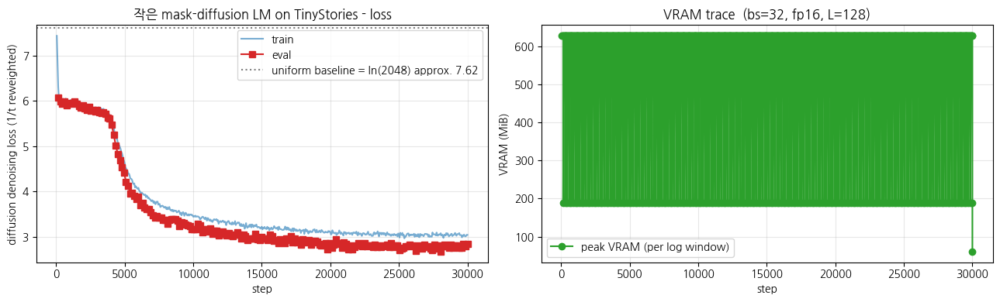

> ▶ **[Google Colab에서 이 장 실습 열기](https://colab.research.google.com/github/yoon-gu/neuqes-101/blob/master/32_diffusion_intro/32_diffusion_intro.ipynb)** — 브라우저에서 바로 실행해 볼 수 있습니다.

## 환경 셋업

```python
%pip install -q -U transformers tokenizers datasets accelerate
```

**▶ 실행 결과**

```text
   ━━━━━━━━━━━━━━━━━━━━━━━━━━━━━━━━━━━━━━━━ 11.2/11.2 MB 104.2 MB/s eta 0:00:00
   ━━━━━━━━━━━━━━━━━━━━━━━━━━━━━━━━━━━━━━━━ 555.1/555.1 kB 47.1 MB/s eta 0:00:00
   ━━━━━━━━━━━━━━━━━━━━━━━━━━━━━━━━━━━━━━━━ 389.2/389.2 kB 39.4 MB/s eta 0:00:00
   ━━━━━━╺━━━━━━━━━━━━━━━━━━━━━━━━━━━━━━━━━ 7.5/48.9 MB 226.8 MB/s eta 0:00:01
   ━━━━━━━━━━━━━━━━━━━━━━━━━━━━━━━━━━╸━━━━━ 42.8/48.9 MB 172.2 MB/s eta 0:00:01
   ━━━━━━━━━━━━━━━━━━━━━━━━━━━━━━━━━━━━━━━╸ 48.9/48.9 MB 160.7 MB/s eta 0:00:01
   ━━━━━━━━━━━━━━━━━━━━━━━━━━━━━━━━━━━━━━━╸ 48.9/48.9 MB 160.7 MB/s eta 0:00:01
   ━━━━━━━━━━━━━━━━━━━━━━━━━━━━━━━━━━━━━━━━ 48.9/48.9 MB 17.5 MB/s eta 0:00:00
```

```python
import warnings
warnings.filterwarnings("ignore")

import math
import os
import random
import time

import numpy as np
import pandas as pd
import matplotlib.pyplot as plt
import torch
import torch.nn as nn
import torch.nn.functional as F

# device 자동 감지 - Colab T4 / 로컬 MPS / CPU 모두 지원
if torch.cuda.is_available():
    device = torch.device("cuda")
    device_name = torch.cuda.get_device_name(0)
    vram_gib = torch.cuda.get_device_properties(0).total_memory / 1024**3
    print(f"device     : cuda  ({device_name})")
    print(f"VRAM total : {vram_gib:.2f} GiB")
elif torch.backends.mps.is_available():
    device = torch.device("mps")
    print("device     : mps  (Apple Silicon)")
else:
    device = torch.device("cpu")
    print("device     : cpu  (training will be very slow - Colab T4 recommended)")

print(f"torch      : {torch.__version__}")

# 재현성
SEED = 0
torch.manual_seed(SEED)
np.random.seed(SEED)
random.seed(SEED)

# fp16 은 CUDA 에서만 (MPS 는 미지원, CPU 는 의미 없음)
USE_FP16 = (device.type == "cuda")
print(f"use fp16   : {USE_FP16}")

# matplotlib 한글 폰트 (Colab — NanumGothic). plot 의 한국어가 □ 로 깨지지 않게.
import matplotlib.pyplot as plt, matplotlib.font_manager as fm, subprocess, os
_fp = "/usr/share/fonts/truetype/nanum/NanumGothic.ttf"
if not os.path.exists(_fp):
    subprocess.run("apt-get -qq -y install fonts-nanum", shell=True)
fm.fontManager.addfont(_fp)
plt.rcParams["font.family"] = "NanumGothic"
plt.rcParams["axes.unicode_minus"] = False
```

**▶ 실행 결과**

```text
device     : cuda  (Tesla T4)
VRAM total : 14.56 GiB
torch      : 2.11.0+cu128
use fp16   : True
```

## TinyStories 데이터 로드

Ch 24 (GPT) 와 *완전히 같은 데이터* — `roneneldan/TinyStories` (Eldan & Li 2023, arXiv:2305.07759). GPT-3.5 / GPT-4 가 *4세 어린이 어휘* 로 생성한 짧은 영어 동화. 어휘·문법이 단순해 작은 모델로도 의미 있는 생성이 가능합니다.

*데이터를 Ch 24 와 동일* 하게 둔 이유: 나중에 *같은 데이터에서 AR (Ch 24) vs Diffusion (본 챕터) 생성 방식만 다른* 비교를 하기 위함입니다.

학습 split 의 처음 **30,000 stories** 만 사용 (T4 30분 룰 안).

`roneneldan/TinyStories` 의 train 처음 10만 개, validation 500 개를 불러옵니다. 첫 story 의 앞부분을 출력해 어휘·문장이 단순한지 눈으로 확인합니다.

```python
from datasets import load_dataset

N_TRAIN = 100_000      # 더 길게 돌리려면 키우세요 (full 은 약 2.1M stories)
N_VAL   = 500

raw_train = load_dataset("roneneldan/TinyStories", split=f"train[:{N_TRAIN}]")
raw_val   = load_dataset("roneneldan/TinyStories", split=f"validation[:{N_VAL}]")
print("train:", raw_train)
print("val  :", raw_val)
print("\n=== sample story ===")
print(raw_train[0]["text"][:400])
```

**▶ 실행 결과**

```text
train: Dataset({
    features: ['text'],
    num_rows: 100000
})
val  : Dataset({
    features: ['text'],
    num_rows: 500
})

=== sample story ===
One day, a little girl named Lily found a needle in her room. She knew it was difficult to play with it because it was sharp. Lily wanted to …(뒤 71자 생략)

Lily went to her mom and said, "Mom, I found this needle. Can you share it with me and sew my shirt?" Her mom smiled and said, "Yes, Lily, w …(뒤 43자 생략)

To
```

## ByteLevel BPE 2048 직접 학습 + `[MASK]` 추가

Ch 19·24 처럼 TinyStories 코퍼스에 ByteLevel BPE 를 vocab 2,048 으로 직접 학습하고, `[PAD]`·`[UNK]`·`[MASK]` 특수 토큰을 더해 씁니다. 핵심은 `[MASK]` 토큰의 존재 (직접 학습이라 `special_tokens` 로 명시 추가).

```python
# 작은 모델엔 작은 vocab — TinyStories 에 BPE 2048 직접 학습 + [MASK] 추가
from tokenizers import Tokenizer, models, trainers, pre_tokenizers, decoders
from transformers import PreTrainedTokenizerFast
VOCAB = 2048
def corpus_iter(bs=1000):
    for i in range(0, len(raw_train), bs):
        yield raw_train[i:i+bs]["text"]
_tk = Tokenizer(models.BPE(unk_token="[UNK]"))
_tk.pre_tokenizer = pre_tokenizers.ByteLevel(add_prefix_space=True)
_tk.decoder = decoders.ByteLevel()
_tk.train_from_iterator(corpus_iter(), trainer=trainers.BpeTrainer(
    vocab_size=VOCAB, special_tokens=["[PAD]", "[UNK]", "[MASK]"]))
tokenizer = PreTrainedTokenizerFast(tokenizer_object=_tk, pad_token="[PAD]",
                                    unk_token="[UNK]", mask_token="[MASK]")
print(f"vocab_size : {tokenizer.vocab_size}")
print(f"[MASK]     : '{tokenizer.mask_token}'  id={tokenizer.mask_token_id}")
```

**위 코드 읽기** — `BpeTrainer` 의 `special_tokens=["[PAD]", "[UNK]", "[MASK]"]` 가 핵심입니다. 세 특수 토큰을 어휘 맨 앞에 고정 배정하므로 `[MASK]` 가 id 2 에 자리 잡고, 이 `[MASK]` 토큰이 forward(가리기)·reverse(생성) 양쪽의 캔버스가 됩니다.

```python
# [MASK] 가 섞인 시퀀스 = diffusion 의 노이즈. 일부를 가려본다
import random as _r; _r.seed(0)
sample = "Once upon a time, a little rabbit went to the forest."
enc = tokenizer(sample, add_special_tokens=False)["input_ids"]
md = enc[:]
for i in sorted(_r.sample(range(len(enc)), max(1, len(enc)//3))):
    md[i] = tokenizer.mask_token_id
print("\noriginal :", sample)
print("masked   :", tokenizer.decode(md))
```

**위 코드 읽기** — 문장 토큰의 약 1/3 (`len(enc)//3`) 을 골라 `tokenizer.mask_token_id` 로 치환합니다. `tokenizer.decode(md)` 결과가 바로 diffusion 의 중간 상태 $x_t$ — `[MASK]` 가 군데군데 섞인 시퀀스입니다.

**▶ 실행 결과**

```text
vocab_size : 2048
[MASK]     : '[MASK]'  id=2

original : Once upon a time, a little rabbit went to the forest.
masked   : [MASK] upon a time[MASK] a[MASK] rabbit went to the forest[MASK]
```

**관전 포인트** — `[MASK]` 가 섞인 시퀀스가 바로 diffusion 의 *중간 상태* $x_t$ 입니다. 학습은 *가려진 자리를 맞히는 것*, 생성은 *전부 `[MASK]` 에서 시작해 반복적으로 채우는 것*. Ch 20 의 MLM 과 토큰 수준에서는 똑같이 생겼습니다 — 차이는 *마스킹 비율* 과 *반복 횟수*.

## 토큰화 + `group_texts` (고정 길이 블록 스트림)

Ch 20·24 와 같은 전처리 패턴 — 전체 코퍼스를 토큰화해 이어 붙이고 `block_size=128` 단위로 자릅니다. 특수 토큰 (`[CLS]`, `[SEP]`) 은 넣지 않고 *순수 텍스트 스트림* 으로 만듭니다 (diffusion 은 문장 전체를 한 캔버스로 다루므로 경계 토큰이 불필요).

전체 코퍼스를 `add_special_tokens=False` 로 토큰화한 뒤 모든 토큰을 이어 붙여 `BLOCK_SIZE=128` 단위로 자릅니다. 학습엔 `input_ids` 만 남기는데, 마스킹은 매 배치 collator 가 새로 하기 때문입니다.

```python
BLOCK_SIZE = 128

def tokenize_fn(batch):
    # add_special_tokens=False - [CLS]/[SEP] 없이 순수 토큰 스트림
    return tokenizer(batch["text"], add_special_tokens=False)

tok_train = raw_train.map(tokenize_fn, batched=True, remove_columns=raw_train.column_names, desc="tokenize train")
tok_val   = raw_val.map(tokenize_fn,   batched=True, remove_columns=raw_val.column_names,   desc="tokenize val")

# group_texts - 모든 토큰을 이어붙여 BLOCK_SIZE 단위로 자름
def group_texts(batch):
    concatenated = {k: sum(batch[k], []) for k in batch.keys()}
    total_len = len(concatenated["input_ids"])
    total_len = (total_len // BLOCK_SIZE) * BLOCK_SIZE
    return {
        k: [t[i : i + BLOCK_SIZE] for i in range(0, total_len, BLOCK_SIZE)]
        for k, t in concatenated.items()
    }

lm_train = tok_train.map(group_texts, batched=True, desc="group train")
lm_val   = tok_val.map(group_texts,   batched=True, desc="group val")

# 학습엔 input_ids 만 필요 (마스킹은 collator 가 매번 새로 함)
lm_train = lm_train.remove_columns([c for c in lm_train.column_names if c != "input_ids"])
lm_val   = lm_val.remove_columns([c for c in lm_val.column_names if c != "input_ids"])

print(f"\ntrain chunks: {len(lm_train):,}  (block_size={BLOCK_SIZE})")
print(f"val   chunks: {len(lm_val):,}")
print(f"approx. train tokens: {len(lm_train) * BLOCK_SIZE / 1e6:.2f} M")
print("\nfirst chunk decode (first 200 chars):")
print(tokenizer.decode(lm_train[0]["input_ids"])[:200])
```

**▶ 실행 결과**

```text
train chunks: 189,030  (block_size=128)
val   chunks: 853
approx. train tokens: 24.20 M

first chunk decode (first 200 chars):
 One day, a little girl named Lily found a needle in her room. She knew it was difficult to play with it because it was sharp. Lily wanted t …(뒤 60자 생략)
```

## Diffusion collator — *가변 비율* 마스킹 직접 구현

여기가 BERT MLM 과 갈리는 지점입니다. Ch 20 은 `DataCollatorForLanguageModeling(mlm_probability=0.15)` 로 *고정 15%* 를 가렸지만, diffusion 은 **매 샘플마다 $t \sim U(\epsilon, 1)$ 을 뽑아 그 비율로** 가립니다.

- 각 토큰을 *독립적으로 확률 $t$* 로 `[MASK]` 치환 (LLaDA 의 forward process 와 동일)
- `labels`: 가려진 자리는 원본 토큰 id, 나머지는 `-100` (Ch 20 의 `-100` 트릭 그대로)
- `t`: $1/t$ 재가중을 위해 샘플별 비율도 함께 반환

`add_special_tokens=False` 로 토큰화했으므로 시퀀스 안에 특수 토큰이 없어 *모든 자리가 마스킹 가능* 합니다.

```python
class DiffusionCollator:
    '''매 배치마다 t ~ U(eps, 1) 을 뽑아 그 비율로 토큰을 [MASK] 치환.'''

    def __init__(self, tokenizer, eps=0.02, seed=42):
        self.mask_id = tokenizer.mask_token_id
        self.eps = eps
        self.gen = torch.Generator().manual_seed(seed)

    def __call__(self, examples):
        ids = torch.tensor([e["input_ids"] for e in examples], dtype=torch.long)
        B, L = ids.shape

        # 샘플별 마스킹 비율 t ~ U(eps, 1)
        t = torch.rand(B, generator=self.gen) * (1.0 - self.eps) + self.eps          # (B,)

        # 각 토큰을 독립적으로 확률 t 로 마스킹
        mask = torch.rand(B, L, generator=self.gen) < t.unsqueeze(1)                  # (B, L) bool
        # 적어도 한 자리는 가리도록 보정 (t 가 아주 작아 전부 안 가려진 경우 방지)
        no_mask_rows = ~mask.any(dim=1)
        if no_mask_rows.any():
            j = torch.randint(0, L, (int(no_mask_rows.sum()),), generator=self.gen)
            mask[no_mask_rows, j] = True

        input_ids = ids.clone()
        input_ids[mask] = self.mask_id
        labels = ids.clone()
        labels[~mask] = -100                                     # 가린 자리만 학습 신호

        attention_mask = torch.ones(B, L, dtype=torch.long)
        return {"input_ids": input_ids, "attention_mask": attention_mask,
                "labels": labels, "t": t}


diff_collator = DiffusionCollator(tokenizer)
```

**위 코드 읽기** — 샘플마다 `t = torch.rand(B) * (1 - eps) + eps` 로 마스킹 비율을 새로 뽑고, `torch.rand(B, L) < t` 로 각 토큰을 독립적으로 확률 $t$ 만큼 가립니다 (LLaDA 의 forward process). `labels[~mask] = -100` 으로 가린 자리만 학습 신호로 남기고, `1/t` 재가중을 위해 비율 `t` 도 함께 반환하는 것이 BERT MLM collator 와 갈리는 지점입니다.

```python
# collator 출력 확인 - 같은 두 chunk 를 여러 번 돌리면 매번 다른 비율로 가려짐
print("=== diffusion collator demo (same 2 chunks, masking ratio varies each call) ===")
for trial in range(3):
    batch = diff_collator([lm_train[0], lm_train[1]])
    labels = batch["labels"]
    t = batch["t"]
    for b in range(labels.shape[0]):
        n_masked = (labels[b] != -100).sum().item()
        frac = 100 * n_masked / labels.shape[1]
        print(f"trial {trial} | sample {b}: t={t[b]:.3f}  ->  masked {n_masked:>3d}/{labels.shape[1]} ({frac:5.1f}%)")
    print()
```

**▶ 실행 결과**

```text
=== diffusion collator demo (same 2 chunks, masking ratio varies each call) ===
trial 0 | sample 0: t=0.885  ->  masked 111/128 ( 86.7%)
trial 0 | sample 1: t=0.917  ->  masked 119/128 ( 93.0%)

trial 1 | sample 0: t=0.756  ->  masked  98/128 ( 76.6%)
trial 1 | sample 1: t=0.732  ->  masked  98/128 ( 76.6%)

trial 2 | sample 0: t=0.937  ->  masked 121/128 ( 94.5%)
trial 2 | sample 1: t=0.046  ->  masked   9/128 (  7.0%)
```

**결과 해석**

같은 두 chunk 인데 호출마다 마스킹 비율이 7.0% (`t=0.046`) 부터 94.5% (`t=0.937`) 까지 크게 출렁입니다. 한 chunk 가 step 마다 *다른 난이도* 로 가려지므로 모델이 모든 마스킹 비율의 복원을 골고루 학습합니다.

**관전 포인트** — Ch 20 MLM collator 가 *항상 약 15%* 를 가렸다면, 이 collator 는 *호출마다 0-100% 사이 아무 값* 으로 가립니다. 같은 chunk 가 어떤 step 엔 5% 만, 다른 step 엔 90% 가려진 채 학습됩니다 → 모델이 *모든 난이도의 복원* 을 골고루 학습 → 생성 시 *어떤 마스킹 비율에서도* denoise 가능.

> **`-100` thread**: 가려진 자리만 `labels`, 나머지는 `-100`. Ch 20 (MLM 15%) → Ch 28 (SFT, prompt 만 `-100`) → 본 챕터 (가변 마스킹) — 같은 트릭의 세 번째 변주.

## 작은 BERT-style 모델 from scratch

diffusion 의 본체는 *bidirectional encoder* — 가려진 자리를 *좌·우 양방향 문맥* 으로 복원해야 하니 BERT 계열이 자연스럽습니다. `BertForMaskedLM` 을 *random init* 으로 작게 띄웁니다 (Ch 20 의 작은 BERT 와 같은 패턴).

- `num_hidden_layers=4, num_attention_heads=4, hidden_size=256` → 약 3.79M params (작은 vocab 2048 덕분에 임베딩도 가벼움)
- `max_position_embeddings = BLOCK_SIZE = 128`
- MLM head (`Linear(H, V)`) 가 *가려진 자리의 토큰 분포* 를 출력 — 이게 곧 diffusion 의 denoiser

### GPT (Ch 24) 와 코드로 갈리는 곳

- `GPT2LMHeadModel` 이 아니라 `BertForMaskedLM` — *causal mask 없는 bidirectional attention*
- 같은 `from_pretrained` 없이 `BertForMaskedLM(config)` random init — Ch 20·22 와 동일

`BertForMaskedLM` 을 `from_pretrained` 없이 `config` 만으로 random init 합니다. `hidden_size=256`, 레이어 4 개, 작은 vocab 2048 덕분에 약 3.79M 파라미터로 가볍고, bidirectional encoder + MLM head 가 diffusion 의 denoiser 역할을 합니다.

```python
from transformers import BertConfig, BertForMaskedLM

config = BertConfig(
    vocab_size=tokenizer.vocab_size,
    hidden_size=256,
    num_hidden_layers=4,
    num_attention_heads=4,
    intermediate_size=1024,
    max_position_embeddings=BLOCK_SIZE,
    pad_token_id=tokenizer.pad_token_id,
)

model = BertForMaskedLM(config).to(device)
n_params = model.num_parameters()
print(f"#params           : {n_params/1e6:.2f} M")
print(f"vocab_size        : {config.vocab_size}")
print(f"\nmodel: {type(model).__name__}")
print(f"  - body : {type(model.bert).__name__}  (Encoder, bidirectional attention)")
print(f"  - head : MLM head -> Linear(in={config.hidden_size}, out={config.vocab_size})")
```

**▶ 실행 결과**

```text
#params           : 3.79 M
vocab_size        : 2048

model: BertForMaskedLM
  - body : BertModel  (Encoder, bidirectional attention)
  - head : MLM head -> Linear(in=256, out=2048)
```

## Reverse process — 병렬 denoise 생성 함수

diffusion 생성의 핵심. **전부 `[MASK]` 인 시퀀스에서 시작**해 여러 step 에 걸쳐 점점 진짜 토큰으로 채웁니다 (LLaDA 의 *low-confidence remasking* 방식):

1. 현재 `[MASK]` 자리들을 모델이 *한꺼번에* 예측 (병렬!)
2. 각 예측의 *confidence* (softmax 최대 확률) 계산
3. *확신 높은* 자리부터 확정, *확신 낮은* 자리는 다시 `[MASK]` 로 남김
4. 스케줄에 따라 남기는 `[MASK]` 수를 step 마다 줄여 마지막엔 0개

GPT 의 *왼→오 순차* 와 결정적으로 다른 점: **채우는 순서가 위치가 아니라 confidence 순** — 문장 중간이나 끝 단어가 앞 단어보다 먼저 확정될 수 있습니다.

매 step 마다 `[MASK]` 자리를 한꺼번에 예측하고, top-k 샘플링으로 토큰을 뽑은 뒤 각 자리의 confidence (softmax 최대 확률) 를 잽니다. 선형 스케줄로 *남길 `[MASK]` 수* (`n_remain`) 를 step 마다 줄이되, confidence 가 낮은 자리를 `topk(..., largest=False)` 로 골라 다시 `[MASK]` 로 되돌립니다 — 확신 높은 자리부터 확정되는 low-confidence remasking 입니다. `prompt_ids` 를 주면 그 앞부분을 `fixed` 로 표시해 절대 마스킹하지 않습니다 (조건부 생성).

```python
@torch.no_grad()
def diffusion_generate(active_model, length=64, steps=16, temperature=1.0, top_k=50,
                       prompt_ids=None, record_trajectory=False):
    '''전부 [MASK] 에서 시작해 steps 번 denoise. prompt_ids 를 주면 앞부분 고정 (조건부 생성).

    기본은 sampling (temperature>0). temperature=0 으로 두면 greedy 인데,
    작은 모델 + 전부-[MASK] 출발에서는 greedy 가 최빈 토큰('.')만 뽑는 *collapse* 가 잘 일어나
    sampling 을 기본값으로 둡니다 (아래 한계 노트 참고).'''
    active_model.eval()
    dev = active_model.device
    mask_id = tokenizer.mask_token_id

    x = torch.full((1, length), mask_id, dtype=torch.long, device=dev)
    fixed = torch.zeros(length, dtype=torch.bool, device=dev)   # 절대 마스킹 안 할 자리 (prompt)
    if prompt_ids is not None:
        p = torch.tensor(prompt_ids[:length], device=dev)
        x[0, :len(p)] = p
        fixed[:len(p)] = True
    n_gen = int((~fixed).sum().item())                          # 생성해야 할 자리 수

    traj = []
    for step in range(steps):
        logits = active_model(input_ids=x).logits[0]            # (L, V)
        probs = logits.softmax(dim=-1)
        if temperature > 0:
            scaled = logits / temperature
            if top_k > 0:                                       # top-k 로 후보 제한
                kth = scaled.topk(top_k, dim=-1).values[:, -1, None]
                scaled = scaled.masked_fill(scaled < kth, float("-inf"))
            pred = torch.multinomial(scaled.softmax(-1), 1).squeeze(-1)
            conf = probs.gather(-1, pred.unsqueeze(-1)).squeeze(-1)
        else:
            conf, pred = probs.max(dim=-1)                      # greedy (최빈 토큰 collapse 주의)

        is_mask = (x[0] == mask_id) & (~fixed)                  # 지금 마스킹된 (생성 대상) 자리
        # 일단 마스킹된 자리를 예측으로 채운 잠정 시퀀스
        x_new = torch.where(is_mask, pred, x[0])

        # 이 step 이 끝났을 때 남겨둘 [MASK] 수 (선형 스케줄: n_gen -> 0)
        n_remain = int(round(n_gen * (1.0 - (step + 1) / steps)))
        if n_remain > 0:
            # 마스킹됐던 자리들 중 confidence 가 낮은 n_remain 개를 다시 [MASK] 로
            conf_masked = conf.clone()
            conf_masked[~is_mask] = float("inf")               # 마스킹 안 됐던 자리는 후보에서 제외
            remask_idx = conf_masked.topk(n_remain, largest=False).indices
            x_new[remask_idx] = mask_id

        x[0] = x_new
        if record_trajectory:
            traj.append(x[0].clone())

    text = tokenizer.decode(x[0], skip_special_tokens=True)
    return (text, traj) if record_trajectory else text
```

## 학습 *전* denoise - 비교 기준선 (random init baseline)

학습 전 모델은 가려진 자리를 *균등 추측* 하니, denoise 결과가 *의미 없는 토큰 나열* 이 나옵니다. 학습 후와 나란히 비교하기 위한 기준선 (Ch 20·22 의 *사전학습 전 [MASK] top-5*, Ch 24 의 *학습 전 generation* 과 같은 역할).

학습 전 random init 모델로 전부 `[MASK]` 에서 denoise 를 돌려 비교 기준선을 만듭니다. logits 가 무작위라 confidence 순서도 무의미합니다.

```python
torch.manual_seed(SEED)
print("=" * 70)
print("UNTRAINED model - parallel denoise from all-[MASK]")
print("=" * 70)
for i in range(3):
    text = diffusion_generate(model, length=48, steps=16)
    print(f"\n[sample {i}] {text}")
```

**▶ 실행 결과**

```text
======================================================================
UNTRAINED model - parallel denoise from all-[MASK]
======================================================================
[sample 0]  together block mommy smo mommyblem warely� picturesndergetheranced fellday Emnder cars greendren pictures waitoomced squirrel sa …(뒤 103자 생략)

[sample 1]  him pret birthday smoow Jimmy belie You birthday mommy pictures mommy sc sk birthday gre sc mommy skho birthday ha7 wait mail mo …(뒤 112자 생략)

[sample 2] aduched mommy smo explainedriesdayelyely gre mommypblem sk goodbye grender mommy�ho birthdayblemblem waitred pictures mommynderar …(뒤 96자 생략)
```

**관전 포인트** - 학습 전엔 *영어 문장과 거리가 먼 토큰 나열*. logits 가 random 이라 confidence 순서도 무의미. 학습 후 같은 함수로 다시 생성해 비교하면 *diffusion 학습이 본체에 무엇을 새겼는가* 가 드러납니다.

## `Trainer` 로 diffusion 학습 — `1/t` 재가중 loss

BERT/GPT 챕터들과 같은 `Trainer` 패턴이지만, *loss 를 직접 정의* 합니다. `BertForMaskedLM` 의 기본 loss 는 *가려진 자리 CE 평균* 인데, diffusion 은 거기에 *샘플별 `1/t` 재가중* 을 더해야 합니다 (`compute_loss` 오버라이드).

- `DiffusionCollator` → 매 배치 가변 마스킹 + `t` 반환
- `compute_loss` → 가려진 자리 CE 를 샘플별로 합산해 `1/t` 곱한 뒤 평균
- `max_steps=30000`, `batch_size=64`, `fp16=True` - T4 약 19분

`Trainer` 를 상속해 `compute_loss` 만 오버라이드합니다. 가린 자리 CE 를 샘플별로 합산해 `/L` 로 정규화한 뒤 `/t` 로 나눠 평균하므로 `sum/(t·L)` — 이 `1/t` 재가중이 LLaDA / MDLM 의 denoising 목표와 일치하는 핵심입니다. `remove_unused_columns=False` 로 둬야 collator 가 만든 `labels`·`t` 가 보존됩니다.

```python
from transformers import Trainer, TrainingArguments, TrainerCallback


class DiffusionTrainer(Trainer):
    '''masked-diffusion loss: 가려진 자리 CE 를 샘플별로 1/t 재가중.'''

    def compute_loss(self, model, inputs, return_outputs=False, **kwargs):
        t = inputs["t"]                                          # (B,)
        labels = inputs["labels"]                               # (B, L)
        outputs = model(input_ids=inputs["input_ids"],
                        attention_mask=inputs["attention_mask"])
        logits = outputs.logits                                 # (B, L, V)
        B, L, V = logits.shape

        per_tok = F.cross_entropy(
            logits.view(-1, V), labels.view(-1),
            ignore_index=-100, reduction="none",
        ).view(B, L)                                            # 가린 자리만 비-0 (나머지 -100 -> 0)

        # 샘플별: (가린 자리 CE 합 / L) * (1/t)
        per_ex = per_tok.sum(dim=1) / L
        loss = (per_ex / t.to(per_ex.dtype)).mean()
        return (loss, outputs) if return_outputs else loss


args = TrainingArguments(
    output_dir="./out_diffusion_intro",
    max_steps=30000,
    per_device_train_batch_size=64,
    per_device_eval_batch_size=64,
    learning_rate=3e-4,
    weight_decay=0.01,
    warmup_steps=500,
    lr_scheduler_type="cosine",
    max_grad_norm=1.0,
    fp16=USE_FP16,                       # T4 는 bf16 불가
    logging_steps=50,
    eval_strategy="steps",
    eval_steps=150,
    save_strategy="no",
    report_to="none",
    label_names=["labels"],
    remove_unused_columns=False,         # 'labels','t' 를 collator 가 만들므로 보존
    seed=SEED,
)


class VRAMCallback(TrainerCallback):
    def __init__(self):
        self.steps, self.peak_MiB = [], []

    def on_train_begin(self, args, state, control, **kwargs):
        if torch.cuda.is_available():
            torch.cuda.reset_peak_memory_stats()

    def on_log(self, args, state, control, logs=None, **kwargs):
        if torch.cuda.is_available():
            self.steps.append(state.global_step)
            self.peak_MiB.append(torch.cuda.max_memory_allocated() / 1024**2)
            torch.cuda.reset_peak_memory_stats()


vram_cb = VRAMCallback()

trainer = DiffusionTrainer(
    model=model,
    args=args,
    train_dataset=lm_train,
    eval_dataset=lm_val,
    data_collator=diff_collator,
    callbacks=[vram_cb],
)

t0 = time.time()
train_out = trainer.train()
elapsed = time.time() - t0

print(f"\n=== training summary ===")
print(f"elapsed       : {elapsed/60:.2f} min")
print(f"global_step   : {train_out.global_step}")
print(f"train_loss    : {train_out.training_loss:.4f}")
print(f"random baseline (ln vocab): {math.log(tokenizer.vocab_size):.4f}")
if torch.cuda.is_available():
    print(f"final peak    : {torch.cuda.max_memory_allocated()/1024**2:.0f} MiB")
```

**▶ 실행 결과**

```text
Step  Training Loss  Validation Loss
150   6.318974       6.076561
300   6.000884       5.984904
450   6.034770       5.940513
600   6.037456       5.983530
750   6.035674       5.911528
900   6.002484       5.959517
1050  6.016628       5.933353
1200  6.004080       5.960937
1350  6.006253       5.986746
1500  5.993685       5.939088
1650  5.955823       5.892183
1800  5.893921       5.856411
1950  5.935217       5.909029
2100  5.902555       5.839764
2250  5.890554       5.807137
2400  5.879833       5.863660
2550  5.869924       5.783618
2700  5.858630       5.809538
2850  5.858030       5.762398
3000  5.840210       5.799540
3150  5.830164       5.743761
3300  5.812802       5.734538
3450  5.828159       5.749054
3600  5.796339       5.714172
3750  5.742477       5.629999
3900  5.689541       5.610894
4050  5.598824       5.479949
4200  5.404088       5.255626
4350  5.237758       5.013110
4500  5.074538       4.825572
...
=== training summary ===
elapsed       : 18.36 min
global_step   : 30000
train_loss    : 3.6868
random baseline (ln vocab): 7.6246
final peak    : 61 MiB
```

**결과 해석**

train_loss 3.69 가 random baseline `ln(2048)=7.62` 의 절반 아래로 내려갔으니 가린 자리를 문맥으로 복원하는 능력이 본체에 새겨졌습니다. T4 약 18분, peak VRAM 61 MiB 로 30분 룰 안에 가볍게 들어옵니다.

학습 로그에서 train·eval loss 와 step별 peak VRAM 을 뽑아 나란히 그립니다. 점선은 `ln(vocab)` uniform baseline 으로, loss 가 그 아래로 얼마나 내려갔는지 한눈에 보여줍니다.

```python
# loss curve + VRAM trace
log = trainer.state.log_history
train_pts = [(r["step"], r["loss"]) for r in log if "loss" in r and "eval_loss" not in r]
eval_pts  = [(r["step"], r["eval_loss"]) for r in log if "eval_loss" in r]

fig, (ax1, ax2) = plt.subplots(1, 2, figsize=(13, 4))

ax1.plot([s for s, _ in train_pts], [l for _, l in train_pts], "-",
         color="tab:blue", alpha=0.6, label="train")
if eval_pts:
    ax1.plot([s for s, _ in eval_pts], [l for _, l in eval_pts], "s-",
             color="tab:red", label="eval")
ax1.axhline(math.log(tokenizer.vocab_size), ls=":", color="gray",
            label=f"uniform baseline = ln({tokenizer.vocab_size}) approx. {math.log(tokenizer.vocab_size):.2f}")
ax1.set_xlabel("step"); ax1.set_ylabel("diffusion denoising loss (1/t reweighted)")
ax1.set_title("작은 mask-diffusion LM on TinyStories - loss")
ax1.grid(True, alpha=0.3); ax1.legend()

if vram_cb.steps:
    ax2.plot(vram_cb.steps, vram_cb.peak_MiB, "o-", color="tab:green",
             label="peak VRAM (per log window)")
    ax2.set_title(f"VRAM trace  (bs=32, fp16, L={BLOCK_SIZE})")
else:
    ax2.text(0.5, 0.5, "VRAM trace 는 CUDA 에서만 제공",
             ha="center", va="center", transform=ax2.transAxes)
    ax2.set_title("VRAM trace - CUDA 에서만")
ax2.set_xlabel("step"); ax2.set_ylabel("VRAM (MiB)")
ax2.grid(True, alpha=0.3); ax2.legend()

plt.tight_layout(); plt.show()
```

**▶ 실행 결과**



**결과 해석**

왼쪽 loss 곡선은 약 7.6 (uniform baseline) 에서 시작해 가파르게 떨어진 뒤 약 3.7 부근에서 안정화되고, train·eval 이 거의 겹쳐 과적합 없이 학습이 진행됐음을 보여줍니다. 오른쪽 VRAM 추이는 학습 내내 수십 MiB 수준에 머물러 T4 메모리에 여유가 큽니다.

**관전 포인트** - `1/t` 재가중 덕분에 첫 step loss 가 약 7.6 (`ln(2048)`) 부근에서 시작 (직접 학습한 BPE 2048 의 random baseline 과 같은 값!). 빠르게 떨어져 30000 step 끝에 *약 3.7* 부근에서 안정화되면 정상. 작은 모델 + TinyStories 라 완벽하진 않지만 *가려진 자리를 문맥으로 복원* 하는 능력이 본체에 새겨집니다.

## 학습 *후* denoise + 궤적 시각화

같은 `diffusion_generate` 로 학습 후 생성하고, **denoise 궤적** (각 step 의 시퀀스) 을 출력해 *마스크가 단어로 채워지는 과정* 을 직접 봅니다. 이게 이 챕터의 하이라이트 — GPT 의 왼→오 순차와 달리, *문장 전체가 동시에 흐릿하게 떠오르다 선명해지는* 모습.

```python
torch.manual_seed(SEED)
print("=" * 70)
print("TRAINED model - parallel denoise from all-[MASK]")
print("=" * 70)
for i in range(3):
    text = diffusion_generate(model, length=48, steps=16)
    print(f"\n[sample {i}] {text}")
```

**▶ 실행 결과**

```text
======================================================================
TRAINED model - parallel denoise from all-[MASK]
======================================================================

[sample 0]  and go in their house. Sam are scared. They want to play Tim and Mia. They want to climb it.

"See, Sam, Sam, Sam!" Tom says.

"Oh you!" Tom and Sam
[sample 1]  him angry. He did not like the boy. He did not listen. He. He was scared and angry. He did not care.

The boy was very sad. He. He wanted to help the boy. He did not

[sample 2] . They are good other and hug. They
They are happy. They. They smile. They hug each other. They hug each other. They are friends.. They They are best friends. They are happy. They hug. Mom
```

`record_trajectory=True` 로 각 step 의 시퀀스를 모두 저장한 뒤, 일부 step 을 골라 아직 `[MASK]` 인 자리는 `____` 로 표시해 출력합니다. 마스크가 단어로 채워지는 과정을 step 별로 직접 볼 수 있습니다.

```python
# denoise 궤적 - [MASK] 가 단어로 채워지는 과정을 step 별로
torch.manual_seed(SEED)
text, traj = diffusion_generate(model, length=40, steps=12, record_trajectory=True)

def render(ids):
    toks = tokenizer.convert_ids_to_tokens(ids.tolist())
    return " ".join("____" if tk == tokenizer.mask_token else tk for tk in toks)

print("=" * 78)
print("DENOISE TRAJECTORY  ('____' = still [MASK])  - filled in parallel, by confidence")
print("=" * 78)
n_steps = len(traj)
for step in [0, n_steps // 4, n_steps // 2, 3 * n_steps // 4, n_steps - 1]:
    n_mask = (traj[step] == tokenizer.mask_token_id).sum().item()
    print(f"\nstep {step:>2d}/{n_steps-1}  ([MASK] remaining: {n_mask:>2d})")
    print("  " + render(traj[step]))

print("\n" + "=" * 78)
print("FINAL:", text)
```

**▶ 실행 결과**

```text
==============================================================================
DENOISE TRAJECTORY  ('____' = still [MASK])  - filled in parallel, by confidence
==============================================================================

step  0/11  ([MASK] remaining: 37)
  ____ ____ ____ ____ ____ ____ ____ ____ ____ . ____ ____ ____ ____ Ġand ____ ____ ____ ____ ____ ____ ____ ____ . ____ ____ ____ ____ ____ …(뒤 55자 생략)

step  3/11  ([MASK] remaining: 27)
  Ċ They Ġand ____ ____ ____ ____ ____ ____ . ĠThey Ġlikes Ġto ____ Ġand ____ ____ ____ ____ ____ ____ ____ ____ . ĠThey ____ ____ ____ ____ …(뒤 53자 생략)

step  6/11  ([MASK] remaining: 17)
  Ċ They Ġand ____ . ĠThey ____ ____ ____ . ĠThey Ġlikes Ġto Ġplay Ġand Ġplay . . ĠThey ____ ____ ____ ____ . ĠThey ____ ____ ____ ____ . __ …(뒤 43자 생략)

step  9/11  ([MASK] remaining:  7)
  Ċ They Ġand Ġsmile . ĠThey ____ ____ ____ . ĠThey Ġlikes Ġto Ġplay Ġand Ġplay . . ĠThey ____ ____ Ġand Ġball . ĠThey Ġrun Ġafter Ġthe Ġbal …(뒤 54자 생략)

step 11/11  ([MASK] remaining:  0)
  Ċ They Ġand Ġsmile . ĠThey Ġplay Ġtogether Ġit . ĠThey Ġlikes Ġto Ġplay Ġand Ġplay . . ĠThey Ġmake Ġball Ġand Ġball . ĠThey Ġrun Ġafter Ġt …(뒤 62자 생략)

==============================================================================
FINAL: 
They and smile. They play together it. They likes to play and play.. They make ball and ball. They run after the ball. Spot and hug. They are good friends. They
```

**결과 해석**

step 0 에서 37개가 `[MASK]` 인데, 채워지는 자리가 왼쪽부터가 아니라 confidence 가 높은 곳부터라 문장 중간·끝 단어가 앞보다 먼저 떠오릅니다. step 이 진행되며 남은 `[MASK]` 수가 37 → 27 → 17 → 7 → 0 으로 줄어, 전체 문장이 동시에 흐릿하게 떠오르다 선명해지는 것이 GPT 의 왼→오 순차 생성과 결정적으로 다른 점입니다.

**해석 가이드 - 이게 autoregressive 와 결정적으로 다른 점**

- **step 0**: 거의 전부 `____` (`[MASK]`). 모델이 *가장 확신하는* 몇 자리만 먼저 채워짐 — *위치 순서가 아니라 confidence 순서*. 문장 끝/중간 단어가 앞보다 먼저 나타날 수 있음.
- **중간 step**: 단어들이 *여기저기 동시에* 떠오름. GPT 라면 왼쪽부터 한 칸씩 채워졌을 자리가, diffusion 에선 *전 영역이 함께* 선명해짐.
- **마지막 step**: 모든 `[MASK]` 가 채워진 완성 문장.

> Ch 24 의 GPT generation 이 *왼→오 받아쓰기* 였다면, 여기선 *흐릿한 전체 그림을 반복적으로 다듬기*. 같은 TinyStories 데이터, 같은 "다음 단어가 뭘까" 직관이지만 *생성 메커니즘이 근본적으로 다릅니다.*

## 솔직한 이야기 — 생성은 되지만 *반복* 이 보인다

학습이 끝난 모델은 전부 `[MASK]` 에서 출발해도 *영어 동화* 를 만들어냅니다 — 인물·대화·배경이 있는 문장이 병렬 denoise 로 채워집니다. 다만 자세히 읽어 보면 **같은 조각이 반복** 되는 게 눈에 띕니다.

> *"Once upon a time, there was a **a** boy named **named** Timmy. ... They are happy friends and happy. They are **to play and play**."*

`named named`, `was a was a`, `play and play` 처럼요. 이건 *모델이 잘못 배운 게 아닙니다.* 고정-$t$(0.15) 복원 정확도가 0.7 안팎까지 오른, 조건부 구조를 제대로 익힌 모델입니다. 반복의 원인은 **샘플러** 에 있습니다.

- 이 챕터의 기본 샘플러는 매 step *confidence 가 높은 자리를 채우고 낮은 자리를 다시 `[MASK]`* 로 두는 방식인데, 한번 "안전한" 고빈도 토큰(`a`, `the`, 자주 나오는 이름)이 높은 confidence 를 받으면 그 토큰이 거듭 뽑히기 쉽습니다.
- 즉 *모델의 확률 분포는 멀쩡한데, 거기서 문장을 어떻게 뽑아내느냐* 가 아직 거친 것입니다.

> 그래서 **다음 Ch 33 은 모델은 그대로 두고 샘플러만 바꿉니다** — carry-over semi-AR + 반복 억제(temperature·top-p·repetition penalty·인접 중복 금지)로 이 반복을 잡아 한결 깔끔한 생성을 얻습니다. 이 챕터에서 "diffusion 이 글을 만든다"를 확인했다면, 다음 챕터는 "그 글을 더 잘 뽑아낸다"입니다.
